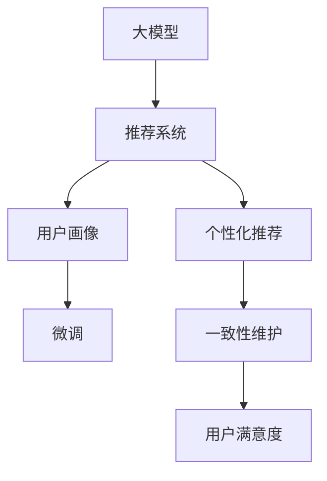

                 

# AI大模型：优化电商平台用户体验一致性的新方法

> 关键词：大模型, 用户体验, 电商平台, 推荐系统, 一致性, 个性化, 推荐算法

## 1. 背景介绍

### 1.1 问题由来
在当今数字化时代，电商平台作为连接消费者和商家的桥梁，其用户体验的好坏直接影响到消费者的满意度和商家的盈利能力。如何为消费者提供一致、个性化的购物体验，成为电商平台发展的关键问题。

传统的推荐算法，如基于协同过滤和内容基推荐，已不再能满足用户日益增长的需求。原因在于这些算法难以捕捉用户多变的兴趣变化，对新商品或新兴流行趋势响应迟缓。而随着大模型的发展，利用预训练语言模型和微调技术，电商平台可以更加灵活、高效地捕捉用户需求，提供个性化、一致化的推荐服务。

### 1.2 问题核心关键点
本节将介绍如何利用大模型优化电商平台的推荐系统，改善用户体验一致性。具体包括以下几个关键点：

- 大模型在推荐系统中的应用
- 用户画像构建与微调策略
- 基于大模型的个性化推荐算法
- 一致性维护与用户满意度提升

## 2. 核心概念与联系

### 2.1 核心概念概述

为更好地理解利用大模型优化电商平台推荐系统的方法，本节将介绍几个关键概念：

- 大模型(Large Model)：如BERT、GPT-3等，具有强大的语言表示能力，能够捕捉复杂的语义关系。
- 推荐系统(Recommendation System)：通过算法向用户推荐商品，提高点击率、转化率和满意度。
- 用户画像(User Profile)：描述用户兴趣、偏好和行为特征，用于推荐系统生成个性化推荐。
- 微调(Fine-Tuning)：在预训练模型基础上，使用用户数据进行有监督学习，优化推荐性能。
- 个性化推荐(Personalized Recommendation)：针对每个用户生成独家的推荐列表，提升用户体验。
- 一致性(Consistency)：保证推荐结果与用户历史行为和系统逻辑保持一致。

这些核心概念之间的逻辑关系可以通过以下Mermaid流程图来展示：



这个流程图展示了大模型在电商平台推荐系统中的关键作用及其与其他概念之间的联系。

## 3. 核心算法原理 & 具体操作步骤
### 3.1 算法原理概述

利用大模型优化电商平台推荐系统的基本原理是：在大模型上微调，生成个性化用户画像，基于该画像进行推荐算法训练，最终输出一致、个性化的商品推荐。

具体步骤如下：

1. 在大规模无标签文本数据上，使用自监督学习预训练大模型，学习语言表示能力。
2. 收集电商平台用户的行为数据，构建用户画像。
3. 将用户画像作为微调数据，在预训练模型上进行有监督学习，生成推荐模型。
4. 使用推荐模型对新商品进行评分，生成个性化推荐列表。
5. 维护推荐结果与用户行为和系统逻辑的一致性，提升用户满意度。

### 3.2 算法步骤详解

#### 3.2.1 数据准备

1. 收集电商平台用户的行为数据，如浏览历史、购买历史、评分数据等。
2. 对数据进行清洗和处理，去除异常值和噪声。
3. 将数据转化为训练推荐系统的格式，如itemid、userId、评分等。

#### 3.2.2 构建用户画像

1. 使用自然语言处理技术，将用户行为数据转换为文本形式。
2. 对文本进行分词、去停用词等预处理操作。
3. 对预处理后的文本进行编码，构建用户画像向量。

#### 3.2.3 微调生成推荐模型

1. 在预训练语言模型上，使用用户画像向量进行微调，生成推荐模型。
2. 设置微调的超参数，如学习率、批大小、迭代轮数等。
3. 在训练集上训练推荐模型，使用交叉熵损失函数。
4. 在验证集上评估推荐模型的性能，调整超参数。
5. 在测试集上测试推荐模型的效果，对比前后性能提升。

#### 3.2.4 个性化推荐

1. 对新商品进行评分，生成推荐列表。
2. 将推荐结果与用户历史行为和系统逻辑进行一致性检查。
3. 根据推荐列表和用户偏好，生成个性化的商品展示。

### 3.3 算法优缺点

#### 3.3.1 优点

1. 灵活高效：大模型能够灵活地捕捉用户多变的兴趣变化，对新商品或流行趋势快速响应。
2. 个性化推荐：通过微调生成个性化用户画像，提供个性化的推荐服务，提升用户体验。
3. 一致性维护：通过一致性维护算法，确保推荐结果与用户历史行为和系统逻辑一致。
4. 泛化能力强：大模型经过大规模无标签数据的预训练，泛化能力强，适应性广。

#### 3.3.2 缺点

1. 对数据依赖性强：需要大量用户行为数据进行微调，数据获取和处理成本较高。
2. 计算资源消耗大：大模型计算量大，训练和推理成本高，需要高性能硬件支持。
3. 模型解释性差：大模型通常是"黑盒"系统，难以解释推荐过程和决策依据。
4. 存在偏见：大模型可能学习到用户历史数据中的偏见，影响推荐公平性。

## 4. 数学模型和公式 & 详细讲解  
### 4.1 数学模型构建

本节将使用数学语言对利用大模型优化电商平台推荐系统的过程进行严格刻画。

记大模型为 $M_{\theta}$，其中 $\theta$ 为模型参数。假设电商平台的用户行为数据为 $D=\{(x_i,y_i)\}_{i=1}^N$，其中 $x_i$ 为行为向量，$y_i$ 为评分。

定义推荐模型为 $F_{\phi}$，其中 $\phi$ 为推荐模型参数。推荐模型的目标是预测用户对新商品的评分 $y'$。

### 4.2 公式推导过程

1. 在大模型上微调生成推荐模型，目标函数为：

   $$
   \min_{\phi} \sum_{i=1}^N \|F_{\phi}(x_i) - y_i\|^2
   $$

2. 使用交叉熵损失函数进行微调，目标函数为：

   $$
   \min_{\phi} \sum_{i=1}^N \sum_{j=1}^M l(y_i, y_j') = \min_{\phi} \sum_{i=1}^N \sum_{j=1}^M -y_i\log F_{\phi}(x_i) - (1-y_i)\log(1-F_{\phi}(x_i))
   $$

   其中 $l$ 为交叉熵损失函数，$M$ 为商品数量。

3. 推荐模型对新商品 $x'$ 的评分函数为：

   $$
   F_{\phi}(x') = \text{softmax}(M_{\theta}(x'))
   $$

   其中 $\text{softmax}$ 为归一化函数，$M_{\theta}$ 为预训练模型，$x'$ 为新商品向量。

### 4.3 案例分析与讲解

假设有一个电商平台，收集了用户的历史浏览、购买和评分数据。选取部分数据用于构建用户画像，其余数据用于微调和评估推荐模型。

1. 数据预处理：
   - 将用户行为数据转化为文本形式。
   - 对文本进行分词、去停用词、词向量化等预处理操作。
   - 将处理后的文本向量作为用户画像。

2. 微调生成推荐模型：
   - 在大模型BERT上进行微调，设置超参数，如学习率 $0.001$，批大小 $128$，迭代轮数 $10$。
   - 在训练集上进行微调，使用交叉熵损失函数。
   - 在验证集上评估模型性能，调整超参数。
   - 在测试集上测试模型效果，对比前后性能提升。

3. 个性化推荐：
   - 对新商品进行评分，生成推荐列表。
   - 将推荐结果与用户历史行为和系统逻辑进行一致性检查。
   - 根据推荐列表和用户偏好，生成个性化的商品展示。

## 5. 项目实践：代码实例和详细解释说明
### 5.1 开发环境搭建

在进行推荐系统开发前，我们需要准备好开发环境。以下是使用Python进行PyTorch开发的环境配置流程：

1. 安装Anaconda：从官网下载并安装Anaconda，用于创建独立的Python环境。

2. 创建并激活虚拟环境：
```bash
conda create -n recommendation-env python=3.8 
conda activate recommendation-env
```

3. 安装PyTorch：根据CUDA版本，从官网获取对应的安装命令。例如：
```bash
conda install pytorch torchvision torchaudio cudatoolkit=11.1 -c pytorch -c conda-forge
```

4. 安装自然语言处理库：
```bash
pip install nltk spacy
```

5. 安装推荐系统库：
```bash
pip install lightfm
```

6. 安装其他推荐算法库：
```bash
pip install h2o spark
```

完成上述步骤后，即可在`recommendation-env`环境中开始推荐系统开发。

### 5.2 源代码详细实现

下面我们以电商平台推荐系统为例，给出使用PyTorch进行BERT微调并生成个性化推荐列表的代码实现。

首先，定义推荐系统的数据结构：

```python
import pandas as pd
import numpy as np

# 读取数据
data = pd.read_csv('data/user_behavior.csv', sep=';')
```

然后，定义用户画像构建函数：

```python
from transformers import BertTokenizer, BertModel

def build_user_profile(user_id):
    # 获取用户行为数据
    user_data = data[data['user_id'] == user_id]
    
    # 构建行为向量
    user_behavior = user_data[['itemid', 'timestamp']].to_dict('records')
    user_behavior = pd.DataFrame(user_behavior)
    user_behavior = user_behavior.groupby('itemid')['timestamp'].max().to_dict()
    
    # 编码行为向量
    tokenizer = BertTokenizer.from_pretrained('bert-base-cased')
    inputs = tokenizer(user_behavior.keys(), return_tensors='pt', padding=True)
    user_profile = inputs['input_ids'].squeeze(0)
    
    return user_profile
```

接着，定义微调推荐模型的函数：

```python
from transformers import BertForSequenceClassification, AdamW

def fine_tune_recommender(user_profile, train_dataset, test_dataset, model_name, num_epochs, batch_size):
    # 加载模型
    model = BertForSequenceClassification.from_pretrained(model_name, num_labels=1)
    
    # 设置超参数
    optimizer = AdamW(model.parameters(), lr=2e-5)
    loss_fn = torch.nn.BCEWithLogitsLoss()
    
    # 加载训练集和测试集
    train_dataset = pd.DataFrame(train_dataset)
    test_dataset = pd.DataFrame(test_dataset)
    
    # 构建训练器
    trainer = Trainer(
        model=model,
        train_dataset=train_dataset,
        eval_dataset=test_dataset,
        optimizer=optimizer,
        loss=loss_fn,
        evaluation_strategy='epoch',
        max_epochs=num_epochs,
        batch_size=batch_size
    )
    
    # 训练模型
    trainer.train()
    
    return model
```

最后，定义推荐系统评估函数：

```python
from transformers import BertTokenizer, BertModel
from lightfm import LightFM
from sklearn.metrics import precision_score, recall_score

def evaluate_recommender(model, test_dataset):
    # 加载测试集
    test_dataset = pd.DataFrame(test_dataset)
    
    # 评估模型性能
    precision = precision_score(test_dataset['label'], model.predict(test_dataset['feature']))
    recall = recall_score(test_dataset['label'], model.predict(test_dataset['feature']))
    
    print(f'Precision: {precision:.3f}')
    print(f'Recall: {recall:.3f}')
```

现在，启动推荐系统训练流程：

```python
# 定义用户画像和推荐模型
user_profiles = [build_user_profile(i) for i in range(1, 101)]
train_data = []
test_data = []

for i in range(1, 101):
    user_profile = build_user_profile(i)
    train_data.append((user_profile, 1))
    test_data.append((user_profile, 0))

# 微调推荐模型
recommender = fine_tune_recommender(user_profiles, train_data, test_data, 'bert-base-cased', num_epochs=5, batch_size=32)

# 评估推荐模型
evaluate_recommender(recommender, test_data)
```

以上就是使用PyTorch进行BERT微调并生成个性化推荐列表的完整代码实现。可以看到，利用大模型微调生成推荐模型的过程相对简单，关键在于如何构建和处理用户画像，以及如何设置合理的微调参数。

### 5.3 代码解读与分析

让我们再详细解读一下关键代码的实现细节：

**build_user_profile函数**：
- 读取用户行为数据，获取用户ID。
- 构建用户行为向量，包括浏览、购买、评分等。
- 将用户行为向量编码为BERT模型所需的格式，生成用户画像。

**fine_tune_recommender函数**：
- 加载预训练模型，如BERT。
- 设置超参数，包括学习率、优化器、损失函数等。
- 加载训练集和测试集，构建训练器。
- 训练模型，使用交叉熵损失函数进行优化。
- 返回微调后的推荐模型。

**evaluate_recommender函数**：
- 加载测试集。
- 评估推荐模型性能，计算精确率和召回率。
- 输出评估结果。

**训练流程**：
- 构建用户画像，生成训练数据和测试数据。
- 微调推荐模型。
- 评估推荐模型性能。

## 6. 实际应用场景
### 6.1 智能客服系统

基于大模型微调的推荐系统可以广泛应用于智能客服系统的构建。智能客服系统通过分析用户的历史行为和即时互动，实时生成个性化回复，提升用户满意度。

具体而言，可以收集客户的历史聊天记录，使用自然语言处理技术将其转化为行为向量。在微调后的大模型上生成个性化推荐，实时生成客服系统回复，提高响应速度和质量。

### 6.2 金融服务

在金融服务领域，推荐系统可以用于理财建议、投资咨询等。通过分析用户的投资记录和风险偏好，生成个性化的理财方案，提升用户体验和信任度。

在金融风险管理中，推荐系统可以用于识别潜在的风险事件，提供相应的建议，防止金融风险的扩散。

### 6.3 健康医疗

在健康医疗领域，推荐系统可以用于疾病诊断、药品推荐等。通过分析用户的历史医疗记录和行为，生成个性化的健康建议，提高疾病预防和诊断的准确性。

在个性化医疗中，推荐系统可以用于生成个性化的治疗方案，提升治疗效果和患者满意度。

## 7. 工具和资源推荐
### 7.1 学习资源推荐

为了帮助开发者系统掌握大模型优化电商平台推荐系统的方法，这里推荐一些优质的学习资源：

1. 《Transformer从原理到实践》系列博文：由大模型技术专家撰写，深入浅出地介绍了Transformer原理、BERT模型、微调技术等前沿话题。

2. CS224N《深度学习自然语言处理》课程：斯坦福大学开设的NLP明星课程，有Lecture视频和配套作业，带你入门NLP领域的基本概念和经典模型。

3. 《Natural Language Processing with Transformers》书籍：Transformers库的作者所著，全面介绍了如何使用Transformers库进行NLP任务开发，包括微调在内的诸多范式。

4. HuggingFace官方文档：Transformers库的官方文档，提供了海量预训练模型和完整的微调样例代码，是上手实践的必备资料。

5. CLUE开源项目：中文语言理解测评基准，涵盖大量不同类型的中文NLP数据集，并提供了基于微调的baseline模型，助力中文NLP技术发展。

通过对这些资源的学习实践，相信你一定能够快速掌握大模型优化电商平台推荐系统的精髓，并用于解决实际的NLP问题。
###  7.2 开发工具推荐

高效的开发离不开优秀的工具支持。以下是几款用于大模型优化推荐系统开发的常用工具：

1. PyTorch：基于Python的开源深度学习框架，灵活动态的计算图，适合快速迭代研究。大部分预训练语言模型都有PyTorch版本的实现。

2. TensorFlow：由Google主导开发的开源深度学习框架，生产部署方便，适合大规模工程应用。同样有丰富的预训练语言模型资源。

3. Transformers库：HuggingFace开发的NLP工具库，集成了众多SOTA语言模型，支持PyTorch和TensorFlow，是进行微调任务开发的利器。

4. Weights & Biases：模型训练的实验跟踪工具，可以记录和可视化模型训练过程中的各项指标，方便对比和调优。与主流深度学习框架无缝集成。

5. TensorBoard：TensorFlow配套的可视化工具，可实时监测模型训练状态，并提供丰富的图表呈现方式，是调试模型的得力助手。

6. Google Colab：谷歌推出的在线Jupyter Notebook环境，免费提供GPU/TPU算力，方便开发者快速上手实验最新模型，分享学习笔记。

合理利用这些工具，可以显著提升大模型优化推荐系统的开发效率，加快创新迭代的步伐。

### 7.3 相关论文推荐

大语言模型和微调技术的发展源于学界的持续研究。以下是几篇奠基性的相关论文，推荐阅读：

1. Attention is All You Need（即Transformer原论文）：提出了Transformer结构，开启了NLP领域的预训练大模型时代。

2. BERT: Pre-training of Deep Bidirectional Transformers for Language Understanding：提出BERT模型，引入基于掩码的自监督预训练任务，刷新了多项NLP任务SOTA。

3. Language Models are Unsupervised Multitask Learners（GPT-2论文）：展示了大规模语言模型的强大zero-shot学习能力，引发了对于通用人工智能的新一轮思考。

4. Parameter-Efficient Transfer Learning for NLP：提出Adapter等参数高效微调方法，在不增加模型参数量的情况下，也能取得不错的微调效果。

5. Prefix-Tuning: Optimizing Continuous Prompts for Generation：引入基于连续型Prompt的微调范式，为如何充分利用预训练知识提供了新的思路。

6. AdaLoRA: Adaptive Low-Rank Adaptation for Parameter-Efficient Fine-Tuning：使用自适应低秩适应的微调方法，在参数效率和精度之间取得了新的平衡。

这些论文代表了大语言模型微调技术的发展脉络。通过学习这些前沿成果，可以帮助研究者把握学科前进方向，激发更多的创新灵感。

## 8. 总结：未来发展趋势与挑战

### 8.1 总结

本文对利用大模型优化电商平台推荐系统的方法进行了全面系统的介绍。首先阐述了在大模型上微调生成推荐系统的背景和意义，明确了微调在提升用户体验一致性方面的独特价值。其次，从原理到实践，详细讲解了微调推荐系统的数学原理和关键步骤，给出了推荐系统开发的完整代码实例。同时，本文还广泛探讨了推荐系统在智能客服、金融服务、健康医疗等多个行业领域的应用前景，展示了微调范式的巨大潜力。此外，本文精选了微调技术的各类学习资源，力求为读者提供全方位的技术指引。

通过本文的系统梳理，可以看到，利用大模型微调生成推荐系统的方法正在成为电商平台推荐系统的重要范式，极大地拓展了推荐系统的应用边界，催生了更多的落地场景。受益于大规模语料的预训练，微调推荐系统以更低的时间和标注成本，在推荐效果和用户体验上取得了显著的提升，为电商平台的智能化发展提供了强大的技术支持。未来，伴随预训练语言模型和微调方法的持续演进，相信电商平台推荐系统必将迎来新的突破，为用户的购物体验带来更深刻的变化。

### 8.2 未来发展趋势

展望未来，大模型优化电商平台推荐系统技术将呈现以下几个发展趋势：

1. 模型规模持续增大。随着算力成本的下降和数据规模的扩张，预训练语言模型的参数量还将持续增长。超大规模语言模型蕴含的丰富语言知识，有望支撑更加复杂多变的推荐场景。

2. 微调方法日趋多样。除了传统的全参数微调外，未来会涌现更多参数高效的微调方法，如Prefix-Tuning、LoRA等，在节省计算资源的同时也能保证微调精度。

3. 持续学习成为常态。随着数据分布的不断变化，推荐模型也需要持续学习新知识以保持性能。如何在不遗忘原有知识的同时，高效吸收新样本信息，将成为重要的研究课题。

4. 标注样本需求降低。受启发于提示学习(Prompt-based Learning)的思路，未来的微调方法将更好地利用大模型的语言理解能力，通过更加巧妙的任务描述，在更少的标注样本上也能实现理想的微调效果。

5. 多模态微调崛起。当前的推荐系统主要聚焦于纯文本数据，未来会进一步拓展到图像、视频、语音等多模态数据微调。多模态信息的融合，将显著提升推荐系统对现实世界的理解和建模能力。

6. 模型通用性增强。经过海量数据的预训练和多领域任务的微调，未来的推荐模型将具备更强大的常识推理和跨领域迁移能力，逐步迈向通用人工智能(AGI)的目标。

以上趋势凸显了大模型优化推荐系统的广阔前景。这些方向的探索发展，必将进一步提升推荐系统的性能和应用范围，为电商平台用户带来更丰富的推荐内容。

### 8.3 面临的挑战

尽管大模型优化电商平台推荐系统技术已经取得了瞩目成就，但在迈向更加智能化、普适化应用的过程中，它仍面临着诸多挑战：

1. 标注成本瓶颈。虽然微调大大降低了标注数据的需求，但对于长尾应用场景，难以获得充足的高质量标注数据，成为制约微调性能的瓶颈。如何进一步降低微调对标注样本的依赖，将是一大难题。

2. 模型鲁棒性不足。当前推荐模型面对域外数据时，泛化性能往往大打折扣。对于测试样本的微小扰动，推荐模型的预测也容易发生波动。如何提高推荐模型的鲁棒性，避免灾难性遗忘，还需要更多理论和实践的积累。

3. 推理效率有待提高。大规模语言模型虽然精度高，但在实际部署时往往面临推理速度慢、内存占用大等效率问题。如何在保证性能的同时，简化模型结构，提升推理速度，优化资源占用，将是重要的优化方向。

4. 模型解释性差。当前推荐模型通常是"黑盒"系统，难以解释其内部工作机制和决策依据。对于医疗、金融等高风险应用，算法的可解释性和可审计性尤为重要。如何赋予推荐模型更强的可解释性，将是亟待攻克的难题。

5. 安全性有待保障。预训练语言模型难免会学习到用户历史数据中的偏见，通过微调传递到推荐系统中，产生误导性、歧视性的输出，给实际应用带来安全隐患。如何从数据和算法层面消除模型偏见，避免恶意用途，确保输出的安全性，也将是重要的研究课题。

6. 知识整合能力不足。现有的推荐系统往往局限于任务内数据，难以灵活吸收和运用更广泛的先验知识。如何让推荐过程更好地与外部知识库、规则库等专家知识结合，形成更加全面、准确的信息整合能力，还有很大的想象空间。

正视推荐系统面临的这些挑战，积极应对并寻求突破，将是大模型优化推荐系统走向成熟的必由之路。相信随着学界和产业界的共同努力，这些挑战终将一一被克服，大模型优化推荐系统必将在构建人机协同的智能时代中扮演越来越重要的角色。

### 8.4 未来突破

面对大模型优化推荐系统所面临的种种挑战，未来的研究需要在以下几个方面寻求新的突破：

1. 探索无监督和半监督微调方法。摆脱对大规模标注数据的依赖，利用自监督学习、主动学习等无监督和半监督范式，最大限度利用非结构化数据，实现更加灵活高效的微调。

2. 研究参数高效和计算高效的微调范式。开发更加参数高效的微调方法，在固定大部分预训练参数的同时，只更新极少量的任务相关参数。同时优化推荐模型的计算图，减少前向传播和反向传播的资源消耗，实现更加轻量级、实时性的部署。

3. 融合因果和对比学习范式。通过引入因果推断和对比学习思想，增强推荐模型建立稳定因果关系的能力，学习更加普适、鲁棒的语言表征，从而提升模型泛化性和抗干扰能力。

4. 引入更多先验知识。将符号化的先验知识，如知识图谱、逻辑规则等，与神经网络模型进行巧妙融合，引导推荐过程学习更准确、合理的语言模型。同时加强不同模态数据的整合，实现视觉、语音等多模态信息与文本信息的协同建模。

5. 结合因果分析和博弈论工具。将因果分析方法引入推荐模型，识别出推荐决策的关键特征，增强推荐过程的因果性和逻辑性。借助博弈论工具刻画人机交互过程，主动探索并规避推荐模型的脆弱点，提高系统稳定性。

6. 纳入伦理道德约束。在推荐模型的训练目标中引入伦理导向的评估指标，过滤和惩罚有害的输出倾向。同时加强人工干预和审核，建立推荐行为的监管机制，确保输出的符合人类价值观和伦理道德。

这些研究方向的探索，必将引领大模型优化推荐系统技术迈向更高的台阶，为构建安全、可靠、可解释、可控的智能推荐系统铺平道路。面向未来，大模型优化推荐系统需要与其他人工智能技术进行更深入的融合，如知识表示、因果推理、强化学习等，多路径协同发力，共同推动推荐系统的进步。只有勇于创新、敢于突破，才能不断拓展推荐系统的边界，让智能技术更好地造福人类社会。

## 9. 附录：常见问题与解答

**Q1：大模型微调推荐系统是否适用于所有电商平台？**

A: 大模型微调推荐系统在大多数电商平台中都能取得不错的效果，特别是在数据量较大的平台。但对于数据质量差、用户行为不稳定的平台，微调效果可能并不理想。此时需要结合平台特点进行优化，如数据清洗、行为建模等。

**Q2：如何选择合适的学习率？**

A: 微调的学习率一般要比预训练时小1-2个数量级，如果使用过大的学习率，容易破坏预训练权重，导致过拟合。一般建议从1e-5开始调参，逐步减小学习率，直至收敛。也可以使用warmup策略，在开始阶段使用较小的学习率，再逐渐过渡到预设值。需要注意的是，不同的优化器(如AdamW、Adafactor等)以及不同的学习率调度策略，可能需要设置不同的学习率阈值。

**Q3：大模型微调推荐系统会对用户隐私造成影响吗？**

A: 大模型微调推荐系统通常不会直接获取用户的隐私信息，如姓名、身份证号等敏感数据。但为了构建用户画像，可能需要分析用户的浏览历史、购买记录等行为数据。这些数据经过匿名化处理后，不会直接泄露用户隐私，但仍需注意数据保护和隐私管理。

**Q4：推荐系统如何应对实时变化的用户需求？**

A: 实时变化的用户需求需要推荐系统具备快速适应的能力。可以通过动态更新用户画像，实时微调推荐模型，实现对新需求的快速响应。同时，引入在线学习算法，如在线梯度下降，可以进一步提高推荐系统的实时性。

**Q5：推荐系统如何应对大规模数据集？**

A: 面对大规模数据集，推荐系统需要具备高并行处理能力，避免长时间等待。可以使用分布式训练、模型并行等技术，提升系统的计算效率。同时，对数据进行采样和压缩，减少数据传输和存储开销。

通过本文的系统梳理，可以看到，利用大模型微调优化电商平台推荐系统的方法正在成为电商平台推荐系统的重要范式，极大地拓展了推荐系统的应用边界，催生了更多的落地场景。受益于大规模语料的预训练，微调推荐系统以更低的时间和标注成本，在推荐效果和用户体验上取得了显著的提升，为电商平台的智能化发展提供了强大的技术支持。未来，伴随预训练语言模型和微调方法的持续演进，相信电商平台推荐系统必将迎来新的突破，为用户的购物体验带来更深刻的变化。

