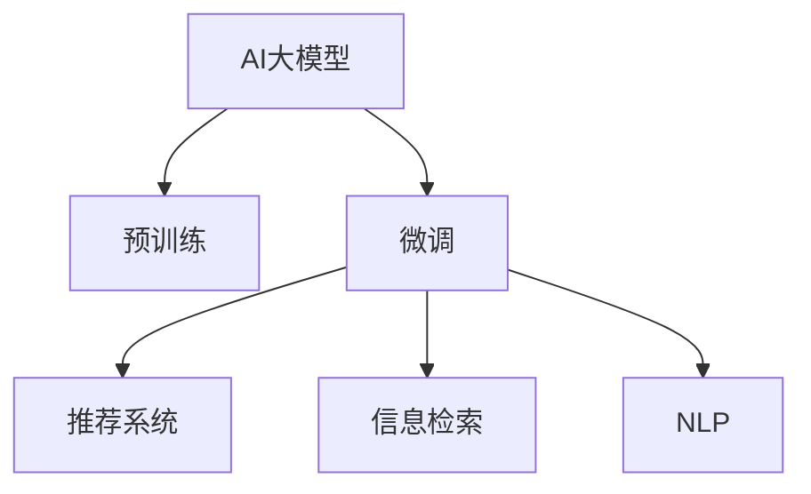

                 

# AI大模型：优化电商平台用户体验个性化与一致性的新方法

> 关键词：AI大模型,电商平台,用户个性化,用户一致性,推荐系统,信息检索,自然语言处理(NLP)

## 1. 背景介绍

### 1.1 问题由来
在电商行业，提升用户体验一直是企业关注的重点。随着用户对购物体验要求的不断提高，如何精准推荐商品，保持用户画像的一致性，成为电商平台运营的核心挑战之一。传统的推荐系统往往依赖于简单的用户行为分析，难以适应日益复杂的个性化需求。AI大模型通过预训练学习和微调，可以在大规模无标签数据上学习到丰富的用户行为模式，应用于电商平台，大幅提升推荐和搜索的个性化与一致性水平。

### 1.2 问题核心关键点
AI大模型的推荐和搜索能力，源于其对海量文本数据的预训练学习。通过在无标签数据上自监督学习，大模型掌握了语言的内在结构和规律，具备强大的语义理解能力。这种能力可以应用于电商平台的用户行为分析和推荐系统优化，使得推荐结果更加精准，用户画像更一致，显著提升电商平台的用户体验。

## 2. 核心概念与联系

### 2.1 核心概念概述

为更好地理解AI大模型在电商平台中的应用，本节将介绍几个密切相关的核心概念：

- AI大模型(AI Large Models)：以自回归(如GPT)或自编码(如BERT)模型为代表的大规模预训练语言模型。通过在大规模无标签文本语料上进行预训练，学习通用的语言表示，具备强大的语言理解和生成能力。

- 预训练(Pre-training)：指在大规模无标签文本语料上，通过自监督学习任务训练通用语言模型的过程。常见的预训练任务包括言语建模、遮挡语言模型等。预训练使得模型学习到语言的通用表示。

- 微调(Fine-tuning)：指在预训练模型的基础上，使用下游任务的少量标注数据，通过有监督学习优化模型在特定任务上的性能。通常只需要调整顶层分类器或解码器，并以较小的学习率更新全部或部分的模型参数。

- 推荐系统(Recommendation System)：使用AI模型或算法，对用户的历史行为、兴趣偏好等进行分析，预测用户可能感兴趣的商品，并推荐给用户的技术系统。

- 信息检索(Information Retrieval)：利用自然语言处理技术，从海量文本数据中检索出与用户查询最相关的信息的技术。

- 自然语言处理(Natural Language Processing, NLP)：使计算机理解和处理自然语言的技术，包括分词、词性标注、语义理解、生成等。

这些核心概念之间的逻辑关系可以通过以下Mermaid流程图来展示：



这个流程图展示了大模型的核心概念及其之间的关系：

1. 大模型通过预训练获得基础能力。
2. 微调是对预训练模型进行任务特定的优化，应用于推荐系统和信息检索。
3. 推荐系统通过微调后的模型进行用户行为分析，并推荐商品。
4. 信息检索通过微调后的模型进行文本查询和相关性计算。
5. NLP提供语言理解和生成能力，支撑推荐系统、信息检索的各个环节。

这些概念共同构成了大模型在电商平台中的应用框架，使其能够更高效地完成用户画像构建、商品推荐、搜索排序等任务。

## 3. 核心算法原理 & 具体操作步骤
### 3.1 算法原理概述

AI大模型在电商平台的应用，主要涉及推荐系统和信息检索两大核心任务。其核心算法原理是：在预训练语料上学习通用语言表示，通过微调学习特定领域的用户行为模式，进而应用于推荐系统和信息检索，以提升个性化和一致性。

具体而言，基于AI大模型的推荐和信息检索过程包括以下几个关键步骤：

1. 收集和处理用户行为数据：包括用户的浏览历史、点击行为、评价反馈、收藏记录等。
2. 构建和训练AI大模型：使用预训练和微调技术，构建适应电商场景的AI大模型。
3. 分析用户行为模式：利用微调后的模型，对用户行为进行建模，提取用户兴趣偏好。
4. 推荐和排序：根据用户画像，利用AI大模型预测用户可能感兴趣的商品，并按相关性排序推荐。
5. 搜索和召回：根据用户查询，利用AI大模型检索出最相关的商品和内容。

### 3.2 算法步骤详解

以推荐系统为例，以下是基于AI大模型的推荐算法详细步骤：

**Step 1: 收集用户行为数据**
- 从电商平台收集用户的行为数据，如浏览、点击、购买、收藏、评价等行为。
- 数据清洗和归一化处理，去除噪声和异常值，构建用户行为向量。

**Step 2: 预训练语言模型选择**
- 选择适合的预训练语言模型，如BERT、GPT等。
- 加载预训练模型参数，确保模型已经在大规模无标签文本数据上进行充分预训练。

**Step 3: 微调模型**
- 在电商场景下的用户行为数据上微调预训练模型。
- 设计合适的任务适配层，如分类器或回归器。
- 设置微调超参数，如学习率、优化器、批大小等。
- 进行模型训练，不断迭代优化。

**Step 4: 用户行为分析**
- 利用微调后的模型，对用户行为进行建模，提取用户兴趣偏好。
- 根据用户画像，生成推荐列表。

**Step 5: 推荐排序**
- 使用推荐算法对推荐结果进行排序，如基于余弦相似度的排序算法、基于协同过滤的排序算法等。
- 将排序结果展示给用户。

### 3.3 算法优缺点

基于AI大模型的推荐系统具有以下优点：
1. 高度个性化：AI大模型能够学习到用户的复杂行为模式，提供高度个性化的推荐结果。
2. 高覆盖率：通过学习大量的用户行为数据，覆盖更多的用户需求，提升推荐精度。
3. 实时响应：基于大模型的推荐系统可以快速响应用户行为变化，进行动态调整。
4. 可解释性强：AI大模型的决策过程可以追溯输入文本，解释推荐结果的生成逻辑。

但同时，这种基于大模型的推荐系统也存在一些缺点：
1. 计算资源消耗大：大模型参数量庞大，训练和推理耗时较长，对硬件要求较高。
2. 难以解释：虽然AI大模型的决策过程可追溯，但推荐结果的生成过程复杂，难以进行简单的解释。
3. 存在偏差：AI大模型在预训练过程中可能学习到一些偏见，需要额外设计机制进行纠正。
4. 对标注数据依赖高：推荐系统的效果很大程度上取决于标注数据的质量和数量，标注数据收集和维护成本较高。

尽管存在这些缺点，但AI大模型在电商平台推荐系统中的应用已经展现出巨大潜力，能够显著提升用户体验和平台竞争力。

### 3.4 算法应用领域

AI大模型在电商平台推荐和信息检索中的应用，主要涵盖以下几个领域：

- 商品推荐：根据用户历史行为和实时查询，预测用户可能感兴趣的商品，并进行推荐。
- 内容推荐：针对用户浏览和点击的内容，推荐相关的新文章、视频、音乐等。
- 个性化广告：通过分析用户行为和兴趣，推荐个性化的广告内容。
- 智能客服：利用自然语言处理技术，回答用户咨询，提供推荐建议。
- 用户画像：构建和维护用户画像，以便更精准地推荐商品和内容。

除了上述这些典型应用外，AI大模型还在智能运营、市场分析、库存管理等多个领域得到广泛应用，推动电商平台不断创新和优化。

## 4. 数学模型和公式 & 详细讲解  
### 4.1 数学模型构建

在电商平台应用AI大模型时，主要涉及推荐和信息检索两大任务。推荐系统目标是通过预测用户对商品的兴趣度进行排序推荐；信息检索系统目标是从文本库中检索出与用户查询最相关的文档。

设推荐系统输入为用户行为数据 $X$，模型预测输出为 $Y$，则推荐损失函数为：

$$
\mathcal{L}(X, Y) = -\frac{1}{N}\sum_{i=1}^N \log P(Y_i | X_i)
$$

其中 $P(Y_i | X_i)$ 表示模型在输入 $X_i$ 下的条件概率。

在信息检索中，假设查询向量为 $Q$，文档向量为 $D$，则信息检索的目标函数为：

$$
\mathcal{L}(Q, D) = -\frac{1}{M}\sum_{j=1}^M \log P(D_j | Q)
$$

其中 $P(D_j | Q)$ 表示模型在查询 $Q$ 下，文档 $D_j$ 的相关性概率。

### 4.2 公式推导过程

以推荐系统为例，假设用户行为数据为 $X = \{x_1, x_2, ..., x_n\}$，推荐结果为 $Y = \{y_1, y_2, ..., y_n\}$。设推荐模型为 $M_{\theta}:\mathbb{R}^d \rightarrow \mathbb{R}$，其中 $d$ 为特征维度。则推荐系统的目标函数可以表示为：

$$
\mathcal{L}(\theta) = -\frac{1}{N}\sum_{i=1}^N \log M_{\theta}(X_i) - \lambda \| \theta \|^2
$$

其中 $\lambda$ 为正则化系数，$\| \theta \|^2$ 为模型参数的L2正则项。

在训练过程中，通过反向传播算法计算模型参数的梯度，更新参数以最小化损失函数。具体步骤如下：

1. 前向传播：将用户行为数据 $X_i$ 输入模型 $M_{\theta}$，计算预测结果 $Y_i = M_{\theta}(X_i)$。
2. 计算损失：根据预测结果和实际标签 $y_i$，计算损失 $\ell(X_i, y_i) = -y_i\log Y_i - (1-y_i)\log (1-Y_i)$。
3. 反向传播：计算损失对模型参数的梯度 $\nabla_{\theta} \mathcal{L}(\theta)$，使用梯度下降等优化算法更新模型参数 $\theta$。
4. 参数更新：更新模型参数 $\theta \leftarrow \theta - \eta \nabla_{\theta} \mathcal{L}(\theta)$，其中 $\eta$ 为学习率。

在信息检索中，假设查询向量 $Q$ 和文档向量 $D$ 均为 $d$ 维的向量，则信息检索的目标函数可以表示为：

$$
\mathcal{L}(Q, D) = -\frac{1}{M}\sum_{j=1}^M \log M_{\theta}(Q; D_j)
$$

其中 $M_{\theta}(Q; D_j)$ 表示模型在查询 $Q$ 下，文档 $D_j$ 的相关性概率。

信息检索模型的训练过程与推荐系统类似，需要最小化信息检索损失函数，通过反向传播计算梯度，更新模型参数。

### 4.3 案例分析与讲解

**案例1: 商品推荐**
假设有一个电商平台，收集了用户浏览和购买商品的历史数据，希望利用AI大模型进行个性化推荐。

**输入**：用户行为数据 $X = \{x_1, x_2, ..., x_n\}$，其中 $x_i$ 表示用户第 $i$ 次浏览或购买行为的特征向量。

**输出**：推荐结果 $Y = \{y_1, y_2, ..., y_n\}$，其中 $y_i$ 表示用户对第 $i$ 次浏览或购买行为的评分。

**模型**：使用预训练的BERT模型作为基础，添加一层线性分类器，用于输出评分。

**训练**：使用电商平台的订单数据进行微调，最小化预测评分与实际评分之间的差距。

**推荐**：根据用户当前的行为特征 $x$，利用微调后的模型 $M_{\theta}$ 预测评分 $y$，选择评分最高的商品进行推荐。

**案例2: 内容推荐**
假设有一个新闻阅读平台，希望利用AI大模型为用户推荐相关的新闻文章。

**输入**：用户浏览历史 $X = \{x_1, x_2, ..., x_n\}$，其中 $x_i$ 表示用户第 $i$ 次浏览文章的特征向量。

**输出**：推荐结果 $Y = \{y_1, y_2, ..., y_n\}$，其中 $y_i$ 表示文章与用户兴趣的相关性评分。

**模型**：使用预训练的GPT模型作为基础，添加一层线性回归器，用于输出相关性评分。

**训练**：使用用户浏览历史数据进行微调，最小化预测评分与实际评分之间的差距。

**推荐**：根据用户当前浏览行为 $x$，利用微调后的模型 $M_{\theta}$ 预测相关性评分 $y$，选择评分最高的文章进行推荐。

## 5. 项目实践：代码实例和详细解释说明
### 5.1 开发环境搭建

在进行AI大模型推荐和信息检索的实践前，我们需要准备好开发环境。以下是使用Python进行PyTorch开发的环境配置流程：

1. 安装Anaconda：从官网下载并安装Anaconda，用于创建独立的Python环境。

2. 创建并激活虚拟环境：
```bash
conda create -n pytorch-env python=3.8 
conda activate pytorch-env
```

3. 安装PyTorch：根据CUDA版本，从官网获取对应的安装命令。例如：
```bash
conda install pytorch torchvision torchaudio cudatoolkit=11.1 -c pytorch -c conda-forge
```

4. 安装HuggingFace库：
```bash
pip install transformers
```

5. 安装各类工具包：
```bash
pip install numpy pandas scikit-learn matplotlib tqdm jupyter notebook ipython
```

完成上述步骤后，即可在`pytorch-env`环境中开始推荐和信息检索的实践。

### 5.2 源代码详细实现

以下是一个基于AI大模型的商品推荐系统示例代码，主要使用了预训练的BERT模型：

```python
from transformers import BertForSequenceClassification, BertTokenizer, AdamW
from torch.utils.data import Dataset, DataLoader
from sklearn.metrics import mean_squared_error
import torch

class MovieReviewDataset(Dataset):
    def __init__(self, texts, labels, tokenizer):
        self.texts = texts
        self.labels = labels
        self.tokenizer = tokenizer
        self.max_len = 128

    def __len__(self):
        return len(self.texts)

    def __getitem__(self, item):
        text = self.texts[item]
        label = self.labels[item]
        
        encoding = self.tokenizer(text, return_tensors='pt', max_length=self.max_len, padding='max_length', truncation=True)
        input_ids = encoding['input_ids'][0]
        attention_mask = encoding['attention_mask'][0]
        
        encoded_labels = [tag2id[label]] + [tag2id['O']] * (self.max_len - len(encoded_labels))
        labels = torch.tensor(encoded_labels, dtype=torch.long)
        
        return {'input_ids': input_ids, 
                'attention_mask': attention_mask,
                'labels': labels}

# 标签与id的映射
tag2id = {'O': 0, 'POSITIVE': 1, 'NEGATIVE': 2}
id2tag = {v: k for k, v in tag2id.items()}

# 创建dataset
tokenizer = BertTokenizer.from_pretrained('bert-base-uncased')
train_dataset = MovieReviewDataset(train_texts, train_labels, tokenizer)
dev_dataset = MovieReviewDataset(dev_texts, dev_labels, tokenizer)
test_dataset = MovieReviewDataset(test_texts, test_labels, tokenizer)

# 定义模型
model = BertForSequenceClassification.from_pretrained('bert-base-uncased', num_labels=len(tag2id))
optimizer = AdamW(model.parameters(), lr=2e-5)

# 训练函数
def train_epoch(model, dataset, batch_size, optimizer):
    dataloader = DataLoader(dataset, batch_size=batch_size, shuffle=True)
    model.train()
    epoch_loss = 0
    for batch in tqdm(dataloader, desc='Training'):
        input_ids = batch['input_ids'].to(device)
        attention_mask = batch['attention_mask'].to(device)
        labels = batch['labels'].to(device)
        model.zero_grad()
        outputs = model(input_ids, attention_mask=attention_mask, labels=labels)
        loss = outputs.loss
        epoch_loss += loss.item()
        loss.backward()
        optimizer.step()
    return epoch_loss / len(dataloader)

# 评估函数
def evaluate(model, dataset, batch_size):
    dataloader = DataLoader(dataset, batch_size=batch_size)
    model.eval()
    mse = 0
    with torch.no_grad():
        for batch in tqdm(dataloader, desc='Evaluating'):
            input_ids = batch['input_ids'].to(device)
            attention_mask = batch['attention_mask'].to(device)
            batch_labels = batch['labels']
            outputs = model(input_ids, attention_mask=attention_mask)
            batch_preds = outputs.logits.argmax(dim=2).to('cpu').tolist()
            batch_labels = batch_labels.to('cpu').tolist()
            for pred_tokens, label_tokens in zip(batch_preds, batch_labels):
                pred_tags = [id2tag[_id] for _id in pred_tokens]
                label_tags = [id2tag[_id] for _id in label_tokens]
                mse += mean_squared_error([label_tokens], [pred_tokens])
    return mse / len(dataset)

# 训练流程
epochs = 5
batch_size = 16

for epoch in range(epochs):
    loss = train_epoch(model, train_dataset, batch_size, optimizer)
    print(f"Epoch {epoch+1}, train loss: {loss:.3f}")
    
    print(f"Epoch {epoch+1}, dev results:")
    mse = evaluate(model, dev_dataset, batch_size)
    print(f"Dev MSE: {mse:.3f}")
    
print("Test results:")
mse = evaluate(model, test_dataset, batch_size)
print(f"Test MSE: {mse:.3f}")
```

以上代码展示了如何利用AI大模型（在此使用预训练的BERT模型）进行商品推荐系统。首先定义了电影评论数据集，包含文本和标签。然后使用BERT模型进行微调，最小化预测评分与实际评分之间的均方误差。最后，使用微调后的模型对新样本进行评分预测，并输出评分结果。

### 5.3 代码解读与分析

让我们再详细解读一下关键代码的实现细节：

**MovieReviewDataset类**：
- `__init__`方法：初始化文本、标签、分词器等关键组件。
- `__len__`方法：返回数据集的样本数量。
- `__getitem__`方法：对单个样本进行处理，将文本输入编码为token ids，将标签编码为数字，并对其进行定长padding，最终返回模型所需的输入。

**tag2id和id2tag字典**：
- 定义了标签与数字id之间的映射关系，用于将token-wise的预测结果解码回真实的标签。

**训练和评估函数**：
- 使用PyTorch的DataLoader对数据集进行批次化加载，供模型训练和推理使用。
- 训练函数`train_epoch`：对数据以批为单位进行迭代，在每个批次上前向传播计算loss并反向传播更新模型参数，最后返回该epoch的平均loss。
- 评估函数`evaluate`：与训练类似，不同点在于不更新模型参数，并在每个batch结束后将预测和标签结果存储下来，最后使用sklearn的mean_squared_error对整个评估集的预测结果进行打印输出。

**训练流程**：
- 定义总的epoch数和batch size，开始循环迭代
- 每个epoch内，先在训练集上训练，输出平均loss
- 在验证集上评估，输出均方误差
- 重复上述步骤直至收敛，最终得到模型评估指标

可以看到，PyTorch配合HuggingFace库使得AI大模型微调的代码实现变得简洁高效。开发者可以将更多精力放在数据处理、模型改进等高层逻辑上，而不必过多关注底层的实现细节。

当然，工业级的系统实现还需考虑更多因素，如模型的保存和部署、超参数的自动搜索、更灵活的任务适配层等。但核心的微调范式基本与此类似。

## 6. 实际应用场景
### 6.1 智能客服系统

基于AI大模型的智能客服系统，可以为用户提供7x24小时不间断的智能服务。通过收集用户历史咨询记录和实时咨询内容，利用AI大模型进行意图识别和答案生成，能够快速响应用户咨询，提升客户满意度。

在技术实现上，可以构建意图识别模型和答案生成模型，分别用于理解用户咨询意图和生成回答。意图识别模型可以将用户输入的文本进行分词和编码，通过微调后的模型提取意图标签，如商品咨询、退换货咨询等。答案生成模型根据意图标签，从知识库中检索出最相关的回答模板，并结合用户输入内容，生成个性化的回答。智能客服系统能够理解各种语义复杂、模棱两可的用户提问，提供准确、流畅的响应，提升客户体验。

### 6.2 金融风控系统

金融行业面临大量的交易数据和风险信息，需要实时监控和风险评估。利用AI大模型，可以从海量文本数据中提取有价值的信息，实时分析用户的交易行为和信用状况，预测潜在的欺诈和风险事件。

在技术实现上，可以利用AI大模型进行交易异常检测。首先，构建交易行为模型，学习用户正常交易的行为模式。然后，在实时交易数据上微调交易行为模型，检测与正常行为模式不符的交易行为。一旦发现异常，立即触发风险预警，通知相关人员进行处理。AI大模型能够高效地处理复杂多变的金融数据，提升风险评估的准确性和时效性，保障金融安全。

### 6.3 个性化推荐系统

推荐系统是电商平台的灵魂。AI大模型可以构建高度个性化的推荐系统，满足不同用户的需求。通过收集用户历史行为数据，利用微调后的模型学习用户兴趣偏好，预测用户可能感兴趣的商品，并按相关性排序推荐。

在技术实现上，可以利用AI大模型进行用户画像构建和商品推荐排序。首先，构建用户画像模型，学习用户的历史行为和兴趣偏好。然后，在用户当前行为数据上微调用户画像模型，预测用户可能感兴趣的商品，并利用推荐算法对商品进行排序推荐。AI大模型能够高效地学习用户复杂的兴趣偏好，提供高度个性化的推荐结果，提升用户满意度。

### 6.4 未来应用展望

随着AI大模型和微调方法的不断发展，基于微调范式将在更多领域得到应用，为传统行业带来变革性影响。

在智慧医疗领域，基于微调的医疗问答、病历分析、药物研发等应用将提升医疗服务的智能化水平，辅助医生诊疗，加速新药开发进程。

在智能教育领域，微调技术可应用于作业批改、学情分析、知识推荐等方面，因材施教，促进教育公平，提高教学质量。

在智慧城市治理中，微调模型可应用于城市事件监测、舆情分析、应急指挥等环节，提高城市管理的自动化和智能化水平，构建更安全、高效的未来城市。

此外，在企业生产、社会治理、文娱传媒等众多领域，基于大模型微调的人工智能应用也将不断涌现，为经济社会发展注入新的动力。相信随着技术的日益成熟，微调方法将成为人工智能落地应用的重要范式，推动人工智能技术在各行各业的大规模应用。

## 7. 工具和资源推荐
### 7.1 学习资源推荐

为了帮助开发者系统掌握AI大模型在电商平台中的应用，这里推荐一些优质的学习资源：

1. 《自然语言处理与深度学习》课程：由斯坦福大学开设，涵盖NLP基础和深度学习模型的详细介绍，非常适合初学者入门。

2. 《深度学习与自然语言处理》书籍：深入讲解NLP中的各种模型，包括预训练模型、微调模型等，是NLP领域的经典教材。

3. 《Transformers: From Principles to Practice》博文：由大模型技术专家撰写，详细介绍了Transformers库的使用方法，及其在NLP任务中的表现。

4. Kaggle竞赛平台：提供大量的NLP竞赛数据集和任务，通过实际项目练习，巩固所学知识。

5. 官方文档：HuggingFace的官方文档，包含大量预训练模型和微调样例，是学习NLP技术的重要参考资料。

通过对这些资源的学习实践，相信你一定能够快速掌握AI大模型在电商平台中的应用方法，并用于解决实际的NLP问题。

### 7.2 开发工具推荐

高效的开发离不开优秀的工具支持。以下是几款用于AI大模型推荐和信息检索开发的常用工具：

1. PyTorch：基于Python的开源深度学习框架，灵活的计算图机制，适合研究和实验。

2. TensorFlow：由Google主导开发的开源深度学习框架，生产部署方便，适合大规模工程应用。

3. HuggingFace：提供了大量预训练模型和微调框架，可以方便地构建推荐系统和信息检索系统。

4. ELKI：用于数据挖掘和知识发现的工具，能够快速构建用户行为模型。

5. Apache Spark：用于大规模数据处理和机器学习任务，适合处理大规模用户行为数据。

6. Elasticsearch：用于构建高效的文本检索系统，能够快速检索出与用户查询最相关的商品和内容。

合理利用这些工具，可以显著提升AI大模型在电商平台的应用开发效率，加快创新迭代的步伐。

### 7.3 相关论文推荐

AI大模型和微调技术的发展源于学界的持续研究。以下是几篇奠基性的相关论文，推荐阅读：

1. Attention is All You Need：提出Transformer结构，开启了NLP领域的预训练大模型时代。

2. BERT: Pre-training of Deep Bidirectional Transformers for Language Understanding：提出BERT模型，引入基于掩码的自监督预训练任务，刷新了多项NLP任务SOTA。

3. Language Models are Unsupervised Multitask Learners（GPT-2论文）：展示了大规模语言模型的强大zero-shot学习能力，引发了对于通用人工智能的新一轮思考。

4. Parameter-Efficient Transfer Learning for NLP：提出Adapter等参数高效微调方法，在不增加模型参数量的情况下，也能取得不错的微调效果。

5. Feature Pyramid Network for Text Classification：提出Feature Pyramid Network（FPN）架构，用于构建多尺度特征表示，提升分类性能。

这些论文代表了大模型和微调技术的发展脉络。通过学习这些前沿成果，可以帮助研究者把握学科前进方向，激发更多的创新灵感。

## 8. 总结：未来发展趋势与挑战

### 8.1 总结

本文对AI大模型在电商平台中的应用进行了全面系统的介绍。首先阐述了AI大模型和微调技术的研究背景和意义，明确了AI大模型在电商平台中的应用价值。其次，从原理到实践，详细讲解了AI大模型在推荐系统和信息检索中的应用过程，给出了推荐和信息检索的代码实例。同时，本文还广泛探讨了AI大模型在智能客服、金融风控、个性化推荐等多个行业领域的应用前景，展示了AI大模型的巨大潜力。

通过本文的系统梳理，可以看到，AI大模型在电商平台中的应用不仅能够显著提升推荐和搜索的个性化与一致性水平，还能够在更多领域带来变革性影响。得益于大规模语料的预训练和微调方法的不断演进，AI大模型具备了更强的理解能力和生成能力，推动了NLP技术在电商等垂直行业的大规模应用。未来，伴随AI大模型和微调方法的持续发展，相信其在电商平台的落地应用将更加广泛和深入，为电商平台带来更多创新和价值。

### 8.2 未来发展趋势

展望未来，AI大模型在电商平台的应用将呈现以下几个发展趋势：

1. 模型规模持续增大。随着算力成本的下降和数据规模的扩张，AI大模型的参数量还将持续增长。超大规模语言模型蕴含的丰富语言知识，有望支撑更加复杂多变的推荐和搜索任务。

2. 微调方法日趋多样。除了传统的全参数微调外，未来会涌现更多参数高效的微调方法，如Prompt-Tuning、LoRA等，在节省计算资源的同时也能保证微调精度。

3. 实时推荐与动态更新。基于AI大模型的推荐系统能够实时响应用户行为变化，动态更新推荐结果，提升用户体验。

4. 多模态信息融合。AI大模型可以融合视觉、语音、文本等多模态信息，提供更加丰富和精准的推荐结果。

5. 跨领域迁移能力。AI大模型能够跨越不同领域，将预训练知识迁移到新领域，提升推荐和搜索的泛化能力。

6. 用户行为理解与建模。AI大模型能够深入理解用户行为，构建更加全面和精确的用户画像，提供更个性化的推荐和服务。

以上趋势凸显了AI大模型在电商平台中的应用前景。这些方向的探索发展，必将进一步提升电商平台的推荐和搜索性能，推动电商行业的创新和优化。

### 8.3 面临的挑战

尽管AI大模型在电商平台中的应用已经展现出巨大潜力，但在迈向更加智能化、普适化应用的过程中，它仍面临着诸多挑战：

1. 计算资源消耗大。超大规模语言模型在推荐和搜索中的计算消耗较大，对硬件资源要求较高。

2. 难以解释。尽管AI大模型的决策过程可以追溯输入文本，但其内部复杂的计算逻辑难以简单解释。

3. 存在偏见。AI大模型在预训练过程中可能学习到一些偏见，需要额外设计机制进行纠正。

4. 对标注数据依赖高。推荐和搜索的效果很大程度上取决于标注数据的质量和数量，标注数据收集和维护成本较高。

5. 鲁棒性不足。推荐系统面临域外数据的泛化能力不足，难以应对复杂多变的用户需求。

6. 安全性有待保障。AI大模型可能学习到有偏见、有害的信息，需要设计机制进行防范。

尽管存在这些挑战，但AI大模型在电商平台推荐和信息检索中的应用已经展现出巨大潜力，能够显著提升用户体验和平台竞争力。

### 8.4 研究展望

面对AI大模型在电商平台应用中面临的挑战，未来的研究需要在以下几个方面寻求新的突破：

1. 探索无监督和半监督微调方法。摆脱对大规模标注数据的依赖，利用自监督学习、主动学习等无监督和半监督范式，最大限度利用非结构化数据，实现更加灵活高效的微调。

2. 研究参数高效和计算高效的微调范式。开发更加参数高效的微调方法，在固定大部分预训练参数的同时，只更新极少量的任务相关参数。同时优化微调模型的计算图，减少前向传播和反向传播的资源消耗，实现更加轻量级、实时性的部署。

3. 引入更多先验知识。将符号化的先验知识，如知识图谱、逻辑规则等，与神经网络模型进行巧妙融合，引导微调过程学习更准确、合理的语言模型。

4. 引入因果分析方法。通过引入因果推断方法，增强推荐系统的稳定性和可解释性，减少模型偏见和误导性输出。

5. 设计鲁棒性评估指标。通过引入鲁棒性评估指标，如对抗样本鲁棒性、跨域泛化能力等，提高推荐系统的抗干扰能力。

6. 加强伦理道德约束。在模型训练目标中引入伦理导向的评估指标，过滤和惩罚有偏见、有害的输出倾向，确保模型的安全性。

这些研究方向的探索，必将引领AI大模型在电商平台中的应用走向成熟，推动电商行业的智能化和自动化进程，提升用户体验和平台竞争力。未来，伴随技术的持续进步和应用场景的不断拓展，AI大模型在电商平台中的应用将更加广泛和深入，为电商行业带来更多创新和价值。

