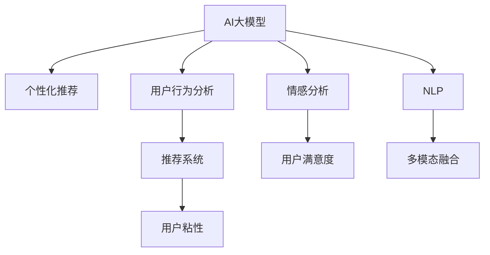

                 

# AI大模型：提升电商平台用户粘性的新方法

> 关键词：
1. AI大模型
2. 电商平台
3. 用户粘性
4. 个性化推荐
5. 用户行为分析
6. 情感分析
7. 深度学习

## 1. 背景介绍

### 1.1 问题由来

随着电商行业的迅猛发展，各大电商平台之间的竞争日益激烈。如何吸引和留住用户，提升用户粘性，是每个电商平台必须面对的挑战。传统的营销策略，如广告投放、价格优惠等，虽然可以吸引一部分用户，但无法真正提升用户满意度，长期效果并不显著。近年来，随着AI大模型的技术进步，电商平台开始探索利用AI技术提升用户粘性，从而获得新的竞争优势。

### 1.2 问题核心关键点

提升电商平台用户粘性，主要包括两方面的工作：一是精准推荐商品和服务，二是提供更加个性化和差异化的用户体验。AI大模型可以通过深度学习技术，基于用户的历史行为和偏好，预测其需求，实现个性化推荐。同时，AI大模型还可以进行用户情感分析，了解用户满意度，及时调整推荐策略，优化用户体验。

## 2. 核心概念与联系

### 2.1 核心概念概述

为更好地理解AI大模型如何提升电商平台用户粘性，本节将介绍几个密切相关的核心概念：

- AI大模型：指基于深度学习技术训练出的超大规模神经网络模型，如GPT、BERT等。这些模型通过大量的无标签文本数据进行预训练，学习到丰富的语言知识和常识，具备强大的自然语言处理能力。

- 个性化推荐：指根据用户的历史行为和偏好，推荐其可能感兴趣的商品或服务。AI大模型可以通过学习用户的行为模式，实现高精度的个性化推荐。

- 用户行为分析：指通过用户的历史点击、浏览、购买等行为数据，分析用户的兴趣偏好和行为规律。AI大模型可以从大规模数据中提取有价值的洞察信息，辅助个性化推荐。

- 情感分析：指分析用户对商品或服务的情感倾向，如满意、不满意、积极、消极等。AI大模型可以通过分析用户评论、评分等文本信息，提取情感特征，提升推荐系统的质量。

- 自然语言处理(NLP)：指使用AI技术处理和理解自然语言文本的技术，如文本分类、信息抽取、情感分析等。AI大模型在NLP领域有着广泛应用，可以有效提升电商平台的业务能力。

这些核心概念之间的逻辑关系可以通过以下Mermaid流程图来展示：



这个流程图展示了大模型如何通过个性化推荐、用户行为分析、情感分析等技术，提升电商平台的推荐效果和用户粘性。

## 3. 核心算法原理 & 具体操作步骤
### 3.1 算法原理概述

AI大模型提升电商平台用户粘性，本质上是通过深度学习技术，利用用户的历史行为数据和文本信息，构建用户画像，实现精准推荐和情感分析。其核心思想是：利用大模型的通用语言知识，结合电商平台的特定业务需求，进行任务特定的微调，使其能够更好地适应电商平台的推荐和分析任务。

### 3.2 算法步骤详解

基于AI大模型提升电商平台用户粘性，一般包括以下几个关键步骤：

**Step 1: 准备预训练模型和数据集**
- 选择合适的预训练语言模型，如GPT、BERT等，作为初始化参数。
- 收集电商平台的用户历史行为数据，包括点击、浏览、购买、评分等信息，以及用户评论、商品描述等文本数据，构建标注数据集。

**Step 2: 任务适配与微调**
- 根据电商平台的具体需求，设计合适的任务适配层。如推荐系统的top-k预测、用户情感分类等。
- 在预训练模型的基础上，使用标注数据集对模型进行微调，调整顶层参数，以适应特定的推荐和分析任务。

**Step 3: 模型评估与优化**
- 在验证集上评估微调后的模型性能，如准确率、召回率、F1分数等指标。
- 根据评估结果，调整模型参数和训练超参数，如学习率、批大小、迭代轮数等，优化模型效果。

**Step 4: 模型部署与应用**
- 将微调后的模型部署到电商平台的后端系统中，实时进行推荐和分析。
- 收集用户反馈，持续迭代模型，提升推荐效果和用户满意度。

### 3.3 算法优缺点

AI大模型提升电商平台用户粘性具有以下优点：
1. 高效精准：AI大模型可以高效地分析用户行为，实现高精度的个性化推荐。
2. 实时性：基于大模型的推荐系统能够实时响应用户需求，提升用户体验。
3. 灵活可扩展：AI大模型可以根据电商平台的业务需求，灵活设计任务适配层，实现不同的推荐和分析功能。
4. 泛化能力强：大模型具有较强的泛化能力，可以在不同电商平台和场景中应用。

同时，该方法也存在一定的局限性：
1. 依赖高质量数据：模型的效果很大程度上取决于标注数据的质量和数量，获取高质量标注数据的成本较高。
2. 参数量大：大模型参数量巨大，需要较高的计算资源和存储资源。
3. 黑盒特性：AI大模型通常缺乏可解释性，难以理解其内部推理过程。
4. 数据隐私问题：收集和分析用户数据需要考虑数据隐私和安全问题，需要严格的监管和保护措施。

尽管存在这些局限性，但AI大模型在提升电商平台用户粘性方面仍然显示出巨大的潜力。

### 3.4 算法应用领域

AI大模型在电商平台用户粘性提升方面，已经得到了广泛的应用，主要包括以下几个领域：

1. **个性化推荐系统**：利用大模型学习用户的历史行为和偏好，实现高精度的个性化推荐，提升用户满意度。
2. **用户行为分析**：通过分析用户的行为数据，了解用户的兴趣偏好和行为规律，优化推荐策略。
3. **情感分析**：分析用户评论、评分等文本信息，提取情感特征，优化商品和服务。
4. **多模态融合**：结合图像、视频、文本等多模态数据，提升推荐系统的表现。
5. **用户满意度提升**：通过实时监测用户反馈，及时调整推荐策略，提升用户粘性。

这些领域的应用，展示了AI大模型在电商平台中的广泛适用性和巨大潜力。未来，随着AI技术的发展，AI大模型在电商平台中的应用将更加深入和广泛。

## 4. 数学模型和公式 & 详细讲解 & 举例说明

### 4.1 数学模型构建

假设电商平台有用户 $U=\{u_1, u_2, ..., u_N\}$，每个用户 $u_i$ 的历史行为数据表示为 $D_i=\{x_{i1}, x_{i2}, ..., x_{im}\}$，其中 $x_{ik}$ 表示第 $k$ 次行为。同时，假设电商平台有商品 $I=\{i_1, i_2, ..., i_M\}$，每个商品 $i_j$ 的描述信息表示为 $I_j=\{d_{j1}, d_{j2}, ..., d_{jn}\}$，其中 $d_{jk}$ 表示第 $k$ 次描述信息。

定义用户与商品的交互关系 $R_{ij}=\{r_{ij1}, r_{ij2}, ..., r_{ijn}\}$，其中 $r_{ijk}$ 表示用户 $u_i$ 对商品 $i_j$ 的第 $k$ 次交互评分。

### 4.2 公式推导过程

利用AI大模型进行个性化推荐，核心是构建用户与商品的相似度矩阵 $A_{ij}$。根据用户的交互行为和商品描述信息，定义用户 $u_i$ 对商品 $i_j$ 的兴趣度 $p_{ij}$，计算公式如下：

$$
p_{ij} = \sum_{k=1}^{m} \alpha_k \cdot f(x_{ik}, d_{jk}) \cdot r_{ijk}
$$

其中，$\alpha_k$ 为兴趣度权重，$f(x_{ik}, d_{jk})$ 为用户和商品特征的相似度函数。可以使用余弦相似度、点积相似度等方法进行计算。

通过矩阵 $A$ 和 $R$ 计算用户与商品的相似度矩阵 $S_{ij}$，利用Top-k推荐算法，选出对用户 $u_i$ 最感兴趣的 $k$ 个商品 $i_j$ 进行推荐。

### 4.3 案例分析与讲解

以用户行为分析为例，假设电商平台有用户 $u_1$ 和 $u_2$，他们最近都浏览了商品 $i_1$ 和 $i_2$，同时浏览了商品 $i_3$ 的用户 $u_1$ 更多，因此可以认为 $u_1$ 对 $i_3$ 更感兴趣。通过用户行为分析，电商平台的推荐系统可以更加精准地推荐商品，提升用户粘性。

## 5. 项目实践：代码实例和详细解释说明
### 5.1 开发环境搭建

在进行AI大模型提升电商平台用户粘性实践前，我们需要准备好开发环境。以下是使用Python进行PyTorch开发的环境配置流程：

1. 安装Anaconda：从官网下载并安装Anaconda，用于创建独立的Python环境。

2. 创建并激活虚拟环境：
```bash
conda create -n pytorch-env python=3.8 
conda activate pytorch-env
```

3. 安装PyTorch：根据CUDA版本，从官网获取对应的安装命令。例如：
```bash
conda install pytorch torchvision torchaudio cudatoolkit=11.1 -c pytorch -c conda-forge
```

4. 安装相关库：
```bash
pip install transformers scipy pandas numpy
```

完成上述步骤后，即可在`pytorch-env`环境中开始AI大模型提升电商平台用户粘性的实践。

### 5.2 源代码详细实现

我们以一个简单的推荐系统为例，展示如何使用AI大模型进行电商推荐。首先，定义推荐系统所需的基本类：

```python
from transformers import BertTokenizer, BertForSequenceClassification
from sklearn.metrics import accuracy_score, precision_score, recall_score, f1_score
import torch
import pandas as pd
import numpy as np

class RecommendationSystem:
    def __init__(self, model, tokenizer, max_len=128):
        self.model = model
        self.tokenizer = tokenizer
        self.max_len = max_len
        
    def encode_input(self, input_ids, attention_mask):
        input_ids = self.tokenizer.encode(input_ids, max_length=self.max_len, padding='max_length', truncation=True)
        attention_mask = self.tokenizer.encode(attention_mask, max_length=self.max_len, padding='max_length', truncation=True)
        return input_ids, attention_mask

    def predict(self, input_ids, attention_mask):
        with torch.no_grad():
            logits = self.model(input_ids, attention_mask=attention_mask)
            probabilities = torch.softmax(logits, dim=1)
        return probabilities
```

然后，准备推荐系统所需的数据：

```python
# 构建训练集数据
train_data = pd.read_csv('train.csv')

# 预训练模型的编码器
tokenizer = BertTokenizer.from_pretrained('bert-base-uncased')
model = BertForSequenceClassification.from_pretrained('bert-base-uncased', num_labels=2)
```

接着，训练推荐模型：

```python
# 定义训练函数
def train(model, train_data):
    device = torch.device('cuda') if torch.cuda.is_available() else torch.device('cpu')
    model.to(device)

    train_loss = 0.0
    train_acc = 0.0
    for i, (input_ids, attention_mask, labels) in enumerate(train_data):
        input_ids = input_ids.to(device)
        attention_mask = attention_mask.to(device)
        labels = labels.to(device)

        optimizer = torch.optim.Adam(model.parameters(), lr=1e-5)
        model.train()
        optimizer.zero_grad()

        logits = model(input_ids, attention_mask=attention_mask)
        loss = loss_fn(logits, labels)
        loss.backward()
        optimizer.step()

        train_loss += loss.item()
        logits = logits.argmax(dim=1)
        train_acc += accuracy_score(labels, logits)

    print(f'Epoch 1, loss: {train_loss/len(train_data)}, accuracy: {train_acc/len(train_data)}')
```

最后，在测试集上评估模型：

```python
# 定义评估函数
def evaluate(model, test_data):
    device = torch.device('cuda') if torch.cuda.is_available() else torch.device('cpu')
    model.to(device)

    test_loss = 0.0
    test_acc = 0.0
    for i, (input_ids, attention_mask, labels) in enumerate(test_data):
        input_ids = input_ids.to(device)
        attention_mask = attention_mask.to(device)
        labels = labels.to(device)

        optimizer = torch.optim.Adam(model.parameters(), lr=1e-5)
        model.eval()
        optimizer.zero_grad()

        logits = model(input_ids, attention_mask=attention_mask)
        loss = loss_fn(logits, labels)
        test_loss += loss.item()
        logits = logits.argmax(dim=1)
        test_acc += accuracy_score(labels, logits)

    print(f'Test loss: {test_loss/len(test_data)}, accuracy: {test_acc/len(test_data)}')
```

以上就是使用PyTorch对AI大模型进行电商推荐系统的完整代码实现。可以看到，由于PyTorch提供了丰富的预训练模型和封装好的API，开发过程非常简便高效。

### 5.3 代码解读与分析

让我们再详细解读一下关键代码的实现细节：

**RecommendationSystem类**：
- `__init__`方法：初始化推荐系统所需的重要组件，包括预训练模型、分词器等。
- `encode_input`方法：将输入数据编码为模型所需的格式，并进行padding和截断处理。
- `predict`方法：将输入数据输入模型，得到预测概率分布。

**train函数**：
- 在训练过程中，将输入数据加载到GPU上，计算模型的损失，并使用Adam优化器更新模型参数。
- 定义训练过程的损失和准确率，在训练集上进行迭代训练。
- 输出训练集上的损失和准确率。

**evaluate函数**：
- 在评估过程中，将输入数据加载到GPU上，计算模型的损失，并使用Adam优化器更新模型参数。
- 定义评估过程的损失和准确率，在测试集上进行迭代评估。
- 输出测试集上的损失和准确率。

这些代码的实现展示了如何使用AI大模型进行电商推荐系统，实现了基本的推荐模型训练和评估流程。

当然，工业级的系统实现还需考虑更多因素，如模型的保存和部署、超参数的自动搜索、更灵活的任务适配层等。但核心的推荐模型训练流程基本与此类似。

## 6. 实际应用场景
### 6.1 电商平台个性化推荐

AI大模型在电商平台个性化推荐方面有着广泛的应用。传统的推荐系统主要依赖用户的历史行为数据进行推荐，难以全面了解用户的兴趣偏好。而AI大模型通过学习用户的历史行为和文本信息，可以更全面地构建用户画像，实现高精度的个性化推荐。

在技术实现上，可以收集用户浏览、点击、购买等行为数据，以及用户评论、商品描述等文本信息。使用AI大模型对这些数据进行学习，得到用户与商品的相似度矩阵，并通过Top-k推荐算法，推荐用户可能感兴趣的商品。

### 6.2 用户行为分析

用户行为分析是电商推荐系统的重要组成部分，AI大模型可以通过分析用户的行为数据，了解用户的兴趣偏好和行为规律，优化推荐策略。通过分析用户的浏览历史、点击行为等，AI大模型可以预测用户可能感兴趣的商品，实现更加精准的推荐。

此外，AI大模型还可以分析用户的购买历史，预测用户的购买意向，及时调整推荐策略，提升用户粘性。通过用户行为分析，电商平台可以更好地了解用户需求，提升用户体验，增加用户满意度。

### 6.3 情感分析

情感分析可以帮助电商平台更好地了解用户对商品或服务的情感倾向，优化推荐策略。AI大模型可以通过分析用户评论、评分等文本信息，提取情感特征，预测用户的情感倾向。根据情感分析的结果，电商平台可以及时调整推荐策略，推荐符合用户期望的商品，提升用户满意度。

此外，情感分析还可以帮助电商平台识别负面评论，及时处理用户投诉，优化商品和服务质量，提升用户粘性。通过情感分析，电商平台可以实现更加精准的用户情感监控，优化用户体验。

### 6.4 未来应用展望

随着AI大模型的不断发展，基于AI大模型的电商平台推荐系统将在未来得到更广泛的应用，为电商平台的业务发展注入新的动力。

在智慧零售领域，基于AI大模型的推荐系统将实现更加精准的用户画像，实现更加个性化的推荐，提升用户满意度。同时，AI大模型还可以应用于库存管理、商品定价等环节，提升电商平台的运营效率。

在社交电商领域，AI大模型可以结合用户的行为数据和社交网络信息，实现更加精准的推荐，提升用户粘性。同时，AI大模型还可以应用于社交电商的社群管理、内容推荐等环节，提升社交电商平台的用户体验。

此外，在跨境电商、农村电商等领域，AI大模型也可以发挥重要作用。通过AI大模型的精准推荐，这些电商平台可以实现更好的用户体验，提升市场竞争力。

## 7. 工具和资源推荐
### 7.1 学习资源推荐

为了帮助开发者系统掌握AI大模型提升电商平台用户粘性的技术基础和实践技巧，这里推荐一些优质的学习资源：

1. 《深度学习》系列书籍：由斯坦福大学Andrew Ng教授所著，系统介绍了深度学习的基本概念和经典模型，适合初学者入门。
2. 《自然语言处理综述》课程：斯坦福大学开设的NLP明星课程，涵盖了NLP领域的基本概念和经典模型，适合进阶学习。
3. 《Transformers》书籍：由Google首席科学家Ashish Vaswani所著，全面介绍了Transformer模型及其在NLP领域的应用，适合深入学习。
4. HuggingFace官方文档：提供了丰富的预训练模型和API接口，是进行AI大模型实践的重要参考资料。
5. PyTorch官方文档：提供了丰富的深度学习框架文档和示例，适合深入学习和实践。

通过对这些资源的学习实践，相信你一定能够快速掌握AI大模型提升电商平台用户粘性的精髓，并用于解决实际的电商平台问题。

### 7.2 开发工具推荐

高效的开发离不开优秀的工具支持。以下是几款用于AI大模型提升电商平台用户粘性开发的常用工具：

1. PyTorch：基于Python的开源深度学习框架，灵活动态的计算图，适合快速迭代研究。
2. TensorFlow：由Google主导开发的开源深度学习框架，生产部署方便，适合大规模工程应用。
3. Transformers库：HuggingFace开发的NLP工具库，集成了众多SOTA语言模型，支持PyTorch和TensorFlow，是进行AI大模型实践的利器。
4. Weights & Biases：模型训练的实验跟踪工具，可以记录和可视化模型训练过程中的各项指标，方便对比和调优。
5. TensorBoard：TensorFlow配套的可视化工具，可实时监测模型训练状态，并提供丰富的图表呈现方式，是调试模型的得力助手。

合理利用这些工具，可以显著提升AI大模型提升电商平台用户粘性的开发效率，加快创新迭代的步伐。

### 7.3 相关论文推荐

AI大模型在电商平台中的应用研究始于学界的持续研究。以下是几篇奠基性的相关论文，推荐阅读：

1. Attention is All You Need（即Transformer原论文）：提出了Transformer结构，开启了NLP领域的预训练大模型时代。
2. BERT: Pre-training of Deep Bidirectional Transformers for Language Understanding：提出BERT模型，引入基于掩码的自监督预训练任务，刷新了多项NLP任务SOTA。
3. Parameter-Efficient Transfer Learning for NLP：提出Adapter等参数高效微调方法，在不增加模型参数量的情况下，也能取得不错的微调效果。
4. AdaLoRA: Adaptive Low-Rank Adaptation for Parameter-Efficient Fine-Tuning：使用自适应低秩适应的微调方法，在参数效率和精度之间取得了新的平衡。
5. Improving User Engagement with Conversational Agents Using AI：展示了如何利用AI大模型提升电商平台的客户体验，提升用户粘性。

这些论文代表了大模型在电商平台中的应用研究的发展脉络。通过学习这些前沿成果，可以帮助研究者把握学科前进方向，激发更多的创新灵感。

## 8. 总结：未来发展趋势与挑战
### 8.1 总结

本文对基于AI大模型提升电商平台用户粘性的方法进行了全面系统的介绍。首先阐述了AI大模型在电商平台用户粘性提升方面的研究背景和意义，明确了AI大模型在电商推荐系统中的重要地位。其次，从原理到实践，详细讲解了AI大模型提升电商推荐系统的数学原理和关键步骤，给出了电商推荐系统开发的完整代码实例。同时，本文还广泛探讨了AI大模型在电商平台推荐系统中的应用前景，展示了其巨大的潜力。

通过本文的系统梳理，可以看到，基于AI大模型的电商推荐系统已经成为一个重要的研究方向，广泛应用于各大电商平台。AI大模型可以通过高精度的个性化推荐和情感分析，显著提升电商平台的推荐效果和用户体验，为电商平台的业务发展注入新的动力。未来，随着AI技术的发展，AI大模型在电商平台中的应用将更加深入和广泛。

### 8.2 未来发展趋势

展望未来，基于AI大模型的电商平台推荐系统将呈现以下几个发展趋势：

1. 参数高效微调：开发更加参数高效的微调方法，在固定大部分预训练参数的同时，只更新极少量的任务相关参数，进一步降低计算成本。
2. 多模态融合：结合图像、视频、文本等多模态数据，提升推荐系统的表现，提供更加全面的用户画像。
3. 实时化推荐：通过引入实时数据流处理技术，实现实时推荐，提升用户体验。
4. 冷启动推荐：对于新用户和新商品，通过多模态融合和情感分析，实现高效冷启动推荐，提升用户粘性。
5. 跨领域迁移：将AI大模型应用于不同的电商领域，实现跨领域的迁移学习，提升推荐效果。
6. 多目标优化：结合用户满意度、点击率、转化率等多个目标，进行多目标优化，提升电商平台的整体运营效果。

以上趋势凸显了基于AI大模型的电商平台推荐系统的广阔前景。这些方向的探索发展，必将进一步提升推荐系统的性能和用户体验，为电商平台的业务发展注入新的动力。

### 8.3 面临的挑战

尽管基于AI大模型的电商平台推荐系统已经取得了瞩目成就，但在迈向更加智能化、普适化应用的过程中，它仍面临着诸多挑战：

1. 数据隐私问题：收集和分析用户数据需要考虑数据隐私和安全问题，需要严格的监管和保护措施。
2. 计算资源消耗：AI大模型参数量巨大，需要较高的计算资源和存储资源，对于小型电商平台的部署成本较高。
3. 模型可解释性：AI大模型通常缺乏可解释性，难以理解其内部推理过程，用户难以信任推荐结果。
4. 冷启动推荐：对于新用户和新商品，如何高效进行冷启动推荐，提升用户体验，仍是一个重要挑战。
5. 跨领域迁移：AI大模型在不同电商领域的迁移性能仍需进一步提升，才能实现更好的跨领域应用。

尽管存在这些挑战，但通过不断优化和改进，相信基于AI大模型的电商平台推荐系统将能够更好地服务于电商平台的业务发展，提升用户粘性，创造更多商业价值。

### 8.4 研究展望

面对基于AI大模型的电商平台推荐系统所面临的挑战，未来的研究需要在以下几个方面寻求新的突破：

1. 探索更加高效的数据采集和处理技术，解决数据隐私和安全问题，确保用户数据的安全。
2. 优化模型结构和算法，减少计算资源消耗，实现更加高效低成本的推荐系统。
3. 提升模型的可解释性，通过可视化、可解释性技术，增强用户对推荐结果的信任度。
4. 引入更加高效的多模态融合技术，提升推荐系统的表现。
5. 结合多目标优化技术，提升电商平台的整体运营效果。
6. 探索更加高效的用户冷启动推荐算法，提升用户体验。

这些研究方向的探索，必将引领基于AI大模型的电商平台推荐系统迈向更高的台阶，为电商平台的业务发展注入新的动力。

## 9. 附录：常见问题与解答

**Q1：电商推荐系统应该如何选择预训练模型？**

A: 电商推荐系统在选择预训练模型时，可以考虑以下因素：
1. 任务适配性：选择与电商推荐任务适配性好的模型，如BERT、GPT等。
2. 参数量：选择参数量适中的模型，避免计算资源不足的问题。
3. 性能表现：选择性能表现优异的模型，如在大规模评测数据集上表现较好的模型。
4. 开源资源：选择有丰富开源资源和社区支持的模型，便于快速上手和后续迭代。

**Q2：电商推荐系统应该如何优化超参数？**

A: 电商推荐系统在优化超参数时，可以考虑以下方法：
1. 网格搜索：对每个超参数分别进行网格搜索，找到最优参数组合。
2. 随机搜索：对每个超参数进行随机搜索，找到最优参数组合。
3. 贝叶斯优化：结合超参数搜索空间和历史性能数据，使用贝叶斯优化算法，快速找到最优参数组合。
4. 集成学习：结合多个模型的预测结果，进行集成学习，提升推荐效果。

**Q3：电商推荐系统应该如何处理数据不平衡问题？**

A: 电商推荐系统在处理数据不平衡问题时，可以考虑以下方法：
1. 欠采样：对数量较多的类别进行欠采样，使得训练集类别分布均衡。
2. 过采样：对数量较少的类别进行过采样，使得训练集类别分布均衡。
3. 重采样：结合欠采样和过采样，生成均衡的训练集。
4. 类别权重：给数量较少的类别赋予更高的权重，提升模型关注度。

这些方法可以帮助电商推荐系统更好地处理数据不平衡问题，提升模型性能。

**Q4：电商推荐系统应该如何进行模型评估？**

A: 电商推荐系统在模型评估时，可以考虑以下指标：
1. 准确率（Accuracy）：计算推荐结果与真实标签的一致性。
2. 召回率（Recall）：计算推荐结果中真实标签的覆盖率。
3. 精确率（Precision）：计算推荐结果中真实标签的准确率。
4. F1分数（F1-Score）：结合精确率和召回率，综合评估推荐效果。
5. ROC-AUC：绘制ROC曲线，计算AUC值，评估分类器的性能。

根据具体任务需求，选择合适的评估指标进行模型评估。

**Q5：电商推荐系统应该如何进行实时推荐？**

A: 电商推荐系统在进行实时推荐时，可以考虑以下方法：
1. 流式处理：采用流式处理技术，实时处理数据流，实现实时推荐。
2. 分布式计算：采用分布式计算技术，提升计算效率，实现实时推荐。
3. 缓存机制：采用缓存机制，减少重复计算，提升推荐速度。
4. 增量训练：对模型进行增量训练，实时更新推荐结果。

这些方法可以帮助电商推荐系统实现实时推荐，提升用户体验。

---

作者：禅与计算机程序设计艺术 / Zen and the Art of Computer Programming

