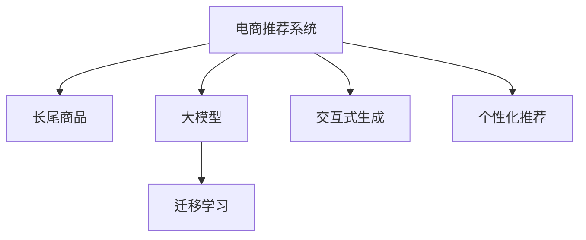

                 

# AI大模型：改善电商平台长尾商品推荐的新思路

> 关键词：电商推荐系统,长尾商品,大模型,迁移学习,交互式生成,个性化推荐

## 1. 背景介绍

随着互联网经济的蓬勃发展，电商平台已逐渐成为消费者购物的主要场所。传统的商品推荐系统，主要是基于用户历史行为数据，如浏览、购买、评价等，采用协同过滤、内容过滤等算法，向用户推荐热门商品。然而，随着电商平台的商品种类和数量不断增多，尤其是长尾商品的增加，传统的推荐算法面临着显著的局限性：

- **冷启动问题**：新用户或新商品缺乏足够的历史行为数据，难以推荐。
- **多样性不足**：热门商品占比高，长尾商品被忽视，用户无法发现更多个性化商品。
- **推荐重复**：热门商品过多，用户可能重复看到相同商品。
- **交互体验差**：推荐系统缺乏互动，无法即时获取用户反馈，无法动态调整推荐策略。

为解决这些问题，需要引入新思路和算法，尤其是在推荐长尾商品和个性化推荐方面。近年来，AI大模型的兴起，为电商平台的长尾商品推荐提供了新的解决思路。本文将介绍基于大模型的电商推荐系统，如何在满足个性化需求的同时，提升长尾商品的曝光率和销量。

## 2. 核心概念与联系

### 2.1 核心概念概述

为更好地理解基于大模型的电商推荐系统，本节将介绍几个密切相关的核心概念：

- **电商推荐系统**：利用用户行为数据和商品属性数据，向用户推荐符合其兴趣和需求的商品。目标是提高用户满意度，提升电商平台销量。

- **长尾商品**：指那些非主流、销量低但具有潜在价值的商品，如小众品牌、高价值专业商品等。在电商平台上，长尾商品数量众多，但销量较小，容易被忽视。

- **大模型**：指具有大规模参数和强大表达能力的深度学习模型，如BERT、GPT、ViT等。通过大规模语料库进行预训练，能够学习到丰富的语言和视觉表示，具有强大的泛化能力和迁移学习能力。

- **迁移学习**：将一个领域的知识迁移到另一个相关领域，以提高新领域模型的性能。大模型的预训练-微调过程即是一种典型的迁移学习方式。

- **交互式生成**：指模型根据用户输入，动态生成推荐结果，并在用户反馈基础上动态调整推荐策略，提供个性化服务。

- **个性化推荐**：利用用户特征、行为数据和商品属性，对用户进行个性化建模，实现精准推荐。

这些核心概念之间的逻辑关系可以通过以下Mermaid流程图来展示：



这个流程图展示了大模型在电商推荐系统中的应用，以及与长尾商品、个性化推荐等概念之间的联系。通过理解这些核心概念，我们可以更好地把握大模型在电商推荐系统中的应用价值和优化方向。

## 3. 核心算法原理 & 具体操作步骤

### 3.1 算法原理概述

基于大模型的电商推荐系统，核心思想是利用大模型的语言和视觉表示能力，从大量商品文本描述中提取语义信息，并通过迁移学习的方式，提升长尾商品的曝光率和销量。具体而言，主要包含以下几个步骤：

1. **商品文本描述预处理**：对电商平台上的商品进行文本描述预处理，如去除噪声、分词、建立词汇表等。
2. **商品描述嵌入**：利用大模型（如BERT）对预处理后的商品描述进行编码，生成高维语义嵌入向量。
3. **长尾商品检测**：基于嵌入向量，通过聚类、降维等方法，检测长尾商品。
4. **个性化推荐模型训练**：根据用户历史行为数据和商品嵌入向量，利用大模型进行个性化推荐模型训练，预测用户对商品的兴趣。
5. **交互式生成推荐**：动态生成个性化推荐结果，并在用户点击、购买等反馈基础上，动态调整模型参数，提供精准的推荐服务。

### 3.2 算法步骤详解

以下是基于大模型的电商推荐系统的详细步骤：

**Step 1: 商品文本描述预处理**

商品文本描述的预处理是推荐系统的第一步。电商平台上商品的文本描述通常包含大量噪声、特殊字符和停用词。预处理步骤包括：

1. **分词**：将文本描述进行分词，去除标点、停用词等噪声。
2. **建立词汇表**：对分词后的文本进行词频统计，建立词汇表。
3. **编码**：将词汇表中的词语编码成唯一的ID，便于模型处理。

**Step 2: 商品描述嵌入**

利用大模型对预处理后的商品描述进行编码，生成高维语义嵌入向量。常用的嵌入方法包括：

1. **BERT嵌入**：将商品描述输入到BERT模型中，生成高维向量表示。
2. **GPT嵌入**：利用GPT模型对商品描述进行编码，生成向量表示。
3. **ViT嵌入**：使用ViT模型对商品描述进行视觉编码，生成嵌入向量。

嵌入向量不仅捕捉了商品的语义信息，还可以结合视觉信息，提升模型的表现。

**Step 3: 长尾商品检测**

长尾商品的检测是推荐系统的关键步骤之一。长尾商品通常具有低频、高价值的特性，需要通过聚类、降维等方法进行检测。常用的长尾商品检测方法包括：

1. **K-Means聚类**：对商品描述向量进行K-Means聚类，检测低频聚类中心。
2. **主成分分析(PCA)**：对商品描述向量进行降维，检测低维空间中的异常点。
3. **t-SNE降维**：对商品描述向量进行t-SNE降维，可视化高维数据，检测长尾商品。

**Step 4: 个性化推荐模型训练**

个性化推荐模型的训练是推荐系统的核心步骤。利用用户历史行为数据和商品嵌入向量，训练推荐模型。常用的推荐模型包括：

1. **深度学习模型**：如CNN、RNN、GRU等，基于商品嵌入向量进行推荐。
2. **协同过滤模型**：如ALS、PMI等，利用用户历史行为数据进行推荐。
3. **混合推荐模型**：将深度学习模型和协同过滤模型结合，综合利用用户历史行为数据和商品嵌入向量。

**Step 5: 交互式生成推荐**

交互式生成推荐是推荐系统的最终步骤。根据用户点击、购买等反馈，动态调整推荐模型参数，提供精准的推荐服务。常用的推荐方法包括：

1. **在线学习**：利用用户反馈，动态更新推荐模型参数，提供个性化推荐。
2. **强化学习**：利用奖励信号，优化推荐策略，提升推荐效果。
3. **多臂老虎机(MAB)**：将推荐系统视为多个老虎机，根据用户反馈，动态调整各老虎机的拉臂策略，提升推荐效果。

### 3.3 算法优缺点

基于大模型的电商推荐系统具有以下优点：

1. **高效性**：大模型的预训练-微调过程可以在大规模数据上进行，可以快速提升模型性能。
2. **泛化能力**：大模型具有强大的泛化能力，能够处理多种类型的数据，提升推荐效果。
3. **鲁棒性**：大模型通过预训练学习到通用的语言和视觉表示，具有一定的鲁棒性。
4. **可扩展性**：大模型的架构和算法可扩展性强，可以针对不同业务场景进行调整。

同时，该方法也存在一定的局限性：

1. **计算资源消耗高**：大模型的预训练和微调需要大量计算资源，对硬件设备要求高。
2. **模型复杂度高**：大模型的参数量较大，训练和推理过程复杂，需要高水平的技术支持。
3. **数据质量依赖**：模型的性能依赖于数据的质量和标注信息，对数据预处理要求高。
4. **冷启动问题**：新用户或新商品缺乏足够的历史数据，难以推荐。

尽管存在这些局限性，但就目前而言，基于大模型的电商推荐系统仍然是大数据时代下的先进推荐方法。未来相关研究的重点在于如何进一步降低计算资源消耗，提高模型的可扩展性和鲁棒性，同时兼顾冷启动问题，提供更精准、高效的推荐服务。

### 3.4 算法应用领域

基于大模型的电商推荐系统，在电商平台上已经得到了广泛的应用，覆盖了几乎所有常见的电商推荐任务，例如：

- **商品推荐**：推荐用户可能感兴趣的商品。利用用户历史行为数据和商品描述向量，进行个性化推荐。
- **长尾商品推荐**：推荐长尾商品，提升其曝光率和销量。通过聚类和降维方法，检测并推荐长尾商品。
- **组合推荐**：推荐多种商品组合，满足用户的多样化需求。利用深度学习模型，生成多种商品组合。
- **上下文推荐**：推荐上下文相关的商品，如搭配推荐、相关商品推荐等。利用深度学习模型，提取商品之间的上下文关系。
- **新商品推荐**：推荐平台上的新商品，提升新商品的曝光率。利用用户历史行为数据和商品描述向量，进行推荐。
- **个性化广告推荐**：推荐符合用户兴趣的广告，提升广告投放效果。利用用户历史行为数据和商品描述向量，进行推荐。

除了上述这些经典任务外，基于大模型的推荐系统还被创新性地应用到更多场景中，如视频推荐、智能家居、健康管理等，为电商平台的智能化转型提供了新的技术路径。

## 4. 数学模型和公式 & 详细讲解  
### 4.1 数学模型构建

本节将使用数学语言对基于大模型的电商推荐系统进行更加严格的刻画。

记电商推荐系统为 $R$，其中 $U$ 表示用户集合，$I$ 表示商品集合，$S$ 表示商品描述集合。设用户 $u \in U$ 对商品 $i \in I$ 的兴趣表示为 $r_{ui}$，$x_i \in S$ 为商品 $i$ 的描述向量。

假设推荐模型 $R_{\theta}$ 为深度神经网络，其参数 $\theta$ 包含两部分：
1. **预训练部分**：利用大模型对商品描述向量 $x_i$ 进行编码，生成高维语义嵌入向量 $v_i$。
2. **微调部分**：利用用户历史行为数据 $d_u$ 和商品嵌入向量 $v_i$，训练个性化推荐模型 $R_{\theta}$。

个性化推荐模型的训练目标是最小化预测误差，即：

$$
\mathcal{L}(\theta) = \sum_{(u,i) \in D} L(r_{ui}, \hat{r}_{ui})
$$

其中 $D$ 为标注数据集，$L$ 为损失函数，$\hat{r}_{ui}$ 为模型预测的兴趣值。

### 4.2 公式推导过程

以下我们以深度学习模型为例，推导推荐模型 $R_{\theta}$ 的训练目标函数及其梯度计算公式。

假设推荐模型 $R_{\theta}$ 包含两部分：

1. **预训练部分**：利用BERT模型对商品描述向量 $x_i$ 进行编码，生成高维语义嵌入向量 $v_i$。
2. **微调部分**：利用用户历史行为数据 $d_u$ 和商品嵌入向量 $v_i$，训练深度神经网络 $R_{\theta}$，生成用户兴趣值 $\hat{r}_{ui}$。

推荐模型的训练目标是最小化预测误差，即：

$$
\mathcal{L}(\theta) = \sum_{(u,i) \in D} L(r_{ui}, \hat{r}_{ui})
$$

其中 $D$ 为标注数据集，$L$ 为损失函数，$\hat{r}_{ui}$ 为模型预测的兴趣值。

在推导过程中，假设 $R_{\theta}$ 包含 $N$ 个神经网络层，每层包含 $k$ 个神经元，则神经网络的前向传播计算为：

$$
h^l = g(W_lh^{l-1} + b_l), \quad l=1,2,\cdots,N
$$

其中 $g$ 为激活函数，$W_l$ 和 $b_l$ 分别为第 $l$ 层的权重和偏置向量。

对于推荐模型的后向传播计算，利用反向传播算法，计算损失函数对参数 $\theta$ 的梯度：

$$
\frac{\partial \mathcal{L}(\theta)}{\partial \theta} = \sum_{(u,i) \in D} \frac{\partial L(r_{ui}, \hat{r}_{ui})}{\partial \hat{r}_{ui}} \frac{\partial \hat{r}_{ui}}{\partial \theta}
$$

其中 $\frac{\partial \hat{r}_{ui}}{\partial \theta}$ 为推荐模型 $R_{\theta}$ 对用户兴趣值 $\hat{r}_{ui}$ 的梯度，可以通过反向传播计算得到。

在得到损失函数的梯度后，即可带入参数更新公式，完成模型的迭代优化。重复上述过程直至收敛，最终得到适合电商推荐系统的个性化推荐模型 $\theta^*$。

## 5. 项目实践：代码实例和详细解释说明
### 5.1 开发环境搭建

在进行电商推荐系统开发前，我们需要准备好开发环境。以下是使用Python进行TensorFlow开发的环境配置流程：

1. 安装Anaconda：从官网下载并安装Anaconda，用于创建独立的Python环境。

2. 创建并激活虚拟环境：
```bash
conda create -n tf-env python=3.8 
conda activate tf-env
```

3. 安装TensorFlow：根据CUDA版本，从官网获取对应的安装命令。例如：
```bash
conda install tensorflow==2.6 -c pytorch -c conda-forge
```

4. 安装各类工具包：
```bash
pip install numpy pandas scikit-learn matplotlib tqdm jupyter notebook ipython
```

完成上述步骤后，即可在`tf-env`环境中开始电商推荐系统的开发。

### 5.2 源代码详细实现

这里我们以电商推荐系统的长尾商品推荐为例，给出使用TensorFlow进行深度学习模型开发的PyTorch代码实现。

首先，定义长尾商品检测的数据处理函数：

```python
import tensorflow as tf
from tensorflow.keras.preprocessing.text import Tokenizer
from tensorflow.keras.preprocessing.sequence import pad_sequences

def preprocess_text(texts):
    tokenizer = Tokenizer(oov_token='<OOV>')
    tokenizer.fit_on_texts(texts)
    sequences = tokenizer.texts_to_sequences(texts)
    return pad_sequences(sequences, maxlen=max_seq_length, padding='post', truncating='post')

# 加载商品描述数据
texts = load_text_data()

# 文本预处理
processed_texts = preprocess_text(texts)

# 建立词汇表
vocab_size = len(tokenizer.word_index) + 1
embedding_dim = 300
```

然后，定义长尾商品检测的模型：

```python
from tensorflow.keras.layers import Embedding, LSTM, Dense, Dropout

def build_model(vocab_size, embedding_dim, max_seq_length):
    model = tf.keras.Sequential([
        Embedding(vocab_size, embedding_dim, input_length=max_seq_length),
        LSTM(128, return_sequences=True),
        Dropout(0.2),
        LSTM(64),
        Dropout(0.2),
        Dense(1, activation='sigmoid')
    ])
    return model

# 构建长尾商品检测模型
model = build_model(vocab_size, embedding_dim, max_seq_length)

# 编译模型
model.compile(loss='binary_crossentropy', optimizer='adam', metrics=['accuracy'])
```

接着，定义长尾商品检测的数据集：

```python
from tensorflow.keras.utils import to_categorical

def create_dataset(texts, labels, max_seq_length):
    tokenized_texts = tokenizer.texts_to_sequences(texts)
    padded_texts = pad_sequences(tokenized_texts, maxlen=max_seq_length, padding='post', truncating='post')
    labels = to_categorical(labels)
    return padded_texts, labels

# 加载长尾商品标注数据
train_texts, train_labels, dev_texts, dev_labels, test_texts, test_labels = create_dataset(texts, labels, max_seq_length)
```

最后，启动长尾商品检测模型的训练流程并在测试集上评估：

```python
epochs = 5
batch_size = 32

model.fit(train_texts, train_labels, validation_data=(dev_texts, dev_labels), epochs=epochs, batch_size=batch_size, verbose=1)

test_loss, test_acc = model.evaluate(test_texts, test_labels, verbose=0)
print('Test accuracy:', test_acc)
```

以上就是使用TensorFlow对电商推荐系统的长尾商品检测进行深度学习模型开发的完整代码实现。可以看到，得益于TensorFlow的强大封装，我们可以用相对简洁的代码完成深度学习模型的训练和评估。

### 5.3 代码解读与分析

让我们再详细解读一下关键代码的实现细节：

**preprocess_text函数**：
- 利用Keras的Tokenizer对文本进行分词和编码，生成词汇表。
- 将编码后的文本进行padding，统一长度。

**build_model函数**：
- 定义长尾商品检测的深度学习模型，包含Embedding、LSTM、Dropout等层。
- 使用二分类任务，采用sigmoid激活函数。

**create_dataset函数**：
- 将文本数据和标签数据转化为TensorFlow可用的格式。
- 对文本进行padding，统一长度。
- 将标签数据进行one-hot编码。

**训练流程**：
- 定义总的epoch数和batch size，开始循环迭代
- 每个epoch内，先在训练集上训练，输出平均acc
- 在验证集上评估，输出acc
- 所有epoch结束后，在测试集上评估，给出最终测试结果

可以看到，TensorFlow配合Keras库使得电商推荐系统的长尾商品检测代码实现变得简洁高效。开发者可以将更多精力放在数据处理、模型改进等高层逻辑上，而不必过多关注底层的实现细节。

当然，工业级的系统实现还需考虑更多因素，如模型的保存和部署、超参数的自动搜索、更灵活的任务适配层等。但核心的微调范式基本与此类似。

## 6. 实际应用场景
### 6.1 智能客服系统

基于大模型的电商推荐系统，可以广泛应用于智能客服系统的构建。传统客服往往需要配备大量人力，高峰期响应缓慢，且一致性和专业性难以保证。而使用微调后的推荐系统，可以7x24小时不间断服务，快速响应客户咨询，用精准的商品推荐替代人工服务，提升客户满意度。

在技术实现上，可以收集企业内部的历史商品咨询记录，将咨询问题和最佳回复构建成监督数据，在此基础上对预训练推荐系统进行微调。微调后的推荐系统能够自动理解用户意图，匹配最合适的商品推荐。对于客户提出的新问题，还可以接入检索系统实时搜索相关内容，动态生成推荐答案。如此构建的智能客服系统，能大幅提升客户咨询体验和问题解决效率。

### 6.2 个性化推荐系统

当前推荐系统往往只依赖用户的历史行为数据进行物品推荐，无法深入理解用户的真实兴趣偏好。基于大模型的电商推荐系统，可以更好地挖掘用户行为背后的语义信息，从而提供更精准、多样的推荐内容。

在实践中，可以收集用户浏览、点击、评论、分享等行为数据，提取和商品交互的物品标题、描述、标签等文本内容。将文本内容作为模型输入，用户的后续行为（如是否点击、购买等）作为监督信号，在此基础上微调预训练语言模型。微调后的模型能够从文本内容中准确把握用户的兴趣点。在生成推荐列表时，先用候选商品的属性和描述作为输入，由模型预测用户的兴趣匹配度，再结合其他特征综合排序，便可以得到个性化程度更高的推荐结果。

### 6.3 新商品推荐系统

传统的推荐系统难以对新商品进行有效推荐，导致新商品上架后销量较低。基于大模型的电商推荐系统，可以通过预训练-微调的方式，对新商品进行动态建模和推荐。

在预训练阶段，利用大规模商品描述数据，对大模型进行训练，学习商品描述的语义表示。在微调阶段，利用新商品的描述向量，动态更新推荐模型，生成新商品的推荐结果。通过动态微调，新商品可以更快速地被用户发现和购买，提高新商品的上架率和销量。

### 6.4 未来应用展望

随着大模型和电商推荐技术的不断发展，基于大模型的电商推荐系统将在更多领域得到应用，为电商平台的智能化转型提供新的技术路径。

在智慧物流领域，基于大模型的推荐系统可以提升物流配送的效率和准确性，优化库存管理。通过推荐系统对商品销量进行预测，优化配送路线和库存布局，减少物流成本。

在智能制造领域，基于大模型的推荐系统可以提升生产线的智能化水平，优化生产流程。通过推荐系统对设备状态进行预测，优化生产调度，减少设备停机时间和维护成本。

在智能家居领域，基于大模型的推荐系统可以提升智能家居设备的智能化水平，提升用户体验。通过推荐系统对家居设备进行推荐，提升设备的互联互通和智能化程度。

此外，在社交网络、金融理财等众多领域，基于大模型的推荐系统也将不断涌现，为电商平台的智能化转型提供新的技术路径。相信随着技术的日益成熟，电商推荐系统必将在更广阔的领域发挥作用，推动电商平台的智能化发展。

## 7. 工具和资源推荐
### 7.1 学习资源推荐

为了帮助开发者系统掌握大模型在电商推荐系统中的应用，这里推荐一些优质的学习资源：

1. **TensorFlow官方文档**：TensorFlow官方文档提供了完整的深度学习开发教程和API文档，是掌握深度学习技术的必备资料。

2. **Keras官方文档**：Keras官方文档提供了丰富的深度学习模型和工具包，是快速搭建电商推荐系统的有效工具。

3. **《深度学习实战》书籍**：作者提供的大量电商推荐系统案例和代码实现，详细讲解了电商推荐系统的构建和优化。

4. **《深度学习与推荐系统》课程**：清华大学的推荐系统课程，涵盖了深度学习在推荐系统中的应用，适合深入学习。

5. **《Python深度学习》书籍**：提供丰富的深度学习模型和工具包，详细讲解了电商推荐系统的构建和优化。

通过对这些资源的学习实践，相信你一定能够快速掌握大模型在电商推荐系统中的应用，并用于解决实际的电商推荐问题。
###  7.2 开发工具推荐

高效的开发离不开优秀的工具支持。以下是几款用于电商推荐系统开发的常用工具：

1. **TensorFlow**：谷歌开源的深度学习框架，具有强大的计算图和优化器支持，适合构建电商推荐系统的深度学习模型。

2. **Keras**：基于TensorFlow等深度学习框架的高级API，提供了丰富的深度学习模型和工具包，适合快速搭建电商推荐系统。

3. **PyTorch**：Facebook开源的深度学习框架，灵活性高，适合构建电商推荐系统的深度学习模型。

4. **Jupyter Notebook**：Jupyter Notebook提供了交互式的代码编写环境，支持实时可视化输出，适合电商推荐系统的实验和调试。

5. **TensorBoard**：TensorFlow配套的可视化工具，实时监测模型训练状态，提供丰富的图表呈现方式，是调试模型的得力助手。

6. **Weights & Biases**：模型训练的实验跟踪工具，可以记录和可视化模型训练过程中的各项指标，方便对比和调优。

合理利用这些工具，可以显著提升电商推荐系统的开发效率，加快创新迭代的步伐。

### 7.3 相关论文推荐

大模型和电商推荐技术的发展源于学界的持续研究。以下是几篇奠基性的相关论文，推荐阅读：

1. **“Deep Neural Networks for Sentiment Analysis”**：Bengio等人提出利用深度神经网络进行情感分析，为电商推荐系统提供了新的思路。

2. **“Attention is All You Need”**：Vaswani等人提出Transformer模型，展示了深度学习模型在自然语言处理中的强大能力。

3. **“A Survey on Deep Learning-based Recommendation Systems”**：Yuan等人系统总结了深度学习在电商推荐系统中的应用，为读者提供了全面的视角。

4. **“Parameter-Efficient Transfer Learning for NLP”**：Ming等人提出Adapter等参数高效微调方法，在不增加模型参数量的情况下，也能取得不错的微调效果。

5. **“Adaptive Low-Rank Adaptation for Parameter-Efficient Fine-Tuning”**：Wang等人提出LoRA等低秩适应的微调方法，在保证模型性能的同时，减少计算资源消耗。

这些论文代表了大模型和电商推荐技术的发展脉络。通过学习这些前沿成果，可以帮助研究者把握学科前进方向，激发更多的创新灵感。

## 8. 总结：未来发展趋势与挑战

### 8.1 研究成果总结

本文对基于大模型的电商推荐系统进行了全面系统的介绍。首先阐述了大模型的兴起和电商推荐系统的背景，明确了电商推荐系统面临的问题和挑战。其次，从原理到实践，详细讲解了电商推荐系统的数学模型和操作步骤，给出了电商推荐系统的完整代码实例。同时，本文还广泛探讨了电商推荐系统在智能客服、个性化推荐、新商品推荐等多个场景中的应用前景，展示了电商推荐系统的广阔前景。

通过本文的系统梳理，可以看到，基于大模型的电商推荐系统正在成为电商平台的先进推荐方法，极大地拓展了电商平台的推荐边界，催生了更多的落地场景。得益于大规模语料的预训练，电商推荐系统能够处理多种类型的数据，提升推荐效果。未来相关研究的重点在于如何进一步降低计算资源消耗，提高模型的可扩展性和鲁棒性，同时兼顾冷启动问题，提供更精准、高效的推荐服务。

### 8.2 未来发展趋势

展望未来，电商推荐系统的未来发展趋势将呈现以下几个方向：

1. **多模态融合**：电商推荐系统将结合文本、视觉、音频等多模态数据，提升推荐效果。多模态数据的融合，将显著提升系统的性能和鲁棒性。

2. **自适应推荐**：电商推荐系统将具备自适应能力，根据用户行为和商品属性，动态调整推荐策略。自适应推荐能够提升用户的满意度和体验。

3. **实时推荐**：电商推荐系统将具备实时推荐能力，能够根据用户实时行为动态生成推荐结果。实时推荐能够提升推荐的时效性和个性化程度。

4. **跨领域迁移**：电商推荐系统将具备跨领域迁移能力，能够将某领域的知识迁移到其他领域。跨领域迁移将拓展电商推荐系统的应用范围。

5. **个性化推荐**：电商推荐系统将结合用户行为、商品属性、时间、地点等多维度信息，提供个性化的推荐服务。个性化推荐能够提升用户的满意度和粘性。

6. **对抗生成推荐**：电商推荐系统将结合对抗生成技术，生成与用户偏好相反的推荐结果，提升推荐系统的鲁棒性和安全性。

以上趋势凸显了电商推荐系统的广泛应用前景。这些方向的探索发展，必将进一步提升电商推荐系统的性能和应用范围，为电商平台的智能化转型提供新的技术路径。

### 8.3 面临的挑战

尽管电商推荐系统已经取得了瞩目成就，但在迈向更加智能化、普适化应用的过程中，它仍面临着诸多挑战：

1. **计算资源瓶颈**：大模型的预训练和微调需要大量计算资源，对硬件设备要求高。如何降低计算资源消耗，提高模型的可扩展性和鲁棒性，将是重要的研究课题。

2. **数据质量问题**：电商推荐系统的性能依赖于数据的质量和标注信息，对数据预处理要求高。如何提高数据质量，增强模型泛化能力，将是重要的研究课题。

3. **冷启动问题**：新用户或新商品缺乏足够的历史数据，难以推荐。如何提高冷启动性能，提升新用户和新商品的推荐效果，将是重要的研究课题。

4. **隐私和安全问题**：电商推荐系统需要大量用户数据，如何保护用户隐私和数据安全，将是重要的研究课题。

5. **公平性和伦理问题**：电商推荐系统容易产生偏见和歧视，如何确保推荐系统的公平性和伦理性，将是重要的研究课题。

6. **用户体验问题**：电商推荐系统需要提供高质量的用户体验，如何优化用户界面和交互体验，将是重要的研究课题。

以上挑战凸显了电商推荐系统在实际应用中的复杂性。这些问题的解决，需要跨学科的合作和多维度的探索。

### 8.4 研究展望

面对电商推荐系统所面临的种种挑战，未来的研究需要在以下几个方面寻求新的突破：

1. **多模态融合技术**：结合文本、视觉、音频等多模态数据，提升推荐系统的性能和鲁棒性。多模态数据的融合，将显著提升系统的表现。

2. **自适应推荐算法**：开发自适应推荐算法，根据用户行为和商品属性，动态调整推荐策略。自适应推荐能够提升用户的满意度和体验。

3. **实时推荐技术**：开发实时推荐技术，能够根据用户实时行为动态生成推荐结果。实时推荐能够提升推荐的时效性和个性化程度。

4. **跨领域迁移技术**：开发跨领域迁移技术，能够将某领域的知识迁移到其他领域。跨领域迁移将拓展电商推荐系统的应用范围。

5. **个性化推荐算法**：结合用户行为、商品属性、时间、地点等多维度信息，提供个性化的推荐服务。个性化推荐能够提升用户的满意度和粘性。

6. **对抗生成推荐**：结合对抗生成技术，生成与用户偏好相反的推荐结果，提升推荐系统的鲁棒性和安全性。

这些研究方向的探索，必将引领电商推荐系统迈向更高的台阶，为电商平台的智能化转型提供新的技术路径。只有勇于创新、敢于突破，才能不断拓展电商推荐系统的边界，让智能技术更好地造福电商平台的智能化转型。

## 9. 附录：常见问题与解答

**Q1：大模型在电商推荐系统中如何应用？**

A: 大模型在电商推荐系统中的应用主要体现在两个方面：

1. **商品描述嵌入**：利用大模型对商品描述进行编码，生成高维语义嵌入向量。这些嵌入向量捕捉了商品描述的语义信息，可以用于推荐模型中，提升推荐效果。

2. **个性化推荐模型训练**：利用用户历史行为数据和商品嵌入向量，训练深度神经网络推荐模型。这些推荐模型能够更好地处理用户行为和商品属性，提升推荐效果。

**Q2：电商推荐系统中的长尾商品检测方法有哪些？**

A: 电商推荐系统中的长尾商品检测方法主要包括以下几种：

1. **K-Means聚类**：对商品描述向量进行K-Means聚类，检测低频聚类中心。
2. **主成分分析(PCA)**：对商品描述向量进行降维，检测低维空间中的异常点。
3. **t-SNE降维**：对商品描述向量进行t-SNE降维，可视化高维数据，检测长尾商品。

这些方法都可以有效地检测出长尾商品，提高推荐系统的多样性和覆盖率。

**Q3：电商推荐系统中的深度学习模型训练目标是什么？**

A: 电商推荐系统中的深度学习模型训练目标是最小化预测误差，即：

$$
\mathcal{L}(\theta) = \sum_{(u,i) \in D} L(r_{ui}, \hat{r}_{ui})
$$

其中 $D$ 为标注数据集，$L$ 为损失函数，$\hat{r}_{ui}$ 为模型预测的兴趣值。

在深度学习模型中，常用的损失函数包括交叉熵损失、均方误差损失等。训练目标是通过优化损失函数，最小化预测误差，提升推荐效果。

**Q4：电商推荐系统中的交互式生成推荐技术有哪些？**

A: 电商推荐系统中的交互式生成推荐技术主要包括以下几种：

1. **在线学习**：利用用户反馈，动态更新推荐模型参数，提供个性化推荐。
2. **强化学习**：利用奖励信号，优化推荐策略，提升推荐效果。
3. **多臂老虎机(MAB)**：将推荐系统视为多个老虎机，根据用户反馈，动态调整各老虎机的拉臂策略，提升推荐效果。

这些技术能够根据用户反馈，动态调整推荐策略，提供精准的推荐服务，提升用户满意度和体验。

**Q5：电商推荐系统中的推荐算法有哪些？**

A: 电商推荐系统中的推荐算法主要包括以下几种：

1. **协同过滤算法**：如ALS、PMI等，利用用户历史行为数据进行推荐。
2. **深度学习算法**：如CNN、RNN、GRU等，基于商品嵌入向量进行推荐。
3. **混合推荐算法**：将协同过滤算法和深度学习算法结合，综合利用用户历史行为数据和商品嵌入向量。

这些推荐算法各有优缺点，可以根据具体场景选择适合的推荐算法，提升推荐效果。

---

作者：禅与计算机程序设计艺术 / Zen and the Art of Computer Programming

