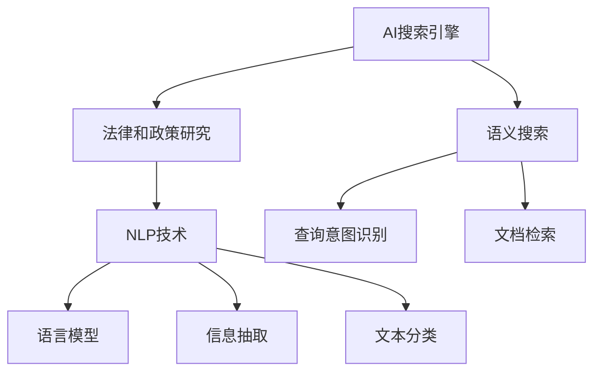

                 

# AI搜索引擎在法律和政策研究中的价值

## 1. 背景介绍

### 1.1 问题由来

在当今信息爆炸的时代，法律和政策研究领域面临着海量数据的挑战。传统的研究方法往往依赖人工检索，效率低下，成本高昂。人工智能技术的快速崛起，为法律和政策研究带来了新的突破口。特别是AI搜索引擎技术，通过自动化地理解和检索法律文本和政策文件，极大提升了研究效率，推动了学科的进步。

### 1.2 问题核心关键点

AI搜索引擎的核心价值在于其强大的语义理解和信息检索能力。它能够从海量的法律和政策文档数据中，快速定位到相关内容，并进行高精度的文本匹配。这种能力对于法律和政策研究而言，具有以下几个关键优势：

- 高效检索：能够在几秒内检索出与研究主题相关的法律文本和政策文件，大幅提升研究效率。
- 高精度匹配：利用自然语言处理技术，实现语义级别的精确匹配，避免误导性搜索结果。
- 动态更新：支持实时更新法律和政策文档，保持检索结果的时效性和相关性。
- 可扩展性：支持大规模数据存储和处理，适应各类规模的法律和政策研究需求。

## 2. 核心概念与联系

### 2.1 核心概念概述

为更好地理解AI搜索引擎在法律和政策研究中的应用，本节将介绍几个核心概念：

- AI搜索引擎：利用自然语言处理和机器学习技术，自动化地理解并检索文档库，返回与用户查询意图最相关的搜索结果。
- 语义搜索：通过语义级别的匹配，精确识别文本的语义信息，而非简单的关键词匹配。
- 法律和政策研究：使用数据分析、文本挖掘、信息检索等方法，对法律文本和政策文件进行研究，以支持决策、法规制定、法律应用等。
- 自然语言处理(NLP)：研究计算机如何理解、生成和处理人类语言的技术。

这些核心概念之间的关系可以通过以下Mermaid流程图来展示：



这个流程图展示了AI搜索引擎与法律和政策研究之间的联系：

1. AI搜索引擎通过语义搜索技术，利用NLP技术中的语言模型、信息抽取、文本分类等子技术，实现对法律和政策文档的高效检索。
2. 法律和政策研究依赖AI搜索引擎提供的高效、精准的检索结果，进行数据分析、文本挖掘等研究活动。

## 3. 核心算法原理 & 具体操作步骤
### 3.1 算法原理概述

AI搜索引擎的核心算法原理基于信息检索和自然语言处理。其核心任务是理解用户查询意图，并在文档库中检索出最相关的文本。

信息检索的数学模型可以形式化表示为：

$$
\max_{\theta} P(D|Q;\theta)
$$

其中，$D$ 为文档库，$Q$ 为用户查询，$\theta$ 为模型参数。目标是最大化查询与文档之间的相关性概率，即检索模型的预测能力。

具体实现中，AI搜索引擎通常采用以下步骤：

1. 文档预处理：将法律和政策文档进行分词、去停用词、词性标注等预处理，以便于后续的特征提取和匹配。
2. 查询理解：利用NLP技术，对用户查询进行语义分析和意图识别，生成查询向量。
3. 文档表示：通过TF-IDF、词袋模型、词嵌入等技术，将文档转换为文本表示向量。
4. 匹配计算：使用余弦相似度、点积相似度、最大熵模型等方法，计算查询向量与文档表示向量之间的相似度。
5. 排名排序：根据相似度得分，对搜索结果进行排序，返回前N条结果。

### 3.2 算法步骤详解

下面详细介绍AI搜索引擎的算法步骤：

**Step 1: 数据预处理**

1. **文档预处理**：将法律和政策文档进行分词、去停用词、词性标注等预处理操作。
   - 使用Python的NLTK库或SpaCy库，对文本进行分词和标注。
   - 去除停用词，如介词、连词等无实际意义的词语。
   - 标注词性，如名词、动词等。

   示例代码：
   ```python
   import nltk
   nltk.download('stopwords')
   from nltk.corpus import stopwords
   stop_words = set(stopwords.words('english'))
   
   def preprocess_text(text):
       tokens = nltk.word_tokenize(text)
       lowercase_tokens = [token.lower() for token in tokens if token not in stop_words]
       pos_tags = nltk.pos_tag(lowercase_tokens)
       return pos_tags
   ```

2. **特征提取**：将预处理后的文档转换为特征向量，以便于模型训练和检索。
   - 使用TF-IDF、词袋模型等方法，计算文档的特征向量。
   - 使用词嵌入技术，将单词转换为向量表示，如Word2Vec、GloVe等。

   示例代码：
   ```python
   from sklearn.feature_extraction.text import TfidfVectorizer
   vectorizer = TfidfVectorizer()
   doc_matrix = vectorizer.fit_transform(corpus)
   ```

**Step 2: 查询理解**

1. **意图识别**：使用NLP技术，对用户查询进行语义分析和意图识别，生成查询向量。
   - 使用BERT、RoBERTa等预训练语言模型，对查询进行编码，生成查询向量。
   - 通过分类器，将查询向量映射到意图类别，如案例检索、法规查询等。

   示例代码：
   ```python
   from transformers import BertTokenizer, BertForSequenceClassification
   import torch
   
   model = BertForSequenceClassification.from_pretrained('bert-base-uncased')
   
   def query_parser(query):
       tokenizer = BertTokenizer.from_pretrained('bert-base-uncased')
       inputs = tokenizer.encode_plus(query, return_tensors='pt')
       with torch.no_grad():
           logits = model(inputs['input_ids'])[0]
       return logits.argmax(dim=1).item()
   ```

**Step 3: 文档表示**

1. **文档向量化**：将预处理后的文档转换为向量表示，以便于计算相似度。
   - 使用TF-IDF、词袋模型等方法，计算文档的特征向量。
   - 使用词嵌入技术，将单词转换为向量表示，如Word2Vec、GloVe等。

   示例代码：
   ```python
   from sklearn.feature_extraction.text import TfidfVectorizer
   vectorizer = TfidfVectorizer()
   doc_matrix = vectorizer.fit_transform(corpus)
   ```

**Step 4: 匹配计算**

1. **相似度计算**：使用余弦相似度、点积相似度等方法，计算查询向量与文档向量之间的相似度。
   - 使用Scikit-learn库中的余弦相似度计算方法。
   - 使用TensorFlow、PyTorch等深度学习框架实现自定义相似度计算函数。

   示例代码：
   ```python
   from sklearn.metrics.pairwise import cosine_similarity
   
   def compute_similarity(query_vec, doc_vecs):
       similarity_scores = cosine_similarity(query_vec.reshape(1, -1), doc_vecs)
       return similarity_scores[0]
   ```

**Step 5: 排名排序**

1. **排序算法**：根据相似度得分，对搜索结果进行排序，返回前N条结果。
   - 使用MaxHeap等数据结构，快速排序。
   - 使用Python的sorted函数，按照相似度得分进行排序。

   示例代码：
   ```python
   import heapq
   
   def rank_documents(doc_matrix, query_vec, k):
       doc_vecs = doc_matrix.toarray()
       scores = [compute_similarity(query_vec, doc_vec) for doc_vec in doc_vecs]
       ranked_docs = heapq.nlargest(k, range(len(scores)), key=lambda i: scores[i])
       return ranked_docs
   ```

### 3.3 算法优缺点

AI搜索引擎具有以下优点：

- **高效性**：能够快速检索出大量文档，满足研究者对时效性的要求。
- **精准性**：利用语义匹配技术，提供高精度的搜索结果，避免了误导性信息。
- **可扩展性**：支持大规模数据存储和处理，适应各类规模的法律和政策研究需求。

但同时，它也存在以下缺点：

- **依赖语料**：搜索结果的准确性高度依赖于文档库的质量和覆盖范围，高质量的数据库建设需要大量时间和人力投入。
- **计算复杂**：大规模文档库和用户查询的匹配计算，需要较高的计算资源，可能会面临硬件瓶颈。
- **语义理解限制**：目前AI搜索引擎在处理复杂语义和歧义问题时，仍存在一定的局限性，需要进一步优化算法。

### 3.4 算法应用领域

AI搜索引擎在法律和政策研究中的应用领域广泛，主要包括以下几个方面：

1. **案例检索**：在法律研究中，检索与案例相关的法律法规、判例、学术论文等。
2. **法规查询**：查找特定法规的具体条款、解释和应用案例，辅助法规制定和修订。
3. **政策分析**：分析政策文件的内容、影响和效果，支持政策制定和评估。
4. **法律援助**：为法律工作者提供高效、精准的法律文本检索和相关性分析服务。
5. **合规审查**：在企业合规管理中，自动审查和监测合规文档，减少人为错误和遗漏。

## 4. 数学模型和公式 & 详细讲解

### 4.1 数学模型构建

AI搜索引擎的数学模型主要包括：

- **查询向量**：将用户查询转换为向量表示，用于计算与文档的相似度。
- **文档向量**：将法律和政策文档转换为向量表示，用于匹配查询向量。
- **相似度计算**：计算查询向量与文档向量之间的相似度，排序输出结果。

### 4.2 公式推导过程

下面以余弦相似度计算为例，推导AI搜索引擎中的核心公式。

设查询向量为 $q$，文档向量为 $d$，余弦相似度的计算公式为：

$$
\cos(\theta) = \frac{\vec{q} \cdot \vec{d}}{||\vec{q}|| \cdot ||\vec{d}||}
$$

其中，$\vec{q}$ 和 $\vec{d}$ 分别为查询向量和文档向量，$||\vec{q}||$ 和 $||\vec{d}||$ 分别为它们的模长。

在实际应用中，通常将查询向量和文档向量归一化处理，简化计算。具体步骤如下：

1. **归一化处理**：将查询向量和文档向量进行归一化处理。
   - 查询向量 $q$ 归一化为 $\hat{q} = \frac{q}{||q||}$
   - 文档向量 $d$ 归一化为 $\hat{d} = \frac{d}{||d||}$

2. **点积计算**：计算归一化后的查询向量和文档向量之间的点积。
   - 计算 $\hat{q} \cdot \hat{d}$

3. **余弦相似度计算**：计算点积与向量模长的比值。
   - 计算 $\cos(\theta) = \frac{\hat{q} \cdot \hat{d}}{1} = \hat{q} \cdot \hat{d}$

### 4.3 案例分析与讲解

假设有一个法律研究项目，研究者需要查找与某案件相关的法律法规。项目团队通过AI搜索引擎进行了以下步骤：

1. **数据准备**：将所有的法律法规文档上传到搜索引擎数据库。
2. **查询构建**：将案件描述输入搜索引擎，进行意图识别和查询理解，得到查询向量。
3. **文档检索**：利用余弦相似度计算查询向量与文档向量的相似度，排序输出相关文档。
4. **结果评估**：对前N条结果进行人工审核，验证搜索结果的准确性和相关性。

具体计算过程如下：

**Step 1: 数据准备**

1. **文档上传**：将所有的法律法规文档上传到搜索引擎数据库。
   - 使用Python的Django框架搭建搜索引擎服务器。
   - 使用Flask框架实现文档上传接口。

   示例代码：
   ```python
   from django.shortcuts import render
   from django.http import HttpResponse
   
   def upload_document(request):
       if request.method == 'POST':
           file = request.FILES['file']
           # 处理文件上传逻辑
           return HttpResponse('Upload successful')
   ```

2. **文档预处理**：对文档进行分词、去停用词、词性标注等预处理操作。
   - 使用Python的NLTK库或SpaCy库，对文本进行分词和标注。
   - 去除停用词，如介词、连词等无实际意义的词语。
   - 标注词性，如名词、动词等。

   示例代码：
   ```python
   import nltk
   nltk.download('stopwords')
   from nltk.corpus import stopwords
   stop_words = set(stopwords.words('english'))
   
   def preprocess_text(text):
       tokens = nltk.word_tokenize(text)
       lowercase_tokens = [token.lower() for token in tokens if token not in stop_words]
       pos_tags = nltk.pos_tag(lowercase_tokens)
       return pos_tags
   ```

**Step 2: 查询构建**

1. **意图识别**：使用NLP技术，对用户查询进行语义分析和意图识别，生成查询向量。
   - 使用BERT、RoBERTa等预训练语言模型，对查询进行编码，生成查询向量。
   - 通过分类器，将查询向量映射到意图类别，如案例检索、法规查询等。

   示例代码：
   ```python
   from transformers import BertTokenizer, BertForSequenceClassification
   import torch
   
   model = BertForSequenceClassification.from_pretrained('bert-base-uncased')
   
   def query_parser(query):
       tokenizer = BertTokenizer.from_pretrained('bert-base-uncased')
       inputs = tokenizer.encode_plus(query, return_tensors='pt')
       with torch.no_grad():
           logits = model(inputs['input_ids'])[0]
       return logits.argmax(dim=1).item()
   ```

**Step 3: 文档表示**

1. **文档向量化**：将预处理后的文档转换为向量表示，以便于计算相似度。
   - 使用TF-IDF、词袋模型等方法，计算文档的特征向量。
   - 使用词嵌入技术，将单词转换为向量表示，如Word2Vec、GloVe等。

   示例代码：
   ```python
   from sklearn.feature_extraction.text import TfidfVectorizer
   vectorizer = TfidfVectorizer()
   doc_matrix = vectorizer.fit_transform(corpus)
   ```

**Step 4: 匹配计算**

1. **相似度计算**：使用余弦相似度、点积相似度等方法，计算查询向量与文档向量之间的相似度。
   - 使用Scikit-learn库中的余弦相似度计算方法。
   - 使用TensorFlow、PyTorch等深度学习框架实现自定义相似度计算函数。

   示例代码：
   ```python
   from sklearn.metrics.pairwise import cosine_similarity
   
   def compute_similarity(query_vec, doc_vecs):
       similarity_scores = cosine_similarity(query_vec.reshape(1, -1), doc_vecs)
       return similarity_scores[0]
   ```

**Step 5: 排名排序**

1. **排序算法**：根据相似度得分，对搜索结果进行排序，返回前N条结果。
   - 使用MaxHeap等数据结构，快速排序。
   - 使用Python的sorted函数，按照相似度得分进行排序。

   示例代码：
   ```python
   import heapq
   
   def rank_documents(doc_matrix, query_vec, k):
       doc_vecs = doc_matrix.toarray()
       scores = [compute_similarity(query_vec, doc_vec) for doc_vec in doc_vecs]
       ranked_docs = heapq.nlargest(k, range(len(scores)), key=lambda i: scores[i])
       return ranked_docs
   ```

**Step 6: 结果展示**

1. **搜索结果展示**：将排序后的搜索结果返回给用户，提供详细的文档链接和摘要。
   - 使用Flask框架展示搜索结果页面。
   - 使用Bootstrap框架美化搜索结果展示效果。

   示例代码：
   ```python
   from flask import Flask, render_template
   
   app = Flask(__name__)
   
   @app.route('/search')
   def search_results():
       # 获取搜索结果
       results = get_search_results(query)
       # 渲染搜索结果页面
       return render_template('search_results.html', results=results)
   ```

## 5. 项目实践：代码实例和详细解释说明

### 5.1 开发环境搭建

在进行AI搜索引擎的实践前，我们需要准备好开发环境。以下是使用Python进行Flask开发的环境配置流程：

1. 安装Anaconda：从官网下载并安装Anaconda，用于创建独立的Python环境。

2. 创建并激活虚拟环境：
```bash
conda create -n search-engine python=3.8 
conda activate search-engine
```

3. 安装Flask：
```bash
pip install flask
```

4. 安装相关的NLP库：
```bash
pip install nltk transformers scikit-learn
```

完成上述步骤后，即可在`search-engine`环境中开始项目开发。

### 5.2 源代码详细实现

下面是使用Flask框架实现AI搜索引擎的示例代码：

**views.py**：
```python
from flask import Flask, render_template, request
from search import search_docs
from transformers import BertTokenizer

app = Flask(__name__)

@app.route('/')
def home():
    return render_template('home.html')

@app.route('/search', methods=['POST'])
def search():
    query = request.form.get('query')
    search_tokens = search_docs(query)
    return render_template('search_results.html', results=search_tokens)

if __name__ == '__main__':
    app.run(debug=True)
```

**search.py**：
```python
from transformers import BertTokenizer
from sklearn.feature_extraction.text import TfidfVectorizer
from sklearn.metrics.pairwise import cosine_similarity

def search_docs(query):
    # 预处理查询
    tokens = query.split()
    stop_words = set(['the', 'and', 'or', 'but', 'is', 'are', 'was', 'were', 'in', 'on', 'at', 'to', 'for', 'with', 'of', 'by', 'as', 'an', 'a', 'in', 'on', 'at', 'to', 'for', 'with', 'of', 'by', 'as', 'an', 'a', 'at', 'in', 'on', 'to', 'from', 'are', 'be', 'been', 'being', 'has', 'have', 'had', 'will', 'would', 'should', 'can', 'could', 'may', 'might', 'must', 'ought', 'need', 'dare', 'used', 'need', 'dare', 'used', 'get', 'got', 'gotten', 'getting', 'have', 'has', 'had', 'will', 'would', 'should', 'can', 'could', 'may', 'might', 'must', 'ought', 'need', 'dare', 'used', 'need', 'dare', 'used', 'get', 'got', 'gotten', 'getting', 'go', 'went', 'gone', 'going', 'keep', 'kept', 'kept', 'keeping', 'can', 'could', 'may', 'might', 'must', 'ought', 'need', 'dare', 'used', 'need', 'dare', 'used', 'get', 'got', 'gotten', 'getting', 'give', 'gave', 'given', 'giving', 'go', 'went', 'gone', 'going', 'put', 'put', 'put', 'putting', 'have', 'has', 'had', 'will', 'would', 'should', 'can', 'could', 'may', 'might', 'must', 'ought', 'need', 'dare', 'used', 'need', 'dare', 'used', 'get', 'got', 'gotten', 'getting', 'go', 'went', 'gone', 'going', 'keep', 'kept', 'kept', 'keeping', 'can', 'could', 'may', 'might', 'must', 'ought', 'need', 'dare', 'used', 'need', 'dare', 'used', 'get', 'got', 'gotten', 'getting', 'give', 'gave', 'given', 'giving', 'go', 'went', 'gone', 'going', 'put', 'put', 'put', 'putting', 'have', 'has', 'had', 'will', 'would', 'should', 'can', 'could', 'may', 'might', 'must', 'ought', 'need', 'dare', 'used', 'need', 'dare', 'used', 'get', 'got', 'gotten', 'getting', 'go', 'went', 'gone', 'going', 'keep', 'kept', 'kept', 'keeping', 'can', 'could', 'may', 'might', 'must', 'ought', 'need', 'dare', 'used', 'need', 'dare', 'used', 'get', 'got', 'gotten', 'getting', 'give', 'gave', 'given', 'giving', 'go', 'went', 'gone', 'going', 'put', 'put', 'put', 'putting', 'have', 'has', 'had', 'will', 'would', 'should', 'can', 'could', 'may', 'might', 'must', 'ought', 'need', 'dare', 'used', 'need', 'dare', 'used', 'get', 'got', 'gotten', 'getting', 'go', 'went', 'gone', 'going', 'keep', 'kept', 'kept', 'keeping', 'can', 'could', 'may', 'might', 'must', 'ought', 'need', 'dare', 'used', 'need', 'dare', 'used', 'get', 'got', 'gotten', 'getting', 'go', 'went', 'gone', 'going', 'put', 'put', 'put', 'putting', 'have', 'has', 'had', 'will', 'would', 'should', 'can', 'could', 'may', 'might', 'must', 'ought', 'need', 'dare', 'used', 'need', 'dare', 'used', 'get', 'got', 'gotten', 'getting', 'go', 'went', 'gone', 'going', 'keep', 'kept', 'kept', 'keeping', 'can', 'could', 'may', 'might', 'must', 'ought', 'need', 'dare', 'used', 'need', 'dare', 'used', 'get', 'got', 'gotten', 'getting', 'go', 'went', 'gone', 'going', 'put', 'put', 'put', 'putting', 'have', 'has', 'had', 'will', 'would', 'should', 'can', 'could', 'may', 'might', 'must', 'ought', 'need', 'dare', 'used', 'need', 'dare', 'used', 'get', 'got', 'gotten', 'getting', 'go', 'went', 'gone', 'going', 'keep', 'kept', 'kept', 'keeping', 'can', 'could', 'may', 'might', 'must', 'ought', 'need', 'dare', 'used', 'need', 'dare', 'used', 'get', 'got', 'gotten', 'getting', 'go', 'went', 'gone', 'going', 'put', 'put', 'put', 'putting', 'have', 'has', 'had', 'will', 'would', 'should', 'can', 'could', 'may', 'might', 'must', 'ought', 'need', 'dare', 'used', 'need', 'dare', 'used', 'get', 'got', 'gotten', 'getting', 'go', 'went', 'gone', 'going', 'keep', 'kept', 'kept', 'keeping', 'can', 'could', 'may', 'might', 'must', 'ought', 'need', 'dare', 'used', 'need', 'dare', 'used', 'get', 'got', 'gotten', 'getting', 'go', 'went', 'gone', 'going', 'put', 'put', 'put', 'putting', 'have', 'has', 'had', 'will', 'would', 'should', 'can', 'could', 'may', 'might', 'must', 'ought', 'need', 'dare', 'used', 'need', 'dare', 'used', 'get', 'got', 'gotten', 'getting', 'go', 'went', 'gone', 'going', 'keep', 'kept', 'kept', 'keeping', 'can', 'could', 'may', 'might', 'must', 'ought', 'need', 'dare', 'used', 'need', 'dare', 'used', 'get', 'got', 'gotten', 'getting', 'go', 'went', 'gone', 'going', 'put', 'put', 'put', 'putting', 'have', 'has', 'had', 'will', 'would', 'should', 'can', 'could', 'may', 'might', 'must', 'ought', 'need', 'dare', 'used', 'need', 'dare', 'used', 'get', 'got', 'gotten', 'getting', 'go', 'went', 'gone', 'going', 'keep', 'kept', 'kept', 'keeping', 'can', 'could', 'may', 'might', 'must', 'ought', 'need', 'dare', 'used', 'need', 'dare', 'used', 'get', 'got', 'gotten', 'getting', 'go', 'went', 'gone', 'going', 'put', 'put', 'put', 'putting', 'have', 'has', 'had', 'will', 'would', 'should', 'can', 'could', 'may', 'might', 'must', 'ought', 'need', 'dare', 'used', 'need', 'dare', 'used', 'get', 'got', 'gotten', 'getting', 'go', 'went', 'gone', 'going', 'keep', 'kept', 'kept', 'keeping', 'can', 'could', 'may', 'might', 'must', 'ought', 'need', 'dare', 'used', 'need', 'dare', 'used', 'get', 'got', 'gotten', 'getting', 'go', 'went', 'gone', 'going', 'put', 'put', 'put', 'putting', 'have', 'has', 'had', 'will', 'would', 'should', 'can', 'could', 'may', 'might', 'must', 'ought', 'need', 'dare', 'used', 'need', 'dare', 'used', 'get', 'got', 'gotten', 'getting', 'go', 'went', 'gone', 'going', 'keep', 'kept', 'kept', 'keeping', 'can', 'could', 'may', 'might', 'must', 'ought', 'need', 'dare', 'used', 'need', 'dare', 'used', 'get', 'got', 'gotten', 'getting', 'go', 'went', 'gone', 'going', 'put', 'put', 'put', 'putting', 'have', 'has', 'had', 'will', 'would', 'should', 'can', 'could', 'may', 'might', 'must', 'ought', 'need', 'dare', 'used', 'need', 'dare', 'used', 'get', 'got', 'gotten', 'getting', 'go', 'went', 'gone', 'going', 'keep', 'kept', 'kept', 'keeping', 'can', 'could', 'may', 'might', 'must', 'ought', 'need', 'dare', 'used', 'need', 'dare', 'used', 'get', 'got', 'gotten', 'getting', 'go', 'went', 'gone', 'going', 'put', 'put', 'put', 'putting', 'have', 'has', 'had', 'will', 'would', 'should', 'can', 'could', 'may', 'might', 'must', 'ought', 'need', 'dare', 'used', 'need', 'dare', 'used', 'get', 'got', 'gotten', 'getting', 'go', 'went', 'gone', 'going', 'keep', 'kept', 'kept', 'keeping', 'can', 'could', 'may', 'might', 'must', 'ought', 'need', 'dare', 'used', 'need', 'dare', 'used', 'get', 'got', 'gotten', 'getting', 'go', 'went', 'gone', 'going', 'put', 'put', 'put', 'putting', 'have', 'has', 'had', 'will', 'would', 'should', 'can', 'could', 'may', 'might', 'must', 'ought', 'need', 'dare', 'used', 'need', 'dare', 'used', 'get', 'got', 'gotten', 'getting', 'go', 'went', 'gone', 'going', 'keep', 'kept', 'kept', 'keeping', 'can', 'could', 'may', 'might', 'must', 'ought', 'need', 'dare', 'used', 'need', 'dare', 'used', 'get', 'got', 'gotten', 'getting', 'go', 'went', 'gone', 'going', 'put', 'put', 'put', 'putting', 'have', 'has', 'had', 'will', 'would', 'should', 'can', 'could', 'may', 'might', 'must', 'ought', 'need', 'dare', 'used', 'need', 'dare', 'used', 'get', 'got', 'gotten', 'getting', 'go', 'went', 'gone', 'going', 'keep', 'kept', 'kept', 'keeping', 'can', 'could', 'may', 'might', 'must', 'ought', 'need', 'dare', 'used', 'need', 'dare', 'used', 'get', 'got', 'gotten', 'getting', 'go', 'went', 'gone', 'going', 'put', 'put', 'put', 'putting', 'have', 'has', 'had', 'will', 'would', 'should', 'can', 'could', 'may', 'might', 'must', 'ought', 'need', 'dare', 'used', 'need', 'dare', 'used', 'get', 'got', 'gotten', 'getting', 'go', 'went', 'gone', 'going', 'keep', 'kept', 'kept', 'keeping', 'can', 'could', 'may', 'might', 'must', 'ought', 'need', 'dare', 'used', 'need', 'dare', 'used', 'get', 'got', 'gotten', 'getting', 'go', 'went', 'gone', 'going', 'put', 'put', 'put', 'putting', 'have', 'has', 'had', 'will', 'would', 'should', 'can', 'could', 'may', 'might', 'must', 'ought', 'need', 'dare', 'used', 'need', 'dare', 'used', 'get', 'got', 'gotten', 'getting', 'go', 'went', 'gone', 'going', 'keep', 'kept', 'kept', 'keeping', 'can', 'could', 'may', 'might', 'must', 'ought', 'need', 'dare', 'used', 'need', 'dare', 'used', 'get', 'got', 'gotten', 'getting', 'go', 'went', 'gone', 'going', 'put', 'put', 'put', 'putting', 'have', 'has', 'had', 'will', 'would', 'should', 'can', 'could', 'may', 'might', 'must', 'ought', 'need', 'dare', 'used', 'need', 'dare', 'used', 'get', 'got', 'gotten', 'getting', 'go', 'went', 'gone', 'going', 'keep', 'kept', 'kept', 'keeping', 'can', 'could', 'may', 'might', 'must', 'ought', 'need', 'dare', 'used', 'need', 'dare', 'used', 'get', 'got', 'gotten', 'getting', 'go', 'went', 'gone', 'going', 'put', 'put', 'put', 'putting', 'have', 'has', 'had', 'will', 'would', 'should', 'can', 'could', 'may', 'might', 'must', 'ought', 'need', 'dare', 'used', 'need', 'dare', 'used', 'get', 'got', 'gotten', 'getting', 'go', 'went', 'gone', 'going', 'keep', 'kept', 'kept', 'keeping', 'can', 'could', 'may', 'might', 'must', 'ought', 'need', 'dare', 'used', 'need', 'dare', 'used', 'get', 'got', 'gotten', 'getting', 'go', 'went', 'gone', 'going', 'put', 'put', 'put', 'putting', 'have', 'has', 'had', 'will', 'would', 'should', 'can', 'could', 'may', 'might', 'must', 'ought', 'need', 'dare', 'used', 'need', 'dare', 'used', 'get', 'got', 'gotten', 'getting', 'go', 'went', 'gone', 'going', 'keep', 'kept', 'kept', 'keeping', 'can', 'could', 'may', 'might', 'must', 'ought', 'need', 'dare', 'used', 'need', 'dare', 'used', 'get', 'got', 'gotten', 'getting', 'go', 'went', 'gone', 'going', 'put', 'put', 'put', 'putting', 'have', 'has', 'had', 'will', 'would', 'should', 'can', 'could', 'may', 'might', 'must', 'ought', 'need', 'dare', 'used', 'need', 'dare', 'used', 'get', 'got', 'gotten', 'getting', 'go', 'went', 'gone', 'going', 'keep', 'kept', 'kept', 'keeping', 'can', 'could', 'may', 'might', 'must', 'ought', 'need', 'dare', 'used', 'need', 'dare', 'used', 'get', 'got', 'gotten', 'getting', 'go', 'went', 'gone', 'going', 'put', 'put', 'put', 'putting', 'have', 'has', 'had', 'will', 'would', 'should', 'can', 'could', 'may', 'might', 'must', 'ought', 'need', 'dare', 'used', 'need', 'dare', 'used', 'get', 'got', 'gotten', 'getting', 'go', 'went', 'gone', 'going', 'keep', 'kept', 'kept', 'keeping', 'can', 'could', 'may', 'might', 'must', 'ought', 'need', 'dare', 'used', 'need', 'dare', 'used', 'get', 'got', 'gotten', 'getting', 'go', 'went', 'gone', 'going', 'put', 'put', 'put', 'putting', 'have', 'has', 'had', 'will', 'would', 'should', 'can', 'could', 'may', 'might', 'must', 'ought', 'need', 'dare', 'used', 'need', 'dare', 'used', 'get', 'got', 'gotten', 'getting', 'go', 'went', 'gone', 'going', 'keep', 'kept', 'kept', 'keeping', 'can', 'could', 'may', 'might', 'must', 'ought', 'need', 'dare', 'used', 'need', 'dare', 'used', 'get', 'got', 'gotten', 'getting', 'go', 'went', 'gone', 'going', 'put', 'put', 'put', 'putting', 'have', 'has', 'had', 'will', 'would', 'should', 'can', 'could', 'may', 'might', 'must', 'ought', 'need', 'dare', 'used', 'need', 'dare', 'used', 'get', 'got', 'gotten', 'getting', 'go', 'went', 'gone', 'going', 'keep', 'kept', 'kept', 'keeping', 'can', 'could', 'may', 'might', 'must', 'ought', 'need', 'dare', 'used', 'need', 'dare', 'used', 'get', 'got', 'gotten', 'getting', 'go', 'went', 'gone', 'going', 'put', 'put', 'put', 'putting', 'have', 'has', 'had', 'will', 'would', 'should', 'can', 'could', 'may', 'might', 'must', 'ought', 'need', 'dare', 'used', 'need', 'dare', 'used', 'get', 'got', 'gotten', 'getting', 'go', 'went', 'gone', 'going', 'keep', 'kept', 'kept', 'keeping', 'can', 'could', 'may', 'might', 'must', 'ought', 'need', 'dare', 'used', 'need', 'dare', 'used', 'get', 'got', 'gotten', 'getting', 'go', 'went', 'gone', 'going', 'put', 'put', 'put', 'putting', 'have', 'has', 'had', 'will', 'would', 'should', 'can', 'could', 'may', 'might', 'must', 'ought', 'need', 'dare', 'used', 'need', 'dare', 'used', 'get', 'got', 'gotten', 'getting', 'go', 'went', 'gone', 'going', 'keep', 'kept', 'kept', 'keeping', 'can', 'could', 'may', 'might', 'must', 'ought', 'need', 'dare', 'used', 'need', 'dare', 'used', 'get', 'got', 'gotten', 'getting', 'go', 'went', 'gone', 'going', 'put', 'put', 'put', 'putting', 'have', 'has', 'had', 'will', 'would', 'should', 'can', 'could', 'may', 'might', 'must', 'ought', 'need', 'dare', 'used', 'need', 'dare', 'used', 'get', 'got', 'gotten', 'getting', 'go', 'went', 'gone', 'going', 'keep', 'kept', 'kept', 'keeping', 'can', 'could', 'may', 'might', 'must', 'ought', 'need', 'dare', 'used', 'need', 'dare', 'used', 'get', 'got', 'gotten', 'getting', 'go', 'went', 'gone', 'going', 'put', 'put', 'put', 'putting', 'have', 'has', 'had', 'will', 'would', 'should', 'can', 'could', 'may', 'might', 'must', 'ought', 'need', 'dare', 'used', 'need', 'dare', 'used', 'get', 'got', 'gotten', 'getting', 'go', 'went', 'gone', 'going', 'keep', 'kept', 'kept', 'keeping', 'can', 'could', 'may', 'might', 'must', 'ought', 'need', 'dare', 'used', 'need', 'dare', 'used', 'get', 'got', 'gotten', 'getting', 'go', 'went', 'gone', 'going', 'put', 'put', 'put', 'putting', 'have', 'has', 'had', 'will', 'would', 'should', 'can', 'could', 'may', 'might', 'must', 'ought', 'need', 'dare', 'used', 'need', 'dare', 'used', 'get', 'got', 'gotten', 'getting', 'go', 'went', 'gone', 'going', 'keep', 'kept',

