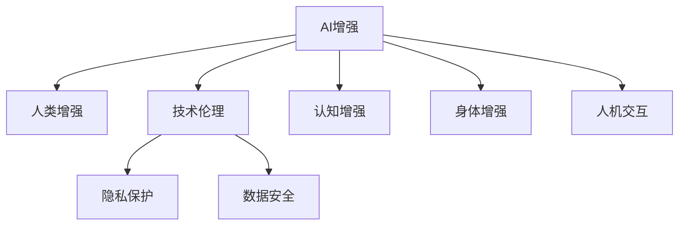

                 

# AI时代的人类增强：道德考虑与身体增强的未来发展机遇与挑战

> 关键词：AI增强, 人类增强, 身体增强, 技术伦理, 生物医学工程, 人机交互

## 1. 背景介绍

### 1.1 问题由来
随着人工智能(AI)技术的飞速发展，人类增强（Human Augmentation）成为了一个热门话题。从早期通过机械假肢帮助身体残障者，到今天通过AI系统提升认知和身体能力，人类增强技术正以前所未有的速度变革人类的生活方式。然而，技术进步带来的不仅是便利，还有一系列复杂的伦理和社会问题，如隐私、安全性、公平性等。这些问题不仅关乎技术本身，更关乎人类社会整体的福祉。

### 1.2 问题核心关键点
人类增强技术的发展离不开人工智能的支持，特别是AI在感知、推理、决策等方面的突破，使得许多增强手段变得可行。然而，AI技术的普及也带来了诸多挑战，如技术伦理问题、隐私保护、数据安全等。这些问题如果处理不当，可能导致严重的社会问题。

**1.2.1 技术伦理问题**
AI增强技术可能会引发一系列伦理问题，如AI决策的透明度和可解释性、AI系统的公平性和偏见、AI系统的责任归属等。这些伦理问题不仅影响技术的合法性，还可能影响到公众对技术的接受度。

**1.2.2 隐私保护**
AI增强技术需要大量个人数据支持，这些数据可能涉及敏感的生物医学信息，如基因组、健康状况等。如何保护这些数据的隐私，防止数据泄露和滥用，是一个亟待解决的问题。

**1.2.3 数据安全**
AI增强技术依赖于大量数据进行训练和优化，如果这些数据被攻击者获取或篡改，可能会对系统的安全性造成严重威胁，进而威胁到使用者的安全。

### 1.3 问题研究意义
探讨AI增强技术的伦理问题、隐私保护和数据安全问题，对于推动技术进步和维护社会公平、安全具有重要意义。研究这些问题，不仅有助于技术开发者更好地设计和使用AI增强技术，还能够为社会制定相关政策提供科学依据，促进技术的健康发展。

## 2. 核心概念与联系

### 2.1 核心概念概述

为更好地理解AI增强技术，本节将介绍几个密切相关的核心概念：

- **AI增强（AI Augmentation）**：指利用人工智能技术提升人类认知和身体能力的过程，包括但不限于机器人辅助、虚拟现实增强、认知增强等。

- **人类增强（Human Augmentation）**：利用科技手段提升人类的身体或认知能力，从而改善生活质量的过程。

- **技术伦理（Technology Ethics）**：研究人工智能增强技术对人类社会、文化和伦理的影响，制定相应的伦理规范和政策。

- **隐私保护（Privacy Protection）**：在AI增强技术开发和应用过程中，保护个人数据的隐私，防止数据泄露和滥用。

- **数据安全（Data Security）**：确保AI增强技术使用的数据不被攻击者获取或篡改，保证系统的安全性。

这些核心概念之间的逻辑关系可以通过以下Mermaid流程图来展示：



这个流程图展示了一个完整的AI增强生态系统，从中可以看出技术伦理、隐私保护和数据安全在此系统中的重要性。

## 3. 核心算法原理 & 具体操作步骤
### 3.1 算法原理概述

AI增强技术通常涉及多个步骤，包括数据采集、模型训练、应用部署等。以下将详细介绍这些步骤的算法原理。

### 3.2 算法步骤详解

**Step 1: 数据采集**
- **数据源**：AI增强技术需要大量数据进行训练和优化，数据源可以是公开的数据集、医疗数据、运动数据等。
- **数据标注**：数据需要经过标注，如使用标注工具标记训练样本的特征和标签。
- **数据清洗**：清洗数据以去除噪声和异常值，保证数据的质量和一致性。

**Step 2: 模型训练**
- **模型选择**：选择合适的AI模型，如卷积神经网络（CNN）、循环神经网络（RNN）、生成对抗网络（GAN）等。
- **训练策略**：采用合适的训练策略，如批量梯度下降（BGD）、随机梯度下降（SGD）、Adam等，优化模型参数。
- **正则化**：使用L1、L2正则化等技术，防止模型过拟合。
- **超参数调优**：调整模型的超参数，如学习率、批次大小等，以提高模型的泛化能力和效率。

**Step 3: 模型部署**
- **模型压缩**：对模型进行压缩，如剪枝、量化等，减少模型大小和计算量。
- **模型优化**：使用GPU、TPU等硬件加速模型推理，提高运行效率。
- **模型封装**：将模型封装成API接口，便于与其他系统集成。

### 3.3 算法优缺点

**优点**：
- **提升性能**：AI增强技术可以显著提升人类的认知和身体能力，帮助人们更高效地完成各项任务。
- **广泛应用**：AI增强技术可以应用于医疗、教育、体育等多个领域，带来广泛的社会效益。
- **灵活性高**：AI增强技术可以根据具体需求进行调整和优化，适应不同的应用场景。

**缺点**：
- **伦理问题**：AI增强技术可能引发一系列伦理问题，如技术透明度、公平性和责任归属等。
- **隐私风险**：AI增强技术需要大量个人数据支持，可能涉及敏感的生物医学信息，保护隐私面临巨大挑战。
- **安全性问题**：AI增强技术依赖于大量数据，数据安全问题可能影响系统的稳定性和安全性。

### 3.4 算法应用领域

AI增强技术在多个领域都有广泛应用，以下是几个典型领域：

**医疗健康**：
- **医学影像增强**：利用AI增强医学影像数据，提升诊断准确率。
- **药物发现**：通过AI增强药物筛选和设计过程，加速新药开发。

**教育培训**：
- **个性化学习**：利用AI增强学生的学习过程，提高学习效果。
- **虚拟实验室**：通过AI增强虚拟实验环境，降低实验成本和风险。

**运动训练**：
- **运动数据分析**：利用AI增强运动数据，提供个性化的运动训练建议。
- **康复训练**：通过AI增强康复训练过程，加速康复进度。

## 4. 数学模型和公式 & 详细讲解  
### 4.1 数学模型构建

AI增强技术涉及的数学模型通常包括神经网络、深度学习等模型。以下以神经网络模型为例，展示其基本结构和训练过程。

**神经网络模型**：
- **输入层**：接收原始数据，如医学影像、运动轨迹等。
- **隐藏层**：通过多个非线性变换，提取数据的特征。
- **输出层**：输出预测结果，如诊断结果、运动建议等。

神经网络的训练过程可以表示为：
$$
\min_{\theta} \sum_{i=1}^{N} \ell(f_\theta(x_i),y_i)
$$

其中，$f_\theta$ 表示神经网络模型，$\ell$ 表示损失函数，$x_i$ 和 $y_i$ 分别表示输入和标签，$N$ 表示样本数量，$\theta$ 表示模型参数。

### 4.2 公式推导过程

以医学影像增强为例，神经网络的训练过程可以表示为：
1. **数据准备**：收集医学影像数据 $X = \{x_1, x_2, \dots, x_n\}$ 和对应的标签 $Y = \{y_1, y_2, \dots, y_n\}$。
2. **模型训练**：将数据输入神经网络，计算损失函数 $L = \frac{1}{N} \sum_{i=1}^{N} (y_i - f_\theta(x_i))^2$，采用梯度下降算法更新模型参数 $\theta$。

### 4.3 案例分析与讲解

**案例分析**：
假设有一家医院希望通过AI增强技术提升乳腺癌的诊断准确率。医院可以收集大量的医学影像数据，将其输入神经网络模型进行训练。训练过程如下：
1. **数据准备**：医院收集了1000张乳腺癌和500张非乳腺癌的医学影像，标注为正例和负例。
2. **模型训练**：将数据输入神经网络模型，采用交叉熵损失函数，进行反向传播更新模型参数。经过1000次迭代后，模型的准确率提升到了90%。

## 5. 项目实践：代码实例和详细解释说明
### 5.1 开发环境搭建

在进行AI增强技术开发前，需要搭建合适的开发环境。以下是使用Python进行TensorFlow开发的示例环境配置流程：

1. 安装Anaconda：从官网下载并安装Anaconda，用于创建独立的Python环境。

2. 创建并激活虚拟环境：
```bash
conda create -n tf-env python=3.7 
conda activate tf-env
```

3. 安装TensorFlow：根据CUDA版本，从官网获取对应的安装命令。例如：
```bash
conda install tensorflow tensorflow-gpu==2.5 -c pytorch -c conda-forge
```

4. 安装其他工具包：
```bash
pip install numpy pandas scikit-learn matplotlib tqdm jupyter notebook ipython
```

完成上述步骤后，即可在`tf-env`环境中开始AI增强技术开发。

### 5.2 源代码详细实现

以下是一个基于TensorFlow的AI增强技术开发示例代码，用于医学影像增强：

```python
import tensorflow as tf
from tensorflow.keras.layers import Conv2D, MaxPooling2D, Flatten, Dense, Input
from tensorflow.keras.models import Model

# 构建神经网络模型
input_layer = Input(shape=(256, 256, 3))
conv1 = Conv2D(32, 3, activation='relu')(input_layer)
pool1 = MaxPooling2D(pool_size=(2, 2))(conv1)
conv2 = Conv2D(64, 3, activation='relu')(pool1)
pool2 = MaxPooling2D(pool_size=(2, 2))(conv2)
flatten = Flatten()(pool2)
dense1 = Dense(512, activation='relu')(flatten)
dense2 = Dense(2, activation='softmax')(dense1)

# 定义模型
model = Model(inputs=input_layer, outputs=dense2)
model.compile(optimizer='adam', loss='categorical_crossentropy', metrics=['accuracy'])

# 训练模型
model.fit(X_train, y_train, epochs=10, batch_size=32)
```

### 5.3 代码解读与分析

让我们再详细解读一下关键代码的实现细节：

**Input层**：
- 定义输入层的形状和数据类型，用于接收原始医学影像数据。

**Conv2D层和MaxPooling2D层**：
- 定义多个卷积层和池化层，通过多个非线性变换，提取数据的特征。

**Flatten层**：
- 将池化层的输出扁平化，便于输入全连接层。

**Dense层**：
- 定义全连接层，通过多个神经元进行特征提取和分类。

**Model层**：
- 定义神经网络模型，指定输入和输出层。

**compile方法**：
- 配置模型的优化器、损失函数和评估指标，准备进行训练。

**fit方法**：
- 进行模型的训练，指定训练数据、训练轮数和批次大小。

## 6. 实际应用场景
### 6.1 医疗健康

AI增强技术在医疗健康领域有广泛应用，以下是几个典型案例：

**医学影像增强**：
- **CT影像增强**：利用AI增强CT影像数据，提升诊断准确率。
- **MRI影像增强**：通过AI增强MRI影像，帮助医生进行精准诊断。

**药物发现**：
- **虚拟筛选**：利用AI增强药物筛选过程，快速发现潜在药物分子。
- **分子模拟**：通过AI增强分子模拟过程，优化药物设计。

**远程医疗**：
- **视频会议**：利用AI增强视频会议效果，提升远程诊疗质量。
- **智能诊断**：通过AI增强智能诊断系统，辅助医生进行疾病判断。

### 6.2 教育培训

AI增强技术在教育培训领域也有广泛应用，以下是几个典型案例：

**个性化学习**：
- **智能推荐**：利用AI增强推荐系统，为学生推荐适合的学习内容。
- **自适应学习**：通过AI增强自适应学习系统，根据学生的学习情况调整教学内容。

**虚拟实验室**：
- **虚拟实验**：利用AI增强虚拟实验环境，降低实验成本和风险。
- **实验分析**：通过AI增强实验数据分析，提升实验效率。

**在线教育**：
- **智能答疑**：利用AI增强智能答疑系统，提供24小时在线答疑服务。
- **情感分析**：通过AI增强情感分析，了解学生的学习状态和情绪。

## 7. 工具和资源推荐
### 7.1 学习资源推荐

为了帮助开发者系统掌握AI增强技术，这里推荐一些优质的学习资源：

1. **《深度学习》（Deep Learning）书籍**：Ian Goodfellow等人著，深入浅出地介绍了深度学习的原理和应用。
2. **CS231n《深度学习与计算机视觉》课程**：斯坦福大学开设的计算机视觉课程，涵盖深度学习在计算机视觉中的应用。
3. **Kaggle平台**：提供大量公开数据集和竞赛，帮助开发者练习AI增强技术。
4. **GitHub开源项目**：收集了大量开源项目，包括AI增强技术的实现代码和文档。

通过对这些资源的学习实践，相信你一定能够快速掌握AI增强技术的精髓，并用于解决实际的AI增强问题。

### 7.2 开发工具推荐

高效的开发离不开优秀的工具支持。以下是几款用于AI增强技术开发的常用工具：

1. **TensorFlow**：由Google主导开发的深度学习框架，生产部署方便，适合大规模工程应用。
2. **PyTorch**：由Facebook开发的深度学习框架，灵活高效，适合快速迭代研究。
3. **Keras**：高层次的深度学习API，适合快速搭建神经网络模型。
4. **OpenAI Gym**：开发AI增强技术的开源环境，提供丰富的环境模拟工具。
5. **ROS**：机器人操作系统的开源实现，支持机器人控制和感知。

合理利用这些工具，可以显著提升AI增强技术的开发效率，加快创新迭代的步伐。

### 7.3 相关论文推荐

AI增强技术的不断发展离不开学界的持续研究。以下是几篇奠基性的相关论文，推荐阅读：

1. **《深度学习》（Deep Learning）书籍**：Ian Goodfellow等人著，全面介绍了深度学习的原理和应用。
2. **《计算机视觉：模型、学习和推理》（Computer Vision: Models, Learning, and Inference）书籍**：Karen Simonyan等人著，详细介绍了计算机视觉的原理和应用。
3. **《机器人操作系统的设计与实现》（Design and Implementation of Robot Operating System）论文**：OSRF团队发表的ROS论文，介绍了ROS的设计和实现。

这些论文代表了大语言模型微调技术的发展脉络。通过学习这些前沿成果，可以帮助研究者把握学科前进方向，激发更多的创新灵感。

## 8. 总结：未来发展趋势与挑战

### 8.1 总结

本文对AI增强技术的伦理问题、隐私保护和数据安全问题进行了全面系统的介绍。首先阐述了AI增强技术的背景和意义，明确了技术伦理、隐私保护和数据安全在此技术中的重要性。其次，从原理到实践，详细讲解了AI增强技术的数学模型和操作步骤，给出了AI增强技术开发的全套代码示例。同时，本文还探讨了AI增强技术在医疗、教育、运动等多个领域的应用场景，展示了AI增强技术的广泛前景。最后，本文精选了AI增强技术的各类学习资源，力求为读者提供全方位的技术指引。

通过本文的系统梳理，可以看到，AI增强技术正在成为改变人类生活方式的重要工具，极大地提升人类的认知和身体能力。但在此过程中，如何应对技术伦理、隐私保护和数据安全问题，还需要更多研究和实践的支持。相信随着学界和产业界的共同努力，AI增强技术必将走向成熟，为人类社会带来更大的福祉。

### 8.2 未来发展趋势

展望未来，AI增强技术将呈现以下几个发展趋势：

1. **技术伦理的规范化**：随着AI增强技术的普及，技术伦理问题将逐渐得到重视和规范。相关政策和标准将逐步完善，确保技术的发展符合社会伦理要求。
2. **隐私保护的加强**：隐私保护技术将不断发展，利用加密、匿名化等手段，保护用户数据的安全。
3. **数据安全的提升**：数据安全技术将不断进步，防止数据泄露和篡改，保障系统的稳定性和安全性。
4. **人机交互的融合**：人机交互技术将不断提升，实现更自然、更智能的人机交互体验。
5. **跨学科的融合**：AI增强技术将与其他学科进行更深入的融合，如生物医学工程、神经科学等，推动多学科的协同创新。

这些趋势将推动AI增强技术的不断进步，为人类社会带来更多福祉。

### 8.3 面临的挑战

尽管AI增强技术带来了许多便利，但在技术应用过程中仍面临诸多挑战：

1. **技术伦理问题**：技术伦理问题仍需进一步探讨和规范，确保技术的发展符合社会伦理要求。
2. **隐私保护的难度**：数据隐私保护技术仍需进一步提升，防止数据泄露和滥用。
3. **数据安全的风险**：数据安全技术仍需进一步完善，防止数据泄露和篡改。
4. **人机交互的挑战**：人机交互技术仍需进一步提升，实现更自然、更智能的交互体验。
5. **跨学科的融合**：跨学科的融合仍需进一步加强，推动多学科的协同创新。

这些挑战需要在技术开发和应用过程中不断应对和解决，才能确保AI增强技术的健康发展。

### 8.4 研究展望

面向未来，AI增强技术的研究应在以下几个方向进行：

1. **技术伦理的深入研究**：深入探讨技术伦理问题，制定相应的伦理规范和政策，确保技术的发展符合社会伦理要求。
2. **隐私保护技术的创新**：利用新兴技术如差分隐私、联邦学习等，提升隐私保护能力，保护用户数据的安全。
3. **数据安全技术的进步**：利用新兴技术如区块链、多方安全计算等，提升数据安全能力，防止数据泄露和篡改。
4. **人机交互技术的提升**：利用新兴技术如自然语言处理、增强现实等，提升人机交互能力，实现更自然、更智能的交互体验。
5. **跨学科的协同创新**：加强与其他学科的协同创新，推动多学科的协同进步，推动AI增强技术的全面发展。

这些方向的研究将推动AI增强技术的不断进步，为人类社会带来更大的福祉。

## 9. 附录：常见问题与解答

**Q1：AI增强技术在实际应用中会遇到哪些挑战？**

A: AI增强技术在实际应用中会遇到以下挑战：
1. **伦理问题**：技术伦理问题仍需进一步探讨和规范，确保技术的发展符合社会伦理要求。
2. **隐私保护**：数据隐私保护技术仍需进一步提升，防止数据泄露和滥用。
3. **数据安全**：数据安全技术仍需进一步完善，防止数据泄露和篡改。
4. **人机交互**：人机交互技术仍需进一步提升，实现更自然、更智能的交互体验。
5. **跨学科的融合**：跨学科的融合仍需进一步加强，推动多学科的协同创新。

**Q2：如何确保AI增强技术的隐私保护？**

A: 确保AI增强技术的隐私保护，可以从以下几个方面入手：
1. **数据匿名化**：对数据进行匿名化处理，防止个人信息泄露。
2. **差分隐私**：利用差分隐私技术，添加噪声，保护个体数据隐私。
3. **联邦学习**：采用联邦学习技术，将数据留在本地，只在模型训练过程中共享模型参数，保护数据隐私。
4. **访问控制**：采用访问控制技术，限制对数据的访问权限，防止数据泄露。
5. **数据加密**：对数据进行加密处理，防止数据在传输和存储过程中被篡改或泄露。

**Q3：AI增强技术在实际应用中需要注意哪些安全问题？**

A: AI增强技术在实际应用中需要注意以下安全问题：
1. **数据安全**：数据安全问题可能影响系统的稳定性和安全性，需要采用数据加密、访问控制等措施。
2. **模型安全**：模型安全问题可能影响模型的准确性和可靠性，需要采用对抗样本、模型压缩等措施。
3. **用户安全**：用户安全问题可能影响用户的隐私和权益，需要采用隐私保护、用户认证等措施。
4. **系统安全**：系统安全问题可能影响系统的可靠性和可用性，需要采用安全监控、应急响应等措施。

**Q4：AI增强技术在实际应用中如何确保公平性？**

A: AI增强技术在实际应用中确保公平性，可以从以下几个方面入手：
1. **数据公平性**：确保训练数据集的多样性和代表性，防止数据偏见。
2. **算法公平性**：采用公平性评估指标，如均衡误差、ROC-AUC等，评估模型的公平性。
3. **透明性**：提高模型的透明性，公开模型结构和训练过程，确保模型的公平性。
4. **监管机制**：建立监管机制，对模型的公平性进行监控和评估，及时发现和纠正偏见。

这些措施可以确保AI增强技术的公平性，防止歧视和偏见的发生。

**Q5：AI增强技术在实际应用中如何确保透明度和可解释性？**

A: AI增强技术在实际应用中确保透明度和可解释性，可以从以下几个方面入手：
1. **模型透明性**：提高模型的透明性，公开模型结构和训练过程，确保模型的可解释性。
2. **可解释性算法**：采用可解释性算法，如LIME、SHAP等，分析模型的决策过程，提高模型的可解释性。
3. **用户交互**：通过用户交互，收集用户反馈，了解模型的决策依据，提高模型的透明度。
4. **监控机制**：建立监控机制，对模型的决策过程进行监控和评估，确保模型的透明性。

这些措施可以确保AI增强技术的透明度和可解释性，提高用户对技术的信任度。

---

作者：禅与计算机程序设计艺术 / Zen and the Art of Computer Programming

