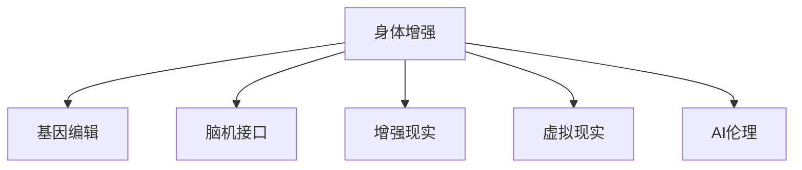

                 

# AI时代的人类增强：道德考虑与身体增强的未来发展机遇分析机遇挑战机遇预测

## 1. 背景介绍

### 1.1 问题由来

随着人工智能（AI）技术的迅猛发展，人类社会正步入一个全新的时代——AI时代。在这一时代，AI技术正在深刻改变人类的生产方式、生活方式甚至思考方式。其中，身体增强（Body Enhancement）作为AI时代的一个重要方向，正引起越来越多人的关注。身体增强不仅仅是指通过技术手段提升人类身体的各项功能，更涵盖了个体能力的全面提升，如智力、感知能力、认知能力等。

### 1.2 问题核心关键点

身体增强技术的崛起，带来了巨大的发展机遇，但也伴随着诸多道德、法律和安全问题。如何在确保技术安全、伦理合法的前提下，最大化地发挥身体增强技术的潜力，成为当前社会亟需解决的问题。本文将从道德、法律和技术三个维度，全面探讨身体增强技术的未来发展机遇与挑战，并尝试预测其发展趋势。

## 2. 核心概念与联系

### 2.1 核心概念概述

为更好地理解身体增强技术的未来发展机遇，本文将介绍几个核心概念：

- **身体增强（Body Enhancement）**：利用AI技术和其他相关技术，增强或改善人体某些功能或属性的过程。包括但不限于基因编辑、脑机接口、增强现实（AR）、虚拟现实（VR）等技术。

- **基因编辑（Gene Editing）**：通过CRISPR-Cas9等技术，对人类基因进行精确修改，以治疗疾病或提升身体能力。

- **脑机接口（Brain-Computer Interface, BCI）**：通过传感器采集大脑信号，将其转换为机器可读的信号，实现人机交互。

- **增强现实（AR）和虚拟现实（VR）**：利用AR和VR技术，为个体提供沉浸式交互体验，增强感知和认知能力。

- **AI伦理（AI Ethics）**：在AI技术开发和应用过程中，遵循道德规范，保护用户隐私和权益，防止技术滥用。

这些核心概念之间的逻辑关系可以通过以下Mermaid流程图来展示：



这个流程图展示了一个从身体增强技术出发的，与多个技术领域和伦理概念的联系：

1. 身体增强可以基于基因编辑技术，精确修改人体基因。
2. 通过脑机接口技术，身体增强可以扩展个体的感知和认知能力。
3. 利用增强现实和虚拟现实技术，身体增强可以提供沉浸式交互体验。
4. 在技术应用中，身体增强需要遵循AI伦理，确保用户隐私和权益不受侵害。

## 3. 核心算法原理 & 具体操作步骤

### 3.1 算法原理概述

身体增强技术涉及多个交叉学科，包括医学、神经科学、人工智能等。其核心算法原理可以大致分为以下几步：

1. **数据采集与处理**：通过传感器、影像设备等手段，收集个体的生理数据、行为数据等，并进行预处理。

2. **模型训练**：利用AI技术，如深度学习、机器学习等，对采集到的数据进行建模分析，优化模型参数，提升预测准确性。

3. **增强实现**：根据模型训练结果，通过基因编辑、脑机接口等技术，实现身体增强。

4. **效果评估与反馈**：通过评估技术效果，收集用户反馈，进一步优化算法模型和增强技术。

### 3.2 算法步骤详解

以基因编辑技术为例，其核心算法步骤包括：

1. **基因选择**：选择目标基因，确定增强目标。

2. **基因切割**：使用CRISPR-Cas9等工具，切割目标基因。

3. **基因修复**：引入新的基因序列，修复或增强目标基因功能。

4. **效果验证**：通过实验验证增强效果，并优化基因修复过程。

### 3.3 算法优缺点

#### 优点

- **精确性高**：基因编辑技术可以实现对基因的精确修改，提高增强效果。

- **适用范围广**：基因编辑技术可以应用于多种疾病治疗和功能增强。

- **潜在收益大**：身体增强技术的应用潜力巨大，可以提升个体的生活质量和健康水平。

#### 缺点

- **安全性问题**：基因编辑技术可能引发基因突变、基因表达失调等问题，存在安全隐患。

- **伦理争议**：基因编辑技术涉及伦理问题，如基因歧视、基因专利等，引发广泛讨论。

- **成本高昂**：基因编辑技术成本较高，可能难以普及。

### 3.4 算法应用领域

身体增强技术的应用领域广泛，涵盖医学、体育、娱乐等多个方面：

- **医学**：通过基因编辑技术，治疗遗传性疾病，提升免疫系统功能。

- **体育**：利用脑机接口技术，增强运动员的感知和反应能力。

- **娱乐**：通过增强现实和虚拟现实技术，提供沉浸式游戏体验，增强用户体验。

## 4. 数学模型和公式 & 详细讲解 & 举例说明

### 4.1 数学模型构建

以基因编辑为例，我们可以建立一个简单的数学模型来描述其效果：

设 $G$ 为目标基因，$T$ 为靶点（target site），$E$ 为增强效果。则基因编辑的效果可以表示为：

$$
E = f(G, T, P)
$$

其中 $f$ 为基因编辑模型，$P$ 为编辑参数，包括切割工具、修复序列等。

### 4.2 公式推导过程

对于基因编辑模型 $f$，假设其为线性模型，则有：

$$
E = w_1G + w_2T + \epsilon
$$

其中 $w_1, w_2$ 为模型系数，$\epsilon$ 为随机误差。

根据最小二乘法，求解 $w_1, w_2$：

$$
w_1 = \frac{\sum_{i=1}^n (G_i - \bar{G})(E_i - \bar{E})}{\sum_{i=1}^n (G_i - \bar{G})^2}
$$

$$
w_2 = \frac{\sum_{i=1}^n (T_i - \bar{T})(E_i - \bar{E})}{\sum_{i=1}^n (T_i - \bar{T})^2}
$$

### 4.3 案例分析与讲解

以CRISPR-Cas9为例，基因编辑过程包括靶点识别、切割工具选择和修复序列设计等步骤。假设 $G = [G_1, G_2, ..., G_n]$ 为目标基因序列，$T = [T_1, T_2, ..., T_n]$ 为靶点序列。则切割工具和修复序列可以表示为：

$$
C = \{C_1, C_2, ..., C_n\}
$$

$$
R = \{R_1, R_2, ..., R_n\}
$$

其中 $C$ 为切割工具序列，$R$ 为修复序列序列。根据基因编辑模型 $f$，计算增强效果 $E$：

$$
E = \sum_{i=1}^n w_1G_i + \sum_{i=1}^n w_2T_i + \sum_{i=1}^n \epsilon_i
$$

其中 $w_1, w_2$ 通过基因编辑模型训练得到，$\epsilon_i$ 为随机误差。

## 5. 项目实践：代码实例和详细解释说明

### 5.1 开发环境搭建

要进行基因编辑等身体增强技术的实践，需要搭建相应的开发环境：

1. **安装Python**：确保Python版本为3.7或以上，并安装必要的科学计算库。

2. **安装CRISPR工具包**：如Cas9、Cas12等。

3. **安装基因编辑平台**：如BioPython、Bioinformatics等。

4. **安装数据处理工具**：如pandas、numpy等。

### 5.2 源代码详细实现

以下是一个简化的基因编辑模拟代码示例：

```python
from Bio import SeqIO
from Bio.Seq import Seq
from Bio.SeqFeature import SeqFeature, FeatureLocation

# 定义目标基因序列
target_genome = Seq('ATCGATCGATCGATCGATCGATCGATCGATCGATCGATCGATCGATCGATCGATCGATCGATCGATCGATCGATCGATCGATCGATCGATCGATCGATCGATCGATCGATCGATCGATCGATCGATCGATCGATCGATCGATCGATCGATCGATCGATCGATCGATCGATCGATCGATCGATCGATCGATCGATCGATCGATCGATCGATCGATCGATCGATCGATCGATCGATCGATCGATCGATCGATCGATCGATCGATCGATCGATCGATCGATCGATCGATCGATCGATCGATCGATCGATCGATCGATCGATCGATCGATCGATCGATCGATCGATCGATCGATCGATCGATCGATCGATCGATCGATCGATCGATCGATCGATCGATCGATCGATCGATCGATCGATCGATCGATCGATCGATCGATCGATCGATCGATCGATCGATCGATCGATCGATCGATCGATCGATCGATCGATCGATCGATCGATCGATCGATCGATCGATCGATCGATCGATCGATCGATCGATCGATCGATCGATCGATCGATCGATCGATCGATCGATCGATCGATCGATCGATCGATCGATCGATCGATCGATCGATCGATCGATCGATCGATCGATCGATCGATCGATCGATCGATCGATCGATCGATCGATCGATCGATCGATCGATCGATCGATCGATCGATCGATCGATCGATCGATCGATCGATCGATCGATCGATCGATCGATCGATCGATCGATCGATCGATCGATCGATCGATCGATCGATCGATCGATCGATCGATCGATCGATCGATCGATCGATCGATCGATCGATCGATCGATCGATCGATCGATCGATCGATCGATCGATCGATCGATCGATCGATCGATCGATCGATCGATCGATCGATCGATCGATCGATCGATCGATCGATCGATCGATCGATCGATCGATCGATCGATCGATCGATCGATCGATCGATCGATCGATCGATCGATCGATCGATCGATCGATCGATCGATCGATCGATCGATCGATCGATCGATCGATCGATCGATCGATCGATCGATCGATCGATCGATCGATCGATCGATCGATCGATCGATCGATCGATCGATCGATCGATCGATCGATCGATCGATCGATCGATCGATCGATCGATCGATCGATCGATCGATCGATCGATCGATCGATCGATCGATCGATCGATCGATCGATCGATCGATCGATCGATCGATCGATCGATCGATCGATCGATCGATCGATCGATCGATCGATCGATCGATCGATCGATCGATCGATCGATCGATCGATCGATCGATCGATCGATCGATCGATCGATCGATCGATCGATCGATCGATCGATCGATCGATCGATCGATCGATCGATCGATCGATCGATCGATCGATCGATCGATCGATCGATCGATCGATCGATCGATCGATCGATCGATCGATCGATCGATCGATCGATCGATCGATCGATCGATCGATCGATCGATCGATCGATCGATCGATCGATCGATCGATCGATCGATCGATCGATCGATCGATCGATCGATCGATCGATCGATCGATCGATCGATCGATCGATCGATCGATCGATCGATCGATCGATCGATCGATCGATCGATCGATCGATCGATCGATCGATCGATCGATCGATCGATCGATCGATCGATCGATCGATCGATCGATCGATCGATCGATCGATCGATCGATCGATCGATCGATCGATCGATCGATCGATCGATCGATCGATCGATCGATCGATCGATCGATCGATCGATCGATCGATCGATCGATCGATCGATCGATCGATCGATCGATCGATCGATCGATCGATCGATCGATCGATCGATCGATCGATCGATCGATCGATCGATCGATCGATCGATCGATCGATCGATCGATCGATCGATCGATCGATCGATCGATCGATCGATCGATCGATCGATCGATCGATCGATCGATCGATCGATCGATCGATCGATCGATCGATCGATCGATCGATCGATCGATCGATCGATCGATCGATCGATCGATCGATCGATCGATCGATCGATCGATCGATCGATCGATCGATCGATCGATCGATCGATCGATCGATCGATCGATCGATCGATCGATCGATCGATCGATCGATCGATCGATCGATCGATCGATCGATCGATCGATCGATCGATCGATCGATCGATCGATCGATCGATCGATCGATCGATCGATCGATCGATCGATCGATCGATCGATCGATCGATCGATCGATCGATCGATCGATCGATCGATCGATCGATCGATCGATCGATCGATCGATCGATCGATCGATCGATCGATCGATCGATCGATCGATCGATCGATCGATCGATCGATCGATCGATCGATCGATCGATCGATCGATCGATCGATCGATCGATCGATCGATCGATCGATCGATCGATCGATCGATCGATCGATCGATCGATCGATCGATCGATCGATCGATCGATCGATCGATCGATCGATCGATCGATCGATCGATCGATCGATCGATCGATCGATCGATCGATCGATCGATCGATCGATCGATCGATCGATCGATCGATCGATCGATCGATCGATCGATCGATCGATCGATCGATCGATCGATCGATCGATCGATCGATCGATCGATCGATCGATCGATCGATCGATCGATCGATCGATCGATCGATCGATCGATCGATCGATCGATCGATCGATCGATCGATCGATCGATCGATCGATCGATCGATCGATCGATCGATCGATCGATCGATCGATCGATCGATCGATCGATCGATCGATCGATCGATCGATCGATCGATCGATCGATCGATCGATCGATCGATCGATCGATCGATCGATCGATCGATCGATCGATCGATCGATCGATCGATCGATCGATCGATCGATCGATCGATCGATCGATCGATCGATCGATCGATCGATCGATCGATCGATCGATCGATCGATCGATCGATCGATCGATCGATCGATCGATCGATCGATCGATCGATCGATCGATCGATCGATCGATCGATCGATCGATCGATCGATCGATCGATCGATCGATCGATCGATCGATCGATCGATCGATCGATCGATCGATCGATCGATCGATCGATCGATCGATCGATCGATCGATCGATCGATCGATCGATCGATCGATCGATCGATCGATCGATCGATCGATCGATCGATCGATCGATCGATCGATCGATCGATCGATCGATCGATCGATCGATCGATCGATCGATCGATCGATCGATCGATCGATCGATCGATCGATCGATCGATCGATCGATCGATCGATCGATCGATCGATCGATCGATCGATCGATCGATCGATCGATCGATCGATCGATCGATCGATCGATCGATCGATCGATCGATCGATCGATCGATCGATCGATCGATCGATCGATCGATCGATCGATCGATCGATCGATCGATCGATCGATCGATCGATCGATCGATCGATCGATCGATCGATCGATCGATCGATCGATCGATCGATCGATCGATCGATCGATCGATCGATCGATCGATCGATCGATCGATCGATCGATCGATCGATCGATCGATCGATCGATCGATCGATCGATCGATCGATCGATCGATCGATCGATCGATCGATCGATCGATCGATCGATCGATCGATCGATCGATCGATCGATCGATCGATCGATCGATCGATCGATCGATCGATCGATCGATCGATCGATCGATCGATCGATCGATCGATCGATCGATCGATCGATCGATCGATCGATCGATCGATCGATCGATCGATCGATCGATCGATCGATCGATCGATCGATCGATCGATCGATCGATCGATCGATCGATCGATCGATCGATCGATCGATCGATCGATCGATCGATCGATCGATCGATCGATCGATCGATCGATCGATCGATCGATCGATCGATCGATCGATCGATCGATCGATCGATCGATCGATCGATCGATCGATCGATCGATCGATCGATCGATCGATCGATCGATCGATCGATCGATCGATCGATCGATCGATCGATCGATCGATCGATCGATCGATCGATCGATCGATCGATCGATCGATCGATCGATCGATCGATCGATCGATCGATCGATCGATCGATCGATCGATCGATCGATCGATCGATCGATCGATCGATCGATCGATCGATCGATCGATCGATCGATCGATCGATCGATCGATCGATCGATCGATCGATCGATCGATCGATCGATCGATCGATCGATCGATCGATCGATCGATCGATCGATCGATCGATCGATCGATCGATCGATCGATCGATCGATCGATCGATCGATCGATCGATCGATCGATCGATCGATCGATCGATCGATCGATCGATCGATCGATCGATCGATCGATCGATCGATCGATCGATCGATCGATCGATCGATCGATCGATCGATCGATCGATCGATCGATCGATCGATCGATCGATCGATCGATCGATCGATCGATCGATCGATCGATCGATCGATCGATCGATCGATCGATCGATCGATCGATCGATCGATCGATCGATCGATCGATCGATCGATCGATCGATCGATCGATCGATCGATCGATCGATCGATCGATCGATCGATCGATCGATCGATCGATCGATCGATCGATCGATCGATCGATCGATCGATCGATCGATCGATCGATCGATCGATCGATCGATCGATCGATCGATCGATCGATCGATCGATCGATCGATCGATCGATCGATCGATCGATCGATCGATCGATCGATCGATCGATCGATCGATCGATCGATCGATCGATCGATCGATCGATCGATCGATCGATCGATCGATCGATCGATCGATCGATCGATCGATCGATCGATCGATCGATCGATCGATCGATCGATCGATCGATCGATCGATCGATCGATCGATCGATCGATCGATCGATCGATCGATCGATCGATCGATCGATCGATCGATCGATCGATCGATCGATCGATCGATCGATCGATCGATCGATCGATCGATCGATCGATCGATCGATCGATCGATCGATCGATCGATCGATCGATCGATCGATCGATCGATCGATCGATCGATCGATCGATCGATCGATCGATCGATCGATCGATCGATCGATCGATCGATCGATCGATCGATCGATCGATCGATCGATCGATCGATCGATCGATCGATCGATCGATCGATCGATCGATCGATCGATCGATCGATCGATCGATCGATCGATCGATCGATCGATCGATCGATCGATCGATCGATCGATCGATCGATCGATCGATCGATCGATCGATCGATCGATCGATCGATCGATCGATCGATCGATCGATCGATCGATCGATCGATCGATCGATCGATCGATCGATCGATCGATCGATCGATCGATCGATCGATCGATCGATCGATCGATCGATCGATCGATCGATCGATCGATCGATCGATCGATCGATCGATCGATCGATCGATCGATCGATCGATCGATCGATCGATCGATCGATCGATCGATCGATCGATCGATCGATCGATCGATCGATCGATCGATCGATCGATCGATCGATCGATCGATCGATCGATCGATCGATCGATCGATCGATCGATCGATCGATCGATCGATCGATCGATCGATCGATCGATCGATCGATCGATCGATCGATCGATCGATCGATCGATCGATCGATCGATCGATCGATCGATCGATCGATCGATCGATCGATCGATCGATCGATCGATCGATCGATCGATCGATCGATCGATCGATCGATCGATCGATCGATCGATCGATCGATCGATCGATCGATCGATCGATCGATCGATCGATCGATCGATCGATCGATCGATCGATCGATCGATCGATCGATCGATCGATCGATCGATCGATCGATCGATCGATCGATCGATCGATCGATCGATCGATCGATCGATCGATCGATCGATCGATCGATCGATCGATCGATCGATCGATCGATCGATCGATCGATCGATCGATCGATCGATCGATCGATCGATCGATCGATCGATCGATCGATCGATCGATCGATCGATCGATCGATCGATCGATCGATCGATCGATCGATCGATCGATCGATCGATCGATCGATCGATCGATCGATCGATCGATCGATCGATCGATCGATCGATCGATCGATCGATCGATCGATCGATCGATCGATCGATCGATCGATCGATCGATCGATCGATCGATCGATCGATCGATCGATCGATCGATCGATCGATCGATCGATCGATCGATCGATCGATCGATCGATCGATCGATCGATCGATCGATCGATCGATCGATCGATCGATCGATCGATCGATCGATCGATCGATCGATCGATCGATCGATCGATCGATCGATCGATCGATCGATCGATCGATCGATCGATCGATCGATCGATCGATCGATCGATCGATCGATCGATCGATCGATCGATCGATCGATCGATCGATCGATCGATCGATCGATCGATCGATCGATCGATCGATCGATCGATCGATCGATCGATCGATCGATCGATCGATCGATCGATCGATCGATCGATCGATCGATCGATCGATCGATCGATCGATCGATCGATCGATCGATCGATCGATCGATCGATCGATCGATCGATCGATCGATCGATCGATCGATCGATCGATCGATCGATCGATCGATCGATCGATCGATCGATCGATCGATCGATCGATCGATCGATCGATCGATCGATCGATCGATCGATCGATCGATCGATCGATCGATCGATCGATCGATCGATCGATCGATCGATCGATCGATCGATCGATCGATCGATCGATCGATCGATCGATCGATCGATCGATCGATCGATCGATCGATCGATCGATCGATCGATCGATCGATCGATCGATCGATCGATCGATCGATCGATCGATCGATCGATCGATCGATCGATCGATCGATCGATCGATCGATCGATCGATCGATCGATCGATCGATCGATCGATCGATCGATCGATCGATCGATCGATCGATCGATCGATCGATCGATCGATCGATCGATCGATCGATCGATCGATCGATCGATCGATCGATCGATCGATCGATCGATCGATCGATCGATCGATCGATCGATCGATCGATCGATCGATCGATCGATCGATCGATCGATCGATCGATCGATCGATCGATCGATCGATCGATCGATCGATCGATCGATCGATCGATCGATCGATCGATCGATCGATCGATCGATCGATCGATCGATCGATCGATCGATCGATCGATCGATCGATCGATCGATCGATCGATCGATCGATCGATCGATCGATCGATCGATCGATCGATCGATCGATCGATCGATCGATCGATCGATCGATCGATCGATCGATCGATCGATCGATCGATCGATCGATCGATCGATCGATCGATCGATCGATCGATCGATCGATCGATCGATCGATCGATCGATCGATCGATCGATCGATCGATCGATCGATCGATCGATCGATCGATCGATCGATCGATCGATCGATCGATCGATCGATCGATCGATCGATCGATCGATCGATCGATCGATCGATCGATCGATCGATCGATCGATCGATCGATCGATCGATCGATCGATCGATCGATCGATCGATCGATCGATCGATCGATCGATCGATCGATCGATCGATCGATCGATCGATCGATCGATCGATCGATCGATCGATCGATCGATCGATCGATCGATCGATCGATCGATCGATCGATCGATCGATCGATCGATCGATCGATCGATCGATCGATCGATCGATCGATCGATCGATCGATCGATCGATCGATCGATCGATCGATCGATCGATCGATCGATCGATCGATCGATCGATCGATCGATCGATCGATCGATCGATCGATCGATCGATCGATCGATCGATCGATCGATCGATCGATCGATCGATCGATCGATCGATCGATCGATCGATCGATCGATCGATCGATCGATCGATCGATCGATCGATCGATCGATCGATCGATCGATCGATCGATCGATCGATCGATCGATCGATCGATCGATCGATCGATCGATCGATCGATCGATCGATCGATCGATCGATCGATCGATCGATCGATCGATCGATCGATCGATCGATCGATCGATCGATCGATCGATCGATCGATCGATCGATCGATCGATCGATCGATCGATCGATCGATCGATCGATCGATCGATCGATCGATCGATCGATCGATCGATCGATCGATCGATCGATCGATCGATCGATCGATCGATCGATCGATCGATCGATCGATCGATCGATCGATCGATCGATCGATCGATCGATCGATCGATCGATCGATCGATCGATCGATCGATCGATCGATCGATCGATCGATCGATCGATCGATCGATCGATCGATCGATCGATCGATCGATCGATCGATCGATCGATCGATCGATCGATCGATCGATCGATCGATCGATCGATCGATCGATCGATCGATCGATCGATCGATCGATCGATCGATCGATCGATCGATCGATCGATCGATCGATCGATCGATCGATCGATCGATCGATCGATCGATCGATCGATCGATCGATCGATCGATCGATCGATCGATCGATCGATCGATCGATCGATCGATCGATCGATCGATCGATCGATCGATCGATCGATCGATCGATCGATCGATCGATCGATCGATCGATCGATCGATCGATCGATCGATCGATCGATCGATCGATCGATCGATCGATCGATCGATCGATCGATCGATCGATCGATCGATCGATCGATCGATCGATCGATCGATCGATCGATCGATCGATCGATCGATCGATCGATCGATCGATCGATCGATCGATCGATCGATCGATCGATCGATCGATCGATCGATCGATCGATCGATCGATCGATCGATCGATCGATCGATCGATCGATCGATCGATCGATCGATCGATCGATCGATCGATCGATCGATCGATCGATCGATCGATCGATCGATCGATCGATCGATCGATCGATCGATCGATCGATCGATCGATCGATCGATCGATCGATCGATCGATCGATCGATCGATCGATCGATCGATCGATCGATCGATCGATCGATCGATCGATCGATCGATCGATCGATCGATCGATCGATCGATCGATCGATCGATCGATCGATCGATCGATCGATCGATCGATCGATCGATCGATCGATCGATCGATCGATCGATCGATCGATCGATCGATCGATCGATCGATCGATCGATCGATCGATCGATCGATCGATCGATCGATCGATCGATCGATCGATCGATCGATCGATCGATCGATCGATCGATCGATCGATCGATCGATCGATCGATCGATCGATCGATCGATCGATCGATCGATCGATCGATCGATCGATCGATCGATCGATCGATCGATCGATCGATCGATCGATCGATCGATCGATCGATCGATCGATCGATCGATCGATCGATCGATCGATCGATCGATCGATCGATCGATCGATCGATCGATCGATCGATCGATCGATCGATCGATCGATCGATCGATCGATCGATCGATCGATCGATCGATCGATCGATCGATCGATCGATCGATCGATCGATCGATCGATCGATCGATCGATCGATCGATCGATCGATCGATCGATCGATCGATCGATCGATCGATCGATCGATCGATCGATCGATCGATCGATCGATCGATCGATCGATCGATCGATCGATCGATCGATCGATCGATCGATCGATCGATCGATCGATCGATCGATCGATCGATCGATCGATCGATCGATCGATCGATCGATCGATCGATCGATCGATCGATCGATCGATCGATCGATCGATCGATCGATCGATCGATCGATCGATCGATCGATCGATCGATCGATCGATCGATCGATCGATCGATCGATCGATCGATCGATCGATCGATCGATCGATCGATCGATCGATCGATCGATCGATCGATCGATCGATCGATCGATCGATCGATCGATCGATCGATCGATCGATCGATCGATCGATCGATCGATCGATCGATCGATCGATCGATCGATCGATCGATCGATCGATCGATCGATCGATCGATCGATCGATCGATCGATCGATCGATCGATCGATCGATCGATCGATCGATCGATCGATCGATCGATCGATCGATCGATCGATCGATCGATCGATCGATCGATCGATCGATCGATCGATCGATCGATCGATCGATCGATCGATCGATCGATCGATCGATCGATCGATCGATCGATCGATCGATCGATCGATCGATCGATCGATCGATCGATCGATCGATCGATCGATCGATCGATCGATCGATCGATCGATCGATCGATCGATCGATCGATCGATCGATCGATCGATCGATCGATCGATCGATCGATCGATCGATCGATCGATCGATCGATCGATCGATCGATCGATCGATCGATCGATCGATCGATCGATCGATCGATCGATCGATCGATCGATCGATCGATCGATCGATCGATCGATCGATCGATCGATCGATCGATCGATCGATCGATCGATCGATCGATCGATCGATCGATCGATCGATCGATCGATCGATCGATCGATCGATCGATCGATCGATCGATCGATCGATCGATCGATCGATCGATCGATCGATCGATCGATCGATCGATCGATCGATCGATCGATCGATCGATCGATCGATCGATCGATCGATCGATCGATCGATCGATCGATCGATCGATCGATCGATCGATCGATCGATCGATCGATCGATCGATCGATCGATCGATCGATCGATCGATCGATCGATCGATCGATCGATCGATCGATCGATCGATCGATCGATCGATCGATCGATCGATCGATCGATCGATCGATCGATCGATCGATCGATCGATCGATCGATCGATCGATCGATCGATCGATCGATCGATCGATCGATCGATCGATCGATCGATCGATCGATCGATCGATCGATCGATCGATCGATCGATCGATCGATCGATCGATCGATCGATCGATCGATCGATCGATCGATCGATCGATCGATCGATCGATCGATCGATCGATCGATCGATCGATCGATCGATCGATCGATCGATCGATCGATCGATCGATCGATCGATCGATCGATCGATCGATCGATCGATCGATCGATCGATCGATCGATCGATCGATCGATCGATCGATCGATCGATCGATCGATCGATCGATCGATCGATCGATCGATCGATCGATCGATCGATCGATCGATCGATCGATCGATCGATCGATCGATCGATCGATCGATCGATCGATCGATCGATCGATCGATCGATCGATCGATCGATCGATCGATCGATCGATCGATCGATCGATCGATCGATCGATCGATCGATCGATCGATCGATCGATCGATCGATCGATCGATCGATCGATCGATCGATCGATCGATCGATCGATCGATCGATCGATCGATCGATCGATCGATCGATCGATCGATCGATCGATCGATCGATCGATCGATCGATCGATCGATCGATCGATCGATCGATCGATCGATCGATCGATCGATCGATCGATCGATCGATCGATCGATCGATCGATCGATCGATCGATCGATCGATCGATCGATCGATCGATCGATCGATCGATCGATCGATCGATCGATCGATCGATCGATCGATCGATCGATCGATCGATCGATCGATCGATCGATCGATCGATCGATCGATCGATCGATCGATCGATCGATCGATCGATCGATCGATCGATCGATCGATCGATCGATCGATCGATCGATCGATCGATCGATCGATCGATCGATCGATCGATCGATCGATCGATCGATCGATCGATCGATCGATCGATCGATCGATCGATCGATCGATCGATCGATCGATCGATCGATCGATCGATCGATCGATCGATCGATCGATCGATCGATCGATCGATCGATCGATCGATCGATCGATCGATCGATCGATCGATCGATCGATCGATCGATCGATCGATCGATCGATCGATCGATCGATCGATCGATCGATCGATCGATCGATCGATCGATCGATCGATCGATCGATCGATCGATCGATCGATCGATCGATCGATCGATCGATCGATCGATCGATCGATCGATCGATCGATCGATCGATCGATCGATCGATCGATCGATCGATCGATCGATCGATCGATCGATCGATCGATCGATCGATCGATCGATCGATCGATCGATCGATCGATCGATCGATCGATCGATCGATCGATCGATCGATCGATCGATCGATCGATCGATCGATCGATCGATCGATCGATCGATCGATCGATCGATCGATCGATCGATCGATCGATCGATCGATCGATCGATCGATCGATCGATCGATCGATCGATCGATCGATCGATCGATCGATCGATCGATCGATCGATCGATCGATCGATCGATCGATCGATCGATCGATCGATCGATCGATCGATCGATCGATCGATCGATCGATCGATCGATCGATCGATCGATCGATCGATCGATCGATCGATCGATCGATCGATCGATCGATCGATCGATCGATCGATCGATCGATCGATCGATCGATCGATCGATCGATCGATCGATCGATCGATCGATCGATCGATCGATCGATCGATCGATCGATCGATCGATCGATCGATCGATCGATCGATCGATCGATCGATCGATCGATCGATCGATCGATCGATCGATCGATCGATCGATCGATCGATCGATCGATCGATCGATCGATCGATCGATCGATCGATCGATCGATCGATCGATCGATCGATCGATCGATCGATCGATCGATCGATCGATCGATCGATCGATCGATCGATCGATCGATCGATCGATCGATCGATCGATCGATCGATCGATCGATCGATCGATCGATCGATCGATCGATCGATCGATCGATCGATCGATCGATCGATCGATCGATCGATCGATCGATCGATCGATCGATCGATCGATCGATCGATCGATCGATCGATCGATCGATCGATCGATCGATCGATCGATCGATCGATCGATCGATCGATCGATCGATCGATCGATCGATCGATCGATCGATCGATCGATCGATCGATCGATCGATCGATCGATCGATCGATCGATCGATCGATCGATCGATCGATCGATCGATCGATCGATCGATCGATCGATCGATCGATCGATCGATCGATCGATCGATCGATCGATCGATCGATCGATCGATCGATCGATCGATCGATCGATCGATCGATCGATCGATCGATCGATCGATCGATCGATCGATCGATCGATCGATCGATCGATCGATCGATCGATCGATCGATCGATCGATCGATCGATCGATCGATCGATCGATCGATCGATCGATCGATCGATCGATCGATCGATCGATCGATCGATCGATCGATCGATCGATCGATCGATCGATCGATCGATCGATCGATCGATCGATCGATCGATCGATCGATCGATCGATCGATCGATCGATCGATCGATCGATCGATCGATCGATCGATCGATCGATCGATCGATCGATCGATCGATCGATCGATCGATCGATCGATCGATCGATCGATCGATCGATCGATCGATCGATCGATCGATCGATCGATCGATCGATCGATCGATCGATCGATCGATCGATCGATCGATCGATCGATCGATCGATCGATCGATCGATCGATCGATCGATCGATCGATCGATCGATCGATCGATCGATCGATCGATCGATCGATCGATCGATCGATCGATCGATCGATCGATCGATCGATCGATCGATCGATCGATCGATCGATCGATCGATCGATCGATCGATCGATCGATCGATCGATCGATCGATCGATCGATCGATCGATCGATCGATCGATCGATCGATCGATCGATCGATCGATCGATCGATCGATCGATCGATCGATCGATCGATCGATCGATCGATCGATCGATCGATCGATCGATCGATCGATCGATCGATCGATCGATCGATCGATCGATCGATCGATCGATCGATCGATCGATCGATCGATCGATCGATCGATCGATCGATCGATCGATCGATCGATCGATCGATCGATCGATCGATCGATCGATCGATCGATCGATCGATCGATCGATCGATCGATCGATCGATCGATCGATCGATCGATCGATCGATCGATCGATCGATCGATCGATCGATCGATCGATCGATCGATCGATCGATCGATCGATCGATCGATCGATCGATCGATCGATCGATCGATCGATCGATCGATCGATCGATCGATCGATCGATCGATCGATCGATCGATCGATCGATCGATCGATCGATCGATCGATCGATCGATCGATCGATCGATCGATCGATCGATCGATCGATCGATCGATCGATCGATCGATCGATCGATCGATCGATCGATCGATCGATCGATCGATCGATCGATCGATCGATCGATCGATCGATCGATCGATCGATCGATCGATCGATCGATCGATCGATCGATCGATCGATCGATCGATCGATCGATCGATCGATCGATCGATCGATCGATCGATCGATCGATCGATCGATCGATCGATCGATCGATCGATCGATCGATCGATCGATCGATCGATCGATCGATCGATCGATCGATCGATCGATCGATCGATCGATCGATCGATCGATCGATCGATCGATCGATCGATCGATCGATCGATCGATCGATCGATCGATCGATCGATCGATCGATCGATCGATCGATCGATCGATCGATCGATCGATCGATCGATCGATCGATCGATCGATCGATCGATCGATCGATCGATCGATCGATCGATCGATCGATCGATCGATCGATCGATCGATCGATCGATCGATCGATCGATCGATCGAT

