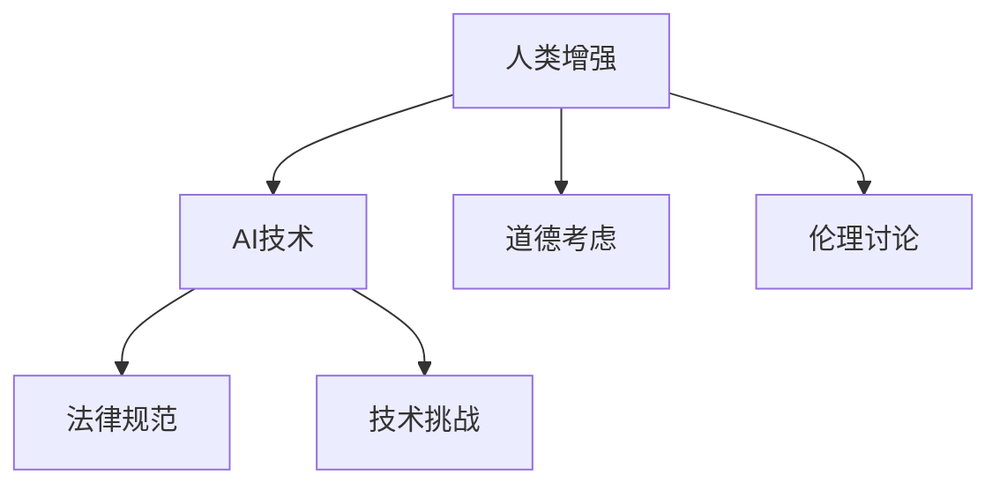

                 

# AI时代的人类增强：道德考虑和身体增强技术的未来

## 1. 背景介绍

随着人工智能（AI）技术的迅猛发展，人类增强（Human Enhancement）已不再是一个遥不可及的梦想，而是一个日益临近的现实。身体增强技术，尤其是基于AI的增强技术，已经开始在医疗、健身、娱乐等诸多领域逐步实现。尽管这些技术带来了诸多积极影响，但同样引发了广泛的伦理和道德讨论。

### 1.1 人类增强技术概述

人类增强技术旨在通过生物医学、工程学、AI等跨学科手段，提升人类的体能、智力和感知能力。常见的增强技术包括但不限于：

- **基因编辑**：如CRISPR等基因编辑技术，可以修改人类基因，预防疾病、延长寿命等。
- **脑机接口**：通过植入芯片或穿戴设备，实现人脑与机器的直接交互，提升信息处理速度和意识控制力。
- **智能假肢**：利用AI技术驱动的假肢，可以感知环境并自动做出反应，极大提升肢体功能。
- **虚拟现实（VR）和增强现实（AR）**：通过模拟仿真环境，增强人类的视觉、听觉、触觉等感官体验。

这些技术的发展，不仅能够带来显著的生活质量提升，还能够拓展人类认知和能力边界，促进社会的整体进步。

### 1.2 技术发展现状

当前，许多身体增强技术已经实现了部分突破，开始逐步应用于临床和日常生活中。例如，植入式脑机接口已用于治疗帕金森病、脑瘫等疾病，智能假肢也在不断优化中，VR和AR设备也得到了广泛的应用。

尽管如此，技术发展的瓶颈依然存在，如长期安全性、有效性和广泛普及性等。AI在增强技术中的应用，需要兼顾伦理道德和法律法规的考量，以确保技术利用的正确性和公正性。

## 2. 核心概念与联系

### 2.1 核心概念概述

- **人类增强**：通过技术手段提升人类的生理和心理能力，使其更适应未来的社会和环境。
- **AI技术**：利用人工智能算法，尤其是机器学习、深度学习等，实现智能决策和自动化控制。
- **道德考虑**：在技术应用过程中，必须考虑到伦理、公平、隐私等道德问题。
- **法律规范**：制定相应的法律法规，确保技术应用的合法性和安全性。

这些概念之间的关系可以通过以下Mermaid流程图来展示：



该流程图展示了人类增强与AI技术的关联性，以及在应用过程中需要考虑的道德和法律问题。

## 3. 核心算法原理 & 具体操作步骤

### 3.1 算法原理概述

基于AI的增强技术，通常包括数据收集、模型训练、设备植入和用户体验优化等多个环节。其中，数据收集和模型训练是核心步骤。

- **数据收集**：收集用户的基本信息、行为数据和生理数据，如运动轨迹、心率、脑电波等。
- **模型训练**：利用AI算法，如深度学习、强化学习等，对收集到的数据进行建模，提取规律和特征。
- **设备植入**：将训练好的模型嵌入到增强设备中，如植入式芯片、外置传感器等。
- **用户体验优化**：通过用户反馈，不断优化模型和设备性能，提升用户体验。

### 3.2 算法步骤详解

以下将详细介绍基于AI的增强技术的算法步骤：

1. **数据收集**：
   - 使用传感器、穿戴设备等收集用户的数据。
   - 确保数据的隐私和安全，防止数据泄露和滥用。

2. **模型训练**：
   - 将收集到的数据输入到AI模型中，如卷积神经网络（CNN）、循环神经网络（RNN）等。
   - 利用监督学习、半监督学习或无监督学习，训练模型以预测用户的行为或生理状态。
   - 使用交叉验证、正则化等技术，避免模型过拟合。

3. **设备植入**：
   - 将训练好的模型嵌入到增强设备中，如植入式芯片、可穿戴设备等。
   - 确保设备的稳定性和安全性，防止意外故障和伤害。

4. **用户体验优化**：
   - 通过用户反馈，收集模型和设备的使用效果数据。
   - 不断调整模型参数和设备设置，优化用户体验。

### 3.3 算法优缺点

基于AI的增强技术具有以下优点：
- **智能决策**：AI算法能够处理复杂数据，提供精准的预测和决策。
- **个性化**：通过深度学习等技术，实现个性化增强效果。
- **实时反馈**：实时收集用户反馈，快速调整优化。

但同时也存在一些缺点：
- **隐私问题**：数据收集和存储过程中，存在隐私泄露的风险。
- **伦理争议**：使用AI技术进行基因编辑、脑机接口等操作，存在伦理争议。
- **安全性**：设备植入和长期使用过程中，可能存在安全隐患。

### 3.4 算法应用领域

基于AI的增强技术已应用于多个领域，如：

- **医疗**：利用AI技术进行疾病预测、基因编辑等。
- **健身**：通过AI算法优化运动方案，提升运动效果。
- **娱乐**：开发基于AI的虚拟现实（VR）和增强现实（AR）设备，提供沉浸式体验。
- **教育**：利用AI技术进行个性化教育，提升学习效果。

## 4. 数学模型和公式 & 详细讲解 & 举例说明

### 4.1 数学模型构建

在基于AI的增强技术中，常用的数学模型包括卷积神经网络（CNN）、循环神经网络（RNN）等。以下以CNN为例，介绍其数学模型构建过程。

#### 4.1.1 卷积神经网络

CNN是一种特殊的深度神经网络，主要用于图像识别和处理。其基本结构包括卷积层、池化层、全连接层等。

CNN的数学模型可以表示为：

$$
f(x) = W_1^T \sigma(g_1(W_0^T x + b_0))
$$

其中，$x$ 为输入向量，$W_0, b_0, W_1, b_1$ 为网络参数，$\sigma$ 为激活函数，$g_1$ 为卷积操作。

### 4.2 公式推导过程

以下是CNN模型中卷积操作的公式推导过程：

设输入数据为 $x \in \mathbb{R}^{m \times n \times c}$，卷积核为 $k \in \mathbb{R}^{f \times f \times c}$，输出为 $y \in \mathbb{R}^{n' \times n' \times o}$。

卷积操作的数学公式为：

$$
y_{i,j,k} = \sum_{l=0}^{c-1} x_{i'_j', l} * k_{f',f',l}
$$

其中，$i', j'$ 表示输入数据和卷积核在空间上的偏移量，$f'$ 表示卷积核的大小，$*$ 表示卷积操作。

### 4.3 案例分析与讲解

以图像识别为例，CNN模型的输入为图像数据，输出为识别结果。通过多层卷积和池化操作，模型可以提取出图像的特征，并通过全连接层进行分类。

以下是一个简单的CNN模型结构：

```
[输入层]
|
v
[卷积层1]
|
v
[激活层1]
|
v
[池化层1]
|
v
[卷积层2]
|
v
[激活层2]
|
v
[池化层2]
|
v
[全连接层]
```

在实际应用中，通过不断调整网络结构、优化参数，CNN模型可以显著提升图像识别的准确率。

## 5. 项目实践：代码实例和详细解释说明

### 5.1 开发环境搭建

在进行基于AI的增强技术项目开发前，需要先搭建开发环境。以下是使用Python进行TensorFlow开发的环境配置流程：

1. 安装Anaconda：从官网下载并安装Anaconda，用于创建独立的Python环境。

2. 创建并激活虚拟环境：
```bash
conda create -n tf-env python=3.8
conda activate tf-env
```

3. 安装TensorFlow：根据CUDA版本，从官网获取对应的安装命令。例如：
```bash
conda install tensorflow -c tensorflow -c conda-forge
```

4. 安装各类工具包：
```bash
pip install numpy pandas scikit-learn matplotlib tqdm jupyter notebook ipython
```

完成上述步骤后，即可在`tf-env`环境中开始项目开发。

### 5.2 源代码详细实现

以下是使用TensorFlow进行图像识别的代码实现：

```python
import tensorflow as tf
from tensorflow.keras import layers, models

# 定义CNN模型
model = models.Sequential([
    layers.Conv2D(32, (3, 3), activation='relu', input_shape=(28, 28, 1)),
    layers.MaxPooling2D((2, 2)),
    layers.Conv2D(64, (3, 3), activation='relu'),
    layers.MaxPooling2D((2, 2)),
    layers.Flatten(),
    layers.Dense(64, activation='relu'),
    layers.Dense(10, activation='softmax')
])

# 编译模型
model.compile(optimizer='adam',
              loss='sparse_categorical_crossentropy',
              metrics=['accuracy'])

# 训练模型
model.fit(train_images, train_labels, epochs=10, batch_size=32, validation_split=0.2)

# 评估模型
test_loss, test_acc = model.evaluate(test_images, test_labels)
print('Test accuracy:', test_acc)
```

上述代码定义了一个简单的CNN模型，用于图像识别任务。模型包括多个卷积层、池化层和全连接层，通过Adam优化器和交叉熵损失函数进行训练。

### 5.3 代码解读与分析

让我们再详细解读一下关键代码的实现细节：

**定义CNN模型**：
- 使用`Sequential`定义线性堆叠模型，包含卷积层、池化层和全连接层。
- 卷积层和池化层的参数和激活函数进行了配置。
- 全连接层和输出层的激活函数进行了配置。

**编译模型**：
- 使用`compile`方法，指定优化器、损失函数和评估指标。

**训练模型**：
- 使用`fit`方法，指定训练数据、训练轮数和批量大小。
- 使用`validation_split`参数，指定模型在训练过程中的验证集比例。

**评估模型**：
- 使用`evaluate`方法，评估模型在测试集上的性能。

**代码实现**：
- 数据预处理：使用`train_images`和`train_labels`作为训练数据，`test_images`和`test_labels`作为测试数据。
- 模型训练：通过`fit`方法，对模型进行训练。
- 模型评估：通过`evaluate`方法，评估模型的性能。

通过上述代码，可以看出TensorFlow的简单高效，使得模型训练和评估变得轻松便捷。

## 6. 实际应用场景

### 6.1 医疗健康

基于AI的增强技术在医疗健康领域有着广泛的应用。例如：

- **疾病预测**：利用基因编辑技术，可以预防和治愈多种疾病，如遗传病、癌症等。
- **个性化医疗**：通过AI算法，结合患者的生理数据和病史，提供个性化的治疗方案。
- **医疗影像分析**：利用深度学习技术，对医学影像进行自动分析和诊断，提高诊断准确率。

### 6.2 健身训练

在健身训练领域，AI技术可以辅助用户进行科学训练：

- **运动方案优化**：利用AI算法，根据用户的身体数据和运动目标，生成个性化的运动方案。
- **训练效果监测**：通过传感器和AI技术，实时监测用户的运动状态，提供实时反馈和调整建议。
- **心理激励**：利用虚拟现实（VR）和增强现实（AR）技术，提供沉浸式训练体验，提升训练效果。

### 6.3 娱乐体验

基于AI的增强技术在娱乐领域也有着广泛的应用：

- **游戏体验**：利用AI技术，生成个性化的游戏内容，提升用户体验。
- **虚拟现实（VR）和增强现实（AR）**：提供沉浸式的游戏和娱乐体验，增强用户感官体验。
- **智能推荐**：通过AI算法，对用户行为进行分析，提供个性化的娱乐推荐。

## 7. 工具和资源推荐

### 7.1 学习资源推荐

为了帮助开发者系统掌握基于AI的增强技术的理论基础和实践技巧，这里推荐一些优质的学习资源：

1. **Deep Learning Specialization**：由Coursera提供的深度学习课程，由Andrew Ng主讲，深入浅出地介绍了深度学习的原理和应用。
2. **Human-AI Collaboration**：由edX提供的课程，探讨了AI与人类合作的方式，以及如何在AI增强技术中考虑道德和伦理问题。
3. **Bioinformatics Specialization**：由Coursera提供的课程，介绍了基因编辑、生物信息学等技术，帮助理解生物医学领域的AI应用。
4. **TensorFlow官方文档**：TensorFlow的官方文档，提供了丰富的教程和样例代码，帮助开发者快速上手。
5. **PyTorch官方文档**：PyTorch的官方文档，提供了详细的API文档和样例代码，适合进行深度学习项目开发。

通过这些资源的学习实践，相信你一定能够快速掌握基于AI的增强技术的精髓，并用于解决实际的AI增强问题。

### 7.2 开发工具推荐

高效的开发离不开优秀的工具支持。以下是几款用于基于AI的增强技术开发的常用工具：

1. **TensorFlow**：Google开发的深度学习框架，支持分布式训练和模型部署，适合大规模项目开发。
2. **PyTorch**：Facebook开发的深度学习框架，灵活易用，适合研究和原型开发。
3. **Hugging Face Transformers**：提供预训练模型的开源库，支持多种自然语言处理任务。
4. **OpenAI Gym**：用于AI和机器学习研究开发的仿真平台，提供了丰富的环境和算法库。
5. **PaddlePaddle**：由百度开发的深度学习框架，支持GPU加速和多设备分布式训练。
6. **Jupyter Notebook**：交互式编程环境，支持Python和R等语言，适合数据科学和机器学习开发。

合理利用这些工具，可以显著提升基于AI的增强技术项目的开发效率，加快创新迭代的步伐。

### 7.3 相关论文推荐

基于AI的增强技术的发展源于学界的持续研究。以下是几篇奠基性的相关论文，推荐阅读：

1. **DeepMind AlphaFold**：DeepMind发布的蛋白质折叠预测模型，利用深度学习技术，实现了蛋白质结构的准确预测。
2. **Advances in Human Enhancement**：探讨了AI在人类增强技术中的应用，强调了技术应用中的伦理和法律问题。
3. **The Human-AI Alignment Problem**：探讨了AI与人类之间的协调和一致性问题，提出了应对措施和解决方案。
4. **A Survey on Human Enhancement Technologies**：综述了多种人类增强技术，包括基因编辑、脑机接口、智能假肢等。
5. **AI for Human Enhancements**：探讨了AI技术在人类增强中的应用，强调了技术的潜力和挑战。

这些论文代表了大AI增强技术的发展脉络。通过学习这些前沿成果，可以帮助研究者把握学科前进方向，激发更多的创新灵感。

## 8. 总结：未来发展趋势与挑战

### 8.1 总结

本文对基于AI的增强技术进行了全面系统的介绍。首先阐述了AI技术在人类增强中的应用前景和现状，明确了技术在提升人类体能、智力和感知能力方面的独特价值。其次，从原理到实践，详细讲解了增强技术的核心算法和操作步骤，给出了实际应用中的代码实例。同时，本文还探讨了增强技术在医疗、健身、娱乐等多个领域的应用，展示了技术的广泛潜力。最后，推荐了一些学习资源、开发工具和相关论文，供开发者深入学习和实践。

通过本文的系统梳理，可以看出，基于AI的增强技术正在成为提升人类能力的重要手段，对社会的各个方面产生了深远影响。未来，伴随技术的不断演进和完善，增强技术将进一步拓展人类认知和能力的边界，为构建智慧社会和未来科技奠定坚实基础。

### 8.2 未来发展趋势

展望未来，基于AI的增强技术将呈现以下几个发展趋势：

1. **技术融合**：AI技术与基因编辑、脑机接口等技术的融合，将推动增强技术向更深层次发展。
2. **伦理与法律**：AI增强技术的普及将带来伦理和法律问题的讨论，如人类身份、公平性等，需要制定相应的政策和规范。
3. **普惠性**：增强技术的应用需要考虑到不同人群的需求和差异，实现普惠性和公平性。
4. **安全性与隐私**：增强技术的安全性和隐私保护问题将日益重要，需要在技术设计和应用中加以保障。
5. **智能化与自主性**：增强技术将向智能化和自主化方向发展，提升技术的自动化和智能化水平。

### 8.3 面临的挑战

尽管基于AI的增强技术已经取得了显著进展，但在迈向更加智能化、普惠化应用的过程中，它仍面临诸多挑战：

1. **技术瓶颈**：当前技术在长期安全性、有效性和普惠性等方面仍存在瓶颈，需要进一步研究和改进。
2. **伦理争议**：技术应用中的伦理和法律问题仍需深入探讨，如基因编辑带来的生命伦理问题。
3. **隐私保护**：数据收集和存储过程中，存在隐私泄露的风险，需要加强数据保护和安全管理。
4. **社会接受度**：增强技术的应用需要考虑社会接受度，避免引发公众反感和抵制。
5. **技术与环境**：增强技术的环境影响也需要加以考虑，如基因编辑技术对生态环境的影响。

### 8.4 研究展望

为了应对上述挑战，未来的研究需要在以下几个方面寻求新的突破：

1. **技术优化**：开发更加高效、稳定和安全的增强技术，提升技术的普惠性和公平性。
2. **伦理研究**：深入探讨AI增强技术的伦理问题，制定相应的伦理规范和法律法规。
3. **社会融合**：推动增强技术与社会环境的融合，提升技术的社会接受度和影响力。
4. **环境考量**：加强对增强技术环境影响的评估和控制，实现技术应用的可持续发展。
5. **跨学科合作**：促进AI增强技术与医学、心理学、社会学等学科的交叉融合，推动技术创新和应用。

这些研究方向将引领基于AI的增强技术迈向更加智能化、普惠化和可持续的方向，为构建未来智慧社会和科技发展提供新的动力。

## 9. 附录：常见问题与解答

**Q1：基于AI的增强技术是否适用于所有人类？**

A: 基于AI的增强技术在适用范围上存在限制。例如，基因编辑技术目前仅适用于基因疾病治疗，尚未广泛用于健康增强。脑机接口技术也需考虑技术成熟度和伦理问题。

**Q2：如何平衡技术提升和伦理道德？**

A: 平衡技术提升和伦理道德是AI增强技术应用中的重要问题。需通过多学科合作，制定明确的伦理规范和法律法规，确保技术应用的公正性和安全性。

**Q3：数据隐私如何保护？**

A: 数据隐私保护是AI增强技术应用中的关键问题。需采用数据加密、匿名化处理等技术，确保数据安全。同时，需制定相应的隐私保护政策和法律规范。

**Q4：AI增强技术是否会导致人类依赖？**

A: 过度依赖AI增强技术可能带来新的风险，如技术退化、社会分化等。需引导公众合理使用技术，避免依赖性过强。

**Q5：AI增强技术是否会加剧社会不平等？**

A: 技术的不平等应用可能加剧社会不平等。需考虑到不同人群的需求和差异，实现技术的普惠性和公平性，避免技术应用中的不平等现象。

通过这些问题的解答，可以看出，基于AI的增强技术在应用过程中需综合考虑技术、伦理、法律和社会等多方面因素，确保技术应用的合理性和可持续性。

