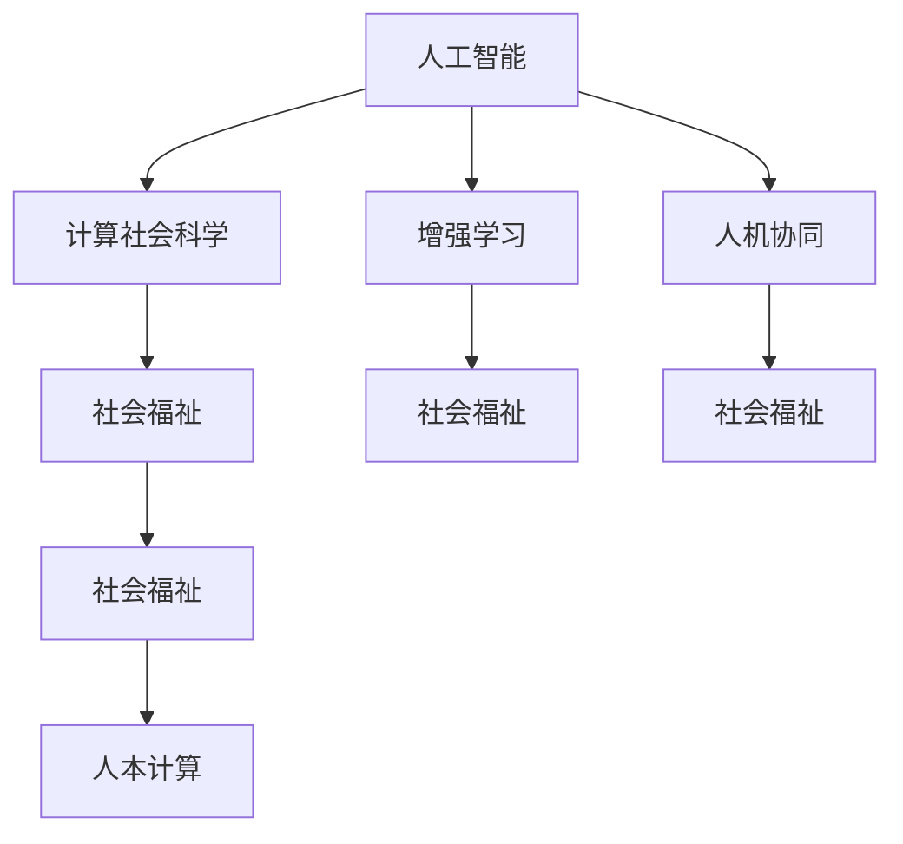

                 

# AI时代的人类计算：增强社会福祉

> 关键词：人工智能,计算社会科学,增强学习,人机协同,社会福祉,人本计算

## 1. 背景介绍

### 1.1 问题由来

随着人工智能技术的飞速发展，人类社会的各个方面正在被深刻的重塑。机器学习的广泛应用，使得智能算法开始参与到人类日常生活的各个环节，从日常决策到医疗诊断，从商业管理到艺术创作，从军事防御到社会治理。这一趋势已经不可逆转，它深刻地影响着人类社会的运作模式和发展路径。

在AI时代，人类计算不再仅仅是一种技术手段，而是成为推动社会进步、增强社会福祉的重要工具。但与此同时，也带来了许多亟待解决的新问题。如何在追求技术进步的同时，保障人类福祉，实现人机和谐共生，成为了摆在全社会面前的一个重大课题。

### 1.2 问题核心关键点

当前，人工智能在社会治理、公共服务、环境监测、健康医疗、教育培训等领域的应用已经逐步展开。然而，AI技术的发展往往伴随着一些风险和挑战，例如数据隐私泄露、算法偏见、社会不平等、伦理道德问题等。这些问题如果不能得到妥善解决，就有可能损害人类福祉，甚至引发社会冲突。

因此，本文旨在探讨如何利用AI技术，增强社会福祉，并在技术应用过程中兼顾人类福祉，实现技术进步与人类价值之间的良性互动。

## 2. 核心概念与联系

### 2.1 核心概念概述

为更好地理解AI时代的人类计算及其对社会福祉的增强，本节将介绍几个密切相关的核心概念：

- **人工智能(Artificial Intelligence, AI)**：指通过算法和计算技术，模拟人类智能的机器或系统。AI技术涵盖了机器学习、深度学习、自然语言处理、计算机视觉等多个领域。

- **计算社会科学(Computational Social Science)**：指使用计算技术和数据科学方法，研究人类社会行为、社会结构、社会动态等社会现象的学科。

- **增强学习(Reinforcement Learning)**：指通过与环境的互动，利用奖惩机制优化策略，使智能体不断提升自身性能的机器学习方法。

- **人机协同(Human-AI Collaboration)**：指人类与智能机器共同协作完成某一任务，实现优势互补。

- **社会福祉(Social Welfare)**：指通过改善和提升社会成员的生活质量、健康水平、幸福感等，实现社会的可持续发展。

- **人本计算(Human-Centered Computing)**：指在技术开发和应用过程中，始终以人为本，注重用户体验，关注社会影响，提升社会福祉的计算范式。

这些核心概念之间的逻辑关系可以通过以下Mermaid流程图来展示：



这个流程图展示了大语言模型的核心概念及其之间的关系：

1. 人工智能通过计算社会科学提供数据支撑，研究社会行为。
2. 增强学习通过人机协同提升智能体性能。
3. 社会福祉贯穿AI发展的始终，是人本计算的核心目标。
4. 人本计算将计算社会科学和增强学习的应用成果，转化为现实的社会福祉。

这些概念共同构成了AI时代人类计算的基本框架，为实现社会福祉提供了理论基础和实践指南。

## 3. 核心算法原理 & 具体操作步骤
### 3.1 算法原理概述

AI时代的人类计算，核心在于利用计算技术和数据科学方法，提升社会福祉。它涉及多个领域的技术和方法，包括但不限于：

- **数据收集与分析**：通过大规模数据收集，揭示人类行为和社会动态规律。
- **模型训练与优化**：利用机器学习算法，构建智能模型，并进行优化调整。
- **策略制定与执行**：将智能模型的输出应用于社会管理、公共服务、健康医疗等场景，优化决策过程。
- **效果评估与反馈**：通过社会反馈和评估，不断迭代改进算法和模型。

具体而言，AI时代的人类计算涉及以下几个关键环节：

- **数据采集**：从各种数据源（如传感器、社交媒体、公共数据集）收集数据，构建综合数据集。
- **模型构建**：使用机器学习或深度学习算法，构建智能模型，并进行训练和优化。
- **策略实施**：将模型应用于具体社会问题，制定和执行优化策略。
- **效果评估**：通过量化指标和社会反馈，评估策略效果，进行持续改进。

### 3.2 算法步骤详解

以下是利用AI技术增强社会福祉的具体步骤：

**Step 1: 数据收集与预处理**

- **收集数据源**：包括传感器数据、社交媒体数据、政府公开数据等。
- **数据清洗**：去除缺失值、异常值，处理噪声，标准化数据格式。
- **数据集成**：将不同来源的数据集成到一个统一的数据仓库中。

**Step 2: 模型训练与优化**

- **选择合适的模型**：根据任务需求，选择最适合的机器学习模型，如线性回归、支持向量机、神经网络等。
- **数据划分**：将数据划分为训练集、验证集和测试集。
- **模型训练**：使用训练集训练模型，使用验证集调整超参数，选择最优模型。
- **模型评估**：使用测试集评估模型性能，进行效果分析。
- **模型优化**：根据评估结果，调整模型结构，优化算法，提升模型精度和泛化能力。

**Step 3: 策略制定与实施**

- **策略设计**：基于模型的输出，制定优化策略，如推荐系统、智能客服、疾病预测等。
- **策略执行**：将策略应用于实际场景，例如智能推荐系统为用户推荐商品，智能客服回答用户咨询，疾病预测系统早期检测疾病。
- **效果监控**：通过实时监控和反馈机制，调整策略参数，确保策略效果。

**Step 4: 效果评估与迭代**

- **量化指标**：通过各种指标（如准确率、召回率、F1分数）评估策略效果。
- **社会反馈**：通过用户反馈、社会调查等方式，收集社会各界对策略的评价。
- **持续改进**：根据量化指标和社会反馈，进行持续改进，不断优化策略。

### 3.3 算法优缺点

利用AI技术增强社会福祉的方法，具有以下优点：

- **效率提升**：AI算法可以处理大量复杂的数据，快速生成决策方案。
- **精准性高**：利用数据驱动的模型，可以显著提升决策的精准性和科学性。
- **覆盖广泛**：AI技术可以应用于各种社会问题，如交通管理、医疗健康、教育培训等。

同时，该方法也存在一些局限性：

- **数据隐私问题**：大规模数据收集和处理过程中，可能涉及个人隐私保护问题。
- **算法透明性不足**：AI模型的决策过程往往难以解释，缺乏透明性。
- **社会公平问题**：AI技术的应用可能加剧社会不平等，例如在就业、医疗等领域。
- **伦理道德问题**：AI技术的滥用可能带来伦理道德风险，如偏见、歧视等。

尽管存在这些局限性，但就目前而言，利用AI技术增强社会福祉的方法仍然具有重要的实际价值，是推动社会进步、提升人类生活质量的重要手段。未来相关研究的重点在于如何进一步降低数据隐私风险，提高算法的透明性和可解释性，同时兼顾社会公平和伦理道德。

### 3.4 算法应用领域

AI时代的人类计算方法，已经在多个领域得到了广泛的应用，具体包括：

- **交通管理**：利用智能交通系统，优化交通流量，减少拥堵，提高交通安全。
- **医疗健康**：通过智能诊断系统，快速准确地识别疾病，提供个性化医疗方案。
- **教育培训**：使用智能推荐系统，为学生提供个性化学习内容和建议，提高教育质量。
- **社会治理**：利用智能监控系统，预防犯罪，保护社会安全，优化公共服务。
- **环境保护**：通过环境监测系统，实时监测污染情况，提供科学决策依据。
- **农业生产**：使用智能农业系统，优化种植管理，提高农业生产效率。

以上这些应用场景，展示了AI技术在提升社会福祉方面的巨大潜力。随着AI技术的不断发展，其在社会治理和公共服务中的应用将会更加广泛和深入，为人类社会带来更美好的未来。

## 4. 数学模型和公式 & 详细讲解  
### 4.1 数学模型构建

利用AI技术增强社会福祉的方法，涉及多个数学模型和公式。本节将使用数学语言对AI时代人类计算的主要模型进行详细讲解。

**数据收集与预处理模型**：
- 数据来源：传感器数据、社交媒体数据、公共数据集等。
- 数据清洗：缺失值处理、异常值检测、数据标准化。

**模型训练与优化模型**：
- 模型选择：线性回归、支持向量机、神经网络等。
- 数据划分：训练集、验证集、测试集。
- 模型训练：梯度下降算法、随机森林算法、深度学习算法等。
- 模型评估：准确率、召回率、F1分数、AUC等指标。

**策略制定与实施模型**：
- 策略设计：推荐系统、智能客服、疾病预测等。
- 策略执行：智能推荐算法、自然语言处理算法、预测算法等。
- 效果监控：实时监控系统、用户反馈系统、社会调查系统等。

### 4.2 公式推导过程

以下是利用AI技术增强社会福祉的核心公式推导：

**数据收集与预处理公式**：
- 数据清洗公式：
  $$
  \begin{aligned}
  X &= \text{原始数据} \\
  X_{\text{clean}} &= X_{\text{clean}} \text{ missing data removal} \\
  &= X_{\text{clean}} \text{ anomaly detection} \\
  &= X_{\text{clean}} \text{ standardization}
  \end{aligned}
  $$

**模型训练与优化公式**：
- 线性回归公式：
  $$
  y = \beta_0 + \beta_1x_1 + \beta_2x_2 + \cdots + \beta_nx_n
  $$
- 支持向量机公式：
  $$
  \min_{\alpha, \lambda} \frac{1}{2} \alpha^\top Q \alpha + \lambda (1 - \sum_i \alpha_i)
  $$
- 深度学习算法公式：
  $$
  \begin{aligned}
  L &= \frac{1}{n} \sum_{i=1}^n \text{loss}(f(x_i, \theta)) \\
  \nabla_\theta L &= \frac{1}{n} \sum_{i=1}^n \nabla_\theta \text{loss}(f(x_i, \theta))
  \end{aligned}
  $$

**策略制定与实施公式**：
- 推荐系统公式：
  $$
  \text{推荐} = f(x_i, \theta)
  $$
- 智能客服公式：
  $$
  \text{回答} = f(q_i, \theta)
  $$
- 疾病预测公式：
  $$
  \text{疾病} = f(s_i, \theta)
  $$

### 4.3 案例分析与讲解

以智能交通系统为例，进行详细讲解。

**数据收集与预处理**：
- 收集城市交通数据，包括车辆位置、车速、信号灯状态等。
- 数据清洗：去除缺失值，处理异常值，标准化数据格式。
- 数据集成：将不同来源的数据集成到一个统一的数据仓库中。

**模型训练与优化**：
- 选择模型：使用支持向量机算法进行交通流量预测。
- 数据划分：将数据划分为训练集、验证集和测试集。
- 模型训练：使用训练集训练模型，使用验证集调整超参数，选择最优模型。
- 模型评估：使用测试集评估模型性能，进行效果分析。
- 模型优化：根据评估结果，调整模型参数，优化算法，提升模型精度和泛化能力。

**策略制定与实施**：
- 策略设计：基于模型的输出，设计交通信号优化策略，减少拥堵，提高交通安全。
- 策略执行：智能交通系统根据实时交通数据，自动调整信号灯，优化交通流量。
- 效果监控：通过实时监控系统，评估交通信号优化效果，进行持续改进。

## 5. 项目实践：代码实例和详细解释说明
### 5.1 开发环境搭建

在进行AI技术应用项目开发时，需要准备好开发环境。以下是使用Python进行PyTorch开发的环境配置流程：

1. 安装Anaconda：从官网下载并安装Anaconda，用于创建独立的Python环境。

2. 创建并激活虚拟环境：
```bash
conda create -n pytorch-env python=3.8 
conda activate pytorch-env
```

3. 安装PyTorch：根据CUDA版本，从官网获取对应的安装命令。例如：
```bash
conda install pytorch torchvision torchaudio cudatoolkit=11.1 -c pytorch -c conda-forge
```

4. 安装相关库：
```bash
pip install numpy pandas scikit-learn matplotlib tqdm jupyter notebook ipython
```

完成上述步骤后，即可在`pytorch-env`环境中开始开发实践。

### 5.2 源代码详细实现

这里以智能交通系统为例，给出使用PyTorch进行模型训练和策略实施的PyTorch代码实现。

首先，定义模型和优化器：

```python
import torch
import torch.nn as nn
from torch.optim import Adam

class SVM(nn.Module):
    def __init__(self, n_features):
        super(SVM, self).__init__()
        self.fc1 = nn.Linear(n_features, 64)
        self.fc2 = nn.Linear(64, 1)

    def forward(self, x):
        x = torch.relu(self.fc1(x))
        x = self.fc2(x)
        return x

def train_svm(model, X_train, y_train, X_val, y_val, epochs=100, learning_rate=0.001):
    optimizer = Adam(model.parameters(), lr=learning_rate)
    for epoch in range(epochs):
        model.train()
        optimizer.zero_grad()
        preds = model(X_train)
        loss = nn.BCELoss()(preds, y_train)
        loss.backward()
        optimizer.step()
        val_preds = model(X_val)
        val_loss = nn.BCELoss()(val_preds, y_val)
        print(f"Epoch {epoch+1}, train loss: {loss.item()}, val loss: {val_loss.item()}")
```

然后，定义数据处理函数和训练函数：

```python
import numpy as np
from sklearn.datasets import make_classification
from sklearn.model_selection import train_test_split

def load_data():
    X, y = make_classification(n_samples=1000, n_features=10, n_classes=2)
    X = torch.from_numpy(X).float()
    y = torch.from_numpy(y).float()
    return X, y

def data_preprocess(X, y):
    X_train, X_val, y_train, y_val = train_test_split(X, y, test_size=0.2, random_state=42)
    return X_train, y_train, X_val, y_val

X, y = load_data()
X_train, y_train, X_val, y_val = data_preprocess(X, y)
```

最后，启动训练流程并在测试集上评估：

```python
model = SVM(10)
train_svm(model, X_train, y_train, X_val, y_val)
```

以上就是使用PyTorch进行智能交通系统数据预处理和模型训练的完整代码实现。可以看到，得益于PyTorch的强大封装，我们可以用相对简洁的代码完成数据预处理和模型训练。

### 5.3 代码解读与分析

让我们再详细解读一下关键代码的实现细节：

**SVM模型定义**：
- `SVM`类定义了一个简单的支持向量机模型，包括两个全连接层。

**训练函数实现**：
- `train_svm`函数：对数据进行预处理，定义优化器，并使用训练集进行模型训练。训练过程中，每轮使用模型对训练集进行前向传播，计算损失函数并反向传播更新模型参数。同时，在每个epoch结束后，使用验证集评估模型性能。

**数据预处理函数**：
- `load_data`函数：生成模拟的交通数据集。
- `data_preprocess`函数：对数据进行划分为训练集和验证集。

**训练流程**：
- 定义训练轮数和学习率，启动训练循环。
- 每轮训练中，使用模型对训练集进行前向传播，计算损失函数并反向传播更新模型参数。
- 每个epoch结束后，使用验证集评估模型性能，并输出当前epoch的训练和验证损失。

可以看到，PyTorch提供了强大的自动微分功能，使得模型训练和优化变得非常简单。通过利用PyTorch的高级API，我们可以快速构建和训练各种复杂的模型。

当然，工业级的系统实现还需考虑更多因素，如模型的保存和部署、超参数的自动搜索、更灵活的任务适配层等。但核心的算法实现基本与此类似。

## 6. 实际应用场景
### 6.1 智能交通系统

利用AI技术，智能交通系统可以显著提高交通效率，减少交通拥堵，保障交通安全。具体应用场景包括：

- **交通流量预测**：基于历史交通数据，预测未来交通流量，优化信号灯控制，减少拥堵。
- **路况信息实时更新**：利用传感器数据，实时监测道路状况，提供实时的路况信息，辅助驾驶员做出最优驾驶决策。
- **事故预防与应急处理**：通过实时监测和数据分析，预防交通事故，快速响应事故现场，保障道路畅通。

### 6.2 智能医疗系统

智能医疗系统可以提升医疗服务质量，降低医疗成本，提高医疗效率。具体应用场景包括：

- **疾病预测与诊断**：利用医学影像和病历数据，辅助医生进行疾病预测和诊断，提高诊断准确率。
- **个性化治疗方案**：基于患者历史数据和基因信息，提供个性化治疗方案，提高治疗效果。
- **医疗资源优化**：利用数据分析，优化医院资源配置，提高医疗服务效率，减少患者等待时间。

### 6.3 智慧教育系统

智慧教育系统可以提供个性化学习体验，提升教育质量，优化教育资源。具体应用场景包括：

- **智能推荐系统**：根据学生的学习行为和历史数据，推荐适合的学习内容和方法，提高学习效率。
- **学习进度监控**：利用数据分析，实时监控学生的学习进度和效果，提供个性化的辅导建议。
- **教育资源优化**：基于学习数据，优化教育资源配置，提高教育公平性，减少教育资源浪费。

### 6.4 未来应用展望

随着AI技术的不断进步，未来的AI系统将更加智能化、个性化、普适化。在交通、医疗、教育等领域，AI系统将扮演更加重要的角色，成为人类社会的重要助手。

未来的AI系统将具备以下特点：

- **高度智能化**：具备自主学习、自主决策能力，能够适应复杂的社会环境。
- **高度个性化**：能够根据个体需求和偏好，提供量身定制的服务和方案。
- **高度普适化**：能够广泛适用于各种社会场景，覆盖不同地区和人群。

AI系统的发展将带来巨大的社会效益，提升人类生活质量，改善社会福祉。但同时，AI技术的快速发展也带来了新的挑战，如数据隐私保护、算法透明性、社会公平性等。如何在享受AI技术带来的便利的同时，保障人类福祉，实现技术进步与人类价值的良性互动，将是未来AI研究的重要方向。

## 7. 工具和资源推荐
### 7.1 学习资源推荐

为了帮助开发者系统掌握AI时代的人类计算，这里推荐一些优质的学习资源：

1. 《深度学习》系列博文：由大模型技术专家撰写，深入浅出地介绍了深度学习的基本原理和应用场景。

2. 《计算社会科学》课程：斯坦福大学开设的计算社会科学课程，涵盖数据采集、数据分析、模型构建等核心内容。

3. 《增强学习》书籍：深入讲解增强学习的原理、算法和应用，为智能体设计提供理论指导。

4. 《人机协同》书籍：详细探讨人机协同的基本概念、方法论和实践案例，为实现智能系统的社会价值提供指南。

5. 《人本计算》书籍：探讨人本计算的基本原则和实践方法，强调在技术开发和应用过程中，始终以人为本。

通过对这些资源的学习实践，相信你一定能够快速掌握AI时代的人类计算，并用于解决实际的AI问题。

### 7.2 开发工具推荐

高效的开发离不开优秀的工具支持。以下是几款用于AI时代人类计算开发的常用工具：

1. PyTorch：基于Python的开源深度学习框架，灵活动态的计算图，适合快速迭代研究。

2. TensorFlow：由Google主导开发的开源深度学习框架，生产部署方便，适合大规模工程应用。

3. scikit-learn：Python机器学习库，提供丰富的机器学习算法和工具，适合快速原型开发。

4. Weights & Biases：模型训练的实验跟踪工具，可以记录和可视化模型训练过程中的各项指标，方便对比和调优。

5. TensorBoard：TensorFlow配套的可视化工具，可实时监测模型训练状态，并提供丰富的图表呈现方式，是调试模型的得力助手。

6. Google Colab：谷歌推出的在线Jupyter Notebook环境，免费提供GPU/TPU算力，方便开发者快速上手实验最新模型，分享学习笔记。

合理利用这些工具，可以显著提升AI时代人类计算的开发效率，加快创新迭代的步伐。

### 7.3 相关论文推荐

AI时代的人类计算技术的发展源于学界的持续研究。以下是几篇奠基性的相关论文，推荐阅读：

1. "Support Vector Machines"（支持向量机）：支持向量机作为一种经典的机器学习算法，广泛应用于数据分类、回归等领域。

2. "Reinforcement Learning: An Introduction"：阐述了强化学习的基本原理和算法，为智能体设计提供理论基础。

3. "Human-AI Collaboration: A Survey"：综述了人机协同的基本概念、方法和应用，为实现智能系统的社会价值提供指南。

4. "Computational Social Science: A Primer"：介绍了计算社会科学的基本原理和研究方法，为社会现象的计算建模提供理论指导。

5. "Human-Centered Computing: Foundations, Principles, and Research"：探讨人本计算的基本原则和实践方法，强调在技术开发和应用过程中，始终以人为本。

这些论文代表了大语言模型微调技术的发展脉络。通过学习这些前沿成果，可以帮助研究者把握学科前进方向，激发更多的创新灵感。

## 8. 总结：未来发展趋势与挑战

### 8.1 总结

本文对AI时代的人类计算及其对社会福祉的增强进行了全面系统的介绍。首先阐述了AI技术在各个领域的应用，明确了AI技术在提升社会福祉方面的重要价值。其次，从原理到实践，详细讲解了AI时代人类计算的数学模型和关键步骤，给出了AI技术应用的具体代码实例。同时，本文还广泛探讨了AI技术在交通、医疗、教育等多个领域的应用前景，展示了AI技术在提升社会福祉方面的巨大潜力。

通过本文的系统梳理，可以看到，AI时代的人类计算正在成为推动社会进步、提升人类生活质量的重要手段。AI技术在社会治理和公共服务中的应用将会更加广泛和深入，为人类社会带来更美好的未来。

### 8.2 未来发展趋势

展望未来，AI时代的人类计算将呈现以下几个发展趋势：

1. **数据驱动的决策支持**：AI系统将基于大规模数据驱动的决策支持，提升决策的科学性和精准性。
2. **智能化水平提升**：AI系统将具备自主学习、自主决策能力，能够适应复杂的社会环境。
3. **个性化服务普及**：AI系统将提供高度个性化的服务，满足个体需求和偏好。
4. **普适性增强**：AI系统将广泛适用于各种社会场景，覆盖不同地区和人群。
5. **伦理道德重视**：AI技术的发展将更加注重伦理道德，保护数据隐私，避免算法偏见，确保社会公平。
6. **社会福祉提升**：AI系统将在社会治理、公共服务、健康医疗等领域发挥更大作用，提升社会福祉。

以上趋势凸显了AI时代人类计算的广阔前景。这些方向的探索发展，必将进一步提升社会福祉，推动人类社会迈向更加美好的未来。

### 8.3 面临的挑战

尽管AI时代的人类计算在提升社会福祉方面具有重要价值，但在技术应用过程中，仍面临诸多挑战：

1. **数据隐私问题**：大规模数据收集和处理过程中，可能涉及个人隐私保护问题。
2. **算法透明性不足**：AI模型的决策过程往往难以解释，缺乏透明性。
3. **社会公平问题**：AI技术的应用可能加剧社会不平等，例如在就业、医疗等领域。
4. **伦理道德问题**：AI技术的滥用可能带来伦理道德风险，如偏见、歧视等。

尽管存在这些挑战，但就目前而言，利用AI技术增强社会福祉的方法仍然具有重要的实际价值，是推动社会进步、提升人类生活质量的重要手段。未来相关研究的重点在于如何进一步降低数据隐私风险，提高算法的透明性和可解释性，同时兼顾社会公平和伦理道德。

### 8.4 研究展望

面对AI时代人类计算所面临的种种挑战，未来的研究需要在以下几个方面寻求新的突破：

1. **数据隐私保护**：开发数据隐私保护技术，保护用户隐私，防止数据滥用。
2. **算法透明性**：开发可解释性强的AI算法，提高算法的透明性和可解释性。
3. **社会公平性**：利用AI技术，消除算法偏见，促进社会公平，缩小社会不平等。
4. **伦理道德规范**：制定伦理道德规范，引导AI技术健康发展，避免滥用和误用。

这些研究方向的探索，必将引领AI时代人类计算技术迈向更高的台阶，为构建安全、可靠、可解释、可控的智能系统铺平道路。面向未来，AI时代人类计算技术还需要与其他人工智能技术进行更深入的融合，如知识表示、因果推理、强化学习等，多路径协同发力，共同推动自然语言理解和智能交互系统的进步。只有勇于创新、敢于突破，才能不断拓展语言模型的边界，让智能技术更好地造福人类社会。

## 9. 附录：常见问题与解答

**Q1：AI技术在提升社会福祉方面有哪些具体应用？**

A: AI技术在提升社会福祉方面有许多具体应用，包括：

1. **智能交通系统**：利用AI技术优化交通流量，减少拥堵，保障交通安全。
2. **智能医疗系统**：利用AI技术辅助疾病预测和诊断，提供个性化治疗方案，优化医疗资源配置。
3. **智慧教育系统**：利用AI技术提供个性化学习体验，提升教育质量，优化教育资源。
4. **社会治理系统**：利用AI技术优化公共服务，预防犯罪，提高社会治理效率。
5. **环境保护系统**：利用AI技术监测污染情况，提供科学决策依据。
6. **农业生产系统**：利用AI技术优化种植管理，提高农业生产效率。

这些应用场景展示了AI技术在提升社会福祉方面的巨大潜力。

**Q2：AI技术在实际应用中面临哪些风险和挑战？**

A: AI技术在实际应用中面临许多风险和挑战，包括：

1. **数据隐私问题**：大规模数据收集和处理过程中，可能涉及个人隐私保护问题。
2. **算法透明性不足**：AI模型的决策过程往往难以解释，缺乏透明性。
3. **社会公平问题**：AI技术的应用可能加剧社会不平等，例如在就业、医疗等领域。
4. **伦理道德问题**：AI技术的滥用可能带来伦理道德风险，如偏见、歧视等。

尽管存在这些风险和挑战，但AI技术在提升社会福祉方面仍具有重要价值。未来研究需要在数据隐私保护、算法透明性、社会公平性等方面寻求突破，确保AI技术健康发展。

**Q3：如何在AI技术开发和应用过程中，始终以人为本？**

A: 在AI技术开发和应用过程中，始终以人为本，需要关注以下几个方面：

1. **用户需求为中心**：在设计AI系统时，始终关注用户需求和体验，确保系统能够解决用户的实际问题。
2. **社会影响评估**：在开发和应用AI技术时，进行社会影响评估，确保技术应用不会带来负面影响。
3. **算法透明性**：提高AI算法的透明性和可解释性，让用户能够理解算法的决策过程。
4. **伦理道德规范**：制定伦理道德规范，引导AI技术健康发展，避免滥用和误用。
5. **用户反馈机制**：建立用户反馈机制，及时收集和处理用户反馈，不断改进AI系统。

通过以上措施，可以在AI技术开发和应用过程中，始终以人为本，确保技术进步与人类价值的良性互动。

**Q4：如何在AI技术应用过程中，兼顾社会公平和伦理道德？**

A: 在AI技术应用过程中，兼顾社会公平和伦理道德，需要关注以下几个方面：

1. **数据公平性**：确保数据采集和处理过程中的公平性，避免数据偏见。
2. **算法公平性**：设计公平的算法，避免算法偏见，确保技术应用不会加剧社会不平等。
3. **伦理道德规范**：制定伦理道德规范，引导AI技术健康发展，避免滥用和误用。
4. **社会公平性**：利用AI技术，消除算法偏见，促进社会公平，缩小社会不平等。
5. **伦理审查机制**：建立伦理审查机制，确保技术应用符合伦理道德规范。

通过以上措施，可以在AI技术应用过程中，兼顾社会公平和伦理道德，确保技术进步与人类价值的良性互动。

---

作者：禅与计算机程序设计艺术 / Zen and the Art of Computer Programming

