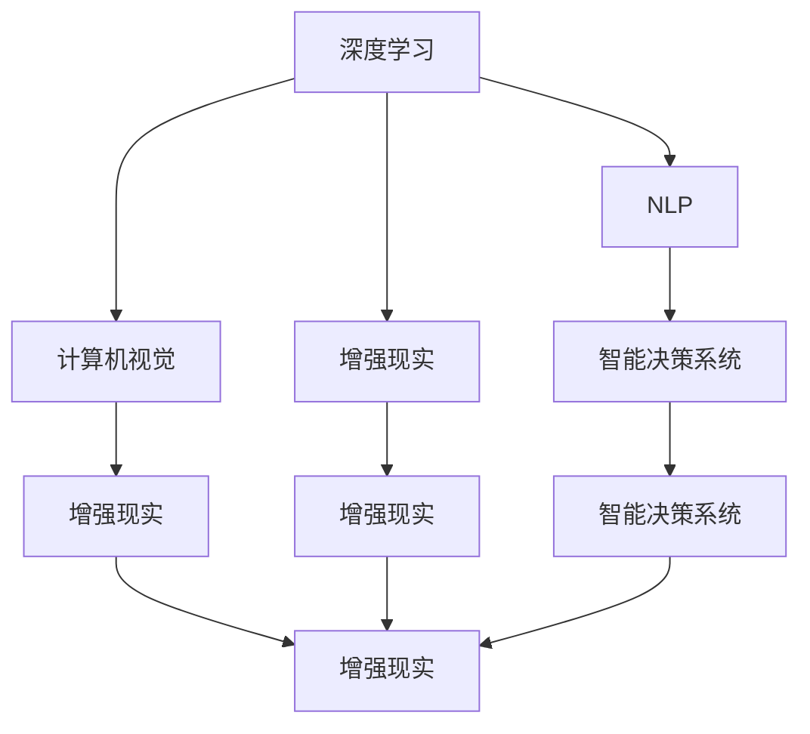

                 

# AI时代程序员的知识变现之路

## 1. 背景介绍

### 1.1 问题由来

随着人工智能技术的蓬勃发展，程序员的知识价值正在迎来重大的变革。AI技术不仅在深度学习、自然语言处理、计算机视觉等传统领域大放异彩，还通过增强现实、虚拟现实、智能决策系统等方式，渗透到医疗、金融、教育、交通等多个行业。这为程序员的知识变现提供了广阔的舞台。

然而，如何准确把握AI技术的趋势，提升自身技能，将知识转化为切实的经济价值，成为了程序员亟需解决的问题。本文将从背景、核心概念与联系、算法原理、应用场景等方面，系统地介绍AI时代程序员的知识变现之路，旨在为有志于此的程序员提供全面的指导。

### 1.2 问题核心关键点

AI时代程序员的知识变现主要围绕以下几个关键点展开：

- **AI技术的掌握与理解**：程序员需要精通AI基础理论和算法原理，特别是深度学习、神经网络、自然语言处理等领域的技术。
- **项目实践与落地能力**：能够将理论知识应用于实际项目，通过实践提升技术熟练度和问题解决能力。
- **市场认知与商业思维**：了解市场需求，具备产品思维和商业模式设计能力，能将技术转化为商业价值。
- **持续学习与自我提升**：保持技术前沿的敏感度，持续学习新的AI技术，提升竞争力。

这些关键点构成了程序员知识变现的基础框架，涵盖技术积累、实践应用、市场洞察和持续进步等环节。

## 2. 核心概念与联系

### 2.1 核心概念概述

为更好地理解AI时代程序员的知识变现路径，本节将介绍几个核心概念：

- **深度学习(Deep Learning)**：一种基于神经网络结构的机器学习方法，通过多层次的非线性映射，实现对复杂数据模式的学习与建模。深度学习是AI时代的重要技术基础。
- **自然语言处理(Natural Language Processing, NLP)**：研究如何让计算机理解、处理和生成人类语言的技术，包括文本分析、情感分析、机器翻译等。
- **计算机视觉(Computer Vision)**：研究如何让计算机“看”和理解图像、视频等视觉信息，包括目标检测、图像分类、图像生成等。
- **增强现实(Augmented Reality, AR)**：通过计算机视觉、传感器技术等手段，增强用户在现实世界中的感知体验，实现虚拟与现实的融合。
- **虚拟现实(Virtual Reality, VR)**：创建完全沉浸式的虚拟环境，使用户能够在虚拟空间中与计算机交互。
- **智能决策系统(Intelligent Decision Making System)**：通过AI算法，实现自动化、智能化的决策过程，应用于金融、医疗、制造业等多个领域。
- **增强现实、虚拟现实、智能决策系统等技术的融合应用**：AI技术的集成应用，带来更广阔的落地场景和更高的价值空间。

这些核心概念之间的联系，可以通过以下Mermaid流程图来展示：



这个流程图展示了大语言模型的核心概念及其之间的关系：

1. 深度学习是AI技术的基础，提供强大的非线性建模能力。
2. NLP、计算机视觉等技术通过深度学习得到提升。
3. 增强现实、虚拟现实等技术在深度学习基础上，进一步提升用户的沉浸式体验。
4. 智能决策系统则通过深度学习、NLP等技术，实现自动化、智能化的决策。
5. 这些技术通过相互融合，拓展了AI应用的多样性和深度，带来更大的经济价值。

## 3. 核心算法原理 & 具体操作步骤

### 3.1 算法原理概述

AI时代程序员的知识变现，不仅需要掌握核心算法，还需要了解这些算法在实际项目中的应用步骤。本节将从算法原理和操作步骤两个方面进行详细讲解。

### 3.2 算法步骤详解

基于深度学习的AI技术，其核心步骤包括数据准备、模型训练、模型评估和模型部署。下面以自然语言处理(NLP)领域为例，详细介绍这些步骤：

1. **数据准备**：
   - 收集并清洗数据，确保数据的质量和多样性。
   - 对文本数据进行预处理，包括分词、去停用词、词向量化等操作。
   - 划分训练集、验证集和测试集，通常采用8:1:1的比例。

2. **模型训练**：
   - 选择合适的深度学习模型，如卷积神经网络(CNN)、循环神经网络(RNN)、长短期记忆网络(LSTM)、Transformer等。
   - 设计损失函数和优化器，常用的损失函数包括交叉熵损失、均方误差损失等，常用的优化器包括SGD、Adam等。
   - 使用训练集进行模型训练，采用迭代更新策略，直到模型收敛或达到预设轮数。

3. **模型评估**：
   - 使用验证集评估模型性能，常用的指标包括准确率、召回率、F1值等。
   - 根据评估结果调整模型参数，防止过拟合或欠拟合。
   - 确保模型在不同数据分布上的泛化能力。

4. **模型部署**：
   - 将训练好的模型保存为可执行文件，进行部署。
   - 优化模型性能，减小推理时间，提升计算效率。
   - 集成到实际应用系统中，进行测试和反馈优化。

### 3.3 算法优缺点

深度学习在AI时代程序员的知识变现中发挥着重要作用，但也存在一些优缺点：

- **优点**：
  - 强大的非线性建模能力，适用于复杂数据模式的学习。
  - 算法效果显著，在多个领域取得了突破性进展。
  - 框架和工具丰富，易于实现和部署。

- **缺点**：
  - 对数据质量和规模要求高，需要大量标注数据。
  - 模型训练时间长，计算资源消耗大。
  - 模型复杂度高，难以解释其内部工作机制。
  - 对领域知识要求高，需要持续学习和积累。

### 3.4 算法应用领域

深度学习在多个领域得到了广泛应用，程序员的知识变现可以通过这些领域进行实现：

1. **计算机视觉**：
   - 目标检测：如人脸识别、车辆检测等。
   - 图像分类：如手写数字识别、猫狗识别等。
   - 图像生成：如GAN生成图片、人脸美化等。

2. **自然语言处理**：
   - 机器翻译：如Google翻译、百度翻译等。
   - 文本分类：如情感分析、垃圾邮件过滤等。
   - 信息抽取：如命名实体识别、关系抽取等。

3. **增强现实、虚拟现实**：
   - 虚拟角色交互：如游戏场景模拟、虚拟助手等。
   - 虚拟现实应用：如虚拟购物、虚拟旅游等。

4. **智能决策系统**：
   - 金融风险评估：如信用评分、股票预测等。
   - 医疗诊断：如影像诊断、疾病预测等。
   - 物流优化：如路径规划、仓库管理等。

以上应用领域涵盖了AI技术的广泛应用，程序员可以根据自身兴趣和市场需求，选择相应的方向进行知识变现。

## 4. 数学模型和公式 & 详细讲解 & 举例说明

### 4.1 数学模型构建

本节将使用数学语言对AI时代程序员的知识变现路径进行更加严格的刻画。

设训练数据集为 $D=\{(x_i, y_i)\}_{i=1}^N, x_i \in \mathcal{X}, y_i \in \mathcal{Y}$，其中 $\mathcal{X}$ 为输入空间，$\mathcal{Y}$ 为输出空间。假设深度学习模型为 $M_{\theta}$，其中 $\theta$ 为模型参数。

定义模型 $M_{\theta}$ 在输入 $x$ 上的输出为 $\hat{y}=M_{\theta}(x) \in \mathcal{Y}$，则模型的损失函数为：

$$
\ell(M_{\theta}(x),y) = -y \log M_{\theta}(x) - (1-y) \log (1-M_{\theta}(x))
$$

其中 $y \in \{0,1\}$ 为真实标签。训练集上的经验风险为：

$$
\mathcal{L}(\theta) = \frac{1}{N} \sum_{i=1}^N \ell(M_{\theta}(x_i),y_i)
$$

最小化经验风险，即：

$$
\theta^* = \mathop{\arg\min}_{\theta} \mathcal{L}(\theta)
$$

常用的优化算法包括随机梯度下降(SGD)、Adam等，通过反向传播算法计算梯度：

$$
\nabla_{\theta}\mathcal{L}(\theta) = \frac{1}{N} \sum_{i=1}^N \nabla_{\theta} \ell(M_{\theta}(x_i),y_i)
$$

### 4.2 公式推导过程

以文本分类任务为例，推导常用的交叉熵损失函数及其梯度的计算公式。

假设模型 $M_{\theta}$ 在输入 $x$ 上的输出为 $\hat{y}=M_{\theta}(x) \in \mathcal{Y}$，其中 $\mathcal{Y}$ 为输出类别集合。真实标签 $y \in \{1,2,...,K\}$，表示文本属于第 $k$ 个类别。则交叉熵损失函数定义为：

$$
\ell(M_{\theta}(x),y) = -y \log M_{\theta}(x_k) - (1-y) \log (1-M_{\theta}(x_k))
$$

将其代入经验风险公式，得：

$$
\mathcal{L}(\theta) = -\frac{1}{N}\sum_{i=1}^N \log M_{\theta}(x_i)
$$

根据链式法则，损失函数对参数 $\theta_k$ 的梯度为：

$$
\frac{\partial \mathcal{L}(\theta)}{\partial \theta_k} = -\frac{1}{N}\sum_{i=1}^N \frac{1}{M_{\theta}(x_i)}
$$

在得到损失函数的梯度后，即可带入优化算法进行迭代更新。重复上述过程直至收敛，最终得到适应特定任务的最优模型参数 $\theta^*$。

### 4.3 案例分析与讲解

以基于深度学习的文本分类为例，进一步说明其应用流程：

1. **数据准备**：
   - 收集并清洗文本数据，进行分词、去停用词、词向量化等操作。
   - 将文本数据转化为模型可接受的格式，如将每个单词映射为对应的词向量。

2. **模型构建**：
   - 选择适当的深度学习模型，如卷积神经网络(CNN)、循环神经网络(RNN)等。
   - 设计模型的层级结构，包括卷积层、池化层、全连接层等。
   - 设置模型的超参数，如学习率、批大小、迭代轮数等。

3. **模型训练**：
   - 使用训练集进行模型训练，迭代更新模型参数。
   - 采用交叉熵损失函数和Adam优化器，通过反向传播算法计算梯度。
   - 根据验证集上的性能指标调整超参数，防止过拟合或欠拟合。

4. **模型评估**：
   - 使用测试集评估模型性能，计算准确率、召回率、F1值等指标。
   - 根据评估结果调整模型参数，确保模型在不同数据分布上的泛化能力。

5. **模型部署**：
   - 将训练好的模型保存为可执行文件，进行部署。
   - 优化模型性能，减小推理时间，提升计算效率。
   - 集成到实际应用系统中，进行测试和反馈优化。

通过以上步骤，程序员可以将深度学习模型成功应用于文本分类等NLP任务，实现知识变现。

## 5. 项目实践：代码实例和详细解释说明

### 5.1 开发环境搭建

在进行AI项目实践前，我们需要准备好开发环境。以下是使用Python进行TensorFlow开发的环境配置流程：

1. 安装Anaconda：从官网下载并安装Anaconda，用于创建独立的Python环境。

2. 创建并激活虚拟环境：
```bash
conda create -n tensorflow-env python=3.8 
conda activate tensorflow-env
```

3. 安装TensorFlow：根据CUDA版本，从官网获取对应的安装命令。例如：
```bash
conda install tensorflow -c tf -c conda-forge
```

4. 安装各类工具包：
```bash
pip install numpy pandas scikit-learn matplotlib tqdm jupyter notebook ipython
```

完成上述步骤后，即可在`tensorflow-env`环境中开始AI项目实践。

### 5.2 源代码详细实现

下面我们以基于深度学习的文本分类为例，给出使用TensorFlow进行模型开发的PyTorch代码实现。

首先，定义数据预处理函数：

```python
import tensorflow as tf
from tensorflow.keras.preprocessing.text import Tokenizer
from tensorflow.keras.preprocessing.sequence import pad_sequences

tokenizer = Tokenizer(oov_token='<OOV>')
tokenizer.fit_on_texts(texts)

sequences = tokenizer.texts_to_sequences(texts)
word_index = tokenizer.word_index
data = pad_sequences(sequences, maxlen=maxlen, padding='post', truncating='post')
labels = to_categorical(labels)
```

然后，定义模型和优化器：

```python
from tensorflow.keras.models import Sequential
from tensorflow.keras.layers import Embedding, Conv1D, MaxPooling1D, Flatten, Dense

model = Sequential([
    Embedding(input_dim=len(word_index) + 1, output_dim=embedding_dim, input_length=maxlen),
    Conv1D(filters=128, kernel_size=3, activation='relu'),
    MaxPooling1D(pool_size=2),
    Flatten(),
    Dense(64, activation='relu'),
    Dense(num_classes, activation='softmax')
])

optimizer = Adam(lr=learning_rate)
```

接着，定义训练和评估函数：

```python
def train_epoch(model, dataset, batch_size, optimizer):
    model.compile(loss='categorical_crossentropy', optimizer=optimizer, metrics=['accuracy'])
    model.fit(dataset['input'], dataset['output'], batch_size=batch_size, epochs=num_epochs, validation_data=(val_input, val_output))
    
def evaluate(model, dataset, batch_size):
    loss, acc = model.evaluate(dataset['input'], dataset['output'], batch_size=batch_size)
    print('Test loss:', loss)
    print('Test accuracy:', acc)
```

最后，启动训练流程并在测试集上评估：

```python
epochs = 10
batch_size = 32

for epoch in range(epochs):
    train_epoch(model, train_dataset, batch_size, optimizer)
    
print('Epoch', epoch+1, 'accuracy:', model.evaluate(test_dataset, batch_size=batch_size)[1])
```

以上就是使用TensorFlow进行文本分类项目开发的完整代码实现。可以看到，TensorFlow提供了丰富的Keras API，使得模型构建和训练过程变得非常简洁高效。

### 5.3 代码解读与分析

让我们再详细解读一下关键代码的实现细节：

**Tokenizer类**：
- `__init__`方法：初始化词汇表，添加特殊的OOV标记。
- `fit_on_texts`方法：基于给定文本训练Tokenizer，建立词汇表。
- `texts_to_sequences`方法：将文本转化为词汇索引序列。
- `word_index`属性：提供词汇表与索引的映射关系。

**pad_sequences方法**：
- 对文本序列进行填充，保证所有序列长度一致，便于模型处理。
- 参数包括`maxlen`（最大长度）、`padding`（填充方式）、`truncating`（截断方式）。

**模型定义**：
- `Sequential`类：建立线性堆叠的神经网络模型。
- `Embedding`层：将词汇索引序列转化为词向量表示。
- `Conv1D`层：卷积操作，提取局部特征。
- `MaxPooling1D`层：池化操作，减少特征维度。
- `Flatten`层：将高维特征展平，便于全连接层处理。
- `Dense`层：全连接层，进行分类预测。

**训练函数**：
- 使用`compile`方法设置模型的损失函数、优化器和评估指标。
- 使用`fit`方法进行模型训练，其中`dataset['input']`为输入数据，`dataset['output']`为目标标签。

**评估函数**：
- 使用`evaluate`方法评估模型在测试集上的性能。
- 计算并打印测试集的损失和准确率。

**训练流程**：
- 循环进行多次训练，每次迭代一个epoch。
- 在每个epoch结束后，评估模型在验证集上的性能。

可以看到，TensorFlow提供的高层次API使得深度学习模型的构建和训练变得非常便捷。开发者只需关注模型的结构和训练策略，而不必深入底层实现细节。

当然，工业级的系统实现还需考虑更多因素，如模型的保存和部署、超参数的自动搜索、更多的正则化技术等，但核心的AI变现路径基本与此类似。通过选择合适的框架和工具，程序员可以更高效地实现AI项目，提升市场竞争力。

## 6. 实际应用场景

### 6.1 智能推荐系统

基于深度学习的智能推荐系统，可以广泛应用于电商、新闻、视频等多个领域。通过分析用户的历史行为数据，为用户推荐个性化的商品、新闻、视频等，提升用户体验和转化率。

在技术实现上，可以收集用户浏览、点击、购买等行为数据，提取并抽象出用户兴趣特征。构建基于深度学习的推荐模型，如协同过滤、基于内容的推荐等，通过训练数据集，对用户行为进行建模，预测其对新内容的偏好。将训练好的模型集成到推荐系统中，实时生成推荐结果，提升推荐效果。

### 6.2 智能医疗诊断

深度学习在医疗领域的应用也日益增多，可以通过深度学习模型进行疾病诊断、影像分析等任务，辅助医生进行决策。

在具体应用中，可以收集大量的医学影像数据、电子病历等文本数据，构建基于深度学习的医疗诊断模型。例如，通过卷积神经网络(CNN)进行医学影像分析，通过循环神经网络(RNN)进行文本分析，提取医学特征，预测疾病类型。将训练好的模型集成到医疗系统中，辅助医生进行诊断，提高诊断准确率和效率。

### 6.3 智能安防监控

基于深度学习的智能安防监控系统，可以实时监测视频监控数据，自动识别异常行为，提高安全防护水平。

在技术实现上，可以收集大量的监控视频数据，标注出异常行为，如盗窃、破坏等。构建基于深度学习的异常检测模型，如时序分析、行为识别等，通过训练数据集，对监控视频进行实时分析，检测异常行为。将训练好的模型集成到安防系统中，实时预警，提高安防效率。

### 6.4 未来应用展望

随着深度学习技术的不断进步，AI时代程序员的知识变现路径将更加多样化和广阔化。未来，基于AI技术的项目将广泛应用于更多领域，带来更显著的经济和社会效益。

- **智能制造**：通过深度学习进行工艺优化、设备预测维护、质量检测等，提升制造业的智能化水平。
- **智能交通**：通过深度学习进行交通流量预测、车辆识别、自动驾驶等，提高交通管理效率和安全性。
- **智能农业**：通过深度学习进行作物识别、病虫害预测、田间管理等，提升农业生产的智能化水平。

## 7. 工具和资源推荐

### 7.1 学习资源推荐

为了帮助程序员系统掌握AI技术的基础理论和应用实践，这里推荐一些优质的学习资源：

1. 《深度学习》系列书籍：如《深度学习》、《Python深度学习》等，提供了从基础到高级的深度学习知识体系。
2. 《TensorFlow官方文档》：提供了详尽的TensorFlow API说明，帮助开发者快速上手。
3. 《PyTorch官方文档》：提供了丰富的PyTorch API和教程，适用于深度学习模型的构建和训练。
4. Kaggle竞赛平台：提供大量数据集和竞赛任务，帮助开发者实践深度学习算法，提升竞争力。
5. Coursera、edX等在线课程：提供了系统化的AI课程，涵盖深度学习、NLP、计算机视觉等多个方向。

通过对这些资源的学习实践，相信你一定能够系统掌握AI技术的理论基础和实践技巧，为知识变现之路打下坚实基础。

### 7.2 开发工具推荐

高效的开发离不开优秀的工具支持。以下是几款用于AI项目开发的常用工具：

1. PyTorch：基于Python的开源深度学习框架，灵活动态的计算图，适合快速迭代研究。
2. TensorFlow：由Google主导开发的开源深度学习框架，生产部署方便，适合大规模工程应用。
3. Keras：基于TensorFlow等后端的高级API，提供了简单易用的模型构建和训练接口。
4. Jupyter Notebook：支持Python、R等语言，提供丰富的绘图、计算功能，适合数据分析和模型开发。
5. Visual Studio Code：支持Python、TensorFlow等插件，提供高效的代码编写和调试功能。

合理利用这些工具，可以显著提升AI项目开发的效率，加快技术创新和商业落地的步伐。

### 7.3 相关论文推荐

深度学习的发展源于学界的持续研究。以下是几篇奠基性的相关论文，推荐阅读：

1. 《ImageNet Classification with Deep Convolutional Neural Networks》：AlexNet论文，首次展示了深度卷积神经网络在图像分类任务上的突破性效果。
2. 《Convolutional Neural Networks for General Image Recognition with Weak Labeling》：提出ImageNet数据集，推动了深度学习的广泛应用。
3. 《Rethinking the Inception Architecture for Computer Vision》：提出Inception模块，提升了卷积神经网络的结构效率。
4. 《TensorFlow: A System for Large-Scale Machine Learning》：介绍TensorFlow框架的设计和应用，为深度学习的大规模部署提供了有力支持。
5. 《Neural Machine Translation by Jointly Learning to Align and Translate》：提出基于注意力机制的机器翻译模型，提升了翻译效果。

这些论文代表了大语言模型微调技术的发展脉络。通过学习这些前沿成果，可以帮助程序员把握AI技术的未来方向，激发更多的创新灵感。

## 8. 总结：未来发展趋势与挑战

### 8.1 总结

本文对AI时代程序员的知识变现之路进行了全面系统的介绍。首先，介绍了AI技术在深度学习、自然语言处理、计算机视觉等领域的广泛应用。其次，从算法原理和操作步骤两个方面，详细讲解了基于深度学习的AI项目开发流程。再次，探讨了深度学习在多个领域的应用场景，展示了AI技术的巨大潜力。最后，推荐了学习资源、开发工具和相关论文，为程序员提供了系统的技术指引。

通过本文的系统梳理，可以看到，AI时代程序员的知识变现之路充满机遇与挑战。程序员需要不断学习和积累，紧跟技术前沿，持续优化模型性能，才能在AI技术的浪潮中抓住机遇，实现商业价值。

### 8.2 未来发展趋势

展望未来，AI时代程序员的知识变现将呈现以下几个发展趋势：

1. **跨领域融合**：AI技术与更多领域的技术融合，带来更广阔的落地场景和更高的经济价值。例如，AI与物联网、大数据、区块链等技术的结合，推动了智慧城市、智能制造等多个领域的发展。
2. **智能决策系统**：AI技术在金融、医疗、物流等高价值领域的应用，带来显著的经济效益和社会效益。例如，通过AI技术进行风险评估、疾病预测、路径优化等，提升决策效率和准确性。
3. **个性化服务**：AI技术在电商、社交、旅游等多个领域的应用，带来个性化的服务体验。例如，通过AI技术进行用户画像分析、内容推荐、智能客服等，提升用户体验和满意度。
4. **智能助理和虚拟现实**：AI技术在虚拟现实、增强现实等前沿技术中的应用，带来沉浸式的交互体验。例如，通过AI技术进行虚拟角色交互、虚拟购物等，提升用户的沉浸感和参与感。

这些趋势展示了AI技术的广泛应用前景，程序员可以通过持续学习和实践，抓住这些机遇，实现知识变现。

### 8.3 面临的挑战

尽管AI技术在各个领域的应用前景广阔，但程序员在知识变现过程中仍面临诸多挑战：

1. **数据获取与处理**：获取高质量、大规模的数据是AI项目成功的关键。然而，数据的获取和处理需要大量的技术投入和资源支持。
2. **模型训练与优化**：深度学习模型需要大量的计算资源进行训练和优化。如何提升模型效率，降低计算成本，是AI项目开发的重要挑战。
3. **技术前沿与商业化结合**：AI技术发展迅速，如何在技术创新与商业化落地之间找到平衡，是程序员需要面对的重要问题。
4. **伦理与隐私保护**：AI技术在带来便利的同时，也可能带来隐私泄露、算法歧视等问题。如何在技术开发中考虑伦理与隐私保护，是程序员需要深思的课题。

面对这些挑战，程序员需要保持技术敏感度，不断学习和积累，加强伦理与隐私保护意识，才能在AI技术的浪潮中实现知识变现。

### 8.4 研究展望

面对未来的AI技术发展趋势和面临的挑战，未来AI时代程序员的研究方向将重点集中在以下几个方面：

1. **跨领域融合技术**：如何将AI技术与其他技术进行有效融合，推动跨领域技术的发展，提升应用的综合价值。
2. **智能决策系统**：如何构建更高效、更智能的决策系统，提升决策效率和准确性，解决复杂问题。
3. **个性化服务技术**：如何通过AI技术实现更个性化、更智能的服务，提升用户体验和满意度。
4. **伦理与隐私保护**：如何在AI技术开发中考虑伦理与隐私保护，确保技术的可持续发展和社会价值。

通过在这些方向的研究和实践，程序员可以在AI技术的浪潮中实现知识变现，为人类社会带来更深远的影响。

## 9. 附录：常见问题与解答

**Q1：AI时代程序员需要掌握哪些核心技能？**

A: AI时代程序员需要掌握的核心技能包括：
1. 深度学习理论基础，熟悉常用的深度学习模型和算法。
2. 编程语言熟练度，如Python、TensorFlow、PyTorch等。
3. 数据处理能力，能够进行数据清洗、特征提取、数据增强等操作。
4. 模型构建与训练，能够设计、训练、优化深度学习模型。
5. 模型评估与部署，能够使用合适的评估指标和优化策略，进行模型部署和应用。

这些技能构成了程序员在AI时代知识变现的基础，需要不断学习和实践，才能提升竞争力。

**Q2：AI技术在实际应用中需要注意哪些问题？**

A: AI技术在实际应用中需要注意以下几个问题：
1. 数据质量与获取，确保数据的准确性和多样性，避免模型过拟合或欠拟合。
2. 计算资源与效率，合理分配计算资源，优化模型结构和算法，提升计算效率。
3. 伦理与隐私保护，考虑数据的隐私保护，避免算法歧视，确保技术的可持续性。
4. 模型可解释性，提升模型的可解释性，确保算法的透明性和可信度。
5. 算法鲁棒性，考虑模型的鲁棒性，避免对噪声和异常数据的敏感。

这些问题是AI技术在实际应用中需要重点考虑的，程序员需要在项目开发中不断优化和改进。

**Q3：如何提升AI模型的泛化能力？**

A: 提升AI模型的泛化能力，可以从以下几个方面入手：
1. 增加数据量，通过更多的训练数据，提高模型的泛化能力。
2. 数据增强，通过数据增强技术，扩充训练数据的多样性，提高模型的鲁棒性。
3. 正则化技术，如L2正则、Dropout等，防止模型过拟合，提高模型的泛化能力。
4. 迁移学习，通过迁移学习技术，将已有模型的知识迁移到新任务中，提高模型的泛化能力。
5. 模型集成，通过集成多个模型的预测结果，提升模型的泛化能力和鲁棒性。

这些方法可以帮助程序员提升AI模型的泛化能力，确保模型在实际应用中的表现。

**Q4：AI项目开发中需要注意哪些工程实践？**

A: AI项目开发中需要注意以下几个工程实践：
1. 版本控制，使用Git等版本控制系统，确保代码的稳定性和可追溯性。
2. 持续集成与部署，使用CI/CD工具，自动化测试和部署，提升开发效率和可靠性。
3. 数据管理与存储，使用数据库和云存储等技术，管理大规模数据。
4. 模型监控与优化，使用监控工具，实时监控模型性能，进行优化和调参。
5. 用户界面与体验，设计简洁、易用的用户界面，提升用户体验。

这些工程实践可以帮助程序员提升AI项目的开发效率和稳定性，确保项目顺利落地。

---

作者：禅与计算机程序设计艺术 / Zen and the Art of Computer Programming

