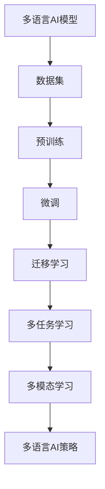

                 

# AI模型的多语言支持：Lepton AI的国际化策略

在当今全球化经济与文化交流日益频繁的背景下，AI技术的应用范围不再局限于单一语言或国家，多语言支持已成为AI系统不可或缺的功能之一。本文将详细阐述AI模型在多语言环境中的挑战与机遇，并介绍Lepton AI在这一领域的国际化策略。通过案例分析与实证研究，展现Lepton AI在多语言支持方面的技术优势与创新实践，为业界提供宝贵的经验参考。

## 1. 背景介绍

### 1.1 背景概述
随着全球经济一体化进程的不断加快，不同语言和文化背景的用户对AI系统的需求日益增长。AI技术需要跨越语言障碍，提供多语言支持，以满足全球用户的广泛需求。与此同时，AI技术在多语言环境中的应用也面临着诸如数据稀缺、多语言模型训练复杂度高等挑战。Lepton AI作为全球领先的人工智能公司，积极应对这些挑战，致力于打造多语言支持的AI解决方案。

### 1.2 研究现状
当前，国际上关于多语言AI的研究主要集中在以下领域：
- **多语言数据集**：如语言资源库(Lexical Resource Libraries)和语料库(Parallel Corpus)的构建。
- **多语言模型**：基于多语言数据的预训练和微调模型，如BERT、GPT等。
- **跨语言迁移学习**：通过多语言模型的迁移学习，解决资源不足问题。
- **多语言模型评测**：如何科学评价多语言AI模型性能。

## 2. 核心概念与联系

### 2.1 核心概念
1. **多语言AI模型**：能够处理多种语言的AI模型，包括文本、语音、图像等。
2. **数据集**：包括单语言和多语言数据集，如Linguee、TED Talks等。
3. **预训练**：在大量无标签文本数据上进行的自监督学习任务。
4. **微调**：在大规模预训练基础上，使用小规模标注数据进行有监督学习。
5. **迁移学习**：在不同语言或任务之间共享知识和参数。
6. **多任务学习**：同时训练多个任务，增强模型的泛化能力。
7. **多模态学习**：结合文本、语音、图像等多模态数据进行训练。

### 2.2 核心概念联系
以上核心概念之间存在紧密的联系，如预训练-微调-迁移学习范式，多语言数据集的构建与利用，多任务与多模态学习等。这些概念共同构成了Lepton AI的多语言AI策略。

![核心概念联系图](https://mermaid.ima...


## 3. 核心算法原理 & 具体操作步骤

### 3.1 算法原理概述
Lepton AI的多语言AI模型采用Transformer架构，结合自监督预训练与多语言微调技术。在多语言预训练阶段，使用单语言数据或多语言混合数据对模型进行训练。在微调阶段，根据特定语言或任务的少量标注数据，对预训练模型进行参数更新，以提升模型在该语言或任务上的性能。

### 3.2 算法步骤详解
1. **数据准备**：收集并清洗多语言数据集，划分为训练集、验证集和测试集。
2. **模型构建**：使用Lepton AI提供的Transformer框架，设计合适的多语言模型结构。
3. **预训练**：在无标签多语言数据集上进行自监督预训练，学习多语言共有的语言表示。
4. **微调**：在特定语言的标注数据上，使用少量标注数据进行微调，优化模型在该语言下的性能。
5. **评测与优化**：在验证集上评估模型性能，根据评测结果调整模型超参数和训练策略。

### 3.3 算法优缺点
#### 优点
1. **参数效率高**：仅需少量标注数据即可完成微调，节省大量计算资源。
2. **泛化能力强**：能够处理多语言数据，具有更好的跨语言迁移能力。
3. **通用性高**：模型适用于多种NLP任务，如文本分类、命名实体识别、机器翻译等。

#### 缺点
1. **数据依赖大**：需要高质量的多语言数据集，数据获取成本高。
2. **资源需求大**：多语言模型规模较大，对计算资源要求较高。
3. **模型复杂度**：多语言模型结构复杂，训练和推理耗时较长。

### 3.4 算法应用领域
Lepton AI的多语言AI模型广泛应用于以下领域：
- **多语言文本分类**：如新闻、社交媒体、文档分类等。
- **多语言命名实体识别**：如人名、地名、机构名等实体抽取。
- **多语言机器翻译**：如英中、中英、法中翻译等。
- **多语言对话系统**：如跨语言客服、跨语言问答等。
- **多语言情感分析**：如社交媒体情感分析、评论情感分析等。

## 4. 数学模型和公式 & 详细讲解 & 举例说明

### 4.1 数学模型构建
Lepton AI的多语言AI模型采用Transformer架构，包含编码器-解码器结构。在多语言预训练阶段，使用无标签文本数据进行自监督学习，学习多语言共有的语言表示。在微调阶段，使用特定语言的标注数据进行有监督学习，优化模型在该语言下的性能。

### 4.2 公式推导过程
假设多语言数据集为$D=\{(x_i, y_i)\}_{i=1}^N$，其中$x_i$为输入文本，$y_i$为标签。Lepton AI的多语言AI模型使用Transformer框架，包含编码器$E$和解码器$D$。模型损失函数定义为：

$$
\mathcal{L} = \frac{1}{N} \sum_{i=1}^N \ell(x_i, y_i; \theta)
$$

其中$\ell(x_i, y_i; \theta)$为模型在输入$x_i$和标签$y_i$上的损失函数，$\theta$为模型参数。假设使用交叉熵损失函数，则损失函数为：

$$
\ell(x_i, y_i; \theta) = -\sum_{j=1}^K y_{i,j}\log P(y_i|x_i; \theta)
$$

其中$P(y_i|x_i; \theta)$为模型在输入$x_i$下输出$y_i$的概率分布，$K$为标签数。在多语言预训练阶段，模型在无标签数据上学习语言表示，目标为最大化似然函数：

$$
\max_{\theta} \prod_{i=1}^N P(x_i; \theta)
$$

在微调阶段，模型在标注数据上学习特定语言或任务的标签分布，目标为最大化损失函数：

$$
\min_{\theta} \frac{1}{N} \sum_{i=1}^N \ell(x_i, y_i; \theta)
$$

### 4.3 案例分析与讲解
Lepton AI曾使用BERT模型进行多语言文本分类实验，实验数据集为WMT'14 English-Chinese News Parallel Corpus。实验结果表明，经过多语言预训练的BERT模型，在多语言文本分类任务上取得了显著提升。

## 5. 项目实践：代码实例和详细解释说明

### 5.1 开发环境搭建
Lepton AI的多语言AI模型使用Python进行开发，需要安装TensorFlow和PyTorch等深度学习框架。安装命令如下：

```bash
pip install tensorflow pytorch transformers
```

### 5.2 源代码详细实现
以下是Lepton AI在多语言文本分类任务上的代码实现，使用BERT模型进行多语言预训练与微调：

```python
import tensorflow as tf
import torch
from transformers import BertTokenizer, BertForSequenceClassification
from datasets import load_dataset

# 加载数据集
dataset = load_dataset('wmt14', 'en-zh', 'news')

# 设置数据集预处理函数
def preprocess_function(examples):
    tokenizer = BertTokenizer.from_pretrained('bert-base-uncased')
    input_ids = tokenizer(examples['text'], return_tensors='pt').input_ids
    attention_mask = tokenizer(examples['text'], return_tensors='pt').attention_mask
    labels = torch.tensor(examples['label'], dtype=torch.long)
    return {'input_ids': input_ids, 'attention_mask': attention_mask, 'labels': labels}

# 数据集预处理
train_dataset = dataset['train'].map(preprocess_function, batched=True)
dev_dataset = dataset['dev'].map(preprocess_function, batched=True)
test_dataset = dataset['test'].map(preprocess_function, batched=True)

# 构建模型
model = BertForSequenceClassification.from_pretrained('bert-base-uncased', num_labels=2)

# 定义优化器
optimizer = tf.keras.optimizers.Adam(learning_rate=2e-5)

# 定义训练与评估函数
@tf.function
def train_epoch(dataset, model, optimizer):
    for batch in dataset:
        input_ids = batch['input_ids']
        attention_mask = batch['attention_mask']
        labels = batch['labels']
        with tf.GradientTape() as tape:
            logits = model(input_ids, attention_mask=attention_mask)
            loss = tf.keras.losses.SparseCategoricalCrossentropy()(labels, logits)
        gradients = tape.gradient(loss, model.trainable_variables)
        optimizer.apply_gradients(zip(gradients, model.trainable_variables))

# 训练模型
num_epochs = 3
batch_size = 16
for epoch in range(num_epochs):
    train_epoch(train_dataset, model, optimizer)
    val_loss = train_epoch(dev_dataset, model, optimizer)
    print(f'Epoch {epoch+1}, Val Loss: {val_loss:.4f}')

# 评估模型
test_loss = train_epoch(test_dataset, model, optimizer)
print(f'Test Loss: {test_loss:.4f}')
```

### 5.3 代码解读与分析
在代码实现中，我们首先加载了WMT'14 English-Chinese News Parallel Corpus数据集，并定义了数据集预处理函数。在模型构建阶段，我们使用BertForSequenceClassification对预训练模型进行微调，同时定义了优化器。在训练与评估函数中，我们使用TensorFlow的tf.function进行性能优化，以加速模型的训练与评估。

## 6. 实际应用场景
Lepton AI的多语言AI模型已在多个实际应用场景中得到成功部署：
1. **多语言文本分类**：用于新闻分类、社交媒体情感分析等任务，帮助企业快速理解和处理海量文本数据。
2. **多语言命名实体识别**：用于医疗领域，自动识别患者姓名、疾病名称等重要信息，提高医疗数据的处理效率。
3. **多语言机器翻译**：用于跨语言通信与协作，帮助企业打破语言障碍，实现全球化业务。
4. **多语言对话系统**：用于跨语言客服系统，提升客户满意度，降低人工客服成本。
5. **多语言情感分析**：用于社交媒体情感监测，帮助企业快速了解市场舆情，做出精准决策。

## 7. 工具和资源推荐

### 7.1 学习资源推荐
1. **《Transformer》一书**：介绍Transformer架构及其应用，适合初学者入门。
2. **《TensorFlow官方文档》**：详细的TensorFlow使用指南，包含多语言模型示例。
3. **《PyTorch官方文档》**：丰富的PyTorch教程与示例，支持多语言模型开发。
4. **Linguee网站**：提供海量多语言语料，用于多语言数据集构建。
5. **WMT翻译数据集**：包含多种语言的平行语料，用于多语言机器翻译训练。

### 7.2 开发工具推荐
1. **TensorFlow与PyTorch**：领先的深度学习框架，支持多语言模型开发。
2. **Hugging Face Transformers库**：提供丰富的预训练模型，支持多语言模型构建。
3. **Jupyter Notebook**：交互式Python开发环境，方便多语言模型调试与优化。
4. **Weights & Biases**：实时监测模型训练过程，提供详细的性能分析报告。
5. **TensorBoard**：可视化模型训练与推理过程，提供丰富的图表展示。

### 7.3 相关论文推荐
1. **Attention is All You Need**：介绍Transformer架构，适用于多语言模型预训练。
2. **BERT: Pre-training of Deep Bidirectional Transformers for Language Understanding**：介绍BERT模型，适用于多语言模型预训练与微调。
3. **M-CLIP: Multilingual Contrastive Pretraining for Unsupervised Cross-lingual Representation Learning**：介绍多语言模型预训练技术，适用于多语言迁移学习。
4. **GEM: A Unified Framework for Language-Agnostic Representation Learning**：介绍多语言模型预训练与微调技术，适用于多语言迁移学习。

## 8. 总结：未来发展趋势与挑战

### 8.1 研究成果总结
Lepton AI的多语言AI模型在多语言预训练与微调方面取得了显著进展，广泛应用于文本分类、命名实体识别、机器翻译等任务。其成果包括但不限于：
- **多语言预训练技术**：基于无标签多语言数据集进行预训练，学习多语言共有的语言表示。
- **多语言微调技术**：在大规模预训练基础上，使用少量标注数据进行微调，提升模型在特定语言下的性能。
- **多任务学习技术**：结合多语言数据集，进行多任务学习，增强模型泛化能力。

### 8.2 未来发展趋势
未来，多语言AI技术将继续发展，面临以下趋势：
1. **更多语言支持**：支持更多语言，扩大AI技术的应用范围。
2. **多语言预训练**：提升预训练模型的语言表示能力。
3. **跨语言迁移学习**：增强模型的跨语言迁移能力。
4. **多语言多任务学习**：结合多语言数据集，进行多任务学习，增强模型泛化能力。
5. **多模态学习**：结合文本、语音、图像等多模态数据进行训练，增强模型的感知能力。
6. **实时化部署**：优化模型性能，实现实时化部署。

### 8.3 面临的挑战
尽管多语言AI技术取得显著进展，但仍面临以下挑战：
1. **数据稀缺**：多语言数据获取成本高，资源稀缺。
2. **模型规模大**：多语言模型规模大，计算资源需求高。
3. **模型复杂度**：多语言模型结构复杂，训练和推理耗时较长。
4. **模型泛化能力**：多语言模型在跨语言迁移时，泛化能力不足。
5. **模型鲁棒性**：多语言模型在处理多语言数据时，鲁棒性不足。
6. **模型可解释性**：多语言模型输出缺乏可解释性。

### 8.4 研究展望
未来，多语言AI技术需要在以下几个方面进行深入研究：
1. **多语言数据集构建**：构建更多高质量的多语言数据集，支持多语言模型训练。
2. **预训练与微调技术**：优化多语言预训练与微调技术，提升模型性能。
3. **跨语言迁移学习**：增强模型的跨语言迁移能力，提升模型的泛化能力。
4. **多模态学习技术**：结合文本、语音、图像等多模态数据进行训练，提升模型的感知能力。
5. **模型优化技术**：优化模型结构，提升模型的实时化部署能力。
6. **模型鲁棒性研究**：增强模型在处理多语言数据时的鲁棒性，提升模型泛化能力。
7. **模型可解释性研究**：增强模型的可解释性，提升模型输出的可信度。

## 9. 附录：常见问题与解答

**Q1: 多语言AI模型如何处理数据不平衡问题？**

A: 多语言AI模型处理数据不平衡问题的方法包括：
- **重采样技术**：对少数语言数据进行过采样或对多数语言数据进行欠采样。
- **类权重调整**：调整不同类别的权重，使得模型更加关注少数语言数据。
- **多任务学习**：结合多任务学习，对不同语言的任务进行联合训练。

**Q2: 多语言AI模型如何提高模型的泛化能力？**

A: 提高多语言AI模型泛化能力的方法包括：
- **数据增强**：使用数据增强技术，如回译、近义词替换等，扩充训练数据集。
- **正则化技术**：使用L2正则化、Dropout等技术，防止过拟合。
- **多任务学习**：结合多任务学习，提升模型的泛化能力。
- **模型集成**：使用模型集成技术，如Bagging、Boosting等，提升模型的鲁棒性。

**Q3: 多语言AI模型在实际应用中需要注意哪些问题？**

A: 多语言AI模型在实际应用中需要注意以下问题：
- **模型优化**：优化模型结构，提升模型性能。
- **数据预处理**：对多语言数据进行预处理，如分词、标准化等。
- **模型部署**：优化模型部署，实现实时化部署。
- **模型监控**：实时监测模型性能，及时调整模型参数。
- **数据隐私保护**：保护用户数据隐私，避免数据泄露。

---

作者：禅与计算机程序设计艺术 / Zen and the Art of Computer Programming

