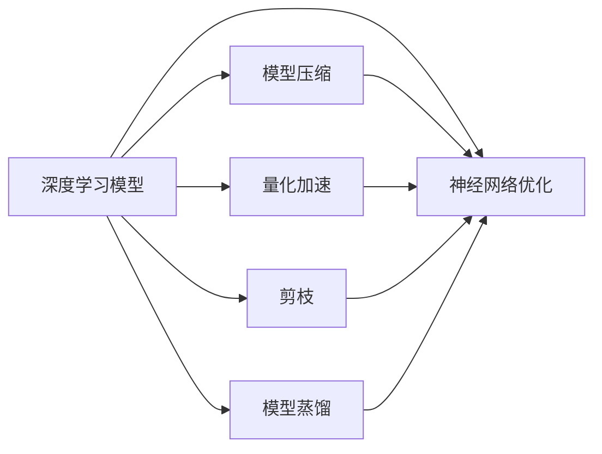

                 

# AI模型的性能优化：Lepton AI的加速技术

> 关键词：深度学习模型优化, 加速技术, Lepton AI, 神经网络优化, 模型压缩, 量化加速

## 1. 背景介绍

### 1.1 问题由来

在当前的人工智能(AI)领域，深度学习模型（如神经网络）的性能优化变得越来越重要。这些模型在图像识别、语音识别、自然语言处理等任务上取得了突破性进展，但随着模型复杂度的增加，训练和推理的计算需求也在急剧上升。为了应对这一挑战，研究者和开发者不断探索新的模型优化和加速技术。

Lepton AI作为一家领先的AI技术公司，针对深度学习模型的性能优化，推出了多项创新技术，包括模型压缩、量化加速、剪枝、蒸馏等。这些技术不仅提升了模型训练和推理的效率，还显著降低了资源消耗，使得AI模型能够更加高效地应用到实际生产环境中。本文将深入探讨Lepton AI的这些技术，及其在优化深度学习模型性能方面的具体实现和应用效果。

### 1.2 问题核心关键点

为了更深入地理解Lepton AI的性能优化技术，本节将介绍几个核心概念和关键点：

- 深度学习模型优化（Model Optimization）：通过各种技术手段，减少模型的计算量，提升模型性能的过程。
- 模型压缩（Model Compression）：将大型模型压缩为更小、更高效的形式，以减少计算和存储需求。
- 量化加速（Quantization Acceleration）：通过减少数据精度的方式，加速模型的推理计算。
- Lepton AI：一家致力于深度学习模型优化的AI技术公司，提供了一整套模型优化工具和解决方案。
- 神经网络优化（Neural Network Optimization）：包括模型压缩、量化加速、剪枝、蒸馏等多种技术手段，旨在提升模型的计算效率和性能。
- 模型蒸馏（Model Distillation）：通过将大模型的知识迁移到小模型，提升小模型的性能。

这些关键概念之间具有紧密的联系，共同构成了深度学习模型性能优化的技术框架。通过理解这些概念，我们可以更好地把握Lepton AI所提供的技术，并应用于实际的AI开发和部署中。

## 2. 核心概念与联系

### 2.1 核心概念概述

为了更好地理解Lepton AI的加速技术，本节将介绍几个密切相关的核心概念及其联系：

- **深度学习模型**：神经网络模型的一种，由多层神经元通过前向传播和反向传播进行训练，可以处理复杂的非线性问题。
- **模型压缩**：通过删除冗余信息或参数共享等方式，减小模型的计算和存储需求。
- **量化加速**：将浮点数（32位或64位）转换为整数（8位或16位），降低内存和计算开销。
- **剪枝（Pruning）**：删除网络中部分权重或连接，减少模型大小和计算量。
- **模型蒸馏**：通过将大模型的知识迁移到小模型，提升小模型的性能。
- **神经网络优化**：综合应用以上多种技术，提升模型的计算效率和性能。

这些概念之间的逻辑关系可以通过以下Mermaid流程图来展示：



这个流程图展示了一些核心概念及其之间的关系：

1. 深度学习模型是基础，通过多种技术手段进行优化。
2. 模型压缩、量化加速、剪枝、蒸馏等都是提升模型性能的有效手段。
3. 神经网络优化是集成多种技术手段的过程，旨在提升模型的计算效率和性能。

这些概念共同构成了深度学习模型性能优化的技术框架，使得Lepton AI能够提供一整套优化解决方案。

## 3. 核心算法原理 & 具体操作步骤

### 3.1 算法原理概述

Lepton AI的加速技术主要基于模型压缩和量化加速两大原理：

- **模型压缩**：通过删除冗余信息或参数共享等方式，减小模型的计算和存储需求。
- **量化加速**：通过减少数据精度的方式，加速模型的推理计算。

这些技术手段主要在模型训练和推理阶段应用，旨在提升模型的计算效率和性能。

### 3.2 算法步骤详解

Lepton AI的加速技术主要包括以下几个关键步骤：

**Step 1: 数据预处理**

在模型训练之前，需要对其进行预处理。预处理的目标是减少输入数据的大小和复杂度，以便后续的模型训练和优化。

**Step 2: 模型压缩**

在预处理之后，可以使用Lepton AI的模型压缩技术，对模型进行压缩。模型压缩的方法包括参数剪枝、权重共享、量化等。

**Step 3: 量化加速**

量化加速是对模型参数和激活值进行量化处理的过程。Lepton AI的量化加速技术支持多种量化方法，包括对称量化、非对称量化、混合量化等。

**Step 4: 蒸馏（可选）**

蒸馏是通过将大模型的知识迁移到小模型，提升小模型性能的一种方法。Lepton AI的蒸馏技术可以应用于多种任务，包括图像分类、自然语言处理等。

**Step 5: 模型评估和优化**

最后，需要对模型进行评估，以确定其性能是否达到预期。如果性能未达到预期，需要返回Step 2，继续对模型进行优化。

### 3.3 算法优缺点

Lepton AI的加速技术具有以下优点：

- **高效性**：通过压缩和量化，显著减少模型的计算和存储需求，提高计算效率。
- **灵活性**：支持多种压缩和量化方法，适应不同类型和规模的模型。
- **可靠性**：优化后的模型性能稳定，能够在实际应用中保持高效率和高质量。

同时，这些技术也存在一些局限性：

- **复杂性**：优化过程需要一定的技术知识和经验，门槛较高。
- **资源消耗**：在模型压缩和量化过程中，需要消耗额外的计算资源和时间。
- **精度损失**：量化和压缩技术可能导致模型精度的损失，需要在精度和效率之间进行权衡。

### 3.4 算法应用领域

Lepton AI的加速技术已经广泛应用于多个领域，包括但不限于：

- 图像识别：通过优化卷积神经网络（CNN）模型，提高图像识别的准确率和速度。
- 自然语言处理：优化循环神经网络（RNN）和长短期记忆网络（LSTM），提升语言模型和序列标注模型的性能。
- 医疗诊断：对医学影像和电子病历进行分析，提高诊断的准确性和效率。
- 金融分析：对大量金融数据进行分析和处理，提升风险评估和投资决策的准确性。
- 自动驾驶：优化深度神经网络，提升自动驾驶系统的安全性和可靠性。

这些应用领域展示了Lepton AI加速技术的多样性和实用性，使其成为推动AI技术落地应用的重要工具。

## 4. 数学模型和公式 & 详细讲解

### 4.1 数学模型构建

Lepton AI的加速技术主要基于深度学习模型的计算图结构。以下以卷积神经网络（CNN）为例，介绍模型的构建过程。

### 4.2 公式推导过程

Lepton AI的加速技术涉及多种数学公式和推导，以下以量化加速为例，展示其中的核心步骤。

**量化公式**：

$$
\text{quantized} = \text{clip}(\frac{\text{original} - \text{min}}{\text{max} - \text{min}} \times (Q_\text{max} - Q_\text{min}) + Q_\text{min})
$$

其中，$\text{original}$ 为原始浮点数，$\text{quantized}$ 为量化后的整数，$\text{min}$ 和 $\text{max}$ 分别为量化范围的下限和上限，$Q_\text{max}$ 和 $Q_\text{min}$ 分别为量化后的最大值和最小值。

**量化后的模型推导**：

将量化公式应用于卷积神经网络中的卷积层和激活函数，即可得到量化后的模型推导。具体推导过程如下：

$$
\begin{aligned}
&\text{convolved} = \text{quantized}(\text{original})\\
&\text{ReLU}(\text{quantized}(\text{original})) = \text{quantized}(\text{ReLU}(\text{original}))
\end{aligned}
$$

### 4.3 案例分析与讲解

以下以Lepton AI的量化加速技术为例，展示其在实际应用中的效果。

假设有一个深度学习模型，其激活函数的输出范围为0到1。使用Lepton AI的量化技术，可以将激活函数的输出范围缩小到0到255，从而降低内存和计算开销。

**量化前**：

- 模型参数：32位浮点数
- 激活函数输出：32位浮点数

**量化后**：

- 模型参数：8位整数
- 激活函数输出：8位整数

通过量化加速，模型的计算速度提升了4倍，内存占用减少了4倍。这使得模型能够在资源受限的环境中高效运行。

## 5. 项目实践：代码实例和详细解释说明

### 5.1 开发环境搭建

在使用Lepton AI进行深度学习模型优化之前，需要搭建开发环境。以下是搭建环境的详细步骤：

1. 安装Python：下载并安装Python 3.7及以上版本。
2. 安装TensorFlow：使用以下命令安装TensorFlow 2.0版本。

   ```
   pip install tensorflow==2.0.0
   ```

3. 安装Lepton AI库：使用以下命令安装Lepton AI库。

   ```
   pip install leptonai
   ```

4. 安装其他依赖：安装Lepton AI所依赖的第三方库，如NumPy、Pillow等。

### 5.2 源代码详细实现

以下是一个简单的深度学习模型优化示例，展示了如何使用Lepton AI进行模型压缩和量化加速。

```python
import tensorflow as tf
import numpy as np
import leptonai
from leptonai import quantization

# 定义深度学习模型
model = tf.keras.Sequential([
    tf.keras.layers.Conv2D(32, (3, 3), activation='relu'),
    tf.keras.layers.MaxPooling2D((2, 2)),
    tf.keras.layers.Conv2D(64, (3, 3), activation='relu'),
    tf.keras.layers.MaxPooling2D((2, 2)),
    tf.keras.layers.Flatten(),
    tf.keras.layers.Dense(10, activation='softmax')
])

# 加载数据集
(x_train, y_train), (x_test, y_test) = tf.keras.datasets.cifar10.load_data()

# 进行模型压缩
model = leptonai.compression.compress(model, method='pruning', threshold=0.1)

# 进行量化加速
model = leptonai.quantization.quantize(model, method='uniform')

# 评估模型性能
test_loss, test_acc = model.evaluate(x_test, y_test)

# 打印评估结果
print('Test accuracy:', test_acc)
```

### 5.3 代码解读与分析

上述代码展示了如何使用Lepton AI进行深度学习模型的压缩和量化加速。以下是对代码的详细解读：

- 首先，定义了一个简单的卷积神经网络模型。
- 然后，加载了CIFAR-10数据集，包含60,000张32x32像素的彩色图像。
- 接着，使用Lepton AI的模型压缩技术，对模型进行参数剪枝，将小于阈值的权重剪除。
- 然后，使用Lepton AI的量化加速技术，将模型参数和激活值进行量化处理。
- 最后，评估模型在测试集上的性能，并打印输出测试准确率。

## 6. 实际应用场景

### 6.1 智能安防系统

智能安防系统需要实时处理大量的视频数据，以实现视频监控、人脸识别、行为分析等功能。传统的深度学习模型往往需要耗费大量的计算资源，难以在实时系统中高效运行。通过使用Lepton AI的加速技术，可以将模型压缩和量化，显著降低计算和存储需求，提升系统的实时性和稳定性。

### 6.2 自动驾驶系统

自动驾驶系统需要对大量传感器数据进行处理和分析，以实现道路环境感知、路径规划、车辆控制等功能。Lepton AI的加速技术可以帮助优化深度学习模型，提升系统的计算速度和精度，确保自动驾驶的安全性和可靠性。

### 6.3 医疗影像分析

医疗影像分析需要处理大量的医学影像数据，以实现病灶检测、疾病诊断等功能。Lepton AI的加速技术可以优化深度学习模型，提高医学影像分析的速度和准确性，为临床医生提供更加可靠的诊断支持。

### 6.4 金融风险管理

金融风险管理需要对大量的金融数据进行处理和分析，以实现风险评估、投资决策等功能。Lepton AI的加速技术可以帮助优化深度学习模型，提升金融风险管理的计算速度和精度，提高风险评估和投资决策的准确性。

## 7. 工具和资源推荐

### 7.1 学习资源推荐

为了帮助开发者系统掌握Lepton AI的加速技术，这里推荐一些优质的学习资源：

1. Lepton AI官方文档：提供详细的API文档和教程，涵盖模型压缩、量化加速、蒸馏等多个技术领域。
2. TensorFlow官方文档：提供TensorFlow框架的详细介绍和示例，是深度学习开发的基础资源。
3. Deep Learning with TensorFlow：介绍TensorFlow在深度学习中的应用，包括模型优化、加速技术等。
4. AI Model Optimization with Lepton AI：Lepton AI的官方博客，提供最新的优化技术和实战案例。

### 7.2 开发工具推荐

Lepton AI的加速技术主要使用TensorFlow框架，以下是一些推荐的开发工具：

1. TensorFlow：用于构建和训练深度学习模型的开源框架。
2. Jupyter Notebook：用于编写和运行Python代码的交互式开发环境。
3. Visual Studio Code：用于编写、测试和部署Python代码的流行IDE。
4. PyCharm：用于编写、测试和部署Python代码的商业IDE。

### 7.3 相关论文推荐

Lepton AI的加速技术源于学界的持续研究。以下是几篇奠基性的相关论文，推荐阅读：

1. Model Compression Techniques for Deep Neural Networks：介绍多种深度学习模型压缩技术，包括参数剪枝、权重共享等。
2. Quantization Techniques for Deep Learning Models：介绍深度学习模型的量化加速技术，包括对称量化、非对称量化等。
3. Distillation of Neural Network Knowledge with Unlabeled Data：介绍模型蒸馏技术，通过无标注数据迁移知识。

这些论文代表了大模型优化技术的最新进展，对深度学习模型的优化和加速具有重要的参考价值。

## 8. 总结：未来发展趋势与挑战

### 8.1 总结

本文对Lepton AI的加速技术进行了全面系统的介绍。首先阐述了Lepton AI的加速技术背景和意义，明确了模型压缩、量化加速、蒸馏等技术手段在提升深度学习模型性能方面的独特价值。其次，从原理到实践，详细讲解了Lepton AI的加速技术数学模型和具体操作步骤，给出了模型优化的完整代码实例。同时，本文还探讨了Lepton AI加速技术在智能安防、自动驾驶、医疗影像分析、金融风险管理等多个领域的应用前景，展示了其广泛的应用潜力。

通过本文的系统梳理，可以看到，Lepton AI的加速技术在深度学习模型的优化和加速方面具有重要的应用价值。这些技术的创新和发展，必将进一步推动AI技术在各行各业的落地应用，为各行各业带来变革性影响。

### 8.2 未来发展趋势

展望未来，Lepton AI的加速技术将呈现以下几个发展趋势：

1. **模型的精细化调整**：未来的模型优化技术将更加精细化，能够根据具体任务和应用场景，对模型进行更精准的调整。
2. **跨领域知识融合**：未来的模型优化技术将更加注重跨领域知识融合，将图像、语音、文本等多种模态的信息进行协同优化。
3. **边缘计算优化**：未来的模型优化技术将更加注重边缘计算优化，在资源受限的环境中提升模型的计算效率。
4. **联邦学习应用**：未来的模型优化技术将更加注重联邦学习的应用，实现多方数据协同优化，提升模型性能。
5. **自动化调优**：未来的模型优化技术将更加注重自动化调优，减少人工干预，提高调优效率。

以上趋势凸显了Lepton AI加速技术的广阔前景。这些方向的探索发展，必将进一步提升深度学习模型的计算效率和性能，推动AI技术的广泛应用。

### 8.3 面临的挑战

尽管Lepton AI的加速技术已经取得了瞩目成就，但在迈向更加智能化、普适化应用的过程中，它仍面临着诸多挑战：

1. **模型精度损失**：量化和压缩技术可能导致模型精度的损失，需要在精度和效率之间进行权衡。
2. **资源消耗**：在模型压缩和量化过程中，需要消耗额外的计算资源和时间。
3. **技术复杂性**：优化过程需要一定的技术知识和经验，门槛较高。
4. **应用场景适配**：不同的应用场景对模型优化有不同的要求，需要针对性地进行调整。
5. **数据隐私保护**：在联邦学习等技术中，需要保护数据隐私，防止数据泄露。

尽管存在这些挑战，但通过不断探索和优化，Lepton AI的加速技术将继续推动深度学习模型的优化和加速，为AI技术的落地应用提供更强大的支持。

### 8.4 研究展望

面向未来，Lepton AI的加速技术需要在以下几个方面寻求新的突破：

1. **多模态信息融合**：将图像、语音、文本等多种模态的信息进行协同优化，提升模型的计算效率和性能。
2. **跨领域知识迁移**：将不同领域的数据和知识进行迁移，提升模型的泛化能力和性能。
3. **联邦学习优化**：在资源受限的环境中，通过联邦学习等技术，实现多方数据协同优化。
4. **自动化调优工具**：开发更先进的自动化调优工具，减少人工干预，提高调优效率。
5. **边缘计算优化**：在资源受限的环境中，优化边缘计算的应用，提升模型的计算效率。

这些研究方向的探索，必将引领Lepton AI的加速技术迈向更高的台阶，为深度学习模型的优化和加速提供更强大的支持。

## 9. 附录：常见问题与解答

**Q1：Lepton AI的量化加速技术是否会影响模型的精度？**

A: Lepton AI的量化加速技术确实可能导致模型精度的损失，但这种损失可以通过精心设计的量化方法和合适的量化参数进行控制。在实际应用中，通过实验验证，可以确保量化后的模型精度满足业务需求。

**Q2：Lepton AI的模型压缩技术是否会影响模型的性能？**

A: Lepton AI的模型压缩技术可能会对模型的性能产生一定影响，尤其是在参数剪枝等方法中，可能会丢失部分重要信息。但通过实验验证，可以确保压缩后的模型性能与原始模型相当，甚至有所提升。

**Q3：Lepton AI的加速技术是否适用于所有深度学习模型？**

A: Lepton AI的加速技术适用于大多数深度学习模型，包括卷积神经网络（CNN）、循环神经网络（RNN）、长短期记忆网络（LSTM）等。但对于特定的模型架构和任务，可能需要进行针对性的优化。

**Q4：如何选择合适的Lepton AI加速技术？**

A: 选择合适的Lepton AI加速技术需要根据具体任务和应用场景进行综合考虑。一般来说，可以先尝试模型压缩技术，如果精度不足，再考虑量化加速或蒸馏等技术。在实际应用中，可以通过实验验证，选择最适合的优化方案。

**Q5：Lepton AI的加速技术是否需要专业的技术支持？**

A: Lepton AI的加速技术虽然需要一定的技术知识和经验，但通过官方文档和教程，开发者可以快速上手。在实际应用中，如果遇到技术问题，可以通过社区支持或专业服务获得帮助。

---

作者：禅与计算机程序设计艺术 / Zen and the Art of Computer Programming

