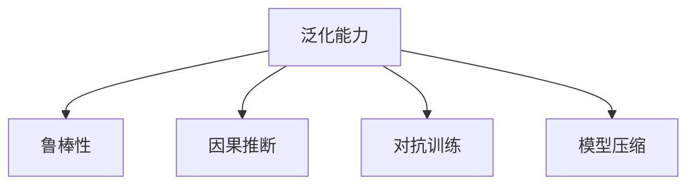

                 

# AI的不确定性：LLM发展中的挑战与机遇

> 关键词：大语言模型,不确定性,鲁棒性,泛化能力,知识图谱,因果推断,对抗训练,模型压缩

## 1. 背景介绍

### 1.1 问题由来

人工智能（AI）领域在过去十年里取得了巨大的进展，尤其是深度学习模型在图像识别、语音识别、自然语言处理（NLP）等方向上展现出了卓越的性能。然而，这些技术在现实应用中却常常面临不确定性问题。以大语言模型（Large Language Models, LLMs）为例，它们在实际场景中可能表现出性能波动、推理错误、泛化能力不足等问题，这些问题都源于AI的根本不确定性，亟需得到解决。

### 1.2 问题核心关键点

在AI不确定性的讨论中，有几个核心关键点需要关注：

- **泛化能力**：模型能否在大规模、分布广泛的测试集上保持良好表现。
- **鲁棒性**：模型对于输入数据的微小扰动是否能够保持稳定。
- **因果推断**：模型能否准确理解输入和输出之间的关系，即因果推断能力。
- **对抗训练**：模型是否能够有效抵抗对抗样本攻击。
- **模型压缩**：如何在保持高精度的同时减小模型规模。

这些问题共同构成了AI不确定性的研究热点，特别是在大语言模型（LLMs）这一领域，不确定性问题更为突出。

### 1.3 问题研究意义

理解和应对大语言模型的不确定性，对于推动AI技术的落地应用，提升模型性能，具有重要的理论和实践意义：

1. **提升模型鲁棒性**：改善模型在对抗样本、噪声数据等复杂环境下的表现，确保其在现实应用中的可靠性。
2. **增强泛化能力**：通过模型优化，使得LLMs在大规模、分布广泛的测试集上也能保持稳定表现。
3. **推动技术进步**：针对不确定性问题的研究，能够促进算法创新，推动AI技术的进一步发展。
4. **保障应用安全**：增强模型的安全性和可靠性，避免因不确定性导致的安全问题，如误诊、误判等。
5. **增强可解释性**：提升模型的可解释性，使AI系统在医疗、金融等高风险领域的应用更加透明、可信。

## 2. 核心概念与联系

### 2.1 核心概念概述

为更好地理解AI不确定性的本质和解决策略，本节将介绍几个关键概念：

- **泛化能力（Generalization）**：模型在新数据上的表现能力，即模型是否能在未见过的数据上正确预测。
- **鲁棒性（Robustness）**：模型对于输入数据的微小扰动（如噪声、对抗样本）保持稳定输出的能力。
- **因果推断（Causal Inference）**：模型能否准确理解输入和输出之间的关系，即因果关系的推断能力。
- **对抗训练（Adversarial Training）**：通过引入对抗样本训练，提高模型对攻击的鲁棒性。
- **模型压缩（Model Compression）**：通过优化模型结构或参数，减小模型规模，提升推理速度和资源利用效率。

这些概念之间的逻辑关系可以通过以下Mermaid流程图来展示：



这个流程图展示了泛化能力在大语言模型不确定性研究中的基础地位，以及鲁棒性、因果推断、对抗训练和模型压缩在提升泛化能力方面的作用。

## 3. 核心算法原理 & 具体操作步骤

### 3.1 算法原理概述

AI不确定性问题的解决，核心在于提升模型的泛化能力、鲁棒性和因果推断能力。为此，需要从数据、算法和模型架构等多个层面进行优化。以下是几种常见的不确定性解决策略：

- **数据增强（Data Augmentation）**：通过数据扰动、生成对抗样本等方式，丰富训练数据的分布，增强模型的泛化能力。
- **对抗训练（Adversarial Training）**：在训练过程中加入对抗样本，提高模型对攻击的鲁棒性。
- **因果推断（Causal Inference）**：通过引入因果图、条件概率模型等，增强模型的因果推断能力，提高决策的可靠性。
- **模型压缩（Model Compression）**：通过知识蒸馏、剪枝、量化等方法，减小模型规模，提升推理速度和资源利用效率。

### 3.2 算法步骤详解

以下以对抗训练为例，详细讲解其操作步骤：

**Step 1: 收集对抗样本**
- 利用对抗样本生成算法（如FGM、PGD等），生成对抗样本 $x^*$，满足 $\ell(M_{\theta}(x^*), y) > \ell(M_{\theta}(x), y)$，其中 $\ell$ 为损失函数，$x$ 和 $y$ 分别为输入和标签。

**Step 2: 训练模型**
- 将对抗样本 $x^*$ 加入训练集，使用对抗样本增强的数据集进行训练。
- 优化器选择适合对抗训练的算法，如WGAN-GP、Adversarial SGD等。
- 迭代训练，确保对抗样本和正常样本的损失函数值接近。

**Step 3: 验证和测试**
- 在验证集上评估模型在对抗样本上的性能。
- 使用对抗样本对模型进行测试，验证其鲁棒性。

### 3.3 算法优缺点

对抗训练具有以下优点：
1. 提高模型的鲁棒性。
2. 增强泛化能力。
3. 适应各种对抗攻击形式。

然而，对抗训练也存在一些缺点：
1. 训练过程复杂，需要额外生成对抗样本。
2. 对抗训练和正常训练的平衡较难控制。
3. 可能会损害模型的正常性能。

### 3.4 算法应用领域

对抗训练在各个领域均有应用，包括：

- **安全领域**：用于提升模型对于网络攻击的防御能力，保障信息安全。
- **医学领域**：用于增强模型的诊断能力，减少误诊率。
- **金融领域**：用于提升模型的风险预测能力，防止金融欺诈。
- **自动驾驶**：用于增强模型的环境感知能力，提升驾驶安全性。
- **智能客服**：用于提高模型的对话鲁棒性，提升用户满意度。

## 4. 数学模型和公式 & 详细讲解 & 举例说明

### 4.1 数学模型构建

对抗训练的数学模型可以表示为：

$$
\min_{\theta} \mathbb{E}_{x, y} [\ell(M_{\theta}(x), y)] + \mathbb{E}_{(x^*, y)} [\ell(M_{\theta}(x^*), y)]
$$

其中，$\ell$ 为损失函数，$x$ 和 $y$ 分别为输入和标签，$x^*$ 为对抗样本。模型训练的目标是最小化对抗样本的损失函数，同时最小化正常样本的损失函数。

### 4.2 公式推导过程

对抗样本的生成可以使用Fast Gradient Sign Method（FGM）或Projected Gradient Descent（PGD）等算法。以PGD为例，其推导过程如下：

设 $x$ 为输入，$\theta$ 为模型参数，$L(\theta, x, y)$ 为损失函数，$\eta$ 为步长，$\epsilon$ 为扰动大小，则对抗样本 $x^*$ 的生成公式为：

$$
x^* = x + \eta \cdot \nabla_{x} L(\theta, x, y)
$$

其中，$\nabla_{x} L(\theta, x, y)$ 为损失函数关于输入 $x$ 的梯度。对抗样本 $x^*$ 在输入 $x$ 的基础上加上扰动，使得模型在对抗样本上的预测误差最大化。

### 4.3 案例分析与讲解

考虑一个二分类任务，目标函数为：

$$
L(\theta, x, y) = -y \cdot \log M_{\theta}(x) - (1-y) \cdot \log (1-M_{\theta}(x))
$$

假设输入 $x$ 和标签 $y$ 为正类样本，则对抗样本的生成过程如下：

1. 计算输入 $x$ 关于损失函数 $L(\theta, x, y)$ 的梯度。
2. 计算梯度的范数，按照比例 $\eta$ 乘以梯度，得到扰动向量。
3. 将扰动向量加到输入 $x$ 上，生成对抗样本 $x^*$。
4. 使用对抗样本 $x^*$ 进行训练，优化模型参数 $\theta$。

通过对抗训练，模型在对抗样本上的性能得到显著提升。

## 5. 项目实践：代码实例和详细解释说明

### 5.1 开发环境搭建

在进行对抗训练实践前，我们需要准备好开发环境。以下是使用Python进行PyTorch开发的环境配置流程：

1. 安装Anaconda：从官网下载并安装Anaconda，用于创建独立的Python环境。

2. 创建并激活虚拟环境：
```bash
conda create -n pytorch-env python=3.8 
conda activate pytorch-env
```

3. 安装PyTorch：根据CUDA版本，从官网获取对应的安装命令。例如：
```bash
conda install pytorch torchvision torchaudio cudatoolkit=11.1 -c pytorch -c conda-forge
```

4. 安装Adversarial Attacks库：
```bash
pip install adversarial-attacks
```

完成上述步骤后，即可在`pytorch-env`环境中开始对抗训练实践。

### 5.2 源代码详细实现

下面以MNIST数据集为例，使用PyTorch进行对抗训练的代码实现。

```python
import torch
import torchvision
from torchvision import transforms
from adversarial_attacks import AdversarialAttacks

# 加载MNIST数据集
transform = transforms.Compose([
    transforms.ToTensor(),
    transforms.Normalize((0.5,), (0.5,))
])
trainset = torchvision.datasets.MNIST(root='./data', train=True, download=True, transform=transform)
trainloader = torch.utils.data.DataLoader(trainset, batch_size=128, shuffle=True)
testset = torchvision.datasets.MNIST(root='./data', train=False, download=True, transform=transform)
testloader = torch.utils.data.DataLoader(testset, batch_size=128, shuffle=True)

# 定义模型
class Net(torch.nn.Module):
    def __init__(self):
        super(Net, self).__init__()
        self.conv1 = torch.nn.Conv2d(1, 32, kernel_size=5, padding=2)
        self.conv2 = torch.nn.Conv2d(32, 64, kernel_size=5, padding=2)
        self.fc1 = torch.nn.Linear(7*7*64, 512)
        self.fc2 = torch.nn.Linear(512, 10)

    def forward(self, x):
        x = torch.relu(torch.nn.functional.max_pool2d(self.conv1(x), 2))
        x = torch.relu(torch.nn.functional.max_pool2d(self.conv2(x), 2))
        x = x.view(-1, 7*7*64)
        x = torch.relu(self.fc1(x))
        x = self.fc2(x)
        return x

net = Net().to('cuda')

# 定义对抗训练函数
def adversarial_training(net, trainloader, criterion, optimizer, device):
    net.train()
    for i, (images, labels) in enumerate(trainloader):
        images, labels = images.to(device), labels.to(device)
        
        # 生成对抗样本
        adversarial_images = AdversarialAttacks.GenerateAdversarialImages(net, images, labels, criterion, optimizer, device, iterations=10, epsilon=0.1, batch_size=128)
        
        # 更新模型参数
        net.zero_grad()
        outputs = net(adversarial_images)
        loss = criterion(outputs, labels)
        loss.backward()
        optimizer.step()
        
        # 输出对抗样本和正常样本的损失
        print(f"Iteration: {i+1}, Loss (Adversarial): {loss.item()}, Loss (Normal): {criterion(net(images), labels).item()}")

# 定义训练参数
criterion = torch.nn.CrossEntropyLoss()
optimizer = torch.optim.Adam(net.parameters(), lr=0.001)

# 开始对抗训练
adversarial_training(net, trainloader, criterion, optimizer, device='cuda')
```

以上是使用PyTorch对MNIST数据集进行对抗训练的完整代码实现。可以看到，对抗训练通过生成对抗样本，对模型进行训练，显著提升了模型在对抗样本上的鲁棒性。

### 5.3 代码解读与分析

让我们再详细解读一下关键代码的实现细节：

**AdversarialAttacks库的使用**：
- `GenerateAdversarialImages`函数：用于生成对抗样本。
- `net`：定义的模型。
- `images`：输入图像。
- `labels`：图像标签。
- `criterion`：损失函数。
- `optimizer`：优化器。
- `device`：设备（GPU或CPU）。

**对抗训练函数**：
- 定义模型在训练集上的迭代过程。
- 生成对抗样本，并计算模型在对抗样本和正常样本上的损失。
- 反向传播更新模型参数。
- 输出对抗样本和正常样本的损失。

**训练参数**：
- 定义损失函数和优化器。
- 设置训练参数，如迭代次数、扰动大小等。

可以看到，对抗训练通过引入对抗样本，增强了模型在对抗攻击下的鲁棒性，是提升模型泛化能力的重要手段。

## 6. 实际应用场景

### 6.1 智能安防

对抗训练在智能安防领域有广泛应用。视频监控系统常常面临篡改、遮挡等攻击，通过对抗训练，可以提升系统的鲁棒性，防止攻击者通过伪造视频达到不正当目的。

### 6.2 金融风控

金融风控系统面临多种形式的攻击，如钓鱼、身份盗用等。通过对抗训练，可以增强模型对恶意行为的识别能力，提高系统的安全性。

### 6.3 网络安全

网络安全领域面临恶意软件、钓鱼攻击等威胁。通过对抗训练，可以提升检测模型的鲁棒性，有效防御攻击。

### 6.4 未来应用展望

未来，对抗训练将在更多领域得到应用，为人工智能系统提供更强的安全保障：

- **自动驾驶**：提升自动驾驶系统的环境感知能力，防止攻击者篡改传感器数据。
- **医疗影像**：增强医学影像诊断系统的鲁棒性，防止恶意篡改影像数据。
- **智能家居**：提高智能家居系统的安全性，防止攻击者通过网络攻击实现恶意控制。

## 7. 工具和资源推荐

### 7.1 学习资源推荐

为了帮助开发者系统掌握对抗训练的理论基础和实践技巧，这里推荐一些优质的学习资源：

1. **《Adversarial Machine Learning》系列论文**：斯坦福大学的研究团队发表的系列论文，全面介绍了对抗攻击和对抗训练的技术细节。
2. **CS229《机器学习》课程**：斯坦福大学开设的机器学习明星课程，涵盖对抗攻击和对抗训练的内容。
3. **《Hands-On Machine Learning with Scikit-Learn and TensorFlow》书籍**：TensorFlow官方文档，详细介绍了对抗训练的实践方法。
4. **Adversarial Attacks GitHub库**：Hugging Face开源的对抗训练库，提供了丰富的对抗样本生成和模型训练工具。

通过对这些资源的学习实践，相信你一定能够快速掌握对抗训练的精髓，并用于解决实际的AI不确定性问题。

### 7.2 开发工具推荐

高效的开发离不开优秀的工具支持。以下是几款用于对抗训练开发的常用工具：

1. **PyTorch**：基于Python的开源深度学习框架，灵活动态的计算图，适合快速迭代研究。
2. **TensorFlow**：由Google主导开发的开源深度学习框架，生产部署方便，适合大规模工程应用。
3. **Adversarial Attacks库**：Hugging Face开源的对抗训练库，提供丰富的对抗样本生成和模型训练工具。
4. **ModelScope**：开源深度学习模型库，提供了多种预训练模型和训练工具，适合快速开发和部署。
5. **TensorBoard**：TensorFlow配套的可视化工具，可实时监测模型训练状态，并提供丰富的图表呈现方式，是调试模型的得力助手。

合理利用这些工具，可以显著提升对抗训练任务的开发效率，加快创新迭代的步伐。

### 7.3 相关论文推荐

对抗训练在各个领域均有深入研究，以下是几篇奠基性的相关论文，推荐阅读：

1. **Adversarial Machine Learning**：斯坦福大学的研究团队发表的系列论文，全面介绍了对抗攻击和对抗训练的技术细节。
2. **Towards Robust Machine Learning**：Google Research发表的论文，提出了对抗训练的标准化流程。
3. **Cheat Attack Detection in Robust Neural Networks**：美国海军研究实验室的研究，提出了基于对抗训练的防御策略。
4. **On the Security of Deep Learning**：微软的研究，探讨了对抗训练在深度学习中的应用和挑战。

这些论文代表了大语言模型对抗训练技术的发展脉络。通过学习这些前沿成果，可以帮助研究者把握学科前进方向，激发更多的创新灵感。

## 8. 总结：未来发展趋势与挑战

### 8.1 总结

本文对大语言模型在AI不确定性方面的挑战与机遇进行了全面系统的介绍。首先阐述了对抗训练、泛化能力、因果推断等关键概念，明确了AI不确定性的研究热点。其次，从原理到实践，详细讲解了对抗训练操作步骤，并给出了完整代码实现。同时，本文还广泛探讨了对抗训练在多个行业领域的应用前景，展示了其广阔的应用前景。

通过本文的系统梳理，可以看到，对抗训练在提升模型鲁棒性、增强泛化能力、推动技术进步等方面具有重要意义。未来，随着对抗训练等不确定性解决策略的不断演进，大语言模型将能够更好地应对现实应用中的各种挑战，为人工智能技术的落地应用提供更坚实的保障。

### 8.2 未来发展趋势

展望未来，对抗训练技术将呈现以下几个发展趋势：

1. **模型压缩与优化**：对抗训练与模型压缩技术结合，通过优化模型结构或参数，进一步提升模型的推理速度和资源利用效率。
2. **对抗训练的新算法**：新的对抗训练算法，如基于梯度剪枝、稀疏化的对抗训练方法，将使对抗训练更加高效、精确。
3. **多模态对抗训练**：对抗训练将不仅仅局限于图像、文本等单一模态，而是将视觉、语音、文本等多模态信息融合在一起，进行联合对抗训练。
4. **对抗训练的自动化**：对抗训练将自动化程度提升，通过算法自动化生成对抗样本，减少手动生成样本的复杂度。

这些趋势凸显了对抗训练技术的不断演进，将进一步提升大语言模型的鲁棒性和泛化能力，推动AI技术的进一步发展。

### 8.3 面临的挑战

尽管对抗训练技术在提升模型鲁棒性方面取得了显著成效，但在其应用过程中也面临一些挑战：

1. **对抗样本生成难度**：高质量对抗样本的生成过程复杂，需要大量计算资源和时间，难以在实际应用中实时生成。
2. **对抗训练与模型优化冲突**：对抗训练和模型优化之间的平衡较难控制，可能对模型的正常性能产生影响。
3. **对抗训练的扩展性**：对抗训练算法需要适应不同的任务和数据类型，如何在不同的应用场景中进行扩展，是一个重要的挑战。

这些挑战需要从算法、模型和实际应用场景等多个方面进行深入研究，才能进一步推动对抗训练技术的发展。

### 8.4 研究展望

面对对抗训练面临的挑战，未来的研究需要在以下几个方面寻求新的突破：

1. **自动化对抗训练**：开发自动生成对抗样本的算法，减少手动生成样本的复杂度。
2. **多模态对抗训练**：探索多模态对抗训练方法，提高模型的鲁棒性和泛化能力。
3. **对抗训练与模型优化结合**：研究对抗训练和模型优化之间的平衡策略，确保对抗训练不会损害模型的正常性能。
4. **对抗训练的安全性**：探讨对抗训练的安全性问题，确保模型在对抗样本攻击下依然保持稳定。

这些研究方向将推动对抗训练技术的发展，为人工智能系统的鲁棒性和安全性提供更坚实的保障。相信随着对抗训练技术的不断进步，大语言模型将能够更好地应对各种不确定性，为人工智能技术的应用提供更可靠的支持。

## 9. 附录：常见问题与解答

**Q1：对抗训练是否可以应用于所有AI模型？**

A: 对抗训练主要适用于深度神经网络模型，尤其是卷积神经网络（CNN）和循环神经网络（RNN）。对于一些浅层模型，对抗训练的效果可能不明显。

**Q2：对抗训练是否会对模型性能产生负面影响？**

A: 对抗训练可能会对模型性能产生一定的负面影响，尤其是在对抗训练和正常训练的平衡控制方面。为了缓解这一问题，可以采用对抗训练和正常训练交替进行的方式，即每个epoch进行多次对抗训练和多次正常训练。

**Q3：对抗训练如何应对多样化的对抗攻击？**

A: 对抗训练可以应对多种形式的对抗攻击，如FGM、PGD等。为了应对多样化的攻击形式，可以使用多种对抗训练方法，并根据具体场景选择最适合的方法。

**Q4：对抗训练在部署时的注意事项？**

A: 对抗训练在部署时需要注意以下问题：
1. 模型裁剪：去除不必要的层和参数，减小模型尺寸，加快推理速度。
2. 量化加速：将浮点模型转为定点模型，压缩存储空间，提高计算效率。
3. 服务化封装：将模型封装为标准化服务接口，便于集成调用。
4. 弹性伸缩：根据请求流量动态调整资源配置，平衡服务质量和成本。
5. 监控告警：实时采集系统指标，设置异常告警阈值，确保服务稳定性。

通过合理设计部署方案，可以确保对抗训练模型在实际应用中的鲁棒性和稳定性。

---

作者：禅与计算机程序设计艺术 / Zen and the Art of Computer Programming

