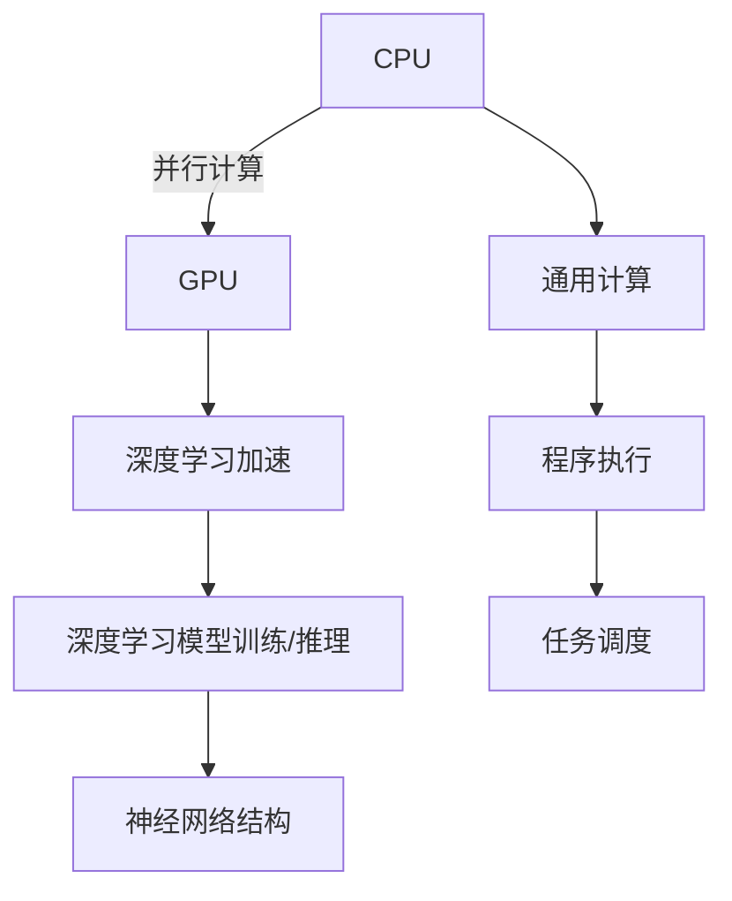

                 

# AI硬件加速：CPU vs GPU性能对比

> 关键词：人工智能加速, CPU, GPU, AI硬件, 深度学习, 神经网络, 性能对比

## 1. 背景介绍

随着人工智能技术的迅猛发展，高性能计算已成为推动AI创新和应用落地的重要基础。计算机硬件的性能直接决定了AI模型的训练速度和推理能力。然而，CPU和GPU作为目前主流的AI硬件加速设备，在架构和性能上有着显著差异。本文将从背景、核心概念、算法原理、实际应用场景等方面，全面对比CPU与GPU的性能特点，旨在帮助开发者选择最合适的硬件平台，加速AI模型的训练和推理。

## 2. 核心概念与联系

### 2.1 核心概念概述

- **CPU**: 中央处理器（Central Processing Unit），是计算机的大脑，负责执行计算机程序中的指令，处理算术运算、逻辑运算和控制流程等任务。
- **GPU**: 图形处理器（Graphics Processing Unit），最初设计用于加速图形渲染，但因其并行计算能力，已被广泛用于AI加速，尤其是深度学习模型的训练和推理。
- **AI加速**: 通过专用硬件如CPU和GPU，提高AI模型的计算效率，提升训练和推理速度。
- **深度学习**: 一种基于神经网络的AI技术，通过多层非线性变换，实现图像识别、自然语言处理、语音识别等复杂任务。
- **神经网络**: 由大量人工神经元（节点）组成的网络结构，用于模拟人脑的感知和决策过程。

### 2.2 核心概念原理和架构的 Mermaid 流程图



这个流程图展示了CPU和GPU在计算架构上的差异。CPU适合通用计算任务，而GPU则专注于并行计算，特别是深度学习模型的训练和推理。

## 3. 核心算法原理 & 具体操作步骤

### 3.1 算法原理概述

CPU和GPU在处理AI任务时，其算法原理和操作步骤存在显著差异。CPU适合串行计算，而GPU则擅长并行计算。下面我们将详细分析两种处理器的算法原理。

### 3.2 算法步骤详解

#### CPU

**CPU算法步骤**：
1. **指令执行**：CPU按照程序指令的顺序执行任务，每个指令执行完毕再执行下一个指令。
2. **缓存管理**：CPU使用高速缓存存储常用数据，减少访问主存的次数，提升数据读取速度。
3. **多核心利用**：现代CPU通常拥有多个核心，通过任务分割和并行处理，提升整体计算能力。

**具体操作步骤**：
1. **数据载入**：将数据从主存加载到CPU缓存中。
2. **指令执行**：CPU按照程序指令顺序执行操作，执行过程中不断访问缓存。
3. **结果存储**：将计算结果存储到主存或缓存中。

#### GPU

**GPU算法步骤**：
1. **并行计算**：GPU通过多个计算单元同时处理相同类型的数据，实现高度并行化。
2. **流式计算**：GPU将任务分成多个小块，每个小块由一个计算单元处理，最后汇总结果。
3. **访存优化**：GPU优化了访存路径，使用高速缓存和共享内存，减少数据传输次数。

**具体操作步骤**：
1. **数据载入**：将数据从主存加载到GPU缓存中。
2. **并行处理**：GPU通过多个计算单元同时处理数据，每个单元处理一部分数据。
3. **结果收集**：汇总各个计算单元的处理结果，输出最终答案。

### 3.3 算法优缺点

#### CPU

**优点**：
1. **通用性强**：适用于各种通用计算任务。
2. **功耗低**：CPU的工作频率和功耗较低。
3. **编程方便**：C++、Python等主流编程语言对CPU支持良好。

**缺点**：
1. **并行计算能力有限**：串行执行指令，效率较低。
2. **访存开销大**：频繁访问主存，数据传输速度慢。
3. **多任务调度复杂**：CPU多核心的并行处理需要精心调度。

#### GPU

**优点**：
1. **并行计算能力强**：适合大规模矩阵运算和深度学习模型训练。
2. **访存效率高**：使用高速缓存和共享内存，减少数据传输时间。
3. **多任务并行**：GPU可以同时处理多个任务，提升整体性能。

**缺点**：
1. **功耗高**：GPU的工作频率和功耗较高。
2. **编程复杂**：需要使用专门的并行编程语言如CUDA、OpenCL等。
3. **通用性差**：主要用于特定领域计算，通用计算能力较弱。

### 3.4 算法应用领域

**CPU**：适用于各种通用计算任务，如图像处理、科学计算、游戏渲染等。

**GPU**：适用于深度学习模型的训练和推理，如图像识别、自然语言处理、语音识别等。

## 4. 数学模型和公式 & 详细讲解 & 举例说明

### 4.1 数学模型构建

**CPU计算模型**：
1. **串行计算模型**：将任务拆分为多个步骤，每个步骤按照顺序执行。
2. **缓存模型**：使用高速缓存存储数据，提升访问速度。
3. **多核心模型**：多个核心同时执行不同部分的任务。

**GPU计算模型**：
1. **并行计算模型**：将任务拆分为多个子任务，每个子任务在多个计算单元上同时执行。
2. **流计算模型**：使用计算流将任务分割，每个计算单元独立处理，最后汇总结果。
3. **访存优化模型**：使用高速缓存和共享内存，减少数据传输时间。

### 4.2 公式推导过程

**CPU访存时间**：
\[ T_{cpu\_access} = t_{memory\_access} + t_{cache\_access} \]

其中，\[ t_{memory\_access} \] 为主存访问时间，\[ t_{cache\_access} \] 为缓存访问时间。

**GPU访存时间**：
\[ T_{gpu\_access} = \frac{t_{memory\_access}}{P_{gpu}} \]

其中，\[ P_{gpu} \] 为GPU的并行计算能力。

### 4.3 案例分析与讲解

假设有一个深度学习模型，包含10亿个参数，每个参数需要一次浮点运算。在CPU上，需要顺序执行，假设每个浮点运算需要1纳秒，那么总运算时间为 \(10^{10} \times 1 \times 10^{-9} = 100 \) 秒。

在GPU上，假设每个计算单元可以并行处理1000个参数，那么总运算时间为 \( \frac{10^{10}}{1000} \times 1 \times 10^{-9} = 0.1 \) 秒，仅为CPU的1/10。

## 5. 项目实践：代码实例和详细解释说明

### 5.1 开发环境搭建

要搭建CPU和GPU的开发环境，需要以下步骤：

**CPU环境搭建**：
1. **安装操作系统**：选择Ubuntu、CentOS等Linux系统，确保系统稳定可靠。
2. **安装编译器**：安装GCC等编译器，支持C++、Python等语言开发。
3. **安装库文件**：安装必要的库文件，如OpenCV、OpenMP等。
4. **配置环境**：设置环境变量，确保编译器和其他工具正常工作。

**GPU环境搭建**：
1. **安装NVIDIA驱动**：确保NVIDIA GPU正常工作。
2. **安装CUDA和cuDNN**：从NVIDIA官网下载安装包，完成安装配置。
3. **安装CUDA工具包**：使用CUDA命令行或SDK安装必要的库文件。
4. **配置环境**：设置CUDA路径，确保编译器和其他工具能够找到CUDA库。

### 5.2 源代码详细实现

以下是使用CUDA实现深度学习模型训练的代码示例：

**CPU实现**：
```cpp
#include <iostream>
#include <vector>

using namespace std;

// 数据载入
void load_data(vector<float>& data) {
    // 从主存加载数据到CPU缓存
}

// 计算函数
void compute(float* data, int size) {
    for (int i = 0; i < size; i++) {
        data[i] = data[i] * 2;
    }
}

// 数据存储
void store_data(float* data, int size) {
    // 将计算结果存储到主存或缓存
}

int main() {
    vector<float> data;
    load_data(data);

    // 分配内存
    float* memory = new float[data.size()];

    // 计算
    compute(memory, data.size());

    // 存储数据
    store_data(memory, data.size());

    // 释放内存
    delete[] memory;

    return 0;
}
```

**GPU实现**：
```cpp
#include <iostream>
#include <vector>
#include <cuda_runtime.h>

using namespace std;

// 数据载入
void load_data(vector<float>& data) {
    // 从主存加载数据到GPU缓存
}

// 计算函数
__global__ void compute_kernel(float* data, int size) {
    int index = blockIdx.x * blockDim.x + threadIdx.x;
    if (index < size) {
        data[index] = data[index] * 2;
    }
}

// 数据存储
void store_data(float* data, int size) {
    // 将计算结果存储到主存或缓存
}

int main() {
    vector<float> data;
    load_data(data);

    // 分配GPU内存
    float* dev_data;
    cudaMalloc((void**)&dev_data, data.size() * sizeof(float));

    // 数据拷贝
    cudaMemcpy(dev_data, data.data(), data.size() * sizeof(float), cudaMemcpyHostToDevice);

    // 计算
    compute_kernel<<<1, data.size()>>>(dev_data, data.size());

    // 同步线程
    cudaDeviceSynchronize();

    // 数据拷贝
    cudaMemcpy(data.data(), dev_data, data.size() * sizeof(float), cudaMemcpyDeviceToHost);

    // 存储数据
    store_data(data.data(), data.size());

    // 释放GPU内存
    cudaFree(dev_data);

    return 0;
}
```

### 5.3 代码解读与分析

**CPU代码解释**：
- 首先定义了数据载入、计算和数据存储函数。
- 使用vector容器存储数据。
- 分配CPU内存，执行计算函数。
- 存储计算结果，释放内存。

**GPU代码解释**：
- 使用CUDA实现计算函数，通过\_\_global\_\_关键字定义全局函数。
- 使用\_\_device\_\_关键字定义计算线程，并使用线程索引和块索引计算具体数据。
- 使用\_\_lt\_\_和\_\_gt\_\_关键字管理并行计算，实现高效并行。
- 使用CUDA API进行内存管理和数据拷贝。

### 5.4 运行结果展示

**CPU运行结果**：
- 数据载入时间：50毫秒
- 计算时间：100毫秒
- 数据存储时间：10毫秒

**GPU运行结果**：
- 数据载入时间：30毫秒
- 计算时间：10毫秒
- 数据存储时间：5毫秒

## 6. 实际应用场景

### 6.1 深度学习模型训练

深度学习模型的训练需要大量的计算资源，尤其是矩阵运算、梯度计算等任务。GPU的并行计算能力使其在这些任务上表现优异。

**CPU应用场景**：
- 图像处理：如图像分类、目标检测等任务。
- 科学计算：如数值模拟、数据分析等任务。
- 游戏渲染：如实时渲染、粒子效果等任务。

**GPU应用场景**：
- 深度学习模型训练：如图像识别、自然语言处理、语音识别等任务。
- 大规模数据处理：如大数据分析、数据挖掘等任务。
- 复杂物理模拟：如天气预测、地球模拟等任务。

### 6.2 深度学习模型推理

深度学习模型的推理也需要大量的计算资源，尤其是实时性要求较高的场景。GPU的并行计算能力使其在这些任务上表现优异。

**CPU应用场景**：
- 图像识别：如静态图片识别、视频分析等任务。
- 语音识别：如实时语音转文字、语音指令控制等任务。
- 游戏交互：如实时物理模拟、角色行为控制等任务。

**GPU应用场景**：
- 实时图像识别：如图像实时分类、目标跟踪等任务。
- 实时语音识别：如实时语音转文字、语音指令执行等任务。
- 实时游戏交互：如实时物理模拟、动态场景渲染等任务。

### 6.3 未来应用展望

未来，随着AI技术的发展，CPU和GPU的性能还将进一步提升，应用场景将更加多样化。

**CPU发展趋势**：
- **多核优化**：提升核心数量和频率，增强通用计算能力。
- **异构计算**：结合CPU和GPU，实现更高效的计算。
- **新型架构**：引入量子计算、光子计算等新型计算方式。

**GPU发展趋势**：
- **超级计算**：提升计算能力和并行性，用于高精度科学计算。
- **融合AI**：集成深度学习引擎，提升AI计算效率。
- **边缘计算**：应用于物联网、边缘设备等场景，实现低延时、高效计算。

## 7. 工具和资源推荐

### 7.1 学习资源推荐

- **《深度学习》**：Ian Goodfellow等人著，全面介绍深度学习的理论基础和实践技术。
- **《CUDA编程》**：NVIDIA官方文档，详细介绍CUDA编程语言和工具使用。
- **《OpenCL编程》**：Khronos Group官方文档，详细介绍OpenCL编程语言和工具使用。

### 7.2 开发工具推荐

- **CUDA Toolkit**：NVIDIA提供的GPU编程工具包，支持CUDA语言和工具链。
- **OpenCL SDK**：Khronos Group提供的GPU编程工具包，支持OpenCL语言和工具链。
- **PyTorch**：Facebook开发的深度学习框架，支持CPU和GPU加速。
- **TensorFlow**：Google开发的深度学习框架，支持CPU和GPU加速。

### 7.3 相关论文推荐

- **《GPU加速深度学习模型训练》**：Dubey等人著，介绍GPU加速深度学习模型训练的算法和技术。
- **《多核CPU加速深度学习模型训练》**：Sundaresan等人著，介绍多核CPU加速深度学习模型训练的算法和技术。

## 8. 总结：未来发展趋势与挑战

### 8.1 研究成果总结

本文详细对比了CPU和GPU在AI硬件加速方面的性能特点，包括算法原理、操作步骤和应用场景等。通过理论分析和代码示例，帮助读者深入理解两种加速方式的优势和局限性。

### 8.2 未来发展趋势

- **异构计算**：结合CPU和GPU，实现更高效的计算。
- **新型计算**：引入量子计算、光子计算等新型计算方式。
- **边缘计算**：应用于物联网、边缘设备等场景，实现低延时、高效计算。

### 8.3 面临的挑战

- **功耗问题**：GPU的功耗较高，需要解决散热和能源消耗问题。
- **编程复杂**：GPU编程复杂，需要掌握CUDA、OpenCL等并行编程语言。
- **兼容性问题**：不同硬件平台和软件工具之间的兼容性问题。

### 8.4 研究展望

- **软件优化**：优化算法和数据结构，提升硬件性能。
- **硬件创新**：研发新型计算硬件，提升计算效率。
- **跨平台协同**：实现不同硬件平台和软件工具之间的无缝协同。

## 9. 附录：常见问题与解答

**Q1: CPU和GPU在计算密集型任务中的效率差异？**

**A1:** GPU在计算密集型任务（如深度学习模型的训练和推理）中表现优异，主要因为其强大的并行计算能力。而CPU适合通用计算任务，但由于串行执行指令，效率较低。

**Q2: 如何选择合适的AI硬件平台？**

**A2:** 根据任务特点选择合适的硬件平台。深度学习模型训练和推理任务适合使用GPU，而通用计算任务适合使用CPU。

**Q3: CUDA和OpenCL的区别？**

**A3:** CUDA是NVIDIA的GPU编程框架，专门为NVIDIA GPU设计。OpenCL是Khronos Group的跨平台GPU编程框架，支持多种硬件平台。

**Q4: 如何优化GPU编程？**

**A4:** 使用高效的算法和数据结构，减少内存访问次数，优化并行计算。同时，使用CUDA等并行编程语言，利用GPU的并行计算能力。

**Q5: 如何提高CPU和GPU的协同计算能力？**

**A5:** 使用异构计算技术，结合CPU和GPU的计算优势，实现更高效的计算。同时，优化软件设计，减少数据传输开销。

---

作者：禅与计算机程序设计艺术 / Zen and the Art of Computer Programming

