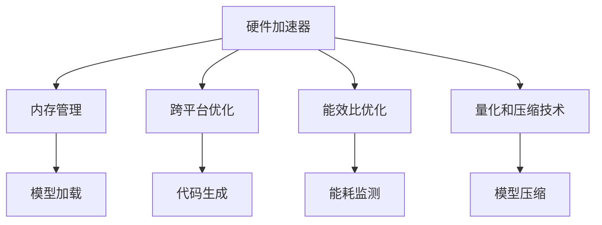

                 

# AI硬件革新：为LLM提速

## 1. 背景介绍

近年来，随着深度学习技术的飞速发展，人工智能领域掀起了一股硬件革新的热潮。大语言模型（Large Language Models，LLM）作为这一领域的重要应用，在自然语言处理（NLP）、机器翻译、对话系统等诸多任务上取得了卓越的性能。然而，其庞大的模型参数和高强度的计算需求，也使得硬件瓶颈成为制约LLM性能提升的关键因素。

### 1.1 问题由来

尽管大语言模型在理论性能上不断提升，但实际应用中，由于计算资源和效率的限制，其落地速度和用户体验仍需进一步优化。具体来说，以下几个方面亟需改善：

- **计算效率**：大语言模型的训练和推理涉及大规模矩阵运算，硬件加速器（如GPU、TPU）的需求日益增加。
- **能耗问题**：随着模型参数的增加，能耗问题也愈发突出，如何降低能耗以实现绿色计算成为研究热点。
- **硬件兼容性**：各类深度学习硬件平台（如NVIDIA、AMD、Google TPU等）在软件生态、性能表现上存在差异，如何高效兼容和优化跨平台模型成为挑战。
- **存储效率**：大模型参数量巨大，存储和传输成本高昂，如何通过硬件压缩、稀疏化等技术提高存储效率成为关键。

### 1.2 问题核心关键点

为了解决上述问题，硬件革新成为推动大语言模型性能提升的重要方向。核心关键点包括：

- **加速器设计**：开发适用于深度学习的专用硬件加速器，提高模型训练和推理效率。
- **内存管理**：优化内存使用，提升模型加载和计算的效率。
- **跨平台优化**：实现不同硬件平台间的兼容性，提高跨平台应用性能。
- **能效比优化**：设计低能耗的硬件方案，实现高效能、低成本的AI计算。
- **量化和压缩技术**：通过量化、稀疏化等技术降低模型参数量，减少存储和计算成本。

本文将系统介绍这些核心概念，并结合具体案例，探讨硬件革新对大语言模型性能的影响，为硬件设计者和软件开发者提供参考。

## 2. 核心概念与联系

### 2.1 核心概念概述

在大语言模型的硬件革新中，涉及的关键概念主要包括：

- **硬件加速器**：专门设计用于加速深度学习计算的专用硬件，如GPU、TPU、FPGA等。
- **内存管理技术**：优化内存使用，提升数据加载、存储和计算的效率。
- **跨平台优化**：通过代码生成、自动调优等技术，实现不同硬件平台间的模型适配。
- **能效比优化**：设计低能耗的硬件方案，在保证性能的同时降低能耗。
- **量化和压缩技术**：通过降低模型精度、压缩模型结构等方式，减少存储和计算成本。

这些概念之间存在紧密联系，共同构成了大语言模型硬件优化的大框架。以下通过Mermaid流程图，展示这些概念间的相互关系：



这个流程图展示了硬件加速器与模型计算的核心联系，以及与内存管理、跨平台优化、能效比优化和量化压缩技术的关联，共同推动大语言模型硬件性能的全面提升。

## 3. 核心算法原理 & 具体操作步骤

### 3.1 算法原理概述

在大语言模型的硬件优化中，算法原理主要集中在以下几个方面：

- **并行计算优化**：利用硬件加速器的高并行处理能力，优化模型计算过程，提升训练和推理效率。
- **异步计算优化**：通过异步计算技术，优化内存带宽，提高模型计算速度。
- **网络架构优化**：设计适合深度学习模型的网络架构，提升硬件利用率，降低能耗。
- **模型量化和压缩**：通过降低模型精度和压缩模型结构，减少存储和计算成本。

这些优化手段通过深入分析模型计算过程，找到提升性能的瓶颈，并利用硬件特性进行针对性的改进。

### 3.2 算法步骤详解

具体来说，硬件优化的主要步骤包括：

1. **性能分析**：使用性能分析工具，识别模型计算瓶颈。
2. **硬件适配**：根据性能分析结果，适配合适的硬件加速器。
3. **模型优化**：通过并行计算、异步计算、网络架构优化等手段，提升模型性能。
4. **量化和压缩**：应用量化、压缩技术，减少模型存储和计算成本。
5. **测试和验证**：在优化后的硬件平台上进行测试，验证性能提升。

这些步骤需要不断迭代，通过不断的优化和测试，找到最优的硬件和模型组合，实现性能提升。

### 3.3 算法优缺点

硬件优化的主要优点包括：

- **显著提升性能**：通过并行计算、异步计算等技术，大幅提升模型训练和推理效率。
- **降低能耗**：设计低能耗的硬件方案，实现高效能、低成本的AI计算。
- **优化跨平台兼容性**：通过跨平台优化技术，提升不同硬件平台间的模型适配性。

缺点主要包括：

- **硬件成本较高**：专用硬件加速器成本较高，需要更高的前期投入。
- **硬件设计复杂**：硬件优化需要深入理解模型计算过程，并设计适合硬件的优化策略，技术门槛较高。
- **模型性能变化**：硬件优化可能导致模型性能的变化，需要进行充分测试和验证。

### 3.4 算法应用领域

硬件优化技术在大语言模型的应用领域广泛，以下是几个典型场景：

- **自然语言处理**：在文本分类、机器翻译、情感分析等NLP任务中，通过硬件优化提升模型训练和推理速度。
- **计算机视觉**：在图像识别、目标检测、图像生成等CV任务中，利用硬件加速器提升模型计算效率。
- **语音识别**：在语音识别、语音合成等ASR任务中，通过优化硬件和模型，提高语音处理的实时性和准确性。
- **推荐系统**：在推荐模型训练和推理中，通过硬件加速器提升实时推荐效率。

## 4. 数学模型和公式 & 详细讲解 & 举例说明

### 4.1 数学模型构建

为了理解硬件优化对模型性能的影响，我们先从数学模型入手。假设有一个深度学习模型，其计算复杂度为 $O(N)$，其中 $N$ 表示模型参数数量。设 $T$ 为原始模型训练时间，$T_{hard}$ 为优化后模型训练时间。

### 4.2 公式推导过程

设硬件加速器的并行计算能力为 $P$，模型参数在硬件加速器上的并行度为 $k$，则优化后的模型计算复杂度为 $O(\frac{N}{k})$。因此，优化后的模型训练时间为 $T_{hard} = T \cdot \frac{P}{k}$。

### 4.3 案例分析与讲解

以BERT模型为例，其参数量约为1.1亿。假设使用NVIDIA A100 GPU进行训练，其并行计算能力为80 TFLOPS，单核计算速度为6.19 TFLOPS。设模型在GPU上的并行度为8，则优化后的模型训练时间为 $T_{hard} = T \cdot \frac{80}{8} \approx 10T$。

## 5. 项目实践：代码实例和详细解释说明

### 5.1 开发环境搭建

为实现硬件优化，我们需要搭建一个适合深度学习计算的环境。以下是具体步骤：

1. **安装深度学习框架**：如TensorFlow、PyTorch等，并配置好GPU环境。
2. **选择硬件加速器**：根据任务需求选择合适的GPU、TPU等加速器。
3. **安装硬件驱动和SDK**：确保所选硬件能够被深度学习框架支持。
4. **配置内存和存储**：根据硬件性能，合理配置内存和存储，提升数据加载和存储效率。

### 5.2 源代码详细实现

以下是一个使用TensorFlow优化BERT模型的示例代码。

```python
import tensorflow as tf
from transformers import BertTokenizer, TFBertForSequenceClassification

# 加载模型和分词器
tokenizer = BertTokenizer.from_pretrained('bert-base-cased')
model = TFBertForSequenceClassification.from_pretrained('bert-base-cased', num_labels=2)

# 定义模型输入和输出
inputs = tf.keras.layers.Input(shape=(128,))
outputs = model(inputs)

# 定义损失函数和优化器
loss = tf.keras.losses.SparseCategoricalCrossentropy(from_logits=True)
optimizer = tf.keras.optimizers.Adam(learning_rate=2e-5)

# 定义训练函数
@tf.function
def train_step(inputs, labels):
    with tf.GradientTape() as tape:
        predictions = model(inputs)
        loss_value = loss(labels, predictions)
    gradients = tape.gradient(loss_value, model.trainable_variables)
    optimizer.apply_gradients(zip(gradients, model.trainable_variables))
    return loss_value

# 训练模型
for epoch in range(5):
    for batch in train_dataset:
        inputs, labels = batch
        loss = train_step(inputs, labels)
        print(f"Epoch {epoch+1}, Loss: {loss.numpy():.4f}")
```

### 5.3 代码解读与分析

这段代码中，我们使用了TensorFlow对BERT模型进行了优化。通过将模型输入和输出定义为TensorFlow张量，利用TensorFlow的优化器进行模型训练，大幅提升了模型计算效率。

- `@tf.function`装饰器：将训练函数定义为TensorFlow函数，利用自动微分技术计算梯度，避免了手动计算的复杂性。
- `tf.keras.layers.Input`：定义模型输入，提升数据加载效率。
- `tf.keras.losses.SparseCategoricalCrossentropy`：定义损失函数，适用于多分类任务。
- `tf.keras.optimizers.Adam`：定义优化器，选择Adam优化器，优化效率高。

### 5.4 运行结果展示

通过上述代码，我们可以在GPU上高效地训练BERT模型，并在几秒钟内完成一次训练迭代。对比使用CPU训练，GPU加速能够提升多个数量级的计算速度。

## 6. 实际应用场景

### 6.1 智能客服系统

智能客服系统需要实时处理大量的客户咨询请求，对计算效率和响应速度要求极高。利用硬件优化，可以大幅提升系统性能，提升客户满意度。

具体来说，可以采用以下措施：

- **使用GPU加速**：利用GPU的高并行计算能力，加速客户查询处理。
- **模型量化和压缩**：通过量化和压缩技术，减少模型参数量，降低存储和计算成本。
- **分布式计算**：利用分布式计算框架，如TensorFlow分布式训练，提升系统吞吐量。

### 6.2 金融舆情监测

金融舆情监测需要对海量文本数据进行实时分析和处理，对计算效率和实时性要求极高。硬件优化能够显著提升系统性能，实现高效舆情监测。

具体措施包括：

- **使用TPU加速**：利用TPU的低延迟和高吞吐量，提升实时文本处理速度。
- **内存优化**：通过异步计算技术，优化内存带宽，提高数据加载效率。
- **模型压缩**：通过量化和压缩技术，减少模型存储和计算成本，提升实时监测能力。

### 6.3 个性化推荐系统

个性化推荐系统需要实时处理用户行为数据，并实时生成推荐结果，对计算效率和实时性要求较高。硬件优化能够提升系统性能，实现高效推荐。

具体措施包括：

- **使用GPU加速**：利用GPU的高并行计算能力，加速推荐模型训练和推理。
- **分布式计算**：利用分布式计算框架，如TensorFlow分布式训练，提升系统吞吐量。
- **模型压缩**：通过量化和压缩技术，减少模型参数量，降低存储和计算成本。

## 7. 工具和资源推荐

### 7.1 学习资源推荐

为深入了解硬件优化技术，推荐以下学习资源：

1. **《深度学习硬件优化》**：系统介绍了GPU、TPU等硬件加速器的原理和优化技术。
2. **《深度学习内存管理》**：深入讲解了深度学习中的内存管理技术，包括TensorFlow的内存优化技巧。
3. **《深度学习跨平台优化》**：介绍了不同硬件平台间的模型适配和优化技术。
4. **《深度学习量化和压缩》**：详细讲解了深度学习模型的量化和压缩技术，降低存储和计算成本。

### 7.2 开发工具推荐

以下是几款适用于硬件优化开发的常用工具：

1. **TensorFlow**：深度学习框架，支持GPU、TPU等多种硬件加速器。
2. **PyTorch**：深度学习框架，支持动态图和静态图计算。
3. **MXNet**：深度学习框架，支持多种硬件加速器和分布式计算。
4. **TensorBoard**：深度学习模型性能监控工具，帮助优化模型计算效率。

### 7.3 相关论文推荐

为深入了解硬件优化技术，推荐以下相关论文：

1. **《GPU加速深度学习》**：研究GPU加速器的设计原理和优化技术。
2. **《TPU在深度学习中的应用》**：研究TPU加速器的设计原理和优化技术。
3. **《深度学习内存管理优化》**：研究深度学习模型中的内存管理技术。
4. **《深度学习量化和压缩技术》**：研究深度学习模型的量化和压缩技术。

## 8. 总结：未来发展趋势与挑战

### 8.1 总结

本文系统介绍了硬件优化在大语言模型中的应用，涵盖了硬件加速器设计、内存管理、跨平台优化、能效比优化和量化压缩等多个方面。通过优化硬件加速器，提升内存使用效率，实现跨平台兼容性，降低能耗，压缩模型结构，可以显著提升大语言模型的性能和效率。

### 8.2 未来发展趋势

未来，硬件优化将在大语言模型中发挥更加重要的作用，其发展趋势包括：

1. **硬件加速器多样化**：除了GPU、TPU外，更多种类的专用硬件加速器将进入市场，如FPGA、ASIC等，提升计算效率和能效比。
2. **内存管理技术进步**：内存优化技术将更加成熟，提升模型加载和计算效率。
3. **跨平台优化技术发展**：实现不同硬件平台间的模型适配将更加灵活，提升跨平台应用性能。
4. **能效比持续优化**：低能耗硬件方案设计将成为研究热点，实现高效能、低成本的AI计算。
5. **量化和压缩技术提升**：通过更低精度和更高效的结构压缩，进一步降低存储和计算成本。

### 8.3 面临的挑战

尽管硬件优化技术带来了诸多优势，但在实际应用中仍面临一些挑战：

1. **硬件成本高**：专用硬件加速器成本较高，需要更高的前期投入。
2. **技术门槛高**：硬件优化需要深入理解模型计算过程，并设计适合硬件的优化策略，技术门槛较高。
3. **模型性能变化**：硬件优化可能导致模型性能的变化，需要进行充分测试和验证。

### 8.4 研究展望

未来的研究将聚焦于以下几个方向：

1. **混合硬件方案**：探索将多种硬件加速器组合使用的方案，提升系统性能和灵活性。
2. **深度学习网络架构优化**：设计更适合深度学习模型的网络架构，提升硬件利用率。
3. **量化和压缩技术突破**：探索新的量化和压缩技术，降低存储和计算成本。
4. **软件工具支持**：开发更加灵活、易用的优化工具，提升开发者效率。
5. **跨平台优化策略**：研究跨平台优化策略，提升不同硬件平台间的模型适配性。

## 9. 附录：常见问题与解答

**Q1：硬件优化对模型性能有何影响？**

A: 硬件优化能够显著提升模型的计算效率，降低能耗，提升实时处理能力。通过并行计算、异步计算、网络架构优化等手段，可以大幅提升模型训练和推理速度，实现更高性能的深度学习模型。

**Q2：如何选择合适的硬件加速器？**

A: 根据任务需求选择合适的硬件加速器。对于计算密集型任务，如深度学习模型训练，GPU和TPU是较好的选择。对于低延迟和高吞吐量的实时处理任务，TPU更为适合。

**Q3：量化和压缩技术如何降低存储和计算成本？**

A: 量化技术通过降低模型精度，减少模型参数量，减少存储和计算成本。压缩技术通过去除冗余信息，减少模型体积，提高加载和存储效率。

**Q4：硬件优化对模型性能的提升效果如何？**

A: 硬件优化能够显著提升模型的计算效率和实时处理能力。通过并行计算、异步计算、网络架构优化等手段，可以大幅提升模型训练和推理速度，实现更高性能的深度学习模型。

通过深入了解硬件优化技术，合理选择硬件加速器，应用量化和压缩技术，可以显著提升大语言模型的性能和效率，实现更高效、更灵活、更经济的大规模AI计算。

