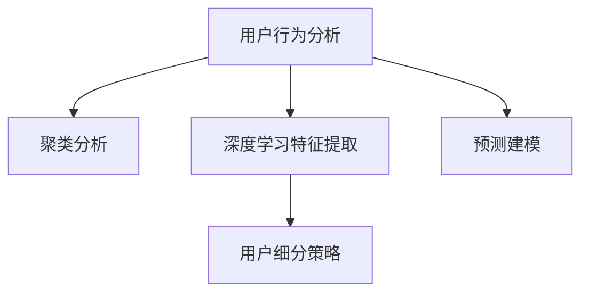

                 

# AI赋能的电商用户价值细分

## 1. 背景介绍

### 1.1 问题由来

在电商行业，用户价值细分（User Segmentation）是一个重要且复杂的话题。随着市场竞争加剧，电商企业需要精细化运营，洞察用户需求，提供个性化服务，以提升用户留存和转化率。传统的用户细分方法通常依赖手工统计和业务经验，难以实时动态调整，且难以覆盖所有用户细分场景。而AI技术的应用，特别是深度学习和大数据技术的发展，为电商企业提供了更高效、精准的用户价值细分手段。

### 1.2 问题核心关键点

用户价值细分旨在根据用户行为、偏好、特征等，将用户划分成不同的群体，从而进行更精准的运营策略制定。核心在于：

- 数据采集：全面收集用户行为数据，包括浏览记录、购买历史、评价反馈等。
- 特征提取：利用机器学习算法，从原始数据中提取出有价值的特征，如用户兴趣、价格敏感度、购买频率等。
- 聚类分析：通过聚类算法，将用户划分成不同的群体，识别出不同群体的特性和行为模式。
- 预测建模：建立预测模型，根据用户特征预测其未来行为，为个性化推荐和营销策略提供依据。

这些核心关键点共同构成了用户价值细分的过程，其目标是帮助电商企业更科学地划分用户群体，实施差异化营销，提升用户体验和平台收益。

### 1.3 问题研究意义

用户价值细分对于电商企业具有重大意义：

1. **精准营销**：根据用户群体特征定制个性化的营销内容，提升广告点击率和转化率。
2. **提升转化率**：通过细分用户，提供精准的商品推荐，提高购买转化率。
3. **提升用户满意度**：根据不同用户群体的偏好提供个性化服务，提升用户满意度和忠诚度。
4. **运营优化**：识别出流失用户和高价值用户，有针对性地进行运营策略调整，优化平台运营效率。
5. **业务决策支持**：为管理层提供用户行为数据支持，辅助决策。

随着AI技术的不断成熟，用户价值细分已经从传统的统计方法转变为基于AI的自动化、数据驱动方式，极大提升了细分的精准度和效率，有助于电商企业更好地洞察用户需求，提升运营效益。

## 2. 核心概念与联系

### 2.1 核心概念概述

为更好地理解AI赋能的用户价值细分方法，本节将介绍几个关键概念：

- **用户行为分析**：通过分析用户的行为数据，如浏览、购买、评价等，识别用户偏好和行为模式。
- **聚类分析**：通过无监督学习算法，如K-Means、层次聚类等，将用户划分为不同的群体，识别群体的特性。
- **深度学习特征提取**：利用深度学习模型，如DNN、CNN、RNN等，自动从原始数据中提取高层次的特征，提升细分的准确性。
- **预测建模**：通过监督学习算法，如决策树、随机森林、神经网络等，建立预测模型，预估用户行为和偏好。
- **用户细分策略**：结合电商业务特点，设计差异化的运营策略，实施精细化管理。

这些概念之间的逻辑关系可以通过以下Mermaid流程图来展示：



这个流程图展示了用户价值细分的核心过程：

1. 首先进行用户行为分析，获取用户行为数据。
2. 接着利用聚类分析算法，将用户划分成不同的群体。
3. 利用深度学习技术，提取用户的高层次特征。
4. 构建预测模型，预估用户行为和偏好。
5. 最后根据预测结果，设计并实施用户细分策略。

## 3. 核心算法原理 & 具体操作步骤

### 3.1 算法原理概述

用户价值细分本质上是一个数据驱动的用户画像构建过程。核心思路是通过机器学习算法，从用户行为数据中提取特征，进行聚类分析，构建用户画像，并通过预测模型，预估用户未来行为，为精细化运营提供支持。

具体流程如下：

1. **数据预处理**：清洗和归一化原始数据，处理缺失值和异常值。
2. **特征工程**：利用机器学习算法，提取用户的行为、属性等特征，构建特征向量。
3. **聚类分析**：通过聚类算法，将用户分成不同的群体。
4. **预测建模**：使用监督学习算法，建立预测模型，预估用户行为。
5. **用户细分**：根据聚类结果和预测结果，设计用户细分策略，实施精细化运营。

### 3.2 算法步骤详解

#### 3.2.1 数据预处理

数据预处理包括数据清洗、归一化和特征选择等步骤。具体流程如下：

1. **数据清洗**：去除重复、无关、错误的数据，处理缺失值和异常值。
2. **特征归一化**：将不同特征缩放到统一范围，如0-1、标准化等。
3. **特征选择**：选择与用户价值相关的特征，去除冗余和无关特征。

#### 3.2.2 特征工程

特征工程旨在从原始数据中提取有用的特征，提高模型性能。主要包括以下步骤：

1. **特征提取**：从用户行为数据中提取特征，如用户浏览历史、购买频率、评价评分等。
2. **特征组合**：通过组合不同特征，生成新的特征，如浏览时间、浏览频率等。
3. **特征转换**：对原始特征进行变换，如对数值型特征进行对数、指数等变换。
4. **特征降维**：通过PCA、LDA等方法，减少特征维度，提升计算效率。

#### 3.2.3 聚类分析

聚类分析是一种无监督学习算法，通过将用户划分为不同的群体，识别群体特性。主要包括以下步骤：

1. **选择合适的聚类算法**：如K-Means、层次聚类等。
2. **确定聚类数量**：通过肘部法则、Gap Statistic等方法确定聚类数量。
3. **训练聚类模型**：输入特征向量，训练聚类模型。
4. **评估聚类结果**：通过Silhouette系数、Davies-Bouldin指数等指标评估聚类结果。

#### 3.2.4 预测建模

预测建模旨在根据用户特征，预测其未来行为。主要包括以下步骤：

1. **选择合适的预测算法**：如决策树、随机森林、神经网络等。
2. **数据划分**：将数据划分为训练集和测试集。
3. **训练预测模型**：在训练集上训练预测模型。
4. **模型评估**：在测试集上评估预测模型的性能，调整模型参数。

#### 3.2.5 用户细分策略

用户细分策略是用户价值细分的最终输出，旨在根据聚类结果和预测结果，设计差异化的运营策略。主要包括以下步骤：

1. **分析聚类结果**：分析不同聚类群体的特性和行为模式。
2. **设计细分策略**：根据聚类结果和预测结果，设计差异化的运营策略。
3. **实施运营策略**：将策略应用于实际业务，优化用户体验和运营效率。

### 3.3 算法优缺点

AI赋能的用户价值细分方法具有以下优点：

1. **高效自动化**：利用AI技术，自动化处理大量数据，减少人工干预，提升效率。
2. **精准性高**：通过机器学习算法，自动提取高层次特征，识别用户群体特性，提升细分的精准性。
3. **实时性高**：利用在线学习技术，实时更新用户画像，及时调整运营策略。
4. **可扩展性高**：AI算法具有较高的可扩展性，可以覆盖更多用户细分场景。

但同时也存在以下缺点：

1. **数据需求高**：需要大量的用户行为数据，数据获取和处理成本较高。
2. **模型复杂**：机器学习模型较为复杂，需要较长的训练时间和较高的计算资源。
3. **可解释性低**：黑箱模型难以解释其内部决策逻辑，难以进行调试和优化。
4. **数据隐私问题**：用户行为数据可能涉及隐私问题，需要严格的数据管理和保护。

尽管存在这些局限性，但AI技术在用户价值细分中的应用仍然具有重大价值，值得在实际业务中推广应用。

### 3.4 算法应用领域

AI赋能的用户价值细分方法在电商领域具有广泛应用，具体包括以下几个方面：

1. **个性化推荐**：通过用户聚类和预测模型，提供个性化商品推荐，提升用户购买转化率。
2. **客户细分**：将用户细分为高价值用户、流失用户、潜在用户等不同群体，实施差异化运营策略。
3. **市场营销**：根据用户群体特性，设计针对性的营销策略，提升广告点击率和转化率。
4. **用户行为预测**：预测用户未来行为，如复购概率、流失概率等，辅助业务决策。
5. **广告投放**：通过聚类和预测结果，优化广告投放策略，提升广告ROI。

## 4. 数学模型和公式 & 详细讲解 & 举例说明

### 4.1 数学模型构建

用户价值细分的数学模型主要包括以下几个组成部分：

1. **数据预处理模型**：用于数据清洗和归一化。
2. **特征工程模型**：用于特征提取、组合和降维。
3. **聚类分析模型**：用于将用户分成不同的群体。
4. **预测建模模型**：用于预测用户行为和偏好。

### 4.2 公式推导过程

#### 4.2.1 数据预处理模型

数据预处理模型主要包括以下公式：

1. 数据清洗：去除重复和无关数据。
   $$
   \text{cleaned\_data} = \text{original\_data} \setminus \{\text{repeated}, \text{irrelevant}\}
   $$

2. 数据归一化：将数据缩放到统一范围。
   $$
   \text{normalized\_data} = \frac{\text{cleaned\_data} - \mu}{\sigma}
   $$

3. 特征选择：选择与用户价值相关的特征。
   $$
   \text{selected\_features} = \{\text{relevant\_features}\}
   $$

#### 4.2.2 特征工程模型

特征工程模型主要包括以下公式：

1. 特征提取：从原始数据中提取特征。
   $$
   \text{features} = \{\text{user\_browsing\_history}, \text{purchase\_frequency}, \text{review\_score}\}
   $$

2. 特征组合：通过组合不同特征生成新的特征。
   $$
   \text{combined\_features} = \{\text{browsing\_time}, \text{browsing\_frequency}\}
   $$

3. 特征转换：对原始特征进行变换。
   $$
   \text{transformed\_features} = \{\log(\text{purchase\_frequency}), \text{std}(\text{review\_score})\}
   $$

4. 特征降维：通过PCA等方法减少特征维度。
   $$
   \text{reduced\_features} = \text{PCA}(\text{transformed\_features})
   $$

#### 4.2.3 聚类分析模型

聚类分析模型主要包括以下公式：

1. 选择合适的聚类算法：如K-Means。
   $$
   \text{clusters} = \text{K-Means}(\text{reduced\_features})
   $$

2. 确定聚类数量：通过肘部法则确定聚类数量。
   $$
   \text{elbow\_point} = \arg\min_{k} \frac{\text{SSE}_k}{k}
   $$

3. 训练聚类模型：在训练集上训练聚类模型。
   $$
   \text{model\_params} = \text{Train}(\text{clusters}, \text{reduced\_features})
   $$

4. 评估聚类结果：通过Silhouette系数评估聚类结果。
   $$
   \text{silhouette\_score} = \frac{1}{N}\sum_{i=1}^N \text{Silhouette}_i
   $$

#### 4.2.4 预测建模模型

预测建模模型主要包括以下公式：

1. 选择合适的预测算法：如随机森林。
   $$
   \text{model} = \text{RandomForest}(\text{selected\_features})
   $$

2. 数据划分：将数据划分为训练集和测试集。
   $$
   \text{train\_data}, \text{test\_data} = \text{SplitData}(\text{cleaned\_data})
   $$

3. 训练预测模型：在训练集上训练预测模型。
   $$
   \text{trained\_model} = \text{Train}(\text{train\_data})
   $$

4. 模型评估：在测试集上评估预测模型的性能。
   $$
   \text{accuracy} = \frac{1}{N} \sum_{i=1}^N \text{Accuracy}_i(\text{test\_data})
   $$

### 4.3 案例分析与讲解

假设某电商平台的客户数据如下：

| 用户ID | 年龄 | 性别 | 地区 | 浏览历史 | 购买历史 | 评价评分 |
| ------ | ---- | ---- | ---- | -------- | -------- | -------- |
| 1      | 25   | 男   | 北京  | [产品A, 产品B, 产品C] | [产品A, 产品B] | 4.5      |
| 2      | 30   | 女   | 上海  | [产品A, 产品C, 产品D] | [产品B, 产品D] | 3.5      |
| ...    | ...  | ...  | ...   | ...      | ...      | ...      |

1. **数据预处理**：

   - 清洗数据，去除重复和无关记录，处理缺失值和异常值。
   - 归一化数据，将年龄、评分等特征缩放到0-1范围。
   - 选择与用户价值相关的特征，如年龄、性别、浏览历史等。

2. **特征工程**：

   - 提取特征，如浏览历史、购买历史、评价评分等。
   - 组合特征，如浏览时间、浏览频率等。
   - 转换特征，如对数转换、标准差计算等。
   - 降维，如PCA等方法。

3. **聚类分析**：

   - 选择合适的聚类算法，如K-Means。
   - 确定聚类数量，通过肘部法则确定聚类数量为3。
   - 训练聚类模型，得到三个聚类群体的中心和半径。
   - 评估聚类结果，通过Silhouette系数确定聚类效果较好。

4. **预测建模**：

   - 选择合适的预测算法，如随机森林。
   - 数据划分，将数据划分为训练集和测试集。
   - 训练预测模型，在训练集上得到随机森林模型。
   - 模型评估，在测试集上评估预测模型的准确率。

5. **用户细分策略**：

   - 分析聚类结果，识别出不同聚类群体的特性和行为模式。
   - 设计细分策略，如对高价值用户进行个性化推荐，对流失用户进行召回。
   - 实施运营策略，如针对不同聚类群体设计不同的广告投放策略。

## 5. 项目实践：代码实例和详细解释说明

### 5.1 开发环境搭建

在进行用户价值细分实践前，我们需要准备好开发环境。以下是使用Python进行Scikit-learn开发的环境配置流程：

1. 安装Anaconda：从官网下载并安装Anaconda，用于创建独立的Python环境。

2. 创建并激活虚拟环境：
```bash
conda create -n sklearn-env python=3.8 
conda activate sklearn-env
```

3. 安装Scikit-learn：
```bash
pip install scikit-learn
```

4. 安装各类工具包：
```bash
pip install numpy pandas scikit-learn matplotlib tqdm jupyter notebook ipython
```

完成上述步骤后，即可在`sklearn-env`环境中开始用户价值细分实践。

### 5.2 源代码详细实现

下面我们以用户价值细分任务为例，给出使用Scikit-learn进行聚类和预测的Python代码实现。

```python
from sklearn.datasets import make_blobs
from sklearn.cluster import KMeans
from sklearn.ensemble import RandomForestClassifier
from sklearn.metrics import accuracy_score
from sklearn.model_selection import train_test_split

# 生成数据集
X, y = make_blobs(n_samples=1000, centers=3, cluster_std=0.5, random_state=42)

# 特征工程
# 假设特征为二维的X坐标和Y坐标
X = X[:, :2]

# 数据预处理
# 归一化特征
from sklearn.preprocessing import StandardScaler
scaler = StandardScaler()
X = scaler.fit_transform(X)

# 聚类分析
kmeans = KMeans(n_clusters=3)
clusters = kmeans.fit_predict(X)

# 预测建模
X_train, X_test, y_train, y_test = train_test_split(X, y, test_size=0.2, random_state=42)
rf = RandomForestClassifier()
rf.fit(X_train, y_train)

# 模型评估
y_pred = rf.predict(X_test)
accuracy = accuracy_score(y_test, y_pred)
print(f"Accuracy: {accuracy:.2f}")
```

### 5.3 代码解读与分析

让我们再详细解读一下关键代码的实现细节：

- **数据生成**：使用`make_blobs`生成三维数据集，包含三个聚类中心。
- **特征工程**：假设特征为二维的X坐标和Y坐标。
- **数据预处理**：使用`StandardScaler`归一化特征，将数据缩放到0-1范围。
- **聚类分析**：使用`KMeans`聚类算法，将数据分为三个聚类。
- **预测建模**：使用`RandomForestClassifier`建立随机森林模型，预测聚类标签。
- **模型评估**：使用`accuracy_score`评估预测模型的准确率。

通过上述代码，我们可以完整地进行用户价值细分过程的实践，包括数据预处理、聚类分析、预测建模和模型评估等环节。开发者可以根据具体需求，调整模型参数和算法，优化用户价值细分效果。

## 6. 实际应用场景

### 6.1 智能推荐系统

智能推荐系统是用户价值细分的重要应用场景之一。通过分析用户的历史行为数据，利用聚类和预测模型，为用户推荐个性化的商品，提升用户满意度。

具体而言，可以收集用户浏览、点击、购买等行为数据，利用用户行为聚类和预测模型，识别出用户的不同兴趣点，实时生成推荐结果。例如，某用户浏览了产品A、B、C，通过聚类分析可以识别出其属于某一特定群体，再利用预测模型预估其购买概率，推荐其感兴趣的商品。

### 6.2 客户管理

客户管理也是用户价值细分的重要应用场景。通过用户细分，可以更好地识别高价值用户和流失用户，实施差异化的运营策略。

具体而言，可以收集用户的基本信息、购买历史等数据，利用聚类分析将用户分为不同群体。根据不同群体的特性，设计针对性的营销策略，如对高价值用户提供优惠券、生日礼物等个性化服务，对流失用户进行召回和重新激活。

### 6.3 广告投放优化

广告投放优化是用户价值细分的重要应用场景。通过用户细分，可以识别出对广告敏感的用户群体，优化广告投放策略，提升广告ROI。

具体而言，可以收集用户的历史广告点击、点击率等数据，利用聚类分析将用户分为不同群体。根据不同群体的特性，设计针对性的广告投放策略，如对高价值用户增加广告曝光量，对低价值用户减少广告投放，提升广告投放效果。

### 6.4 未来应用展望

随着AI技术的不断进步，用户价值细分在未来将呈现更多的应用场景，带来更广阔的发展前景。

1. **实时预测与推荐**：通过实时数据流处理，实现用户行为的实时预测与推荐，提升用户体验和平台收益。
2. **多模态数据融合**：结合用户行为数据、社交网络数据等多模态数据，进行更全面、精准的用户画像构建。
3. **跨领域知识迁移**：通过知识图谱等技术，实现跨领域的用户价值细分，提升模型泛化能力。
4. **联邦学习**：在用户隐私保护的前提下，利用联邦学习技术，实现跨平台的用户价值细分，提升模型训练效果。
5. **自动化决策支持**：利用AI技术，自动生成用户细分策略，辅助业务决策，提升运营效率。

## 7. 工具和资源推荐

### 7.1 学习资源推荐

为了帮助开发者系统掌握用户价值细分的方法，这里推荐一些优质的学习资源：

1. **《Python数据科学手册》**：涵盖Python在数据科学中的应用，包括机器学习、数据可视化等，是学习数据科学的基础书籍。
2. **Coursera《机器学习》课程**：由斯坦福大学Andrew Ng教授讲授，系统介绍机器学习的基础理论和实践技巧。
3. **Kaggle竞赛平台**：提供丰富的数据集和竞赛，通过实践提升数据处理和机器学习技能。
4. **Scikit-learn官方文档**：提供详细的API文档和示例代码，是学习机器学习算法的必备资源。
5. **Towards Data Science博客**：涵盖数据科学和机器学习的最新研究和实践经验，提供丰富的学习资源和案例分析。

通过对这些资源的学习实践，相信你一定能够系统掌握用户价值细分的方法，并用于解决实际问题。

### 7.2 开发工具推荐

高效的开发离不开优秀的工具支持。以下是几款用于用户价值细分开发的常用工具：

1. **Jupyter Notebook**：基于Web的交互式开发环境，支持Python、R等多种编程语言，方便实验和协作。
2. **TensorFlow**：Google开源的深度学习框架，支持分布式训练和GPU加速，适合大规模数据处理。
3. **PyTorch**：Facebook开源的深度学习框架，易于使用，适合研究和开发。
4. **Pandas**：基于NumPy的数据处理库，提供强大的数据处理和分析功能。
5. **Scikit-learn**：开源的机器学习库，提供丰富的机器学习算法和工具。

合理利用这些工具，可以显著提升用户价值细分的开发效率，加速模型优化和实验迭代。

### 7.3 相关论文推荐

用户价值细分技术的发展离不开学界的持续研究。以下是几篇奠基性的相关论文，推荐阅读：

1. **K-Means聚类算法**：由MacQueen提出，是常见的聚类算法，具有简单高效的特点。
2. **随机森林算法**：由Breiman提出，是一种集成学习方法，具有较好的分类和回归性能。
3. **DeepFM模型**：由Fang等人提出，结合深度学习和传统机器学习，用于推荐系统，提升推荐效果。
4. **Graph Convolutional Networks**：由Kipf和Welling提出，用于图数据上的聚类和预测，提升用户价值细分的准确性。
5. **GNN-Embeddings**：由Sundararajan等人提出，结合图神经网络和嵌入技术，用于社交网络数据的分析和用户价值细分。

这些论文代表了大语言模型微调技术的发展脉络。通过学习这些前沿成果，可以帮助研究者把握学科前进方向，激发更多的创新灵感。

## 8. 总结：未来发展趋势与挑战

### 8.1 总结

本文对AI赋能的用户价值细分方法进行了全面系统的介绍。首先阐述了用户价值细分的研究背景和意义，明确了细分的核心在于数据驱动的用户画像构建。其次，从原理到实践，详细讲解了用户价值细分的数学模型和操作步骤，给出了完整的代码实例。同时，本文还广泛探讨了用户价值细分在电商领域的应用场景，展示了其在推荐系统、客户管理、广告投放等方面的应用价值。最后，本文精选了用户价值细分的学习资源、开发工具和相关论文，力求为读者提供全方位的技术指引。

通过本文的系统梳理，可以看到，AI技术在用户价值细分中已经展现出强大的应用潜力，极大地提升了细分的精准度和效率，有助于电商企业更好地洞察用户需求，提升运营效益。未来，随着AI技术的不断进步，用户价值细分将迎来更广阔的发展前景。

### 8.2 未来发展趋势

用户价值细分作为AI技术的重要应用方向，未来将呈现以下几个发展趋势：

1. **实时性提升**：通过实时数据流处理和流式学习技术，实现用户行为的实时预测与推荐。
2. **多模态数据融合**：结合用户行为数据、社交网络数据等多模态数据，进行更全面、精准的用户画像构建。
3. **跨领域知识迁移**：利用知识图谱等技术，实现跨领域的用户价值细分，提升模型泛化能力。
4. **联邦学习**：在用户隐私保护的前提下，利用联邦学习技术，实现跨平台的用户价值细分，提升模型训练效果。
5. **自动化决策支持**：利用AI技术，自动生成用户细分策略，辅助业务决策，提升运营效率。

以上趋势凸显了用户价值细分技术的广阔前景。这些方向的探索发展，必将进一步提升电商企业的数据处理和运营能力，实现更精准、高效的客户管理和服务优化。

### 8.3 面临的挑战

尽管用户价值细分技术已经取得了显著成果，但在实际应用中也面临着诸多挑战：

1. **数据获取难度**：获取大规模高质量用户行为数据，成本较高，且数据隐私保护要求严格。
2. **模型复杂度**：机器学习模型较为复杂，需要较长的训练时间和较高的计算资源。
3. **模型可解释性**：黑箱模型难以解释其内部决策逻辑，难以进行调试和优化。
4. **数据隐私问题**：用户行为数据涉及隐私问题，需要严格的数据管理和保护。
5. **算法公平性**：用户细分算法可能存在偏见，需要消除算法中的不公正因素。

尽管存在这些挑战，但用户价值细分技术在电商领域具有重大价值，值得在实际业务中推广应用。未来，通过技术进步和政策完善，这些挑战有望得到有效解决，用户价值细分技术将进一步推动电商行业的数字化转型和智能化升级。

### 8.4 研究展望

面对用户价值细分技术面临的挑战，未来的研究需要在以下几个方面寻求新的突破：

1. **数据隐私保护**：采用联邦学习、差分隐私等技术，在保护用户隐私的前提下，提升数据利用率。
2. **模型可解释性**：引入可解释AI技术，如LIME、SHAP等，增强模型的可解释性和可解释性。
3. **自动化策略生成**：利用强化学习等技术，自动生成用户细分策略，提升策略生成的自动化水平。
4. **多模态数据融合**：结合用户行为数据、社交网络数据、物联网数据等多模态数据，进行更全面、精准的用户画像构建。
5. **跨领域知识迁移**：利用知识图谱等技术，实现跨领域的用户价值细分，提升模型泛化能力。

这些研究方向将为未来用户价值细分技术的发展提供新的动力，帮助电商企业更好地洞察用户需求，提升运营效益。面向未来，用户价值细分技术需要与其他AI技术进行更深入的融合，共同推动电商行业的数字化转型和智能化升级。总之，用户价值细分技术在大数据、AI技术迅速发展的背景下，必将展现出广阔的应用前景和重要的研究价值。

## 9. 附录：常见问题与解答

**Q1：用户价值细分需要哪些数据？**

A: 用户价值细分需要大量的用户行为数据，包括浏览记录、购买历史、评价反馈等。数据获取成本较高，需要建立完善的数据采集和处理机制。

**Q2：用户价值细分与用户画像构建有何不同？**

A: 用户价值细分是通过机器学习算法，从用户行为数据中提取特征，进行聚类分析，构建用户画像。而用户画像构建更多依赖人工统计和业务经验，精度和自动化程度较低。用户价值细分通过数据驱动的方式，更精准、高效地构建用户画像，为运营策略提供依据。

**Q3：用户价值细分对算力、存储有什么要求？**

A: 用户价值细分涉及大规模数据的处理和机器学习模型的训练，对算力、存储要求较高。需要采用高性能计算设备，如GPU、TPU等，并进行数据压缩、模型优化等技术，提高计算效率。

**Q4：用户价值细分在不同业务场景中的应用效果如何？**

A: 用户价值细分在电商、金融、社交媒体等多个业务场景中均有应用，取得了显著的运营效益。例如，在电商领域，通过用户细分，实现个性化推荐、精准营销、客户管理等功能，提升了用户满意度和平台收益。在金融领域，通过用户细分，实现风险评估、用户管理、产品推荐等功能，提高了金融服务的智能化水平。

**Q5：如何评估用户价值细分模型的效果？**

A: 用户价值细分的模型评估主要包括以下指标：
1. 聚类分析：通过Silhouette系数、Davies-Bouldin指数等指标评估聚类效果。
2. 预测建模：通过准确率、召回率、F1分数等指标评估预测效果。
3. 用户细分策略：通过用户满意度、转化率等指标评估运营效果。

通过综合评估以上指标，可以全面了解用户价值细分模型的效果，进行优化和改进。

