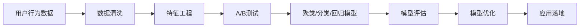

                 

# AI赋能的电商用户价值细分

## 1. 背景介绍

### 1.1 问题由来

随着电子商务的迅猛发展，各大电商平台的竞争愈发激烈，如何深入了解用户需求，提升用户体验，实现精准营销，成为电商企业亟需解决的问题。用户价值细分（User Segmentation）技术能够帮助电商平台精准识别不同用户群体，针对性地提供个性化服务，提升用户满意度和平台粘性，从而在竞争中占据优势。

### 1.2 问题核心关键点

用户价值细分依赖于数据分析和人工智能技术，核心任务包括：

- 数据收集与清洗：从电商网站和APP中收集用户行为数据，如浏览历史、购物记录、评价反馈等。
- 特征工程：提取和构建用户行为特征，如兴趣偏好、消费水平、地理位置等。
- 模型训练：选择合适的方法，如聚类、分类、回归等，训练用户细分模型。
- 模型评估与优化：使用交叉验证、A/B测试等手段，评估模型效果并进行调优。
- 应用落地：将模型应用于推荐系统、营销活动、客户服务等领域，实现精准营销和用户体验提升。

这些关键点贯穿用户价值细分技术的全流程，每一个环节都关系到分段的准确性和有效性。

### 1.3 问题研究意义

深入理解用户需求，优化用户体验，提升电商平台的用户粘性和转化率，是电商企业成功的关键。用户价值细分技术能够帮助电商平台精准识别不同用户群体，实现个性化推荐和服务，从而提升用户满意度和平台竞争力。

- **降低运营成本**：通过精准营销和个性化服务，减少无效广告投放，降低运营成本。
- **提升用户体验**：根据用户偏好推荐商品，提升用户购物体验，增加复购率。
- **增强平台粘性**：通过个性化内容和互动，提高用户平台粘性，减少流失率。
- **优化决策支持**：精准的用户细分结果，可以为电商平台的业务决策提供数据支撑。

通过用户价值细分技术，电商企业能够更好地理解用户需求，优化运营策略，提升整体竞争力。

## 2. 核心概念与联系

### 2.1 核心概念概述

为了更好地理解用户价值细分技术，我们需要引入几个关键概念：

- **用户行为数据**：用户在电商网站上的各种行为数据，包括浏览记录、购买历史、评价反馈等。
- **用户细分**：将用户按照某些特征分为若干个不同的群体，以便于有针对性地进行营销和服务。
- **聚类算法**：将相似的用户分为一组的算法，如K-Means、层次聚类等。
- **分类算法**：将用户分为预设类别的算法，如逻辑回归、决策树等。
- **回归算法**：预测连续型数值变量的算法，如线性回归、随机森林等。

这些概念之间存在密切联系，共同构成了用户价值细分技术的核心框架。

### 2.2 核心概念原理和架构的 Mermaid 流程图



这个流程图展示了用户价值细分技术的主要流程，从数据清洗到模型优化，再到模型应用，各个环节相互关联，共同支撑用户细分的实施。

## 3. 核心算法原理 & 具体操作步骤

### 3.1 算法原理概述

用户价值细分算法通常分为三类：聚类算法、分类算法和回归算法。

- **聚类算法**：将用户分为若干个簇（Cluster），每个簇内的用户具有相似的特征。常见的聚类算法有K-Means、层次聚类等。
- **分类算法**：将用户分为预定义的类别，如高价值用户、低价值用户等。常见的分类算法有逻辑回归、决策树、随机森林等。
- **回归算法**：预测连续型数值变量的算法，如用户消费水平、流失概率等。常见的回归算法有线性回归、支持向量回归等。

这些算法在用户价值细分中各有优势，适用于不同类型的数据和场景。

### 3.2 算法步骤详解

用户价值细分的核心步骤包括：

1. **数据收集与预处理**：收集用户行为数据，并进行清洗和预处理，如去除重复记录、处理缺失值等。
2. **特征选择与构建**：选择和构建用户行为特征，如兴趣标签、购买频率、用户评分等。
3. **模型选择与训练**：选择聚类、分类或回归模型，并使用训练数据训练模型。
4. **模型评估与调优**：使用交叉验证、A/B测试等手段评估模型效果，并进行调优。
5. **模型应用与优化**：将模型应用于推荐系统、营销活动、客户服务等领域，并根据反馈进行优化。

### 3.3 算法优缺点

用户价值细分技术具有以下优点：

- **精准度**：通过数据分析和模型训练，能够实现对用户行为的精准划分。
- **可解释性**：模型训练过程透明，便于理解细分结果背后的逻辑。
- **灵活性**：不同的算法和模型适用于不同类型的数据和场景，灵活性高。

但同时也存在一些缺点：

- **数据依赖**：模型训练依赖高质量的数据，数据质量直接影响细分效果。
- **复杂度**：模型训练和调优过程复杂，需要较高的技术门槛。
- **动态性**：用户行为数据不断变化，模型需要定期更新以保持准确性。

### 3.4 算法应用领域

用户价值细分技术已经在电商、金融、旅游等多个领域得到广泛应用，具体包括：

- **电商领域**：根据用户行为数据，实现精准营销、个性化推荐、流失预警等。
- **金融领域**：通过用户行为分析，实现客户分类、信用评分、风险控制等。
- **旅游领域**：分析用户偏好和行为，提供个性化旅游方案、推荐目的地等。
- **物流领域**：对用户物流行为进行细分，实现快递路线优化、包裹推荐等。

## 4. 数学模型和公式 & 详细讲解 & 举例说明

### 4.1 数学模型构建

用户价值细分的数学模型主要涉及聚类、分类和回归三类问题。以聚类为例，我们通过以下数学模型进行建模：

$$
C = \arg\min_{K, X}\sum_{k=1}^K\sum_{x_i \in C_k} d(x_i, \mu_k)
$$

其中，$C$ 表示聚类结果，$K$ 为聚类数目，$X$ 为特征向量，$\mu_k$ 为第 $k$ 个聚类的中心点，$d$ 为距离度量函数。

### 4.2 公式推导过程

以K-Means算法为例，其核心公式如下：

$$
\mu_k = \frac{1}{|C_k|}\sum_{x_i \in C_k} x_i
$$

其中，$\mu_k$ 为第 $k$ 个聚类的中心点，$x_i$ 为第 $i$ 个用户的行为特征，$|C_k|$ 为第 $k$ 个聚类的用户数量。

### 4.3 案例分析与讲解

以一个电商平台的用户价值细分为例，我们可以使用K-Means算法将用户分为高价值用户和低价值用户两组。首先，收集用户的浏览记录、购买记录、评价反馈等数据，并进行清洗和预处理。然后，选择兴趣标签、购买频率、用户评分等特征，构建用户行为特征向量 $X$。

接下来，使用K-Means算法对用户进行聚类，得到高价值用户和低价值用户两个簇 $C_1$ 和 $C_2$。最后，对高价值用户进行个性化推荐，对低价值用户进行流失预警。

## 5. 项目实践：代码实例和详细解释说明

### 5.1 开发环境搭建

开发环境搭建主要包括以下步骤：

1. **安装Python**：下载并安装Python 3.7及以上版本。
2. **安装依赖包**：使用pip安装必要的依赖包，如pandas、numpy、scikit-learn等。
3. **数据准备**：准备电商平台的用户行为数据，如浏览器日志、购买记录、评价反馈等。

### 5.2 源代码详细实现

以下是一个基于K-Means算法的用户价值细分示例代码：

```python
from sklearn.cluster import KMeans
import pandas as pd

# 读取用户行为数据
data = pd.read_csv('user_behavior.csv')

# 选择特征
features = data[['interest_labels', 'purchase_frequency', 'user_score']]

# 进行K-Means聚类
kmeans = KMeans(n_clusters=2)
kmeans.fit(features)

# 输出聚类结果
labels = kmeans.predict(features)
print(labels)
```

### 5.3 代码解读与分析

上述代码实现了基于K-Means算法的用户价值细分过程。具体步骤如下：

1. **数据读取**：使用pandas库读取用户行为数据，并选择需要的特征。
2. **模型训练**：使用KMeans算法对用户行为特征进行聚类，得到两个簇。
3. **结果输出**：输出每个用户所属的聚类标签，用于后续的个性化推荐和流失预警。

### 5.4 运行结果展示

运行上述代码，输出每个用户所属的聚类标签。例如，输出结果可能为[0, 0, 1, 1, 0, 1]，表示前两个用户属于高价值用户簇，后三个用户属于低价值用户簇。

## 6. 实际应用场景

### 6.1 电商领域

在电商领域，用户价值细分技术可以应用于以下几个方面：

- **个性化推荐**：根据用户行为数据，实现商品推荐和促销策略优化。
- **精准营销**：识别高价值用户，进行定向广告投放和优惠券发放。
- **流失预警**：预测可能流失的用户，提前采取措施挽回客户。
- **库存管理**：分析用户需求趋势，优化库存配置和供应链管理。

### 6.2 金融领域

在金融领域，用户价值细分技术可以应用于以下几个方面：

- **客户分类**：将客户分为高价值和低价值两类，优化客户服务和资源分配。
- **信用评分**：根据用户行为数据，预测用户的信用评分，降低坏账率。
- **风险控制**：识别高风险用户，采取风险控制措施，保护金融机构资产。

### 6.3 旅游领域

在旅游领域，用户价值细分技术可以应用于以下几个方面：

- **个性化旅游方案**：根据用户偏好，提供定制化的旅游路线和方案。
- **目的地推荐**：分析用户行为数据，推荐热门和冷门的旅游目的地。
- **用户粘性提升**：通过个性化互动和内容推送，提升用户旅游体验和平台粘性。

### 6.4 未来应用展望

未来，用户价值细分技术将向以下几个方向发展：

- **多模态数据融合**：融合用户行为数据、社交媒体数据、物联网数据等多模态数据，实现更全面的用户画像。
- **实时动态更新**：利用流数据处理技术，实现用户行为数据的实时分析和动态更新，保持细分结果的时效性。
- **个性化服务优化**：通过深度学习和强化学习技术，优化个性化推荐和服务策略，提升用户体验。

## 7. 工具和资源推荐

### 7.1 学习资源推荐

为了帮助开发者系统掌握用户价值细分技术，这里推荐一些优质的学习资源：

1. **《Python数据科学手册》**：讲解Python数据科学基础，涵盖pandas、scikit-learn等库的使用。
2. **K-Means算法介绍**：详细介绍了K-Means算法的原理和实现方法。
3. **用户细分实战**：分享用户细分项目的具体实现步骤和常见问题。
4. **机器学习实战**：讲解机器学习算法，包括聚类、分类、回归等。

### 7.2 开发工具推荐

高效的开发离不开优秀的工具支持。以下是几款用于用户价值细分开发的常用工具：

1. **Python**：灵活的脚本语言，支持数据处理和算法实现。
2. **pandas**：数据处理和分析库，支持大规模数据处理和特征工程。
3. **scikit-learn**：机器学习库，包含多种聚类、分类和回归算法。
4. **TensorFlow**：深度学习库，支持复杂的神经网络模型。
5. **Jupyter Notebook**：交互式开发环境，支持代码调试和数据可视化。

### 7.3 相关论文推荐

用户价值细分技术的发展离不开学界的持续研究。以下是几篇奠基性的相关论文，推荐阅读：

1. **K-Means算法**：介绍K-Means算法的基本原理和应用。
2. **用户细分技术**：综述用户细分技术的研究进展和应用案例。
3. **多模态数据融合**：介绍多模态数据的融合方法和技术。

## 8. 总结：未来发展趋势与挑战

### 8.1 研究成果总结

用户价值细分技术已经取得了显著的研究成果，广泛应用于电商、金融、旅游等多个领域，提升了用户体验和平台竞争力。但同时也面临一些挑战，如数据依赖、模型复杂、动态性等。

### 8.2 未来发展趋势

未来，用户价值细分技术将向以下几个方向发展：

- **多模态数据融合**：融合多种数据源，实现更全面、准确的细分结果。
- **实时动态更新**：利用流数据处理技术，实现实时分析和动态更新，保持细分结果的时效性。
- **个性化服务优化**：通过深度学习和强化学习技术，优化个性化推荐和服务策略，提升用户体验。

### 8.3 面临的挑战

尽管用户价值细分技术已经取得了显著进展，但在实际应用中仍面临一些挑战：

- **数据隐私**：用户行为数据涉及隐私保护，需要采取严格的隐私保护措施。
- **模型复杂度**：用户行为数据复杂，模型训练过程复杂，需要较高的技术门槛。
- **实时性**：用户行为数据实时性要求高，模型需要具备快速响应能力。

### 8.4 研究展望

面对这些挑战，未来的研究需要在以下几个方面进行深入探索：

- **隐私保护**：研究隐私保护技术，保护用户隐私。
- **模型简化**：研究模型简化技术，降低模型复杂度，提高实时性。
- **实时分析**：研究实时分析技术，提升模型响应速度。

通过不断优化和改进，用户价值细分技术将更好地服务于电商、金融、旅游等多个领域，为用户的精准营销和个性化服务提供技术支撑。

## 9. 附录：常见问题与解答

**Q1: 用户价值细分的核心步骤有哪些？**

A: 用户价值细分的核心步骤包括数据收集与预处理、特征选择与构建、模型选择与训练、模型评估与调优、模型应用与优化。

**Q2: 如何选择合适的聚类算法？**

A: 选择合适的聚类算法需要考虑数据类型、聚类目的和算法复杂度。K-Means算法适用于大规模数据集，但需要预先指定聚类数目；层次聚类算法可以自动选择聚类数目，但计算复杂度高。

**Q3: 用户行为数据涉及隐私保护，应采取哪些措施？**

A: 用户行为数据涉及隐私保护，应采取以下措施：
1. 数据匿名化处理
2. 数据访问控制
3. 数据加密传输
4. 数据使用透明化

**Q4: 用户价值细分技术在实际应用中应注意哪些问题？**

A: 用户价值细分技术在实际应用中应注意以下几个问题：
1. 数据质量和完备性
2. 模型复杂度和实时性
3. 用户隐私保护
4. 模型更新和维护

**Q5: 用户价值细分技术的应用前景如何？**

A: 用户价值细分技术在电商、金融、旅游等领域具有广阔的应用前景。未来，随着多模态数据融合、实时动态更新和个性化服务优化等技术的不断进步，用户价值细分技术将更好地服务于用户和平台，提升整体竞争力。

---

作者：禅与计算机程序设计艺术 / Zen and the Art of Computer Programming

