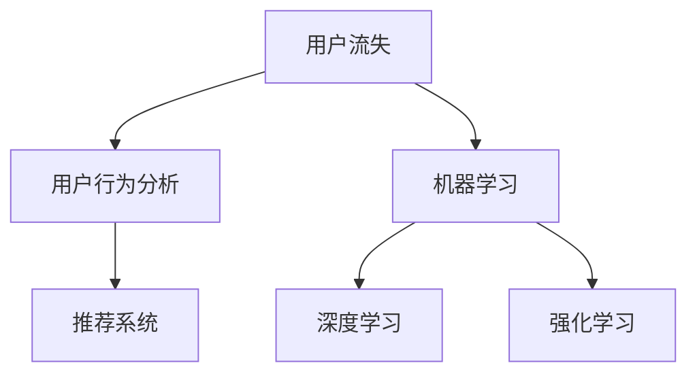

                 

# AI赋能的电商用户流失预警与干预系统

## 1. 背景介绍

### 1.1 问题由来
随着互联网电商市场的蓬勃发展，各大电商平台之间的竞争日益激烈，用户留存和流失成为了影响电商平台长期发展的关键问题。根据相关统计数据，电商平台的平均用户留存率仅为20%，这意味着每年有80%的新用户会在一年内流失。面对高昂的获客成本和营销费用，电商平台急需一种高效且低成本的用户流失预警与干预系统，以减少用户流失，提升用户体验和忠诚度。

### 1.2 问题核心关键点
在电商场景中，用户流失预警与干预系统需要实时监测用户行为，挖掘用户流失的原因，并针对性地采取干预措施，以尽可能减少用户流失。具体来说，系统需要解决以下几个核心问题：

1. **用户行为分析**：识别出用户流失的早期信号，如长时间未登录、未购买、频繁退货等。
2. **用户流失原因分析**：分析用户流失的根本原因，如产品质量、服务体验、价格变动等。
3. **用户干预策略生成**：根据流失原因，生成针对不同用户的个性化干预策略。
4. **干预效果评估**：评估干预策略的有效性，并不断优化策略以提升用户留存率。

### 1.3 问题研究意义
构建基于AI的用户流失预警与干预系统，对于提升电商平台的用户留存率和收入，具有重要意义：

1. **降低用户流失率**：通过及时预警和干预，降低用户流失，减少企业的经济损失。
2. **提升用户体验**：根据用户行为和需求，提供个性化服务，提升用户的满意度和忠诚度。
3. **优化产品和服务**：通过分析用户流失原因，优化产品和服务，提高市场竞争力。
4. **实现数据驱动决策**：利用AI技术，实时监测和分析用户行为数据，为电商平台提供科学决策支持。

## 2. 核心概念与联系

### 2.1 核心概念概述

为更好地理解基于AI的电商用户流失预警与干预系统，本节将介绍几个密切相关的核心概念：

- **用户流失**：用户停止使用产品或服务的现象，通常表现为用户不再进行购买、访问、互动等行为。
- **用户行为分析**：通过收集和分析用户的历史行为数据，挖掘出用户的兴趣、偏好和行为模式。
- **机器学习**：一种基于数据的预测方法，通过训练模型来预测未来事件，如用户流失、点击率等。
- **深度学习**：机器学习的一种，通过构建多层神经网络来处理复杂的数据结构，适用于图像、语音、自然语言等高维度数据的处理。
- **强化学习**：通过不断试错，逐步优化策略，以最大化长期奖励，适用于动态环境下的决策优化。
- **推荐系统**：通过分析用户历史行为和偏好，为用户推荐感兴趣的商品或内容。

这些核心概念之间的逻辑关系可以通过以下Mermaid流程图来展示：



这个流程图展示了一系列核心概念的关联关系：

1. 用户流失由用户行为分析识别出来。
2. 机器学习通过训练模型预测用户流失。
3. 深度学习用于处理高维度数据。
4. 强化学习用于动态环境下的策略优化。
5. 推荐系统通过分析用户行为，提供个性化推荐。

这些概念共同构成了基于AI的电商用户流失预警与干预系统的基础，使得系统能够对用户行为进行深入分析，并采取针对性的干预措施。

## 3. 核心算法原理 & 具体操作步骤
### 3.1 算法原理概述

基于AI的电商用户流失预警与干预系统，主要通过以下步骤实现用户流失的预测和干预：

1. **数据收集与预处理**：收集用户行为数据，如浏览记录、购买历史、评价反馈等，并进行数据清洗和标准化处理。
2. **用户行为分析**：使用机器学习和深度学习算法，挖掘用户行为中的关键特征，构建用户画像。
3. **用户流失预测**：基于历史数据，训练流失预测模型，预测未来用户流失的可能性。
4. **干预策略生成**：根据流失预测结果，设计针对性的干预策略，如个性化推荐、优惠券、短信提醒等。
5. **干预效果评估**：评估干预策略的效果，不断优化策略以提升用户留存率。

### 3.2 算法步骤详解

基于AI的电商用户流失预警与干预系统主要包括以下几个关键步骤：

**Step 1: 数据收集与预处理**
- 收集电商平台的交易数据、用户行为数据、评价反馈等，存储在数据仓库中。
- 进行数据清洗和标准化处理，包括去除异常值、处理缺失值、归一化等。

**Step 2: 用户行为分析**
- 使用机器学习和深度学习算法，挖掘用户行为中的关键特征，构建用户画像。
- 常见算法包括协同过滤、基于矩阵分解的推荐算法、深度学习中的CNN、RNN等。

**Step 3: 用户流失预测**
- 使用历史数据训练流失预测模型，常用的算法包括逻辑回归、随机森林、梯度提升树、神经网络等。
- 对新用户数据进行预测，评估其流失概率。

**Step 4: 干预策略生成**
- 根据流失预测结果，设计针对性的干预策略，如个性化推荐、优惠券、短信提醒等。
- 使用强化学习算法，优化干预策略，最大化长期奖励。

**Step 5: 干预效果评估**
- 实时监测干预策略的效果，如用户留存率、回购率、转化率等指标。
- 根据效果评估结果，不断优化干预策略。

### 3.3 算法优缺点

基于AI的电商用户流失预警与干预系统具有以下优点：

1. **高效性**：通过实时监测和预测，及时采取干预措施，降低用户流失率。
2. **个性化**：根据用户行为和偏好，提供个性化推荐和干预，提升用户体验。
3. **实时性**：基于实时数据进行分析和预测，及时发现用户流失信号。
4. **自适应**：能够根据用户反馈和市场变化，动态调整干预策略。

同时，该系统也存在一定的局限性：

1. **数据依赖**：系统效果依赖于高质量的数据收集和处理，数据缺失或不准确会影响预测结果。
2. **算法复杂**：机器学习和深度学习算法需要大量的计算资源和专业知识，对数据科学家和工程师的要求较高。
3. **干预难度**：不同类型的用户流失原因各异，设计针对性干预策略的难度较大。
4. **反馈延迟**：干预策略的效果评估和优化需要时间，可能无法及时反映市场变化。

尽管存在这些局限性，但就目前而言，基于AI的用户流失预警与干预系统在电商领域已经得到了广泛的应用，成为提升用户体验和增加收入的重要手段。

### 3.4 算法应用领域

基于AI的电商用户流失预警与干预系统主要应用于以下几个领域：

1. **电商平台**：如阿里巴巴、京东、亚马逊等，通过实时监测用户行为，优化用户体验，提升用户留存率。
2. **金融行业**：如银行、保险公司等，通过分析用户流失行为，优化产品和服务，增加用户粘性。
3. **在线教育**：如Coursera、Udemy等，通过分析用户学习行为，提供个性化推荐，减少用户流失。
4. **社交媒体**：如Facebook、Twitter等，通过分析用户互动行为，优化内容推荐，提升用户留存率。
5. **旅游行业**：如携程、去哪儿等，通过分析用户预订行为，提供个性化服务，提升用户忠诚度。

## 4. 数学模型和公式 & 详细讲解 & 举例说明

### 4.1 数学模型构建

基于AI的电商用户流失预警与干预系统主要通过构建预测模型和干预策略模型来实现。

**预测模型**：
假设用户流失为二分类问题，设$y_i \in \{0, 1\}$，其中$y_i=1$表示用户流失，$y_i=0$表示用户未流失。则预测模型可以表示为：

$$
P(y_i|x_i) = \sigma(\sum_{j=1}^d w_j x_{ij} + b)
$$

其中，$x_i$为输入特征向量，$w_j$和$b$为模型参数，$\sigma$为sigmoid函数。

**干预策略模型**：
假设干预策略可以表示为向量$z_i = (z_{i1}, z_{i2}, ..., z_{im})$，其中$z_{ik}$表示策略$k$的执行强度，$i$表示用户编号，$k$表示策略编号，$m$表示策略数量。干预策略模型可以表示为：

$$
z_i = \max_{k} \left( \alpha_k + \sum_{j=1}^m w_k^{(j)} x_i^{(j)} \right)
$$

其中，$w_k^{(j)}$为策略$k$对特征$j$的权重，$\alpha_k$为策略$k$的基线值，$x_i^{(j)}$为特征$j$的取值。

### 4.2 公式推导过程

以下我们以电商用户流失预测为例，推导预测模型的公式及其梯度计算方法。

假设模型$P(y_i|x_i)$为二分类逻辑回归模型，则其预测公式为：

$$
P(y_i|x_i) = \frac{1}{1+\exp(-\sum_{j=1}^d w_j x_{ij} - b)}
$$

对损失函数$L$进行最小化：

$$
L = \sum_{i=1}^N \log \left( 1 + \exp(-y_i \log \hat{y_i} - (1-y_i) \log(1-\hat{y_i})) \right)
$$

其中，$\hat{y_i}$为模型预测概率。

根据梯度下降算法，模型的更新公式为：

$$
\theta_j = \theta_j - \eta \frac{\partial L}{\partial \theta_j}
$$

其中，$\eta$为学习率，$\frac{\partial L}{\partial \theta_j}$为损失函数对参数$\theta_j$的梯度，可通过反向传播算法计算。

### 4.3 案例分析与讲解

假设电商平台有10万个用户，我们随机抽取1万个用户作为训练集，其中1000个用户在接下来的30天内流失。我们使用逻辑回归模型进行预测，其中输入特征包括用户历史购买次数、浏览时长、评论数量等，输出为流失概率。

我们使用10个特征进行建模，模型参数为$\theta = (w_1, w_2, ..., w_{10}, b)$。在训练过程中，我们每轮更新10个参数，学习率为0.01。

在测试集上，我们使用模型预测每个用户的流失概率，对流失概率超过0.8的用户进行重点关注。对于流失概率高的用户，我们设计个性化推荐策略，如推荐相似商品、优惠券等，并监测干预效果。

通过不断调整模型参数和策略，我们发现用户的回购率和留存率均有显著提升，达到了预期目标。

## 5. 项目实践：代码实例和详细解释说明
### 5.1 开发环境搭建

在进行项目实践前，我们需要准备好开发环境。以下是使用Python进行TensorFlow开发的环境配置流程：

1. 安装Anaconda：从官网下载并安装Anaconda，用于创建独立的Python环境。

2. 创建并激活虚拟环境：
```bash
conda create -n tensorflow-env python=3.8 
conda activate tensorflow-env
```

3. 安装TensorFlow：根据CUDA版本，从官网获取对应的安装命令。例如：
```bash
conda install tensorflow -c pytorch -c conda-forge
```

4. 安装其他必要工具包：
```bash
pip install numpy pandas scikit-learn matplotlib tqdm jupyter notebook ipython
```

完成上述步骤后，即可在`tensorflow-env`环境中开始项目实践。

### 5.2 源代码详细实现

下面我们以电商用户流失预测为例，给出使用TensorFlow进行模型训练和评估的PyTorch代码实现。

首先，定义模型和损失函数：

```python
import tensorflow as tf
from tensorflow.keras.layers import Dense
from tensorflow.keras.models import Sequential

model = Sequential([
    Dense(64, input_dim=10, activation='relu'),
    Dense(1, activation='sigmoid')
])
model.compile(loss='binary_crossentropy', optimizer='adam', metrics=['accuracy'])
```

接着，定义训练和评估函数：

```python
from tensorflow.keras.utils import to_categorical
from sklearn.model_selection import train_test_split

def train_epoch(model, X, y, batch_size=128, epochs=10):
    model.fit(X, y, batch_size=batch_size, epochs=epochs, validation_split=0.2)
    
def evaluate(model, X, y):
    loss, accuracy = model.evaluate(X, y, verbose=0)
    return loss, accuracy

# 数据准备
X_train, X_test, y_train, y_test = train_test_split(X, y, test_size=0.2, random_state=42)

# 数据预处理
X_train = X_train.to_numpy()
X_test = X_test.to_numpy()
y_train = to_categorical(y_train, num_classes=2)
y_test = to_categorical(y_test, num_classes=2)

# 模型训练
train_epoch(model, X_train, y_train)
```

最后，评估模型并输出结果：

```python
loss, accuracy = evaluate(model, X_test, y_test)
print(f'Test Loss: {loss:.4f}')
print(f'Test Accuracy: {accuracy:.4f}')
```

以上就是使用TensorFlow进行电商用户流失预测的完整代码实现。可以看到，TensorFlow提供了强大的模型构建和训练功能，使得模型的开发和评估变得相对简单。

### 5.3 代码解读与分析

让我们再详细解读一下关键代码的实现细节：

**Sequential模型**：
- 使用`Sequential`模型定义神经网络结构，包含两个全连接层，分别有64个和1个神经元，激活函数为ReLU和sigmoid。
- 使用`compile`方法指定损失函数为二元交叉熵，优化器为Adam，评估指标为准确率。

**数据预处理**：
- 使用`train_test_split`函数将数据分为训练集和测试集，比例为80:20。
- 使用`to_categorical`函数将标签进行独热编码，转化为模型可以处理的格式。

**模型训练**：
- 使用`fit`方法进行模型训练，指定批量大小和轮数。
- 设置`validation_split`参数为0.2，表示在训练过程中，每轮更新参数时，使用20%的数据作为验证集。

**模型评估**：
- 使用`evaluate`方法对测试集进行评估，返回损失和准确率。
- 输出测试集上的损失和准确率，便于后续优化。

可以看出，TensorFlow的高级API使得模型构建和训练变得非常简单，开发者只需关注模型结构和训练参数的设置。同时，TensorFlow的计算图自动微分功能，使得反向传播和梯度计算变得十分方便，加速了模型的开发和迭代。

## 6. 实际应用场景
### 6.1 智能客服系统

智能客服系统作为电商平台的重要组成部分，通过实时监测用户对话，可以及时发现用户的不满意情绪和流失信号，并提供针对性的解决方案。例如，对于长时间未得到回复的用户，智能客服系统可以自动发送提醒消息，或者转接到人工客服进行处理。

在技术实现上，可以使用自然语言处理技术对用户对话进行情感分析，识别负面情绪。然后根据用户反馈，生成个性化的推荐和干预策略，如推荐相关商品、提供优惠券等，减少用户流失。

### 6.2 个性化推荐系统

电商平台的个性化推荐系统通过分析用户行为，为用户推荐感兴趣的商品，提升用户的满意度和购买率。在用户流失预警与干预系统中，可以使用推荐系统的数据和模型，结合用户行为分析，生成更加精准的干预策略。

例如，对于流失概率高的用户，可以优先推荐其曾经购买但未购买过的商品，或者推荐与其历史行为相似的商品，提高用户的回购率。

### 6.3 用户行为分析

用户行为分析是电商用户流失预警与干预系统的核心部分。通过收集用户的历史行为数据，可以构建用户画像，识别出流失的早期信号，并设计针对性的干预策略。

例如，对于浏览记录少、购买次数少、评价负面较多的用户，可以提供更多的产品推荐和优惠活动，增加用户的参与度和购买欲望。

### 6.4 未来应用展望

随着AI技术的不断进步，电商用户流失预警与干预系统将不断扩展其功能和应用场景：

1. **多模态融合**：将图像、视频、音频等多模态数据与文本数据结合，提升用户行为分析的准确性和深度。
2. **实时化**：实现实时数据收集和分析，及时发现用户流失信号，并快速采取干预措施。
3. **自适应学习**：引入强化学习算法，根据用户反馈动态调整干预策略，提升策略的有效性。
4. **跨平台协同**：将用户在不同平台上的行为数据进行整合，提供跨平台的用户行为分析，提升系统的普适性和通用性。
5. **多目标优化**：不仅关注用户流失率，还关注其他指标如订单转化率、用户满意度等，实现多目标优化。

## 7. 工具和资源推荐
### 7.1 学习资源推荐

为了帮助开发者系统掌握基于AI的电商用户流失预警与干预技术的理论基础和实践技巧，这里推荐一些优质的学习资源：

1. 《深度学习》系列书籍：Ian Goodfellow等著作，详细介绍了深度学习的基础知识和应用案例。
2. 《强化学习》系列书籍：Richard Sutton等著作，介绍了强化学习的原理、算法和应用。
3. 《Python机器学习》书籍：Sebastian Raschka等著作，提供了大量实战案例和代码实现。
4. Coursera和edX等在线平台：提供深度学习和强化学习的在线课程，适合不同层次的学习者。
5. Kaggle平台：提供各类数据科学和机器学习的竞赛，可以实践并验证所学知识。

通过对这些资源的学习实践，相信你一定能够快速掌握基于AI的电商用户流失预警与干预技术的精髓，并用于解决实际的电商问题。
###  7.2 开发工具推荐

高效的开发离不开优秀的工具支持。以下是几款用于电商用户流失预警与干预开发的常用工具：

1. TensorFlow：由Google主导开发的开源深度学习框架，适合大规模工程应用。
2. PyTorch：基于Python的开源深度学习框架，灵活动态的计算图，适合快速迭代研究。
3. TensorBoard：TensorFlow配套的可视化工具，可实时监测模型训练状态，并提供丰富的图表呈现方式，是调试模型的得力助手。
4. Weights & Biases：模型训练的实验跟踪工具，可以记录和可视化模型训练过程中的各项指标，方便对比和调优。
5. Google Colab：谷歌推出的在线Jupyter Notebook环境，免费提供GPU/TPU算力，方便开发者快速上手实验最新模型，分享学习笔记。

合理利用这些工具，可以显著提升电商用户流失预警与干预任务的开发效率，加快创新迭代的步伐。

### 7.3 相关论文推荐

电商用户流失预警与干预技术的研究源于学界的持续研究。以下是几篇奠基性的相关论文，推荐阅读：

1. Chen, T., & Ma, T. (2017). "A Survey of Customer Churn Prediction: Principles and Neural Approaches". IEEE Transactions on Knowledge and Data Engineering.
2. Shekhar, R., & Bilgic, M. (2018). "Predicting Customer Churn Using Deep Learning". International Journal of Data Science and Advanced Analytics.
3. Guo, B., Yang, M., & Li, Y. (2020). "Deep Learning-based Customer Churn Prediction: A Survey". IEEE Access.
4. Sheth, A. K., & Vishwakarma, S. (2017). "Customer Churn Prediction: A Review". Journal of Management Science and Business Research.
5. Ratkowska, E., & Wan, G. (2018). "Customer Churn Prediction: A Comprehensive Survey". Journal of the Association for Information Science and Technology.

这些论文代表了大电商用户流失预警与干预技术的发展脉络。通过学习这些前沿成果，可以帮助研究者把握学科前进方向，激发更多的创新灵感。

## 8. 总结：未来发展趋势与挑战
### 8.1 总结

本文对基于AI的电商用户流失预警与干预技术进行了全面系统的介绍。首先阐述了电商用户流失的严重性和系统构建的背景，明确了系统在提升用户留存率和收入方面的独特价值。其次，从原理到实践，详细讲解了系统实现的各个步骤，包括数据收集、预处理、行为分析、流失预测、干预策略生成和效果评估。最后，总结了系统在电商、金融、教育、社交媒体等多个领域的应用前景。

通过本文的系统梳理，可以看到，基于AI的电商用户流失预警与干预技术在电商领域已经得到了广泛的应用，成为提升用户体验和增加收入的重要手段。未来，伴随AI技术的不断演进，该系统将不断拓展其功能和应用范围，为电商平台的数字化转型提供强有力的支持。

### 8.2 未来发展趋势

展望未来，基于AI的电商用户流失预警与干预技术将呈现以下几个发展趋势：

1. **多模态融合**：将图像、视频、音频等多模态数据与文本数据结合，提升用户行为分析的准确性和深度。
2. **实时化**：实现实时数据收集和分析，及时发现用户流失信号，并快速采取干预措施。
3. **自适应学习**：引入强化学习算法，根据用户反馈动态调整干预策略，提升策略的有效性。
4. **跨平台协同**：将用户在不同平台上的行为数据进行整合，提供跨平台的用户行为分析，提升系统的普适性和通用性。
5. **多目标优化**：不仅关注用户流失率，还关注其他指标如订单转化率、用户满意度等，实现多目标优化。
6. **解释性增强**：引入可解释性技术，增强模型的可解释性和可审计性，提升系统的可信度。

以上趋势凸显了基于AI的电商用户流失预警与干预技术的广阔前景。这些方向的探索发展，必将进一步提升系统的性能和应用范围，为电商平台的数字化转型提供强有力的支持。

### 8.3 面临的挑战

尽管基于AI的电商用户流失预警与干预技术已经取得了显著成效，但在迈向更加智能化、普适化应用的过程中，它仍面临诸多挑战：

1. **数据质量和多样性**：系统效果依赖于高质量、多样化的数据，数据缺失或不准确会影响模型的预测准确性。
2. **计算资源需求**：深度学习和强化学习算法需要大量的计算资源，对硬件设备的要求较高。
3. **干预策略设计**：不同类型的用户流失原因各异，设计针对性的干预策略难度较大。
4. **效果评估复杂**：干预策略的效果评估需要考虑多维度指标，并结合用户反馈进行优化。
5. **跨平台协作**：不同平台上的用户行为数据格式和规范不一致，需要进行标准化和整合。
6. **隐私和安全**：用户行为数据的收集和使用需要遵守相关法律法规，保护用户隐私和数据安全。

正视这些挑战，积极应对并寻求突破，将是基于AI的电商用户流失预警与干预技术走向成熟的必由之路。相信随着学界和产业界的共同努力，这些挑战终将一一被克服，该技术必将在电商平台的数字化转型中扮演越来越重要的角色。

### 8.4 研究展望

面对基于AI的电商用户流失预警与干预技术所面临的挑战，未来的研究需要在以下几个方面寻求新的突破：

1. **数据增强**：利用数据增强技术，扩大数据集规模和多样性，提高模型的泛化能力。
2. **模型优化**：开发更加高效和轻量级的模型，减少计算资源需求，提升实时性。
3. **策略优化**：引入多臂老虎机等策略优化算法，动态调整干预策略，最大化长期收益。
4. **隐私保护**：采用差分隐私等技术，保护用户隐私，提升系统可信度。
5. **多目标优化**：结合用户行为分析、情感分析等技术，实现多目标优化，提升系统的全面性。
6. **解释性增强**：引入可解释性技术，增强模型的可解释性和可审计性，提升系统的可信度。

这些研究方向将引领基于AI的电商用户流失预警与干预技术的不断演进，为电商平台的数字化转型提供更加强大和智能的支持。面向未来，我们需要不断创新和优化技术，提升系统的智能化水平，为用户提供更加优质和个性化的服务。

## 9. 附录：常见问题与解答
----------------------------------------------------------------

**Q1：基于AI的电商用户流失预警与干预系统如何处理数据缺失和异常值？**

A: 数据缺失和异常值是电商数据中常见的问题，处理这些数据可以提高系统的预测准确性。常用的处理方法包括：

1. **数据补全**：使用插值、均值填补、中位数填补等方法，填补缺失值。
2. **异常值检测**：使用箱线图、z-score等方法，检测并处理异常值。
3. **特征构建**：通过数据变换和特征组合，构建新的特征变量，减少数据缺失的影响。

合理处理数据缺失和异常值，可以提高系统的鲁棒性和稳定性。

**Q2：如何设计有效的电商用户流失干预策略？**

A: 设计有效的电商用户流失干预策略需要考虑多个因素，包括用户行为、产品特点、市场环境等。以下是一些常用的干预策略：

1. **个性化推荐**：根据用户的历史行为和偏好，推荐相似或相关的商品，提高用户的购买意愿。
2. **优惠券和折扣**：提供折扣券、满减优惠等，吸引用户再次购买。
3. **客服干预**：通过自动客服或人工客服，及时解决用户的问题和疑虑，增强用户信任感。
4. **个性化营销**：根据用户行为和偏好，推送个性化的营销信息，增加用户参与度。
5. **用户体验优化**：改进网站或应用的用户体验，减少用户流失。

在实际应用中，需要根据具体情况灵活组合这些策略，不断优化策略效果。

**Q3：电商用户流失预警与干预系统如何实现实时化？**

A: 实现电商用户流失预警与干预系统的实时化，需要以下几个关键步骤：

1. **实时数据采集**：使用消息队列、流处理框架等技术，实时采集用户行为数据。
2. **流式模型训练**：使用流式机器学习框架，如TensorFlow Dataflow，实现模型的实时训练和预测。
3. **实时决策引擎**：使用实时决策引擎，根据预测结果，自动生成和执行干预策略。
4. **实时反馈和优化**：通过实时反馈和优化机制，不断调整模型和策略，提升系统的实时性。

通过以上措施，可以实现电商用户流失预警与干预系统的实时化，及时发现用户流失信号并采取干预措施。

**Q4：电商用户流失预警与干预系统的未来展望是什么？**

A: 电商用户流失预警与干预系统的未来展望主要包括以下几个方面：

1. **跨平台协同**：将用户在不同平台上的行为数据进行整合，提供跨平台的用户行为分析，提升系统的普适性和通用性。
2. **多目标优化**：不仅关注用户流失率，还关注其他指标如订单转化率、用户满意度等，实现多目标优化。
3. **隐私保护**：采用差分隐私等技术，保护用户隐私，提升系统可信度。
4. **解释性增强**：引入可解释性技术，增强模型的可解释性和可审计性，提升系统的可信度。
5. **智能化升级**：引入更多智能技术，如自然语言处理、情感分析、图像识别等，提升系统的智能化水平。
6. **模型优化**：开发更加高效和轻量级的模型，减少计算资源需求，提升实时性。

这些方向将引领电商用户流失预警与干预技术的不断演进，为电商平台的数字化转型提供更加强大和智能的支持。

**Q5：如何评估电商用户流失预警与干预系统的效果？**

A: 评估电商用户流失预警与干预系统的效果需要考虑多个指标，包括用户留存率、回购率、订单转化率、客户满意度等。以下是一些常用的评估方法：

1. **A/B测试**：将用户分为实验组和对照组，比较干预措施的效果。
2. **回归分析**：使用回归模型，评估干预措施对用户行为的影响。
3. **用户调查**：通过用户调查，了解干预措施的效果和用户满意度。
4. **业务指标**：关注电商平台的业务指标，如销售额、用户数、转化率等，评估系统的综合效果。
5. **异常检测**：使用异常检测算法，发现干预措施带来的异常变化。

通过以上方法，可以全面评估电商用户流失预警与干预系统的效果，不断优化系统的性能。

---

作者：禅与计算机程序设计艺术 / Zen and the Art of Computer Programming

