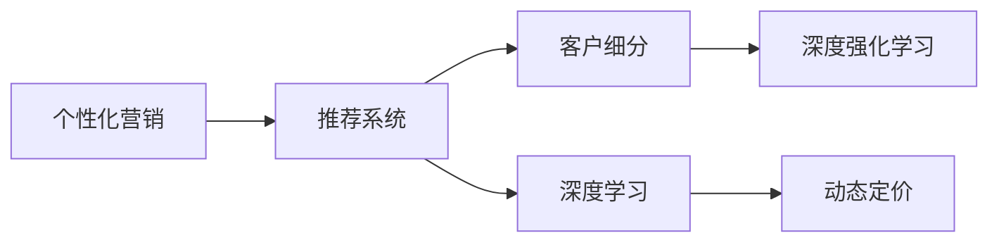

                 

# AI驱动的个性化营销新模式

> 关键词：人工智能, 个性化营销, 推荐系统, 客户细分, 深度学习, 深度强化学习

## 1. 背景介绍

随着互联网和电子商务的迅猛发展，企业面临的市场竞争日益激烈。如何在众多竞争者中脱颖而出，吸引和留住客户，成为企业最为关注的焦点。传统的营销方式，如广告、促销等，往往以群体化策略为主，难以精准触达个体客户。而个性化营销技术，通过深入分析客户行为和偏好，实现定制化的营销策略，成为当下最为前沿的营销手段。

个性化营销的核心理念是“一对一的精准营销”。根据每个客户的具体需求和行为，量身定制个性化的产品、服务和广告，从而达到最佳的营销效果。但实现个性化营销并非易事，需要借助先进的数据分析和人工智能技术，才能大规模、高效地进行。本文将详细介绍AI驱动的个性化营销新模式，揭示其背后的核心算法和技术架构。

## 2. 核心概念与联系

### 2.1 核心概念概述

为了更好地理解个性化营销的AI驱动模式，首先需要澄清一些关键概念：

- **个性化营销**：指针对每个客户的具体需求和偏好，量身定制个性化的产品、服务和广告，以提高客户满意度和转化率。

- **推荐系统**：利用用户行为数据，预测用户可能感兴趣的物品或内容，从而推荐给用户，实现个性化推荐。

- **客户细分**：将客户划分为不同群体，针对不同群体的需求进行个性化定制。

- **深度学习**：通过多层神经网络模型，从数据中提取高层次的抽象特征，用于分类、预测和推荐等任务。

- **深度强化学习**：结合强化学习算法和深度学习模型，优化决策策略，实现个性化推荐和广告投放。

- **动态定价**：根据市场和用户行为，动态调整商品价格，以提高销售效率和利润。

这些概念之间的逻辑关系可以通过以下Mermaid流程图来展示：



这个流程图展示了个性化营销的核心组件及其之间的关系：

1. 个性化营销以推荐系统为核心，利用深度学习模型进行用户行为预测。
2. 推荐系统通过客户细分，将用户划分为不同的群体，实现更精准的推荐。
3. 深度强化学习算法进一步优化推荐策略，提高用户体验和转化率。
4. 动态定价结合用户行为数据，实现更灵活的销售策略。

## 3. 核心算法原理 & 具体操作步骤

### 3.1 算法原理概述

AI驱动的个性化营销模式，其核心算法包括推荐系统、深度学习和强化学习。这些算法共同作用，实现对用户行为的精准预测和个性化推荐。

- **推荐系统**：利用协同过滤、基于内容的推荐等技术，根据用户的历史行为和兴趣，预测其可能感兴趣的商品或服务。

- **深度学习**：通过多层神经网络模型，对用户行为数据进行特征提取和建模，从而实现更准确的预测和推荐。

- **强化学习**：通过模拟用户与系统的交互过程，不断调整推荐策略，优化用户体验和转化率。

这些算法的综合运用，使得个性化营销能够基于实时数据，动态调整推荐策略，提升用户的满意度和忠诚度，从而实现销售转化率的提升。

### 3.2 算法步骤详解

AI驱动的个性化营销系统主要由以下几个步骤组成：

1. **数据收集**：收集用户行为数据，如浏览历史、购买记录、搜索关键词等。

2. **用户画像建立**：通过分析用户行为数据，建立用户的兴趣模型和行为特征。

3. **物品/服务推荐**：根据用户画像，利用推荐算法预测用户可能感兴趣的商品或服务，生成推荐列表。

4. **实时交互优化**：通过动态调整推荐策略，提高用户体验和转化率。

5. **效果评估**：实时监测推荐系统的表现，评估模型的效果和推荐质量。

6. **持续优化**：根据评估结果，持续优化模型和推荐策略，提升推荐准确率和用户满意度。

### 3.3 算法优缺点

AI驱动的个性化营销模式，相较于传统的营销方式，具有以下优点：

- **精准性高**：通过深度学习和强化学习算法，可以实现对用户行为的高精度预测，实现精准推荐。
- **用户体验好**：推荐系统能够根据用户行为，动态调整推荐内容，提高用户的满意度和忠诚度。
- **销售转化率高**：个性化推荐能够提升用户的购买意愿，从而提高销售转化率。

但同时也存在一些缺点：

- **数据需求高**：实现个性化推荐，需要大量用户行为数据，数据隐私和安全问题值得关注。
- **算法复杂度高**：深度学习算法训练复杂，需要大量的计算资源和训练时间。
- **用户隐私保护**：推荐系统需要收集和处理大量用户数据，如何保护用户隐私，避免数据滥用，是一个重要问题。
- **冷启动问题**：对于新用户，由于缺乏历史数据，推荐系统难以给出准确推荐，需要设计冷启动解决方案。

### 3.4 算法应用领域

AI驱动的个性化营销模式，已经在多个行业和应用中得到了广泛应用：

- **电子商务**：亚马逊、淘宝等电商平台，利用个性化推荐系统，提升用户购物体验，增加销售转化率。
- **内容平台**：Netflix、YouTube等视频平台，通过个性化推荐，提高用户粘性，增加用户留存率。
- **广告投放**：谷歌、Facebook等广告平台，利用个性化推荐和动态定价，优化广告投放策略，提升广告效果。
- **金融服务**：银行业利用个性化推荐系统，为个人和企业提供定制化的金融产品，提升客户满意度。
- **旅游服务**：携程、去哪儿等旅游平台，通过个性化推荐，提升用户旅游体验，增加预订量。

## 4. 数学模型和公式 & 详细讲解  
### 4.1 数学模型构建

个性化推荐系统通常使用协同过滤和基于内容的推荐算法。协同过滤算法通过分析用户行为数据，找到相似用户群体，从而预测新用户的偏好。基于内容的推荐算法则根据物品的特征，预测用户可能感兴趣的物品。以下是两种推荐算法的数学模型：

#### 协同过滤算法

协同过滤算法包括基于用户的协同过滤和基于物品的协同过滤。以基于用户的协同过滤为例，其数学模型为：

$$
\hat{r}_{ui} = \frac{\sum_{j=1}^N r_{uj} \times a_{ji}}{\sqrt{\sum_{j=1}^N a_{uj}^2}}
$$

其中 $r_{uj}$ 为用户 $u$ 对物品 $j$ 的评分，$a_{ji}$ 为物品 $j$ 对用户 $i$ 的评分，$N$ 为物品数量。该模型通过计算用户之间的相似度，预测新用户对物品的评分。

#### 基于内容的推荐算法

基于内容的推荐算法通过计算物品之间的相似度，推荐用户可能感兴趣的新物品。以基于余弦相似度的推荐算法为例，其数学模型为：

$$
similarity(i,j) = \frac{\vec{v}_i \cdot \vec{v}_j}{||\vec{v}_i|| \times ||\vec{v}_j||}
$$

其中 $\vec{v}_i$ 和 $\vec{v}_j$ 分别为物品 $i$ 和物品 $j$ 的特征向量。该模型通过计算物品之间的相似度，推荐用户可能感兴趣的新物品。

### 4.2 公式推导过程

以协同过滤算法为例，进行数学模型的推导：

1. **用户相似度计算**：

   $$
   similarity(u,v) = \frac{\sum_{j=1}^N r_{uj} \times r_{vj}}{\sqrt{\sum_{j=1}^N r_{uj}^2} \times \sqrt{\sum_{j=1}^N r_{vj}^2}}
   $$

2. **新用户评分预测**：

   $$
   \hat{r}_{ui} = \frac{\sum_{j=1}^N r_{uj} \times a_{ji}}{\sqrt{\sum_{j=1}^N a_{uj}^2}}
   $$

3. **推荐物品选择**：

   $$
   i_{max} = \arg\max_i \hat{r}_{ui}
   $$

4. **推荐物品排序**：

   $$
   rank = \text{sorted}(i_{max})
   $$

### 4.3 案例分析与讲解

以Netflix推荐系统为例，分析其实现原理和技术细节：

1. **数据收集**：Netflix收集用户的观看历史、评分数据、设备信息等，用于推荐系统的训练。

2. **用户画像建立**：利用协同过滤算法，分析用户行为数据，建立用户兴趣模型。

3. **物品/服务推荐**：结合基于内容的推荐算法和协同过滤算法，预测用户可能感兴趣的新电影，生成推荐列表。

4. **实时交互优化**：通过动态调整推荐策略，提高用户体验和转化率。

5. **效果评估**：实时监测推荐系统的表现，评估模型的效果和推荐质量。

6. **持续优化**：根据评估结果，持续优化模型和推荐策略，提升推荐准确率和用户满意度。

Netflix的推荐系统，通过深度学习和强化学习算法，实现了对用户行为的精准预测和个性化推荐。其推荐算法能够实时调整推荐策略，提升用户体验和转化率。Netflix的成功经验，为其他企业的个性化营销提供了重要参考。

## 5. 项目实践：代码实例和详细解释说明
### 5.1 开发环境搭建

在进行个性化营销的AI驱动模式开发前，我们需要准备好开发环境。以下是使用Python进行Scikit-learn开发的环境配置流程：

1. 安装Anaconda：从官网下载并安装Anaconda，用于创建独立的Python环境。

2. 创建并激活虚拟环境：
```bash
conda create -n recommendation-env python=3.8 
conda activate recommendation-env
```

3. 安装Scikit-learn和其他机器学习库：
```bash
conda install scikit-learn matplotlib pandas scikit-learn tqdm joblib
```

4. 安装TensorFlow：
```bash
pip install tensorflow
```

5. 安装TensorBoard：
```bash
pip install tensorboard
```

完成上述步骤后，即可在`recommendation-env`环境中开始推荐系统的开发。

### 5.2 源代码详细实现

下面以协同过滤算法为例，给出推荐系统的PyTorch代码实现。

```python
import torch
import torch.nn as nn
import torch.nn.functional as F
from sklearn.metrics import mean_absolute_error

class协同过滤(nn.Module):
    def __init__(self, N):
        super(协同过滤, self).__init__()
        self.W = nn.Parameter(torch.randn(N, N))
    
    def forward(self, u):
        similarity = torch.matmul(u, self.W)
        max_similarity = similarity.max(dim=1)[0]
        return max_similarity
    
    def train(self, train_data, val_data, epochs=10, batch_size=64):
        optimizer = torch.optim.Adam(self.parameters(), lr=0.01)
        train_losses = []
        val_losses = []
        
        for epoch in range(epochs):
            for u in train_data:
                optimizer.zero_grad()
                predictions = self(u)
                loss = F.mse_loss(predictions, u)
                loss.backward()
                optimizer.step()
            
            train_losses.append(loss.item())
            val_loss = self.evaluate(val_data)
            val_losses.append(val_loss)
            print(f"Epoch {epoch+1}, train loss: {train_losses[-1]:.4f}, val loss: {val_losses[-1]:.4f}")
        
        return train_losses, val_losses
    
    def evaluate(self, data):
        predictions = []
        for u in data:
            predictions.append(self(u).item())
        return mean_absolute_error(data, predictions)
```

在上述代码中，我们定义了协同过滤模型，并进行训练和评估。

**train方法**：定义训练函数，根据给定的训练数据进行模型训练。

**evaluate方法**：定义评估函数，计算模型在验证集上的表现。

通过上述代码，你可以轻松搭建基于协同过滤算法的推荐系统，并对其进行训练和评估。

### 5.3 代码解读与分析

让我们再详细解读一下关键代码的实现细节：

**协同过滤模型**：
- 继承自`nn.Module`，定义模型类。
- 初始化函数`__init__`：初始化模型参数`W`，其中`W`为协方差矩阵。
- 前向传播函数`forward`：计算用户之间的相似度，预测新用户评分。
- 训练函数`train`：定义训练函数，计算损失函数并进行反向传播。
- 评估函数`evaluate`：定义评估函数，计算模型在验证集上的表现。

通过以上代码，可以看出基于协同过滤的推荐系统，其核心在于计算用户之间的相似度，并预测新用户评分。模型的训练和评估过程，也是基于损失函数和反向传播算法实现的。

## 6. 实际应用场景

### 6.1 电子商务

在电子商务领域，个性化推荐系统已经成为企业提升用户体验和销售转化率的重要手段。以淘宝为例，通过个性化推荐系统，淘宝能够实时分析用户的浏览和购买行为，为其推荐可能感兴趣的商品，提升用户的购买意愿和忠诚度。

淘宝的推荐系统，通过深度学习和协同过滤算法，实现对用户行为的精准预测和个性化推荐。用户登录淘宝后，系统会根据其浏览历史、购买记录等行为数据，生成个性化的推荐列表。淘宝的推荐系统能够实时更新，根据用户行为动态调整推荐策略，提高用户的购物体验和转化率。

### 6.2 内容平台

内容平台如Netflix、YouTube等，通过个性化推荐系统，提升用户粘性和留存率。以Netflix为例，Netflix通过收集用户观看历史、评分数据等，利用协同过滤和基于内容的推荐算法，为用户推荐可能感兴趣的电影和电视剧。

Netflix的推荐系统，能够实时分析用户行为数据，动态调整推荐策略，提高用户的观看体验和满意度。Netflix的成功经验，为其他内容平台提供了重要的参考。

### 6.3 广告投放

广告投放是互联网企业的重要收入来源。通过个性化推荐和动态定价，广告平台能够实现精准的广告投放，提高广告效果和转化率。以谷歌为例，谷歌通过分析用户行为数据，利用深度学习和强化学习算法，实现对用户需求的精准预测和个性化推荐。

谷歌的推荐系统能够实时调整广告投放策略，根据用户行为动态调整广告内容，提高广告效果和用户转化率。谷歌的成功经验，为其他广告平台提供了重要的参考。

### 6.4 金融服务

金融服务行业，通过个性化推荐系统，为个人和企业提供定制化的金融产品，提升客户满意度和忠诚度。以银行为例，银行通过收集用户的交易记录、信用评分等数据，利用协同过滤和基于内容的推荐算法，为用户推荐合适的理财产品。

银行推荐系统能够实时分析用户行为数据，动态调整推荐策略，提升用户的金融服务体验。银行的成功经验，为其他金融机构提供了重要的参考。

## 7. 工具和资源推荐
### 7.1 学习资源推荐

为了帮助开发者系统掌握个性化营销的AI驱动模式，这里推荐一些优质的学习资源：

1. 《推荐系统实战》书籍：系统介绍了推荐系统的原理、算法和应用，适合入门和进阶读者。

2. 《深度学习入门》书籍：介绍深度学习的核心概念和算法，适合入门读者。

3. Coursera《深度学习》课程：斯坦福大学开设的深度学习课程，系统讲解深度学习的基础理论和实践技巧。

4 Udacity《推荐系统》课程：Udacity的推荐系统课程，深入介绍推荐算法的原理和应用。

5 TensorFlow官方文档：TensorFlow的官方文档，提供了丰富的推荐系统实现和应用样例。

通过对这些资源的学习实践，相信你一定能够快速掌握个性化营销的AI驱动模式，并用于解决实际的个性化推荐问题。

### 7.2 开发工具推荐

高效的开发离不开优秀的工具支持。以下是几款用于个性化推荐系统开发的常用工具：

1. Scikit-learn：Python的机器学习库，提供了多种推荐算法和评估指标，适合进行推荐系统的开发和评估。

2. TensorFlow：谷歌开发的深度学习框架，支持分布式计算和大规模模型训练，适合进行复杂的推荐系统开发。

3. PyTorch：Facebook开发的深度学习框架，灵活性高，适合进行快速的原型开发和模型训练。

4. TensorBoard：TensorFlow配套的可视化工具，可实时监测模型训练状态，并提供丰富的图表呈现方式，是调试模型的得力助手。

5. H2O.ai：开源的机器学习平台，支持多种机器学习算法和工具，适合进行大规模推荐系统开发。

6. RapidMiner：一款可视化数据挖掘和机器学习平台，适合进行快速的模型开发和应用部署。

合理利用这些工具，可以显著提升个性化推荐系统的开发效率，加快创新迭代的步伐。

### 7.3 相关论文推荐

个性化推荐系统的发展源于学界的持续研究。以下是几篇奠基性的相关论文，推荐阅读：

1. K-means Clustering-based Collaborative Filtering：提出基于K-means聚类的协同过滤算法，利用聚类结果预测用户评分，提升推荐准确率。

2. Matrix Factorization Techniques for Recommender Systems：提出矩阵分解算法，利用用户行为数据进行特征提取和建模，提升推荐效果。

3. The BellKor Ad-Know Challenge Dataset：提出广告推荐的数据集，为广告推荐系统的研究提供数据支持。

4 Recommender Systems in E-commerce：介绍电商领域个性化推荐系统的实现原理和应用。

5 Deep Learning-based Recommender Systems：介绍深度学习在推荐系统中的应用，提升推荐系统的表现和效果。

这些论文代表了个性化推荐系统的发展脉络。通过学习这些前沿成果，可以帮助研究者把握学科前进方向，激发更多的创新灵感。

## 8. 总结：未来发展趋势与挑战
### 8.1 总结

本文对AI驱动的个性化营销新模式进行了全面系统的介绍。首先阐述了个性化营销的核心算法和实现原理，明确了推荐系统、深度学习和强化学习在个性化营销中的重要作用。其次，从原理到实践，详细讲解了个性化推荐系统的数学模型和算法步骤，给出了推荐系统的完整代码实现。同时，本文还广泛探讨了个性化推荐系统在电子商务、内容平台、广告投放、金融服务等多个行业领域的应用前景，展示了AI驱动个性化营销的广泛潜力。此外，本文精选了个性化推荐系统的各类学习资源，力求为读者提供全方位的技术指引。

通过本文的系统梳理，可以看到，AI驱动的个性化营销模式，正在成为电商、内容、广告等领域的重要范式，极大提升了用户体验和销售转化率。未来，伴随算法的不断进步和技术的持续优化，个性化营销必将在更多垂直领域得到应用，为企业的市场竞争提供新的动能。

### 8.2 未来发展趋势

展望未来，AI驱动的个性化营销模式将呈现以下几个发展趋势：

1. 模型规模持续增大。随着算力成本的下降和数据规模的扩张，推荐模型的参数量还将持续增长。超大规模推荐模型蕴含的丰富知识，有望实现更精准的推荐。

2. 算法复杂度提升。未来的推荐算法将结合深度学习和强化学习，引入更多先验知识，实现更高效的推荐策略。

3. 实时性提升。通过分布式计算和大规模模型并行，实现实时推荐系统的构建，提升用户体验。

4 跨领域推荐扩展。未来的推荐系统将实现跨领域推荐，结合用户的多模态数据，提升推荐效果。

5 用户隐私保护加强。未来的推荐系统将更加注重用户隐私保护，通过差分隐私等技术，保障用户数据安全。

6 个性化推荐多样化。未来的推荐系统将结合更多先验知识，引入个性化推荐策略，提升推荐效果。

以上趋势凸显了AI驱动个性化营销的广阔前景。这些方向的探索发展，必将进一步提升推荐系统的性能和应用范围，为企业的市场竞争提供新的动能。

### 8.3 面临的挑战

尽管AI驱动的个性化营销模式已经取得了瞩目成就，但在迈向更加智能化、普适化应用的过程中，仍面临诸多挑战：

1. 数据隐私保护。推荐系统需要收集和处理大量用户数据，如何保护用户隐私，避免数据滥用，是一个重要问题。

2. 数据冷启动。对于新用户，由于缺乏历史数据，推荐系统难以给出准确推荐，需要设计冷启动解决方案。

3. 计算资源需求高。推荐系统需要大量的计算资源进行模型训练和推理，如何降低计算成本，提高计算效率，是一个重要问题。

4. 推荐效果不稳定。推荐系统面对域外数据时，泛化性能往往大打折扣，如何提高推荐系统的鲁棒性，避免过拟合，是一个重要问题。

5. 动态变化的数据。用户的兴趣和行为是动态变化的，推荐系统需要持续学习新数据，更新推荐策略，是一个重要问题。

6. 模型的可解释性。推荐系统往往是一个"黑盒"系统，难以解释其内部工作机制和决策逻辑，如何赋予推荐模型更强的可解释性，是一个重要问题。

这些挑战需要在技术上不断突破和创新，才能实现个性化营销的可持续发展。未来，个性化推荐系统需要在算法、数据、计算等多个维度进行全面优化，才能更好地服务于企业市场竞争。

### 8.4 研究展望

面对AI驱动个性化营销所面临的种种挑战，未来的研究需要在以下几个方面寻求新的突破：

1. 探索无监督和半监督推荐算法。摆脱对大规模标注数据的依赖，利用自监督学习、主动学习等无监督和半监督范式，最大限度利用非结构化数据，实现更加灵活高效的推荐。

2. 研究参数高效和计算高效的推荐算法。开发更加参数高效的推荐方法，在固定大部分预训练参数的情况下，只更新极少量的任务相关参数。同时优化推荐模型的计算图，减少前向传播和反向传播的资源消耗，实现更加轻量级、实时性的部署。

3. 引入更多先验知识。将符号化的先验知识，如知识图谱、逻辑规则等，与神经网络模型进行巧妙融合，引导推荐过程学习更准确、合理的推荐结果。

4 结合因果分析和博弈论工具。将因果分析方法引入推荐系统，识别出推荐决策的关键特征，增强推荐结果的因果性和逻辑性。借助博弈论工具刻画用户行为，主动探索并规避推荐系统的脆弱点，提高系统稳定性。

5. 纳入伦理道德约束。在推荐系统的训练目标中引入伦理导向的评估指标，过滤和惩罚有害的推荐结果，确保推荐结果符合人类价值观和伦理道德。

这些研究方向的研究突破，必将引领AI驱动个性化营销迈向更高的台阶，为企业的市场竞争提供新的动能。

## 9. 附录：常见问题与解答

**Q1：个性化推荐系统的数据需求高，如何保护用户隐私？**

A: 个性化推荐系统需要收集和处理大量用户数据，如何保护用户隐私，避免数据滥用，是一个重要问题。常见的方法包括：

1. 数据匿名化：对用户数据进行匿名化处理，避免个人信息泄露。

2. 差分隐私：通过引入噪声，确保用户数据在统计分析中的隐私性。

3. 数据加密：对用户数据进行加密处理，确保数据传输和存储的安全性。

4. 联邦学习：在数据不出库的前提下，利用联邦学习技术，实现数据协同训练。

这些方法可以帮助推荐系统在不影响推荐效果的前提下，保护用户隐私。

**Q2：个性化推荐系统的冷启动问题如何解决？**

A: 个性化推荐系统的冷启动问题，通常是指新用户没有历史数据，推荐系统难以给出准确推荐。常见的解决方式包括：

1. 使用基于内容的推荐算法：利用物品的特征，为新用户推荐相似的物品，减少冷启动的影响。

2. 利用社交网络：利用用户之间的社交关系，为新用户推荐其好友可能感兴趣的物品。

3. 引入标签系统：为新用户提供标签选择，帮助其快速找到感兴趣的物品。

4. 使用专家知识：引入领域专家的推荐规则，为新用户提供推荐建议。

这些方法可以帮助推荐系统更好地解决冷启动问题，为新用户提供准确的推荐。

**Q3：如何提高个性化推荐系统的实时性？**

A: 个性化推荐系统的实时性，是提升用户体验的重要指标。常见的提高方法包括：

1. 分布式计算：利用分布式计算框架，如Hadoop、Spark等，实现大规模数据处理和模型训练。

2. 缓存机制：利用缓存技术，对常用数据进行缓存，提升查询效率。

3. 模型压缩：利用模型压缩技术，如量化、剪枝等，减小模型尺寸，提升推理速度。

4. 多级推荐策略：利用多级推荐策略，结合实时数据和历史数据，实现更高效的推荐。

这些方法可以帮助个性化推荐系统提升实时性，提升用户体验。

**Q4：如何评估个性化推荐系统的表现？**

A: 个性化推荐系统的评估指标包括：

1. 准确率：推荐系统的推荐准确率，反映推荐结果的正确性。

2. 召回率：推荐系统的召回率，反映推荐结果的全面性。

3. 点击率：推荐系统的点击率，反映用户对推荐结果的使用情况。

4 F1分数：综合考虑准确率和召回率，反映推荐系统的表现。

5. A/B测试：通过A/B测试，比较不同推荐策略的效果，找到最优推荐策略。

这些指标可以帮助评估推荐系统的表现，优化推荐策略。

**Q5：如何提高个性化推荐系统的鲁棒性？**

A: 个性化推荐系统的鲁棒性，是指推荐系统面对不同数据分布的稳健性。常见的提高方法包括：

1. 数据增强：通过数据增强技术，如回译、近义替换等，丰富数据集的多样性。

2. 正则化技术：通过L2正则化、Dropout等技术，避免过拟合。

3 对抗训练：引入对抗样本，提高推荐系统的鲁棒性。

4. 多模型集成：利用多个推荐模型进行集成，降低单一模型的不稳定性。

5 动态学习：利用动态学习技术，不断调整模型参数，提升模型的适应性。

这些方法可以帮助个性化推荐系统提高鲁棒性，应对不同数据分布的挑战。

通过以上回答，可以帮助你更好地理解和应用AI驱动的个性化营销新模式，解决推荐系统开发中面临的常见问题。相信随着技术的不断进步，AI驱动的个性化营销必将在更多领域得到应用，为企业的市场竞争提供新的动能。

