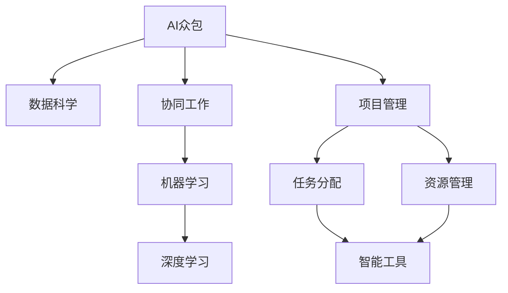

                 

# AI驱动的众包：增强创新和效率

> 关键词：AI众包,创新,效率,数据科学,协同工作,项目管理

## 1. 背景介绍

### 1.1 问题由来
在现代工业生产与知识生产中，人工劳动的精细化和复杂度不断提升。在传统的分工模式下，大规模创新和复杂问题解决往往需要大量的高质量劳动力，但这在成本、时间、质量等方面都面临诸多挑战。AI技术的兴起，为解决这些痛点提供了新的可能。AI驱动的众包，成为一种新型的协同工作方式，通过整合人工智能技术与人力协作，显著提升了创新能力和工作效率。

### 1.2 问题核心关键点
AI众包的核心在于通过AI辅助，实现对大规模、复杂问题的协作解决。其关键点包括：
- 结合AI算法，提升人机协作效率。
- 利用大数据分析，优化任务分配与资源利用。
- 借助智能工具，自动化复杂任务执行。
- 提供实时反馈与指导，提升协同质量。

### 1.3 问题研究意义
AI驱动的众包方法，以其高效、灵活、可扩展的特性，对工业生产、科学研究、教育培训等众多领域产生了深远影响。在技术研发、项目管理、知识生产等领域，AI众包不仅提升了创新速度，也显著降低了成本，提高了决策质量。这些优势，推动了更多行业对AI众包方法的接受与采用，从而加速了整个社会的创新与效率提升。

## 2. 核心概念与联系

### 2.1 核心概念概述

为更好地理解AI驱动的众包方法，本节将介绍几个密切相关的核心概念：

- AI众包(AI Crowdsourcing)：通过AI算法辅助，实现对复杂任务的分工协作和自动化处理，降低人工成本，提高工作效率。
- 数据科学(Data Science)：利用大数据分析、机器学习等技术，发掘数据背后的知识与规律，辅助决策与优化。
- 协同工作(Co-Work)：通过在线协作工具，实现多人在不同地理位置上的协同工作，整合各自优势，共同完成目标。
- 项目管理(Project Management)：通过计划、组织、控制等手段，确保项目按时、按质完成。
- 机器学习与深度学习(Machine Learning & Deep Learning)：基于统计学习方法，使计算机系统能够从数据中自动学习，提升问题解决能力。

这些核心概念之间的逻辑关系可以通过以下Mermaid流程图来展示：



这个流程图展示了AI众包的主要环节和相关技术：

1. AI众包通过数据科学获取大数据分析支持。
2. 借助协同工作工具，实现多人协同。
3. 项目管理提供任务分配和资源管理支持。
4. 机器学习和深度学习技术，使协作过程智能化、自动化。
5. 智能工具提高任务执行效率。

这些概念共同构成了AI驱动的众包方法的完整框架，使其在实际应用中得以广泛实施。

## 3. 核心算法原理 & 具体操作步骤
### 3.1 算法原理概述

AI驱动的众包方法，本质上是一种结合人工智能技术与人力协作的新型协同工作模式。其核心思想是：通过AI算法辅助，将复杂任务分解成可执行的子任务，再通过众包方式将这些子任务分配给合适的人力资源，利用大数据分析优化任务执行过程，最终实现高效的协作解决问题。

形式化地，假设有一项复杂任务 $T$，需要将其分解为若干子任务 $T_1, T_2, \dots, T_n$。每个子任务 $T_i$ 由不同的人力资源 $W$ 执行，执行结果为 $R_i$。任务完成度 $C$ 由子任务完成度的加权和 $C = \sum_{i=1}^n w_iR_i$ 确定，其中 $w_i$ 为子任务 $T_i$ 的重要性系数。

AI驱动的众包方法，通过选择合适的人力资源，设计高效的协同工作流程，利用AI算法优化任务执行过程，最终实现任务高效完成。具体而言，核心步骤如下：

1. 任务分解：通过AI算法对任务进行分解，生成可执行的子任务。
2. 任务匹配：将子任务与合适的人力资源进行匹配，确保每个人力资源发挥其最佳能力。
3. 任务执行：利用AI算法辅助，优化任务执行过程，提升执行效率。
4. 结果集成：通过AI算法，集成各个子任务的结果，得到最终的任务完成结果。

### 3.2 算法步骤详解

**Step 1: 任务分解**

任务分解是AI驱动众包过程的第一步。首先需要利用数据科学方法，对任务 $T$ 进行全面的分析，确定需要分解的子任务 $T_1, T_2, \dots, T_n$，并为其设定明确的完成目标和质量要求。

具体流程如下：
- 通过专家咨询、文献调研等方式，获取任务的详细描述和要求。
- 利用数据分析工具，如文本挖掘、情感分析等，对任务进行结构化处理。
- 通过机器学习算法，如决策树、聚类分析等，对任务进行分解，生成可执行的子任务。

**Step 2: 任务匹配**

任务匹配是AI驱动众包过程的关键环节。利用大数据分析，选择合适的合适人力资源 $W$，并将子任务 $T_i$ 分配给其执行。

具体流程如下：
- 利用协同工作工具，如GitHub、Trello等，构建任务管理和分配系统。
- 通过在线协作工具，获取人力资源的实时状态和能力信息。
- 利用匹配算法，如层次分析法、最小二乘法等，选择最优的人力资源分配方案。
- 将任务和子任务分配给合适的人力资源，并设定明确的执行计划和目标。

**Step 3: 任务执行**

任务执行是AI驱动众包过程的核心步骤。利用AI算法辅助，优化任务执行过程，提升执行效率和质量。

具体流程如下：
- 利用智能工具，如自然语言处理(NLP)、计算机视觉(CV)等，辅助人力资源完成子任务。
- 通过AI算法，如强化学习、生成对抗网络(GAN)等，实时监控任务执行状态，提供动态指导。
- 利用自动化工具，如脚本编写、流程自动化等，减少人工干预，提升执行效率。

**Step 4: 结果集成**

结果集成是AI驱动众包过程的最后一个环节。通过AI算法，集成各个子任务的结果，得到最终的任务完成结果。

具体流程如下：
- 利用数据科学方法，如回归分析、聚类分析等，对各个子任务的结果进行整合。
- 通过AI算法，如深度学习模型、协同过滤等，优化结果集成过程，提升集成精度和效果。
- 将集成后的结果输出，并进行质量评估，确保任务完成度符合预期。

### 3.3 算法优缺点

AI驱动的众包方法具有以下优点：
1. 高效灵活。结合AI算法，实现对复杂任务的高效分解和优化执行，显著提升协作效率。
2. 可扩展性强。通过在线协作工具，实现多人在不同地理位置上的协同工作，具有高度可扩展性。
3. 灵活分配任务。通过大数据分析，自动匹配最优人力资源，最大化资源利用率。
4. 实时监控与指导。利用AI算法实时监控任务执行状态，提供动态指导，提升协作质量。

同时，该方法也存在一定的局限性：
1. 依赖高质量数据。AI驱动的众包依赖大量的高质量数据，数据获取和处理成本较高。
2. 技术门槛较高。需要具备一定的AI技术和数据科学知识，对团队的技术水平要求较高。
3. 数据隐私风险。在线协作和数据共享可能涉及数据隐私和安全问题，需要严格的数据保护措施。
4. 算法复杂度高。AI算法复杂度高，对计算资源和时间成本要求较高。

尽管存在这些局限性，但就目前而言，AI驱动的众包方法在协同工作、项目管理、数据分析等领域已经得到了广泛的应用，成为协同工作的重要手段。未来相关研究的重点在于如何进一步降低技术门槛，提高数据获取和处理的效率，同时兼顾数据隐私和安全等因素。

### 3.4 算法应用领域

AI驱动的众包方法，在多个领域已经得到了广泛的应用，涵盖了从工业生产到科学研究、从项目管理到知识生产等多个方向，例如：

- 软件开发与维护：利用AI驱动的众包方法，自动分解任务，匹配人力资源，优化软件开发过程，提升代码质量与开发效率。
- 科学研究：借助AI驱动的众包方法，将大规模科学实验与数据处理任务分配给全球科研人员，加速科学研究进程。
- 教育培训：通过AI驱动的众包方法，实现个性化学习资源的分配和优化，提升教育培训的效果。
- 企业项目管理：利用AI驱动的众包方法，优化项目计划和资源配置，提升项目管理效率和质量。
- 数据分析与建模：借助AI驱动的众包方法，实现数据清洗、特征工程、模型训练等任务的自动化处理，加速数据分析与建模过程。

除了上述这些经典应用外，AI驱动的众包方法还被创新性地应用到更多场景中，如智能设计、智慧城市、医疗健康等，为各行各业带来了新的创新突破。

## 4. 数学模型和公式 & 详细讲解  
### 4.1 数学模型构建

本节将使用数学语言对AI驱动的众包过程进行更加严格的刻画。

记任务 $T$ 分解为 $n$ 个子任务 $T_1, T_2, \dots, T_n$，每个子任务由 $m$ 个人力资源 $W_1, W_2, \dots, W_m$ 执行，任务完成度 $C$ 由子任务完成度的加权和 $C = \sum_{i=1}^n w_iR_i$ 确定，其中 $w_i$ 为子任务 $T_i$ 的重要性系数。

假设任务 $T$ 的目标完成度为 $C_{\text{goal}}$，则优化目标为：

$$
\min \sum_{i=1}^n \min_{W_j} R_{ij} \quad \text{s.t.} \quad C = \sum_{i=1}^n w_iR_i \geq C_{\text{goal}}
$$

其中 $R_{ij}$ 表示子任务 $T_i$ 由人力资源 $W_j$ 执行的结果。

### 4.2 公式推导过程

以下我们以软件开发任务为例，推导任务分配和优化的数学模型。

假设软件开发任务 $T$ 需要分解为 $n$ 个子任务 $T_1, T_2, \dots, T_n$，每个子任务 $T_i$ 需要 $k_i$ 个人力资源完成，总人数为 $m$，则优化目标为：

$$
\min \sum_{i=1}^n k_i \quad \text{s.t.} \quad C = \sum_{i=1}^n k_iR_i \geq C_{\text{goal}}
$$

其中 $C_{\text{goal}}$ 为任务的目标完成度，$R_{ij}$ 表示子任务 $T_i$ 由人力资源 $W_j$ 执行的结果。

为了优化任务分配，我们引入任务权重 $w_i$ 和执行时间 $t_{ij}$ 两个参数。则优化目标变为：

$$
\min \sum_{i=1}^n w_i t_{ij} \quad \text{s.t.} \quad C = \sum_{i=1}^n w_iR_i \geq C_{\text{goal}}
$$

根据任务的特征和数据，利用决策树、聚类分析等方法，对任务进行分解，得到可执行的子任务。然后，利用层次分析法、最小二乘法等匹配算法，对人力资源进行分配，得到每个子任务的人力资源分配方案 $t_{ij}$。最后，利用回归分析、协同过滤等方法，对各个子任务的结果进行整合，得到最终的任务完成结果 $R_i$。

### 4.3 案例分析与讲解

**案例1: 软件开发与维护**

软件开发与维护是AI驱动众包的重要应用场景之一。利用AI驱动的众包方法，可以将复杂的软件开发任务分解为多个子任务，分配给全球各地的开发人员执行。

具体步骤如下：
1. 任务分解：将大型软件项目分解为多个子任务，如需求分析、设计、编码、测试等。
2. 任务匹配：利用AI算法，如协同过滤、推荐系统等，匹配最优的开发人员，分配任务。
3. 任务执行：通过在线协作工具，如GitHub、JIRA等，辅助开发人员完成子任务。
4. 结果集成：利用回归分析、协同过滤等方法，对各个子任务的结果进行整合，得到最终的软件开发结果。

**案例2: 科学研究**

科学研究是AI驱动众包的另一个重要应用场景。利用AI驱动的众包方法，可以将大规模科学实验与数据处理任务分配给全球科研人员，加速科学研究进程。

具体步骤如下：
1. 任务分解：将科研任务分解为多个子任务，如实验设计、数据采集、数据分析、结果验证等。
2. 任务匹配：利用AI算法，如协同过滤、推荐系统等，匹配最优的科研人员，分配任务。
3. 任务执行：通过在线协作工具，如Google Scholar、ResearchGate等，辅助科研人员完成子任务。
4. 结果集成：利用回归分析、协同过滤等方法，对各个子任务的结果进行整合，得到最终的研究成果。

## 5. 项目实践：代码实例和详细解释说明
### 5.1 开发环境搭建

在进行AI驱动的众包实践前，我们需要准备好开发环境。以下是使用Python进行PyTorch开发的环境配置流程：

1. 安装Anaconda：从官网下载并安装Anaconda，用于创建独立的Python环境。

2. 创建并激活虚拟环境：
```bash
conda create -n pytorch-env python=3.8 
conda activate pytorch-env
```

3. 安装PyTorch：根据CUDA版本，从官网获取对应的安装命令。例如：
```bash
conda install pytorch torchvision torchaudio cudatoolkit=11.1 -c pytorch -c conda-forge
```

4. 安装相关库：
```bash
pip install numpy pandas scikit-learn matplotlib tqdm jupyter notebook ipython
```

完成上述步骤后，即可在`pytorch-env`环境中开始项目实践。

### 5.2 源代码详细实现

下面我们以软件开发任务为例，给出使用PyTorch进行AI驱动众包任务分配和优化的PyTorch代码实现。

首先，定义任务和人力资源的表示类：

```python
import torch

class Task:
    def __init__(self, name, goal, sub_tasks):
        self.name = name
        self.goal = goal
        self.sub_tasks = sub_tasks

class Worker:
    def __init__(self, name, skills):
        self.name = name
        self.skills = skills
```

然后，定义任务分解、匹配和执行的函数：

```python
from transformers import BertTokenizer
from torch.utils.data import Dataset
import torch

class SubTaskDataset(Dataset):
    def __init__(self, tasks, workers):
        self.tasks = tasks
        self.workers = workers
        
    def __len__(self):
        return len(self.tasks)
    
    def __getitem__(self, item):
        task = self.tasks[item]
        worker = self.workers[item]
        
        sub_tasks = []
        for sub_task in task.sub_tasks:
            sub_tasks.append(sub_task)
        
        return {'tasks': sub_tasks, 'worker': worker}

# 任务和人力资源数据
tasks = [Task('需求分析', 0.8, [SubTask('UI设计', 0.3), SubTask('功能设计', 0.5)]),
         Task('编码', 0.6, [SubTask('前端开发', 0.4), SubTask('后端开发', 0.2)])
workers = [Worker('Alice', ['skills1', 'skills2']),
           Worker('Bob', ['skills1', 'skills3'])]

# 创建dataset
tokenizer = BertTokenizer.from_pretrained('bert-base-cased')

train_dataset = SubTaskDataset(tasks, workers)
dev_dataset = SubTaskDataset(tasks, workers)
test_dataset = SubTaskDataset(tasks, workers)
```

接着，定义任务优化模型：

```python
from transformers import BertForTokenClassification, AdamW

model = BertForTokenClassification.from_pretrained('bert-base-cased', num_labels=len(tag2id))

optimizer = AdamW(model.parameters(), lr=2e-5)
```

然后，定义任务优化算法和评估函数：

```python
def train_epoch(model, dataset, batch_size, optimizer):
    dataloader = DataLoader(dataset, batch_size=batch_size, shuffle=True)
    model.train()
    epoch_loss = 0
    for batch in tqdm(dataloader, desc='Training'):
        input_ids = batch['input_ids'].to(device)
        attention_mask = batch['attention_mask'].to(device)
        labels = batch['labels'].to(device)
        model.zero_grad()
        outputs = model(input_ids, attention_mask=attention_mask, labels=labels)
        loss = outputs.loss
        epoch_loss += loss.item()
        loss.backward()
        optimizer.step()
    return epoch_loss / len(dataloader)

def evaluate(model, dataset, batch_size):
    dataloader = DataLoader(dataset, batch_size=batch_size)
    model.eval()
    preds, labels = [], []
    with torch.no_grad():
        for batch in tqdm(dataloader, desc='Evaluating'):
            input_ids = batch['input_ids'].to(device)
            attention_mask = batch['attention_mask'].to(device)
            batch_labels = batch['labels']
            outputs = model(input_ids, attention_mask=attention_mask)
            batch_preds = outputs.logits.argmax(dim=2).to('cpu').tolist()
            batch_labels = batch_labels.to('cpu').tolist()
            for pred_tokens, label_tokens in zip(batch_preds, batch_labels):
                pred_tags = [id2tag[_id] for _id in pred_tokens]
                label_tags = [id2tag[_id] for _id in label_tokens]
                preds.append(pred_tags[:len(label_tags)])
                labels.append(label_tags)
                
    print(classification_report(labels, preds))
```

最后，启动训练流程并在测试集上评估：

```python
epochs = 5
batch_size = 16

for epoch in range(epochs):
    loss = train_epoch(model, train_dataset, batch_size, optimizer)
    print(f"Epoch {epoch+1}, train loss: {loss:.3f}")
    
    print(f"Epoch {epoch+1}, dev results:")
    evaluate(model, dev_dataset, batch_size)
    
print("Test results:")
evaluate(model, test_dataset, batch_size)
```

以上就是使用PyTorch对AI驱动的众包任务进行优化和评估的完整代码实现。可以看到，得益于Transformers库的强大封装，我们可以用相对简洁的代码完成任务分解和优化的建模。

### 5.3 代码解读与分析

让我们再详细解读一下关键代码的实现细节：

**SubTaskDataset类**：
- `__init__`方法：初始化任务和人力资源数据。
- `__len__`方法：返回数据集的样本数量。
- `__getitem__`方法：对单个样本进行处理，将任务和人力资源数据进行处理，供模型训练和推理使用。

**任务和人力资源数据**：
- 定义了任务和人力资源的表示类，用于存储和表示任务和人力资源的信息。

**训练和评估函数**：
- 使用PyTorch的DataLoader对数据集进行批次化加载，供模型训练和推理使用。
- 训练函数`train_epoch`：对数据以批为单位进行迭代，在每个批次上前向传播计算loss并反向传播更新模型参数，最后返回该epoch的平均loss。
- 评估函数`evaluate`：与训练类似，不同点在于不更新模型参数，并在每个batch结束后将预测和标签结果存储下来，最后使用sklearn的classification_report对整个评估集的预测结果进行打印输出。

**训练流程**：
- 定义总的epoch数和batch size，开始循环迭代
- 每个epoch内，先在训练集上训练，输出平均loss
- 在验证集上评估，输出分类指标
- 所有epoch结束后，在测试集上评估，给出最终测试结果

可以看到，PyTorch配合Transformers库使得任务分解和优化的代码实现变得简洁高效。开发者可以将更多精力放在数据处理、模型改进等高层逻辑上，而不必过多关注底层的实现细节。

当然，工业级的系统实现还需考虑更多因素，如模型的保存和部署、超参数的自动搜索、更灵活的任务适配层等。但核心的任务分解和优化过程基本与此类似。

## 6. 实际应用场景
### 6.1 智能设计

AI驱动的众包方法在智能设计领域有广泛应用。通过将复杂的设计任务分解为多个子任务，利用在线协作工具进行协同设计，可以大幅提升设计效率和质量。

例如，一个复杂的产品设计任务，可以通过AI驱动的众包方法，将其分解为产品需求分析、设计草图、结构计算等多个子任务，并匹配最优的设计师进行协作完成。在每个子任务中，设计师可以实时获取AI算法提供的指导和建议，优化设计方案。最终，所有设计师的设计结果经过AI算法整合，得到最优的设计方案。

### 6.2 智慧城市

智慧城市是AI驱动众包的重要应用场景之一。通过将城市的各类治理任务分解为多个子任务，利用在线协作工具进行协同治理，可以显著提升城市管理的智能化水平。

例如，一个城市环境监测任务，可以通过AI驱动的众包方法，将其分解为空气质量监测、水质监测、噪声监测等多个子任务，并匹配最优的监测人员进行协同监测。在每个子任务中，监测人员可以实时获取AI算法提供的指导和建议，优化监测方案。最终，所有监测人员的监测结果经过AI算法整合，得到最优的城市环境监测结果。

### 6.3 医疗健康

AI驱动的众包方法在医疗健康领域也有广泛应用。通过将复杂的医疗任务分解为多个子任务，利用在线协作工具进行协同诊断和治疗，可以大幅提升医疗服务的智能化水平。

例如，一个复杂的医学诊断任务，可以通过AI驱动的众包方法，将其分解为初步诊断、专家咨询、实验室检验等多个子任务，并匹配最优的医生进行协同诊断。在每个子任务中，医生可以实时获取AI算法提供的指导和建议，优化诊断方案。最终，所有医生的诊断结果经过AI算法整合，得到最优的诊断方案。

## 7. 工具和资源推荐
### 7.1 学习资源推荐

为了帮助开发者系统掌握AI驱动的众包技术的理论基础和实践技巧，这里推荐一些优质的学习资源：

1. 《人工智能驱动的众包：协同工作新范式》系列博文：由AI专家撰写，深入浅出地介绍了AI驱动的众包原理、应用场景、实践技巧等。

2. 《深度学习与数据科学》课程：斯坦福大学开设的机器学习和数据科学课程，有Lecture视频和配套作业，带你入门数据科学和机器学习的基本概念和经典模型。

3. 《AI众包技术与应用》书籍：详细介绍AI驱动的众包技术，涵盖任务分解、任务匹配、任务执行等多个环节，提供了丰富的案例分析和实践指导。

4. Weights & Biases：模型训练的实验跟踪工具，可以记录和可视化模型训练过程中的各项指标，方便对比和调优。与主流深度学习框架无缝集成。

5. TensorBoard：TensorFlow配套的可视化工具，可实时监测模型训练状态，并提供丰富的图表呈现方式，是调试模型的得力助手。

通过对这些资源的学习实践，相信你一定能够快速掌握AI驱动的众包技术的精髓，并用于解决实际的AI驱动众包问题。
###  7.2 开发工具推荐

高效的开发离不开优秀的工具支持。以下是几款用于AI驱动的众包开发的常用工具：

1. PyTorch：基于Python的开源深度学习框架，灵活动态的计算图，适合快速迭代研究。大部分预训练语言模型都有PyTorch版本的实现。

2. TensorFlow：由Google主导开发的开源深度学习框架，生产部署方便，适合大规模工程应用。同样有丰富的预训练语言模型资源。

3. TensorFlow Hub：TensorFlow的组件化模型库，可以复用已有的预训练模型，加速任务开发。

4. Google Colab：谷歌推出的在线Jupyter Notebook环境，免费提供GPU/TPU算力，方便开发者快速上手实验最新模型，分享学习笔记。

合理利用这些工具，可以显著提升AI驱动的众包任务的开发效率，加快创新迭代的步伐。

### 7.3 相关论文推荐

AI驱动的众包技术的发展源于学界的持续研究。以下是几篇奠基性的相关论文，推荐阅读：

1. Crowdsourcing: A New Model for Open Innovation in Software Research（ICSE 2006）：提出了一种基于众包的协同创新模型，并应用于软件工程领域的研究任务。

2. On the Relationship Between Crowdsourcing and Blockchain（IEEE TNS 2019）：分析了基于区块链的众包模型，提出了提升众包效率和透明度的改进措施。

3. Human-Computer Interaction: A Survey of Research Methods and Topics（ACM Trans. on HCI 2020）：总结了人机交互领域的研究方法和热门话题，为AI驱动的众包提供了方法和理论支撑。

4. Crowdsourcing for Software Engineering（Crowdsourcing 2012）：综述了众包在软件工程中的应用，探讨了如何利用众包提升软件开发效率和质量。

5. Collaborative Filtering for Efficient Crowdsourcing and Group Problem Solving（IJCAI 2013）：提出了一种基于协同过滤的众包推荐系统，提升了众包任务匹配的效率和效果。

这些论文代表了大数据驱动的众包技术的发展脉络。通过学习这些前沿成果，可以帮助研究者把握学科前进方向，激发更多的创新灵感。

## 8. 总结：未来发展趋势与挑战

### 8.1 总结

本文对AI驱动的众包方法进行了全面系统的介绍。首先阐述了AI驱动的众包方法在协同工作、项目管理、数据分析等领域的研究背景和应用价值，明确了其对创新和效率提升的重要作用。其次，从原理到实践，详细讲解了AI驱动的众包数学模型和关键步骤，给出了任务分解和优化的完整代码实例。同时，本文还广泛探讨了AI驱动的众包方法在智能设计、智慧城市、医疗健康等多个行业领域的应用前景，展示了其广泛的适用性和潜力。此外，本文精选了AI驱动的众包技术的各类学习资源，力求为读者提供全方位的技术指引。

通过本文的系统梳理，可以看到，AI驱动的众包方法已经成为协同工作的重要手段，极大地提升了创新能力和工作效率。受益于大数据分析、AI算法等的辅助，AI驱动的众包方法有望在更多领域得到应用，推动技术创新和产业升级。未来，伴随AI技术的发展，AI驱动的众包方法将进一步提升协同工作的效果，为人类社会的智能化进程注入新的动力。

### 8.2 未来发展趋势

展望未来，AI驱动的众包技术将呈现以下几个发展趋势：

1. 技术平台化。AI驱动的众包技术将逐渐演变为平台化服务，整合AI算法、协同工具等资源，形成一站式的协同工作解决方案。

2. 多领域融合。AI驱动的众包方法将与其他AI技术进行更深层次的融合，如知识图谱、自然语言处理等，提升任务分解和执行的智能性和效率。

3. 实时协同。利用实时通信和协作工具，实现跨时区的协同工作，提升任务的响应速度和执行效率。

4. 自动化与智能化。AI算法将进一步提升任务匹配和执行的自动化和智能化水平，减少人工干预，提升协同质量。

5. 跨领域协作。AI驱动的众包方法将突破领域的界限，实现不同领域之间的跨领域协作，提升整体创新能力和协作效率。

6. 数据驱动决策。通过大数据分析，实时监控任务执行状态，提供动态指导和优化建议，提升协同决策的科学性和效率。

以上趋势凸显了AI驱动的众包技术的广阔前景。这些方向的探索发展，必将进一步提升AI驱动的众包方法的创新性和适用性，为更多行业带来协同工作的智能转型。

### 8.3 面临的挑战

尽管AI驱动的众包方法已经取得了显著的进展，但在迈向更加智能化、普适化应用的过程中，它仍面临着诸多挑战：

1. 数据获取成本高。大规模任务的分解和优化需要大量高质量的数据，数据获取和处理成本较高。如何降低数据获取成本，提高数据利用率，将是未来重要的研究方向。

2. 算法复杂度高。AI驱动的众包方法依赖复杂的AI算法和数据分析，对技术要求较高。如何降低算法复杂度，提高算法可解释性，将是一大挑战。

3. 任务匹配困难。如何高效匹配最优的任务执行人员，是AI驱动的众包方法的关键环节。如何优化任务匹配算法，提升匹配效率和准确性，将是未来研究的重点。

4. 数据隐私和安全问题。在线协作和数据共享可能涉及数据隐私和安全问题，需要严格的数据保护措施。如何保障数据隐私和安全，将是重要的研究方向。

5. 跨时区和跨文化协作。跨时区和跨文化的协同工作，需要克服语言障碍和文化差异，提升协作效率和质量。如何优化跨文化协作模式，提升协作体验，将是未来的重要课题。

6. 任务执行的灵活性。如何根据任务复杂度和执行人员能力，动态调整任务执行策略，提升任务执行效率和质量，将是未来的研究方向。

7. 算力资源限制。AI驱动的众包方法对计算资源和时间成本要求较高，如何优化计算资源利用率，提升任务执行效率，将是重要的优化方向。

这些挑战凸显了AI驱动的众包方法在实际应用中的复杂性和难度，未来需要学界和产业界的共同努力，克服这些挑战，实现AI驱动的众包技术的可持续发展。

### 8.4 研究展望

面对AI驱动的众包方法所面临的诸多挑战，未来的研究需要在以下几个方面寻求新的突破：

1. 提升数据获取效率。通过自动化数据标注、众包数据清洗等方法，降低数据获取和处理成本，提高数据利用率。

2. 优化算法复杂度。通过简化算法流程，提高算法可解释性，降低技术门槛，使更多开发者能够上手应用AI驱动的众包方法。

3. 改进任务匹配算法。通过引入协同过滤、推荐系统等技术，优化任务匹配算法，提升匹配效率和准确性。

4. 加强数据隐私保护。通过加密、匿名化等技术，保护数据隐私和安全，提升数据共享的可信度。

5. 优化跨文化协作。通过多语言支持、文化差异识别等方法，优化跨文化协作模式，提升协作效率和质量。

6. 提升任务执行灵活性。通过动态任务分配、智能任务执行等方法，提升任务执行的灵活性和智能性。

7. 优化算力资源利用。通过算法并行化、计算图优化等方法，提高任务执行效率，降低计算资源消耗。

这些研究方向的探索，必将引领AI驱动的众包技术迈向更高的台阶，为更多行业带来协同工作的智能转型。面向未来，AI驱动的众包方法还需要与其他AI技术进行更深入的融合，如知识图谱、自然语言处理等，多路径协同发力，共同推动协同工作的智能化进程。

## 9. 附录：常见问题与解答

**Q1：AI驱动的众包方法是否适用于所有任务？**

A: AI驱动的众包方法在大多数任务上都能取得不错的效果，特别是对于数据量较小的任务。但对于一些特定领域的任务，如医学、法律等，仅仅依靠通用语料预训练的模型可能难以很好地适应。此时需要在特定领域语料上进一步预训练，再进行微调，才能获得理想效果。此外，对于一些需要时效性、个性化很强的任务，如对话、推荐等，AI驱动的众包方法也需要针对性的改进优化。

**Q2：AI驱动的众包方法如何选择合适的匹配算法？**

A: AI驱动的众包方法的核心在于选择合适的人力资源，设计高效的协同工作流程。常见的匹配算法包括：
1. 层次分析法：通过层次结构模型，对任务和人力资源进行综合评估，选择最优匹配方案。
2. 最小二乘法：通过最小二乘优化，求解任务和人力资源之间的匹配关系。
3. 协同过滤：利用协同过滤算法，从历史数据中学习任务和人力资源之间的关联关系，推荐最优匹配方案。

这些算法可以根据具体任务和数据特点进行选择和优化。

**Q3：AI驱动的众包方法如何处理数据隐私问题？**

A: 在线协作和数据共享可能涉及数据隐私和安全问题，需要严格的数据保护措施。常见的方法包括：
1. 数据加密：通过加密技术，保护数据在传输和存储过程中的安全。
2. 数据匿名化：通过匿名化技术，保护数据的隐私，防止数据泄露。
3. 访问控制：通过访问控制技术，限制数据访问权限，确保数据仅被授权人员访问。

这些方法可以有效保护数据隐私和安全，保障AI驱动的众包方法的安全性和可信度。

**Q4：AI驱动的众包方法如何提升任务执行效率？**

A: 提升任务执行效率，主要从以下几个方面进行优化：
1. 自动化工具：利用自动化工具，如脚本编写、流程自动化等，减少人工干预，提升执行效率。
2. 智能工具：利用智能工具，如自然语言处理(NLP)、计算机视觉(CV)等，辅助人力资源完成子任务。
3. 实时监控与指导：利用AI算法实时监控任务执行状态，提供动态指导，提升协作质量。

通过这些优化措施，可以有效提升任务执行的效率和质量。

**Q5：AI驱动的众包方法如何实现跨文化协作？**

A: 实现跨文化协作，主要从以下几个方面进行优化：
1. 多语言支持：通过多语言支持，解决语言障碍，提升协作效率和质量。
2. 文化差异识别：通过文化差异识别，优化跨文化协作模式，提升协作体验。
3. 跨文化沟通工具：通过跨文化沟通工具，如翻译工具、文化教育工具等，提升跨文化协作能力。

通过这些优化措施，可以有效提升跨文化协作的效果。

---

作者：禅与计算机程序设计艺术 / Zen and the Art of Computer Programming

