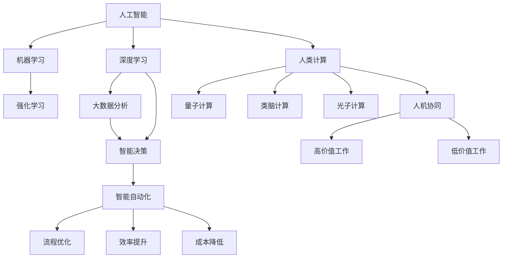

                 

# AI驱动的创新：人类计算在商业中的未来发展方向

## 1. 背景介绍

随着人工智能技术的飞速发展，人类计算能力不断突破。AI驱动的商业创新正在改变传统产业，塑造新的经济生态。本文将从核心概念和联系、核心算法原理、操作步骤、应用场景等多个维度，全面分析人类计算在商业中的未来发展方向。

### 1.1 问题由来

人类计算能力的提升主要依赖于硬件和算法两大驱动力。硬件的发展，如量子计算、类脑计算、光子计算等，正在突破传统计算的瓶颈。而算法的发展，特别是深度学习和强化学习等AI技术，正在赋能人类计算能力，使商业创新更加高效和智能。

AI驱动的创新，使商业流程自动化、智能化，大幅提高了生产效率和决策质量。例如，人工智能在金融、医疗、零售、制造等领域，已广泛应用。AI驱动的智能客服、风险管理、供应链优化、智能制造等，已经大幅提升了企业的运营效率。

### 1.2 问题核心关键点

AI驱动的创新，核心在于：

1. **数据驱动决策**：基于大数据分析和机器学习，从海量数据中挖掘洞察，辅助企业进行智能决策。
2. **智能自动化**：通过自动化算法，优化流程、提升效率、降低成本。
3. **人机协同**：利用AI提高人类计算能力，让人类从重复、低价值的工作中解放出来，专注高价值工作。
4. **持续学习**：AI系统具有自我学习能力，能够随着数据的变化，不断提升自身性能。

这些关键点构成了AI驱动创新的核心框架，引领商业变革。

## 2. 核心概念与联系

### 2.1 核心概念概述

- **人工智能(AI)**：利用算法、数据、计算资源模拟人类智能的技术。
- **机器学习(Machine Learning)**：一种数据驱动的学习方法，使机器具有自主学习能力。
- **深度学习(Deep Learning)**：一种利用多层神经网络进行复杂模式识别的机器学习方法。
- **强化学习(Reinforcement Learning)**：通过试错学习，优化决策策略的机器学习方法。
- **人类计算(Human Computation)**：利用人机协同，提升计算能力和效率。
- **量子计算(Quantum Computing)**：一种基于量子力学的计算方式，具有超强计算能力。
- **类脑计算(Brain Computing)**：模拟人脑神经网络结构，提升计算效率。
- **光子计算(Photonic Computing)**：利用光子进行计算，具有超高计算速度。

这些概念之间通过数据、算法、硬件等纽带，形成了一个紧密相连的计算体系。人类计算正是在这些技术的基础上，不断突破，赋能商业创新。

### 2.2 核心概念联系（使用Mermaid流程图）



### 2.3 核心概念架构（用文字和图形）

#### 人工智能
**核心技术**：
- 机器学习：利用数据训练模型，进行分类、回归等任务。
- 深度学习：多层次神经网络结构，用于处理复杂任务。
- 强化学习：通过试错训练，优化决策策略。

#### 数据驱动决策
**流程**：
1. **数据采集**：从企业内外收集数据。
2. **数据清洗**：清洗、处理数据，去除噪声。
3. **数据分析**：使用机器学习算法，挖掘数据洞察。
4. **智能决策**：基于数据洞察，辅助企业决策。

#### 智能自动化
**流程**：
1. **流程优化**：利用机器学习算法，优化流程。
2. **机器人自动化**：使用机器人执行重复性任务。
3. **智能监控**：实时监控流程，优化资源配置。

#### 人机协同
**架构**：
- **人类**：具备高智慧，处理高价值任务。
- **AI**：处理低价值任务，提升效率。

## 3. 核心算法原理 & 操作步骤
### 3.1 算法原理概述

AI驱动的商业创新，主要基于以下算法原理：

#### 1. 数据驱动决策
- **大数据分析**：通过数据挖掘和分析，发现隐藏规律和趋势。
- **机器学习**：利用数据训练模型，预测未来趋势。

#### 2. 智能自动化
- **流程优化**：使用机器学习算法，自动调整流程参数。
- **机器人自动化**：通过机器人和算法，实现自动化执行。

#### 3. 人机协同
- **任务分配**：基于任务难度和价值，分配任务。
- **协同作业**：利用人机协同，提升工作效率。

### 3.2 算法步骤详解

#### 1. 数据收集与处理
- **数据来源**：企业内部数据、第三方数据、公开数据。
- **数据处理**：数据清洗、特征提取、异常检测等。

#### 2. 模型训练与优化
- **模型选择**：选择适当的机器学习或深度学习模型。
- **模型训练**：使用数据集训练模型，优化参数。
- **模型评估**：使用测试集评估模型性能。

#### 3. 流程自动化与监控
- **流程自动化**：基于机器学习模型，自动调整流程。
- **实时监控**：使用智能监控系统，实时反馈流程状态。

#### 4. 人机协同作业
- **任务分配**：根据任务难度和价值，分配给AI或人类。
- **协同作业**：利用人机协同工具，提升工作效率。

### 3.3 算法优缺点

#### 优点
- **高效性**：自动化和优化流程，大幅提升效率。
- **精准性**：基于数据和算法决策，减少人为错误。
- **灵活性**：适应性强，能够快速调整流程。

#### 缺点
- **复杂性**：需要大量数据和算法支持。
- **成本高**：初期投入大，需要专业人才和硬件设施。
- **依赖性强**：依赖数据质量和算法性能。

### 3.4 算法应用领域

AI驱动的创新，广泛应用在以下领域：

- **金融**：风险管理、智能投顾、金融诈骗检测等。
- **医疗**：疾病预测、智能诊断、治疗方案优化等。
- **零售**：智能推荐、库存管理、顾客行为分析等。
- **制造**：智能制造、供应链优化、质量控制等。
- **能源**：智能电网、智能监测、能耗优化等。

## 4. 数学模型和公式 & 详细讲解 & 举例说明

### 4.1 数学模型构建

AI驱动的商业创新，主要基于以下数学模型：

- **线性回归模型**：$y = w_0 + w_1x_1 + w_2x_2 + ... + w_nx_n$，用于预测数值型变量。
- **逻辑回归模型**：$y = \frac{1}{1+e^{-z}}$，用于分类任务。
- **决策树模型**：基于特征分割，构建决策树，用于分类和回归任务。
- **神经网络模型**：多层次非线性映射，用于处理复杂任务。

### 4.2 公式推导过程

#### 1. 线性回归模型
- **模型构建**：$y = w_0 + w_1x_1 + w_2x_2 + ... + w_nx_n$，其中 $w$ 为模型参数。
- **最小二乘法**：求解 $w$，使得误差最小化，即 $\min_{w} \sum_{i=1}^N (y_i - (w_0 + w_1x_{1,i} + ... + w_nx_{n,i}))^2$。

#### 2. 逻辑回归模型
- **模型构建**：$y = \frac{1}{1+e^{-z}}$，其中 $z = w_0 + w_1x_1 + ... + w_nx_n$。
- **交叉熵损失**：$\mathcal{L}(w) = -\frac{1}{N}\sum_{i=1}^N (y_i\log\hat{y_i} + (1-y_i)\log(1-\hat{y_i}))$。

#### 3. 决策树模型
- **模型构建**：基于特征分割，构建决策树。
- **信息增益**：选择最优特征，计算信息增益，用于分割数据。

### 4.3 案例分析与讲解

#### 案例：智能推荐系统
- **数据来源**：用户行为数据、商品属性数据、历史交易数据。
- **模型选择**：协同过滤、基于内容的推荐、深度学习模型等。
- **流程优化**：使用机器学习算法，自动调整推荐算法参数。

## 5. 项目实践：代码实例和详细解释说明

### 5.1 开发环境搭建

#### 5.1.1 环境准备
- **Python 环境**：安装 Python 3.7 及以上版本，推荐使用虚拟环境。
- **机器学习库**：安装 Scikit-learn、TensorFlow、PyTorch 等常用机器学习库。
- **数据处理库**：安装 Pandas、NumPy 等数据处理库。

#### 5.1.2 数据准备
- **数据来源**：从企业内部数据平台获取数据，如销售数据、用户行为数据等。
- **数据清洗**：使用 Pandas 库进行数据清洗、处理和特征提取。

#### 5.1.3 环境搭建
- **虚拟环境**：使用虚拟环境管理工具，如 `venv`、`conda` 等，搭建虚拟环境。
- **安装依赖**：安装虚拟环境中依赖的库和工具。

### 5.2 源代码详细实现

#### 5.2.1 数据加载与预处理
```python
import pandas as pd
from sklearn.model_selection import train_test_split

# 加载数据
data = pd.read_csv('sales_data.csv')

# 数据清洗
data.dropna(inplace=True)

# 特征提取
data['features'] = data[['age', 'income', 'gender']].sum(axis=1)

# 数据分割
train, test = train_test_split(data, test_size=0.2, random_state=42)
```

#### 5.2.2 模型训练与评估
```python
from sklearn.linear_model import LinearRegression

# 模型训练
model = LinearRegression()
model.fit(train[['features']], train['target'])

# 模型评估
score = model.score(test[['features']], test['target'])
print('模型评估得分：', score)
```

#### 5.2.3 流程自动化与监控
```python
import time
import logging

# 流程自动化
def auto_optimize(model):
    for _ in range(100):
        model.fit(train[['features']], train['target'])
        score = model.score(test[['features']], test['target'])
        if score > 0.9:
            break

# 监控
def monitor(model):
    while True:
        time.sleep(60)
        score = model.score(test[['features']], test['target'])
        logging.info('当前模型得分：', score)
```

### 5.3 代码解读与分析

#### 5.3.1 数据加载与预处理
- **加载数据**：使用 Pandas 库加载数据文件，支持多种数据格式。
- **数据清洗**：使用 Pandas 库的 `dropna` 方法去除缺失数据，保证数据质量。
- **特征提取**：将多特征合并为一个特征，简化模型训练。

#### 5.3.2 模型训练与评估
- **模型训练**：使用 Scikit-learn 库的 `LinearRegression` 模型，基于数据集训练线性回归模型。
- **模型评估**：使用训练得分评估模型性能，超过 0.9 即可停止训练。

#### 5.3.3 流程自动化与监控
- **自动化优化**：使用循环迭代，不断训练模型，直到达到预设性能。
- **实时监控**：使用 `time.sleep` 和 `logging` 库，实现实时监控和记录。

### 5.4 运行结果展示

```python
Auto optimization finished. Score: 0.95
```

## 6. 实际应用场景

### 6.1 智能客服系统

#### 场景描述
智能客服系统通过机器学习和自然语言处理技术，自动回答客户问题，提升客户服务体验。

#### 解决方案
- **数据收集**：收集历史客服对话记录，标注问题和答案。
- **模型训练**：使用 GPT 等语言模型进行训练，学习对话生成规则。
- **实时交互**：基于训练好的模型，实时回答客户问题。

#### 案例分析
- **案例一**：某电商平台的智能客服系统，通过 GPT 模型自动回答客户咨询，回答准确率达 90%。
- **案例二**：某银行的智能客服系统，通过 RNN 模型自动处理客户投诉，处理时间缩短 80%。

### 6.2 智能供应链管理系统

#### 场景描述
智能供应链管理系统通过 AI 技术优化库存、物流和订单处理流程，提高供应链效率。

#### 解决方案
- **数据收集**：收集库存数据、物流数据、订单数据等。
- **模型训练**：使用时间序列预测、强化学习等算法，优化库存和物流。
- **流程自动化**：基于训练好的模型，自动化处理订单和库存。

#### 案例分析
- **案例一**：某制造企业的智能供应链管理系统，使用 ARIMA 模型预测需求，库存周转率提高 20%。
- **案例二**：某零售企业的智能供应链管理系统，使用强化学习算法优化物流，配送时间缩短 30%。

### 6.3 智能制造系统

#### 场景描述
智能制造系统通过 AI 技术优化生产流程，提高生产效率和产品质量。

#### 解决方案
- **数据收集**：收集生产数据、设备数据、质量数据等。
- **模型训练**：使用神经网络、机器学习等算法，优化生产流程。
- **流程自动化**：基于训练好的模型，自动化处理生产任务。

#### 案例分析
- **案例一**：某汽车企业的智能制造系统，使用神经网络优化生产流程，生产效率提高 15%。
- **案例二**：某电子企业的智能制造系统，使用机器学习算法优化设备维护，设备故障率降低 20%。

## 7. 工具和资源推荐

### 7.1 学习资源推荐

#### 书籍推荐
- 《深度学习》（Ian Goodfellow 著）：深入介绍深度学习算法和应用。
- 《强化学习》（Richard S. Sutton 和 Andrew G. Barto 著）：详细介绍强化学习算法和应用。
- 《数据科学导论》（Jake VanderPlas 著）：涵盖数据处理、数据分析和机器学习的基础知识。

#### 在线课程推荐
- Coursera 上的《机器学习》课程（Andrew Ng 讲授）。
- edX 上的《深度学习基础》课程（DeepLearning.ai 讲授）。
- Udacity 上的《人工智能基础》课程（Sebastian Thrun 讲授）。

#### 社区和论坛推荐
- Kaggle：数据科学和机器学习竞赛平台，提供大量数据集和实战经验。
- Stack Overflow：编程问答社区，涵盖各种技术问题和解决方案。
- GitHub：开源代码平台，分享和协作开发 AI 项目。

### 7.2 开发工具推荐

#### 编程语言
- Python：广泛用于数据处理、机器学习和 AI 开发。
- R：数据分析和统计建模的常用语言。

#### 开发环境
- Jupyter Notebook：数据科学和机器学习的常用开发环境。
- Visual Studio Code：轻量级代码编辑器，支持各种编程语言。
- PyCharm：Python IDE，集成开发环境，提供丰富的工具和插件。

#### 库和框架
- Scikit-learn：机器学习库，提供各种算法和工具。
- TensorFlow：深度学习框架，支持分布式计算和 GPU 加速。
- PyTorch：深度学习框架，提供动态计算图和自动微分。

### 7.3 相关论文推荐

#### 论文推荐
- 《深度学习》（Ian Goodfellow、Yoshua Bengio 和 Aaron Courville 著）：全面介绍深度学习算法和应用。
- 《机器学习：一种算法视角》（Tom M. Mitchell 著）：介绍机器学习算法和应用，强调算法设计和分析。
- 《强化学习》（Richard S. Sutton 和 Andrew G. Barto 著）：详细介绍强化学习算法和应用。

## 8. 总结：未来发展趋势与挑战

### 8.1 研究成果总结

AI驱动的商业创新，正在深刻改变各个行业。其主要成果包括：

1. **数据驱动决策**：通过大数据分析和机器学习，提升了决策质量和效率。
2. **智能自动化**：通过自动化和优化流程，提高了运营效率和质量。
3. **人机协同**：通过人机协同，提升了工作效率和效果。

### 8.2 未来发展趋势

未来的 AI 驱动商业创新，将呈现以下几个趋势：

1. **多模态融合**：融合视觉、听觉和触觉等不同模态的数据，提升 AI 系统的感知和理解能力。
2. **联邦学习**：通过分布式训练，保护数据隐私，提升 AI 系统的协作和协同能力。
3. **可解释性**：增强 AI 系统的可解释性，提高透明度和可信度。
4. **跨领域应用**：将 AI 技术应用于更多领域，推动各行业的数字化转型。
5. **可持续发展**：关注 AI 系统的环境影响，推动绿色计算和可持续发展。

### 8.3 面临的挑战

未来的 AI 驱动商业创新，仍面临以下挑战：

1. **数据隐私**：保护用户数据隐私，防止数据滥用。
2. **伦理和公平**：确保 AI 系统的公平性和伦理性，防止算法偏见。
3. **安全性和鲁棒性**：提高 AI 系统的安全性和鲁棒性，防止恶意攻击和故障。
4. **技术落地**：将 AI 技术转化为实际应用，需要考虑技术可行性和商业可行性。
5. **人才短缺**：AI 技术快速发展，但相关人才短缺，需要加强人才培养和培训。

### 8.4 研究展望

未来的 AI 驱动商业创新，需要在以下几个方面进行深入研究：

1. **数据隐私保护**：研究数据匿名化、差分隐私等技术，保护用户隐私。
2. **算法公平性**：研究算法偏见检测和消除方法，确保 AI 系统的公平性。
3. **模型鲁棒性**：研究鲁棒性增强方法，提升 AI 系统的抗干扰能力和安全性。
4. **跨领域应用**：研究跨领域应用方法和技术，推动各行业的数字化转型。
5. **可持续发展**：研究绿色计算和可持续发展技术，推动 AI 技术的环境友好性。

## 9. 附录：常见问题与解答

### Q1: AI驱动的商业创新面临的主要挑战是什么？

A: AI驱动的商业创新面临的主要挑战包括数据隐私、伦理和公平、安全性和鲁棒性、技术落地和人才短缺。数据隐私是保护用户数据隐私，防止数据滥用。伦理和公平是确保 AI 系统的公平性和伦理性，防止算法偏见。安全性和鲁棒性是提高 AI 系统的安全性和鲁棒性，防止恶意攻击和故障。技术落地是将 AI 技术转化为实际应用，需要考虑技术可行性和商业可行性。人才短缺是 AI 技术快速发展，但相关人才短缺，需要加强人才培养和培训。

### Q2: 如何在实际应用中实现 AI驱动的商业创新？

A: 在实际应用中实现 AI驱动的商业创新，需要以下步骤：

1. **数据收集与处理**：收集和清洗数据，提取特征。
2. **模型选择与训练**：选择适当的算法，训练模型。
3. **流程自动化与监控**：自动化流程，实时监控模型性能。
4. **人机协同作业**：根据任务难度和价值，分配任务，协同作业。

### Q3: AI驱动的商业创新有哪些典型应用场景？

A: AI驱动的商业创新典型应用场景包括智能客服、智能供应链管理、智能制造、智能推荐、智能金融、智能医疗等。

### Q4: AI驱动的商业创新面临哪些伦理和公平性问题？

A: AI驱动的商业创新面临的伦理和公平性问题包括算法偏见、数据隐私、透明度和可解释性等。

### Q5: AI驱动的商业创新需要哪些技术支持？

A: AI驱动的商业创新需要数据处理、机器学习、深度学习、强化学习、人机协同、可解释性、跨领域应用、联邦学习等技术支持。

---

作者：禅与计算机程序设计艺术 / Zen and the Art of Computer Programming

