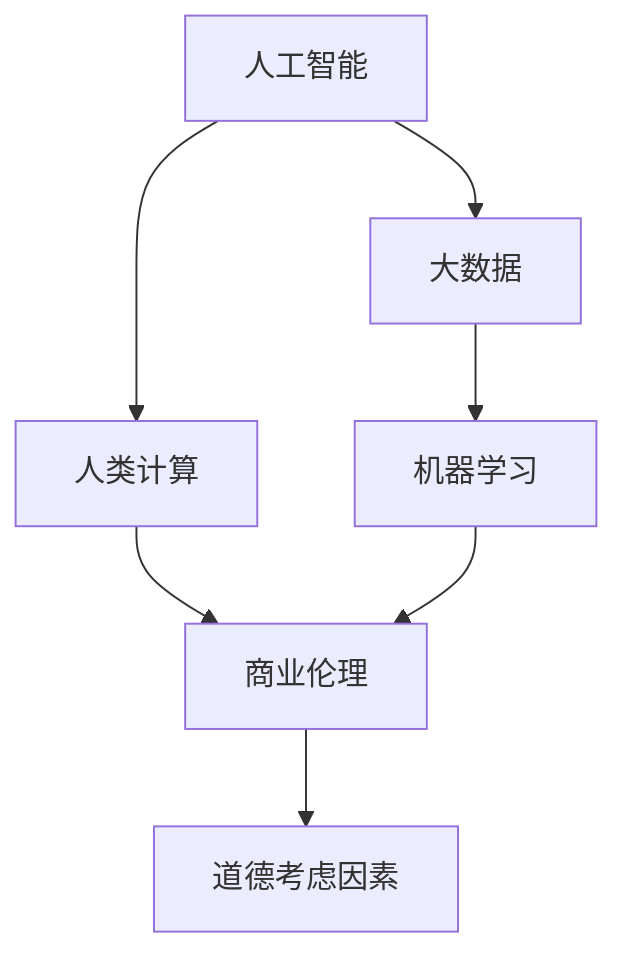

                 

# AI驱动的创新：人类计算在商业中的道德考虑因素展望分析

> 关键词：人工智能,商业道德,人类计算,大数据,机器学习

## 1. 背景介绍

### 1.1 问题由来
随着人工智能(AI)技术的飞速发展，人类计算在商业领域的应用越来越广泛。无论是传统的金融、零售、医疗，还是新兴的互联网、物联网、智能制造，AI技术都展示了其强大的应用潜力。然而，AI技术的广泛应用也带来了一些道德挑战，如数据隐私、算法偏见、工作失业、伦理监管等。如何在AI驱动的商业创新中兼顾经济效益和社会责任，是当前亟待解决的重要问题。

### 1.2 问题核心关键点
AI技术的核心优势在于其强大的计算能力和数据分析能力，能够高效地处理海量数据，实现预测、决策、优化等功能。然而，AI系统的决策过程往往是"黑箱"的，难以解释其内部机制和逻辑。这种"算法不透明"的问题，可能会引发数据隐私泄露、算法偏见、伦理风险等道德挑战。同时，AI技术在应用过程中还可能造成传统行业就业岗位的消失，加剧社会不平等。

### 1.3 问题研究意义
探讨AI驱动的商业创新中的道德考虑因素，有助于建立健全AI伦理框架，保障数据安全和个人隐私，提升AI系统的公平性和透明性，推动AI技术的可持续发展。这对于构建负责任的AI商业应用环境，促进经济与社会的和谐发展，具有重要意义。

## 2. 核心概念与联系

### 2.1 核心概念概述

为更好地理解AI驱动的商业创新中的道德考虑因素，本节将介绍几个密切相关的核心概念：

- 人工智能(Artificial Intelligence, AI)：利用计算机算法，模拟人类智能的各项功能，如感知、推理、学习等。AI系统通常由数据、模型和计算三部分构成。
- 人类计算(Human Computation)：通过大规模人机协同，利用人类的认知能力来解决复杂问题。如众包、在线调查、数据标注等。
- 大数据(Big Data)：指规模庞大的数据集，具有数据量巨大、多样性、实时性等特点。大数据分析是AI技术的重要基础。
- 机器学习(Machine Learning, ML)：通过数据驱动的学习算法，使计算机系统能够自动改进和优化，提升其性能。机器学习是AI的重要分支。
- 商业伦理(Business Ethics)：在商业活动中，遵循道德原则和规范，平衡经济效益和社会责任。AI技术在商业应用中，需要考虑商业伦理问题。

这些核心概念之间的逻辑关系可以通过以下Mermaid流程图来展示：



这个流程图展示了大语言模型的核心概念及其之间的关系：

1. 人工智能技术依托于大数据和机器学习，借助人类计算解决实际问题。
2. 商业伦理贯穿于人工智能的全生命周期，指导技术的开发、应用和监管。
3. 道德考虑因素是商业伦理在AI应用中的具体体现，涉及数据隐私、算法透明、工作就业等多个方面。

## 3. 核心算法原理 & 具体操作步骤
### 3.1 算法原理概述

AI驱动的商业创新，通常包括数据采集、模型训练、算法应用等步骤。其核心思想是：利用AI技术高效处理大数据，进行模式识别、预测和优化，辅助商业决策和运营管理。

形式化地，假设商业决策问题为 $\mathcal{P}$，其输入为 $\mathbf{x}$，输出为 $y$。AI驱动的商业创新过程可以表示为：

$$
\text{Innovation}(\mathbf{x}, \mathcal{P}) = \text{AI Model}(\mathbf{x})
$$

其中 $\text{AI Model}$ 为基于大数据和机器学习的AI模型，用于处理输入数据并输出决策结果。

### 3.2 算法步骤详解

AI驱动的商业创新通常包括以下几个关键步骤：

**Step 1: 数据准备与预处理**
- 收集商业活动相关的数据，如销售记录、客户反馈、市场环境等。
- 对数据进行清洗、去重、归一化等预处理，确保数据的质量和可用性。

**Step 2: 模型设计**
- 选择合适的机器学习算法，如回归、分类、聚类、深度学习等。
- 设计模型架构和超参数，进行交叉验证，选择最优模型。

**Step 3: 模型训练**
- 使用训练集对模型进行迭代训练，优化模型参数。
- 在验证集上评估模型性能，调整模型和超参数，防止过拟合。

**Step 4: 模型应用与评估**
- 在测试集上测试模型效果，评估模型的泛化能力。
- 将模型应用于实际商业活动，进行数据分析、决策支持、运营优化等。
- 定期收集反馈数据，对模型进行迭代改进。

### 3.3 算法优缺点

AI驱动的商业创新方法具有以下优点：
1. 高效处理大数据：AI技术可以高效地处理海量数据，实现自动化决策和运营优化。
2. 提升决策精准性：基于机器学习的模型能够从数据中自动学习模式，提升决策的精准性。
3. 加速业务创新：AI技术可以快速迭代，推动商业模式的创新和优化。
4. 降低人力成本：AI技术可以替代部分人工决策和运营工作，降低人力成本。

同时，该方法也存在一定的局限性：
1. 依赖高质量数据：模型性能高度依赖于数据质量，数据不足或噪音较大时，模型效果可能较差。
2. 算法透明性不足：AI模型的决策过程难以解释，可能存在"黑箱"问题。
3. 算法偏见问题：模型可能继承数据中的偏见，导致不公平的决策结果。
4. 就业影响：AI技术可能替代部分传统岗位，造成就业不平衡。
5. 伦理监管难度大：AI系统复杂度高，监管和规范难度大。

尽管存在这些局限性，但就目前而言，AI驱动的商业创新方法仍然是大数据时代的重要技术手段。未来相关研究的重点在于如何进一步提升算法透明性和公平性，同时兼顾经济效益和社会责任，确保AI技术的可持续发展。

### 3.4 算法应用领域

AI驱动的商业创新方法在各行各业都有广泛的应用，例如：

- 金融风险管理：通过机器学习算法，分析客户信用、市场波动等数据，预测和防范金融风险。
- 零售个性化推荐：利用大数据和深度学习技术，根据客户行为和偏好，推荐个性化商品。
- 医疗健康诊断：通过AI技术分析患者数据，辅助医生进行疾病诊断和治疗决策。
- 制造业供应链优化：利用AI算法分析供应链数据，优化库存、生产、物流等环节。
- 智能客服：通过自然语言处理和机器学习，提供自动化客户服务，提升用户体验。

除了上述这些经典应用外，AI技术还被创新性地应用到更多场景中，如智慧城市、能源管理、智能家居等，为各行各业带来了新的商业机遇和发展潜力。

## 4. 数学模型和公式 & 详细讲解 & 举例说明

### 4.1 数学模型构建

本节将使用数学语言对AI驱动的商业创新中的道德考虑因素进行更加严格的刻画。

记商业决策问题为 $\mathcal{P}$，其输入为 $\mathbf{x}$，输出为 $y$。假设AI模型为 $M_{\theta}$，其中 $\theta$ 为模型参数。在商业决策中，数据的隐私和安全问题尤为重要。

定义隐私风险函数 $\text{Risk}(\mathbf{x})$，用于衡量输入数据 $x$ 被泄露的风险。假设 $x$ 的隐私泄露风险为 $p(x)$，则隐私风险函数可以表示为：

$$
\text{Risk}(\mathbf{x}) = \mathbb{E}[p(x)]
$$

其中 $\mathbb{E}$ 表示期望。隐私风险函数反映了AI模型在处理敏感数据时的风险水平。

### 4.2 公式推导过程

以下我们以金融风险预测为例，推导隐私风险函数的计算公式。

假设输入数据 $x$ 包含客户的信用记录、交易行为等敏感信息，记 $x = (x_1, x_2, \ldots, x_n)$，其中 $x_i$ 为第 $i$ 个特征。记模型 $M_{\theta}$ 在输入 $x$ 上的输出为 $y = M_{\theta}(x)$。

设隐私风险函数 $\text{Risk}(\mathbf{x})$ 为 $p(x)$，其计算公式为：

$$
p(x) = \sum_{i=1}^n \lambda_i p_i(x_i)
$$

其中 $\lambda_i$ 为特征 $x_i$ 的隐私权重，$0 \leq \lambda_i \leq 1$。$p_i(x_i)$ 为特征 $x_i$ 被泄露的概率，即：

$$
p_i(x_i) = \frac{\mathbb{P}(x_i | \text{攻击者已知})}{\mathbb{P}(x_i)}
$$

其中 $\mathbb{P}(x_i | \text{攻击者已知})$ 为在攻击者已知 $x_i$ 的情况下，$x_i$ 的生成概率。

将上述公式代入隐私风险函数，得：

$$
\text{Risk}(\mathbf{x}) = \sum_{i=1}^n \lambda_i \frac{\mathbb{P}(x_i | \text{攻击者已知})}{\mathbb{P}(x_i)}
$$

在实际应用中，可以通过对输入数据的特征进行隐私处理（如差分隐私、模糊化等），进一步降低隐私风险函数。

### 4.3 案例分析与讲解

假设一个在线零售平台，通过分析客户浏览和购买数据，预测其可能感兴趣的商品。然而，这些数据可能包含客户的隐私信息，如住址、年龄、收入等。平台需要设计隐私保护机制，以确保数据安全。

平台可以采用差分隐私技术，对客户数据进行扰动处理。具体而言，在模型训练和推理过程中，对敏感特征进行噪声注入，使其在攻击者视角下难以复原。例如，将客户住址的数据范围进行模糊化处理，将年龄进行随机化处理。通过这些技术手段，可以有效降低隐私泄露的风险。

此外，平台还可以采用联邦学习技术，在客户端进行模型训练，将模型参数聚合到云端进行更新。这种方式可以减少数据传输和存储，降低隐私泄露的风险。

## 5. 项目实践：代码实例和详细解释说明
### 5.1 开发环境搭建

在进行AI驱动的商业创新实践前，我们需要准备好开发环境。以下是使用Python进行TensorFlow开发的环境配置流程：

1. 安装Anaconda：从官网下载并安装Anaconda，用于创建独立的Python环境。

2. 创建并激活虚拟环境：
```bash
conda create -n tf-env python=3.8 
conda activate tf-env
```

3. 安装TensorFlow：根据CUDA版本，从官网获取对应的安装命令。例如：
```bash
conda install tensorflow -c pytorch -c conda-forge
```

4. 安装Keras：
```bash
pip install keras
```

5. 安装各类工具包：
```bash
pip install numpy pandas scikit-learn matplotlib tqdm jupyter notebook ipython
```

完成上述步骤后，即可在`tf-env`环境中开始商业创新实践。

### 5.2 源代码详细实现

下面我们以金融风险预测为例，给出使用TensorFlow对机器学习模型进行训练和评估的PyTorch代码实现。

首先，定义金融风险预测任务的数据处理函数：

```python
import pandas as pd
from sklearn.model_selection import train_test_split
from sklearn.preprocessing import StandardScaler

class FinancialRiskDataset:
    def __init__(self, data_path, target_col='default'):
        self.data = pd.read_csv(data_path)
        self.target_col = target_col
        self.scaler = StandardScaler()
        self.x, self.y = self.preprocess_data()
        
    def preprocess_data(self):
        features = self.data.drop(columns=[self.target_col])
        target = self.data[self.target_col]
        features = self.scaler.fit_transform(features)
        return features, target
    
    def split_data(self, test_size=0.2, random_state=42):
        x_train, x_test, y_train, y_test = train_test_split(self.x, self.y, test_size=test_size, random_state=random_state)
        return x_train, x_test, y_train, y_test

# 加载数据
data_path = 'financial_risk_data.csv'
target_col = 'default'
dataset = FinancialRiskDataset(data_path, target_col)

x_train, x_test, y_train, y_test = dataset.split_data()
```

然后，定义模型和优化器：

```python
from tensorflow.keras.models import Sequential
from tensorflow.keras.layers import Dense, Dropout, Dropout1D
from tensorflow.keras.optimizers import Adam

model = Sequential([
    Dense(64, input_dim=x_train.shape[1], activation='relu'),
    Dropout(0.2),
    Dense(64, activation='relu'),
    Dropout(0.2),
    Dense(1, activation='sigmoid')
])

optimizer = Adam(lr=0.001)
```

接着，定义训练和评估函数：

```python
from tensorflow.keras.callbacks import EarlyStopping
from sklearn.metrics import roc_auc_score

early_stopping = EarlyStopping(patience=3, restore_best_weights=True)

def train_model(model, x_train, y_train, epochs=10, batch_size=128):
    model.compile(optimizer=optimizer, loss='binary_crossentropy', metrics=['accuracy', roc_auc_score])
    model.fit(x_train, y_train, batch_size=batch_size, epochs=epochs, validation_split=0.2, callbacks=[early_stopping])

def evaluate_model(model, x_test, y_test):
    y_pred = model.predict(x_test)
    y_pred = (y_pred > 0.5).astype(int)
    return roc_auc_score(y_test, y_pred)

# 训练模型
model.fit(x_train, y_train, batch_size=128, epochs=10, validation_split=0.2, callbacks=[early_stopping])

# 评估模型
auc = evaluate_model(model, x_test, y_test)
print(f"ROC-AUC score: {auc}")
```

最后，启动训练流程并在测试集上评估：

```python
epochs = 10
batch_size = 128

train_model(model, x_train, y_train, epochs=epochs, batch_size=batch_size)

# 在测试集上评估模型
auc = evaluate_model(model, x_test, y_test)
print(f"ROC-AUC score: {auc}")
```

以上就是使用TensorFlow对金融风险预测模型进行训练和评估的完整代码实现。可以看到，TensorFlow的高级API使得模型构建和训练变得相对简单高效。

### 5.3 代码解读与分析

让我们再详细解读一下关键代码的实现细节：

**FinancialRiskDataset类**：
- `__init__`方法：初始化数据集，包含数据加载、预处理、标准化等操作。
- `preprocess_data`方法：对特征进行标准化处理，生成模型训练所需的输入和目标。
- `split_data`方法：将数据集分为训练集和测试集，并返回训练集、测试集、训练标签和测试标签。

**train_model函数**：
- 定义模型结构，包括输入层、隐藏层、输出层，并添加正则化技术。
- 定义优化器和损失函数，并编译模型。
- 使用EarlyStopping回调，防止模型过拟合。
- 使用`fit`函数进行模型训练，指定训练轮数和批量大小。

**evaluate_model函数**：
- 使用`predict`函数生成模型在测试集上的预测结果。
- 将预测结果与真实标签进行比较，计算ROC-AUC得分。

**训练流程**：
- 定义总的训练轮数和批量大小，启动模型训练。
- 在训练集上进行迭代训练，并记录模型的最佳性能。
- 在测试集上评估模型，输出ROC-AUC得分。

可以看到，TensorFlow的高级API使得模型构建和训练变得相对简单高效。开发者可以将更多精力放在数据处理、模型改进等高层逻辑上，而不必过多关注底层的实现细节。

当然，工业级的系统实现还需考虑更多因素，如模型的保存和部署、超参数的自动搜索、更灵活的任务适配层等。但核心的AI驱动商业创新范式基本与此类似。

## 6. 实际应用场景
### 6.1 智能客服系统

基于AI驱动的商业创新方法，智能客服系统能够高效处理客户咨询，提升客户体验。系统通过自然语言处理和机器学习技术，自动理解客户意图，匹配最佳答复，生成自然流畅的对话内容。

在技术实现上，可以收集历史客服对话记录，将问题和最佳答复构建成监督数据，在此基础上对预训练语言模型进行微调。微调后的语言模型能够自动理解用户意图，匹配最合适的答案模板进行回复。对于客户提出的新问题，还可以接入检索系统实时搜索相关内容，动态组织生成回答。

### 6.2 金融风险管理

金融风险管理是AI驱动商业创新的典型应用之一。通过机器学习算法，分析客户信用、市场波动等数据，预测和防范金融风险。例如，利用线性回归模型，预测客户的违约概率，及时采取风险控制措施。

在实际应用中，可以收集客户的金融数据，如信用记录、交易记录等，使用TensorFlow构建深度学习模型，进行模型训练和预测。通过定期更新模型，动态调整风险控制策略，实现高效的金融风险管理。

### 6.3 零售个性化推荐

零售个性化推荐系统是AI驱动商业创新的重要应用之一。通过机器学习算法，分析客户行为数据，推荐客户可能感兴趣的商品，提升销售额和客户满意度。

在技术实现上，可以收集客户浏览、点击、购买等行为数据，使用TensorFlow构建推荐模型。通过协同过滤、内容推荐等技术，实现个性化推荐，提升用户体验和销售额。

### 6.4 医疗健康诊断

AI驱动的医疗健康诊断系统通过自然语言处理和机器学习技术，分析患者数据，辅助医生进行疾病诊断和治疗决策。例如，利用深度学习模型，分析患者的医学记录，预测其可能的疾病风险。

在实际应用中，可以收集患者的医学记录，如病历、检查报告等，使用TensorFlow构建深度学习模型，进行模型训练和预测。通过定期更新模型，动态调整诊断策略，提升诊断准确性和治疗效果。

### 6.5 智能制造

AI驱动的智能制造系统通过机器学习算法，优化生产过程，提升生产效率和产品质量。例如，利用回归模型，预测生产设备的故障概率，及时进行维护和调整。

在实际应用中，可以收集生产设备的数据，如温度、压力、振动等，使用TensorFlow构建预测模型，进行模型训练和预测。通过定期更新模型，动态调整生产参数，实现智能制造。

### 6.6 智慧城市

AI驱动的智慧城市系统通过自然语言处理和机器学习技术，优化城市管理，提升城市生活质量。例如，利用深度学习模型，分析交通数据，优化交通流量，减少拥堵。

在实际应用中，可以收集城市的交通数据，如车辆流量、行人流量等，使用TensorFlow构建深度学习模型，进行模型训练和预测。通过定期更新模型，动态调整交通管理策略，实现智慧城市。

## 7. 工具和资源推荐
### 7.1 学习资源推荐

为了帮助开发者系统掌握AI驱动的商业创新方法，这里推荐一些优质的学习资源：

1. 《深度学习》系列书籍：Ian Goodfellow等人编写的深度学习经典教材，涵盖了深度学习的原理、算法和应用。
2. Coursera《机器学习》课程：Andrew Ng教授的机器学习课程，系统介绍了机器学习的基本概念和算法。
3. TensorFlow官方文档：TensorFlow官方文档提供了详细的API介绍和示例代码，是学习TensorFlow的最佳资料。
4. Kaggle：Kaggle是一个数据科学竞赛平台，提供了大量公开数据集和竞赛任务，帮助开发者实践机器学习算法。
5. GitHub开源项目：GitHub上有很多开源机器学习项目，如TensorFlow、Keras等，可以帮助开发者学习和交流。

通过对这些资源的学习实践，相信你一定能够快速掌握AI驱动的商业创新方法，并用于解决实际的商业问题。

### 7.2 开发工具推荐

高效的开发离不开优秀的工具支持。以下是几款用于AI驱动的商业创新开发的常用工具：

1. TensorFlow：由Google主导开发的开源深度学习框架，生产部署方便，适合大规模工程应用。提供了丰富的预训练模型和工具库。
2. PyTorch：基于Python的开源深度学习框架，灵活动态的计算图，适合快速迭代研究。支持NLP、计算机视觉等多个领域。
3. Keras：高层次的深度学习API，基于TensorFlow和Theano等后端，提供了简单易用的接口，适合初学者和快速原型开发。
4. Weights & Biases：模型训练的实验跟踪工具，可以记录和可视化模型训练过程中的各项指标，方便对比和调优。
5. Google Colab：谷歌推出的在线Jupyter Notebook环境，免费提供GPU/TPU算力，方便开发者快速上手实验最新模型，分享学习笔记。

合理利用这些工具，可以显著提升AI驱动商业创新的开发效率，加快创新迭代的步伐。

### 7.3 相关论文推荐

AI驱动的商业创新方法的发展源于学界的持续研究。以下是几篇奠基性的相关论文，推荐阅读：

1. Deep Neural Networks with a Large Number of Classes by Single-Layer Feature Learning（即AlexNet原论文）：提出了深度神经网络，通过多层特征学习提升分类精度，奠定了深度学习在图像识别领域的基础。
2. Multi-Task Learning Using Uncertainty-Weighted Supervised Loss（即MXNet论文）：提出多任务学习框架，通过引入任务权重提升模型泛化能力，推动多任务学习的发展。
3. Transfer Learning: A Survey and Evaluation of Recent Techniques（即Transfer Learning综述论文）：总结了各种跨领域迁移学习方法，介绍了不同领域的迁移学习应用。
4. Fairness-Aware Supervised and Semi-Supervised Deep Learning（即Fairness-Aware paper）：提出了公平性意识的学习框架，推动了机器学习公平性研究。
5. Fast and Scalable Risk Scoring Using Deep Learning（即FastRisk paper）：提出了快速风险评分模型，提高了金融风险管理效率。

这些论文代表了大语言模型驱动商业创新的发展脉络。通过学习这些前沿成果，可以帮助研究者把握学科前进方向，激发更多的创新灵感。

## 8. 总结：未来发展趋势与挑战

### 8.1 总结

本文对AI驱动的商业创新方法进行了全面系统的介绍。首先阐述了AI技术和商业创新之间的关系，明确了AI驱动的商业创新方法在数据处理、模型训练、决策优化等方面的核心思想。其次，从原理到实践，详细讲解了AI驱动商业创新中的道德考虑因素，包括隐私保护、算法透明、公平性等。最后，本文还探讨了AI驱动的商业创新方法在智能客服、金融风险管理、零售推荐、医疗诊断等多个行业领域的应用前景，展示了AI技术的强大潜力。

通过本文的系统梳理，可以看到，AI驱动的商业创新方法正在成为数据驱动商业模式的重要技术手段，极大地拓展了企业的商业应用边界，催生了更多的商业创新机会。未来，随着AI技术的持续演进和商业应用的不断拓展，AI驱动的商业创新必将在各行各业大放异彩。

### 8.2 未来发展趋势

展望未来，AI驱动的商业创新方法将呈现以下几个发展趋势：

1. 数据质量提升：随着数据采集技术和处理技术的进步，数据质量和数据规模将进一步提升，为AI驱动的商业创新提供更好的基础。
2. 算法多样化：未来的商业创新方法将更加多样化，涉及更多算法和模型，如深度学习、强化学习、生成对抗网络等。
3. 应用领域扩展：AI驱动的商业创新方法将逐步应用于更多行业和场景，如智能制造、智慧城市、社会治理等。
4. 跨领域融合：AI技术将与其他新兴技术进行深度融合，如物联网、大数据、区块链等，推动新一轮的商业创新浪潮。
5. 人机协同增强：AI技术将更多地与人类协作，解决复杂问题，提升人类工作和生活质量。

以上趋势凸显了AI驱动的商业创新方法的广阔前景。这些方向的探索发展，必将进一步提升AI技术在商业领域的应用价值，推动经济与社会的和谐发展。

### 8.3 面临的挑战

尽管AI驱动的商业创新方法已经取得了显著成果，但在迈向更加智能化、普适化应用的过程中，它仍面临着诸多挑战：

1. 数据隐私保护：如何有效保护用户隐私数据，避免数据泄露和滥用，是AI驱动的商业创新需要解决的首要问题。
2. 算法透明性：如何提升AI模型的透明性和可解释性，让决策过程更加可信和可理解，是当前AI技术面临的重要挑战。
3. 算法公平性：如何避免算法偏见和歧视，确保AI系统在决策过程中公平公正，是AI伦理的重要课题。
4. 社会影响：如何平衡AI技术对就业、收入、社会公平等的影响，避免技术滥用，是AI商业应用需要考虑的重要问题。
5. 伦理监管：如何建立健全AI伦理规范和监管机制，确保AI技术的健康发展，是当前AI技术面临的重要挑战。

尽管存在这些挑战，但相信随着学界和产业界的共同努力，AI驱动的商业创新方法必将在未来的发展中不断完善，为构建负责任的AI商业应用环境提供坚实的保障。

### 8.4 研究展望

面对AI驱动的商业创新方法所面临的诸多挑战，未来的研究需要在以下几个方面寻求新的突破：

1. 探索更高效的数据采集和处理技术，提升数据质量和数据规模。
2. 研究更多算法和模型，推动AI技术的不断演进和创新。
3. 提升AI系统的透明性和可解释性，让决策过程更加可信和可理解。
4. 引入伦理导向的评估指标，过滤和惩罚有偏见、有害的输出倾向。
5. 加强人机协同，提升AI系统对人类认知能力的支持和辅助。

这些研究方向将推动AI技术在商业领域的应用和普及，构建更公正、透明、高效的商业创新体系。

## 9. 附录：常见问题与解答

**Q1：AI驱动的商业创新方法是否适用于所有行业？**

A: AI驱动的商业创新方法在大多数行业都有广泛的应用前景，如金融、零售、医疗、制造业等。但对于一些特定的行业，如农业、航空航天等，可能存在数据获取和处理难度较大等问题。需要根据行业特点进行具体优化。

**Q2：如何保护用户隐私数据？**

A: 用户隐私保护是AI驱动的商业创新中重要的伦理考虑因素。可以通过以下几种方式保护用户隐私：
1. 差分隐私：对数据进行扰动处理，使攻击者无法复原用户隐私信息。
2. 数据匿名化：对数据进行去标识化处理，防止攻击者通过数据关联到具体用户。
3. 联邦学习：在本地设备上进行模型训练，将模型参数聚合到云端进行更新，减少数据传输和存储。

**Q3：如何提升AI模型的透明性和可解释性？**

A: 提升AI模型的透明性和可解释性，是当前AI技术的重要研究方向。可以通过以下几种方式实现：
1. 可解释性模型：使用可解释性模型，如线性回归、决策树等，提高模型解释性。
2. 特征可视化：通过可视化工具，展示模型关键特征和决策路径，提升模型透明性。
3. 解释性学习：引入解释性学习技术，如LIME、SHAP等，提供模型预测的详细解释。

**Q4：如何避免算法偏见和歧视？**

A: 避免算法偏见和歧视，是AI伦理的重要课题。可以通过以下几种方式实现：
1. 数据预处理：对数据进行清洗和标注，去除偏见和歧义信息。
2. 公平性评估：引入公平性评估指标，如等误率曲线、平衡误差率等，评估模型公平性。
3. 公平性优化：通过公平性优化技术，如重加权、公平损失函数等，提升模型公平性。

**Q5：AI驱动的商业创新对就业有哪些影响？**

A: AI驱动的商业创新对就业的影响是复杂的，既有积极的一面，也有负面的一面。例如，AI技术可以替代部分重复性、低技能的工作，提高生产效率。但同时，也可能造成部分岗位的消失，加剧社会不平等。需要通过政策引导和产业调整，平衡AI技术对就业的影响。

总之，AI驱动的商业创新方法在带来商业机会的同时，也需要考虑其潜在的伦理和社会影响。唯有在经济效益和社会责任之间寻求平衡，才能实现AI技术的可持续发展，构建负责任的AI商业应用环境。

---

作者：禅与计算机程序设计艺术 / Zen and the Art of Computer Programming

