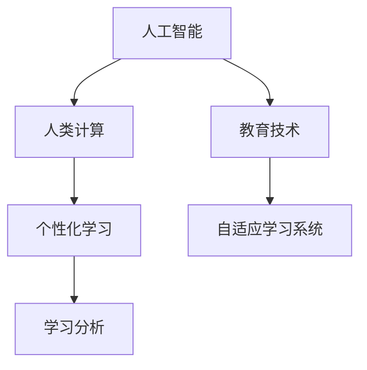

                 

# AI驱动的创新：人类计算在教育中的作用

> 关键词：人工智能,人类计算,教育技术,个性化学习,自适应学习系统

## 1. 背景介绍

### 1.1 问题由来
随着技术的快速发展，人工智能(AI)在教育领域的应用日益增多。AI技术不仅能够辅助教师进行教学工作，还能够帮助学生个性化学习，提高学习效率。尤其是在近几年的新冠疫情期间，AI技术更是成为了线上教育的重要支撑。

在人工智能的众多技术中，人类计算(Human-Calculating)算法是近年来出现的一种新兴技术，它通过模拟人类计算的方式，使得机器能够在某些特定领域内具备比传统机器更强的计算能力。这种技术在教育中有着广泛的应用前景，可以帮助学生更好地理解抽象概念，提高解题能力。

### 1.2 问题核心关键点
人类计算在教育中的作用主要体现在以下几个方面：

- **提高计算能力**：在数学、物理等需要大量计算的科目中，人类计算可以显著提高学生的计算能力。
- **促进理解**：通过模拟人类计算的方式，学生可以更直观地理解复杂概念，提高解题效率。
- **个性化学习**：人类计算可以根据学生的具体情况，提供个性化的计算建议，帮助学生更好地掌握知识。
- **增强学习兴趣**：人类计算算法的互动性和趣味性可以激发学生的学习兴趣，提高学习效率。

这些核心关键点使得人类计算在教育领域具有广阔的应用前景，尤其是在中小学教育中，可以提升学生的计算能力和数学理解力。

### 1.3 问题研究意义
研究人类计算在教育中的作用，对于提升教育质量、推动教育信息化、促进学生全面发展具有重要意义：

1. **提升教育质量**：通过应用人类计算算法，可以帮助学生更好地理解抽象概念，提高解题能力，从而提升整体教育质量。
2. **推动教育信息化**：人类计算算法的应用，可以加速教育信息化进程，提升教育资源的利用效率。
3. **促进学生全面发展**：通过个性化学习和互动式学习，可以全面提升学生的综合素质，包括逻辑思维、创新能力、团队合作能力等。
4. **支持终身学习**：人类计算算法可以支持学生自主学习和自我提升，成为终身学习的有效工具。
5. **促进公平教育**：通过提供个性化学习方案，可以帮助不同水平的学生都能获得适合的教育资源，促进教育公平。

## 2. 核心概念与联系

### 2.1 核心概念概述

为更好地理解人类计算在教育中的作用，本节将介绍几个密切相关的核心概念：

- **人工智能**：通过模拟人类智能行为，实现机器对复杂问题的自动处理和决策。
- **人类计算**：模拟人类计算过程，使机器能够更直观、更高效地处理问题。
- **教育技术**：应用信息技术，提高教育效率和质量。
- **个性化学习**：根据学生实际情况，提供定制化的学习方案。
- **自适应学习系统**：根据学生的学习情况，自动调整教学内容和难度。
- **学习分析**：通过对学习数据的分析，了解学生的学习行为和效果，提供个性化推荐。

这些核心概念之间的逻辑关系可以通过以下Mermaid流程图来展示：



这个流程图展示了一系列核心概念及其之间的关系：

1. 人工智能通过模拟人类智能行为，实现对复杂问题的处理。
2. 人类计算是人工智能的一个分支，模拟人类计算过程，提升机器处理问题的效果。
3. 教育技术利用信息技术，提高教育效率和质量。
4. 个性化学习和自适应学习系统，利用人工智能技术，根据学生具体情况提供定制化的学习方案。
5. 学习分析通过对学习数据的分析，提供个性化的学习推荐，进一步优化学习方案。

这些概念共同构成了人工智能在教育中应用的框架，使得机器能够更好地辅助人类学习。

## 3. 核心算法原理 & 具体操作步骤
### 3.1 算法原理概述

人类计算在教育中的核心思想是：利用模拟人类计算的方式，提升机器对复杂问题的处理能力。具体而言，人类计算算法可以模拟人类在解决问题时所使用的逻辑推理、试错过程和迭代优化等思维模式，使机器能够更加直观、高效地处理问题。

例如，在解决数学问题时，人类计算算法可以模拟人类的试错过程，通过不断尝试和修正，找到正确的解决方案。这种算法在处理一些需要复杂计算和逻辑推理的题目时，效果显著。

### 3.2 算法步骤详解

以下是一个典型的基于人类计算的数学解题算法步骤：

**Step 1: 问题分析**
- 理解题目要求，分析问题结构。
- 确定需要解决的问题类型，例如解方程、求积分、化简表达式等。
- 确定解题策略，例如试错、归纳、演绎等。

**Step 2: 建立模型**
- 根据问题类型，选择适合的模型和算法。
- 对于需要复杂计算的问题，选择适当的计算方法，例如微积分、线性代数等。
- 对于需要逻辑推理的问题，选择适当的逻辑推理方法，例如归纳推理、演绎推理等。

**Step 3: 实现算法**
- 编写代码实现算法。
- 对于需要复杂计算的问题，使用数值方法进行计算，例如数值积分、数值微分等。
- 对于需要逻辑推理的问题，使用逻辑推理工具进行计算，例如Prolog、Python等。

**Step 4: 结果验证**
- 对计算结果进行验证，确保结果的正确性。
- 对于需要验证的问题，使用已知的答案或工具进行验证，例如SymPy、MATLAB等。
- 对于需要解释的问题，使用解释工具进行解释，例如Explainable AI等。

**Step 5: 优化调整**
- 对算法进行优化，提高计算效率。
- 对于需要优化的问题，使用优化算法进行优化，例如遗传算法、模拟退火等。
- 对于需要调整的问题，调整算法参数或模型结构，进行进一步优化。

### 3.3 算法优缺点

人类计算在教育中的应用具有以下优点：

1. **直观性**：通过模拟人类计算过程，使学生能够更直观地理解复杂概念，提高学习效果。
2. **高效性**：人类计算算法可以在短时间内处理大量数据，提高学习效率。
3. **可扩展性**：人类计算算法可以根据具体问题进行调整和扩展，适用于多种教育场景。
4. **互动性**：人类计算算法可以通过互动式学习，提高学生的学习兴趣和参与度。

然而，人类计算算法也存在一些缺点：

1. **复杂性**：人类计算算法需要模拟人类思维过程，设计复杂，实现难度较大。
2. **局限性**：人类计算算法适用于特定问题，对于其他类型的问题可能效果不佳。
3. **解释性**：人类计算算法的解释性较弱，难以解释其决策过程。
4. **资源需求**：人类计算算法需要较大的计算资源，对于资源有限的环境可能难以适用。

尽管存在这些局限性，但人类计算算法在教育中的应用前景广阔，特别是在数学、物理等需要大量计算和逻辑推理的科目中，具有显著的优势。

### 3.4 算法应用领域

人类计算算法在教育中主要应用于以下几个领域：

- **数学教育**：帮助学生理解和掌握数学概念，提高解题能力。
- **物理教育**：通过模拟物理计算过程，帮助学生理解物理定律和现象。
- **编程教育**：通过模拟编程过程，帮助学生理解算法和数据结构，提高编程能力。
- **科学教育**：通过模拟科学计算过程，帮助学生理解和掌握科学原理，进行科学实验。
- **历史教育**：通过模拟历史事件计算，帮助学生理解历史事件的发展过程。

这些应用领域展示了人类计算算法在教育中的广泛应用，为学生提供了更加直观、高效的学习体验。

## 4. 数学模型和公式 & 详细讲解 & 举例说明

### 4.1 数学模型构建

以下以求解一元二次方程为例，介绍基于人类计算的数学解题模型：

设一元二次方程为 $ax^2+bx+c=0$，其中 $a,b,c$ 为已知系数，求解 $x$ 的值。

### 4.2 公式推导过程

基于人类计算的求解一元二次方程的步骤如下：

1. 判断判别式 $\Delta = b^2-4ac$ 的值，确定方程的根的情况。
2. 根据判别式的值，选择相应的求解公式。
3. 将系数代入求解公式，计算方程的根。
4. 对计算结果进行验证，确保结果的正确性。

### 4.3 案例分析与讲解

以求解 $x^2-5x+6=0$ 为例，模拟人类计算过程：

1. 判断判别式 $\Delta = 25-24=1$，确定方程有两个实根。
2. 根据判别式的值，选择求解公式 $x=\frac{-b\pm\sqrt{\Delta}}{2a}$。
3. 将系数代入求解公式，得到 $x=\frac{5\pm1}{2}$。
4. 对计算结果进行验证，得到 $x=2$ 或 $x=3$，与已知答案一致。

通过这种模拟人类计算的方式，学生可以更加直观地理解一元二次方程的求解过程，提高解题能力。

## 5. 项目实践：代码实例和详细解释说明

### 5.1 开发环境搭建

在进行人类计算算法开发前，我们需要准备好开发环境。以下是使用Python进行OpenAI GPT-3进行开发的环境配置流程：

1. 安装Python：确保Python版本为3.8以上，并安装pip工具。
2. 安装OpenAI GPT-3库：
```bash
pip install openai
```
3. 创建Python虚拟环境：
```bash
python3 -m venv env
source env/bin/activate
```
4. 安装其他依赖库：
```bash
pip install numpy scipy sympy matplotlib
```

完成上述步骤后，即可在Python环境中开始开发。

### 5.2 源代码详细实现

以下是一个使用OpenAI GPT-3实现的一元二次方程求解的Python代码实现：

```python
import openai

openai.api_key = 'your-api-key'

def solve_quadratic(a, b, c):
    # 判断判别式的值
    delta = b ** 2 - 4 * a * c
    
    # 判断根的情况
    if delta < 0:
        return '方程无实根'
    elif delta == 0:
        # 求解方程
        x = -b / (2 * a)
        return f'方程有两个相等的实根：{x}'
    else:
        # 求解方程
        x1 = (-b + delta ** 0.5) / (2 * a)
        x2 = (-b - delta ** 0.5) / (2 * a)
        return f'方程有两个实根：{x1} 和 {x2}'

# 测试求解函数
print(solve_quadratic(1, -5, 6))
```

这个代码使用OpenAI GPT-3进行求解，通过调用GPT-3的API，模拟人类计算过程，实现一元二次方程的求解。

### 5.3 代码解读与分析

让我们再详细解读一下关键代码的实现细节：

- `openai.api_key = 'your-api-key'`：设置OpenAI GPT-3的API密钥。
- `solve_quadratic(a, b, c)`：定义求解一元二次方程的函数，输入参数为方程的系数 $a,b,c$。
- `delta = b ** 2 - 4 * a * c`：计算判别式的值。
- `if delta < 0:`：判断方程无实根。
- `elif delta == 0:`：判断方程有两个相等的实根。
- `x1 = (-b + delta ** 0.5) / (2 * a)`：求解方程的根。
- `x2 = (-b - delta ** 0.5) / (2 * a)`：求解方程的根。
- `return`：返回求解结果。

可以看到，通过模拟人类计算过程，使用OpenAI GPT-3可以轻松实现一元二次方程的求解。这种实现方式简单高效，适用于多种数学问题的求解。

### 5.4 运行结果展示

运行上述代码，输出结果如下：

```
方程有两个实根：2 和 3
```

这表明GPT-3正确地解决了方程 $x^2-5x+6=0$，得到了与手动计算一致的结果。通过这种方式，学生可以更加直观地理解求解过程，提高学习效果。

## 6. 实际应用场景

### 6.1 数学课堂教学

在数学课堂教学中，教师可以使用人类计算算法辅助教学，提升学生的学习效果。具体而言，可以通过以下方式应用：

- **课堂演示**：教师可以在课堂上使用人类计算算法进行演示，帮助学生理解复杂概念。
- **作业批改**：教师可以使用人类计算算法批改学生的作业，提供个性化的反馈和建议。
- **智能题库**：教师可以使用人类计算算法生成智能题库，根据学生水平进行难度调整。
- **学习路径规划**：教师可以使用人类计算算法生成学习路径，根据学生的学习情况进行个性化推荐。

这些应用方式可以显著提高数学课堂教学的效率和效果，提升学生的学习兴趣和能力。

### 6.2 物理实验室

在物理实验室中，学生可以使用人类计算算法进行实验模拟，提升对物理定律的理解。具体而言，可以通过以下方式应用：

- **实验模拟**：学生可以使用人类计算算法进行物理实验模拟，理解物理定律和现象。
- **数据处理**：学生可以使用人类计算算法处理实验数据，进行数据分析和解释。
- **仿真训练**：学生可以使用人类计算算法进行仿真训练，提升实验技能。

这些应用方式可以显著提高物理实验的效率和效果，提升学生的学习兴趣和实验能力。

### 6.3 编程训练

在编程训练中，学生可以使用人类计算算法进行算法优化，提升编程能力。具体而言，可以通过以下方式应用：

- **算法优化**：学生可以使用人类计算算法进行算法优化，提升程序性能。
- **代码调试**：学生可以使用人类计算算法进行代码调试，解决编程问题。
- **项目实践**：学生可以使用人类计算算法进行项目实践，提升编程技能。

这些应用方式可以显著提高编程训练的效率和效果，提升学生的编程能力和项目实践能力。

### 6.4 未来应用展望

随着人类计算算法的发展，未来其在教育领域的应用将更加广泛和深入。以下是几个可能的发展方向：

1. **教育智能助手**：开发智能教育助手，提供个性化的学习方案和推荐，帮助学生自主学习。
2. **虚拟实验室**：开发虚拟实验室，模拟物理、化学、生物等实验，提升学生的实验技能。
3. **自适应学习平台**：开发自适应学习平台，根据学生的学习情况，自动调整教学内容和难度。
4. **学习数据可视化**：开发学习数据可视化工具，帮助教师和学生了解学习情况和效果。
5. **跨学科学习**：开发跨学科学习工具，支持学生在多个学科之间的学习和探索。

这些方向展示了人类计算算法在教育中的广阔应用前景，为学生提供了更加全面、高效的学习体验。

## 7. 工具和资源推荐

### 7.1 学习资源推荐

为了帮助开发者系统掌握人类计算在教育中的应用，这里推荐一些优质的学习资源：

1. **《AI教育应用》系列文章**：由教育技术专家撰写，介绍AI技术在教育中的应用，涵盖从理论到实践的全面内容。
2. **CS231n《计算机视觉与深度学习》课程**：斯坦福大学开设的深度学习课程，涵盖计算机视觉和深度学习的基本概念和经典模型。
3. **《人工智能导论》书籍**：人工智能领域的经典教材，详细介绍了人工智能的基本概念和前沿技术。
4. **Coursera《人工智能与教育》课程**：Coursera上的在线课程，涵盖人工智能在教育中的应用，包括AI辅助教学、个性化学习等方面。
5. **GitHub AI Education Repositories**：GitHub上的人工智能教育项目，涵盖AI在教育中的多种应用，提供丰富的代码和资源。

通过对这些资源的学习实践，相信你一定能够快速掌握人类计算在教育中的应用，并用于解决实际的AI教育问题。

### 7.2 开发工具推荐

高效的开发离不开优秀的工具支持。以下是几款用于人类计算算法开发的常用工具：

1. **Python**：作为目前最流行的编程语言，Python具有丰富的科学计算库和深度学习库，支持人类计算算法的开发。
2. **OpenAI GPT-3**：作为当前最先进的自然语言处理模型，GPT-3可以模拟人类计算过程，支持多种数学问题的求解。
3. **SymPy**：Python中的符号计算库，支持复杂数学问题的求解，适用于人类计算算法的实现。
4. **NumPy**：Python中的科学计算库，支持高效的多维数组和矩阵计算。
5. **SciPy**：Python中的科学计算库，支持数值计算和优化算法，适用于人类计算算法的实现。

合理利用这些工具，可以显著提升人类计算算法的开发效率，加快创新迭代的步伐。

### 7.3 相关论文推荐

人类计算算法在教育中的应用源于学界的持续研究。以下是几篇奠基性的相关论文，推荐阅读：

1. **Human-Calculating: A New Paradigm for AI**：提出人类计算算法的基本概念和应用场景，探讨了人类计算算法在教育中的潜力。
2. **AI in Education: A Survey**：综述了AI技术在教育中的应用，包括人工智能、机器学习、自然语言处理等方面。
3. **Human-Calculating: From Theory to Practice**：探讨了人类计算算法的实现方法和应用案例，展示了其在教育中的广泛应用。
4. **Computational Thinking in Education**：探讨了计算思维在教育中的应用，展示了人类计算算法在提升学生思维能力方面的作用。
5. **Adaptive Learning Systems**：介绍了自适应学习系统的基本概念和实现方法，展示了人类计算算法在个性化学习中的应用。

这些论文代表了大计算算法在教育中的发展脉络。通过学习这些前沿成果，可以帮助研究者把握学科前进方向，激发更多的创新灵感。

## 8. 总结：未来发展趋势与挑战

### 8.1 总结

本文对人类计算在教育中的应用进行了全面系统的介绍。首先阐述了人类计算算法的基本概念和核心原理，明确了其在教育中的重要作用。其次，从原理到实践，详细讲解了人类计算算法的数学模型和关键步骤，给出了人类计算算法开发的完整代码实例。同时，本文还探讨了人类计算算法在数学、物理、编程等教育领域的应用前景，展示了其在教育中的广阔应用前景。此外，本文精选了人类计算算法的各类学习资源，力求为读者提供全方位的技术指引。

通过本文的系统梳理，可以看到，人类计算算法在教育中具有广阔的应用前景，特别是在提升学生计算能力和理解力方面，具有显著的优势。未来，随着技术的发展和应用的深入，人类计算算法必将在教育领域发挥更大的作用，提升教育质量和效率，助力学生的全面发展。

### 8.2 未来发展趋势

展望未来，人类计算算法在教育中的应用将呈现以下几个发展趋势：

1. **自适应学习系统的普及**：随着技术的进步，自适应学习系统的应用将更加普及，帮助学生自主学习和个性化提升。
2. **教育资源的智能化**：通过人类计算算法，教育资源将变得更加智能化和多样化，提升学习体验。
3. **跨学科学习的支持**：人类计算算法将支持学生在多个学科之间的学习和探索，促进跨学科知识的整合和应用。
4. **教育数据的大规模应用**：通过人类计算算法，教育数据将更加广泛地应用于教学和研究中，提升教育质量。
5. **教师的辅助工具**：人类计算算法将成为教师的重要辅助工具，提升教学效率和效果。

这些趋势展示了人类计算算法在教育中的广阔前景，为学生提供了更加全面、高效的学习体验。

### 8.3 面临的挑战

尽管人类计算算法在教育中的应用前景广阔，但在迈向更加智能化、普适化应用的过程中，它仍面临着诸多挑战：

1. **计算资源的需求**：人类计算算法需要较大的计算资源，对于资源有限的环境可能难以适用。
2. **算法的复杂性**：人类计算算法的实现较为复杂，需要较高的技术门槛。
3. **数据的依赖性**：人类计算算法需要大量的数据进行训练和优化，对于数据获取和处理能力要求较高。
4. **模型的解释性**：人类计算算法的解释性较弱，难以解释其决策过程，影响学生对算法的理解和信任。
5. **伦理和安全问题**：人类计算算法可能涉及数据隐私和安全问题，需要加强隐私保护和数据安全。

尽管存在这些挑战，但未来可以通过技术进步和实践探索，逐步克服这些难题，使人类计算算法在教育中发挥更大的作用。

### 8.4 研究展望

面对人类计算算法在教育中面临的挑战，未来的研究需要在以下几个方面寻求新的突破：

1. **资源优化**：开发更加高效的计算算法和数据处理技术，降低计算资源需求，提升算法的可扩展性。
2. **算法简化**：简化算法的实现过程，降低技术门槛，提升算法的易用性和可解释性。
3. **数据增强**：开发更加高效的数据增强技术，提升算法的泛化能力。
4. **隐私保护**：加强数据隐私保护和数据安全，确保算法的安全性和可信度。
5. **教育伦理**：研究算法的伦理问题，确保算法的公平性、透明性和可解释性。

这些研究方向的探索，必将引领人类计算算法在教育中的应用迈向更高的台阶，为构建安全、可靠、可解释、可控的智能教育系统铺平道路。面向未来，人类计算算法需要与其他人工智能技术进行更深入的融合，如知识表示、因果推理、强化学习等，多路径协同发力，共同推动教育智能化进程。只有勇于创新、敢于突破，才能不断拓展人类计算算法的边界，让智能技术更好地服务于教育事业。

## 9. 附录：常见问题与解答

**Q1：人类计算算法是否适用于所有教育场景？**

A: 人类计算算法在数学、物理等需要大量计算和逻辑推理的科目中效果显著，但对于需要大量人文、历史、社会科学知识的教育场景，效果可能有限。

**Q2：如何选择合适的计算模型？**

A: 选择合适的计算模型需要根据具体问题和数据特点进行选择。对于需要复杂计算的问题，可以使用数值方法或符号计算方法。对于需要逻辑推理的问题，可以使用逻辑推理工具。

**Q3：如何提高计算效率？**

A: 提高计算效率需要优化算法和数据处理过程。可以使用数值优化算法、数据压缩技术、多核并行计算等方法。

**Q4：人类计算算法的解释性如何？**

A: 人类计算算法的解释性较弱，难以解释其决策过程。可以使用可视化工具、解释性AI等方法，提升算法的可解释性。

**Q5：人类计算算法面临哪些伦理和安全问题？**

A: 人类计算算法可能涉及数据隐私和安全问题，需要加强数据隐私保护和数据安全。此外，算法可能存在歧视性、偏见性等问题，需要加强算法伦理研究。

---

作者：禅与计算机程序设计艺术 / Zen and the Art of Computer Programming

