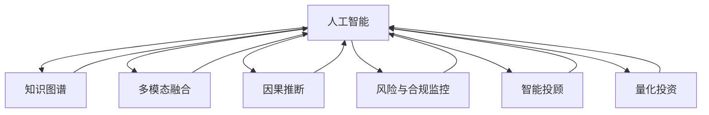

                 

# AI驱动的创新：人类计算在金融领域的潜力

## 1. 背景介绍

### 1.1 问题由来

金融行业一直是人工智能技术应用的先锋。随着大数据、云计算、区块链等新兴技术的飞速发展，金融领域正逐渐从以规则驱动为主导的传统银行业务，向数据驱动、智能决策的金融科技转型。AI在金融领域的应用已经成为行业共识。

AI技术在金融领域的广泛应用，不仅提升了金融服务效率和客户体验，还促进了风险管理和金融创新。例如，基于机器学习的信用评分系统已经在许多银行得到应用，帮助银行识别潜在的违约风险。利用AI进行算法交易则能够快速分析市场数据，做出精准的投资决策。AI在反欺诈、合规监控、客户行为分析等方面的应用，也显著提高了金融机构的运营效率和风险控制能力。

然而，尽管AI技术在金融领域取得了显著进展，其潜力还远未充分挖掘。现有AI技术在金融场景中的应用，往往局限于单个任务，缺乏系统性、泛化性和跨领域适应性。传统金融场景中的大量业务逻辑和决策规则，依然难以被AI技术高效地理解和应用。因此，如何更全面、更深入地将AI技术应用于金融领域，挖掘AI驱动金融创新的潜力，成为亟待解决的课题。

### 1.2 问题核心关键点

人类计算（Human-Computer Interaction, HCI）是指通过交互式方式，结合人机协同，实现更高效、更灵活的知识处理和决策。在金融领域，人类计算的应用主要体现在：

- **知识图谱构建**：将金融领域的知识、规则和决策逻辑，以结构化的形式整合进知识图谱中，供AI模型在金融决策中参考。
- **多模态融合**：融合金融领域的多模态数据，包括文本、图像、声音、时间序列等，构建更为全面、准确的金融决策模型。
- **因果推断与行为建模**：利用因果推断和行为建模技术，更深入地理解金融业务逻辑和用户行为，提高决策的合理性和可解释性。
- **风险与合规监控**：构建实时监控系统，通过AI对金融业务全流程进行自动化、智能化监控，确保合规和风险控制。
- **智能投顾与量化投资**：结合自然语言处理、计算机视觉、强化学习等技术，实现金融产品的自动化投资顾问和智能量化交易。

## 2. 核心概念与联系

### 2.1 核心概念概述

为了更好地理解AI在金融领域的应用，本节将介绍几个核心概念：

- **人工智能（AI）**：涉及机器学习、深度学习、计算机视觉、自然语言处理等多个领域的技术，用于模拟人类智能行为，解决复杂问题。
- **知识图谱（KG）**：将金融领域的海量非结构化知识，整合进结构化的图谱中，供AI模型进行推理和决策。
- **多模态融合**：将文本、图像、声音等多源数据融合到同一个模型中，提升模型的综合分析能力。
- **因果推断**：通过因果模型解析金融业务中的因果关系，提高决策的科学性和合理性。
- **风险与合规监控**：通过AI系统实时监控金融业务，确保符合法规要求，防范风险。
- **智能投顾**：结合AI技术和金融知识，为投资者提供个性化的投资建议和策略。
- **量化投资**：利用AI算法进行金融市场分析，自动化交易决策，提升投资收益。

这些概念之间的逻辑关系可以通过以下Mermaid流程图来展示：



这个流程图展示了人工智能在金融领域的多维应用，以及各个应用之间的联系和协同作用。

## 3. 核心算法原理 & 具体操作步骤

### 3.1 算法原理概述

AI在金融领域的应用，往往涉及多学科、多领域知识的综合运用。其核心算法原理可以概括为：

- **数据收集与清洗**：从金融业务数据中收集有价值的信息，并对其进行清洗和预处理，构建高质量的数据集。
- **特征工程**：从原始数据中提取、转换和选择有意义的特征，为模型训练提供数据支持。
- **模型训练与优化**：通过机器学习或深度学习算法，训练模型并优化参数，提升模型的预测和决策能力。
- **知识图谱构建**：将金融领域的知识、规则和决策逻辑，以结构化的形式整合进知识图谱中，供AI模型进行推理和决策。
- **多模态融合**：融合金融领域的多模态数据，包括文本、图像、声音、时间序列等，构建更为全面、准确的金融决策模型。
- **因果推断与行为建模**：利用因果推断和行为建模技术，更深入地理解金融业务逻辑和用户行为，提高决策的合理性和可解释性。
- **风险与合规监控**：通过AI系统实时监控金融业务，确保符合法规要求，防范风险。
- **智能投顾与量化投资**：结合自然语言处理、计算机视觉、强化学习等技术，实现金融产品的自动化投资顾问和智能量化交易。

### 3.2 算法步骤详解

AI在金融领域的应用，通常包括以下几个关键步骤：

**Step 1: 数据收集与清洗**

- 从金融业务中收集各种数据，包括客户交易记录、市场数据、财务报表、新闻评论等。
- 对数据进行清洗，去除缺失值、异常值和重复数据，确保数据质量。
- 对文本数据进行分词、去停用词、词向量化等预处理，使其适合模型训练。

**Step 2: 特征工程**

- 从清洗后的数据中提取有意义的特征，如客户行为特征、市场情绪指标、财务指标等。
- 选择合适的特征选择算法，如L1正则化、主成分分析等，进行特征降维。
- 利用特征工程技术，生成更全面、准确、适用于模型训练的特征集。

**Step 3: 模型训练与优化**

- 选择合适的算法，如随机森林、支持向量机、神经网络等，进行模型训练。
- 使用交叉验证、网格搜索等方法，进行模型参数的调优。
- 使用学习率调整、权重衰减等方法，防止过拟合。
- 将模型应用于实际金融场景，进行效果评估和性能优化。

**Step 4: 知识图谱构建**

- 将金融领域的知识、规则和决策逻辑，整合进知识图谱中。
- 使用关系型数据库或图数据库，存储和管理知识图谱。
- 利用图数据库的查询功能和图算法，进行金融决策的推理和推理。

**Step 5: 多模态融合**

- 收集金融领域的多模态数据，如文本、图像、声音等。
- 选择合适的多模态融合算法，如时空网络、注意力机制等，构建多模态模型。
- 将多模态数据融合到同一个模型中，提升模型的综合分析能力。

**Step 6: 因果推断与行为建模**

- 利用因果推断技术，解析金融业务中的因果关系，提高决策的科学性和合理性。
- 利用行为建模技术，分析用户行为，预测用户需求和行为变化，提升个性化服务水平。

**Step 7: 风险与合规监控**

- 构建实时监控系统，通过AI对金融业务全流程进行自动化、智能化监控。
- 利用异常检测算法，实时识别潜在的风险和违规行为。
- 将监控结果反馈到业务流程中，及时采取应对措施。

**Step 8: 智能投顾与量化投资**

- 结合自然语言处理、计算机视觉、强化学习等技术，实现金融产品的自动化投资顾问。
- 利用量化交易算法，进行市场分析和交易决策，优化投资收益。
- 定期更新模型，保持模型的实时性和准确性。

### 3.3 算法优缺点

AI在金融领域的应用，具有以下优点：

- **高效性**：自动化处理大量数据和业务逻辑，提升工作效率。
- **精准性**：利用机器学习和大数据技术，提升决策的精准度和科学性。
- **泛化性**：通过多模态融合和知识图谱构建，增强模型的泛化能力和适应性。
- **可解释性**：利用因果推断和行为建模技术，提高模型的可解释性和透明度。

同时，该方法也存在以下局限性：

- **数据依赖**：AI在金融领域的应用，高度依赖于数据的质量和完整性。数据收集和处理难度大，成本高。
- **模型复杂性**：多模态融合和知识图谱构建，使得模型结构复杂，调试和优化难度大。
- **技术门槛**：涉及多学科、多领域知识，技术门槛高，需要多学科人才协同工作。
- **隐私与安全**：金融数据涉及个人隐私和公司机密，需要严格的数据保护和隐私管理。
- **法规限制**：金融业务受法律法规严格约束，AI应用需要符合相关法律法规。

尽管存在这些局限性，但就目前而言，AI技术在金融领域的应用前景广阔，未来的研究和实践必将进一步挖掘其潜力，推动金融行业的智能化转型。

### 3.4 算法应用领域

AI在金融领域的应用，已经覆盖了金融业务的各个环节，包括但不限于以下领域：

- **风险管理**：利用AI进行信用风险评估、市场风险识别、操作风险监控等。
- **客户服务**：通过智能客服、智能投顾、智能理财等，提升客户体验和满意度。
- **交易与投资**：利用算法交易、量化投资等，优化交易策略，提升投资收益。
- **反欺诈**：利用机器学习、深度学习等技术，识别和防范金融欺诈行为。
- **合规监控**：构建实时监控系统，确保金融业务的合规性，防范违规行为。
- **财务分析**：利用自然语言处理技术，自动分析财务报表、新闻评论等，辅助财务决策。
- **情感分析**：通过情感分析技术，分析市场情绪，辅助投资决策。

此外，AI在金融领域的应用还涉及到金融科技（FinTech）的各个方面，如区块链、数字货币、金融科技创新等，推动金融行业的数字化、智能化转型。

## 4. 数学模型和公式 & 详细讲解  
### 4.1 数学模型构建

本节将使用数学语言对AI在金融领域的应用进行更加严格的刻画。

记金融数据集为 $D=\{(x_i, y_i)\}_{i=1}^N$，其中 $x_i$ 为输入数据，$y_i$ 为输出标签。

定义模型 $M_{\theta}$ 在输入 $x_i$ 上的预测为 $\hat{y}_i=M_{\theta}(x_i)$。

模型的训练目标为最小化经验风险，即：

$$
\mathcal{L}(\theta) = \frac{1}{N} \sum_{i=1}^N \ell(\hat{y}_i, y_i)
$$

其中 $\ell$ 为损失函数，如均方误差、交叉熵等。

通过梯度下降等优化算法，更新模型参数 $\theta$，使得 $\mathcal{L}(\theta)$ 最小化。

### 4.2 公式推导过程

以信用评分系统为例，假设有 $N$ 个客户样本 $(x_i, y_i)$，每个样本包含 $d$ 个特征。模型的输入 $x_i$ 为一个 $d$ 维向量，输出 $\hat{y}_i$ 为一个连续值，表示客户违约概率。

设模型 $M_{\theta}$ 的输出层为一个线性层和一个激活函数，即 $\hat{y}_i = \sigma(\theta^Tx_i)$，其中 $\theta$ 为模型参数，$x_i$ 为特征向量，$\sigma$ 为激活函数。

此时，模型的损失函数为均方误差：

$$
\ell(\hat{y}_i, y_i) = (\hat{y}_i - y_i)^2
$$

模型的训练目标为最小化均方误差：

$$
\mathcal{L}(\theta) = \frac{1}{N} \sum_{i=1}^N (\hat{y}_i - y_i)^2
$$

利用梯度下降算法，更新模型参数 $\theta$：

$$
\theta \leftarrow \theta - \eta \nabla_{\theta}\mathcal{L}(\theta)
$$

其中 $\eta$ 为学习率，$\nabla_{\theta}\mathcal{L}(\theta)$ 为损失函数对参数 $\theta$ 的梯度。

在实践中，还需要引入正则化技术，如L2正则、Dropout等，防止过拟合。

## 5. 项目实践：代码实例和详细解释说明
### 5.1 开发环境搭建

在进行AI在金融领域的应用实践前，我们需要准备好开发环境。以下是使用Python进行PyTorch开发的环境配置流程：

1. 安装Anaconda：从官网下载并安装Anaconda，用于创建独立的Python环境。

2. 创建并激活虚拟环境：
```bash
conda create -n pytorch-env python=3.8 
conda activate pytorch-env
```

3. 安装PyTorch：根据CUDA版本，从官网获取对应的安装命令。例如：
```bash
conda install pytorch torchvision torchaudio cudatoolkit=11.1 -c pytorch -c conda-forge
```

4. 安装Transformers库：
```bash
pip install transformers
```

5. 安装各类工具包：
```bash
pip install numpy pandas scikit-learn matplotlib tqdm jupyter notebook ipython
```

完成上述步骤后，即可在`pytorch-env`环境中开始AI在金融领域的应用实践。

### 5.2 源代码详细实现

这里我们以信用评分系统为例，给出使用Transformers库对BERT模型进行金融场景微调的PyTorch代码实现。

首先，定义信用评分系统数据处理函数：

```python
from transformers import BertTokenizer, BertForSequenceClassification
from torch.utils.data import Dataset
import torch

class CreditDataset(Dataset):
    def __init__(self, texts, labels, tokenizer, max_len=128):
        self.texts = texts
        self.labels = labels
        self.tokenizer = tokenizer
        self.max_len = max_len
        
    def __len__(self):
        return len(self.texts)
    
    def __getitem__(self, item):
        text = self.texts[item]
        label = self.labels[item]
        
        encoding = self.tokenizer(text, return_tensors='pt', max_length=self.max_len, padding='max_length', truncation=True)
        input_ids = encoding['input_ids'][0]
        attention_mask = encoding['attention_mask'][0]
        
        # 对标签进行编码
        encoded_labels = [1 if label == 'default' else 0] 
        encoded_labels.extend([0] * (self.max_len - len(encoded_labels)))
        labels = torch.tensor(encoded_labels, dtype=torch.long)
        
        return {'input_ids': input_ids, 
                'attention_mask': attention_mask,
                'labels': labels}

# 创建dataset
tokenizer = BertTokenizer.from_pretrained('bert-base-cased')

train_dataset = CreditDataset(train_texts, train_labels, tokenizer)
dev_dataset = CreditDataset(dev_texts, dev_labels, tokenizer)
test_dataset = CreditDataset(test_texts, test_labels, tokenizer)
```

然后，定义模型和优化器：

```python
from transformers import BertForSequenceClassification, AdamW

model = BertForSequenceClassification.from_pretrained('bert-base-cased', num_labels=2)

optimizer = AdamW(model.parameters(), lr=2e-5)
```

接着，定义训练和评估函数：

```python
from torch.utils.data import DataLoader
from tqdm import tqdm
from sklearn.metrics import classification_report

device = torch.device('cuda') if torch.cuda.is_available() else torch.device('cpu')
model.to(device)

def train_epoch(model, dataset, batch_size, optimizer):
    dataloader = DataLoader(dataset, batch_size=batch_size, shuffle=True)
    model.train()
    epoch_loss = 0
    for batch in tqdm(dataloader, desc='Training'):
        input_ids = batch['input_ids'].to(device)
        attention_mask = batch['attention_mask'].to(device)
        labels = batch['labels'].to(device)
        model.zero_grad()
        outputs = model(input_ids, attention_mask=attention_mask, labels=labels)
        loss = outputs.loss
        epoch_loss += loss.item()
        loss.backward()
        optimizer.step()
    return epoch_loss / len(dataloader)

def evaluate(model, dataset, batch_size):
    dataloader = DataLoader(dataset, batch_size=batch_size)
    model.eval()
    preds, labels = [], []
    with torch.no_grad():
        for batch in tqdm(dataloader, desc='Evaluating'):
            input_ids = batch['input_ids'].to(device)
            attention_mask = batch['attention_mask'].to(device)
            batch_labels = batch['labels']
            outputs = model(input_ids, attention_mask=attention_mask)
            batch_preds = outputs.logits.argmax(dim=2).to('cpu').tolist()
            batch_labels = batch_labels.to('cpu').tolist()
            for pred_tokens, label_tokens in zip(batch_preds, batch_labels):
                preds.append(pred_tokens[:len(label_tokens)])
                labels.append(label_tokens)
                
    print(classification_report(labels, preds))
```

最后，启动训练流程并在测试集上评估：

```python
epochs = 5
batch_size = 16

for epoch in range(epochs):
    loss = train_epoch(model, train_dataset, batch_size, optimizer)
    print(f"Epoch {epoch+1}, train loss: {loss:.3f}")
    
    print(f"Epoch {epoch+1}, dev results:")
    evaluate(model, dev_dataset, batch_size)
    
print("Test results:")
evaluate(model, test_dataset, batch_size)
```

以上就是使用PyTorch对BERT进行信用评分系统微调的完整代码实现。可以看到，得益于Transformers库的强大封装，我们可以用相对简洁的代码完成BERT模型的加载和微调。

### 5.3 代码解读与分析

让我们再详细解读一下关键代码的实现细节：

**CreditDataset类**：
- `__init__`方法：初始化文本、标签、分词器等关键组件。
- `__len__`方法：返回数据集的样本数量。
- `__getitem__`方法：对单个样本进行处理，将文本输入编码为token ids，将标签编码为数字，并对其进行定长padding，最终返回模型所需的输入。

**模型定义与优化器**：
- 使用BertForSequenceClassification类定义BERT模型，并指定输出层为二分类任务。
- 使用AdamW优化器，设置学习率。

**训练和评估函数**：
- 使用PyTorch的DataLoader对数据集进行批次化加载，供模型训练和推理使用。
- 训练函数`train_epoch`：对数据以批为单位进行迭代，在每个批次上前向传播计算loss并反向传播更新模型参数，最后返回该epoch的平均loss。
- 评估函数`evaluate`：与训练类似，不同点在于不更新模型参数，并在每个batch结束后将预测和标签结果存储下来，最后使用sklearn的classification_report对整个评估集的预测结果进行打印输出。

**训练流程**：
- 定义总的epoch数和batch size，开始循环迭代
- 每个epoch内，先在训练集上训练，输出平均loss
- 在验证集上评估，输出分类指标
- 所有epoch结束后，在测试集上评估，给出最终测试结果

可以看到，PyTorch配合Transformers库使得BERT微调的代码实现变得简洁高效。开发者可以将更多精力放在数据处理、模型改进等高层逻辑上，而不必过多关注底层的实现细节。

当然，工业级的系统实现还需考虑更多因素，如模型的保存和部署、超参数的自动搜索、更灵活的任务适配层等。但核心的微调范式基本与此类似。

## 6. 实际应用场景

### 6.1 智能客服系统

基于AI在金融领域的应用，智能客服系统可以有效提升金融机构的客户服务质量。传统客服往往需要配备大量人力，高峰期响应缓慢，且一致性和专业性难以保证。而使用AI在金融领域的应用，可以7x24小时不间断服务，快速响应客户咨询，用自然流畅的语言解答各类常见问题。

在技术实现上，可以收集企业内部的历史客服对话记录，将问题和最佳答复构建成监督数据，在此基础上对预训练模型进行微调。微调后的模型能够自动理解用户意图，匹配最合适的答案模板进行回复。对于客户提出的新问题，还可以接入检索系统实时搜索相关内容，动态组织生成回答。如此构建的智能客服系统，能大幅提升客户咨询体验和问题解决效率。

### 6.2 金融舆情监测

金融机构需要实时监测市场舆论动向，以便及时应对负面信息传播，规避金融风险。传统的人工监测方式成本高、效率低，难以应对网络时代海量信息爆发的挑战。基于AI在金融领域的应用，文本分类和情感分析技术，为金融舆情监测提供了新的解决方案。

具体而言，可以收集金融领域相关的新闻、报道、评论等文本数据，并对其进行主题标注和情感标注。在此基础上对预训练语言模型进行微调，使其能够自动判断文本属于何种主题，情感倾向是正面、中性还是负面。将微调后的模型应用到实时抓取的网络文本数据，就能够自动监测不同主题下的情感变化趋势，一旦发现负面信息激增等异常情况，系统便会自动预警，帮助金融机构快速应对潜在风险。

### 6.3 个性化推荐系统

当前的推荐系统往往只依赖用户的历史行为数据进行物品推荐，无法深入理解用户的真实兴趣偏好。基于AI在金融领域的应用，个性化推荐系统可以更好地挖掘用户行为背后的语义信息，从而提供更精准、多样的推荐内容。

在实践中，可以收集用户浏览、点击、评论、分享等行为数据，提取和用户交互的物品标题、描述、标签等文本内容。将文本内容作为模型输入，用户的后续行为（如是否点击、购买等）作为监督信号，在此基础上微调预训练语言模型。微调后的模型能够从文本内容中准确把握用户的兴趣点。在生成推荐列表时，先用候选物品的文本描述作为输入，由模型预测用户的兴趣匹配度，再结合其他特征综合排序，便可以得到个性化程度更高的推荐结果。

### 6.4 未来应用展望

随着AI在金融领域的应用不断发展，未来的应用场景将更加多样化。

在智慧医疗领域，基于AI在金融领域的应用，医疗问答、病历分析、药物研发等应用将提升医疗服务的智能化水平，辅助医生诊疗，加速新药开发进程。

在智能教育领域，微调技术可应用于作业批改、学情分析、知识推荐等方面，因材施教，促进教育公平，提高教学质量。

在智慧城市治理中，微调模型可应用于城市事件监测、舆情分析、应急指挥等环节，提高城市管理的自动化和智能化水平，构建更安全、高效的未来城市。

此外，在企业生产、社会治理、文娱传媒等众多领域，基于AI在金融领域的应用也将不断涌现，为经济社会发展注入新的动力。相信随着技术的日益成熟，AI在金融领域的应用必将进一步拓展，为金融创新带来新的活力。

## 7. 工具和资源推荐
### 7.1 学习资源推荐

为了帮助开发者系统掌握AI在金融领域的应用理论基础和实践技巧，这里推荐一些优质的学习资源：

1. 《深度学习在金融领域的应用》系列博文：由AI在金融领域应用的专家撰写，深入浅出地介绍了深度学习在金融领域的多项应用案例。

2. CS229《机器学习》课程：斯坦福大学开设的机器学习课程，涵盖了机器学习的基本原理和经典模型，适合金融领域的从业者和研究者。

3. 《金融大数据分析与量化投资》书籍：系统介绍了金融大数据分析技术和量化投资方法，涵盖多模态融合、因果推断等前沿内容。

4. Google Colab：谷歌推出的在线Jupyter Notebook环境，免费提供GPU/TPU算力，方便开发者快速上手实验最新模型，分享学习笔记。

通过对这些资源的学习实践，相信你一定能够快速掌握AI在金融领域的应用精髓，并用于解决实际的金融问题。
###  7.2 开发工具推荐

高效的开发离不开优秀的工具支持。以下是几款用于AI在金融领域的应用开发的常用工具：

1. PyTorch：基于Python的开源深度学习框架，灵活动态的计算图，适合快速迭代研究。大部分预训练语言模型都有PyTorch版本的实现。

2. TensorFlow：由Google主导开发的开源深度学习框架，生产部署方便，适合大规模工程应用。同样有丰富的预训练语言模型资源。

3. Transformers库：HuggingFace开发的NLP工具库，集成了众多SOTA语言模型，支持PyTorch和TensorFlow，是进行金融领域微调任务开发的利器。

4. Weights & Biases：模型训练的实验跟踪工具，可以记录和可视化模型训练过程中的各项指标，方便对比和调优。与主流深度学习框架无缝集成。

5. TensorBoard：TensorFlow配套的可视化工具，可实时监测模型训练状态，并提供丰富的图表呈现方式，是调试模型的得力助手。

6. Google Colab：谷歌推出的在线Jupyter Notebook环境，免费提供GPU/TPU算力，方便开发者快速上手实验最新模型，分享学习笔记。

合理利用这些工具，可以显著提升AI在金融领域的应用开发效率，加快创新迭代的步伐。

### 7.3 相关论文推荐

AI在金融领域的应用源于学界的持续研究。以下是几篇奠基性的相关论文，推荐阅读：

1. Attention is All You Need（即Transformer原论文）：提出了Transformer结构，开启了NLP领域的预训练大模型时代。

2. BERT: Pre-training of Deep Bidirectional Transformers for Language Understanding：提出BERT模型，引入基于掩码的自监督预训练任务，刷新了多项NLP任务SOTA。

3. LSTM: A Search Space Odyssey through Time Series Data Mining Algorithms：提出LSTM网络，适用于时间序列数据的预测和建模。

4. Factorization Machines with Logistic Loss: A Personalized Recommendation Model for Click-Through Rate Prediction：提出FM模型，适用于个性化推荐系统。

5. PathGAN: A Generative Adversarial Network for Dynamic Portfolio Optimization：提出PathGAN模型，适用于量化投资中的动态资产配置。

这些论文代表了大语言模型微调技术的发展脉络。通过学习这些前沿成果，可以帮助研究者把握学科前进方向，激发更多的创新灵感。

## 8. 总结：未来发展趋势与挑战

### 8.1 总结

本文对AI在金融领域的应用进行了全面系统的介绍。首先阐述了AI技术在金融领域的广泛应用及其带来的巨大变革。通过实例展示了AI在信用评分、智能客服、金融舆情监测、个性化推荐等多个金融场景中的应用，展示了AI技术的强大潜力和广泛适用性。

通过本文的系统梳理，可以看到，AI在金融领域的应用正在迅速扩展，从单一任务到多任务、从数据驱动到知识驱动、从局部应用到全局协同，AI在金融领域的应用前景广阔。伴随AI技术的不断发展，未来的金融领域必将迎来更智能、更高效、更安全、更公平的全新变革。

### 8.2 未来发展趋势

展望未来，AI在金融领域的应用将呈现以下几个发展趋势：

1. **多任务学习**：AI在金融领域的应用将从单一任务扩展到多任务，例如信用评分、风险监控、智能投顾等，实现一站式金融服务。

2. **知识图谱构建**：金融领域的知识图谱将成为AI应用的重要基础设施，提升金融决策的科学性和合理性。

3. **多模态融合**：融合金融领域的多模态数据，如文本、图像、声音、时间序列等，提升模型的综合分析能力。

4. **因果推断与行为建模**：利用因果推断和行为建模技术，深入理解金融业务逻辑和用户行为，提高决策的合理性和可解释性。

5. **实时监控与自动化决策**：通过AI系统实时监控金融业务，实现自动化决策，提高运营效率和风险控制能力。

6. **跨领域应用**：AI在金融领域的应用将逐步向智慧医疗、智能教育、智慧城市等跨领域应用扩展，推动各行各业智能化转型。

7. **AI伦理与安全**：随着AI应用的广泛推广，伦理与安全问题也将引起更多关注，建立透明、公平、安全的AI系统成为重要课题。

以上趋势凸显了AI在金融领域的应用前景。这些方向的探索发展，必将进一步提升金融服务的智能化水平，推动金融行业的数字化、智能化转型。

### 8.3 面临的挑战

尽管AI在金融领域的应用前景广阔，但在迈向更加智能化、普适化应用的过程中，它仍面临着诸多挑战：

1. **数据依赖**：AI在金融领域的应用高度依赖于数据的质量和完整性。数据收集和处理难度大，成本高。

2. **技术门槛**：涉及多学科、多领域知识，技术门槛高，需要多学科人才协同工作。

3. **隐私与安全**：金融数据涉及个人隐私和公司机密，需要严格的数据保护和隐私管理。

4. **法规限制**：金融业务受法律法规严格约束，AI应用需要符合相关法律法规。

5. **计算资源**：AI在金融领域的应用需要高性能计算资源支持，计算成本高。

6. **模型可解释性**：AI模型通常被认为是"黑盒"系统，难以解释其内部工作机制和决策逻辑。

7. **系统可靠性**：AI系统在面对复杂、多变的金融业务场景时，需要确保系统的稳定性和可靠性。

尽管存在这些挑战，但就目前而言，AI在金融领域的应用前景广阔，未来的研究和实践必将进一步挖掘其潜力，推动金融行业的智能化转型。

### 8.4 研究展望

面对AI在金融领域的应用所面临的挑战，未来的研究需要在以下几个方面寻求新的突破：

1. **无监督学习与半监督学习**：摆脱对大规模标注数据的依赖，利用自监督学习、主动学习等无监督和半监督范式，最大限度利用非结构化数据，实现更加灵活高效的AI应用。

2. **参数高效与计算高效**：开发更加参数高效、计算高效的AI应用方法，如参数共享、模型裁剪、模型压缩等，降低计算成本，提高模型效率。

3. **跨模态融合**：融合金融领域的多模态数据，提升模型的综合分析能力，构建更为全面、准确的金融决策模型。

4. **因果推断与行为建模**：利用因果推断和行为建模技术，深入理解金融业务逻辑和用户行为，提高决策的合理性和可解释性。

5. **知识图谱与知识管理**：将金融领域的知识、规则和决策逻辑，以结构化的形式整合进知识图谱中，供AI模型进行推理和决策。

6. **伦理与安全**：在模型训练目标中引入伦理导向的评估指标，过滤和惩罚有偏见、有害的输出倾向。加强数据保护和隐私管理，确保系统的伦理和安全。

这些研究方向的探索，必将引领AI在金融领域的应用走向成熟，为构建安全、可靠、可解释、可控的智能系统铺平道路。面向未来，AI在金融领域的应用还需要与其他人工智能技术进行更深入的融合，如知识表示、因果推理、强化学习等，多路径协同发力，共同推动金融行业的数字化、智能化转型。

## 9. 附录：常见问题与解答

**Q1：AI在金融领域的应用是否会取代人工？**

A: AI在金融领域的应用，旨在提升金融服务的效率和质量，而非取代人工。AI可以在大量重复性、规律性强的工作中发挥重要作用，例如信用评分、智能投顾等。但在涉及复杂决策、客户服务、风险管理等需要深度人际交流的环节，AI仍需要人工的辅助和监督。

**Q2：AI在金融领域的应用是否存在数据隐私和安全风险？**

A: AI在金融领域的应用确实存在数据隐私和安全风险。金融数据涉及个人隐私和公司机密，必须严格保护。需要建立完善的数据保护机制，确保数据隐私和安全。同时，AI系统也需要定期进行安全评估和漏洞修补，防范黑客攻击和数据泄露。

**Q3：AI在金融领域的应用是否容易受到数据偏差影响？**

A: AI在金融领域的应用，确实容易受到数据偏差的影响。金融领域的数据存在复杂的分布特征，样本不平衡、噪声较多等问题。需要通过数据清洗、正则化、对抗训练等方法，提高模型的鲁棒性和泛化能力，降低数据偏差的影响。

**Q4：AI在金融领域的应用是否会带来新的风险？**

A: AI在金融领域的应用，确实可能带来新的风险。例如，模型训练过程中可能引入新的算法漏洞，导致模型决策出现偏差。系统部署后，AI模型的异常行为也可能带来新的风险。因此，需要对AI系统进行严格测试和监控，确保系统的稳定性和安全性。

**Q5：AI在金融领域的应用是否需要高昂的计算资源？**

A: AI在金融领域的应用确实需要高性能计算资源支持。AI模型的训练和推理通常需要高性能GPU/TPU等硬件设备，计算成本较高。但随着计算资源的逐步普及和计算效率的提升，AI在金融领域的应用成本正在逐步降低。未来，随着边缘计算、量子计算等技术的突破，AI在金融领域的应用成本也将进一步降低。

通过这些问题的解答，可以看到AI在金融领域的应用具有广阔前景，但也面临诸多挑战。只有不断优化和完善技术，才能充分发挥AI在金融领域的潜力，推动金融行业的数字化、智能化转型。

---

作者：禅与计算机程序设计艺术 / Zen and the Art of Computer Programming

