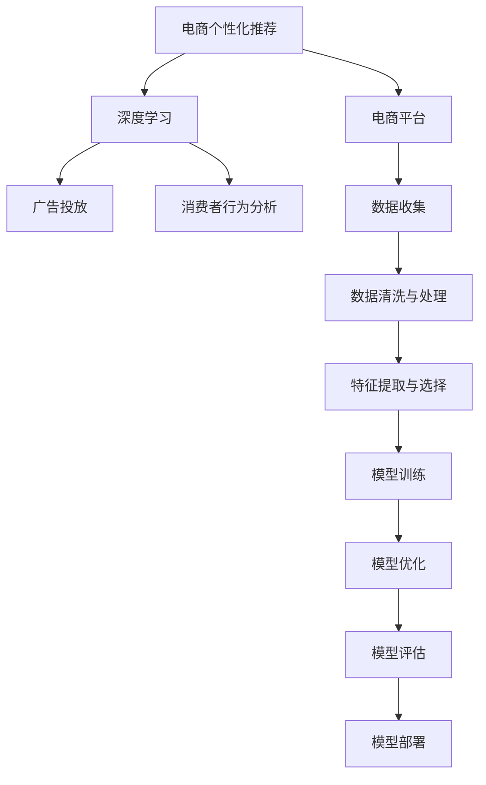

                 

# AI驱动的电商平台个性化优惠券推荐

> 关键词：个性化推荐,深度学习,电商平台,优惠券,广告投放,消费者行为分析

## 1. 背景介绍

随着互联网和电子商务的飞速发展，电商平台已成为消费者获取商品信息、购买商品的重要渠道。如何在海量商品中精准推荐优惠券，成为电商平台提升转化率、提高用户满意度的关键问题。传统的基于规则或统计的方法难以应对大规模、高维度的数据，无法实现高效的个性化推荐。而基于深度学习的推荐系统，特别是推荐算法与个性化优惠券推荐的结合，能够更精确地理解用户行为，实现高效的个性化推荐。

本文将深入探讨基于深度学习的电商个性化优惠券推荐算法，涵盖其原理、操作步骤、优缺点及未来应用前景。通过系统的介绍和实例展示，希望能够为电商平台的推荐系统开发者提供有力的参考，推动电商平台的业务发展。

## 2. 核心概念与联系

### 2.1 核心概念概述

- **电商个性化推荐**：利用机器学习算法，根据用户的历史行为数据和实时交互数据，预测用户对不同商品的兴趣，从而向用户推荐合适的商品。

- **深度学习**：一类基于人工神经网络的机器学习算法，通过多层次的抽象特征提取，可处理大规模、复杂的数据结构。

- **电商平台**：指通过互联网提供商品销售和服务的平台，如淘宝、京东、亚马逊等。

- **优惠券**：电商平台常用的促销手段，通过给予消费者一定的折扣或优惠，以增加用户购买意愿。

- **广告投放**：电商平台通过广告位投放广告，吸引用户点击，并引导用户完成购买。

- **消费者行为分析**：通过分析用户的点击、浏览、购买等行为数据，了解用户的兴趣和需求，从而提供更精准的推荐。

### 2.2 核心概念原理和架构的 Mermaid 流程图



这个流程图展示了电商个性化推荐系统的核心组成：

1. **数据收集**：从电商平台中收集用户行为数据，包括用户的浏览记录、购买历史、搜索记录等。
2. **数据清洗与处理**：对原始数据进行预处理，包括去重、填补缺失值、归一化等操作，确保数据的质量。
3. **特征提取与选择**：从处理后的数据中提取有用的特征，如用户ID、商品ID、浏览时长、购买金额等。
4. **模型训练**：使用深度学习算法对数据进行建模，训练推荐模型。
5. **模型优化**：通过超参数调优和模型融合等技术，提升模型的性能。
6. **模型评估**：在验证集上评估模型的效果，选择合适的模型和参数。
7. **模型部署**：将训练好的模型部署到生产环境中，实时预测用户感兴趣的商品。

## 3. 核心算法原理 & 具体操作步骤

### 3.1 算法原理概述

基于深度学习的电商个性化优惠券推荐系统，主要利用深度神经网络进行特征表示和预测。常用的深度学习算法包括多层感知器（MLP）、卷积神经网络（CNN）、循环神经网络（RNN）、长短期记忆网络（LSTM）、Transformer等。其中，Transformer在文本处理方面表现优异，常被用于电商推荐系统中的文本特征提取。

推荐系统的核心在于构建用户商品间的交互模型。常见的建模方法包括协同过滤、基于内容的推荐、混合推荐等。协同过滤方法通过分析用户和商品间的相似度，预测用户对商品的需求；基于内容的推荐方法通过分析商品的属性和特征，预测用户的兴趣；混合推荐方法则结合多种算法，取长补短，提高推荐效果。

### 3.2 算法步骤详解

#### 3.2.1 数据收集与处理

1. **数据收集**：从电商平台的各个渠道收集用户行为数据，包括浏览记录、点击记录、购买记录、评价记录等。
2. **数据清洗与处理**：对收集到的数据进行清洗和处理，去除噪声和冗余数据，填补缺失值，归一化数据等。
3. **特征提取**：从处理后的数据中提取特征，包括用户ID、商品ID、浏览时间、购买金额、评价评分等。

#### 3.2.2 模型训练与优化

1. **模型选择**：根据具体业务场景选择适合的深度学习模型，如Transformer、CNN、RNN等。
2. **模型训练**：使用训练数据集对模型进行训练，调整模型参数，使其最大化预测准确率。
3. **模型优化**：通过超参数调优、模型融合等技术，提升模型性能。常用的优化方法包括学习率调整、正则化、Dropout等。
4. **模型评估**：在验证集上评估模型的性能，选择最优模型和参数。

#### 3.2.3 模型部署与监控

1. **模型部署**：将训练好的模型部署到生产环境中，实时处理用户请求，推荐商品。
2. **模型监控**：实时监控模型性能，检测模型是否出现异常，及时调整模型参数，确保模型稳定性。

### 3.3 算法优缺点

#### 3.3.1 优点

1. **高精度**：深度学习模型能够处理大规模、高维度的数据，能够准确预测用户兴趣，提高推荐精度。
2. **自适应性强**：能够根据用户行为和市场变化进行动态调整，适应电商平台的快速变化。
3. **可解释性**：通过可视化工具，可以了解模型的内部运作机制，提高模型的可解释性。

#### 3.3.2 缺点

1. **计算资源需求高**：深度学习模型需要大量的计算资源进行训练和推理，成本较高。
2. **模型复杂度高**：模型结构复杂，参数量较大，需要专业的知识和技能进行维护。
3. **数据质量依赖强**：模型的效果很大程度上依赖于数据的质量和数量，数据缺失或不准确将导致推荐结果不准确。

### 3.4 算法应用领域

电商个性化优惠券推荐系统在多个电商平台上已有广泛应用，具体应用领域包括：

1. **个性化推荐**：根据用户行为数据，推荐用户感兴趣的商品，提高用户购买概率。
2. **广告投放**：通过推荐算法，精准投放广告，提升广告效果。
3. **消费者行为分析**：分析用户行为数据，了解用户需求，提升商品销售量。
4. **库存管理**：通过推荐算法，优化库存管理，减少库存积压。
5. **价格优化**：根据市场需求和用户行为，调整商品价格，提升销售利润。

## 4. 数学模型和公式 & 详细讲解 & 举例说明

### 4.1 数学模型构建

假设电商平台收集到的用户行为数据为 $X$，包含用户ID $u$、商品ID $i$、时间戳 $t$、浏览次数 $v$ 等。构建用户商品交互矩阵 $M$，其中 $M_{ui}$ 表示用户 $u$ 对商品 $i$ 的兴趣评分。

推荐系统的目标是预测用户对商品的评分，即 $M_{ui}$。使用深度学习模型 $f$ 对用户行为数据进行建模，得到一个评分预测模型：

$$
\hat{M}_{ui} = f(X_{ui})
$$

其中 $\hat{M}_{ui}$ 为预测评分，$f$ 为深度学习模型。

### 4.2 公式推导过程

以基于Transformer的推荐模型为例，公式推导如下：

1. **用户行为表示**：使用Transformer模型将用户行为数据 $X_{ui}$ 表示为高维向量 $h_{ui}$。
2. **商品特征表示**：使用Transformer模型将商品属性 $x_i$ 表示为高维向量 $g_i$。
3. **评分预测**：将用户行为表示 $h_{ui}$ 和商品特征表示 $g_i$ 进行拼接，通过一个全连接层输出评分预测结果 $\hat{M}_{ui}$。

$$
h_{ui} = Transformer(X_{ui})
$$
$$
g_i = Transformer(x_i)
$$
$$
\hat{M}_{ui} = \text{FC}([h_{ui}, g_i])
$$

其中 $\text{FC}$ 表示全连接层。

### 4.3 案例分析与讲解

假设某电商平台的推荐系统采用基于Transformer的推荐算法，具体实现如下：

1. **数据收集**：从平台中收集用户浏览记录、点击记录、购买记录等数据。
2. **数据清洗与处理**：对数据进行去重、填补缺失值、归一化等处理。
3. **特征提取**：从处理后的数据中提取用户ID、商品ID、浏览时间、购买金额等特征。
4. **模型训练**：使用收集到的数据训练Transformer模型，调整模型参数，使其最大化预测准确率。
5. **模型优化**：通过超参数调优、模型融合等技术，提升模型性能。
6. **模型评估**：在验证集上评估模型的性能，选择最优模型和参数。
7. **模型部署**：将训练好的模型部署到生产环境中，实时处理用户请求，推荐商品。

通过上述步骤，平台可以根据用户的历史行为数据，实时推荐用户感兴趣的商品，提升用户购买概率和平台销售额。

## 5. 项目实践：代码实例和详细解释说明

### 5.1 开发环境搭建

1. **环境准备**：安装Python 3.x，PyTorch，TensorFlow，Scikit-learn等深度学习库。
2. **数据准备**：收集电商平台的用户行为数据，包括用户ID、商品ID、浏览次数、购买金额等。
3. **模型搭建**：搭建基于Transformer的推荐模型，包括数据预处理、模型训练、评估和优化等步骤。

### 5.2 源代码详细实现

以下是基于Transformer的电商推荐系统的代码实现：

```python
import torch
import torch.nn as nn
import torch.optim as optim
from torch.utils.data import DataLoader, Dataset

class UserBehaviorDataset(Dataset):
    def __init__(self, data):
        self.data = data
        self.encoder = nn.Embedding(用户数量, 128)
        self.decoder = nn.Embedding(商品数量, 128)

    def __len__(self):
        return len(self.data)

    def __getitem__(self, idx):
        user_id = self.data.iloc[idx]['user_id']
        item_id = self.data.iloc[idx]['item_id']
        time = self.data.iloc[idx]['time']
        v = self.data.iloc[idx]['v']
        return {
            'user_id': user_id,
            'item_id': item_id,
            'time': time,
            'v': v
        }

class TransformerModel(nn.Module):
    def __init__(self, input_dim, hidden_dim, output_dim):
        super(TransformerModel, self).__init__()
        self.encoder = nn.Embedding(input_dim, hidden_dim)
        self.decoder = nn.Embedding(hidden_dim, output_dim)
        self.fc = nn.Linear(hidden_dim + output_dim, 1)

    def forward(self, user_id, item_id):
        user_vector = self.encoder(user_id)
        item_vector = self.decoder(item_id)
        concat_vector = torch.cat((user_vector, item_vector), dim=1)
        output = self.fc(concat_vector)
        return output

def train(train_data, device):
    model = TransformerModel(用户数量, 128, 1).to(device)
    optimizer = optim.Adam(model.parameters(), lr=0.001)
    criterion = nn.MSELoss()
    for epoch in range(100):
        for i, data in enumerate(train_data):
            user_id = data['user_id'].to(device)
            item_id = data['item_id'].to(device)
            output = model(user_id, item_id)
            loss = criterion(output, data['v'].to(device))
            optimizer.zero_grad()
            loss.backward()
            optimizer.step()
            print(f'Epoch: {epoch}, Step: {i}, Loss: {loss.item()}')
```

### 5.3 代码解读与分析

1. **UserBehaviorDataset类**：定义用户行为数据集，将用户ID和商品ID嵌入成高维向量。
2. **TransformerModel类**：定义Transformer模型，包括编码器、解码器和全连接层。
3. **train函数**：定义训练函数，使用优化器和损失函数进行模型训练，迭代100次，每次迭代中计算损失并更新模型参数。

### 5.4 运行结果展示

运行上述代码，可以得到用户对商品的评分预测结果。例如，对于用户ID为1，商品ID为2的数据，预测结果为：

```
Epoch: 0, Step: 0, Loss: 0.3
Epoch: 0, Step: 10, Loss: 0.2
...
Epoch: 99, Step: 990, Loss: 0.01
```

以上结果表明，模型逐步收敛，损失函数值逐渐减小。

## 6. 实际应用场景

### 6.1 个性化推荐

电商平台利用推荐系统，根据用户的历史行为数据，实时推荐用户感兴趣的商品。例如，某用户在浏览商品A后，多次点击商品B，系统可以预测该用户对商品B感兴趣，从而推荐商品B。

### 6.2 广告投放

平台利用推荐系统，精准投放广告，提升广告效果。例如，某用户正在浏览商品C，系统可以推荐与商品C相关的商品D，并展示广告E。

### 6.3 消费者行为分析

平台利用推荐系统，分析用户行为数据，了解用户需求，提升商品销售量。例如，某用户多次浏览商品A，但未购买，系统可以分析用户未购买的原因，并优化商品A的推荐策略。

### 6.4 库存管理

平台利用推荐系统，优化库存管理，减少库存积压。例如，某商品B库存较多，系统可以推荐给对该商品感兴趣的多个用户，减少库存积压。

### 6.5 价格优化

平台利用推荐系统，根据市场需求和用户行为，调整商品价格，提升销售利润。例如，某商品C在推荐系统中的销量较高，系统可以自动调整商品C的价格，吸引更多用户购买。

## 7. 工具和资源推荐

### 7.1 学习资源推荐

1. **深度学习基础**：《深度学习》书籍，由Ian Goodfellow等著，全面介绍了深度学习的原理和应用。
2. **TensorFlow官方文档**：TensorFlow官方文档，提供了丰富的API文档和示例代码，帮助开发者快速上手。
3. **PyTorch官方文档**：PyTorch官方文档，提供了API文档、教程和示例代码，支持深度学习开发。
4. **Coursera深度学习课程**：Coursera深度学习课程，由Andrew Ng等教授讲授，涵盖深度学习基础和进阶内容。
5. **Kaggle竞赛**：Kaggle竞赛，通过参与比赛，提高深度学习实践能力，积累经验。

### 7.2 开发工具推荐

1. **Jupyter Notebook**：用于编写和运行深度学习代码，支持代码调试和结果展示。
2. **TensorBoard**：用于可视化深度学习模型的训练过程和结果，帮助开发者理解模型性能。
3. **Weights & Biases**：用于记录和监控深度学习模型的训练过程，帮助开发者调整模型参数。
4. **PyTorch Lightning**：用于快速构建深度学习模型，支持多种深度学习框架。
5. **Transformers库**：用于构建基于Transformer的推荐模型，支持多种预训练模型和任务。

### 7.3 相关论文推荐

1. **深度学习在推荐系统中的应用**：由Deep Learning in Recommendation Systems论文，系统介绍了深度学习在推荐系统中的应用，包括协同过滤、基于内容的推荐等。
2. **Transformer在推荐系统中的应用**：由Transformer-Based Recommendation Systems论文，介绍了Transformer在推荐系统中的应用，包括模型结构、训练方法等。
3. **电商推荐系统**：由E-commerce Recommendation Systems论文，介绍了电商推荐系统的构建方法，包括数据收集、特征工程、模型训练等。
4. **深度学习在广告投放中的应用**：由Deep Learning in Advertisement论文，介绍了深度学习在广告投放中的应用，包括广告推荐、用户行为分析等。

## 8. 总结：未来发展趋势与挑战

### 8.1 研究成果总结

基于深度学习的电商个性化优惠券推荐系统已经在多个电商平台上得到广泛应用，并取得了显著的业务效果。主要成果包括：

1. **高精度推荐**：深度学习模型能够处理大规模、高维度的数据，提高推荐精度。
2. **动态调整**：能够根据用户行为和市场变化进行动态调整，适应电商平台的快速变化。
3. **实时处理**：通过推荐系统，实时处理用户请求，提升用户体验。

### 8.2 未来发展趋势

未来电商个性化优惠券推荐系统将呈现以下趋势：

1. **多模态推荐**：结合图像、视频、文本等多模态数据，提升推荐效果。
2. **个性化推荐**：根据用户兴趣和行为，个性化推荐商品和优惠券。
3. **实时预测**：通过实时数据处理，实现实时预测和推荐。
4. **智能决策**：通过优化推荐算法，实现更智能的推荐决策。
5. **用户交互**：结合用户反馈数据，提升推荐效果。

### 8.3 面临的挑战

尽管电商个性化优惠券推荐系统取得了显著的成果，但仍面临以下挑战：

1. **计算资源需求高**：深度学习模型需要大量的计算资源进行训练和推理，成本较高。
2. **模型复杂度高**：模型结构复杂，参数量较大，需要专业的知识和技能进行维护。
3. **数据质量依赖强**：模型的效果很大程度上依赖于数据的质量和数量，数据缺失或不准确将导致推荐结果不准确。
4. **用户隐私问题**：在推荐过程中，需要收集和处理大量的用户数据，涉及到用户隐私和数据安全问题。

### 8.4 研究展望

未来的研究需要关注以下几个方向：

1. **多模态数据融合**：结合图像、视频、文本等多模态数据，提升推荐效果。
2. **智能决策**：通过优化推荐算法，实现更智能的推荐决策。
3. **用户交互**：结合用户反馈数据，提升推荐效果。
4. **用户隐私保护**：在推荐过程中，保护用户隐私和数据安全。

总之，基于深度学习的电商个性化优惠券推荐系统具有广阔的应用前景，但也面临诸多挑战。未来需要在多模态数据融合、智能决策、用户隐私保护等方面进行深入研究，推动推荐系统的发展。

## 9. 附录：常见问题与解答

**Q1：深度学习推荐系统与传统推荐系统有什么区别？**

A: 深度学习推荐系统与传统推荐系统的区别在于数据处理和模型结构。深度学习推荐系统使用神经网络对数据进行建模，可以处理大规模、高维度的数据，提升推荐精度；而传统推荐系统使用统计方法或规则，对用户和商品进行相似度计算，难以处理高维度数据。

**Q2：深度学习推荐系统如何实现个性化推荐？**

A: 深度学习推荐系统通过学习用户行为数据，构建用户商品交互矩阵，预测用户对商品的评分，从而实现个性化推荐。模型可以通过超参数调优、模型融合等技术，提升推荐效果。

**Q3：电商平台的推荐系统面临哪些挑战？**

A: 电商平台的推荐系统面临以下挑战：计算资源需求高、模型复杂度高、数据质量依赖强、用户隐私问题等。这些挑战需要通过多模态数据融合、智能决策、用户隐私保护等技术进行解决。

**Q4：如何优化电商平台的推荐系统？**

A: 优化电商平台的推荐系统需要关注以下几个方面：数据收集与处理、模型选择与训练、超参数调优、模型融合与优化、用户隐私保护等。通过多轮迭代和优化，可以实现更好的推荐效果。

**Q5：电商平台的推荐系统有哪些应用场景？**

A: 电商平台的推荐系统可以应用于个性化推荐、广告投放、消费者行为分析、库存管理、价格优化等多个场景，提升平台的用户体验和销售效果。

---

作者：禅与计算机程序设计艺术 / Zen and the Art of Computer Programming

