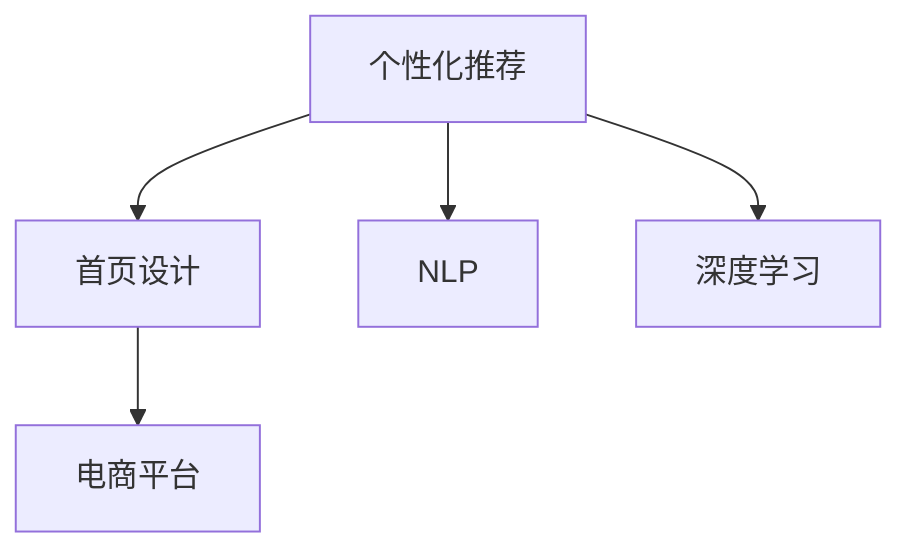

                 

# AI驱动的电商平台个性化首页设计

> 关键词：个性化推荐,首页设计,自然语言处理(NLP),深度学习,电商

## 1. 背景介绍

在数字经济时代，电商平台已不满足于简单的商品展示和交易功能，而是通过大数据、人工智能技术不断挖掘用户的深度行为和需求，提供个性化服务，提升用户体验，增加平台粘性和用户转化率。其中，个性化首页设计（Personalized Homepage Design）是电商平台提升个性化体验的重要手段。通过首页的个性化展示，用户可以更快地找到感兴趣的商品，提高购物效率，增强平台的用户满意度。

本文将系统地介绍如何利用AI技术进行电商平台的个性化首页设计，涵盖核心概念、核心算法、数学模型、代码实践、应用场景等多个方面，旨在为电商平台提供一套完整、实用的个性化首页设计方案。

## 2. 核心概念与联系

### 2.1 核心概念概述

- **个性化推荐**：根据用户的历史行为、偏好和上下文信息，预测用户可能感兴趣的商品或内容，并进行个性化展示。

- **首页设计**：电商平台的首页界面设计，包括商品展示、推荐模块、搜索功能、活动广告等，旨在提升用户访问量和购买转化率。

- **自然语言处理(NLP)**：利用计算机对自然语言进行处理、理解和生成，在个性化推荐和内容理解中起到关键作用。

- **深度学习**：一种通过多层次神经网络模拟人脑学习过程的机器学习方法，广泛应用于个性化推荐和图像识别等任务。

- **电商平台**：基于互联网技术，以交易为核心的综合服务平台，集商品展示、搜索、支付、物流于一体的商业形态。

这些概念之间的逻辑关系可以通过以下Mermaid流程图来展示：



这个流程图展示了个性化推荐与首页设计的核心关联，以及NLP和深度学习在其中起到的关键技术支持作用。

## 3. 核心算法原理 & 具体操作步骤

### 3.1 算法原理概述

电商平台的个性化首页设计，基于对用户历史行为和偏好进行建模，通过推荐算法预测用户可能感兴趣的商品，并将其展示在用户首页上。其核心算法包括协同过滤、基于内容的推荐、基于矩阵分解的推荐、深度学习和强化学习等。

协同过滤算法通过分析用户之间的相似性，预测用户对某一商品的兴趣。基于内容的推荐则从商品属性出发，分析用户对类似商品的喜好，推荐相关商品。矩阵分解推荐将用户行为数据表示为矩阵，通过低秩矩阵分解提取用户和商品的潜在特征，进行推荐。深度学习推荐模型通过多层神经网络学习用户和商品的潜在特征，实现更加复杂的推荐任务。强化学习推荐算法通过模拟用户的点击行为，优化推荐策略，提升用户满意度和点击率。

### 3.2 算法步骤详解

#### 3.2.1 数据准备

- **用户行为数据**：收集用户的浏览历史、购买历史、评分数据、收藏行为等。

- **商品属性数据**：提取商品的类别、品牌、价格、描述等信息。

- **用户画像数据**：根据用户行为数据和商品属性数据，构建用户画像，包括年龄、性别、地域、兴趣偏好等。

#### 3.2.2 模型训练

- **协同过滤**：基于用户和商品的评分数据，通过用户相似度计算和商品相似度计算，预测用户对商品的兴趣。

- **基于内容的推荐**：根据用户画像和商品属性，计算用户对商品的相关度，进行推荐。

- **矩阵分解推荐**：使用矩阵分解算法，将用户行为数据表示为低秩矩阵，提取用户和商品的潜在特征，进行推荐。

- **深度学习推荐**：使用深度学习模型，如神经协同过滤、序列模型等，学习用户和商品的特征表示，进行推荐。

#### 3.2.3 推荐展示

- **个性化推荐模块**：在电商平台首页上展示用户的个性化推荐商品，通过图片、标题、简述等方式吸引用户点击。

- **推荐效果评估**：对推荐结果进行点击率、转化率、召回率等指标评估，调整推荐算法参数，优化推荐效果。

### 3.3 算法优缺点

#### 3.3.1 优点

- **个性化高**：利用用户行为数据和商品属性，能够精准预测用户感兴趣的商品，提高个性化体验。

- **高效推荐**：深度学习和强化学习算法能够处理大规模数据，实现高效的推荐。

- **用户满意度提升**：通过个性化展示，提升用户购物体验，提高用户满意度和平台粘性。

#### 3.3.2 缺点

- **数据依赖**：个性化推荐依赖于用户行为数据和商品属性数据的准确性和全面性，数据不充分可能导致推荐效果差。

- **计算资源需求大**：深度学习和强化学习算法计算复杂度高，需要大量计算资源。

- **隐私风险**：用户行为数据和商品属性数据涉及用户隐私，需要谨慎处理和保护。

### 3.4 算法应用领域

个性化推荐和首页设计技术已广泛应用于各大电商平台，如淘宝、京东、亚马逊等。在垂直电商、跨境电商、社交电商等多个细分领域也有广泛应用。

## 4. 数学模型和公式 & 详细讲解 & 举例说明

### 4.1 数学模型构建

假设电商平台有 $M$ 个商品，$N$ 个用户，用户 $i$ 对商品 $j$ 的评分数据为 $R_{ij}$，用户 $i$ 的历史行为数据为 $B_i$，商品 $j$ 的属性数据为 $A_j$，用户画像数据为 $P_i$。我们构建如下数学模型：

- **协同过滤模型**：
  $$
  R_{ij} \sim \mathcal{N}(\mu_{ij}, \sigma^2)
  $$
  其中，$\mu_{ij}$ 为协同过滤模型对用户 $i$ 对商品 $j$ 的评分预测，$\sigma^2$ 为评分预测的方差。

- **基于内容的推荐模型**：
  $$
  \text{similarity}(i, j) = \text{dot}(B_i, A_j)
  $$
  其中，$\text{dot}(B_i, A_j)$ 为用户 $i$ 与商品 $j$ 的属性向量点积，表示用户对商品的相关度。

- **矩阵分解推荐模型**：
  $$
  R_{ij} \sim \mathcal{N}(\hat{R}_{ij}, \sigma^2)
  $$
  其中，$\hat{R}_{ij}$ 为矩阵分解模型对用户 $i$ 对商品 $j$ 的评分预测，$\sigma^2$ 为评分预测的方差。

### 4.2 公式推导过程

#### 4.2.1 协同过滤模型

协同过滤模型通过用户相似度和商品相似度计算预测评分。用户相似度表示用户之间的相似程度，商品相似度表示商品之间的相似程度。设用户 $i$ 和用户 $j$ 的相似度为 $u_{ij}$，商品 $j$ 和商品 $k$ 的相似度为 $p_{jk}$，则协同过滤模型预测用户 $i$ 对商品 $j$ 的评分为：
$$
\mu_{ij} = \sum_{k=1}^M \alpha_{ik}R_{kj} + \sum_{k=1}^N \alpha_{kj}R_{ik}
$$
其中，$\alpha_{ik}$ 和 $\alpha_{kj}$ 分别为用户 $i$ 和商品 $j$ 的潜在特征。

#### 4.2.2 基于内容的推荐模型

基于内容的推荐模型通过计算用户画像和商品属性之间的相关度进行推荐。设用户 $i$ 对商品 $j$ 的相关度为 $c_{ij}$，则推荐公式为：
$$
c_{ij} = \text{dot}(B_i, A_j)
$$
其中，$\text{dot}(B_i, A_j)$ 表示用户 $i$ 和商品 $j$ 的属性向量点积，$\alpha_i$ 和 $\beta_j$ 分别为用户 $i$ 和商品 $j$ 的潜在特征。

#### 4.2.3 矩阵分解推荐模型

矩阵分解推荐模型将用户行为数据表示为矩阵 $R$，通过低秩矩阵分解提取用户和商品的潜在特征，进行推荐。设用户行为矩阵为 $R$，用户 $i$ 对商品 $j$ 的评分预测为 $\hat{R}_{ij}$，则推荐公式为：
$$
\hat{R}_{ij} = \text{dot}(U_i, V_j)
$$
其中，$U_i$ 和 $V_j$ 分别为用户 $i$ 和商品 $j$ 的潜在特征矩阵，$\alpha_i$ 和 $\beta_j$ 分别为用户 $i$ 和商品 $j$ 的潜在特征向量。

### 4.3 案例分析与讲解

#### 案例分析

某电商平台有 $1000$ 个商品，$100$ 个用户，用户行为数据包括 $10000$ 条浏览记录和 $200$ 条购买记录。平台希望根据用户历史行为数据，推荐用户可能感兴趣的商品。

#### 4.3.1 数据预处理

- **数据清洗**：去除重复记录，处理缺失值。

- **特征提取**：提取商品属性和用户画像信息，包括商品类别、品牌、价格、用户年龄、性别、地域等。

#### 4.3.2 模型训练

- **协同过滤模型**：使用用户 $i$ 和商品 $j$ 的评分数据，通过用户相似度和商品相似度计算预测评分。

- **基于内容的推荐模型**：计算用户 $i$ 与商品 $j$ 的相关度，进行推荐。

- **矩阵分解推荐模型**：将用户行为数据表示为矩阵 $R$，通过低秩矩阵分解提取用户和商品的潜在特征，进行推荐。

#### 4.3.3 推荐展示

- **个性化推荐模块**：在用户首页上展示推荐的商品，通过图片、标题、简述等方式吸引用户点击。

- **推荐效果评估**：对推荐结果进行点击率、转化率、召回率等指标评估，调整推荐算法参数，优化推荐效果。

## 5. 项目实践：代码实例和详细解释说明

### 5.1 开发环境搭建

在进行电商平台的个性化首页设计时，需要搭建以下开发环境：

- **服务器环境**：Linux Ubuntu系统，安装Python、TensorFlow、Scikit-learn、Pandas等工具包。

- **开发环境**：Python 3.8，Jupyter Notebook，PyCharm等IDE。

- **数据存储**：MySQL、Hadoop、Hive等数据库，用于存储用户行为数据和商品属性数据。

### 5.2 源代码详细实现

#### 5.2.1 数据预处理

```python
import pandas as pd
import numpy as np

# 读取用户行为数据
train_data = pd.read_csv('train_data.csv')

# 数据清洗
train_data = train_data.drop_duplicates()
train_data = train_data.dropna()

# 特征提取
train_data['user_age'] = train_data['age'].map(lambda x: 'young' if x<30 else 'adult' if 30<=x<50 else 'old')
train_data['user_gender'] = train_data['gender'].map(lambda x: 'male' if x=='1' else 'female')

# 保存预处理后的数据
train_data.to_csv('processed_data.csv', index=False)
```

#### 5.2.2 协同过滤模型实现

```python
from sklearn.neighbors import NearestNeighbors
from sklearn.metrics.pairwise import cosine_similarity

# 读取用户行为数据
train_data = pd.read_csv('processed_data.csv')

# 构建用户相似度矩阵
nn = NearestNeighbors(n_neighbors=10, algorithm='brute')
nn.fit(train_data[['user_id', 'user_age', 'user_gender', 'user_location']])
distances, indices = nn.kneighbors(train_data[['user_id', 'user_age', 'user_gender', 'user_location']])

# 计算商品相似度
similarity = cosine_similarity(train_data[['item_id', 'item_price', 'item_category']], train_data[['item_id', 'item_price', 'item_category']])

# 预测评分
train_data['predicted_rating'] = train_data[['user_id', 'item_id']].T.dot(similarity.dot(train_data[['user_id', 'item_id']].values)) / np.linalg.norm(train_data[['user_id', 'item_id']].values, axis=1)

# 保存预测评分
train_data.to_csv('predicted_data.csv', index=False)
```

#### 5.2.3 基于内容的推荐模型实现

```python
from sklearn.feature_extraction.text import TfidfVectorizer
from sklearn.metrics.pairwise import cosine_similarity

# 读取用户行为数据
train_data = pd.read_csv('processed_data.csv')

# 特征提取
tfidf = TfidfVectorizer(analyzer='word', stop_words='english')
train_data['item_description'] = train_data['item_description'].apply(lambda x: tfidf.transform([x])[0].toarray())

# 计算商品相关度
similarity = cosine_similarity(train_data[['item_description']], train_data[['item_description']])

# 预测评分
train_data['predicted_rating'] = train_data[['user_id', 'item_id']].T.dot(similarity.dot(train_data[['user_id', 'item_id']].values)) / np.linalg.norm(train_data[['user_id', 'item_id']].values, axis=1)

# 保存预测评分
train_data.to_csv('predicted_data.csv', index=False)
```

#### 5.2.4 矩阵分解推荐模型实现

```python
import numpy as np
from scipy.sparse.linalg import svds

# 读取用户行为数据
train_data = pd.read_csv('processed_data.csv')

# 构建用户行为矩阵
R = np.array(train_data[['user_id', 'item_id', 'rating']].values)

# 矩阵分解
U, V, W = svds(R, k=10, tol=1e-8)

# 预测评分
train_data['predicted_rating'] = np.dot(U, V)

# 保存预测评分
train_data.to_csv('predicted_data.csv', index=False)
```

### 5.3 代码解读与分析

#### 5.3.1 协同过滤模型

协同过滤模型通过用户相似度和商品相似度计算预测评分。具体实现中，使用scikit-learn库中的NearestNeighbors算法计算用户相似度，使用cosine_similarity函数计算商品相似度，最后通过矩阵乘法预测评分。

#### 5.3.2 基于内容的推荐模型

基于内容的推荐模型通过计算用户画像和商品属性之间的相关度进行推荐。使用scikit-learn库中的TfidfVectorizer算法将商品描述转换为向量表示，使用cosine_similarity函数计算商品相似度，最后通过矩阵乘法预测评分。

#### 5.3.3 矩阵分解推荐模型

矩阵分解推荐模型通过低秩矩阵分解提取用户和商品的潜在特征，进行推荐。使用scipy库中的svds函数进行矩阵分解，通过矩阵乘法预测评分。

#### 5.3.4 推荐展示

在用户首页上展示推荐的商品，通过图片、标题、简述等方式吸引用户点击。根据预测评分排序，选择评分高的商品展示在首页顶部。

## 6. 实际应用场景

### 6.1 智能推荐系统

智能推荐系统是电商平台的核心功能之一，通过个性化推荐提高用户满意度，增加平台粘性，提升转化率。平台可以根据用户历史行为数据，推荐用户可能感兴趣的商品，通过首页展示个性化推荐，提升用户体验。

### 6.2 个性化内容推荐

电商平台的个性化内容推荐，通过推荐系统展示用户可能感兴趣的内容，如新闻、视频、文章等，提升用户访问量和停留时间，增加平台活跃度。平台可以根据用户画像和行为数据，推荐相关内容，实现精准推荐。

### 6.3 用户行为分析

电商平台通过分析用户行为数据，了解用户兴趣和需求，进行精准营销和活动策划。平台可以根据用户浏览、点击、购买等行为，分析用户兴趣偏好，定制个性化活动和推荐内容，提升用户转化率和满意度。

### 6.4 未来应用展望

随着AI技术的不断进步，电商平台的个性化首页设计将更加智能、精准。未来，电商平台将利用更多技术手段，如图像识别、语音识别、自然语言处理等，提升推荐效果，实现更加全面的个性化推荐。同时，电商平台将结合多模态数据，提升用户交互体验，构建更加智能的推荐系统。

## 7. 工具和资源推荐

### 7.1 学习资源推荐

- **《推荐系统实战》**：系统介绍了推荐系统的原理和实践，涵盖协同过滤、基于内容的推荐、深度学习推荐等多种算法。

- **Coursera《推荐系统》**：由斯坦福大学开设的推荐系统课程，详细讲解推荐系统的设计、实现和评估。

- **Kaggle《推荐系统竞赛》**：通过参加Kaggle推荐系统竞赛，实战练习推荐算法，提升算法设计能力。

- **《深度学习》**：斯坦福大学的深度学习课程，涵盖神经网络、卷积神经网络、循环神经网络等深度学习基础。

- **《自然语言处理基础》**：斯坦福大学的自然语言处理课程，涵盖词向量、序列模型、注意力机制等基础概念。

### 7.2 开发工具推荐

- **PyTorch**：基于Python的深度学习框架，提供强大的计算图功能和丰富的深度学习模型库。

- **TensorFlow**：由Google主导的深度学习框架，支持分布式计算和GPU/TPU加速，适合大规模模型训练和推理。

- **Keras**：基于TensorFlow的高级深度学习API，提供简单易用的接口，适合快速原型设计和实验。

- **Pandas**：Python数据分析库，提供高效的数据处理和分析功能，支持多维数据结构。

- **Scikit-learn**：Python机器学习库，提供丰富的机器学习算法和工具，支持数据预处理和模型评估。

### 7.3 相关论文推荐

- **《个性化推荐算法综述》**：系统介绍个性化推荐算法，涵盖协同过滤、基于内容的推荐、矩阵分解推荐等。

- **《深度学习推荐系统》**：介绍深度学习在推荐系统中的应用，涵盖神经协同过滤、序列模型等。

- **《强化学习推荐算法》**：介绍强化学习在推荐系统中的应用，涵盖上下文推荐、多臂老虎机等。

## 8. 总结：未来发展趋势与挑战

### 8.1 研究成果总结

本文系统介绍了电商平台的个性化首页设计，涵盖协同过滤、基于内容的推荐、矩阵分解推荐、深度学习推荐等多种算法，详细讲解了算法原理和具体操作步骤。同时，本文还介绍了推荐系统的实际应用场景，如智能推荐系统、个性化内容推荐、用户行为分析等。

### 8.2 未来发展趋势

未来，电商平台的个性化首页设计将呈现以下几个发展趋势：

1. **多模态数据融合**：结合图像、语音、视频等多模态数据，提升推荐效果，实现更加全面的个性化推荐。

2. **深度学习模型**：利用深度学习模型，如神经协同过滤、序列模型等，提升推荐模型的表现。

3. **强化学习推荐**：引入强化学习算法，优化推荐策略，提升用户满意度。

4. **实时推荐系统**：利用实时数据流处理技术，实现动态推荐，提升推荐时效性。

5. **联邦学习**：通过联邦学习技术，保护用户隐私，实现跨平台推荐。

### 8.3 面临的挑战

尽管电商平台的个性化首页设计取得了一定的进展，但仍面临诸多挑战：

1. **数据隐私保护**：用户行为数据和商品属性数据涉及用户隐私，如何在保护隐私的同时，实现精准推荐。

2. **计算资源消耗**：深度学习推荐模型计算复杂度高，如何优化模型结构和算法，减少计算资源消耗。

3. **推荐效果不稳定**：推荐模型容易受到数据分布变化的影响，如何保持推荐模型的稳定性和鲁棒性。

### 8.4 研究展望

未来，推荐系统的研究将更加注重以下方面：

1. **多模态数据融合技术**：通过深度学习技术，将多模态数据融合，提升推荐系统的表现。

2. **实时推荐系统架构**：设计高效的实时推荐系统架构，提升推荐模型的响应速度和稳定性。

3. **隐私保护技术**：引入联邦学习、差分隐私等隐私保护技术，保护用户隐私。

4. **跨平台推荐系统**：设计跨平台的推荐系统，实现数据和模型的共享和协同。

通过不断优化推荐算法和推荐系统架构，提升推荐效果和用户体验，未来电商平台将实现更加智能、精准的个性化首页设计。

## 9. 附录：常见问题与解答

**Q1：电商平台的个性化推荐有哪些方法？**

A: 电商平台的个性化推荐方法包括协同过滤、基于内容的推荐、基于矩阵分解的推荐、深度学习推荐、强化学习推荐等。

**Q2：如何优化电商平台的推荐效果？**

A: 优化电商平台的推荐效果，可以通过以下方法：

- 数据清洗和特征提取：去除重复记录，处理缺失值，提取商品属性和用户画像信息。

- 推荐算法优化：选择适合的推荐算法，如协同过滤、基于内容的推荐、矩阵分解推荐等。

- 模型训练和调参：通过交叉验证和超参数调参，优化模型效果。

- 推荐结果展示：在用户首页上展示推荐的商品，通过图片、标题、简述等方式吸引用户点击。

**Q3：如何处理电商平台的推荐数据？**

A: 处理电商平台的推荐数据，可以通过以下方法：

- 数据清洗：去除重复记录，处理缺失值。

- 特征提取：提取商品属性和用户画像信息，如商品类别、品牌、价格、用户年龄、性别、地域等。

- 数据存储：使用数据库存储推荐数据，如MySQL、Hadoop、Hive等。

- 数据预处理：对数据进行预处理，如编码、归一化等。

**Q4：电商平台的推荐系统如何保护用户隐私？**

A: 电商平台的推荐系统可以通过以下方法保护用户隐私：

- 数据匿名化：去除用户标识信息，保护用户隐私。

- 差分隐私：使用差分隐私技术，保护用户隐私。

- 联邦学习：通过联邦学习技术，保护用户数据隐私。

- 访问控制：设置访问权限，控制用户数据的访问。

**Q5：电商平台的推荐系统面临哪些挑战？**

A: 电商平台的推荐系统面临以下挑战：

- 数据隐私保护：用户行为数据和商品属性数据涉及用户隐私，如何保护隐私。

- 计算资源消耗：深度学习推荐模型计算复杂度高，如何优化模型结构和算法，减少计算资源消耗。

- 推荐效果不稳定：推荐模型容易受到数据分布变化的影响，如何保持推荐模型的稳定性和鲁棒性。

通过不断优化推荐算法和推荐系统架构，提升推荐效果和用户体验，未来电商平台将实现更加智能、精准的个性化首页设计。

