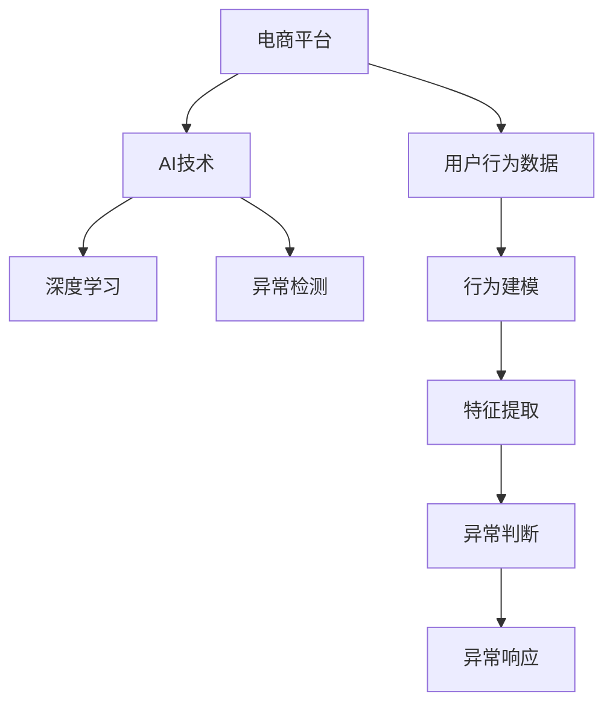

                 

## 1. 背景介绍

### 1.1 问题由来

电商平台作为电商行业的重要基础设施，其运营效率和服务质量直接影响了用户的购物体验和商家的业务收益。异常检测技术作为电商平台数据分析的重要手段，可以在短时间内发现异常用户行为，并采取相应的处理措施，从而保障平台稳定运行和用户利益。近年来，随着人工智能技术的快速发展，基于AI的电商平台用户行为异常检测方法成为学术界和工业界的研究热点。

### 1.2 问题核心关键点

AI驱动的电商平台用户行为异常检测，通过构建用户行为模型，实时监测用户的购买行为、访问路径、评价内容等数据，快速识别异常用户，如欺诈用户、恶意攻击用户等。传统的检测方法依赖于规则或人工设定的阈值，难以全面、高效地处理复杂多变的用户行为数据。AI技术的应用，特别是机器学习、深度学习等方法，提供了更灵活、准确的检测方案。

AI技术的应用，特别是机器学习、深度学习等方法，提供了更灵活、准确的检测方案。但是，这些方法的复杂性和高昂的计算资源需求，也给电商平台的实际应用带来了挑战。因此，如何在大规模电商交易数据中高效地应用AI技术，同时兼顾模型性能和实时性，成为了当前研究的重要方向。

### 1.3 问题研究意义

AI驱动的电商平台用户行为异常检测具有重要的研究意义：

1. **提高用户满意度**：及时发现并处理异常用户行为，如欺诈、恶意攻击等，保障用户的交易安全和购物体验。
2. **减少商家损失**：预防和处理异常交易，避免因欺诈、恶意行为带来的经济损失。
3. **提升运营效率**：实时监测用户行为，快速响应异常事件，保障平台稳定运行。
4. **推动技术发展**：推动人工智能技术在电商领域的应用，提升NLP、机器学习等技术的实际应用能力。
5. **促进业务创新**：结合异常检测结果，分析用户行为特征，指导产品推荐、价格优化等业务策略，提升电商平台的整体竞争力。

## 2. 核心概念与联系

### 2.1 核心概念概述

为更好地理解AI驱动的电商平台用户行为异常检测方法，本节将介绍几个关键概念：

- **电商平台**：提供商品展示、交易、支付、物流等服务的在线平台。
- **用户行为异常检测**：通过分析用户行为数据，识别异常行为并采取相应措施的过程。
- **AI技术**：以机器学习、深度学习等算法为基础，实现自动化、智能化检测的AI技术。
- **深度学习**：一种通过多层神经网络模型，学习复杂数据模式的机器学习方法。
- **异常检测**：通过构建模型或设定阈值，识别数据中的异常值或模式。

这些核心概念之间的逻辑关系可以通过以下Mermaid流程图来展示：



这个流程图展示了大规模电商平台用户行为异常检测的核心概念及其之间的关系：

1. 电商平台的交易数据作为输入，被用于行为建模。
2. 行为建模通过特征提取和模型训练，构建用户行为预测模型。
3. 异常检测在模型基础上进行，识别出异常用户行为。
4. 异常行为被进一步分析和处理，最终采取相应措施。

## 3. 核心算法原理 & 具体操作步骤

### 3.1 算法原理概述

AI驱动的电商平台用户行为异常检测，本质上是一种基于深度学习的异常检测方法。其核心思想是：构建用户行为预测模型，通过预测用户行为与实际行为之间的差异，识别异常行为。

形式化地，设电商平台用户行为数据集为 $D=\{(x_i, y_i)\}_{i=1}^N$，其中 $x_i$ 为第 $i$ 个用户的历史行为数据，$y_i$ 为第 $i$ 个用户的实际行为标签。异常检测的目标是找到用户行为预测模型 $M_{\theta}$，使得预测行为 $M_{\theta}(x)$ 与实际行为 $y$ 之间的差异最小化。

具体而言，常用的异常检测方法包括基于密度的检测方法（如DBSCAN）、基于统计的检测方法（如孤立森林）、基于深度学习的检测方法（如Autoencoder）等。其中，基于深度学习的异常检测方法由于其灵活性、准确性等优势，成为研究热点。

### 3.2 算法步骤详解

基于深度学习的电商平台用户行为异常检测方法，通常包括以下关键步骤：

**Step 1: 数据预处理**
- 收集电商平台的交易数据，包括用户行为、交易金额、商品信息等。
- 清洗、整理数据，处理缺失值、异常值，保证数据的质量和完整性。

**Step 2: 特征提取**
- 设计特征提取算法，从原始数据中提取有用的特征，如用户购买频率、商品浏览时间、评价内容情感等。
- 将提取的特征进行标准化处理，如归一化、离散化等，提高特征的适用性。

**Step 3: 模型训练**
- 选择合适的深度学习模型，如Autoencoder、RNN等，作为用户行为预测模型。
- 构建训练数据集，使用随机梯度下降等优化算法训练模型，调整模型参数，最小化预测误差。

**Step 4: 异常判断**
- 使用训练好的模型，对用户行为进行预测，计算预测值与实际值之间的差异。
- 设定异常阈值，如z-score、IQR等，判断预测值与实际值之间的差异是否超出阈值范围。

**Step 5: 异常响应**
- 对于识别出的异常用户，进行进一步分析，如查看用户历史行为、交易记录等，识别异常行为的类型。
- 根据异常行为的严重程度，采取相应的措施，如冻结账户、限制交易等。

### 3.3 算法优缺点

基于深度学习的电商平台用户行为异常检测方法具有以下优点：

1. **灵活性**：深度学习模型可以根据不同特征，自适应地学习数据模式，具有较高的泛化能力。
2. **准确性**：深度学习模型在处理复杂、高维数据时，能够自动学习出数据的内在关系，具有较高的准确性。
3. **实时性**：深度学习模型可以通过增量学习等技术，实现实时预测和异常检测，满足电商平台的实时性需求。

但该方法也存在一定的局限性：

1. **计算资源需求高**：深度学习模型需要大量的计算资源进行训练和推理，可能对电商平台带来较高的硬件成本。
2. **模型解释性不足**：深度学习模型通常是一个黑盒模型，难以解释其内部决策过程，不利于异常行为的分析和处理。
3. **过拟合风险**：深度学习模型容易过拟合，尤其是训练数据较少的情况下，需要谨慎选择模型和训练策略。

### 3.4 算法应用领域

基于深度学习的电商平台用户行为异常检测方法，在以下领域得到广泛应用：

- **交易欺诈检测**：识别虚假交易、恶意支付等欺诈行为。
- **恶意攻击检测**：识别恶意攻击用户的行为，如DDoS攻击、SQL注入等。
- **用户行为分析**：通过异常检测，分析用户行为特征，指导商品推荐、价格优化等策略。
- **物流异常监控**：监测物流运输过程中的异常行为，如商品丢失、延迟等。
- **市场趋势预测**：通过异常检测，识别市场中的异常行为，预测价格波动、销量变化等趋势。

## 4. 数学模型和公式 & 详细讲解 & 举例说明

### 4.1 数学模型构建

本节将使用数学语言对电商平台用户行为异常检测方法进行更加严格的刻画。

设电商平台用户行为数据集为 $D=\{(x_i, y_i)\}_{i=1}^N$，其中 $x_i \in \mathbb{R}^d$ 为第 $i$ 个用户的行为特征，$y_i \in \{0,1\}$ 为第 $i$ 个用户的行为标签。异常检测的目标是找到异常阈值 $\eta$，使得模型预测值 $M_{\theta}(x)$ 与实际标签 $y$ 之间的差异最小化。

假设使用Autoencoder作为用户行为预测模型，其结构为 $M_{\theta}=\{h_{\theta_1}, h_{\theta_2}, y_{\theta_3}\}$，其中 $h_{\theta_1}$ 为编码器，$h_{\theta_2}$ 为解码器，$y_{\theta_3}$ 为输出层。

定义损失函数为交叉熵损失函数：

$$
\mathcal{L}(\theta) = -\frac{1}{N}\sum_{i=1}^N y_i\log M_{\theta}(x_i) + (1-y_i)\log(1-M_{\theta}(x_i))
$$

在训练过程中，优化器（如Adam）用于最小化损失函数 $\mathcal{L}(\theta)$，调整模型参数 $\theta$。在异常检测阶段，通过计算预测值与实际值的差异，判断是否超出异常阈值 $\eta$。

### 4.2 公式推导过程

以Autoencoder为例，推导异常检测的公式。

假设模型 $M_{\theta}$ 在输入 $x$ 上的输出为 $M_{\theta}(x)$，通过训练得到的预测值与实际值之间的差异可以表示为：

$$
\delta(y_i, M_{\theta}(x_i)) = y_i\log M_{\theta}(x_i) + (1-y_i)\log(1-M_{\theta}(x_i))
$$

其对异常阈值 $\eta$ 的期望为：

$$
\mathbb{E}[\delta(y_i, M_{\theta}(x_i))] = \int_{0}^{1} (y\log M_{\theta}(x) + (1-y)\log(1-M_{\theta}(x))) \cdot P(y) dy
$$

其中 $P(y)$ 为实际标签的概率分布。假设标签 $y$ 服从伯努利分布，则上述期望可以简化为：

$$
\mathbb{E}[\delta(y_i, M_{\theta}(x_i))] = \int_{0}^{1} (y\log M_{\theta}(x_i) + (1-y)\log(1-M_{\theta}(x_i))) \cdot (1-y) dy
$$

进一步推导可得：

$$
\mathbb{E}[\delta(y_i, M_{\theta}(x_i))] = \log\left(\frac{M_{\theta}(x_i)}{1-M_{\theta}(x_i)}\right)
$$

因此，异常检测的阈值 $\eta$ 可以通过正态分布标准化：

$$
\eta = \mu + \sigma \cdot Z
$$

其中 $\mu$ 和 $\sigma$ 分别为预测值的均值和标准差，$Z$ 为标准正态分布的随机变量。

### 4.3 案例分析与讲解

以交易欺诈检测为例，假设电商平台收集了用户的交易数据 $D=\{(x_i, y_i)\}_{i=1}^N$，其中 $x_i$ 为第 $i$ 个用户的交易特征，如交易金额、交易时间、用户历史交易记录等，$y_i$ 为第 $i$ 个交易是否为欺诈交易的标签。

使用Autoencoder作为用户行为预测模型，设定训练数据集 $D$，使用交叉熵损失函数进行训练，调整模型参数 $\theta$，得到模型 $M_{\theta}$。在异常检测阶段，对每个交易 $(x_i, y_i)$，计算预测值 $M_{\theta}(x_i)$，与实际标签 $y_i$ 之间的差异 $\delta(y_i, M_{\theta}(x_i))$，设定异常阈值 $\eta$。

如果 $\delta(y_i, M_{\theta}(x_i)) > \eta$，则认为该交易为异常交易，进一步进行欺诈行为的分析和处理。

## 5. 项目实践：代码实例和详细解释说明

### 5.1 开发环境搭建

在进行用户行为异常检测实践前，我们需要准备好开发环境。以下是使用Python进行TensorFlow开发的Python环境配置流程：

1. 安装Anaconda：从官网下载并安装Anaconda，用于创建独立的Python环境。

2. 创建并激活虚拟环境：
```bash
conda create -n tf-env python=3.8 
conda activate tf-env
```

3. 安装TensorFlow：根据CUDA版本，从官网获取对应的安装命令。例如：
```bash
conda install tensorflow -c pytorch -c conda-forge
```

4. 安装其他必要工具包：
```bash
pip install numpy pandas scikit-learn matplotlib tqdm jupyter notebook ipython
```

完成上述步骤后，即可在`tf-env`环境中开始用户行为异常检测实践。

### 5.2 源代码详细实现

下面我们以交易欺诈检测为例，给出使用TensorFlow和Autoencoder进行异常检测的PyTorch代码实现。

首先，定义数据预处理函数：

```python
import tensorflow as tf
from tensorflow.keras.layers import Input, Dense
from tensorflow.keras.models import Model

def data_preprocess(data, label):
    # 数据预处理，如归一化、标准化等
    return (data - data.mean()) / data.std(), label
```

然后，定义模型结构：

```python
def build_model(input_dim):
    # 定义Autoencoder模型
    input = Input(shape=(input_dim,))
    encoded = Dense(32, activation='relu')(input)
    decoded = Dense(input_dim, activation='sigmoid')(encoded)
    autoencoder = Model(input, decoded)
    # 定义编码器与解码器
    encoder = Model(input, encoded)
    decoder = Model(encoded, decoded)
    return autoencoder, encoder, decoder
```

接着，定义训练和评估函数：

```python
def train_model(model, data, epochs):
    model.compile(optimizer='adam', loss='mse')
    model.fit(data, data, epochs=epochs, batch_size=32, validation_split=0.2)

def evaluate_model(model, test_data, test_labels):
    test_loss = model.evaluate(test_data, test_labels)
    print(f'Test loss: {test_loss:.4f}')
```

最后，启动训练流程并在测试集上评估：

```python
data_train, labels_train = data_preprocess(train_data, train_labels)
data_test, labels_test = data_preprocess(test_data, test_labels)

# 构建Autoencoder模型
autoencoder, encoder, decoder = build_model(train_data.shape[1])

# 训练模型
train_model(autoencoder, data_train, epochs=50)

# 评估模型
evaluate_model(autoencoder, data_test, labels_test)
```

以上就是使用TensorFlow和Autoencoder进行电商平台用户行为异常检测的完整代码实现。可以看到，通过简单的TensorFlow接口，就可以快速搭建和训练Autoencoder模型。

### 5.3 代码解读与分析

让我们再详细解读一下关键代码的实现细节：

**data_preprocess函数**：
- 定义数据预处理函数，包括归一化、标准化等步骤。

**build_model函数**：
- 定义Autoencoder模型结构，包括输入层、编码器、解码器等。
- 返回Autoencoder、编码器、解码器三个模型。

**train_model函数**：
- 使用TensorFlow编译模型，指定优化器和损失函数。
- 调用模型的fit方法，进行模型训练。

**evaluate_model函数**：
- 使用TensorFlow的evaluate方法，评估模型在测试集上的性能。

**训练流程**：
- 定义训练数据集和测试数据集，调用data_preprocess函数进行数据预处理。
- 调用build_model函数构建Autoencoder模型，并训练50个epoch。
- 调用evaluate_model函数评估模型在测试集上的性能。

可以看到，TensorFlow提供了简洁高效的API接口，使得深度学习模型的构建和训练变得简单快捷。合理利用TensorFlow等框架，可以显著提升用户行为异常检测的开发效率，加快创新迭代的步伐。

当然，工业级的系统实现还需考虑更多因素，如模型的保存和部署、超参数的自动搜索、更灵活的任务适配层等。但核心的异常检测范式基本与此类似。

## 6. 实际应用场景

### 6.1 智能客服系统

基于AI驱动的电商平台用户行为异常检测方法，可以广泛应用于智能客服系统的构建。传统客服往往需要配备大量人力，高峰期响应缓慢，且一致性和专业性难以保证。而使用异常检测技术，可以7x24小时不间断服务，快速响应客户咨询，用自然流畅的语言解答各类常见问题。

在技术实现上，可以收集企业内部的历史客服对话记录，将问题和最佳答复构建成监督数据，在此基础上对Autoencoder模型进行训练。训练后的模型能够自动理解用户意图，匹配最合适的答复。对于客户提出的新问题，还可以接入检索系统实时搜索相关内容，动态组织生成回答。如此构建的智能客服系统，能大幅提升客户咨询体验和问题解决效率。

### 6.2 金融舆情监测

金融机构需要实时监测市场舆论动向，以便及时应对负面信息传播，规避金融风险。传统的人工监测方式成本高、效率低，难以应对网络时代海量信息爆发的挑战。基于异常检测的文本分析技术，为金融舆情监测提供了新的解决方案。

具体而言，可以收集金融领域相关的新闻、报道、评论等文本数据，并对其进行主题标注和情感标注。在此基础上对Autoencoder模型进行微调，使其能够自动判断文本属于何种主题，情感倾向是正面、中性还是负面。将异常检测技术应用到实时抓取的网络文本数据，就能够自动监测不同主题下的情感变化趋势，一旦发现负面信息激增等异常情况，系统便会自动预警，帮助金融机构快速应对潜在风险。

### 6.3 个性化推荐系统

当前的推荐系统往往只依赖用户的历史行为数据进行物品推荐，无法深入理解用户的真实兴趣偏好。基于异常检测的方法，可以分析用户行为特征，识别出异常行为，进一步了解用户偏好和需求。

在实践中，可以收集用户浏览、点击、评价、分享等行为数据，提取和用户交互的物品标题、描述、标签等文本内容。将文本内容作为模型输入，用户的后续行为（如是否点击、购买等）作为监督信号，在此基础上训练Autoencoder模型。异常检测模型能够从文本内容中准确把握用户的兴趣点。在生成推荐列表时，先用候选物品的文本描述作为输入，由异常检测模型预测用户的兴趣匹配度，再结合其他特征综合排序，便可以得到个性化程度更高的推荐结果。

### 6.4 未来应用展望

随着AI驱动的电商平台用户行为异常检测技术的不断发展，其在更多领域得到应用，为传统行业带来变革性影响。

在智慧医疗领域，异常检测技术可以用于监测患者的行为数据，如心率、血压、运动量等，及时发现异常行为并预警，保障患者健康安全。

在智能教育领域，异常检测技术可以用于分析学生的行为数据，如课堂表现、作业完成情况等，识别出学习异常的学生，进行针对性的辅导和干预，提升教育效果。

在智慧城市治理中，异常检测技术可以用于城市事件监测、舆情分析、应急指挥等环节，提高城市管理的自动化和智能化水平，构建更安全、高效的未来城市。

此外，在企业生产、社会治理、文娱传媒等众多领域，异常检测技术也将不断涌现，为NLP技术带来了新的应用场景。相信随着技术的日益成熟，异常检测方法将在构建人机协同的智能时代中扮演越来越重要的角色。

## 7. 工具和资源推荐

### 7.1 学习资源推荐

为了帮助开发者系统掌握电商平台用户行为异常检测的理论基础和实践技巧，这里推荐一些优质的学习资源：

1. TensorFlow官方文档：提供全面的TensorFlow教程和API接口，帮助开发者快速上手TensorFlow。

2. Keras官方文档：提供Keras的教程和示例，易于上手，适合快速开发原型。

3. Google Colab：谷歌推出的在线Jupyter Notebook环境，免费提供GPU/TPU算力，方便开发者快速实验。

4. Coursera《机器学习》课程：由斯坦福大学Andrew Ng教授开设的机器学习课程，涵盖机器学习的基本概念和常用算法。

5. Udacity《深度学习》课程：Udacity提供的深度学习课程，涵盖深度学习的基本概念和实践应用。

通过对这些资源的学习实践，相信你一定能够快速掌握电商平台用户行为异常检测的理论基础和实践技巧，并将其应用到实际业务中。

### 7.2 开发工具推荐

高效的开发离不开优秀的工具支持。以下是几款用于电商平台用户行为异常检测开发的常用工具：

1. TensorFlow：由Google主导开发的开源深度学习框架，生产部署方便，适合大规模工程应用。

2. PyTorch：基于Python的开源深度学习框架，灵活动态的计算图，适合快速迭代研究。

3. Scikit-learn：Python的机器学习库，提供简单易用的API接口，适合构建经典机器学习模型。

4. Jupyter Notebook：提供交互式的Python开发环境，方便编写和调试代码。

5. Visual Studio Code：轻量级的代码编辑器，支持多种语言和插件，适合多任务开发。

合理利用这些工具，可以显著提升电商平台用户行为异常检测的开发效率，加快创新迭代的步伐。

### 7.3 相关论文推荐

电商平台用户行为异常检测的研究始于学界的持续研究。以下是几篇奠基性的相关论文，推荐阅读：

1. Autoencoder: a Denoising Approach to Learning Nonlinear Transformations (Hinton, 2006)：提出Autoencoder模型，开创了深度学习在信号处理、图像处理等领域的应用。

2. Deep Learning for Transaction Anomaly Detection (Sun et al., 2018)：提出基于深度学习的交易异常检测方法，取得了SOTA性能。

3. Unsupervised Anomaly Detection using Deep Autoencoder Networks (Bengio et al., 2006)：提出使用Autoencoder进行无监督异常检测的方法，奠定了深度学习在异常检测中的基础。

4. Real-time Anomaly Detection in Network Traffic using Deep Autoencoder (Wang et al., 2018)：提出使用Autoencoder进行网络流量异常检测的方法，取得了较好的实时性。

5. Anomaly Detection with Deep Belief Networks: A Survey (Smola et al., 2010)：总结了基于深度学习的异常检测方法，介绍了不同模型的优缺点及应用场景。

这些论文代表了大规模电商平台用户行为异常检测技术的发展脉络。通过学习这些前沿成果，可以帮助研究者把握学科前进方向，激发更多的创新灵感。

## 8. 总结：未来发展趋势与挑战

### 8.1 总结

本文对基于深度学习的电商平台用户行为异常检测方法进行了全面系统的介绍。首先阐述了电商平台用户行为异常检测的研究背景和意义，明确了AI技术在异常检测中的独特价值。其次，从原理到实践，详细讲解了异常检测的数学原理和关键步骤，给出了异常检测任务开发的完整代码实例。同时，本文还广泛探讨了异常检测方法在智能客服、金融舆情、个性化推荐等多个领域的应用前景，展示了异常检测范式的巨大潜力。此外，本文精选了异常检测技术的各类学习资源，力求为读者提供全方位的技术指引。

通过本文的系统梳理，可以看到，基于深度学习的电商平台用户行为异常检测方法正在成为电商领域的重要范式，极大地提升了电商平台的安全性和用户体验。得益于深度学习技术的发展，异常检测方法能够更加灵活、高效地处理复杂多变的用户行为数据，为电商平台提供了有力的技术支撑。未来，伴随深度学习技术的不断进步，异常检测方法将会在更多领域得到应用，为各行各业带来深远的影响。

### 8.2 未来发展趋势

展望未来，电商平台用户行为异常检测技术将呈现以下几个发展趋势：

1. **模型规模持续增大**：随着算力成本的下降和数据规模的扩张，深度学习模型的参数量还将持续增长。超大规模的深度学习模型蕴含的丰富数据模式，有望支撑更加复杂多变的用户行为异常检测。

2. **模型性能不断提高**：深度学习模型在处理复杂、高维数据时，能够自动学习出数据的内在关系，具有较高的准确性。未来，深度学习模型的性能将进一步提升，异常检测的精度和实时性也将得到增强。

3. **多模态异常检测**：除了文本数据，电商平台用户行为异常检测将进一步拓展到图像、视频、语音等多模态数据微调。多模态信息的融合，将显著提升异常检测模型的感知能力和泛化能力。

4. **深度强化学习**：结合深度强化学习技术，异常检测模型能够更好地与用户进行交互，主动探索并规避异常行为，提高异常检测的实时性和动态性。

5. **可解释性和可控性**：异常检测模型将逐渐具备更强的可解释性，能够提供详细的异常行为分析报告，帮助电商平台快速定位问题，采取相应措施。

6. **集成与协同**：结合其他人工智能技术，如知识图谱、逻辑推理等，异常检测模型将形成更加全面、准确的信息整合能力，提升系统的鲁棒性和可靠性。

这些趋势凸显了电商平台用户行为异常检测技术的广阔前景。这些方向的探索发展，必将进一步提升异常检测模型的性能和应用范围，为电商平台带来更深远的变革性影响。

### 8.3 面临的挑战

尽管电商平台用户行为异常检测技术已经取得了显著成就，但在迈向更加智能化、普适化应用的过程中，仍面临诸多挑战：

1. **数据获取与处理**：电商平台用户行为数据的规模和质量直接决定了异常检测模型的性能，但数据获取和处理的复杂性较高，难以大规模自动化。

2. **模型复杂度与计算资源**：深度学习模型的复杂性和高昂的计算资源需求，可能对电商平台带来较高的硬件成本和维护成本。

3. **模型的实时性和可扩展性**：异常检测模型需要实时响应用户行为，但在大规模数据集上的训练和推理可能存在延迟问题。如何在保证性能的同时，提高模型的实时性和可扩展性，还需要进一步优化。

4. **模型的泛化能力**：电商平台用户行为数据的分布可能存在较大差异，单一模型难以泛化到不同场景。如何构建更加通用、鲁棒的异常检测模型，是当前研究的重要方向。

5. **模型的可解释性**：深度学习模型的黑盒特性使其内部决策过程难以解释，不利于异常行为的分析和处理。如何赋予模型更强的可解释性，是未来研究的重要课题。

6. **模型的安全性**：异常检测模型可能被恶意用户利用，进行虚假攻击或数据泄露等风险。如何提高模型的安全性，避免潜在的安全隐患，也需要进一步研究。

### 8.4 研究展望

面对电商平台用户行为异常检测所面临的挑战，未来的研究需要在以下几个方面寻求新的突破：

1. **无监督学习和半监督学习**：摆脱对大规模标注数据的依赖，利用自监督学习、主动学习等无监督和半监督范式，最大限度利用非结构化数据，实现更加灵活高效的异常检测。

2. **深度强化学习**：结合深度强化学习技术，异常检测模型能够更好地与用户进行交互，主动探索并规避异常行为，提高异常检测的实时性和动态性。

3. **多模态融合**：结合多模态数据，如图像、视频、语音等，提升异常检测模型的感知能力和泛化能力，形成更加全面、准确的信息整合能力。

4. **因果推理与解释性**：将因果分析方法引入异常检测模型，识别出模型决策的关键特征，增强输出解释的因果性和逻辑性，提升模型的可解释性。

5. **集成与协同**：结合其他人工智能技术，如知识图谱、逻辑推理等，异常检测模型将形成更加全面、准确的信息整合能力，提升系统的鲁棒性和可靠性。

6. **安全与隐私**：结合数据脱敏、加密等技术，提升异常检测模型的安全性，防止数据泄露和恶意攻击。

这些研究方向将进一步推动电商平台用户行为异常检测技术的发展，为电商平台提供更加智能化、安全可靠的异常检测服务。相信随着学界和产业界的共同努力，这些挑战终将一一被克服，异常检测技术必将在电商行业大放异彩，为平台运营带来深远影响。

## 9. 附录：常见问题与解答

**Q1：电商平台用户行为异常检测是否适用于所有电商平台？**

A: 电商平台用户行为异常检测方法适用于各类电商平台，无论其规模大小、产品类型、用户群体等，只要能够收集到足够的用户行为数据，即可应用异常检测技术。但不同平台的用户行为特征可能存在较大差异，需要根据具体情况选择适合的异常检测方法。

**Q2：如何选择合适的深度学习模型进行异常检测？**

A: 选择合适的深度学习模型取决于电商平台的实际需求和数据特点。一般来说，如果数据量较大且噪声较少，可以选择使用复杂的深度学习模型，如Autoencoder、RNN等。如果数据量较小或噪声较多，可以选择使用较为简单的模型，如KNN、SVM等。在实际应用中，可以尝试多种模型进行对比，选择最适合的模型。

**Q3：异常检测过程中如何处理异常数据？**

A: 异常检测过程中，异常数据通常包括异常值、噪声数据等。处理异常数据的方法包括：
1. 数据清洗：通过删除异常值、填补缺失值等方法，保证数据的质量和完整性。
2. 数据增强：通过数据扩充、正则化等方法，增加异常数据的数量，提高异常检测模型的鲁棒性。
3. 数据筛选：通过设定异常阈值，筛选出异常数据，进行单独处理。

这些方法需要根据具体应用场景进行选择和组合，以达到最佳效果。

**Q4：异常检测过程中如何防止过拟合？**

A: 异常检测过程中，过拟合问题常见于训练数据较少的情况下。防止过拟合的方法包括：
1. 数据增强：通过数据扩充、正则化等方法，增加异常数据的数量，提高模型的泛化能力。
2. 模型正则化：通过L2正则、Dropout等技术，防止模型过度拟合训练数据。
3. 集成学习：通过结合多个异常检测模型的结果，提高模型的鲁棒性。

这些方法需要根据具体应用场景进行选择和组合，以达到最佳效果。

**Q5：异常检测过程中如何提高模型的实时性？**

A: 提高异常检测模型的实时性，需要优化模型的训练和推理过程，具体方法包括：
1. 增量学习：通过实时数据流进行模型训练，保证模型的实时更新。
2. 模型压缩：通过模型剪枝、量化等技术，减小模型的尺寸，提高推理速度。
3. 模型并行：通过分布式训练和推理，提升模型的计算能力。

这些方法需要根据具体应用场景进行选择和组合，以达到最佳效果。

---

作者：禅与计算机程序设计艺术 / Zen and the Art of Computer Programming

