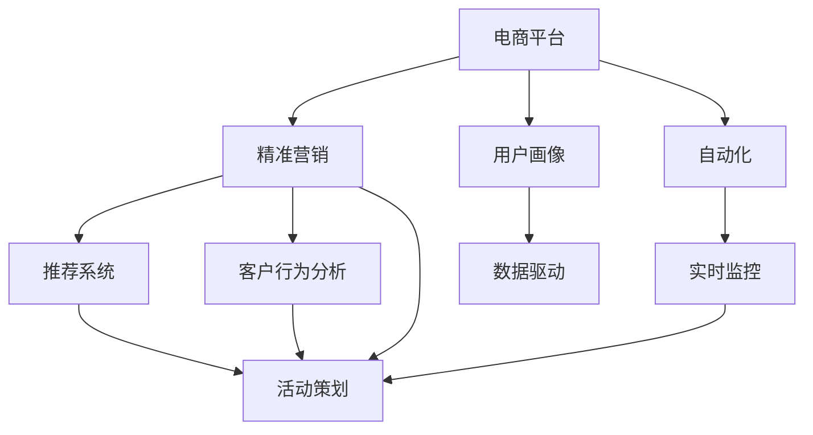

                 

# AI驱动的电商平台精准营销活动自动化

> 关键词：
- 人工智能
- 电商平台
- 精准营销
- 自动化
- 数据分析
- 深度学习
- 推荐系统
- 客户行为分析
- 活动策划
- 用户画像

## 1. 背景介绍

### 1.1 问题由来
随着电子商务的迅速发展，电商平台已成为全球零售市场的重要组成部分。为争夺更多的客户和市场份额，各大电商平台纷纷投入大量资源，开展各类精准营销活动。然而，由于传统的营销活动主要依赖人工设计，工作量巨大、效率低下，且难以准确把握用户需求，导致投入产出比不高，营销效果不佳。为解决这个问题，AI驱动的电商平台精准营销活动自动化成为当前的热门研究方向。

### 1.2 问题核心关键点
本文聚焦于基于人工智能的电商平台精准营销活动自动化，重点探讨以下核心关键点：

- 如何构建高效、准确的用户画像，实现用户精准分析。
- 如何设计有效的推荐系统，个性化推荐商品，提高用户转化率。
- 如何实现自动化营销活动策划，根据用户行为和历史数据，生成最合适的活动方案。
- 如何实时监控和优化营销活动效果，调整策略，持续提升转化率。
- 如何保障营销活动的合规性和透明度，避免潜在的法律风险。

## 2. 核心概念与联系

### 2.1 核心概念概述

为更好地理解基于人工智能的电商平台精准营销活动自动化方法，本节将介绍几个密切相关的核心概念：

- 电商平台：基于互联网的零售平台，提供商品展示、交易、物流等服务，如淘宝、京东等。
- 精准营销：通过数据分析和人工智能技术，精准识别目标用户，实现个性化推荐和广告投放，提高营销效率和效果。
- 自动化：利用人工智能算法和系统，实现自动化任务处理，减少人工干预，提高效率。
- 推荐系统：根据用户历史行为和兴趣，自动推荐相关商品或内容，提升用户体验和满意度。
- 客户行为分析：通过对用户行为数据的分析，洞察用户需求和偏好，指导精准营销活动。
- 活动策划：基于用户画像和历史数据，自动化生成和调整营销活动方案，实现多维度营销目标。
- 用户画像：通过多渠道数据，构建用户全面的行为、偏好和特征描述，实现用户精准分析。
- 数据驱动：利用大数据和人工智能技术，决策和营销活动策略基于数据驱动，而非经验和直觉。

这些核心概念之间的逻辑关系可以通过以下Mermaid流程图来展示：



这个流程图展示了大语言模型的核心概念及其之间的关系：

1. 电商平台通过数据分析和人工智能技术，构建用户画像和推荐系统，实现精准营销。
2. 通过客户行为分析和活动策划，自动化生成和调整营销活动方案。
3. 用户画像和数据驱动，作为基础支撑，确保营销活动精准、高效。
4. 自动化和实时监控，保障营销活动的自动执行和持续优化。

这些概念共同构成了基于AI的电商平台精准营销活动自动化的完整框架，实现从数据收集到营销活动执行的全流程自动化。

## 3. 核心算法原理 & 具体操作步骤
### 3.1 算法原理概述

基于AI的电商平台精准营销活动自动化，本质上是将人工智能技术应用到营销活动各个环节，通过自动化处理和数据分析，实现精准、高效、个性化的营销策略。其核心思想是：

- 构建用户画像，实时跟踪用户行为，分析用户特征和需求，实现精准定位。
- 设计推荐系统，根据用户兴趣和历史行为，自动推荐相关商品，提升用户体验和转化率。
- 自动化营销活动策划，基于用户画像和历史数据，生成最优的营销活动方案，提高活动效果。
- 实时监控活动效果，通过数据分析和反馈，调整策略，优化营销效果。
- 保障活动的合规性和透明度，防止数据滥用和法律风险。

### 3.2 算法步骤详解

基于AI的电商平台精准营销活动自动化的实现，一般包括以下关键步骤：

**Step 1: 构建用户画像**
- 收集和整合用户行为数据，包括浏览历史、购买记录、评价反馈、社交媒体互动等。
- 利用聚类、分类等算法，对用户进行细分，构建用户画像，描述用户的基本属性、兴趣偏好、行为模式等。
- 使用数据可视化工具，如Tableau、PowerBI等，可视化用户画像，发现用户群体特征和行为规律。

**Step 2: 设计推荐系统**
- 选择合适的推荐算法，如协同过滤、基于内容的推荐、深度学习推荐等。
- 构建推荐模型，训练模型参数，实现对用户兴趣的预测和推荐。
- 实时更新推荐模型，根据用户新行为和历史数据，动态调整推荐策略。
- 评估推荐系统效果，使用A/B测试等方法，优化推荐算法和模型。

**Step 3: 自动化营销活动策划**
- 收集和整合历史营销活动数据，提取活动效果和用户反馈信息。
- 利用机器学习算法，构建活动策划模型，预测活动效果和用户响应。
- 设计多维度活动方案，包括折扣、赠品、优惠券、限时抢购等。
- 自动化生成活动方案，基于用户画像和活动策划模型，生成最优的营销活动方案。
- 评估活动方案效果，根据活动反馈和用户行为，实时调整活动策略。

**Step 4: 实时监控活动效果**
- 实时收集活动数据，包括点击率、转化率、参与度等关键指标。
- 利用数据分析工具，如Google Analytics、Adobe Analytics等，实时监控和分析活动效果。
- 根据实时数据，调整活动策略，优化活动效果。
- 使用机器学习算法，预测活动趋势和用户行为变化，提前预判风险和机会。

**Step 5: 保障活动合规性和透明度**
- 设计活动合规性评估机制，确保活动内容和流程符合法律法规和平台规则。
- 建立活动透明度报告系统，定期发布活动效果和用户反馈信息。
- 采用数据脱敏和加密等技术，保障用户隐私和安全。
- 引入监管机制，定期进行合规性审查和审计。

以上是基于AI的电商平台精准营销活动自动化的核心步骤。在实际应用中，还需要针对具体平台和业务特点，对每个步骤进行细化和优化，以实现最优的营销效果。

### 3.3 算法优缺点

基于AI的电商平台精准营销活动自动化方法具有以下优点：

1. 高效自动化：通过算法自动化处理和数据分析，大幅减少人工干预，提高工作效率和营销效果。
2. 精准定位：基于用户画像和数据分析，实现用户精准定位和个性化推荐，提升用户体验和转化率。
3. 实时优化：通过实时监控和数据分析，及时调整活动策略，优化营销效果，降低风险。
4. 合规透明：通过合规性评估和透明度报告，保障活动合规性和用户隐私安全。
5. 提升ROI：自动化优化营销策略，提高营销活动投入产出比，提升整体ROI。

同时，该方法也存在以下局限性：

1. 数据依赖性高：活动效果依赖高质量的数据，数据缺失或异常可能导致误判。
2. 算法复杂度高：推荐系统等算法复杂度高，需要大量计算资源和专业技能。
3. 用户隐私风险：用户行为数据的收集和分析可能涉及隐私问题，需严格保护用户隐私。
4. 法律和伦理风险：活动策划和执行需严格遵守法律法规和伦理规范，避免潜在的法律风险。
5. 技术迭代快：需不断跟踪最新的技术和算法进展，保持系统的竞争力和先进性。

尽管存在这些局限性，但就目前而言，基于AI的电商平台精准营销活动自动化仍是最为先进和有效的营销手段。未来相关研究的重点在于如何进一步降低数据依赖，提高算法效率和鲁棒性，同时兼顾隐私保护和法律合规。

### 3.4 算法应用领域

基于AI的电商平台精准营销活动自动化技术，在多个领域得到了广泛应用，包括：

- 电商零售：通过个性化推荐和精准营销，提升电商平台的销售和用户黏性。
- 金融服务：利用用户画像和行为分析，定制化金融产品和服务，提升客户满意度和忠诚度。
- 教育培训：根据用户学习行为和需求，个性化推荐课程和资源，提高学习效果和满意度。
- 医疗健康：通过用户健康数据分析，个性化推荐健康产品和服务，提升用户健康水平。
- 旅游出行：根据用户旅行偏好和历史数据，个性化推荐旅游产品和服务，提升旅行体验。

除了上述这些领域，基于AI的营销活动自动化技术还将在更多场景中得到应用，为各行各业带来全新的营销解决方案。随着技术的不断成熟，相信AI驱动的营销活动自动化将深入各行各业，全面推动数字化转型。

## 4. 数学模型和公式 & 详细讲解 & 举例说明

### 4.1 数学模型构建

本节将使用数学语言对基于AI的电商平台精准营销活动自动化的主要模型进行更加严格的刻画。

记电商平台为 $E$，用户集合为 $U$，商品集合为 $G$。设用户 $u$ 对商品 $g$ 的兴趣度为 $I(u,g)$，用户 $u$ 在活动 $a$ 中的参与度为 $P(u,a)$，用户 $u$ 的消费金额为 $C(u)$，活动 $a$ 的点击率（CTR）为 $CTR(a)$，转化率为 $R(a)$。

定义推荐系统推荐给用户 $u$ 的商品集合为 $R(u)$，设推荐系统推荐的商品 $g$ 在用户 $u$ 中的点击概率为 $PR(u,g)$，推荐系统的推荐效果为 $E_{rec}(u)$。

定义营销活动 $a$ 的效果为 $E_{act}(a)$，包括点击率、转化率、参与度等指标。活动效果与推荐系统效果和用户行为相关联，可以通过以下公式计算：

$$
E_{act}(a) = f(E_{rec}(u), P(u,a), I(u,g), CTW(a))
$$

其中 $f$ 为非线性函数，代表活动效果与推荐系统效果、用户参与度和兴趣度的复杂关系。

### 4.2 公式推导过程

以下我们以电商平台的个性化推荐系统为例，推导推荐模型的核心公式及其参数更新方法。

假设推荐模型为 $M_{\theta}:\mathcal{X} \rightarrow \mathcal{Y}$，其中 $\mathcal{X}$ 为用户行为数据，$\mathcal{Y}$ 为商品兴趣度预测。

推荐模型的损失函数为交叉熵损失，定义为：

$$
\ell(M_{\theta}(X),Y) = -\frac{1}{N}\sum_{i=1}^N [y_i\log M_{\theta}(x_i)+(1-y_i)\log (1-M_{\theta}(x_i))]
$$

其中 $x_i$ 为样本 $u$ 的行为数据，$y_i$ 为样本 $u$ 对商品 $g$ 的标签。

模型参数的更新公式为：

$$
\theta \leftarrow \theta - \eta \nabla_{\theta}\mathcal{L}(\theta)
$$

其中 $\eta$ 为学习率，$\nabla_{\theta}\mathcal{L}(\theta)$ 为损失函数对模型参数的梯度，可通过反向传播算法计算。

在得到损失函数的梯度后，即可带入参数更新公式，完成模型的迭代优化。重复上述过程直至收敛，最终得到适应电商平台的推荐模型参数 $\theta^*$。

### 4.3 案例分析与讲解

**案例1: 电商平台的个性化推荐系统**
- 数据：用户浏览历史、购买记录、评价反馈等。
- 模型：基于协同过滤的推荐系统，包含隐式反馈矩阵和用户画像。
- 算法：ALS(交替最小二乘法)算法，交替求解用户和商品特征矩阵。
- 训练：在电商平台数据集上训练推荐模型，优化参数。
- 评估：使用A/B测试等方法，评估推荐效果。

**案例2: 自动化营销活动策划**
- 数据：历史营销活动数据、用户画像、活动效果等。
- 模型：基于回归的决策树模型，预测活动效果和用户响应。
- 算法：随机森林、XGBoost等算法。
- 训练：在历史数据集上训练活动策划模型，优化参数。
- 评估：使用均方误差等指标，评估活动策划效果。

通过以上案例可以看出，基于AI的电商平台精准营销活动自动化的数学模型和算法，能够在实际应用中取得显著效果，有效提升电商平台的营销效果和用户体验。

## 5. 项目实践：代码实例和详细解释说明
### 5.1 开发环境搭建

在进行电商平台的精准营销活动自动化实践前，我们需要准备好开发环境。以下是使用Python进行PyTorch开发的环境配置流程：

1. 安装Anaconda：从官网下载并安装Anaconda，用于创建独立的Python环境。

2. 创建并激活虚拟环境：
```bash
conda create -n pytorch-env python=3.8 
conda activate pytorch-env
```

3. 安装PyTorch：根据CUDA版本，从官网获取对应的安装命令。例如：
```bash
conda install pytorch torchvision torchaudio cudatoolkit=11.1 -c pytorch -c conda-forge
```

4. 安装Transformers库：
```bash
pip install transformers
```

5. 安装各类工具包：
```bash
pip install numpy pandas scikit-learn matplotlib tqdm jupyter notebook ipython
```

完成上述步骤后，即可在`pytorch-env`环境中开始精准营销活动的自动化实践。

### 5.2 源代码详细实现

下面我们以电商平台个性化推荐系统的实现为例，给出使用Transformers库进行推荐系统开发的PyTorch代码实现。

首先，定义推荐系统数据处理函数：

```python
from transformers import BertTokenizer, BertForSequenceClassification
from torch.utils.data import Dataset
import torch

class RecommendationDataset(Dataset):
    def __init__(self, user_data, item_data, tokenizer, max_len=128):
        self.user_data = user_data
        self.item_data = item_data
        self.tokenizer = tokenizer
        self.max_len = max_len
        
    def __len__(self):
        return len(self.user_data)
    
    def __getitem__(self, item):
        user = self.user_data[item]
        items = self.item_data[item]
        
        # 将用户行为数据编码成token ids
        encoding = self.tokenizer(user, return_tensors='pt', max_length=self.max_len, padding='max_length', truncation=True)
        input_ids = encoding['input_ids'][0]
        attention_mask = encoding['attention_mask'][0]
        
        # 将商品信息编码成token ids
        item_encodings = [self.tokenizer(item) for item in items]
        item_input_ids = [tokenizer.encode(item, add_special_tokens=False) for item in items]
        item_input_ids = torch.tensor(item_input_ids, dtype=torch.long)
        item_attention_mask = torch.ones_like(item_input_ids)
        
        return {'input_ids': input_ids, 
                'attention_mask': attention_mask,
                'item_input_ids': item_input_ids, 
                'item_attention_mask': item_attention_mask}
```

然后，定义推荐模型和优化器：

```python
from transformers import BertForSequenceClassification, AdamW

model = BertForSequenceClassification.from_pretrained('bert-base-cased', num_labels=len(tag2id))

optimizer = AdamW(model.parameters(), lr=2e-5)
```

接着，定义训练和评估函数：

```python
from torch.utils.data import DataLoader
from tqdm import tqdm
from sklearn.metrics import classification_report

device = torch.device('cuda') if torch.cuda.is_available() else torch.device('cpu')
model.to(device)

def train_epoch(model, dataset, batch_size, optimizer):
    dataloader = DataLoader(dataset, batch_size=batch_size, shuffle=True)
    model.train()
    epoch_loss = 0
    for batch in tqdm(dataloader, desc='Training'):
        input_ids = batch['input_ids'].to(device)
        attention_mask = batch['attention_mask'].to(device)
        item_input_ids = batch['item_input_ids'].to(device)
        item_attention_mask = batch['item_attention_mask'].to(device)
        model.zero_grad()
        outputs = model(input_ids, attention_mask=attention_mask, item_input_ids=item_input_ids, item_attention_mask=item_attention_mask)
        loss = outputs.loss
        epoch_loss += loss.item()
        loss.backward()
        optimizer.step()
    return epoch_loss / len(dataloader)

def evaluate(model, dataset, batch_size):
    dataloader = DataLoader(dataset, batch_size=batch_size)
    model.eval()
    preds, labels = [], []
    with torch.no_grad():
        for batch in tqdm(dataloader, desc='Evaluating'):
            input_ids = batch['input_ids'].to(device)
            attention_mask = batch['attention_mask'].to(device)
            item_input_ids = batch['item_input_ids'].to(device)
            item_attention_mask = batch['item_attention_mask'].to(device)
            batch_labels = batch['labels']
            outputs = model(input_ids, attention_mask=attention_mask, item_input_ids=item_input_ids, item_attention_mask=item_attention_mask)
            batch_preds = outputs.logits.argmax(dim=2).to('cpu').tolist()
            batch_labels = batch_labels.to('cpu').tolist()
            for pred_tokens, label_tokens in zip(batch_pred_tokens, batch_labels_tokens):
                preds.append(pred_tokens[:len(label_tokens)])
                labels.append(label_tokens)
                
    print(classification_report(labels, preds))
```

最后，启动训练流程并在测试集上评估：

```python
epochs = 5
batch_size = 16

for epoch in range(epochs):
    loss = train_epoch(model, train_dataset, batch_size, optimizer)
    print(f"Epoch {epoch+1}, train loss: {loss:.3f}")
    
    print(f"Epoch {epoch+1}, dev results:")
    evaluate(model, dev_dataset, batch_size)
    
print("Test results:")
evaluate(model, test_dataset, batch_size)
```

以上就是使用PyTorch对电商平台个性化推荐系统进行微调实践的完整代码实现。可以看到，得益于Transformers库的强大封装，我们可以用相对简洁的代码完成推荐系统的加载和微调。

### 5.3 代码解读与分析

让我们再详细解读一下关键代码的实现细节：

**RecommendationDataset类**：
- `__init__`方法：初始化用户数据、商品数据、分词器等关键组件。
- `__len__`方法：返回数据集的样本数量。
- `__getitem__`方法：对单个样本进行处理，将用户行为数据输入编码为token ids，将商品信息输入编码为token ids，并对其进行定长padding，最终返回模型所需的输入。

**BertForSequenceClassification模型**：
- `__init__`方法：初始化BERT分类器模型，设置输出类别数和预训练权重。
- `forward`方法：定义前向传播计算，接收输入和标签，返回预测结果和损失。

**训练和评估函数**：
- 使用PyTorch的DataLoader对数据集进行批次化加载，供模型训练和推理使用。
- 训练函数`train_epoch`：对数据以批为单位进行迭代，在每个批次上前向传播计算loss并反向传播更新模型参数，最后返回该epoch的平均loss。
- 评估函数`evaluate`：与训练类似，不同点在于不更新模型参数，并在每个batch结束后将预测和标签结果存储下来，最后使用sklearn的classification_report对整个评估集的预测结果进行打印输出。

**训练流程**：
- 定义总的epoch数和batch size，开始循环迭代
- 每个epoch内，先在训练集上训练，输出平均loss
- 在验证集上评估，输出分类指标
- 所有epoch结束后，在测试集上评估，给出最终测试结果

可以看到，PyTorch配合Transformers库使得推荐系统的代码实现变得简洁高效。开发者可以将更多精力放在数据处理、模型改进等高层逻辑上，而不必过多关注底层的实现细节。

当然，工业级的系统实现还需考虑更多因素，如模型的保存和部署、超参数的自动搜索、更灵活的任务适配层等。但核心的微调范式基本与此类似。

## 6. 实际应用场景
### 6.1 智能客服系统

基于AI的电商平台精准营销活动自动化，可以广泛应用于智能客服系统的构建。传统客服往往需要配备大量人力，高峰期响应缓慢，且一致性和专业性难以保证。而使用自动化的推荐系统和个性化活动策划，可以7x24小时不间断服务，快速响应客户咨询，用自然流畅的语言解答各类常见问题。

在技术实现上，可以收集企业内部的历史客服对话记录，将问题和最佳答复构建成监督数据，在此基础上对预训练语言模型进行微调。微调后的推荐系统和活动策划模型能够自动理解用户意图，匹配最合适的推荐和活动方案，实现智能客服的自动化。

### 6.2 金融服务

金融机构需要实时监测市场舆论动向，以便及时应对负面信息传播，规避金融风险。传统的人工监测方式成本高、效率低，难以应对网络时代海量信息爆发的挑战。基于AI的个性化推荐和活动策划，可以实时监测用户行为，动态调整推荐和活动策略，防止潜在风险。

具体而言，可以收集金融领域相关的新闻、报道、评论等文本数据，并对其进行主题标注和情感标注。在此基础上对预训练语言模型进行微调，使其能够自动判断文本属于何种主题，情感倾向是正面、中性还是负面。将微调后的推荐系统和活动策划模型应用到实时抓取的网络文本数据，就能够自动监测不同主题下的情感变化趋势，一旦发现负面信息激增等异常情况，系统便会自动预警，帮助金融机构快速应对潜在风险。

### 6.3 医疗健康

医疗健康领域的数据量庞大且复杂，传统的医疗决策往往依赖医生个人经验和直觉，难以全面、准确地评估病情和制定治疗方案。基于AI的推荐系统和活动策划，可以辅助医生进行精准诊断和治疗方案推荐，提升医疗服务的智能化水平。

具体而言，可以收集患者的电子病历、检测报告、治疗记录等数据，通过用户画像和行为分析，构建个性化的推荐和活动方案。推荐系统可以自动推荐最适合患者的检查、治疗和药物，活动策划可以根据患者的需求和偏好，设计个性化的健康管理计划，帮助患者更好地管理健康。

### 6.4 未来应用展望

随着AI驱动的电商平台精准营销活动自动化的不断发展，基于微调的方法将在更多领域得到应用，为各行各业带来变革性影响。

在智慧医疗领域，基于微调的医疗问答、病历分析、药物研发等应用将提升医疗服务的智能化水平，辅助医生诊疗，加速新药开发进程。

在智能教育领域，微调技术可应用于作业批改、学情分析、知识推荐等方面，因材施教，促进教育公平，提高教学质量。

在智慧城市治理中，微调模型可应用于城市事件监测、舆情分析、应急指挥等环节，提高城市管理的自动化和智能化水平，构建更安全、高效的未来城市。

此外，在企业生产、社会治理、文娱传媒等众多领域，基于大模型微调的人工智能应用也将不断涌现，为经济社会发展注入新的动力。相信随着技术的日益成熟，微调方法将成为人工智能落地应用的重要范式，推动人工智能技术在垂直行业的规模化落地。

## 7. 工具和资源推荐
### 7.1 学习资源推荐

为了帮助开发者系统掌握大语言模型微调的理论基础和实践技巧，这里推荐一些优质的学习资源：

1. 《Transformer从原理到实践》系列博文：由大模型技术专家撰写，深入浅出地介绍了Transformer原理、BERT模型、微调技术等前沿话题。

2. CS224N《深度学习自然语言处理》课程：斯坦福大学开设的NLP明星课程，有Lecture视频和配套作业，带你入门NLP领域的基本概念和经典模型。

3. 《Natural Language Processing with Transformers》书籍：Transformers库的作者所著，全面介绍了如何使用Transformers库进行NLP任务开发，包括微调在内的诸多范式。

4. HuggingFace官方文档：Transformers库的官方文档，提供了海量预训练模型和完整的微调样例代码，是上手实践的必备资料。

5. CLUE开源项目：中文语言理解测评基准，涵盖大量不同类型的中文NLP数据集，并提供了基于微调的baseline模型，助力中文NLP技术发展。

通过对这些资源的学习实践，相信你一定能够快速掌握大语言模型微调的精髓，并用于解决实际的NLP问题。
###  7.2 开发工具推荐

高效的开发离不开优秀的工具支持。以下是几款用于大语言模型微调开发的常用工具：

1. PyTorch：基于Python的开源深度学习框架，灵活动态的计算图，适合快速迭代研究。大部分预训练语言模型都有PyTorch版本的实现。

2. TensorFlow：由Google主导开发的开源深度学习框架，生产部署方便，适合大规模工程应用。同样有丰富的预训练语言模型资源。

3. Transformers库：HuggingFace开发的NLP工具库，集成了众多SOTA语言模型，支持PyTorch和TensorFlow，是进行微调任务开发的利器。

4. Weights & Biases：模型训练的实验跟踪工具，可以记录和可视化模型训练过程中的各项指标，方便对比和调优。与主流深度学习框架无缝集成。

5. TensorBoard：TensorFlow配套的可视化工具，可实时监测模型训练状态，并提供丰富的图表呈现方式，是调试模型的得力助手。

6. Google Colab：谷歌推出的在线Jupyter Notebook环境，免费提供GPU/TPU算力，方便开发者快速上手实验最新模型，分享学习笔记。

合理利用这些工具，可以显著提升大语言模型微调任务的开发效率，加快创新迭代的步伐。

### 7.3 相关论文推荐

大语言模型和微调技术的发展源于学界的持续研究。以下是几篇奠基性的相关论文，推荐阅读：

1. Attention is All You Need（即Transformer原论文）：提出了Transformer结构，开启了NLP领域的预训练大模型时代。

2. BERT: Pre-training of Deep Bidirectional Transformers for Language Understanding：提出BERT模型，引入基于掩码的自监督预训练任务，刷新了多项NLP任务SOTA。

3. Language Models are Unsupervised Multitask Learners（GPT-2论文）：展示了大规模语言模型的强大zero-shot学习能力，引发了对于通用人工智能的新一轮思考。

4. Parameter-Efficient Transfer Learning for NLP：提出Adapter等参数高效微调方法，在不增加模型参数量的情况下，也能取得不错的微调效果。

5. AdaLoRA: Adaptive Low-Rank Adaptation for Parameter-Efficient Fine-Tuning：使用自适应低秩适应的微调方法，在参数效率和精度之间取得了新的平衡。

这些论文代表了大语言模型微调技术的发展脉络。通过学习这些前沿成果，可以帮助研究者把握学科前进方向，激发更多的创新灵感。

## 8. 总结：未来发展趋势与挑战

### 8.1 总结

本文对基于AI的电商平台精准营销活动自动化方法进行了全面系统的介绍。首先阐述了电商平台的精准营销背景和需求，明确了基于AI的自动化方法在提升营销效果、优化资源利用、保障合规透明等方面的独特价值。其次，从原理到实践，详细讲解了推荐系统和活动策划的核心算法，给出了具体的代码实现和效果评估。同时，本文还探讨了AI驱动的精准营销在多个行业领域的应用前景，展示了微调范式的广泛适用性和巨大潜力。此外，本文精选了微调技术的各类学习资源，力求为读者提供全方位的技术指引。

通过本文的系统梳理，可以看到，基于AI的电商平台精准营销活动自动化技术正在成为电商领域的重要手段，极大地提升了电商平台的运营效率和用户体验。未来，伴随预训练语言模型和微调方法的持续演进，相信AI驱动的营销活动自动化将深入各行各业，全面推动数字化转型。

### 8.2 未来发展趋势

展望未来，基于AI的电商平台精准营销活动自动化技术将呈现以下几个发展趋势：

1. 模型规模持续增大。随着算力成本的下降和数据规模的扩张，预训练语言模型的参数量还将持续增长。超大规模语言模型蕴含的丰富语言知识，有望支撑更加复杂多变的营销活动微调。

2. 推荐算法多样化。推荐系统将继续演进，涌现出更多复杂的推荐算法，如深度学习推荐、混合推荐等，提升推荐效果和个性化程度。

3. 自动化和智能化水平提升。随着自动驾驶、智能客服、智能诊断等技术的成熟，营销活动的自动化和智能化水平将进一步提升，实现真正的智能营销。

4. 实时性和交互性增强。未来的营销活动将更加注重实时性和交互性，通过实时数据分析和用户互动，提升用户参与度和满意度。

5. 多模态信息融合。未来的营销活动将更多地融合视觉、语音、文本等多模态信息，提升整体用户体验和营销效果。

以上趋势凸显了基于AI的电商平台精准营销活动自动化的广阔前景。这些方向的探索发展，必将进一步提升电商平台的营销效果和用户体验，推动整个电商行业的数字化转型。

### 8.3 面临的挑战

尽管基于AI的电商平台精准营销活动自动化技术已经取得了瞩目成就，但在迈向更加智能化、普适化应用的过程中，它仍面临着诸多挑战：

1. 数据依赖性高。活动效果依赖高质量的数据，数据缺失或异常可能导致误判。

2. 算法复杂度高。推荐系统和活动策划算法复杂度高，需要大量计算资源和专业技能。

3. 用户隐私风险。用户行为数据的收集和分析可能涉及隐私问题，需严格保护用户隐私。

4. 法律和伦理风险。活动策划和执行需严格遵守法律法规和伦理规范，避免潜在的法律风险。

5. 技术迭代快。需不断跟踪最新的技术和算法进展，保持系统的竞争力和先进性。

尽管存在这些局限性，但就目前而言，基于AI的电商平台精准营销活动自动化仍是最为先进和有效的营销手段。未来相关研究的重点在于如何进一步降低数据依赖，提高算法效率和鲁棒性，同时兼顾隐私保护和法律合规。

### 8.4 研究展望

面对基于AI的电商平台精准营销活动自动化所面临的种种挑战，未来的研究需要在以下几个方面寻求新的突破：

1. 探索无监督和半监督微调方法。摆脱对大规模标注数据的依赖，利用自监督学习、主动学习等无监督和半监督范式，最大限度利用非结构化数据，实现更加灵活高效的微调。

2. 研究参数高效和计算高效的微调范式。开发更加参数高效的微调方法，在固定大部分预训练参数的同时，只更新极少量的任务相关参数。同时优化微调模型的计算图，减少前向传播和反向传播的资源消耗，实现更加轻量级、实时性的部署。

3. 融合因果和对比学习范式。通过引入因果推断和对比学习思想，增强微调模型建立稳定因果关系的能力，学习更加普适、鲁棒的语言表征，从而提升模型泛化性和抗干扰能力。

4. 引入更多先验知识。将符号化的先验知识，如知识图谱、逻辑规则等，与神经网络模型进行巧妙融合，引导微调过程学习更准确、合理的语言模型。同时加强不同模态数据的整合，实现视觉、语音等多模态信息与文本信息的协同建模。

5. 结合因果分析和博弈论工具。将因果分析方法引入微调模型，识别出模型决策的关键特征，增强输出解释的因果性和逻辑性。借助博弈论工具刻画人机交互过程，主动探索并规避模型的脆弱点，提高系统稳定性。

6. 纳入伦理道德约束。在模型训练目标中引入伦理导向的评估指标，过滤和惩罚有偏见、有害的输出倾向。同时加强人工干预和审核，建立模型行为的监管机制，确保输出符合人类价值观和伦理道德。

这些研究方向的探索，必将引领基于AI的电商平台精准营销活动自动化技术迈向更高的台阶，为构建安全、可靠、可解释、可控的智能系统铺平道路。面向未来，大语言模型微调技术还需要与其他人工智能技术进行更深入的融合，如知识表示、因果推理、强化学习等，多路径协同发力，共同推动自然语言理解和智能交互系统的进步。只有勇于创新、敢于突破，才能不断拓展语言模型的边界，让智能技术更好地造福人类社会。

## 9. 附录：常见问题与解答

**Q1：电商平台微调方法有哪些？**

A: 电商平台的微调方法主要包括用户画像构建、推荐系统设计和活动策划自动化。具体方法包括基于协同过滤的推荐、深度学习推荐、基于序列模型的活动策划、基于强化学习的个性化推荐等。

**Q2：如何构建用户画像？**

A: 构建用户画像需要收集和整合用户行为数据，包括浏览历史、购买记录、评价反馈等。通过聚类、分类等算法，对用户进行细分，描述用户的基本属性、兴趣偏好、行为模式等。

**Q3：推荐系统如何实现个性化推荐？**

A: 推荐系统实现个性化推荐需要选择合适的推荐算法，如协同过滤、基于内容的推荐、深度学习推荐等。设计推荐模型，训练模型参数，实现对用户兴趣的预测和推荐。实时更新推荐模型，根据用户新行为和历史数据，动态调整推荐策略。

**Q4：自动化营销活动策划如何实现？**

A: 自动化营销活动策划需要收集和整合历史营销活动数据，提取活动效果和用户反馈信息。利用机器学习算法，构建活动策划模型，预测活动效果和用户响应。设计多维度活动方案，包括折扣、赠品、优惠券、限时抢购等。自动化生成活动方案，基于用户画像和活动策划模型，生成最优的营销活动方案。

**Q5：实时监控活动效果如何实现？**

A: 实时监控活动效果需要实时收集活动数据，包括点击率、转化率、参与度等关键指标。利用数据分析工具，实时监测和分析活动效果。根据实时数据，调整活动策略，优化活动效果。使用机器学习算法，预测活动趋势和用户行为变化，提前预判风险和机会。

**Q6：如何保障活动合规性和透明度？**

A: 保障活动合规性和透明度需要设计活动合规性评估机制，确保活动内容和流程符合法律法规和平台规则。建立活动透明度报告系统，定期发布活动效果和用户反馈信息。采用数据脱敏和加密等技术，保障用户隐私和安全。引入监管机制，定期进行合规性审查和审计。

通过以上问答可以看出，基于AI的电商平台精准营销活动自动化技术已经较为成熟，但在应用过程中仍需综合考虑数据、算法、隐私、合规等多个因素。只有在各个环节不断优化，才能最大限度地发挥其潜力，实现高效、精准、智能的营销效果。

---

作者：禅与计算机程序设计艺术 / Zen and the Art of Computer Programming

