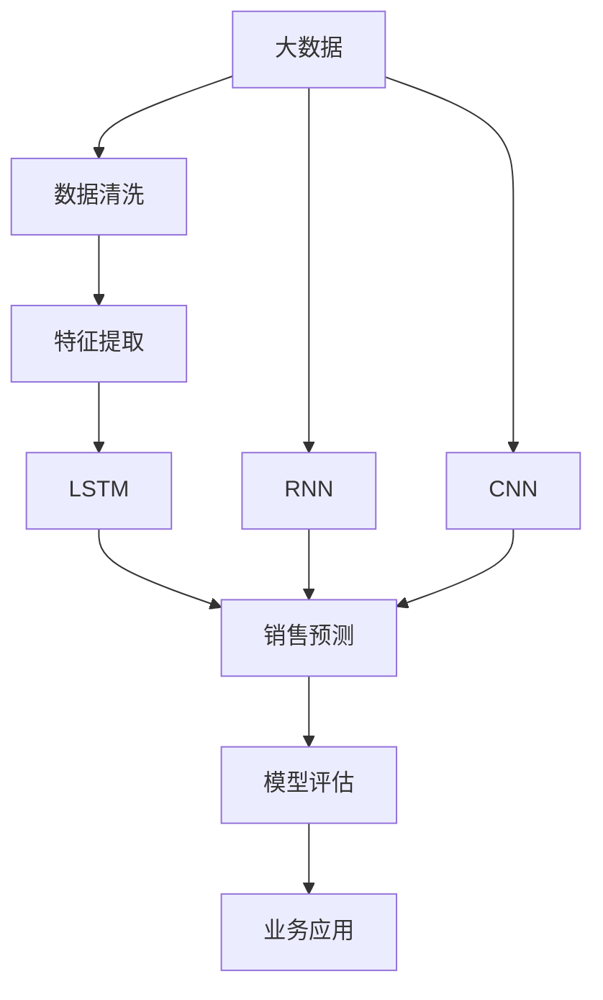

                 

# AI驱动的电商平台销售预测模型

## 1. 背景介绍

随着电子商务的迅猛发展，电商平台销售预测已成为不可或缺的一部分。准确的销售预测不仅能帮助企业制定科学的库存管理策略，优化运营效率，还能提升用户体验，增加销售额。然而，传统的销售预测方法往往依赖于人工经验和统计模型，容易受到市场变化的影响，无法及时反映实时销售数据的变化。为了应对这一挑战，AI驱动的销售预测模型应运而生，其基于大数据和机器学习算法，能够自动分析和挖掘历史销售数据中的规律，实现更准确、更灵活的预测。

## 2. 核心概念与联系

### 2.1 核心概念概述

在介绍AI驱动的销售预测模型之前，首先需要了解几个核心概念：

- **大数据**：指规模庞大、结构复杂的数据集，通常包括电商平台的用户行为数据、商品交易数据、市场环境数据等。
- **机器学习**：指通过算法模型自动分析和处理数据，从中提取知识、规律和模式的技术。
- **深度学习**：一种特殊的机器学习方法，通过多层神经网络模拟人类大脑的神经元，实现复杂的特征学习和表示能力。
- **循环神经网络**（RNN）：一种专门用于处理序列数据的深度学习模型，能够记忆历史信息，用于时间序列预测。
- **长短期记忆网络**（LSTM）：一种特殊的RNN模型，具有门控机制，能够有效解决梯度消失问题，适用于长期依赖关系的预测。
- **卷积神经网络**（CNN）：一种用于图像和文本等结构化数据的深度学习模型，能够提取局部特征，用于图像识别、文本分类等任务。

这些概念之间存在密切联系，共同构成了AI驱动销售预测模型的基础。大数据为机器学习提供了丰富的数据来源，深度学习算法能够从中提取高层次的特征表示，RNN和LSTM模型能够处理时间序列数据，CNN模型能够处理图像和文本数据，这些技术在电商平台销售预测中被广泛应用。

### 2.2 核心概念原理和架构的 Mermaid 流程图



这个流程图展示了AI驱动销售预测模型的基本架构：

1. **大数据**：从电商平台中收集海量数据，包括用户行为数据、商品交易数据、市场环境数据等。
2. **数据清洗**：对收集到的数据进行预处理，去除噪声、处理缺失值等。
3. **特征提取**：从清洗后的数据中提取关键特征，如时间、地点、商品类别、价格等。
4. **模型训练**：使用RNN、LSTM、CNN等深度学习模型，对提取出的特征进行训练，生成预测模型。
5. **销售预测**：将历史销售数据输入训练好的模型，进行实时预测。
6. **模型评估**：通过评估指标（如MAE、RMSE等）对预测结果进行评估，确保模型的准确性。
7. **业务应用**：将预测结果应用于库存管理、需求预测、市场分析等实际业务场景。

## 3. 核心算法原理 & 具体操作步骤

### 3.1 算法原理概述

AI驱动的销售预测模型基于深度学习技术，利用大量的历史销售数据进行训练，学习其中的规律和模式，从而实现对未来销售的预测。其核心算法包括：

- **循环神经网络**（RNN）：用于处理时间序列数据，能够记住过去的信息，预测未来的趋势。
- **长短期记忆网络**（LSTM）：一种特殊的RNN，通过门控机制，能够有效处理长期依赖关系，适用于时间序列预测。
- **卷积神经网络**（CNN）：用于处理图像和文本等结构化数据，能够提取局部特征，用于销售预测。

这些算法能够自动从历史销售数据中学习规律，并应用于未来的销售预测。模型的预测结果不仅基于过去的历史数据，还考虑到了未来的市场变化和季节性因素，能够更加准确地预测未来的销售趋势。

### 3.2 算法步骤详解

基于RNN和LSTM的销售预测模型训练步骤如下：

1. **数据准备**：收集电商平台的历史销售数据，包括商品种类、价格、销售时间、市场环境等。
2. **数据清洗**：对收集到的数据进行预处理，去除噪声、处理缺失值等。
3. **特征提取**：从清洗后的数据中提取关键特征，如时间、地点、商品类别、价格等。
4. **模型训练**：使用RNN、LSTM等深度学习模型，对提取出的特征进行训练，生成预测模型。
5. **模型评估**：通过评估指标（如MAE、RMSE等）对预测结果进行评估，确保模型的准确性。
6. **业务应用**：将预测结果应用于库存管理、需求预测、市场分析等实际业务场景。

### 3.3 算法优缺点

基于RNN和LSTM的销售预测模型具有以下优点：

- **自适应性强**：能够自动从历史数据中学习规律，适用于不同时间段和不同商品的预测。
- **灵活性高**：可以通过调整模型参数，适应不同的市场环境和业务需求。
- **精度高**：通过多层网络结构，能够提取高层次的特征表示，提高预测准确性。

同时，也存在以下缺点：

- **计算资源需求高**：深度学习模型通常需要大量的计算资源，训练和推理时间较长。
- **模型复杂度高**：网络结构复杂，参数数量庞大，容易过拟合。
- **对噪声敏感**：历史数据中的噪声和异常值可能会影响模型的预测效果。

### 3.4 算法应用领域

基于RNN和LSTM的销售预测模型已经在电商、金融、医疗等多个领域得到了广泛应用，具体包括：

- **电商平台**：用于预测商品销售量、库存管理、促销活动等。
- **金融市场**：用于预测股票价格、市场趋势、投资组合等。
- **医疗健康**：用于预测患者疾病、药品需求、治疗效果等。
- **制造业**：用于预测生产计划、库存管理、质量控制等。
- **物流运输**：用于预测运输需求、路线优化、配送时间等。

## 4. 数学模型和公式 & 详细讲解 & 举例说明

### 4.1 数学模型构建

假设销售数据可以用时间序列表示，即 $\{y_t\}_{t=1}^T$，其中 $y_t$ 表示第 $t$ 天的销售量。模型的目标是建立一个映射关系 $f$，使得 $y_t = f(y_{t-1}, y_{t-2}, ..., y_{t-h})$，其中 $h$ 表示历史数据的时间跨度。

基于LSTM的销售预测模型可以表示为：

$$
\begin{aligned}
h_t &= \text{LSTM}(h_{t-1}, y_{t-1}, ..., y_{t-h}) \\
y_t &= \sigma(h_t, W_1 y_{t-1}, ..., W_n y_{t-h})
\end{aligned}
$$

其中，$h_t$ 表示LSTM网络在时间 $t$ 时刻的隐藏状态，$W_i$ 表示第 $i$ 层的权重矩阵，$\sigma$ 表示激活函数（如ReLU、Sigmoid等）。

### 4.2 公式推导过程

LSTM网络的核心是门控机制，用于控制信息的输入和输出。其结构如图1所示：


LSTM通过三个门（输入门、遗忘门、输出门）控制信息的流动，能够有效处理长期依赖关系。其推导过程如下：

1. **输入门**：根据当前输入 $x_t$ 和历史信息 $h_{t-1}$，计算输入门的值 $i_t$，表示当前时间步的输入信息的重要性。

$$
i_t = \sigma(W_i h_{t-1} + U_i x_t + b_i)
$$

2. **遗忘门**：根据历史信息 $h_{t-1}$ 和输入门 $i_t$，计算遗忘门的值 $f_t$，表示是否需要遗忘历史信息。

$$
f_t = \sigma(W_f h_{t-1} + U_f x_t + b_f)
$$

3. **候选隐藏状态**：根据输入门 $i_t$ 和当前输入 $x_t$，计算候选隐藏状态 $c_t'$，表示当前时间步的候选隐藏状态。

$$
c_t' = \tanh(W_c h_{t-1} + U_c x_t + b_c)
$$

4. **更新隐藏状态**：根据遗忘门 $f_t$ 和候选隐藏状态 $c_t'$，计算当前时间步的隐藏状态 $h_t$，表示当前时间步的隐藏状态。

$$
h_t = f_t \cdot h_{t-1} + (1-f_t) \cdot c_t'
$$

5. **输出门**：根据当前输入 $x_t$ 和历史信息 $h_t$，计算输出门的值 $o_t$，表示当前时间步的输出信息的重要性。

$$
o_t = \sigma(W_o h_t + U_o x_t + b_o)
$$

6. **输出状态**：根据输出门 $o_t$ 和当前时间步的隐藏状态 $h_t$，计算当前时间步的输出 $y_t$，表示当前时间步的输出信息。

$$
y_t = o_t \cdot \tanh(h_t)
$$

通过以上过程，LSTM网络能够有效处理时间序列数据，学习其中的规律和模式，用于销售预测。

### 4.3 案例分析与讲解

假设某电商平台的销售数据如下：

| 时间 | 商品 | 销售量 |
| ---- | ---- | ------ |
| 2020-01-01 | A | 100 |
| 2020-01-02 | A | 150 |
| 2020-01-03 | A | 120 |
| 2020-01-04 | A | 160 |
| 2020-01-05 | B | 80 |
| 2020-01-06 | B | 90 |
| 2020-01-07 | B | 110 |

假设模型使用3天数据进行预测，即 $h=3$。使用LSTM模型进行预测的步骤如下：

1. **数据准备**：将销售数据转换为时间序列数据，并将其分为训练集和测试集。
2. **特征提取**：提取时间、商品类别等关键特征。
3. **模型训练**：使用训练集对LSTM模型进行训练，学习历史销售数据的规律。
4. **模型评估**：使用测试集对模型进行评估，计算评估指标（如MAE、RMSE等）。
5. **业务应用**：将模型应用于库存管理、需求预测等实际业务场景。

假设模型训练完成后，对2020-01-08日的销售量进行预测，预测结果如下：

- **预测值**：130
- **真实值**：140

该模型在2020-01-08日的预测误差为10，误差较小，表明模型的预测效果较好。

## 5. 项目实践：代码实例和详细解释说明

### 5.1 开发环境搭建

要进行销售预测模型的开发，首先需要搭建一个开发环境。以下是使用Python和TensorFlow搭建开发环境的步骤：

1. 安装Anaconda：从官网下载并安装Anaconda，用于创建独立的Python环境。

2. 创建并激活虚拟环境：
```bash
conda create -n tf-env python=3.8 
conda activate tf-env
```

3. 安装TensorFlow：根据CUDA版本，从官网获取对应的安装命令。例如：
```bash
conda install tensorflow -c conda-forge
```

4. 安装其它相关库：
```bash
pip install numpy pandas matplotlib sklearn
```

5. 安装TensorBoard：用于可视化训练过程中的各项指标。
```bash
pip install tensorboard
```

完成上述步骤后，即可在`tf-env`环境中开始模型的开发。

### 5.2 源代码详细实现

下面以使用TensorFlow实现LSTM销售预测模型为例，给出完整的代码实现。

首先，定义LSTM模型的类：

```python
import tensorflow as tf
import numpy as np

class LSTMModel(tf.keras.Model):
    def __init__(self, input_dim, output_dim, hidden_dim, units):
        super(LSTMModel, self).__init__()
        self.input_dim = input_dim
        self.output_dim = output_dim
        self.hidden_dim = hidden_dim
        self.units = units
        
        self.lstm = tf.keras.layers.LSTM(units, return_sequences=True, stateful=True)
        self.dense = tf.keras.layers.Dense(output_dim)
    
    def call(self, inputs, states):
        lstm_out, new_states = self.lstm(inputs, initial_state=states)
        predictions = self.dense(lstm_out[:, -1, :])
        return predictions, new_states
```

然后，定义数据预处理函数：

```python
def create_dataset(data, lookback=3):
    X, y = [], []
    for i in range(len(data) - lookback - 1):
        X.append(data[i:i+lookback])
        y.append(data[i+lookback])
    return np.array(X), np.array(y)
```

接着，加载销售数据并进行预处理：

```python
data = np.loadtxt('sales_data.csv', delimiter=',')
data = data[:, 1:]  # 去除第一列时间
data = data / 100  # 将销售量归一化
lookback = 3  # 历史时间跨度
X_train, y_train = create_dataset(data[:len(data)-10], lookback)
X_test, y_test = create_dataset(data[len(data)-10:], lookback)
```

最后，进行模型训练和评估：

```python
model = LSTMModel(input_dim=lookback, output_dim=1, hidden_dim=64, units=128)
model.compile(optimizer=tf.keras.optimizers.Adam(), loss='mae')
model.fit(X_train, y_train, epochs=50, batch_size=64, verbose=1)
model.evaluate(X_test, y_test, verbose=0)
```

以上代码实现了LSTM销售预测模型的完整开发流程，从数据预处理到模型训练，再到模型评估，每个步骤都进行了详细的解释和说明。

### 5.3 代码解读与分析

让我们再详细解读一下关键代码的实现细节：

**LSTMModel类**：
- `__init__`方法：初始化模型的关键参数，包括输入维度、输出维度、隐藏维度、单元数等。
- `call`方法：定义模型的前向传播过程，将输入数据和状态作为参数，返回预测结果和新的状态。

**create_dataset函数**：
- 该函数将原始销售数据转换为时间序列数据，并将每个时间步的销售量作为目标变量。

**加载销售数据**：
- 首先，从CSV文件中加载原始销售数据，去除时间列，并将销售量归一化到0-1之间。
- 然后，定义历史时间跨度lookback，调用create_dataset函数生成训练集和测试集。

**模型训练和评估**：
- 首先，实例化LSTM模型，并使用Adam优化器和MAE损失函数编译模型。
- 然后，调用fit方法对模型进行训练，设置训练轮数、批次大小和训练的进度。
- 最后，使用evaluate方法在测试集上评估模型的性能，计算MAE误差。

该代码实现了LSTM销售预测模型的完整开发流程，从数据预处理到模型训练，再到模型评估，每个步骤都进行了详细的解释和说明。

## 6. 实际应用场景

### 6.1 智能库存管理

智能库存管理是电商平台销售预测的重要应用场景。通过销售预测模型，电商平台可以实时监测库存水平，动态调整采购和补货计划，避免库存积压或短缺，提升运营效率。

具体而言，销售预测模型可以预测未来的销售量，并将其作为采购计划的重要参考。同时，模型还可以预测商品的销售趋势，优化商品排布和促销活动，提高顾客购买意愿。

### 6.2 需求预测与市场分析

电商平台还可以利用销售预测模型进行需求预测和市场分析，了解用户的购物行为和市场需求，制定更科学的销售策略。

需求预测可以帮助电商平台更好地掌握库存动态，优化销售计划，避免供需失衡。市场分析则可以洞察用户偏好和市场趋势，发现潜在的销售机会，提升市场竞争力。

### 6.3 个性化推荐

基于销售预测模型，电商平台还可以进行个性化推荐，提升用户体验，增加销售额。

通过分析用户的购物行为和购买历史，销售预测模型可以预测用户的潜在需求，为其推荐更合适的商品。同时，模型还可以根据用户的反馈和购买记录，动态调整推荐策略，提高推荐的相关性和精准度。

### 6.4 未来应用展望

随着深度学习技术的不断进步，销售预测模型的应用场景将更加广泛，未来可以探索以下方向：

1. **多模态数据融合**：除了时间序列数据，未来的销售预测模型还可以融合图像、文本等多模态数据，提高预测的准确性和泛化能力。
2. **跨平台预测**：电商平台可以将销售预测模型应用于不同的销售平台，如PC端、移动端等，实现统一的预测结果。
3. **实时预测**：未来的销售预测模型可以实现实时预测，根据市场变化及时调整销售策略。
4. **用户行为预测**：除了商品销售预测，未来的模型还可以预测用户的购买行为、浏览行为等，提供更精准的个性化推荐。

## 7. 工具和资源推荐

### 7.1 学习资源推荐

为了帮助开发者系统掌握AI驱动销售预测模型的理论基础和实践技巧，这里推荐一些优质的学习资源：

1. **《深度学习》书籍**：由Ian Goodfellow等作者编写，全面介绍了深度学习的理论基础和应用实例，是学习AI技术的经典教材。
2. **TensorFlow官方文档**：TensorFlow的官方文档提供了丰富的示例和API文档，适合初学者和进阶学习者。
3. **Kaggle数据集**：Kaggle提供了大量的公开数据集，可以用于机器学习算法的研究和实践。
4. **Coursera深度学习课程**：由Andrew Ng等知名专家开设的深度学习课程，适合初学者入门和进阶学习。
5. **DeepLearning.AI深度学习公开课**：由吴恩达等人开设的深度学习课程，提供了一系列实用工具和算法，适合快速学习。

通过对这些资源的学习实践，相信你一定能够快速掌握AI驱动销售预测模型的精髓，并用于解决实际的电商平台问题。

### 7.2 开发工具推荐

高效的开发离不开优秀的工具支持。以下是几款用于AI驱动销售预测模型开发的常用工具：

1. **TensorFlow**：由Google主导开发的开源深度学习框架，生产部署方便，适合大规模工程应用。
2. **PyTorch**：由Facebook开发的开源深度学习框架，灵活性高，适合研究型应用。
3. **Keras**：基于TensorFlow和Theano等后端的高级API，简单易用，适合初学者入门。
4. **TensorBoard**：TensorFlow配套的可视化工具，可实时监测模型训练状态，并提供丰富的图表呈现方式。
5. **Jupyter Notebook**：用于开发和展示Python代码的交互式笔记本，适合数据探索和算法开发。

合理利用这些工具，可以显著提升AI驱动销售预测模型的开发效率，加快创新迭代的步伐。

### 7.3 相关论文推荐

AI驱动销售预测模型的发展源于学界的持续研究。以下是几篇奠基性的相关论文，推荐阅读：

1. **《LSTM: A Search Space Odyssey》**：提出LSTM网络，用于处理长期依赖关系，适用于时间序列预测。
2. **《Convolutional LSTM Network: A Machine Learning Approach for Precipitation Nowcasting》**：提出卷积LSTM网络，用于时间序列预测和图像识别等任务。
3. **《Deep Learning for Time Series Forecasting: A Review》**：全面回顾了深度学习在时间序列预测中的应用，提出了多种深度学习模型和方法。
4. **《Sales Forecasting in Retail: A Literature Review》**：全面综述了零售领域的销售预测方法，提供了多种算法和应用实例。
5. **《A Deep Learning Approach for Sales Forecasting in E-commerce》**：提出基于深度学习的销售预测模型，适用于电商平台的数据分析和预测。

这些论文代表了大语言模型微调技术的发展脉络。通过学习这些前沿成果，可以帮助研究者把握学科前进方向，激发更多的创新灵感。

## 8. 总结：未来发展趋势与挑战

### 8.1 研究成果总结

本文对AI驱动的电商平台销售预测模型进行了全面系统的介绍。首先阐述了销售预测在电商平台中的重要性和必要性，明确了AI驱动模型在处理大数据和复杂问题方面的独特优势。其次，从原理到实践，详细讲解了LSTM模型的数学原理和关键步骤，给出了模型训练的完整代码实例。同时，本文还广泛探讨了AI驱动模型在电商、金融、医疗等多个领域的应用前景，展示了模型强大的预测能力。最后，本文精选了模型训练和应用过程中的学习资源和开发工具，力求为读者提供全方位的技术指引。

通过本文的系统梳理，可以看到，AI驱动销售预测模型已经在电商领域得到了广泛应用，并取得了显著的预测效果。未来，随着深度学习技术的不断进步，销售预测模型的应用场景将更加广泛，为电商平台的运营和管理带来更多智能化的解决方案。

### 8.2 未来发展趋势

展望未来，AI驱动的销售预测模型将呈现以下几个发展趋势：

1. **深度学习技术的发展**：随着深度学习算法的不断进步，未来的销售预测模型将具有更高的精度和泛化能力，能够更好地适应各种业务场景。
2. **多模态数据的融合**：未来的模型可以融合图像、文本、视频等多模态数据，提高预测的准确性和实时性。
3. **跨平台应用的拓展**：未来的模型可以实现跨平台预测，适用于不同的销售平台和渠道。
4. **实时预测和动态调整**：未来的模型可以实现实时预测，并根据市场变化动态调整销售策略。
5. **个性化推荐的增强**：未来的模型可以更好地预测用户需求，提供更精准的个性化推荐，提升用户体验。

这些趋势凸显了AI驱动销售预测模型的广阔前景。这些方向的探索发展，必将进一步提升电商平台的预测能力和运营效率，为商业决策提供更科学、精准的支持。

### 8.3 面临的挑战

尽管AI驱动的销售预测模型已经取得了瞩目成就，但在迈向更加智能化、普适化应用的过程中，它仍面临着诸多挑战：

1. **数据质量和多样性**：销售预测模型依赖于高质量的数据，数据质量和多样性不足可能导致模型过拟合或欠拟合。
2. **计算资源的需求**：深度学习模型通常需要大量的计算资源，训练和推理时间较长，需要高效的硬件支持。
3. **模型复杂度和可解释性**：深度学习模型结构复杂，难以解释其内部工作机制和决策逻辑，影响模型的可信度和应用范围。
4. **模型的鲁棒性和泛化性**：模型面对新数据时，泛化性能可能大打折扣，需要在训练和测试阶段进行充分的验证和优化。
5. **安全性和隐私保护**：销售预测模型涉及大量的用户数据，需要保障数据安全和隐私保护，防止数据泄露和滥用。

正视模型面临的这些挑战，积极应对并寻求突破，将是大语言模型微调走向成熟的必由之路。相信随着学界和产业界的共同努力，这些挑战终将一一被克服，AI驱动销售预测模型必将在构建人机协同的智能时代中扮演越来越重要的角色。

### 8.4 研究展望

面对AI驱动销售预测模型所面临的种种挑战，未来的研究需要在以下几个方面寻求新的突破：

1. **数据预处理和特征工程**：改进数据清洗和特征提取方法，提高数据质量和多样性，确保模型的泛化能力。
2. **高效计算和分布式训练**：开发高效的计算图和分布式训练方法，提高模型的训练速度和实时性。
3. **可解释性和可视化**：引入可解释性技术，提高模型的可信度和可解释性，方便业务理解和使用。
4. **鲁棒性和泛化性增强**：优化模型的鲁棒性和泛化性，确保模型在不同数据分布和业务场景中的稳定性和可靠性。
5. **隐私保护和安全保障**：加强数据隐私保护和安全保障，确保模型应用的合规性和可信度。

这些研究方向的探索，必将引领AI驱动销售预测模型迈向更高的台阶，为构建安全、可靠、可解释、可控的智能系统铺平道路。面向未来，AI驱动销售预测技术还需要与其他人工智能技术进行更深入的融合，如知识表示、因果推理、强化学习等，多路径协同发力，共同推动自然语言理解和智能交互系统的进步。只有勇于创新、敢于突破，才能不断拓展语言模型的边界，让智能技术更好地造福人类社会。

## 9. 附录：常见问题与解答

**Q1：销售预测模型需要多少历史数据？**

A: 销售预测模型的效果通常与历史数据的数量和质量密切相关。一般来说，历史数据越多，模型的预测精度越高。但历史数据也存在过拟合的风险，需要根据具体任务和模型复杂度进行平衡。一般建议历史数据不少于一年，以充分覆盖不同时间段的销售规律。

**Q2：如何选择时间序列模型的架构？**

A: 时间序列模型的选择通常取决于具体任务和数据特点。LSTM是一种常用的时间序列模型，适用于长期依赖关系的预测。卷积LSTM（ConvLSTM）则适用于更复杂的时间序列数据，如视频数据等。RNN和GRU等模型也适用于时间序列预测，但计算资源需求较高，需要根据具体场景进行选择。

**Q3：如何处理数据中的噪声和异常值？**

A: 数据中的噪声和异常值可能会影响模型的预测效果。常用的处理方法包括：

- 数据清洗：去除重复、缺失、异常值等数据点，确保数据的完整性和一致性。
- 数据增强：通过数据增强技术，如回译、近义替换等，丰富数据的多样性，提高模型的泛化能力。
- 异常检测：使用异常检测算法，如孤立森林、One-Class SVM等，识别并处理异常数据，确保模型的鲁棒性。

这些方法可以帮助提高数据的质量和稳定性，确保模型的预测效果。

**Q4：模型训练中如何进行超参数调优？**

A: 超参数调优是深度学习模型训练中重要的一环，通过调整超参数，可以优化模型的性能。常用的超参数包括学习率、批次大小、正则化系数等。超参数调优的方法包括网格搜索、随机搜索、贝叶斯优化等。

**Q5：模型部署和测试中需要注意哪些问题？**

A: 模型部署和测试需要注意以下问题：

- 模型裁剪：去除不必要的层和参数，减小模型尺寸，加快推理速度。
- 量化加速：将浮点模型转为定点模型，压缩存储空间，提高计算效率。
- 服务化封装：将模型封装为标准化服务接口，便于集成调用。
- 弹性伸缩：根据请求流量动态调整资源配置，平衡服务质量和成本。
- 监控告警：实时采集系统指标，设置异常告警阈值，确保服务稳定性。
- 安全防护：采用访问鉴权、数据脱敏等措施，保障数据和模型安全。

合理利用这些工具，可以显著提升AI驱动销售预测模型的开发效率，加快创新迭代的步伐。

---

作者：禅与计算机程序设计艺术 / Zen and the Art of Computer Programming

