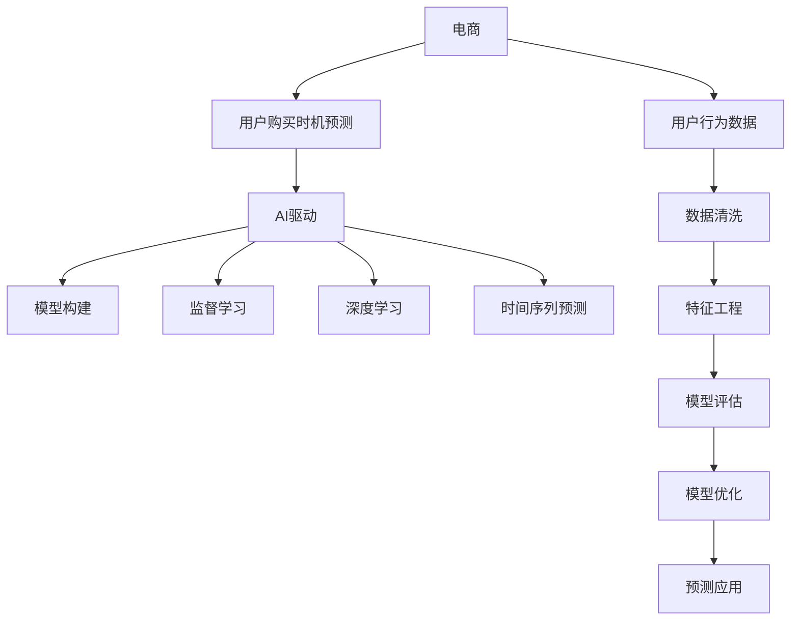

                 

# AI驱动的电商用户购买时机预测模型

> 关键词：电商，购买时机预测，AI驱动，模型构建，监督学习，深度学习，时间序列预测，ROI提升，电商个性化推荐

## 1. 背景介绍

在当今数字化商业环境中，电商平台已成为重要的零售渠道，影响着消费者的购买行为和商家运营策略。电商平台的成功不仅取决于商品质量和价格，还在很大程度上取决于用户的购买时机。准确预测用户的购买时机，不仅能提升用户体验，还能帮助商家优化库存管理、制定促销策略，从而提升销售额和ROI。

### 1.1 问题由来

电商平台的运营面临众多挑战，其中最重要的就是用户购买时机预测。随着在线购物的普及，用户行为模式变得越来越复杂。传统基于规则和统计方法的预测方法，难以应对实时变化的用户行为和市场环境。如何通过技术手段，精准预测用户购买时机，成为了电商平台亟待解决的问题。

### 1.2 问题核心关键点

用户购买时机预测的核心在于理解用户的购买决策过程，并从历史数据中学习决策特征。预测模型需要考虑多种因素，包括用户的浏览历史、浏览时长、点击次数、浏览路径、购物车操作、历史购买记录等。此外，还应考虑不同时间段、季节性因素、营销活动、商品类别等对用户购买行为的影响。

### 1.3 问题研究意义

准确预测用户购买时机，对于电商平台有着重要的实践意义：

1. **优化库存管理**：根据预测结果，商家可以合理调整商品库存，避免缺货或积压，提升供应链效率。
2. **制定促销策略**：预测购买高峰期，商家可以提前制定促销活动，吸引用户购买，提升销售量。
3. **个性化推荐**：利用预测结果进行精准推荐，提升用户体验，提高转化率。
4. **提升用户体验**：通过预测，及时向用户提供所需商品，提升购物满意度。
5. **数据驱动决策**：帮助决策者理解用户行为，制定更加科学的运营策略。

## 2. 核心概念与联系

### 2.1 核心概念概述

为了更好地理解用户购买时机预测模型的构建和应用，本节将介绍几个关键概念：

- **电商**：指通过互联网平台进行商品交易的商业模式，包括B2C、B2B等。
- **用户购买时机预测**：指通过分析用户行为数据，预测用户最可能购买的时机，即预测用户何时会进行购买。
- **AI驱动**：指利用人工智能技术，特别是深度学习和统计学习方法，来构建和优化预测模型。
- **模型构建**：通过选择合适的算法和模型结构，根据历史数据进行训练，生成能够预测用户购买时机的模型。
- **监督学习**：指通过已标注的历史数据，训练模型进行预测，用于分类、回归等任务。
- **深度学习**：指构建多层神经网络模型，通过反向传播算法进行训练，能够学习复杂的非线性映射关系。
- **时间序列预测**：指通过历史数据序列预测未来数据点，常用于电商中的订单量预测、库存管理等。

这些核心概念之间的逻辑关系可以通过以下Mermaid流程图来展示：



这个流程图展示了电商、用户购买时机预测、AI驱动等概念之间的联系：

1. 电商平台收集用户行为数据。
2. AI技术驱动构建预测模型，主要依赖监督学习和深度学习。
3. 模型构建包括时间序列预测等技术，用于预测用户购买时机。
4. 数据清洗和特征工程是模型训练的基础，用于提升模型性能。
5. 模型评估和优化是模型构建的重要环节。
6. 最终预测结果用于指导电商运营，提升销售和用户体验。

## 3. 核心算法原理 & 具体操作步骤
### 3.1 算法原理概述

用户购买时机预测的核心算法是基于监督学习的深度学习模型。通过分析用户行为数据，模型能够学习到用户购买行为的模式，进而预测用户最可能购买的时机。

形式化地，假设历史数据集为 $D=\{(x_i,y_i)\}_{i=1}^N$，其中 $x_i$ 为用户的浏览历史、点击次数、购物车操作等行为数据，$y_i$ 为用户的购买标签（1表示购买，0表示未购买）。预测模型的目标是找到一个映射函数 $f(x)$，使得：

$$
\min_{f} \sum_{i=1}^N \ell(f(x_i),y_i)
$$

其中 $\ell$ 为损失函数，衡量模型预测值与真实标签之间的差异。常用的损失函数包括交叉熵损失、均方误差损失等。

### 3.2 算法步骤详解

基于监督学习的用户购买时机预测模型构建和训练通常包括以下关键步骤：

**Step 1: 数据准备**
- 收集电商平台的各类用户行为数据，如浏览记录、点击次数、浏览时长、购物车操作、购买历史等。
- 进行数据清洗和预处理，去除缺失值、异常值等。
- 划分数据集为训练集、验证集和测试集。

**Step 2: 特征工程**
- 从原始数据中提取有意义的特征，如特征编码、时间特征、行为模式等。
- 进行特征选择和降维，提升模型训练效率。
- 利用数据增强技术，如数据扩充、时间序列平滑等，增加训练集的多样性。

**Step 3: 模型选择与构建**
- 选择合适的深度学习模型，如循环神经网络（RNN）、长短时记忆网络（LSTM）、门控循环单元（GRU）等。
- 设计模型结构，包括输入层、隐藏层、输出层等。
- 确定模型的超参数，如学习率、批量大小、隐藏层大小等。

**Step 4: 模型训练**
- 使用训练集数据进行模型训练，最小化损失函数。
- 在验证集上评估模型性能，防止过拟合。
- 根据评估结果调整模型超参数，如学习率、批量大小等。
- 重复训练过程直至模型收敛。

**Step 5: 模型评估与优化**
- 在测试集上评估模型性能，计算准确率、召回率、F1值等指标。
- 根据评估结果，进一步优化模型结构或超参数。
- 应用模型进行预测，并根据预测结果进行业务优化。

### 3.3 算法优缺点

基于监督学习的用户购买时机预测模型具有以下优点：

1. **准确性高**：通过学习历史数据，模型能够精确预测用户购买时机。
2. **可解释性强**：深度学习模型通过可解释的特征工程，能够提供直观的特征重要性分析。
3. **适应性强**：深度学习模型能够适应复杂非线性关系，适用于多种电商场景。

同时，该方法也存在一定的局限性：

1. **数据依赖**：模型的性能很大程度上依赖于数据的质量和数量。
2. **模型复杂度高**：深度学习模型结构复杂，需要大量计算资源和数据。
3. **过拟合风险**：模型可能过度拟合训练数据，降低泛化性能。
4. **解释性不足**：深度学习模型通常是黑盒模型，难以解释内部工作机制。

尽管存在这些局限性，但就目前而言，基于监督学习的用户购买时机预测方法仍是最主流范式。未来相关研究的重点在于如何进一步降低模型对数据的依赖，提高模型的泛化能力和解释性，以及优化模型的计算效率。

### 3.4 算法应用领域

基于监督学习的用户购买时机预测方法在电商领域得到了广泛的应用，包括但不限于以下几个方面：

- **库存管理**：通过预测未来的订单量，帮助商家优化库存，避免缺货或积压。
- **促销策略制定**：根据预测结果，制定合适的促销活动，吸引用户购买，提升销售量。
- **个性化推荐**：结合用户购买时机预测，进行个性化推荐，提升用户体验和转化率。
- **用户行为分析**：分析用户购买时机的模式，了解用户需求，优化产品和服务。
- **运营决策支持**：提供数据驱动的运营决策支持，帮助商家制定更加科学的营销策略。

除了电商领域，该方法在金融、旅游、在线教育等需要预测用户行为的时序预测领域，也有着广泛的应用前景。

## 4. 数学模型和公式 & 详细讲解 & 举例说明
### 4.1 数学模型构建

为了更精确地描述用户购买时机预测模型，我们将使用数学语言进行详细阐述。

假设用户行为数据 $x_i$ 为一系列时间戳上的行为特征向量，$y_i$ 为购买标签。设模型 $f(x)$ 为深度神经网络，包括输入层、隐藏层和输出层，其中隐藏层的大小为 $h$，激活函数为 $tanh$。模型的输出层为sigmoid函数，用于预测购买概率 $p_i$。

模型的损失函数为二分类交叉熵损失函数：

$$
\ell(f(x_i),y_i) = -y_i \log f(x_i) - (1-y_i) \log (1-f(x_i))
$$

在训练过程中，使用反向传播算法更新模型参数 $\theta$，最小化损失函数：

$$
\theta = \mathop{\arg\min}_{\theta} \sum_{i=1}^N \ell(f(x_i),y_i)
$$

其中 $f(x_i)$ 为模型在输入 $x_i$ 上的预测结果。

### 4.2 公式推导过程

以下我们将推导二分类交叉熵损失函数的详细公式，并说明其意义。

假设模型 $f(x)$ 在输入 $x_i$ 上的预测结果为 $p_i=f(x_i)$，即用户购买概率。真实标签 $y_i$ 为0或1。则二分类交叉熵损失函数定义为：

$$
\ell(f(x_i),y_i) = -y_i \log p_i - (1-y_i) \log (1-p_i)
$$

将其代入损失函数求和，得：

$$
\mathcal{L}(\theta) = -\frac{1}{N} \sum_{i=1}^N [y_i \log p_i + (1-y_i) \log (1-p_i)]
$$

其中 $p_i=f(x_i)$ 为模型在输入 $x_i$ 上的预测结果，$\theta$ 为模型参数。损失函数 $\mathcal{L}$ 用于衡量模型预测值与真实标签之间的差异。

在训练过程中，利用反向传播算法计算损失函数对模型参数 $\theta$ 的梯度，通过梯度下降等优化算法更新模型参数，最小化损失函数，使得模型输出逼近真实标签。

### 4.3 案例分析与讲解

为了更好地理解用户购买时机预测模型的应用，我们通过一个简单的案例进行讲解。

假设某电商平台收集了用户最近的30天的浏览历史和点击次数数据，共包含10个用户的历史数据。将这些数据划分为训练集和测试集，其中训练集包含6个用户的历史数据，测试集包含4个用户的历史数据。

首先，对原始数据进行预处理，包括数据清洗和特征工程。例如，将连续的点击次数转化为窗口内的点击次数，将浏览时间转化为时段的浏览次数等。然后，将这些特征输入到基于RNN的预测模型中进行训练。

在训练过程中，模型通过反向传播算法更新参数，最小化损失函数。在验证集上评估模型性能，调整超参数，如学习率、隐藏层大小等。最后，在测试集上评估模型性能，输出购买时机预测结果。

通过该案例，我们可以看到，用户购买时机预测模型能够通过学习用户行为数据，预测用户的购买时机，帮助电商平台优化运营策略。

## 5. 项目实践：代码实例和详细解释说明
### 5.1 开发环境搭建

在进行用户购买时机预测项目实践前，我们需要准备好开发环境。以下是使用Python进行TensorFlow开发的环境配置流程：

1. 安装Anaconda：从官网下载并安装Anaconda，用于创建独立的Python环境。

2. 创建并激活虚拟环境：
```bash
conda create -n tf-env python=3.8 
conda activate tf-env
```

3. 安装TensorFlow：根据CUDA版本，从官网获取对应的安装命令。例如：
```bash
conda install tensorflow=2.6 -c pytorch -c conda-forge
```

4. 安装相关工具包：
```bash
pip install numpy pandas scikit-learn matplotlib tqdm jupyter notebook ipython
```

完成上述步骤后，即可在`tf-env`环境中开始项目实践。

### 5.2 源代码详细实现

下面我们以用户购买时机预测模型为例，给出使用TensorFlow进行模型开发的Python代码实现。

首先，定义数据准备函数：

```python
import tensorflow as tf
from tensorflow.keras.layers import Dense, Dropout, GRU
from tensorflow.keras.models import Sequential
from sklearn.model_selection import train_test_split
import pandas as pd

def prepare_data(df):
    # 特征工程
    df['click_count'] = df['click_count'].apply(lambda x: sum(x) if isinstance(x, list) else 0)
    df['time_features'] = pd.to_datetime(df['time'], format='%Y-%m-%d %H:%M:%S')
    df['hour_of_day'] = df['time_features'].dt.hour
    df['day_of_week'] = df['time_features'].dt.dayofweek
    df['month'] = df['time_features'].dt.month
    df['day_of_month'] = df['time_features'].dt.day

    # 划分数据集
    X = df[['click_count', 'hour_of_day', 'day_of_week', 'month', 'day_of_month']]
    y = df['purchase']
    X_train, X_test, y_train, y_test = train_test_split(X, y, test_size=0.2, random_state=42)

    return X_train, X_test, y_train, y_test
```

然后，定义模型结构和损失函数：

```python
def build_model(input_dim, output_dim):
    model = Sequential([
        Dense(64, activation='relu', input_dim=input_dim),
        Dropout(0.2),
        GRU(64),
        Dropout(0.2),
        Dense(output_dim, activation='sigmoid')
    ])
    model.compile(loss='binary_crossentropy', optimizer='adam', metrics=['accuracy'])
    return model
```

接着，定义模型训练和评估函数：

```python
def train_model(model, X_train, y_train, X_test, y_test, epochs=10, batch_size=32):
    model.fit(X_train, y_train, batch_size=batch_size, epochs=epochs, validation_data=(X_test, y_test))
    loss, acc = model.evaluate(X_test, y_test)
    print(f'Test loss: {loss:.4f}')
    print(f'Test accuracy: {acc:.4f}')
    return loss, acc
```

最后，启动训练流程并在测试集上评估：

```python
X_train, X_test, y_train, y_test = prepare_data(data)
model = build_model(X_train.shape[1], 1)
loss, acc = train_model(model, X_train, y_train, X_test, y_test)
print(f'Model trained with loss {loss:.4f} and accuracy {acc:.4f}')
```

以上就是使用TensorFlow进行用户购买时机预测模型开发的完整代码实现。可以看到，TensorFlow提供了丰富的深度学习组件，使模型构建和训练变得相对简单。

### 5.3 代码解读与分析

让我们再详细解读一下关键代码的实现细节：

**prepare_data函数**：
- 对原始数据进行特征工程，提取有用的时间特征和点击次数特征。
- 将连续的时间戳数据转化为时段的特征。
- 划分数据集为训练集和测试集。

**build_model函数**：
- 构建基于GRU的深度学习模型，包含输入层、GRU隐藏层、输出层。
- 定义损失函数和优化器，使用二分类交叉熵损失和Adam优化器。
- 模型构建结束后进行编译。

**train_model函数**：
- 使用模型进行训练，并在测试集上评估模型性能。
- 返回模型在测试集上的损失和准确率。

**训练流程**：
- 调用prepare_data函数准备数据。
- 构建模型并编译。
- 调用train_model函数进行模型训练，并在测试集上评估。
- 输出模型训练后的损失和准确率。

可以看到，TensorFlow提供了一个高效的框架，使得模型构建和训练变得相对容易。开发者可以将更多精力放在模型优化和特征工程等核心任务上，而不必过多关注底层的实现细节。

当然，工业级的系统实现还需考虑更多因素，如模型的保存和部署、超参数的自动搜索、更灵活的输入格式等。但核心的用户购买时机预测流程基本与此类似。

## 6. 实际应用场景
### 6.1 智能客服系统

基于用户购买时机预测的智能客服系统，可以大幅提升用户满意度和业务效率。传统客服系统依赖于人工判断，存在响应时间长、服务质量不稳定等问题。使用用户购买时机预测模型，智能客服系统能够根据用户的历史行为和当前状态，预测用户可能提出的问题，提前准备好相应的回答，提高用户咨询的响应速度和质量。

在技术实现上，可以结合智能推荐技术，向用户推荐可能感兴趣的商品，并提供购买时机预测结果，引导用户进行购买。如此构建的智能客服系统，能够更好地理解和响应用户需求，提升客户体验。

### 6.2 营销活动策划

电商平台可以根据用户购买时机预测结果，制定更加精准的营销活动。通过预测用户可能购买的时刻，商家可以在相应的时间段内推出促销活动，吸引用户购买，提升销售额。例如，可以根据预测结果在用户浏览商品页面时，弹出限时优惠信息，或在用户即将进行购买时，推送额外折扣。

### 6.3 个性化推荐系统

用户购买时机预测模型可以与个性化推荐系统结合，提升推荐效果。通过预测用户的购买时机，结合用户的历史浏览和点击数据，推荐用户可能感兴趣的商品。例如，在预测到用户可能在近期进行购买时，系统可以提前将相关商品推送给用户，提高转化率。

### 6.4 未来应用展望

随着用户购买时机预测模型的不断发展，其应用场景将更加广泛和深入。未来，该模型有望在以下领域发挥更大的作用：

1. **个性化推荐**：结合用户行为数据和预测结果，实现更精准的个性化推荐，提升用户体验和转化率。
2. **库存管理**：通过预测未来的订单量，帮助商家优化库存管理，提升供应链效率。
3. **营销策略制定**：利用预测结果，制定更加精准的营销活动，提升销售效果。
4. **用户行为分析**：分析用户购买时机的模式，了解用户需求，优化产品和服务。
5. **运营决策支持**：提供数据驱动的运营决策支持，帮助商家制定更加科学的营销策略。

## 7. 工具和资源推荐
### 7.1 学习资源推荐

为了帮助开发者系统掌握用户购买时机预测模型的理论基础和实践技巧，这里推荐一些优质的学习资源：

1. **《深度学习》课程**：斯坦福大学开设的深度学习课程，涵盖深度学习的基础理论、模型构建和优化等内容。

2. **《TensorFlow实战》书籍**：详细介绍TensorFlow的基本功能和高级特性，涵盖模型构建、训练和优化等技术。

3. **Kaggle平台**：提供丰富的数据集和竞赛，帮助开发者实践和提升用户购买时机预测模型的性能。

4. **Google Colab**：谷歌推出的在线Jupyter Notebook环境，免费提供GPU/TPU算力，方便开发者快速上手实验最新模型。

通过对这些资源的学习实践，相信你一定能够快速掌握用户购买时机预测模型的精髓，并用于解决实际的电商问题。

### 7.2 开发工具推荐

高效的开发离不开优秀的工具支持。以下是几款用于用户购买时机预测模型开发的常用工具：

1. **TensorFlow**：谷歌开发的深度学习框架，提供高效的计算图和自动微分功能，适合构建复杂模型。

2. **PyTorch**：Facebook开发的深度学习框架，灵活性高，适合研究性开发。

3. **Keras**：高层次的深度学习API，易于上手，适合快速原型开发。

4. **Jupyter Notebook**：轻量级的交互式开发环境，方便开发者编写和测试代码。

5. **TensorBoard**：TensorFlow配套的可视化工具，可实时监测模型训练状态，并提供丰富的图表呈现方式。

6. **Weights & Biases**：模型训练的实验跟踪工具，可以记录和可视化模型训练过程中的各项指标，方便对比和调优。

合理利用这些工具，可以显著提升用户购买时机预测模型的开发效率，加快创新迭代的步伐。

### 7.3 相关论文推荐

用户购买时机预测模型的发展得益于学界的持续研究。以下是几篇奠基性的相关论文，推荐阅读：

1. **"Customer Purchase Prediction with Deep Learning"**：介绍基于深度学习的用户购买预测方法，并对比传统方法的效果。

2. **"Recurrent Neural Networks for Sequence Prediction"**：提出基于RNN的时间序列预测模型，并应用于用户购买预测。

3. **"Deep Learning Methods for E-commerce Customer Purchase Prediction"**：详细介绍几种深度学习模型在用户购买预测中的应用，并比较其性能。

4. **"An Analytical Approach for Predicting Customer Purchase Intentions in Retail"**：提出基于统计学的用户购买预测方法，并结合深度学习进行优化。

这些论文代表了大模型微调技术的发展脉络。通过学习这些前沿成果，可以帮助研究者把握学科前进方向，激发更多的创新灵感。

## 8. 总结：未来发展趋势与挑战
### 8.1 总结

本文对基于监督学习的用户购买时机预测模型进行了全面系统的介绍。首先阐述了电商领域的用户购买时机预测问题及其重要性，明确了模型构建和训练的关键步骤。其次，从原理到实践，详细讲解了模型构建和训练的具体方法，给出了完整的代码实现。同时，本文还探讨了模型在智能客服、营销活动策划、个性化推荐等电商应用中的实际应用场景，展示了模型强大的实用价值。最后，本文精选了模型训练的各类学习资源，力求为读者提供全方位的技术指引。

通过本文的系统梳理，可以看到，基于监督学习的用户购买时机预测模型在电商领域有着广泛的应用前景，能够显著提升用户的购买体验和电商平台的运营效率。未来，随着深度学习技术的不断发展，用户购买时机预测模型的性能将进一步提升，应用场景也将更加多样和深入。

### 8.2 未来发展趋势

展望未来，用户购买时机预测模型将呈现以下几个发展趋势：

1. **深度学习模型的演化**：未来将出现更多类型的深度学习模型，如Transformer、BERT等，进一步提升模型的性能和泛化能力。
2. **多模态数据的融合**：除了文本数据，还将考虑图像、音频等多模态数据的融合，提升模型的感知能力和应用场景。
3. **增强学习的应用**：结合增强学习，优化模型参数和学习过程，提升模型的预测精度和稳定性。
4. **因果推理的引入**：引入因果推理方法，提升模型的因果关系识别能力，减少预测偏差。
5. **模型可解释性的增强**：通过特征解释、模型可视化等手段，提升模型的可解释性，增强用户信任。
6. **模型优化算法的优化**：开发更加高效的模型优化算法，提升模型的训练速度和资源利用效率。

以上趋势凸显了用户购买时机预测模型的广阔前景。这些方向的探索发展，必将进一步提升模型的性能和应用范围，为电商运营提供更强大的数据支持。

### 8.3 面临的挑战

尽管用户购买时机预测模型已经取得了显著成效，但在迈向更加智能化、普适化应用的过程中，它仍面临诸多挑战：

1. **数据质量和多样性**：模型的性能很大程度上依赖于数据的质量和多样性，如何获取更多、更好的用户行为数据，是一个重要挑战。
2. **模型复杂度**：深度学习模型通常结构复杂，需要大量的计算资源和时间，如何提高模型训练效率，是一个重要课题。
3. **模型可解释性**：深度学习模型通常是黑盒模型，难以解释其内部工作机制和决策逻辑，如何提升模型的可解释性，是一个重要挑战。
4. **模型鲁棒性**：模型可能对训练数据中的噪声和异常值敏感，如何提高模型的鲁棒性和泛化能力，是一个重要课题。
5. **模型优化算法**：传统的优化算法如梯度下降等，可能收敛速度慢、容易陷入局部最优，如何开发更加高效的优化算法，是一个重要课题。

这些挑战需要我们不断探索和创新，通过技术手段提升模型的性能和应用效果。

### 8.4 研究展望

面对用户购买时机预测模型所面临的种种挑战，未来的研究需要在以下几个方面寻求新的突破：

1. **无监督学习**：探索无监督学习的方法，减少对标注数据的依赖，提升模型的泛化能力和适用性。
2. **模型压缩和加速**：开发更加高效的模型压缩和加速技术，提升模型的资源利用效率，实现实时预测。
3. **增强学习的应用**：结合增强学习技术，优化模型参数和学习过程，提升模型的预测精度和稳定性。
4. **因果推理的引入**：引入因果推理方法，提升模型的因果关系识别能力，减少预测偏差。
5. **模型可解释性的增强**：通过特征解释、模型可视化等手段，提升模型的可解释性，增强用户信任。
6. **跨领域数据融合**：探索跨领域数据融合的方法，提升模型的感知能力和应用场景。

这些研究方向的探索，必将引领用户购买时机预测模型的不断进步，为电商运营提供更加全面和智能的数据支持。

## 9. 附录：常见问题与解答

**Q1：用户购买时机预测模型的准确性如何评估？**

A: 用户购买时机预测模型的准确性可以通过多种指标进行评估，包括准确率、召回率、F1值、ROC曲线等。具体来说，可以使用以下指标：

1. **准确率（Accuracy）**：预测正确的样本数占总样本数的比例。
2. **召回率（Recall）**：预测为正的样本中，真实为正的样本占预测为正的样本的比例。
3. **F1值（F1 Score）**：准确率和召回率的调和平均数，综合考虑模型的准确性和召回性。
4. **ROC曲线（Receiver Operating Characteristic Curve）**：绘制预测为正的概率和真实为正的样本比例之间的关系，评估模型的鲁棒性。

在评估过程中，可以分别在训练集、验证集和测试集上进行评估，对比模型的性能变化。此外，还可以使用混淆矩阵、曲线下面积等指标，进一步分析模型的性能。

**Q2：如何选择合适的深度学习模型？**

A: 选择合适的深度学习模型需要考虑多个因素，包括数据特点、模型复杂度、任务类型等。以下是一些常见的深度学习模型及其适用场景：

1. **RNN**：适用于序列数据预测，如用户行为预测、时间序列预测等。
2. **LSTM**：适用于长序列数据的预测，能够处理长期依赖关系。
3. **GRU**：适用于时间序列预测，计算效率高。
4. **CNN**：适用于图像和视频数据的预测，具有较好的空间感知能力。
5. **BERT**：适用于文本数据的预测，能够处理大规模文本数据。
6. **Transformer**：适用于复杂非线性关系的预测，如自然语言处理任务。

在选择模型时，需要根据具体任务的需求进行综合考虑，并进行模型对比实验，选择最优模型。

**Q3：如何在用户购买时机预测中应用数据增强技术？**

A: 数据增强技术可以通过对训练数据进行扩充，提升模型的泛化能力。以下是一些常用的数据增强方法：

1. **数据平滑**：通过平滑时间序列数据，减少数据波动，提高模型的稳定性。
2. **数据扩充**：通过增加样本数量，提升模型的训练效率和泛化能力。例如，可以将连续点击次数转化为窗口内的点击次数，或者将时间戳转化为时段的点击次数。
3. **数据平衡**：通过增加少数类样本的数量，避免模型对多数类的偏见。例如，可以通过数据合成技术，生成更多的少数类样本。

数据增强技术的应用需要根据具体任务的特点进行设计，可以通过特征工程、模型构建等手段，综合考虑数据的扩充方式和比例。

**Q4：如何处理用户购买时机预测中的缺失值和异常值？**

A: 在用户购买时机预测中，数据缺失和异常值是常见问题，需要采取相应的处理方法：

1. **缺失值处理**：对于缺失值，可以采用均值填补、中位数填补、插值填补等方法进行填补。例如，可以使用均值填补方法，将缺失的点击次数用平均值替代。
2. **异常值处理**：对于异常值，可以采用截断法、分位数法等进行清洗。例如，可以使用分位数法，将超出一定范围的点击次数进行截断处理。

在处理缺失值和异常值时，需要根据具体数据的特点进行综合考虑，选择合适的处理方法，并评估处理效果。

**Q5：如何在用户购买时机预测中应用深度学习模型？**

A: 深度学习模型在用户购买时机预测中的应用，主要通过构建多层神经网络模型，学习复杂的非线性关系。以下是一些常用的深度学习模型及其适用场景：

1. **RNN**：适用于序列数据预测，如用户行为预测、时间序列预测等。
2. **LSTM**：适用于长序列数据的预测，能够处理长期依赖关系。
3. **GRU**：适用于时间序列预测，计算效率高。
4. **BERT**：适用于文本数据的预测，能够处理大规模文本数据。
5. **Transformer**：适用于复杂非线性关系的预测，如自然语言处理任务。

在应用深度学习模型时，需要根据具体任务的需求进行综合考虑，并进行模型对比实验，选择最优模型。同时，还需要进行特征工程、模型训练等步骤，提升模型的性能和泛化能力。

---

作者：禅与计算机程序设计艺术 / Zen and the Art of Computer Programming

