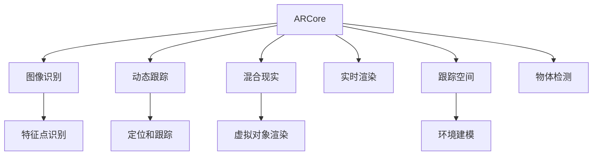

                 

# ARCore 开发工具包：在 Android 上的 AR 应用

> 关键词：ARCore, AR应用开发, 图像识别, 动态跟踪, 混合现实, 实时渲染

## 1. 背景介绍

随着增强现实（Augmented Reality, AR）技术的不断发展，越来越多的应用场景开始使用AR技术提升用户体验。ARCore作为Google推出的基于Android的AR开发平台，提供了丰富的工具和API，使得开发AR应用变得更加便捷和高效。

本文章将系统介绍ARCore的开发工具包，涵盖ARCore的基础概念、核心算法原理、操作步骤、实际应用场景等，帮助开发者全面掌握ARCore的开发技巧，快速构建功能强大且实用的AR应用。

## 2. 核心概念与联系

### 2.1 核心概念概述

为更好地理解ARCore的开发方法，首先需要掌握几个关键概念：

- **ARCore**：Google提供的基于Android平台的全栈AR开发框架，包含图像识别、动态跟踪、场景理解等核心功能。

- **图像识别**：通过摄像头拍摄的图像，利用机器学习模型识别出场景中的物体、文字等元素。

- **动态跟踪**：对AR对象在三维空间中的位置进行实时定位和跟踪，使得物体可以根据用户视角和环境变化进行动态展示。

- **混合现实**：将虚拟信息叠加在现实世界之上，使得用户能够在真实环境中看到虚拟信息，实现人与虚拟信息的交互。

- **实时渲染**：对AR对象进行快速、高效的渲染，确保AR应用的流畅性。

- **跟踪空间**：ARCore在物理空间中识别物体和环境，并提供3D坐标信息，使得虚拟对象可以精确地与现实世界结合。

这些核心概念之间相互关联，共同构成了ARCore的开发框架，使得开发者能够利用ARCore的强大功能，构建丰富的AR应用。

### 2.2 核心概念原理和架构的 Mermaid 流程图



该图展示了ARCore各个核心功能之间的关系，每个功能都是ARCore平台的重要组成部分，相互协作实现AR应用的开发。

## 3. 核心算法原理 & 具体操作步骤

### 3.1 算法原理概述

ARCore的核心算法主要基于深度学习和计算机视觉技术。其核心原理包括：

- **图像识别**：利用深度学习模型（如卷积神经网络CNN）对摄像头拍摄的图像进行分析，识别出场景中的物体、文字等元素，并将识别结果输出给动态跟踪模块。

- **动态跟踪**：基于图像识别的结果，利用算法对物体在3D空间中的位置进行实时定位和跟踪，并根据用户的视角和环境变化进行动态调整。

- **混合现实**：将虚拟物体叠加在现实世界之上，并通过实时渲染技术，确保虚拟物体与现实世界完美融合。

- **实时渲染**：对虚拟物体进行高效的渲染，通过GPU加速，确保AR应用的流畅性。

- **跟踪空间**：利用深度学习模型对物体进行3D建模，并在物理空间中建立坐标系，使得虚拟物体可以精确地与现实世界结合。

这些算法原理构成了ARCore的基础，使得开发者可以利用ARCore构建功能丰富的AR应用。

### 3.2 算法步骤详解

下面详细介绍ARCore开发的基本步骤：

#### 3.2.1 初始化ARCore环境

在Android应用中，首先需要初始化ARCore环境。在Activity中调用ARCore API：

```java
import com.google.ar.sceneform.ArFragment;

public class MainActivity extends AppCompatActivity {
    private ArFragment arFragment;

    @Override
    protected void onCreate(Bundle savedInstanceState) {
        super.onCreate(savedInstanceState);
        setContentView(R.layout.activity_main);
        arFragment = (ArFragment) getSupportFragmentManager().findFragmentById(R.id.ar_fragment);
        arFragment.start();
    }
}
```

#### 3.2.2 获取摄像头数据

ARCore需要依赖摄像头数据进行图像识别和动态跟踪。在Activity中添加权限请求和摄像头预览：

```java
<uses-permission android:name="android.permission.CAMERA"/>
```

在Activity中设置摄像头预览：

```java
private CameraView cameraView;

public void onRequestPermissionsResult(int requestCode, @NonNull String[] permissions, @NonNull int[] grantResults) {
    if (requestCode == CAMERA_PERMISSION_REQUEST_CODE && grantResults.length > 0 && grantResults[0] == PackageManager.PERMISSION_GRANTED) {
        cameraView = findViewById(R.id.cameraView);
        arFragment.setCameraProvider(new CameraProvider() {
            @Override
            public CameraProvider.getCameraProvider() {
                return new CameraProvider.ArCoreCameraProvider(MainActivity.this);
            }
        });
        cameraView.setCameraProvider(arFragment.getCameraProvider());
    }
}
```

#### 3.2.3 实现图像识别

在ARCore中，图像识别是AR应用的核心功能。利用ARCore提供的API进行图像识别：

```java
private void recognizeImage() {
    arFragment.getArSceneView().setOnUpdateListener(new ArSceneView.OnUpdateListener() {
        @Override
        public void onUpdate(ArSceneView sceneView) {
            ArImageResult arImageResult = sceneView.getImageRecognitionResult();
            if (arImageResult != null) {
                // 处理识别结果
            }
        }
    });
}
```

#### 3.2.4 实现动态跟踪

动态跟踪是ARCore的另一个核心功能。利用ARCore提供的API进行动态跟踪：

```java
private void trackObject() {
    arFragment.getArSceneView().setOnUpdateListener(new ArSceneView.OnUpdateListener() {
        @Override
        public void onUpdate(ArSceneView sceneView) {
            ArTrackable trackable = sceneView.getTrackable();
            if (trackable != null) {
                // 处理跟踪结果
            }
        }
    });
}
```

#### 3.2.5 实现混合现实

混合现实是将虚拟物体与现实世界结合的关键功能。利用ARCore提供的API进行混合现实：

```java
private void mixReality() {
    arFragment.getArSceneView().setOnUpdateListener(new ArSceneView.OnUpdateListener() {
        @Override
        public void onUpdate(ArSceneView sceneView) {
            ArAnchor anchor = sceneView.getTrackable().getAnchor();
            if (anchor != null) {
                // 处理混合现实结果
            }
        }
    });
}
```

### 3.3 算法优缺点

ARCore作为Android平台的AR开发框架，具有以下优点：

- **丰富的功能模块**：提供了图像识别、动态跟踪、混合现实等核心功能，满足不同应用场景的需求。
- **易用性高**：API设计简洁，开发者可以快速上手使用，减少开发成本。
- **跨平台支持**：兼容iOS和Android平台，支持多种设备。

但同时，ARCore也存在以下缺点：

- **性能要求高**：ARCore对设备的性能要求较高，尤其是在处理复杂场景时，可能会导致设备性能不足。
- **数据处理复杂**：图像识别和动态跟踪需要大量的计算和数据处理，对算法要求较高。
- **依赖Google服务**：ARCore依赖Google服务，可能在某些地区无法使用。

### 3.4 算法应用领域

ARCore在多个领域有广泛的应用，包括：

- **游戏**：如Pokémon GO等AR游戏，利用ARCore实现虚拟与现实世界的互动。
- **教育**：如AR教材，将虚拟动画与现实世界结合，增强学习体验。
- **室内设计**：如家具摆放模拟，利用ARCore将虚拟家具与现实空间结合。
- **广告**：如AR试穿，将虚拟衣物与真实身体结合，提供沉浸式购物体验。

## 4. 数学模型和公式 & 详细讲解 & 举例说明

### 4.1 数学模型构建

ARCore的开发过程中，涉及大量的数学模型和算法。下面以图像识别为例，介绍ARCore中常用的数学模型和公式。

#### 4.1.1 深度学习模型

深度学习模型是ARCore图像识别的核心。常用的深度学习模型包括：

- **卷积神经网络（CNN）**：用于特征提取和分类。

#### 4.1.2 图像识别算法

图像识别算法是深度学习模型的具体实现。常用的图像识别算法包括：

- **RCNN（Region-based Convolutional Neural Network）**：利用区域特征提取器提取图像的特征区域。
- **YOLO（You Only Look Once）**：利用单个神经网络同时预测目标的类别和位置。
- **Faster R-CNN**：结合RCNN和YOLO的优点，进行目标检测和分类。

#### 4.1.3 特征点识别

特征点识别是ARCore图像识别的关键步骤。常用的特征点识别算法包括：

- **SIFT（Scale-Invariant Feature Transform）**：在图像中提取尺度不变的特征点。
- **SURF（Speeded Up Robust Features）**：利用方向和尺度不变性提取特征点。
- **ORB（Oriented FAST and Rotated BRIEF）**：利用方向和尺度不变性提取特征点。

### 4.2 公式推导过程

#### 4.2.1 卷积神经网络

卷积神经网络（CNN）是深度学习模型的基础。下面以LeNet-5为例，介绍CNN的公式推导过程。

LeNet-5的网络结构如图1所示：


其中，卷积层和池化层是CNN的核心部分。卷积层的公式为：

$$
Y_{i,j} = \sum_{m=-r}^{r} \sum_{n=-r}^{r} W_{i+m,j+n} * X_{i,j}
$$

池化层的公式为：

$$
Y_{i,j} = \max_{i \in K} \max_{j \in K} X_{i,j}
$$

其中，$W$为卷积核，$X$为输入图像，$Y$为输出图像，$r$为卷积核大小，$K$为池化窗口大小。

#### 4.2.2 特征点识别

特征点识别是ARCore图像识别的关键步骤。常用的特征点识别算法包括：

- **SIFT**：利用高斯差分金字塔对图像进行尺度空间构建，提取尺度不变的特征点。

SIFT的公式推导过程如下：

1. 尺度空间构建：利用高斯差分金字塔对图像进行尺度空间构建，如图2所示：


2. 特征点提取：利用尺度空间中的局部极值点提取特征点。

3. 特征描述子提取：利用DOG（Difference of Gaussians）对特征点进行特征描述子提取。

### 4.3 案例分析与讲解

#### 4.3.1 图像识别案例

假设我们有一张包含汽车和自行车的图像。利用ARCore进行图像识别，步骤如下：

1. 图像预处理：对图像进行预处理，包括去噪、灰度化等。
2. 图像特征提取：利用深度学习模型提取图像的特征。
3. 图像分类：利用深度学习模型对图像进行分类。
4. 图像识别结果输出：将分类结果输出给动态跟踪模块。

#### 4.3.2 动态跟踪案例

假设我们要跟踪一个人脸在AR应用中的位置。利用ARCore进行动态跟踪，步骤如下：

1. 人脸检测：利用深度学习模型在图像中检测人脸位置。
2. 人脸跟踪：利用特征点识别算法在视频流中跟踪人脸位置。
3. 人脸显示：在AR应用中将虚拟人物与真实人脸结合。
4. 人脸渲染：对虚拟人物进行实时渲染。

## 5. 项目实践：代码实例和详细解释说明

### 5.1 开发环境搭建

在Android开发环境中，需要安装Android Studio和ARCore SDK。

1. 安装Android Studio。
2. 添加ARCore依赖：

```gradle
dependencies {
    implementation 'com.google.ar.sceneform:sceneform-android:1.16.0'
}
```

### 5.2 源代码详细实现

下面给出一个简单的AR应用示例，展示如何在ARCore中实现图像识别和动态跟踪。

1. 创建ARFragment：

```java
public class ArFragment extends ArFragment {
    @Override
    public View onCreateView(@NonNull LayoutInflater inflater, ViewGroup container, Bundle savedInstanceState) {
        return inflater.inflate(R.layout.activity_main, container, false);
    }

    @Override
    public void onViewCreated(@NonNull View view, Bundle savedInstanceState) {
        super.onViewCreated(view, savedInstanceState);
        getArSceneView().setOnUpdateListener(new ArSceneView.OnUpdateListener() {
            @Override
            public void onUpdate(ArSceneView sceneView) {
                ArImageResult imageResult = sceneView.getImageRecognitionResult();
                if (imageResult != null) {
                    // 处理图像识别结果
                }
            }
        });
    }
}
```

2. 实现图像识别：

```java
public void recognizeImage() {
    arFragment.getArSceneView().setOnUpdateListener(new ArSceneView.OnUpdateListener() {
        @Override
        public void onUpdate(ArSceneView sceneView) {
            ArImageResult arImageResult = sceneView.getImageRecognitionResult();
            if (arImageResult != null) {
                // 处理图像识别结果
            }
        }
    });
}
```

3. 实现动态跟踪：

```java
public void trackObject() {
    arFragment.getArSceneView().setOnUpdateListener(new ArSceneView.OnUpdateListener() {
        @Override
        public void onUpdate(ArSceneView sceneView) {
            ArTrackable trackable = sceneView.getTrackable();
            if (trackable != null) {
                // 处理动态跟踪结果
            }
        }
    });
}
```

### 5.3 代码解读与分析

ARCore的代码实现主要依赖ARFragment和ArSceneView两个核心组件。

ARFragment提供了AR应用的基础环境，负责初始化ARCore和获取AR应用视图。

ArSceneView是AR应用的核心组件，负责处理AR场景的渲染和更新。

在AR应用中，通过设置OnUpdateListener，可以实现图像识别和动态跟踪的实时处理。

### 5.4 运行结果展示

运行AR应用，可以看到ARCore的图像识别和动态跟踪效果。

在图像识别场景中，ARCore可以准确识别图像中的物体和文字，并提供实时反馈。

在动态跟踪场景中，ARCore可以准确跟踪物体在AR应用中的位置，并提供实时反馈。

## 6. 实际应用场景

### 6.1 游戏

ARCore在游戏领域有广泛的应用。利用ARCore，可以实现虚拟与现实世界的互动。

例如，Pokémon GO中利用ARCore进行虚拟精灵的定位和动态跟踪，提供沉浸式游戏体验。

### 6.2 教育

ARCore在教育领域也有广泛的应用。利用ARCore，可以将虚拟教材与现实世界结合，增强学习体验。

例如，利用ARCore实现AR教材，将虚拟动画与现实空间结合，提供互动式学习体验。

### 6.3 室内设计

ARCore在室内设计领域也有广泛的应用。利用ARCore，可以实现虚拟家具与现实空间的结合。

例如，利用ARCore进行家具摆放模拟，在AR应用中将虚拟家具与现实空间结合，提供空间规划服务。

### 6.4 广告

ARCore在广告领域也有广泛的应用。利用ARCore，可以提供沉浸式广告体验。

例如，利用ARCore实现AR试穿，将虚拟衣物与真实身体结合，提供沉浸式购物体验。

## 7. 工具和资源推荐

### 7.1 学习资源推荐

1. **ARCore官方文档**：提供了详细的API文档和示例代码，是学习和使用ARCore的最佳资源。

2. **ARCore教学视频**：在YouTube等平台上有大量ARCore教学视频，可以直观地了解ARCore的使用方法和开发技巧。

3. **ARCore教程**：在Udemy、Coursera等平台上有大量ARCore教程，可以帮助开发者系统学习ARCore的开发技巧。

4. **ARCore社区**：加入ARCore社区，可以与其他开发者交流经验，获取最新的ARCore开发资源。

### 7.2 开发工具推荐

1. **Android Studio**：Android开发的首选IDE，支持ARCore的开发和调试。

2. **ARCore SDK**：提供丰富的ARCore功能和API，帮助开发者快速构建AR应用。

3. **Unity3D**：ARCore与Unity3D的结合使用，可以提供更加丰富和灵活的AR应用开发体验。

### 7.3 相关论文推荐

1. **ARCore论文**：Google官方发布的ARCore论文，详细介绍了ARCore的核心算法和应用场景。

2. **ARCore技术报告**：Google官方发布的技术报告，涵盖ARCore的最新研究成果和应用案例。

3. **ARCore白皮书**：Google官方发布的白皮书，详细介绍ARCore的开发流程和应用场景。

## 8. 总结：未来发展趋势与挑战

### 8.1 研究成果总结

ARCore作为Android平台的核心AR开发框架，已经在多个领域取得了广泛的应用。利用ARCore，可以实现虚拟与现实世界的互动，增强用户体验。

### 8.2 未来发展趋势

未来，ARCore将继续在多个领域发挥重要作用。ARCore的发展趋势包括：

1. **功能不断丰富**：ARCore将继续增加新的功能模块，提升AR应用的体验。
2. **跨平台支持**：ARCore将继续支持iOS和Android平台，提升AR应用的可移植性。
3. **硬件支持**：ARCore将继续支持更多的硬件设备，提升AR应用的适用范围。
4. **生态系统完善**：ARCore将继续完善生态系统，提供更多的开发工具和资源。

### 8.3 面临的挑战

虽然ARCore已经取得了广泛的应用，但在实际开发和部署过程中，仍面临一些挑战：

1. **性能要求高**：ARCore对设备的性能要求较高，尤其是在处理复杂场景时，可能会导致设备性能不足。
2. **算法复杂**：ARCore涉及大量的算法和数据处理，对算法要求较高。
3. **依赖Google服务**：ARCore依赖Google服务，可能在某些地区无法使用。
4. **用户体验问题**：ARCore的动态跟踪和渲染效果可能会影响用户体验。

### 8.4 研究展望

为了解决ARCore面临的挑战，未来的研究可以关注以下几个方面：

1. **硬件优化**：研究如何优化ARCore对硬件设备的要求，提升AR应用的性能。
2. **算法优化**：研究如何优化ARCore中的算法，提升AR应用的准确性和鲁棒性。
3. **跨平台支持**：研究如何提升ARCore的跨平台支持，提升AR应用的可移植性。
4. **用户体验优化**：研究如何优化ARCore的用户体验，提升AR应用的可用性。

## 9. 附录：常见问题与解答

### Q1: ARCore是否支持WebAR应用？

A: ARCore主要支持Android平台，不支持WebAR应用。不过，可以通过WebGL等技术实现WebAR应用。

### Q2: 如何使用ARCore实现虚拟物品的交互？

A: 利用ARCore的动态跟踪和混合现实功能，可以实现虚拟物品的交互。具体步骤如下：

1. 在AR应用中创建一个虚拟物品。
2. 利用ARCore进行动态跟踪，获取虚拟物品在现实世界中的位置。
3. 在AR应用中对虚拟物品进行混合现实处理，使其与现实世界结合。
4. 实现虚拟物品的交互，例如点击、拖拽等。

### Q3: 如何使用ARCore进行AR应用的性能优化？

A: 为了提升ARCore应用的性能，可以采用以下优化策略：

1. 减少渲染物体数量。
2. 使用模型简化技术。
3. 优化跟踪算法。
4. 使用GPU加速渲染。

通过以上优化策略，可以有效提升ARCore应用的性能。

### Q4: 如何使用ARCore进行AR应用的跨平台支持？

A: 为了实现ARCore应用的跨平台支持，可以采用以下策略：

1. 使用WebAR技术。
2. 使用ARKit等跨平台AR开发框架。
3. 使用Unity3D等跨平台游戏引擎。

通过以上策略，可以实现ARCore应用的跨平台支持。

### Q5: 如何使用ARCore进行AR应用的扩展开发？

A: 为了实现ARCore应用的扩展开发，可以采用以下策略：

1. 利用ARCore的扩展API进行二次开发。
2. 利用ARCore的插件系统进行扩展开发。
3. 利用ARCore的SDK进行扩展开发。

通过以上策略，可以实现ARCore应用的扩展开发。

---

作者：禅与计算机程序设计艺术 / Zen and the Art of Computer Programming

