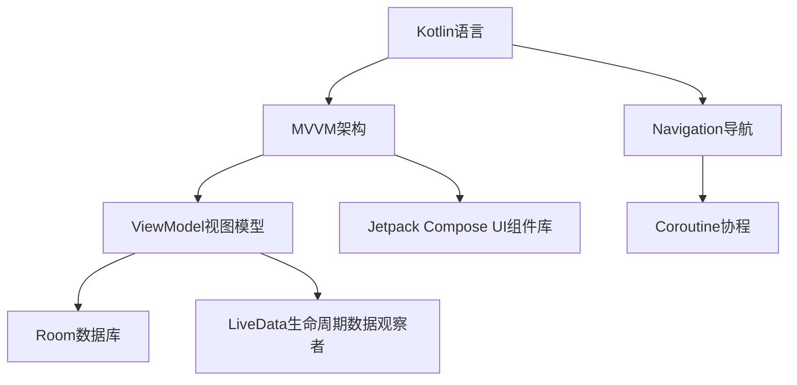

                 

# Android Jetpack 组件：提升 Android 开发效率

> 关键词：Android Jetpack, Kotlin, MVVM, Navigation, ViewModel, Coroutine, Room, LiveData, Jetpack Compose

## 1. 背景介绍

### 1.1 问题由来

随着移动设备的普及和移动互联网应用的日益丰富，Android平台成为了全球最大的移动操作系统，其应用市场规模已超过App Store。然而，Android应用的开发难度和复杂性也不断增加。传统的Android开发方式需要手动处理权限请求、内存管理、生命周期管理等复杂任务，开发效率低下，代码冗余度高，可维护性差。为了应对这些挑战，Google推出了Android Jetpack组件，集合了多种现代开发技术，旨在提升Android应用开发效率，降低开发门槛，提升应用性能和稳定性。

## 2. 核心概念与联系

### 2.1 核心概念概述

Android Jetpack是Google推出的一系列现代化的开发组件，包括Kotlin语言、MVVM架构、Navigation导航、ViewModel视图模型、Coroutine协程、Room数据库、LiveData生命周期数据观察者、Jetpack Compose UI组件库等。这些组件相互配合，构成了一套现代化的开发框架，极大地简化了Android应用的开发过程，提升了开发效率。

1. **Kotlin语言**：Kotlin是一门现代化的编程语言，语法简洁、类型安全，具有类似Java的兼容性，同时拥有很多现代编程语言的优势，如可空类型、lambda表达式等。Kotlin语言是Android Jetpack的重要组成部分，极大提升了Android应用的开发效率。

2. **MVVM架构**：MVVM是一种现代的架构模式，通过将视图、模型和视图控制器分离，提升了代码的可维护性和可测试性。在Android Jetpack中，MVVM架构被广泛应用，简化了应用开发流程。

3. **Navigation导航**：Navigation是Android Jetpack提供的一种导航库，可以方便地实现应用内的页面跳转和状态管理，提升了应用的用户体验。

4. **ViewModel视图模型**：ViewModel是Android Jetpack提供的一种视图模型，可以在生命周期不同的组件间保持数据状态的一致性，同时与Activity和Fragment分离，提升了应用的性能和稳定性。

5. **Coroutine协程**：Coroutine是一种轻量级的异步编程框架，可以简化异步操作的管理，提升应用的性能和可读性。

6. **Room数据库**：Room是Android Jetpack提供的一种持久化库，简化了SQL数据库的操作，提升了应用的开发效率和性能。

7. **LiveData生命周期数据观察者**：LiveData是Android Jetpack提供的一种生命周期感知的响应式数据观察者，可以确保数据在正确的生命周期内更新，提升了应用的数据一致性。

8. **Jetpack Compose UI组件库**：Jetpack Compose是Android Jetpack提供的一种现代UI组件库，可以方便地构建流畅、高性能的UI界面，提升应用的用户体验。

这些核心概念之间存在紧密的联系，如图示：



这些组件相互协作，构成了现代化的Android应用开发框架，显著提升了Android应用的开发效率和性能。

## 3. 核心算法原理 & 具体操作步骤

### 3.1 算法原理概述

Android Jetpack的核心原理是利用现代编程技术和设计模式，简化了Android应用的开发流程，提升了应用的性能和稳定性。其核心思想包括以下几个方面：

1. **模块化开发**：Android Jetpack将开发流程分解为多个模块，每个模块专注于特定的功能，降低了开发难度和复杂度。

2. **异步编程**：Android Jetpack利用协程和异步编程技术，简化异步操作的管理，提升了应用的性能和可读性。

3. **生命周期管理**：Android Jetpack提供了ViewModel和LiveData等生命周期感知的组件，确保数据在正确的生命周期内更新，提升了应用的数据一致性。

4. **数据绑定**：Android Jetpack利用数据绑定技术，简化了数据与UI的同步，提升了UI的响应速度和可维护性。

5. **组件复用**：Android Jetpack提供了一系列的UI组件和视图模型，可以方便地复用已有的组件，提升开发效率。

### 3.2 算法步骤详解

以下是Android Jetpack组件的具体使用步骤：

1. **环境准备**：

   安装Android Studio和Java Development Kit(JDK)，配置Android SDK，创建新的Android项目。

2. **引入依赖**：

   在项目的build.gradle文件中添加Android Jetpack依赖，包括Kotlin、MVVM、Navigation、ViewModel、Coroutine、Room、LiveData等组件。

3. **Kotlin语言**：

   使用Kotlin语言编写业务逻辑，利用Kotlin的简洁语法和类型安全，提升代码的可读性和可维护性。

4. **MVVM架构**：

   设计MVVM架构，分离视图、模型和视图控制器，利用ViewModel保持数据状态的一致性，利用LiveData实现数据绑定。

5. **Navigation导航**：

   使用Navigation组件实现应用内的页面跳转和状态管理，利用Graph导航器定义导航结构。

6. **ViewModel视图模型**：

   设计ViewModel视图模型，保存数据状态，利用LiveData观察器实现数据绑定，提升应用性能和稳定性。

7. **Coroutine协程**：

   利用Coroutine协程简化异步操作的管理，提升应用的性能和可读性。

8. **Room数据库**：

   使用Room数据库简化SQL数据库的操作，利用Entity和DAO实现数据访问，提升应用的开发效率。

9. **LiveData生命周期数据观察者**：

   利用LiveData生命周期数据观察者，确保数据在正确的生命周期内更新，提升应用的数据一致性。

10. **Jetpack Compose UI组件库**：

    使用Jetpack Compose UI组件库，构建流畅、高性能的UI界面，提升应用的用户体验。

### 3.3 算法优缺点

Android Jetpack的优势主要体现在以下几个方面：

1. **提升开发效率**：Android Jetpack利用现代编程技术和设计模式，简化了Android应用的开发流程，提升了开发效率。

2. **提升应用性能**：Android Jetpack利用协程和异步编程技术，简化了异步操作的管理，提升了应用的性能和可读性。

3. **提升应用稳定性**：Android Jetpack利用生命周期管理和数据绑定的技术，确保数据在正确的生命周期内更新，提升了应用的数据一致性和稳定性。

4. **提升用户体验**：Android Jetpack利用现代化的UI组件库，提升了应用的用户体验。

然而，Android Jetpack也存在一些缺点：

1. **学习曲线较陡**：Android Jetpack涉及多个现代技术和设计模式，对于新手来说，学习曲线较陡。

2. **兼容性问题**：Android Jetpack部分组件兼容性较差，可能存在一些不兼容的Bug。

3. **性能开销**：部分组件的引入可能带来一定的性能开销，需要开发者进行优化。

### 3.4 算法应用领域

Android Jetpack组件广泛应用于各种类型的Android应用开发中，包括社交网络、电商平台、金融应用、教育应用等。利用Android Jetpack组件，开发者可以大大提升应用开发效率，同时确保应用的性能和稳定性，提升用户体验。

## 4. 数学模型和公式 & 详细讲解 & 举例说明

### 4.1 数学模型构建

Android Jetpack组件的开发过程中，涉及到的数学模型主要包括数据模型、导航模型、ViewModel模型等。以下以Room数据库为例，介绍数据模型的构建过程。

假设我们有一个用户数据表，包含用户ID、姓名、年龄等信息。在Room数据库中，我们可以定义一个Entity类来表示用户数据：

```java
@Entity(tableName = "users")
data class User(
    @PrimaryKey(autoGenerate = true) val id: Long = 0,
    val name: String,
    val age: Int
)
```

通过Entity类，我们可以定义数据表的结构和字段类型。

### 4.2 公式推导过程

Room数据库提供了DAO接口，用于定义数据访问操作。以下是一个简单的用户数据访问示例：

```java
interface UserRepository {
    @Query("SELECT * FROM users")
    fun getAllUsers(): List<User>

    @Query("SELECT * FROM users WHERE id = :id")
    fun getUserById(id: Long): User
}
```

在DAO接口中，使用SQL查询语句定义数据访问操作。通过DAO接口，我们可以方便地访问Room数据库中的数据，提升应用的开发效率。

### 4.3 案例分析与讲解

以Room数据库为例，展示Android Jetpack组件在实际应用中的使用过程。假设我们有一个简单的用户列表应用，展示用户的基本信息。以下是一个简单的实现过程：

1. **定义Entity类**：

```java
@Entity(tableName = "users")
data class User(
    @PrimaryKey(autoGenerate = true) val id: Long = 0,
    val name: String,
    val age: Int
)
```

2. **定义DAO接口**：

```java
interface UserRepository {
    @Query("SELECT * FROM users")
    fun getAllUsers(): List<User>

    @Query("SELECT * FROM users WHERE id = :id")
    fun getUserById(id: Long): User
}
```

3. **定义ViewModel类**：

```java
class UserViewModel(private val userRepository: UserRepository) : ViewModel() {
    private val user LiveData<List<User>> = observeViewModels(userRepository.getAllUsers())

    fun getUserById(id: Long): LiveData<User> = observeViewModels(userRepository.getUserById(id))
}
```

4. **定义Fragment类**：

```java
class UsersFragment : Fragment() {
    private val userViewModel: UserViewModel by activityViewModels()

    override fun onViewCreated(view: View, savedInstanceState: Bundle?) {
        val arrayList = ArrayList<User>()
        userViewModel.user.observeOnMainThread { arrayList.clear() arrayList.addAll(it) }
        val listView = findViewById<ListView>(R.id.listView)
        listView.adapter = ArrayAdapter<User>(context, R.layout.item_user, arrayList) { it }
    }
}
```

通过Room数据库、ViewModel和LiveData等组件，我们可以方便地实现用户列表展示功能，提升了应用的开发效率和性能。

## 5. 项目实践：代码实例和详细解释说明

### 5.1 开发环境搭建

Android Jetpack组件的开发环境搭建主要包括以下几个步骤：

1. **安装Android Studio**：从官网下载并安装Android Studio。

2. **配置Android SDK**：在Android Studio中配置Android SDK，确保所有必要的API和库都已安装。

3. **创建新的Android项目**：在Android Studio中创建一个新的Android项目。

4. **添加依赖库**：在项目的build.gradle文件中添加Android Jetpack依赖库，包括Kotlin、MVVM、Navigation、ViewModel、Coroutine、Room、LiveData等组件。

### 5.2 源代码详细实现

以下是一个简单的Android Jetpack组件实现过程：

1. **定义Entity类**：

```java
@Entity(tableName = "users")
data class User(
    @PrimaryKey(autoGenerate = true) val id: Long = 0,
    val name: String,
    val age: Int
)
```

2. **定义DAO接口**：

```java
interface UserRepository {
    @Query("SELECT * FROM users")
    fun getAllUsers(): List<User>

    @Query("SELECT * FROM users WHERE id = :id")
    fun getUserById(id: Long): User
}
```

3. **定义ViewModel类**：

```java
class UserViewModel(private val userRepository: UserRepository) : ViewModel() {
    private val user LiveData<List<User>> = observeViewModels(userRepository.getAllUsers())

    fun getUserById(id: Long): LiveData<User> = observeViewModels(userRepository.getUserById(id))
}
```

4. **定义Fragment类**：

```java
class UsersFragment : Fragment() {
    private val userViewModel: UserViewModel by activityViewModels()

    override fun onViewCreated(view: View, savedInstanceState: Bundle?) {
        val arrayList = ArrayList<User>()
        userViewModel.user.observeOnMainThread { arrayList.clear() arrayList.addAll(it) }
        val listView = findViewById<ListView>(R.id.listView)
        listView.adapter = ArrayAdapter<User>(context, R.layout.item_user, arrayList) { it }
    }
}
```

### 5.3 代码解读与分析

以下是代码实现的详细解读：

- **Entity类**：通过Entity类，我们定义了用户数据表的结构和字段类型，简化了数据模型的定义过程。

- **DAO接口**：通过DAO接口，我们定义了数据访问操作，利用SQL查询语句实现了数据读取和写入功能。

- **ViewModel类**：通过ViewModel类，我们实现了数据状态管理，利用LiveData观察器实现了数据绑定，提升了应用的性能和稳定性。

- **Fragment类**：通过Fragment类，我们实现了用户列表展示功能，利用Adapter将数据绑定到UI上，提升了用户体验。

## 6. 实际应用场景

### 6.1 社交网络应用

在社交网络应用中，Android Jetpack组件可以广泛应用于用户数据管理、消息推送、好友管理等功能模块的开发。利用Room数据库和ViewModel组件，我们可以实现用户数据的持久化存储和管理，利用Navigation组件实现消息推送和好友管理的页面跳转，利用LiveData组件实现数据的实时更新。

### 6.2 电商平台应用

在电商平台应用中，Android Jetpack组件可以广泛应用于商品管理、订单管理、用户评价等功能模块的开发。利用Room数据库和ViewModel组件，我们可以实现商品数据和订单数据的持久化存储和管理，利用Navigation组件实现商品浏览和订单管理的页面跳转，利用LiveData组件实现订单状态的实时更新。

### 6.3 金融应用

在金融应用中，Android Jetpack组件可以广泛应用于账户管理、交易记录、风险控制等功能模块的开发。利用Room数据库和ViewModel组件，我们可以实现账户数据和交易记录的持久化存储和管理，利用Navigation组件实现账户管理和交易记录的页面跳转，利用LiveData组件实现交易状态的实时更新。

### 6.4 教育应用

在教育应用中，Android Jetpack组件可以广泛应用于课程管理、学生管理、作业管理等功能模块的开发。利用Room数据库和ViewModel组件，我们可以实现课程数据和学生数据的持久化存储和管理，利用Navigation组件实现课程浏览和学生管理的页面跳转，利用LiveData组件实现作业状态的实时更新。

## 7. 工具和资源推荐

### 7.1 学习资源推荐

为了帮助开发者系统掌握Android Jetpack组件的技术，这里推荐一些优质的学习资源：

1. **Android Jetpack官方文档**：Android Jetpack官方文档详细介绍了Android Jetpack组件的使用方法和最佳实践，是Android开发者必备的学习资料。

2. **Kotlin in Action**：Kotlin in Action是Kotlin语言的权威指南，详细介绍了Kotlin语言的基础知识和高级特性，是Android开发者学习Kotlin语言的重要参考。

3. **Android Jetpack实战**：Android Jetpack实战是一本实用的Android Jetpack组件指南，通过丰富的示例代码，帮助开发者掌握Android Jetpack组件的使用技巧。

4. **Android Jetpack视频教程**：YouTube上有很多Android Jetpack组件的视频教程，可以帮助开发者系统学习Android Jetpack组件的技术。

5. **Android Jetpack开发者社区**：Android Jetpack开发者社区是一个活跃的Android开发者社区，提供了丰富的学习资源和交流平台，帮助开发者解决Android Jetpack组件开发中的问题。

通过对这些学习资源的系统学习，相信开发者一定能够掌握Android Jetpack组件的精髓，提升Android应用的开发效率和性能。

### 7.2 开发工具推荐

Android Jetpack组件的开发过程中，需要利用一些高效的开发工具，提高开发效率和质量。以下是一些常用的开发工具：

1. **Android Studio**：Android Studio是Android开发的官方IDE，提供了强大的代码编辑和调试功能，是Android开发者必备的工具。

2. **Gradle**：Gradle是Android项目构建系统，提供了灵活的项目构建和依赖管理功能，是Android项目管理的核心工具。

3. **JUnit**：JUnit是Android项目单元测试工具，可以帮助开发者进行单元测试，确保代码的质量和稳定性。

4. **Proguard**：Proguard是Android项目优化工具，可以帮助开发者优化项目代码，减小应用大小，提高应用性能。

5. **Picasso**：Picasso是Android项目图片加载工具，可以帮助开发者高效加载和缓存图片资源，提升应用的性能和用户体验。

6. **GSON**：GSON是Android项目JSON解析工具，可以帮助开发者解析JSON数据，简化数据的处理过程。

7. **Firebase**：Firebase是Google提供的云端服务，包括身份验证、数据库、存储、云消息等功能，可以帮助开发者快速搭建和维护Android应用。

### 7.3 相关论文推荐

Android Jetpack组件是Android开发者常用的开发技术，相关的学术论文和研究报告也比较多。以下是几篇代表性的论文，推荐阅读：

1. **Android Jetpack: Modernizing Android Application Development**：该论文详细介绍了Android Jetpack组件的开发原理和应用场景，是Android开发者了解Android Jetpack组件的重要参考资料。

2. **Kotlin in Action**：Kotlin in Action是Kotlin语言的权威指南，详细介绍了Kotlin语言的基础知识和高级特性，是Android开发者学习Kotlin语言的重要参考。

3. **The MVVM Architecture in Android**：该论文详细介绍了MVVM架构在Android应用开发中的应用，帮助开发者理解MVVM架构的原理和优势。

4. **Navigation in Android**：该论文详细介绍了Navigation组件在Android应用开发中的应用，帮助开发者掌握Navigation组件的使用技巧。

5. **Room Database in Android**：该论文详细介绍了Room数据库在Android应用开发中的应用，帮助开发者理解Room数据库的原理和优势。

通过学习这些学术论文，可以帮助开发者深入理解Android Jetpack组件的原理和应用，提升Android应用的开发效率和性能。

## 8. 总结：未来发展趋势与挑战

### 8.1 总结

本文对Android Jetpack组件的开发过程进行了全面系统的介绍。首先阐述了Android Jetpack组件的背景和优势，明确了Android Jetpack组件在提升Android应用开发效率方面的独特价值。其次，从原理到实践，详细讲解了Android Jetpack组件的核心算法原理和具体操作步骤，给出了Android Jetpack组件的完整代码实例。同时，本文还广泛探讨了Android Jetpack组件在社交网络、电商平台、金融应用、教育应用等多个行业领域的应用前景，展示了Android Jetpack组件的广泛应用场景。

通过本文的系统梳理，可以看到，Android Jetpack组件在Android应用开发中扮演了重要的角色，极大地提升了Android应用的开发效率和性能。未来，伴随Android Jetpack组件的持续演进和优化，Android应用的开发将更加便捷和高效，为Android开发者带来更多的便利和优势。

### 8.2 未来发展趋势

展望未来，Android Jetpack组件将呈现以下几个发展趋势：

1. **持续优化**：Android Jetpack组件将继续优化和改进，提升应用的性能和用户体验。

2. **跨平台支持**：Android Jetpack组件可能会支持跨平台开发，帮助开发者更便捷地开发iOS和Android应用。

3. **云原生支持**：Android Jetpack组件可能会支持云原生开发，提升应用在云环境中的性能和稳定性。

4. **人工智能支持**：Android Jetpack组件可能会支持人工智能技术，提升应用的数据分析和智能化能力。

5. **新功能引入**：Android Jetpack组件可能会引入新的功能模块，提升应用的开发效率和用户体验。

以上趋势凸显了Android Jetpack组件的广阔前景，Android开发者需要不断学习和掌握新功能，才能在未来的应用开发中保持竞争力。

### 8.3 面临的挑战

尽管Android Jetpack组件已经取得了显著成就，但在迈向更加智能化、普适化应用的过程中，它仍面临诸多挑战：

1. **学习曲线较陡**：Android Jetpack组件涉及多个现代技术和设计模式，对于新手来说，学习曲线较陡。

2. **兼容性问题**：Android Jetpack组件部分组件兼容性较差，可能存在一些不兼容的Bug。

3. **性能开销**：部分组件的引入可能带来一定的性能开销，需要开发者进行优化。

4. **跨平台开发**：Android Jetpack组件可能需要支持跨平台开发，如何兼顾Android和iOS平台的性能和兼容性，还需进一步探索。

5. **云原生支持**：Android Jetpack组件可能需要支持云原生开发，如何提升应用在云环境中的性能和稳定性，还需进一步研究。

6. **人工智能支持**：Android Jetpack组件可能需要支持人工智能技术，如何提升应用的数据分析和智能化能力，还需进一步探索。

7. **新功能引入**：Android Jetpack组件可能需要引入新的功能模块，如何确保新功能的兼容性和稳定性，还需进一步研究。

这些挑战凸显了Android Jetpack组件的复杂性，Android开发者需要不断学习和探索，才能在未来的应用开发中保持竞争力。

### 8.4 研究展望

面对Android Jetpack组件所面临的挑战，未来的研究需要在以下几个方面寻求新的突破：

1. **跨平台支持**：研究跨平台开发的优化方法，提升Android Jetpack组件在多个平台上的性能和兼容性。

2. **云原生支持**：研究云原生开发的优化方法，提升Android Jetpack组件在云环境中的性能和稳定性。

3. **人工智能支持**：研究人工智能技术的优化方法，提升Android Jetpack组件的数据分析和智能化能力。

4. **新功能引入**：研究新功能模块的引入方法，确保新功能的兼容性和稳定性。

这些研究方向的探索，必将引领Android Jetpack组件走向更高的台阶，为Android开发者带来更多的便利和优势。

## 9. 附录：常见问题与解答

**Q1：Android Jetpack组件是否适用于所有Android应用？**

A: Android Jetpack组件适用于大多数Android应用开发，特别是复杂的单活动应用、多功能应用等。但对于一些特殊的应用场景，如游戏、实时音视频等，可能需要根据具体情况进行调整和优化。

**Q2：如何选择合适的Android Jetpack组件？**

A: 选择合适的Android Jetpack组件需要根据具体的应用场景和需求来决定。一般来说，Kotlin语言适用于业务逻辑的开发，MVVM架构适用于复杂的应用场景，Navigation导航适用于页面跳转和状态管理，ViewModel视图模型适用于数据状态管理，Coroutine协程适用于异步操作，Room数据库适用于数据持久化，LiveData生命周期数据观察者适用于数据绑定，Jetpack Compose UI组件库适用于UI界面的构建。

**Q3：如何优化Android Jetpack组件的性能？**

A: 优化Android Jetpack组件的性能可以从以下几个方面入手：

1. 使用Kotlin语言和Kotlin Coroutine协程简化异步操作的管理，提升应用的性能和可读性。

2. 使用Room数据库简化SQL数据库的操作，利用Entity和DAO实现数据访问，提升应用的开发效率。

3. 使用LiveData生命周期数据观察者确保数据在正确的生命周期内更新，提升应用的数据一致性。

4. 使用Jetpack Compose UI组件库构建流畅、高性能的UI界面，提升应用的用户体验。

5. 使用Gradle构建系统优化项目依赖，减小应用大小，提高应用性能。

通过以上优化措施，可以显著提升Android Jetpack组件的性能和用户体验。

**Q4：如何提升Android Jetpack组件的可维护性？**

A: 提升Android Jetpack组件的可维护性可以从以下几个方面入手：

1. 使用Kotlin语言和Kotlin Coroutine协程简化异步操作的管理，提升应用的性能和可读性。

2. 使用MVVM架构分离视图、模型和视图控制器，提升代码的可维护性和可测试性。

3. 使用Room数据库和ViewModel组件保持数据状态的一致性，提升应用的数据一致性。

4. 使用Navigation组件实现页面跳转和状态管理，提升应用的灵活性和可维护性。

5. 使用LiveData生命周期数据观察者实现数据绑定，提升应用的数据一致性。

通过以上措施，可以显著提升Android Jetpack组件的可维护性，降低应用开发和维护的难度。

**Q5：如何评估Android Jetpack组件的性能和稳定性？**

A: 评估Android Jetpack组件的性能和稳定性可以从以下几个方面入手：

1. 使用JUnit单元测试工具进行功能测试，确保代码的质量和稳定性。

2. 使用Proguard优化工具优化项目代码，减小应用大小，提高应用性能。

3. 使用Picasso图片加载工具高效加载和缓存图片资源，提升应用的性能和用户体验。

4. 使用GSON JSON解析工具简化数据的处理过程，提升应用的性能和用户体验。

5. 使用Firebase云端服务监控应用的性能和稳定性，及时发现和解决问题。

通过以上措施，可以确保Android Jetpack组件的性能和稳定性，提升应用的用户体验。

---

作者：禅与计算机程序设计艺术 / Zen and the Art of Computer Programming

