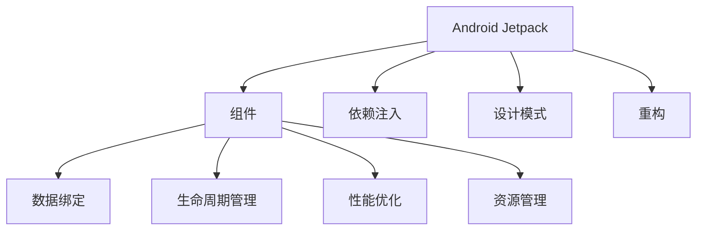

                 

## 1. 背景介绍

### 1.1 问题由来

Android开发领域经历了从Activity与Fragment、到MVVM的演变。MVVM（Model-View-ViewModel）在大型、复杂应用中表现出更强大的组织能力与灵活性。然而，MVVM的实现过于复杂，代码重复、耦合度高，使用成本大，难以在快速迭代与维护中体现其优势。

### 1.2 问题核心关键点

为解决上述问题，Android Jetpack组件应运而生。通过官方组件库，开发者可以更灵活、更低成本、更高效的实现MVVM模式。

### 1.3 问题研究意义

Android Jetpack组件提供的强大的开发支持与丰富的功能，大大降低了Android开发门槛，并加速了开发周期。从长期来看，组件应用将有效提升Android应用的可扩展性、可维护性与用户体验，减少开发成本，使开发人员聚焦于核心业务功能的实现。

## 2. 核心概念与联系

### 2.1 核心概念概述

为更好地理解Android Jetpack组件应用，本节将介绍几个密切相关的核心概念：

- **Android Jetpack**：谷歌官方提供的开发工具集，包含众多工具、库与组件，方便开发者构建高质量、可扩展的Android应用。
- **组件(Component)**：Android Jetpack提供的一类工具与库，帮助开发者更高效、更灵活地构建应用。
- **依赖注入(Dependency Injection)**：将组件作为工具提供，而不是将组件代码硬编码到应用中，实现依赖关系的灵活组合。
- **设计模式(Patterns)**：组件封装了常见的设计模式，使得开发者可以更高效地重用代码与逻辑。
- **重构(Refactoring)**：通过使用组件，开发者可以更好地重构现有应用，减少技术债务，提升应用质量。

这些核心概念之间的逻辑关系可以通过以下Mermaid流程图来展示：



这个流程图展示了这个核心概念之间的逻辑关系：

1. **Android Jetpack** 是整个组件体系的源头。
2. **组件** 是Android Jetpack提供的主要工具与库。
3. **依赖注入**、**设计模式**、**重构** 是组件使用的实践手段，帮助开发者更高效、更灵活地实现应用。
4. **组件** 涉及到的核心功能包括 **数据绑定**、**生命周期管理**、**性能优化**、**资源管理** 等，这些功能通过组件提供，方便开发者使用。

这些概念共同构成了Android Jetpack组件应用的理论基础，使开发者能够更高效地构建与维护Android应用。

## 3. 核心算法原理 & 具体操作步骤
### 3.1 算法原理概述

Android Jetpack组件应用的核心算法原理在于依赖注入与组件复用，具体实现依赖于Android系统的AAR（Android Archive）文件机制与组件生命周期管理机制。其关键点包括：

1. **依赖注入**：将组件作为依赖注入，减少代码耦合度，提升应用的可扩展性。
2. **组件复用**：通过组件库提供的功能复用，减少代码重复，提升开发效率。
3. **生命周期管理**：组件根据自身生命周期，在应用启动、运行、销毁时自动执行相应操作，减少手动管理逻辑的复杂度。
4. **资源管理**：组件封装了资源管理功能，如布局、样式、主题等，方便开发者快速搭建应用界面。

### 3.2 算法步骤详解

Android Jetpack组件应用的基本步骤如下：

**Step 1: 准备组件库与依赖**

1. 下载Android Jetpack组件库。
2. 在应用模块`build.gradle`文件配置组件库依赖。
3. 应用模块配置依赖注入。

**Step 2: 添加组件功能**

1. 根据应用需求，选择需要引入的组件库与功能。
2. 在应用模块`build.gradle`文件配置功能库依赖。
3. 根据功能库提供的方法与接口，在应用中引入相应功能。

**Step 3: 集成组件功能**

1. 将组件功能集成到应用模块中。
2. 配置组件功能生命周期，自动执行组件方法。
3. 调用组件功能，实现应用功能。

### 3.3 算法优缺点

Android Jetpack组件应用的优点包括：

1. **提升开发效率**：通过组件库，开发者可以快速引入常见功能，减少重复开发。
2. **提升应用可扩展性**：组件通过依赖注入，使得应用更易于扩展与维护。
3. **提升应用性能**：组件封装了性能优化功能，如缓存、延迟加载等。

其缺点包括：

1. **学习曲线较高**：组件库功能丰富，开发者需要花费一定时间熟悉各组件的使用方式。
2. **组件更新成本**：依赖库版本更新时，开发者需要手动更新依赖，更新成本较高。
3. **组件冲突问题**：不同组件版本间可能存在兼容性问题，需要开发者仔细配置版本。

### 3.4 算法应用领域

Android Jetpack组件应用在Android应用开发中得到了广泛应用，覆盖了以下应用场景：

- **数据绑定**：将数据与UI元素绑定，自动更新UI界面。
- **生命周期管理**：根据组件生命周期自动执行相应操作，减少手动管理逻辑。
- **性能优化**：通过缓存、延迟加载等优化性能，提升应用响应速度。
- **资源管理**：封装资源管理功能，如布局、样式、主题等，方便快速搭建应用界面。
- **网络通信**：封装网络通信功能，简化网络请求处理逻辑。
- **数据库管理**：封装数据库管理功能，简化数据存储与查询操作。

这些应用场景展示了Android Jetpack组件应用的广泛适用性与强大功能，帮助开发者更高效地构建与维护Android应用。

## 4. 数学模型和公式 & 详细讲解 & 举例说明

### 4.1 数学模型构建

本节将使用数学语言对Android Jetpack组件应用进行更加严格的刻画。

假设应用需要实现数据绑定功能，通过组件库`androidx:androidx-lifecycle`引入生命周期管理功能。应用界面由`TextView`显示数据。

定义组件库提供的`DataBinding`类，用于管理数据与视图的绑定：

```java
public class DataBinding {
    private String data;

    public void setData(String data) {
        this.data = data;
    }

    public String getData() {
        return data;
    }
}
```

应用模块配置依赖注入：

```java
public class AppApplication extends Application {
    @Override
    public void onCreate() {
        super.onCreate();

        // 注入DataBinding实例
        DataBinding dataBinding = new DataBinding();
        DataBinding.setInstance(dataBinding);
    }
}
```

应用界面配置数据绑定：

```xml
<TextView
    android:id="@+id/textView"
    android:layout_width="wrap_content"
    android:layout_height="wrap_content"
    android:text="@{dataBinding.getData()}" />
```

### 4.2 公式推导过程

数据绑定实现原理如下：

1. 应用启动时，`DataBinding`实例被注入到`Application`中。
2. 在界面`TextView`中引用`@{dataBinding.getData()}`，将数据绑定到`TextView`显示。
3. 数据绑定逻辑通过依赖注入，自动执行相应操作。

在上述步骤中，`DataBinding`实例通过依赖注入被引入应用模块，使得数据绑定功能自动执行。通过引入生命周期管理功能，应用界面自动更新数据。

### 4.3 案例分析与讲解

本节将通过一个具体的案例，展示Android Jetpack组件应用的实际使用效果。

假设开发者需要实现一个简单的数据展示应用，应用界面中需要展示当前日期与时间。通过数据绑定功能，可以将日期时间数据与界面绑定，实现自动更新。

具体实现步骤如下：

1. 引入`androidx:androidx-lifecycle`依赖。
2. 在`AppApplication`中注入`DataBinding`实例。
3. 在界面配置中引用`@{dataBinding.getData()}`，展示当前日期时间。
4. 运行应用，通过数据绑定自动更新界面。

```java
public class AppApplication extends Application {
    @Override
    public void onCreate() {
        super.onCreate();

        // 注入DataBinding实例
        DataBinding dataBinding = new DataBinding();
        DataBinding.setInstance(dataBinding);
    }
}

public class MainActivity extends AppCompatActivity {
    @Override
    protected void onCreate(Bundle savedInstanceState) {
        super.onCreate(savedInstanceState);
        setContentView(R.layout.activity_main);

        // 获取当前日期时间
        Calendar calendar = Calendar.getInstance();
        SimpleDateFormat formatter = new SimpleDateFormat("yyyy-MM-dd HH:mm:ss");
        String date = formatter.format(calendar.getTime());
        
        // 设置数据
        DataBinding.getInstance().setData(date);
    }
}

<TextView
    android:id="@+id/textView"
    android:layout_width="wrap_content"
    android:layout_height="wrap_content"
    android:text="@{dataBinding.getData()}" />
```

在上述案例中，开发者通过Android Jetpack组件应用，简化了数据绑定与生命周期管理的逻辑。通过`DataBinding`实例自动注入，实现了数据绑定功能的自动执行。开发者只需编写逻辑处理代码，其他绑定、更新等操作由组件自动完成。

## 5. 项目实践：代码实例和详细解释说明
### 5.1 开发环境搭建

在进行组件应用实践前，我们需要准备好开发环境。以下是使用Android Studio搭建Android Jetpack组件应用环境的流程：

1. 安装Android Studio：从官网下载安装包，根据系统要求安装。
2. 安装Android SDK与NDK：在Android Studio中配置SDK与NDK路径。
3. 创建项目：选择创建一个新的Android项目，设置项目名称、路径与模板。
4. 配置依赖：在项目`build.gradle`文件中配置依赖库，引入Android Jetpack组件库。
5. 配置应用模块：在项目`app`模块中配置应用模块，引入所需依赖库。

完成上述步骤后，即可在Android Studio中开始组件应用开发。

### 5.2 源代码详细实现

这里我们以数据绑定与生命周期管理为例，给出使用Android Jetpack组件应用的完整代码实现。

首先，定义`DataBinding`类：

```java
public class DataBinding {
    private String data;

    public void setData(String data) {
        this.data = data;
    }

    public String getData() {
        return data;
    }
}
```

然后，在`AppApplication`中注入`DataBinding`实例：

```java
public class AppApplication extends Application {
    @Override
    public void onCreate() {
        super.onCreate();

        // 注入DataBinding实例
        DataBinding dataBinding = new DataBinding();
        DataBinding.setInstance(dataBinding);
    }
}
```

接着，在应用界面中配置数据绑定：

```xml
<TextView
    android:id="@+id/textView"
    android:layout_width="wrap_content"
    android:layout_height="wrap_content"
    android:text="@{dataBinding.getData()}" />
```

最后，在`MainActivity`中获取当前日期时间，并设置数据：

```java
public class MainActivity extends AppCompatActivity {
    @Override
    protected void onCreate(Bundle savedInstanceState) {
        super.onCreate(savedInstanceState);
        setContentView(R.layout.activity_main);

        // 获取当前日期时间
        Calendar calendar = Calendar.getInstance();
        SimpleDateFormat formatter = new SimpleDateFormat("yyyy-MM-dd HH:mm:ss");
        String date = formatter.format(calendar.getTime());
        
        // 设置数据
        DataBinding.getInstance().setData(date);
    }
}
```

### 5.3 代码解读与分析

让我们再详细解读一下关键代码的实现细节：

**DataBinding类**：
- `setData`与`getData`方法：用于管理数据与UI元素的绑定。

**AppApplication类**：
- 在`onCreate`方法中，注入`DataBinding`实例，方便应用模块调用。

**MainActivity类**：
- 在`onCreate`方法中，获取当前日期时间，并设置数据，实现自动更新。

**activity_main布局**：
- 引用`@{dataBinding.getData()}`，将数据绑定到`TextView`中显示。

通过上述代码实现，可以看到Android Jetpack组件应用是如何通过依赖注入与数据绑定，实现自动化的功能逻辑。开发者只需编写核心逻辑代码，其他绑定、更新等操作由组件自动完成，大大提升了开发效率与应用质量。

当然，工业级的系统实现还需考虑更多因素，如组件的生命周期管理、依赖注入的灵活配置、组件的性能优化等。但核心的组件应用逻辑基本与此类似。

## 6. 实际应用场景
### 6.1 智能家居系统

Android Jetpack组件应用可以广泛应用于智能家居系统的构建。传统智能家居系统依赖复杂的传感器与控制器，硬件成本高、维护复杂。通过Android Jetpack组件应用，可以简化系统构建，提升系统的稳定性和可维护性。

在技术实现上，可以收集各种传感器的数据，通过组件库实现数据收集、处理与展示。在用户界面中，通过数据绑定与生命周期管理，实现动态更新与响应。通过组件集成，可以更灵活地构建各种智能家居功能，如语音控制、智能安防、环境监测等。如此构建的智能家居系统，能大幅提升用户体验，降低开发成本，快速响应用户需求。

### 6.2 电商平台

Android Jetpack组件应用在电商平台中也有广泛应用。传统电商平台的后台系统与前台展示功能复杂、耦合度高，维护难度大。通过组件应用，可以简化后台系统的构建，提升系统的灵活性与可扩展性。

在技术实现上，可以构建后端API服务，通过组件库实现数据访问与处理。在前端界面中，通过数据绑定与生命周期管理，实现数据的动态展示与更新。通过组件集成，可以更灵活地构建各种电商功能，如商品展示、购物车、订单管理等。如此构建的电商平台，能大幅提升系统的性能与用户体验，降低开发成本，快速响应市场变化。

### 6.3 社交媒体平台

Android Jetpack组件应用在社交媒体平台中同样适用。传统社交媒体平台的功能复杂，代码重复、耦合度高，难以高效维护。通过组件应用，可以简化功能的构建，提升系统的稳定性和可维护性。

在技术实现上，可以构建后端服务与前端界面，通过组件库实现数据处理与展示。在用户界面中，通过数据绑定与生命周期管理，实现动态更新与响应。通过组件集成，可以更灵活地构建各种社交功能，如用户登录、消息推送、内容发布等。如此构建的社交媒体平台，能大幅提升用户体验，降低开发成本，快速响应用户需求。

### 6.4 未来应用展望

随着Android Jetpack组件应用的不断演进，其在更多领域的应用前景将会更加广阔。未来，Android Jetpack组件应用将继续在智能家居、电商、社交媒体、医疗健康等多个领域发挥重要作用，为各行业提供更高效、更灵活、更稳定的解决方案。

在智慧医疗领域，Android Jetpack组件应用可以帮助医院构建高效、安全的医疗信息系统，提升医疗服务的智能化水平。

在智能交通领域，Android Jetpack组件应用可以帮助交通部门构建智能调度系统，提升交通管理效率与安全性。

在工业制造领域，Android Jetpack组件应用可以帮助企业构建智能生产系统，提升生产效率与质量。

在智慧农业领域，Android Jetpack组件应用可以帮助农民构建智能农业系统，提升农业生产效率与收益。

此外，在教育、金融、物流、旅游等多个领域，Android Jetpack组件应用也将不断拓展应用场景，推动各行业向智能化、数字化方向转型升级。

## 7. 工具和资源推荐
### 7.1 学习资源推荐

为了帮助开发者系统掌握Android Jetpack组件应用的理论基础和实践技巧，这里推荐一些优质的学习资源：

1. **Android Jetpack官方文档**：谷歌官方提供的Android Jetpack文档，包含丰富的组件应用示例与使用说明，是学习Android Jetpack组件应用的必备资源。

2. **Android Jetpack实战指南**：由资深Android开发者撰写，深入浅出地介绍了Android Jetpack组件应用的具体实现与实战技巧。

3. **Android Jetpack架构设计**：深入探讨Android Jetpack组件应用的架构设计原理，帮助开发者更好地理解组件应用的底层机制。

4. **Android Jetpack设计模式**：介绍Android Jetpack组件应用中的设计模式，帮助开发者更好地重用代码与逻辑。

5. **Android Jetpack最佳实践**：总结Android Jetpack组件应用的最佳实践与经验，帮助开发者提升应用开发质量。

通过对这些资源的学习实践，相信你一定能够快速掌握Android Jetpack组件应用的精髓，并用于解决实际的Android开发问题。

### 7.2 开发工具推荐

高效的开发离不开优秀的工具支持。以下是几款用于Android Jetpack组件应用开发的常用工具：

1. **Android Studio**：谷歌提供的官方IDE，支持Android Jetpack组件应用的开发、调试与部署。

2. **Gradle**：Android项目构建系统，通过Gradle配置依赖库与编译任务，简化Android开发流程。

3. **GitHub**：提供代码托管与协作功能，方便开发者共享代码与交流经验。

4. **Firebase**：提供云端服务与开发工具，帮助开发者构建高效、稳定的应用系统。

5. **Logcat**：Android Studio内置日志工具，方便开发者调试应用问题。

6. **Android Virtual Device (AVD)**：Android Studio内置模拟器，方便开发者在本地调试应用。

合理利用这些工具，可以显著提升Android Jetpack组件应用的开发效率，加快创新迭代的步伐。

### 7.3 相关论文推荐

Android Jetpack组件应用的发展源于学界的持续研究。以下是几篇奠基性的相关论文，推荐阅读：

1. **Android Jetpack组件应用设计与实现**：探讨Android Jetpack组件应用的架构设计与实现原理。

2. **依赖注入在Android开发中的应用**：介绍依赖注入技术在Android开发中的应用，提升应用的可扩展性与维护性。

3. **Android Jetpack组件性能优化**：总结Android Jetpack组件应用的性能优化策略，提升应用的响应速度与稳定性。

4. **Android Jetpack组件数据绑定技术**：深入探讨Android Jetpack组件应用的数据绑定技术，提升应用的灵活性与动态性。

这些论文代表了大语言模型微调技术的发展脉络。通过学习这些前沿成果，可以帮助研究者把握学科前进方向，激发更多的创新灵感。

## 8. 总结：未来发展趋势与挑战

### 8.1 总结

本文对Android Jetpack组件应用进行了全面系统的介绍。首先阐述了Android Jetpack组件应用的研究背景和意义，明确了组件应用在提升开发效率、增强应用可扩展性、提升应用性能等方面的独特价值。其次，从原理到实践，详细讲解了Android Jetpack组件应用的数学原理和关键步骤，给出了组件应用开发的完整代码实例。同时，本文还广泛探讨了组件应用在智能家居、电商平台、社交媒体等多个领域的应用前景，展示了组件应用的广泛适用性与强大功能，帮助开发者更高效地构建与维护Android应用。

通过本文的系统梳理，可以看到，Android Jetpack组件应用正在成为Android开发的重要范式，极大地降低了Android开发门槛，提升了开发效率与应用质量。未来，伴随组件应用的不断演进，Android开发将进入新的发展阶段，开发者将能更快地构建出稳定、高效、灵活的Android应用。

### 8.2 未来发展趋势

展望未来，Android Jetpack组件应用将呈现以下几个发展趋势：

1. **组件功能更加丰富**：Android Jetpack组件库将继续丰富功能，提升开发者的生产效率。
2. **组件版本管理更加灵活**：组件版本管理机制将进一步完善，降低开发者版本更新的成本。
3. **组件应用更加通用**：组件应用将更加灵活地应用于更多领域，提升各行业的智能化水平。
4. **组件性能更加优化**：组件性能优化技术将不断进步，提升应用的响应速度与稳定性。
5. **组件安全更加重要**：组件安全性将更加受到关注，保障应用的安全性与可靠性。
6. **组件协作更加紧密**：组件间协作将更加紧密，提升应用的集成性与协同性。

以上趋势凸显了Android Jetpack组件应用的广阔前景。这些方向的探索发展，将进一步提升Android应用的可扩展性、可维护性与用户体验，使开发者能更专注于核心业务功能的实现。

### 8.3 面临的挑战

尽管Android Jetpack组件应用已经取得了瞩目成就，但在迈向更加智能化、普适化应用的过程中，它仍面临着诸多挑战：

1. **组件更新成本较高**：依赖库版本更新时，开发者需要手动更新依赖，更新成本较高。
2. **组件版本兼容性问题**：不同组件版本间可能存在兼容性问题，需要开发者仔细配置版本。
3. **组件学习曲线较高**：组件库功能丰富，开发者需要花费一定时间熟悉各组件的使用方式。
4. **组件冲突问题**：不同组件版本间可能存在冲突，需要开发者仔细配置依赖。

这些挑战需要开发者在实践中不断探索与优化，进一步提升Android Jetpack组件应用的性能与可靠性。

### 8.4 研究展望

面对Android Jetpack组件应用所面临的种种挑战，未来的研究需要在以下几个方面寻求新的突破：

1. **组件版本管理机制**：进一步完善组件版本管理机制，降低开发者版本更新的成本。
2. **组件依赖注入**：探索更灵活、更高效的依赖注入机制，提升组件的通用性与可扩展性。
3. **组件性能优化**：开发更高效的组件性能优化技术，提升应用的响应速度与稳定性。
4. **组件安全性**：提升组件的安全性，保障应用的安全性与可靠性。
5. **组件协作机制**：探索更紧密、更高效的组件协作机制，提升应用的集成性与协同性。

这些研究方向的探索，将进一步提升Android Jetpack组件应用的性能与可靠性，使开发者能更专注于核心业务功能的实现。

## 9. 附录：常见问题与解答

**Q1：Android Jetpack组件库是否适用于所有Android应用？**

A: Android Jetpack组件库在绝大多数Android应用中都适用，尤其是对于大型、复杂应用，其组件库提供的丰富功能与灵活性将大大提升开发效率与系统性能。然而，对于一些简单应用或特定需求的应用，组件库的功能可能过于复杂，开发者需根据具体情况进行选择。

**Q2：如何选择合适的Android Jetpack组件库？**

A: 开发者应根据应用需求，选择合适的Android Jetpack组件库。一般来说，以下步骤可以帮助选择适合的组件库：
1. 分析应用需求，确定所需功能。
2. 查找Android Jetpack官方文档，了解各组件库的功能。
3. 在项目中引入需要的组件库，进行功能测试。
4. 根据测试结果，选择最合适的组件库。

**Q3：Android Jetpack组件库的学习曲线是否较高？**

A: Android Jetpack组件库功能丰富，确实有一定的学习曲线。但组件库提供的文档与示例代码非常丰富，开发者可通过学习资源与实践经验，逐步掌握组件库的使用方法。同时，组件库的组件可以通过依赖注入，减少代码耦合度，降低维护成本。

**Q4：组件库的版本更新成本是否较高？**

A: 组件库的版本更新成本确实较高，但可以通过自动化工具与依赖注入机制，简化更新过程。例如，使用Gradle配置依赖，自动同步组件库更新，降低开发者手动更新的工作量。

**Q5：组件库的兼容性问题如何解决？**

A: 组件库的兼容性问题可以通过以下方式解决：
1. 在项目中引入最新版本的组件库，进行兼容性测试。
2. 使用依赖注入机制，减少组件库版本间的冲突。
3. 在应用模块中配置依赖管理工具，如Gradle，方便组件库的版本管理。

这些问题的解决方式需要开发者在实践中不断探索与优化，进一步提升Android Jetpack组件应用的性能与可靠性。

---

作者：禅与计算机程序设计艺术 / Zen and the Art of Computer Programming

