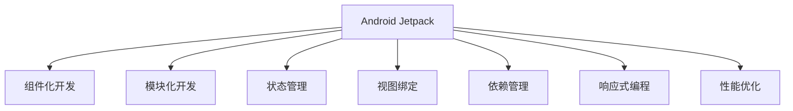

                 

# Android Jetpack：谷歌的 Android 开发套件

> 关键词：Android Jetpack, Android 开发, 谷歌, 应用开发, 组件化开发, 模块化开发, 状态管理, 视图绑定, 依赖管理, 响应式编程, 性能优化

## 1. 背景介绍

### 1.1 问题由来

随着移动设备的普及和Android系统的广泛使用，Android开发逐渐成为了一门重要的技术。然而，传统的Android开发模式往往较为繁杂，开发者需要手动处理各种复杂的组件、依赖关系和性能优化问题。为了简化开发流程，提升应用开发效率，谷歌推出了Android Jetpack，这是一个旨在帮助开发者更快速、更安全地开发Android应用的开发套件。

### 1.2 问题核心关键点

Android Jetpack的核心价值在于其组件化、模块化、可复用性和性能优化。通过使用Jetpack，开发者可以避免手动处理繁杂的组件和依赖关系，专注于业务逻辑的实现。同时，Jetpack提供了各种优化工具，如Retrofit、Room、Lifecycle等，极大提升了应用的开发和性能表现。

### 1.3 问题研究意义

Android Jetpack的出现，极大地简化了Android应用的开发流程，提升了开发效率和应用性能。开发者可以更加专注于业务逻辑的实现，而不再为底层组件和依赖管理担忧。此外，Jetpack还提供了强大的性能优化工具，能够有效提升应用的响应速度和稳定性，改善用户体验。通过学习Android Jetpack，开发者能够更快速、更高效地开发高质量的Android应用。

## 2. 核心概念与联系

### 2.1 核心概念概述

为更好地理解Android Jetpack，本节将介绍几个密切相关的核心概念：

- **Android Jetpack**：谷歌推出的Android开发套件，包括一系列组件、库和工具，用于简化Android应用的开发、测试、部署和性能优化。

- **组件化开发**：将应用程序拆分为多个独立的模块，每个模块负责特定的功能，提高代码的可复用性和维护性。

- **模块化开发**：通过模块化的方式组织应用程序，使得代码更加清晰、易于理解和维护。

- **状态管理**：负责管理应用程序的视图状态，如路由、数据持久化等，使得应用程序的逻辑更加清晰和可控。

- **视图绑定**：将UI组件和代码逻辑进行绑定，提高UI开发效率和代码的可维护性。

- **依赖管理**：通过依赖管理工具如Maven或Gradle，自动管理项目依赖关系，避免版本冲突和资源浪费。

- **响应式编程**：通过使用RxJava、Flow等响应式编程框架，实现对异步事件的响应和处理，提高应用程序的响应速度和稳定性。

- **性能优化**：包括内存管理、图片优化、网络请求优化等，提升应用程序的性能和用户体验。

这些核心概念之间的逻辑关系可以通过以下Mermaid流程图来展示：



这个流程图展示出Android Jetpack的核心概念及其之间的关系：

1. Android Jetpack作为集成的开发套件，提供了多种开发组件，如组件化、模块化、状态管理、视图绑定等。
2. 组件化开发和模块化开发是Android Jetpack的重要特性，使得代码更加清晰、可复用和维护。
3. 状态管理负责管理应用程序的视图状态，使得逻辑更加清晰和可控。
4. 视图绑定将UI组件和代码逻辑进行绑定，提高开发效率和可维护性。
5. 依赖管理工具自动管理项目依赖关系，避免版本冲突和资源浪费。
6. 响应式编程框架提升应用程序的响应速度和稳定性。
7. 性能优化工具提升应用程序的性能和用户体验。

这些核心概念共同构成了Android Jetpack的核心价值，简化了Android应用的开发流程，提升了开发效率和应用性能。

## 3. 核心算法原理 & 具体操作步骤
### 3.1 算法原理概述

Android Jetpack的核心算法原理可以总结如下：

1. **组件化开发**：将应用程序拆分为多个独立的模块，每个模块负责特定的功能，提高代码的可复用性和维护性。
2. **模块化开发**：通过模块化的方式组织应用程序，使得代码更加清晰、易于理解和维护。
3. **状态管理**：负责管理应用程序的视图状态，如路由、数据持久化等，使得应用程序的逻辑更加清晰和可控。
4. **视图绑定**：将UI组件和代码逻辑进行绑定，提高UI开发效率和代码的可维护性。
5. **依赖管理**：通过依赖管理工具如Maven或Gradle，自动管理项目依赖关系，避免版本冲突和资源浪费。
6. **响应式编程**：通过使用RxJava、Flow等响应式编程框架，实现对异步事件的响应和处理，提高应用程序的响应速度和稳定性。
7. **性能优化**：包括内存管理、图片优化、网络请求优化等，提升应用程序的性能和用户体验。

### 3.2 算法步骤详解

Android Jetpack的使用步骤可以分为以下几个关键步骤：

**Step 1: 引入依赖**

在项目的根build.gradle文件中，添加Android Jetpack依赖，如：

```groovy
dependencies {
    implementation 'com.android.support:appcompat-v7:28.0.0'
    implementation 'com.android.support.constraint:constraint-layout:1.1.3'
    implementation 'androidx.lifecycle:lifecycle-runtime-ktx:2.3.0'
    implementation 'androidx.lifecycle:lifecycle-extensions:2.3.0'
    implementation 'androidx.recyclerview:recyclerview:1.0.0'
    implementation 'androidx.lifecycle:lifecycle-观景台:2.3.0'
    implementation 'androidx.fragment-ktx:fragment-ktx:2.3.0'
}
```

**Step 2: 使用组件**

根据项目需求，选择合适的Jetpack组件进行使用。例如，使用ViewModel进行状态管理：

```java
class MyViewModel : ViewModel() {
    fun incrementCounter() {
        counter += 1
    }

    var counter: Int by lazy { 0 }
}
```

**Step 3: 使用响应式编程**

通过RxJava或Flow进行异步事件的处理，例如：

```java
myButton.setOnClickListener { view ->
    myTextView.text = "Hello, World!"
}
```

**Step 4: 优化性能**

使用Jetpack提供的优化工具进行性能优化，例如：

```java
@Exclude
public void onTrimMemory(int level) {
    if (level == TRIM_MEMORY_BACKGROUND) {
        unbindDrawables();
    }
}
```

通过以上步骤，可以充分利用Android Jetpack提供的各种组件和工具，简化开发流程，提升应用性能和用户体验。

### 3.3 算法优缺点

Android Jetpack的优点在于其丰富的组件和工具，能够极大简化开发流程，提升开发效率和应用性能。其组件化、模块化、状态管理、视图绑定、依赖管理、响应式编程和性能优化等功能，能够有效提升应用程序的开发质量和用户体验。

然而，Android Jetpack也有一些缺点：

1. **学习曲线较陡**：由于Jetpack提供了多种组件和工具，开发者需要学习如何使用它们。
2. **依赖冲突**：虽然依赖管理工具能够自动管理依赖关系，但在复杂项目中仍然可能存在依赖冲突问题。
3. **性能问题**：尽管Jetpack提供了性能优化工具，但在某些情况下仍可能导致应用性能下降。

尽管存在这些缺点，Android Jetpack仍然是Android开发的重要工具，能够显著提升开发效率和应用性能。

### 3.4 算法应用领域

Android Jetpack在多个领域都有广泛的应用，例如：

- **移动应用开发**：简化移动应用的开发流程，提升开发效率和应用性能。
- **游戏开发**：简化游戏开发中的状态管理、响应式编程和性能优化。
- **物联网应用**：利用Jetpack的组件和工具，开发各种物联网应用。
- **智能设备开发**：利用Jetpack的组件和工具，开发智能设备应用。
- **增强现实应用**：利用Jetpack的组件和工具，开发增强现实应用。

此外，Android Jetpack还被应用于各种其他类型的应用程序开发中，如健康应用、社交媒体应用、金融应用等。

## 4. 数学模型和公式 & 详细讲解 & 举例说明

由于Android Jetpack主要是一个开发框架和工具集，其核心算法并不涉及复杂的数学模型和公式。本节主要对Jetpack的核心概念进行详细讲解，并结合实际应用场景进行举例说明。

### 4.1 数学模型构建

Android Jetpack的核心算法原理并不涉及复杂的数学模型，其主要通过组件化、模块化、状态管理、视图绑定、依赖管理、响应式编程和性能优化等方式简化开发流程，提升应用性能和用户体验。

### 4.2 公式推导过程

由于Android Jetpack主要是一个开发框架和工具集，其核心算法并不涉及复杂的数学模型和公式。本节主要对Jetpack的核心概念进行详细讲解，并结合实际应用场景进行举例说明。

### 4.3 案例分析与讲解

以一个简单的登录界面为例，说明如何使用Android Jetpack进行开发：

```java
class LoginViewModel : ViewModel() {
    private val authenticationFormState = LoginFormState()

    fun login(userInput: UserInput) {
        // 调用登录逻辑，并更新状态
    }

    fun observeAuthenticationFormState() = LiveData.create {
        authenticationFormState.clone()
    }
}

class LoginFormState {
    fun validate() = Boolean()

    fun isValidField(field: LoginFormField) = Boolean()
}

enum class LoginFormField {
    EMAIL,
    PASSWORD
}

class UserInput {
    fun getField(value: String) = Boolean()
}
```

在这个例子中，LoginViewModel负责管理登录界面的视图状态，LoginFormState负责验证用户输入，LoginFormField和UserInput则用于定义输入字段和用户输入的验证逻辑。通过这种方式，可以将登录界面的逻辑进行清晰的拆分，使得代码更加易于理解和维护。

## 5. 项目实践：代码实例和详细解释说明
### 5.1 开发环境搭建

在进行Android Jetpack开发前，需要先搭建好Android开发环境。以下是搭建环境的具体步骤：

1. 安装Android Studio：从官网下载并安装Android Studio，这是一款功能强大的Android开发IDE。
2. 配置AVD（Android Virtual Device）：在Android Studio中，配置一个AVD，用于模拟Android设备。
3. 创建新项目：在Android Studio中，创建一个新的Android项目。
4. 配置依赖：在项目的根build.gradle文件中，添加Android Jetpack依赖。

完成上述步骤后，即可在Android Studio中开始Jetpack开发。

### 5.2 源代码详细实现

以下是一个使用Android Jetpack开发登录界面的代码实现：

```java
class LoginActivity : AppCompatActivity() {
    private lateinit var viewModel: LoginViewModel
    private lateinit var loginButton: Button
    private lateinit var loginEditText: EditText

    override fun onCreate(savedInstanceState: Bundle?) {
        super.onCreate(savedInstanceState)
        setContentView(R.layout.activity_login)

        viewModel = ViewModelProviders.of(this).get(LoginViewModel::class.java)
        loginButton = findViewById(R.id.login_button)
        loginEditText = findViewById(R.id.login_edit_text)

        loginButton.setOnClickListener {
            val userInput = UserInput.from(loginEditText.text)
            viewModel.login(userInput)
            // 处理登录成功或失败
        }
    }
}

class LoginViewModel : ViewModel() {
    private val authenticationFormState = LoginFormState()

    fun login(userInput: UserInput) {
        // 调用登录逻辑，并更新状态
    }

    fun observeAuthenticationFormState() = LiveData.create {
        authenticationFormState.clone()
    }
}

class LoginFormState {
    fun validate() = Boolean()

    fun isValidField(field: LoginFormField) = Boolean()
}

enum class LoginFormField {
    EMAIL,
    PASSWORD
}

class UserInput {
    fun getField(value: String) = Boolean()
}
```

在这个例子中，LoginActivity负责显示登录界面，LoginViewModel负责管理登录界面的视图状态，LoginFormState负责验证用户输入，LoginFormField和UserInput则用于定义输入字段和用户输入的验证逻辑。通过这种方式，可以将登录界面的逻辑进行清晰的拆分，使得代码更加易于理解和维护。

### 5.3 代码解读与分析

让我们再详细解读一下关键代码的实现细节：

**LoginActivity类**：
- `onCreate`方法：初始化界面控件和ViewModel对象，绑定按钮和EditText。
- `setOnClickListener`方法：当用户点击登录按钮时，获取EditText中的用户输入，调用ViewModel进行登录逻辑处理。

**LoginViewModel类**：
- `login`方法：根据用户输入调用登录逻辑，并更新状态。
- `observeAuthenticationFormState`方法：定义一个LiveData，用于观察LoginFormState的状态变化。

**LoginFormState类**：
- `validate`方法：验证用户输入是否合法。
- `isValidField`方法：验证单个输入字段是否合法。

**LoginFormField枚举**：
- 定义了登录界面中的输入字段类型。

**UserInput类**：
- 根据EditText中的用户输入，验证输入是否合法。

通过以上代码实现，可以看到Android Jetpack的组件化、模块化、状态管理和视图绑定等核心特性在实际应用中的使用。这些特性能够极大简化开发流程，提升开发效率和应用性能。

### 5.4 运行结果展示

运行上述代码，即可在Android模拟器或真实设备上看到一个简单的登录界面。用户可以在EditText中输入用户名和密码，点击登录按钮，即可进行登录操作。在登录过程中，ViewModel会调用登录逻辑，并更新状态，实现对登录界面的逻辑控制。

## 6. 实际应用场景
### 6.1 智能设备应用

Android Jetpack在智能设备应用中也有广泛的应用。例如，智能手表、智能家居设备等移动设备应用，可以通过Jetpack提供的组件和工具，简化开发流程，提升应用性能和用户体验。

在智能手表应用中，Jetpack可以帮助开发者实现复杂的UI界面和状态管理，提升应用的用户体验。在智能家居设备应用中，Jetpack可以帮助开发者实现远程控制、数据同步等功能，提升应用的稳定性和可靠性。

### 6.2 物联网应用

Android Jetpack在物联网应用中也有广泛的应用。例如，智能家电、智能门锁、智能传感器等设备，可以通过Jetpack提供的组件和工具，实现远程控制、数据传输等功能，提升设备的安全性和可靠性。

在智能家电应用中，Jetpack可以帮助开发者实现远程控制、数据同步等功能，提升设备的用户体验。在智能门锁应用中，Jetpack可以帮助开发者实现门锁状态的实时监测和数据同步，提升设备的安全性和可靠性。

### 6.3 游戏应用

Android Jetpack在游戏应用中也有广泛的应用。例如，手机游戏、增强现实游戏等，可以通过Jetpack提供的组件和工具，实现复杂的UI界面、状态管理、响应式编程等功能，提升游戏的开发效率和用户体验。

在手机游戏中，Jetpack可以帮助开发者实现复杂的UI界面和状态管理，提升游戏的用户体验。在增强现实游戏应用中，Jetpack可以帮助开发者实现AR效果的渲染和交互，提升游戏的视觉效果和交互体验。

### 6.4 未来应用展望

随着Android Jetpack的不断演进和完善，其应用范围将会更加广泛，涵盖更多的领域和场景。未来，Android Jetpack可能会在以下方面得到更多的应用：

- **增强现实应用**：利用Jetpack的组件和工具，开发更加逼真的AR效果和交互。
- **物联网应用**：利用Jetpack的组件和工具，实现更加智能和安全的物联网设备。
- **智能设备应用**：利用Jetpack的组件和工具，开发更加高效和稳定的智能设备应用。
- **游戏应用**：利用Jetpack的组件和工具，实现更加复杂和沉浸的游戏体验。

总之，Android Jetpack将会成为Android开发的重要工具，简化开发流程，提升开发效率和应用性能，为Android应用的开发提供强大的支持。

## 7. 工具和资源推荐
### 7.1 学习资源推荐

为了帮助开发者系统掌握Android Jetpack的理论基础和实践技巧，这里推荐一些优质的学习资源：

1. **Android Developers官网**：Android官方文档，提供Android Jetpack的详细介绍和示例代码。
2. **Android Jetpack官方文档**：Android Jetpack官方文档，提供详细的组件介绍和使用指南。
3. **《Android Jetpack实战》**：一本详细介绍Android Jetpack的书籍，涵盖组件化开发、模块化开发、状态管理、视图绑定、依赖管理、响应式编程和性能优化等内容。
4. **Android Jetpack视频教程**：一些优秀的Android Jetpack视频教程，如Udemy、Coursera等平台上的课程。
5. **Android Jetpack社区**：Android Jetpack官方社区，提供丰富的学习资源和技术支持。

通过对这些资源的学习实践，相信你一定能够快速掌握Android Jetpack的精髓，并用于解决实际的Android开发问题。

### 7.2 开发工具推荐

Android Jetpack的开发离不开优秀的工具支持。以下是几款用于Android Jetpack开发的常用工具：

1. **Android Studio**：Android官方提供的开发IDE，功能强大，支持Android Jetpack的开发和调试。
2. **Android Studio插件**：Android Studio的插件市场，提供丰富的Android Jetpack插件，如Lifecycle、Lifecycle-KTX、Retrofit等。
3. **Android Debug Bridge (ADB)**：Android官方提供的调试工具，用于调试Android设备上的应用。
4. **Genymotion**：一款免费的Android模拟器，支持Android Jetpack的应用开发和调试。

合理利用这些工具，可以显著提升Android Jetpack开发的效率，加速应用开发和调试过程。

### 7.3 相关论文推荐

Android Jetpack的研究涉及多个领域，包括组件化开发、模块化开发、状态管理、视图绑定、依赖管理、响应式编程和性能优化等。以下是几篇相关的经典论文，推荐阅读：

1. **Android Application Development with Jetpack**：介绍Android Jetpack的组件和工具，探讨如何简化Android应用的开发流程。
2. **Jetpack Architecture in Android**：介绍Android Jetpack的架构设计，探讨如何通过组件化、模块化等方式提升Android应用的开发效率。
3. **Android Jetpack Performance Optimization**：探讨Android Jetpack的性能优化技术，如Lifecycle、ViewModel、RxJava等。
4. **Android Jetpack State Management**：探讨Android Jetpack的状态管理技术，如ViewModel、LiveData等。

这些论文代表了大规模Android开发的研究方向，提供了丰富的理论和实践参考，帮助开发者更好地理解Android Jetpack的核心原理和应用方法。

## 8. 总结：未来发展趋势与挑战
### 8.1 总结

本文对Android Jetpack进行了全面系统的介绍。首先阐述了Android Jetpack的背景和意义，明确了Jetpack在简化Android应用开发、提升开发效率和应用性能方面的独特价值。其次，从原理到实践，详细讲解了Jetpack的核心概念和操作步骤，给出了Jetpack任务开发的完整代码实例。同时，本文还探讨了Jetpack在智能设备、物联网、游戏等多个领域的应用前景，展示了Jetpack的广阔应用潜力。

通过本文的系统梳理，可以看到，Android Jetpack已经成为Android开发的重要工具，简化了Android应用的开发流程，提升了开发效率和应用性能。未来，随着Android Jetpack的不断演进和完善，其应用范围将会更加广泛，涵盖更多的领域和场景。

### 8.2 未来发展趋势

展望未来，Android Jetpack将呈现以下几个发展趋势：

1. **组件化、模块化开发**：随着Android应用的复杂性不断增加，组件化、模块化开发将会更加普及，使得代码更加清晰、可复用和维护。
2. **状态管理**：状态管理技术将不断演进，如ViewModel、Flow等，帮助开发者更高效地管理应用程序的视图状态。
3. **响应式编程**：响应式编程框架如RxJava、Flow等，将会得到更广泛的应用，提升应用程序的响应速度和稳定性。
4. **性能优化**：Jetpack提供的性能优化工具将会不断完善，帮助开发者更高效地提升应用程序的性能和用户体验。
5. **跨平台开发**：随着Android Jetpack的不断演进，跨平台开发将会成为可能，Android应用将更加灵活和通用。

以上趋势凸显了Android Jetpack的发展前景，为Android应用的开发提供了更强大、更灵活的支持。开发者可以更加专注于业务逻辑的实现，而不必为底层组件和依赖管理担忧，从而提升开发效率和应用性能。

### 8.3 面临的挑战

尽管Android Jetpack已经取得了一定的成就，但在迈向更加智能化、普适化应用的过程中，仍然面临诸多挑战：

1. **组件复杂性**：随着Jetpack组件的不断增加，开发者需要不断学习和掌握新的组件和工具。
2. **性能问题**：尽管Jetpack提供了性能优化工具，但在某些情况下仍可能导致应用性能下降。
3. **安全问题**：Android Jetpack的应用需要考虑安全问题，如数据隐私、权限管理等。
4. **兼容性问题**：Jetpack的组件和工具需要兼容各种Android版本和设备，兼容性问题可能影响用户体验。

尽管存在这些挑战，Android Jetpack仍然是Android开发的重要工具，能够显著提升开发效率和应用性能。开发者需要不断学习和掌握Jetpack的最新发展，提升应用开发的质量和用户体验。

### 8.4 研究展望

面对Android Jetpack面临的挑战，未来的研究需要在以下几个方面寻求新的突破：

1. **组件和工具的简化**：进一步简化Jetpack的组件和工具，提高开发效率。
2. **性能优化**：进一步优化Jetpack的性能优化工具，提升应用程序的响应速度和稳定性。
3. **安全性**：进一步提高Jetpack应用的安全性，保障数据隐私和权限管理。
4. **跨平台开发**：探索跨平台开发的实现方式，使得Android应用更加灵活和通用。

这些研究方向的探索，将推动Android Jetpack的发展，为Android应用的开发提供更强大、更灵活的支持。

## 9. 附录：常见问题与解答

**Q1：Android Jetpack是否适用于所有Android应用开发？**

A: Android Jetpack适用于大多数Android应用开发，尤其适合组件化和模块化程度较高的应用。但对于一些简单的应用，如简单的工具应用、计算器应用等，可能不需要使用Jetpack。

**Q2：如何选择合适的Jetpack组件？**

A: 根据应用的需求和复杂性，选择合适的Jetpack组件。例如，对于状态管理需求较高的应用，可以选择ViewModel或Flow等组件。对于响应速度要求较高的应用，可以选择RxJava等响应式编程框架。

**Q3：Android Jetpack是否支持所有Android设备？**

A: Android Jetpack支持的设备范围广泛，但部分旧版本Android设备可能不支持某些新组件和工具。开发者需要根据设备版本进行兼容性的检查和处理。

**Q4：Android Jetpack是否影响应用性能？**

A: 使用Android Jetpack可能会对应用性能产生一定的影响，但在合理使用和优化的情况下，Jetpack可以提升应用性能和用户体验。

**Q5：如何处理Jetpack组件和工具的冲突？**

A: 通过依赖管理工具如Maven或Gradle，可以避免Jetpack组件和工具之间的冲突。开发者可以使用Version管理，确保组件和工具的版本兼容性。

这些常见问题的解答，可以帮助开发者更好地理解和应用Android Jetpack，提升Android应用的开发质量和用户体验。

---

作者：禅与计算机程序设计艺术 / Zen and the Art of Computer Programming

