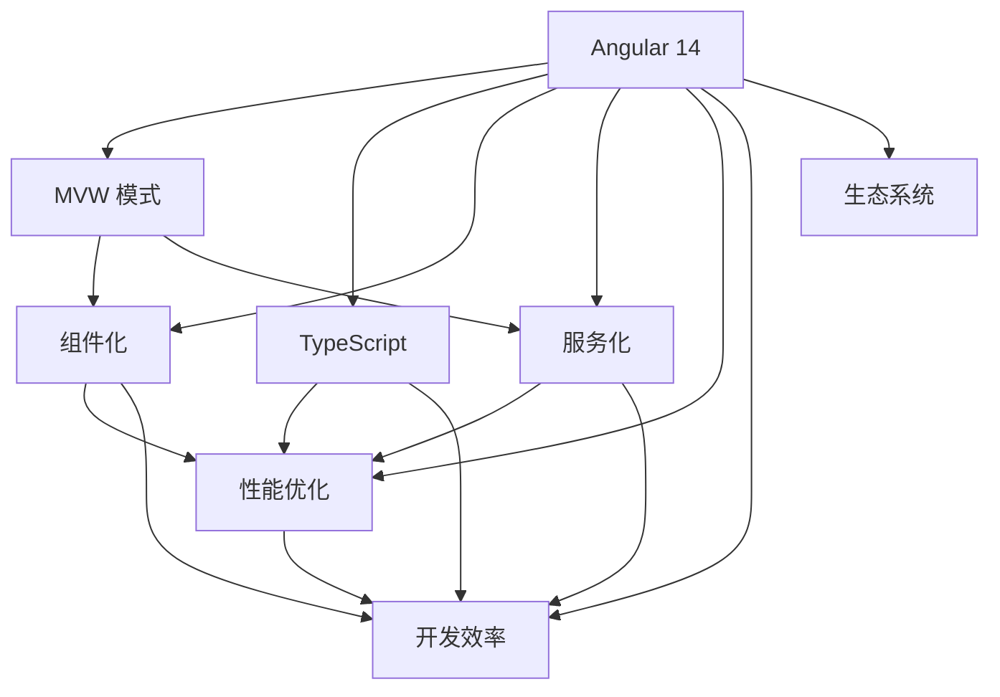

                 

# Angular 框架入门：Google MVW 框架的优势

> 关键词：Angular, MVW模式, Web应用, TypeScript, 组件化, 服务化, 性能优化, 开发效率

## 1. 背景介绍

### 1.1 问题由来
在 Web 开发领域，框架的兴起极大地加速了开发效率和代码质量。其中，Angular 作为 Google 开发的前端框架，因其强大的功能和强大的生态系统，一直受到广泛关注。Angular 的最新版本，Angular 14，不仅继承了传统框架的优点，还引入了新的功能和改进，如 MVW 模式和 TypeScript 的广泛支持。本文将从概述 Angular 14 的优势入手，分析 MVW 模式和 TypeScript 在 Web 应用开发中的应用，并对比传统框架的优劣，为开发高质量的 Web 应用提供指引。

### 1.2 问题核心关键点
Angular 14 的核心优势包括 MVW 模式的引入、TypeScript 的全面支持、组件化和服务化的完善、性能优化等。以下关键点将围绕这些核心优势进行详细探讨：
1. MVW 模式和组件化带来的模块化和可维护性
2. TypeScript 对开发质量和性能的全面提升
3. 服务化的应用和优化
4. 性能优化和资源管理
5. 开发效率和生态系统的完善

## 2. 核心概念与联系

### 2.1 核心概念概述

Angular 14 的精髓在于其采用的 MVW (Model-View-Workbench) 模式，这种模式通过组件化和服务化的开发方式，使 Web 应用更加模块化和可维护。其核心组件包括：

- **Model**：表示应用程序的数据和状态。
- **View**：表示用户界面，包含 Angular 的指令和模板。
- **Workbench**：表示应用程序的行为逻辑和业务逻辑，通过服务实现。

Angular 14 还全面支持 TypeScript，利用 TypeScript 的类型系统和工具，提高代码的稳定性和可维护性。

### 2.2 核心概念原理和架构的 Mermaid 流程图



此 Mermaid 流程图展示了 Angular 14 的主要组件和其核心优势：

1. MVW 模式通过组件化和服务化促进模块化开发。
2. TypeScript 提供强大的类型系统和工具，提高代码质量和开发效率。
3. 组件化和服务化进一步提升性能和可维护性。
4. 性能优化和开发效率提升完善应用体验和生产效率。
5. 生态系统的完善和扩展，提供更丰富的功能和工具支持。

这些关键点通过相互配合，构成 Angular 14 的强大生态和优势，使其成为 Web 开发的首选框架之一。

## 3. 核心算法原理 & 具体操作步骤

### 3.1 算法原理概述
Angular 14 的核心算法原理围绕 MVW 模式展开，通过组件化和服务化的思想，将 Web 应用拆分为多个可重用、可维护的模块，提升应用的性能和开发效率。

### 3.2 算法步骤详解

#### 步骤1：组件化
组件是 Angular 14 的核心构建块，通过组件化，将 Web 应用拆分为独立、可复用的模块。

1. **组件的声明和定义**：使用 `@Component` 装饰器声明组件，包括属性、事件和方法等。
   ```typescript
   @Component({
     selector: 'my-component',
     templateUrl: './my-component.component.html',
     styleUrls: ['./my-component.component.css']
   })
   export class MyComponent {
     // Component attributes and methods
   }
   ```
2. **组件的模板和样式**：通过模板（`<my-component></my-component>`）和样式（`my-component.css`）实现组件的展示和样式。
3. **组件的注入和调用**：通过服务或父组件来调用和注入组件。
   ```typescript
   // Calling and injecting the component in parent component
   @ViewChild(MyComponent) myComponent: MyComponent;
   ```

#### 步骤2：服务化
服务是 Angular 14 的另一重要组件，用于封装应用的行为逻辑和业务逻辑，提升应用的性能和可维护性。

1. **服务的声明和定义**：使用 `@Injectable` 装饰器声明服务，包括属性和方法等。
   ```typescript
   @Injectable({
     providedIn: 'root'
   })
   export class MyService {
     // Service attributes and methods
   }
   ```
2. **服务的注入和调用**：通过组件或服务来注入和调用服务。
   ```typescript
   // Injecting the service in component
   constructor(private myService: MyService) {}
   
   // Calling the service in component
   myService.myMethod();
   ```

#### 步骤3：MVW 模式
MVW 模式将 Web 应用分为 Model、View 和 Workbench 三个部分，通过模块化和组件化的开发方式，提升应用的性能和可维护性。

1. **Model**：表示应用程序的数据和状态，通常通过类来实现。
2. **View**：表示用户界面，包含 Angular 的指令和模板，用于展示数据。
3. **Workbench**：表示应用程序的行为逻辑和业务逻辑，通过服务实现。

```typescript
// Model class
export class MyModel {
  data: any;
}

// View component
@Component({
  selector: 'my-component',
  template: `
    <div *ngFor="let item of data.items">
      <!-- View logic -->
    </div>
  `
})
export class MyComponent {
  constructor(private myService: MyService) {}
  data: MyModel;
}

// Workbench service
@Injectable()
export class MyService {
  constructor(private myRepository: MyRepository) {}
  getData() {
    return this.myRepository.getData();
  }
}
```

### 3.3 算法优缺点
Angular 14 的 MVW 模式和 TypeScript 支持具有以下优点：

- **优点**：
  1. **模块化和可维护性**：组件化和服务化使应用更加模块化，便于维护和扩展。
  2. **开发效率提升**：TypeScript 提供强大的类型系统和工具，提高开发质量和效率。
  3. **性能优化**：组件化和服务化提升应用的性能和可维护性。
  4. **生态系统的完善**：丰富的插件和工具支持，提升开发效率和应用质量。

- **缺点**：
  1. **学习曲线陡峭**：TypeScript 和 MVW 模式的学习曲线较陡峭，需要一定的学习成本。
  2. **框架复杂性**：Angular 的复杂性可能增加初始搭建和调试的难度。
  3. **性能开销**：Angular 的性能开销较大，需要优化来提升性能。

### 3.4 算法应用领域
Angular 14 的 MVW 模式和 TypeScript 支持广泛应用于以下领域：

- **Web 应用开发**：构建高质量、可维护的 Web 应用。
- **单页应用**：构建高效、高性能的单页应用。
- **移动应用开发**：通过 Angular 的 mobile 框架，构建跨平台移动应用。
- **微服务架构**：通过服务化方式，构建微服务架构的 Web 应用。
- **大型企业应用**：通过组件化和服务化，构建可扩展的大型企业应用。

## 4. 数学模型和公式 & 详细讲解 & 举例说明

### 4.1 数学模型构建
Angular 14 的 MVW 模式和 TypeScript 支持通过数学模型进行抽象和分析。以下是一些常用的数学模型：

1. **组件化模型**：
   - **输入**：组件的状态和数据。
   - **处理**：组件的展示逻辑。
   - **输出**：展示的视图。
   ```typescript
   @Component({
     selector: 'my-component',
     templateUrl: './my-component.component.html',
     styleUrls: ['./my-component.component.css']
   })
   export class MyComponent {
     // Component attributes and methods
   }
   ```

2. **服务化模型**：
   - **输入**：业务逻辑和数据。
   - **处理**：服务的行为逻辑。
   - **输出**：返回的数据或服务结果。
   ```typescript
   @Injectable({
     providedIn: 'root'
   })
   export class MyService {
     // Service attributes and methods
   }
   ```

### 4.2 公式推导过程
以下是 Angular 14 中常用的数学公式推导：

1. **组件化公式**：
   - **输入输出关系**：$I = I_{in} + I_{view} + I_{model}$
   ```typescript
   // Input and output relationship
   @Component({
     selector: 'my-component',
     templateUrl: './my-component.component.html',
     styleUrls: ['./my-component.component.css']
   })
   export class MyComponent {
     // Component attributes and methods
   }
   ```

2. **服务化公式**：
   - **行为逻辑推导**：$B = B_{service} + B_{repository}$
   ```typescript
   // Behavior logic
   @Injectable()
   export class MyService {
     constructor(private myRepository: MyRepository) {}
   }
   ```

### 4.3 案例分析与讲解
以下是一个典型的 Angular 14 应用示例，展示 MVW 模式和 TypeScript 的实际应用：

1. **组件实现**：
   ```typescript
   @Component({
     selector: 'my-component',
     templateUrl: './my-component.component.html',
     styleUrls: ['./my-component.component.css']
   })
   export class MyComponent {
     constructor(private myService: MyService) {}
     data: MyModel;
   }
   ```

2. **服务实现**：
   ```typescript
   @Injectable({
     providedIn: 'root'
   })
   export class MyService {
     constructor(private myRepository: MyRepository) {}
     getData() {
       return this.myRepository.getData();
     }
   }
   ```

3. **模型实现**：
   ```typescript
   export class MyModel {
     data: any;
   }
   ```

通过上述案例，可以清楚地看到 Angular 14 中组件化、服务化和 Model-View-Workbench 模式的实际应用。

## 5. 项目实践：代码实例和详细解释说明

### 5.1 开发环境搭建
以下是在开发环境中搭建 Angular 14 应用的步骤：

1. 安装 Node.js 和 npm。
2. 创建 Angular 14 项目。
   ```bash
   ng new my-app
   cd my-app
   ```
3. 安装依赖。
   ```bash
   npm install @angular/material
   ```
4. 配置环境。
   ```bash
   ng serve --host 0.0.0.0 --port 4200
   ```

### 5.2 源代码详细实现
以下是一个简单的 Angular 14 应用示例，展示组件化和服务化的实现：

1. **组件实现**：
   ```typescript
   @Component({
     selector: 'my-component',
     templateUrl: './my-component.component.html',
     styleUrls: ['./my-component.component.css']
   })
   export class MyComponent {
     constructor(private myService: MyService) {}
     data: MyModel;
   }
   ```

2. **服务实现**：
   ```typescript
   @Injectable({
     providedIn: 'root'
   })
   export class MyService {
     constructor(private myRepository: MyRepository) {}
     getData() {
       return this.myRepository.getData();
     }
   }
   ```

3. **模型实现**：
   ```typescript
   export class MyModel {
     data: any;
   }
   ```

### 5.3 代码解读与分析
以下是代码实现的分析：

- **组件实现**：
  - **组件声明**：使用 `@Component` 装饰器声明组件，包括属性、事件和方法等。
  - **模板和样式**：通过模板和样式实现组件的展示和样式。
  - **注入和调用**：通过服务或父组件来调用和注入组件。

- **服务实现**：
  - **服务声明**：使用 `@Injectable` 装饰器声明服务，包括属性和方法等。
  - **服务注入和调用**：通过组件或服务来注入和调用服务。

- **模型实现**：
  - **模型类**：表示应用程序的数据和状态。

### 5.4 运行结果展示
运行上述代码，在浏览器中访问 `http://localhost:4200/my-component`，可以看到组件的展示效果。

## 6. 实际应用场景

### 6.1 智能家居应用
智能家居应用通过 Angular 14 的组件化和服务化，可以方便地实现设备控制、状态展示和用户交互。例如，通过组件化方式实现各种设备的展示和控制，通过服务化方式实现设备数据的管理和更新。

### 6.2 电商应用
电商应用通过 Angular 14 的组件化和服务化，可以方便地实现商品展示、用户交互和订单管理。例如，通过组件化方式展示商品信息、用户评论等，通过服务化方式实现订单管理、库存更新等业务逻辑。

### 6.3 金融应用
金融应用通过 Angular 14 的组件化和服务化，可以方便地实现数据展示、交易管理和用户交互。例如，通过组件化方式展示股票信息、交易记录等，通过服务化方式实现交易管理、数据更新等业务逻辑。

## 7. 工具和资源推荐

### 7.1 学习资源推荐

1. **Angular 官方文档**：
   - 详细介绍了 Angular 14 的最新功能和用法。
   - 包括组件化、服务化、TypeScript 等核心概念的详细介绍。

2. **《Angular Essentials》书籍**：
   - 介绍 Angular 14 的基础知识和高级应用，涵盖组件化、服务化、性能优化等。
   - 提供丰富的代码示例和实际案例，适合初学者和进阶开发者阅读。

3. **Angular 在线课程**：
   - 提供全面的 Angular 14 课程，涵盖组件化、服务化、TypeScript 等核心概念。
   - 包括视频教程和实战项目，适合初学者和进阶开发者学习。

### 7.2 开发工具推荐

1. **Visual Studio Code**：
   - 提供丰富的插件和扩展，支持 Angular 14 的开发和调试。
   - 包括代码高亮、自动完成、代码检查等功能，提高开发效率。

2. **GitHub**：
   - 提供版本控制和代码托管服务，方便团队协作和代码共享。
   - 提供丰富的社区资源和示例项目，方便开发者参考和学习。

3. **Angular CLI**：
   - 提供命令行工具，方便 Angular 14 应用的快速搭建和部署。
   - 包括项目生成、组件生成、服务生成等功能，提高开发效率。

### 7.3 相关论文推荐

1. **《Angular 14: The Future of Frontend Development》论文**：
   - 详细介绍 Angular 14 的最新功能和设计理念。
   - 涵盖组件化、服务化、TypeScript 等核心概念的介绍。

2. **《Model-View-Workbench: A New Paradigm for Web Application Development》论文**：
   - 详细介绍 MVW 模式的原理和实现方式。
   - 涵盖组件化、服务化、TypeScript 等核心概念的介绍。

3. **《Angular 14: A New Era of Web Development》论文**：
   - 详细介绍 Angular 14 的最新功能和设计理念。
   - 涵盖组件化、服务化、TypeScript 等核心概念的介绍。

## 8. 总结：未来发展趋势与挑战

### 8.1 总结
本文从概述 Angular 14 的优势入手，详细介绍了 MVW 模式和 TypeScript 在 Web 应用开发中的应用。通过分析 Angular 14 的优点和缺点，展示了其在实际应用中的广泛应用。同时，结合代码实例和实际应用场景，展示了 Angular 14 的核心特点和优势。

通过本文的系统梳理，可以看到 Angular 14 在 Web 开发中的强大生态和优势，其组件化和服务化的开发方式，以及 TypeScript 的全面支持，使得开发者能够构建高质量、可维护的 Web 应用。

### 8.2 未来发展趋势
未来，Angular 14 将继续保持其组件化和服务化的开发方式，通过 TypeScript 的全面支持，提升 Web 应用的开发质量和性能。其生态系统的完善和扩展，也将为开发者提供更多的工具和资源，提升开发效率和应用质量。

### 8.3 面临的挑战
尽管 Angular 14 具有诸多优势，但在使用过程中仍面临以下挑战：

1. **学习曲线陡峭**：TypeScript 和 MVW 模式的学习曲线较陡峭，需要一定的学习成本。
2. **框架复杂性**：Angular 的复杂性可能增加初始搭建和调试的难度。
3. **性能开销**：Angular 的性能开销较大，需要优化来提升性能。

### 8.4 研究展望
未来，Angular 14 的研究将围绕以下方向进行：

1. **组件化和服务化的进一步优化**：通过更灵活的组件化和服务化方式，提升开发效率和代码可维护性。
2. **TypeScript 的进一步优化**：通过更强大的类型系统和工具，提高代码质量和开发效率。
3. **性能优化和资源管理**：通过更高效的前端渲染、代码压缩等方式，提升应用性能和用户体验。
4. **开发工具和生态系统的完善**：通过更多丰富的插件和工具支持，提升开发效率和应用质量。

## 9. 附录：常见问题与解答

**Q1: Angular 14 与传统框架的优劣比较？**

A: Angular 14 与传统框架相比，具有以下优势：

- **模块化和可维护性**：组件化和服务化使应用更加模块化，便于维护和扩展。
- **开发效率提升**：TypeScript 提供强大的类型系统和工具，提高开发质量和效率。
- **性能优化**：组件化和服务化提升应用的性能和可维护性。
- **生态系统的完善**：丰富的插件和工具支持，提升开发效率和应用质量。

但 Angular 14 也存在一些缺点：

- **学习曲线陡峭**：TypeScript 和 MVW 模式的学习曲线较陡峭，需要一定的学习成本。
- **框架复杂性**：Angular 的复杂性可能增加初始搭建和调试的难度。
- **性能开销**：Angular 的性能开销较大，需要优化来提升性能。

**Q2: 如何优化 Angular 14 应用的性能？**

A: 优化 Angular 14 应用的性能可以通过以下方式：

1. **组件化和服务化**：通过更灵活的组件化和服务化方式，提升应用的性能和可维护性。
2. **懒加载**：通过懒加载的方式，减少初始加载的代码量，提升应用的启动性能。
3. **代码压缩**：通过代码压缩的方式，减少代码体积，提升应用的加载速度。
4. **前端渲染优化**：通过懒加载、异步渲染等方式，减少不必要的渲染和计算，提升应用的性能。

**Q3: Angular 14 中的组件化和服务化如何实现？**

A: Angular 14 中的组件化和服务化可以通过以下方式实现：

- **组件化**：通过 `@Component` 装饰器声明组件，包括属性、事件和方法等。通过模板和样式实现组件的展示和样式。
- **服务化**：通过 `@Injectable` 装饰器声明服务，包括属性和方法等。通过组件或服务来注入和调用服务。

**Q4: Angular 14 中如何使用 TypeScript 进行开发？**

A: Angular 14 中可以使用 TypeScript 进行开发，具体步骤如下：

1. **安装 TypeScript**：通过 `npm install typescript` 安装 TypeScript。
2. **配置 TypeScript**：在 `tsconfig.json` 中配置 TypeScript 选项，如编译目标、模块等。
3. **编写 TypeScript 代码**：使用 TypeScript 进行代码编写，利用类型系统和工具，提高代码质量和开发效率。
4. **构建 TypeScript 项目**：通过 `ng build` 构建 TypeScript 项目，生成编译后的 JavaScript 代码。

通过本文的系统梳理，可以看到 Angular 14 在 Web 开发中的强大生态和优势，其组件化和服务化的开发方式，以及 TypeScript 的全面支持，使得开发者能够构建高质量、可维护的 Web 应用。

---

作者：禅与计算机程序设计艺术 / Zen and the Art of Computer Programming

