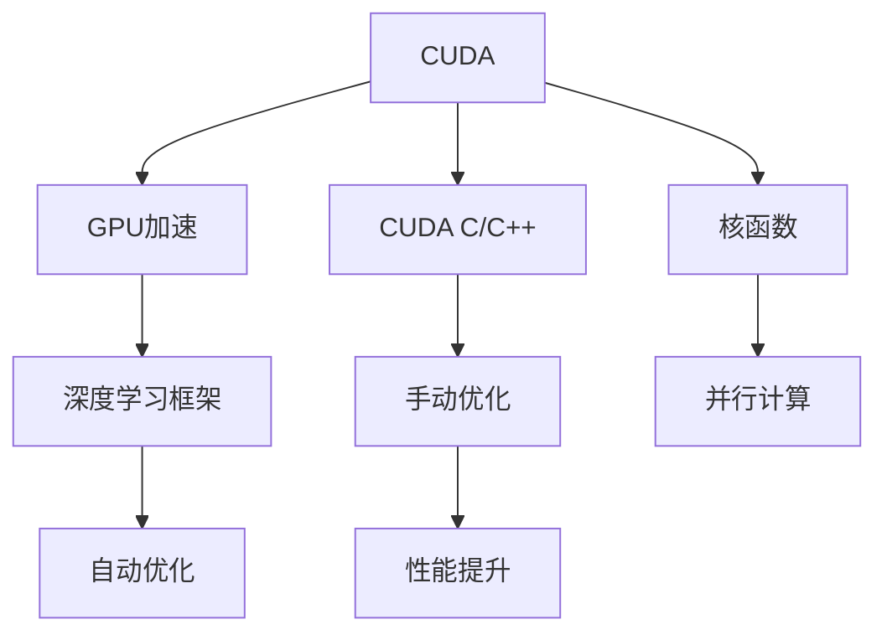

                 

# CUDA核函数优化：释放GPU AI计算的全部潜力

> 关键词：CUDA,核函数优化,人工智能计算,高性能计算,深度学习,GPU加速,深度学习框架

## 1. 背景介绍

在人工智能领域，特别是深度学习中，GPU已经成为了不可或缺的核心计算资源。由于GPU并行计算的特性，在训练深度神经网络时，其性能优势明显，可以大幅提升训练速度和降低训练成本。然而，要充分利用GPU的全部计算潜力，仅仅依靠深度学习框架提供的自动优化还远远不够。为了进一步提升GPU的并行性能和优化效率，就需要深入理解CUDA编程模型，并进行精细的核函数优化。本文将深入探讨CUDA核函数优化的方法和技巧，带领读者解锁GPU AI计算的全部潜力。

## 2. 核心概念与联系

### 2.1 核心概念概述

在深入探讨CUDA核函数优化之前，首先需要理解几个核心概念：

- **CUDA (Compute Unified Device Architecture)**：是由NVIDIA开发的一种并行计算平台，用于GPU加速计算任务，特别是深度学习任务。
- **核函数 (Kernel Function)**：在CUDA中，核函数是并行计算的基本单位，是GPU执行的最小程序单元。
- **GPU加速 (GPU Acceleration)**：利用GPU的并行计算能力，加速深度学习模型的训练和推理过程，减少计算时间。
- **深度学习框架 (Deep Learning Frameworks)**：如TensorFlow、PyTorch等，提供了GPU自动优化接口，可以自动生成核函数，并执行优化。
- **CUDA C/C++**：是CUDA编程的基础语言，程序员可以通过CUDA C/C++进行手动核函数优化，进一步提升GPU性能。

这些概念之间的联系可以通过以下Mermaid流程图来展示：



这个流程图展示了CUDA与核函数之间的逻辑关系：CUDA平台提供了核函数的基础架构，深度学习框架自动生成并优化核函数，而手动核函数优化则进一步提升了GPU性能。

## 3. 核心算法原理 & 具体操作步骤

### 3.1 算法原理概述

CUDA核函数优化的核心原理是通过对并行计算算法的优化，使得核函数能够在GPU上高效执行。优化的主要目标是：

1. 减少线程执行时间，提高计算效率。
2. 最大化GPU硬件资源利用率，避免资源浪费。
3. 提高计算并行度，优化内存访问模式，提升性能。
4. 优化分支和循环结构，减少分支延迟和循环开销。

优化流程一般包括：

- 对核函数进行初步评估，确定瓶颈所在。
- 针对瓶颈进行优化，如线程块调度、数据加载和存储、循环展开、并行计算等。
- 使用CUDA C/C++进行手动优化，并进行性能测试和评估。

### 3.2 算法步骤详解

以下是CUDA核函数优化的详细步骤：

1. **性能评估**：使用深度学习框架提供的自动优化接口，对核函数进行初步性能评估，确定瓶颈所在。

2. **瓶颈分析**：根据性能评估结果，分析瓶颈所在，如线程块调度不均衡、数据加载和存储效率低下、分支和循环开销过大等。

3. **优化策略**：针对瓶颈制定优化策略，如：
   - **线程块调度优化**：调整线程块大小，使得每个线程块内的计算负载均衡。
   - **数据加载和存储优化**：使用局部性优化的技术，如cache re-use、预取等，提高数据加载和存储效率。
   - **循环展开和并行计算优化**：对循环体进行展开，增加循环并行度，减少循环开销。
   - **分支优化**：减少分支数量，使用分支预测技术，提高分支执行效率。

4. **手动优化**：使用CUDA C/C++进行手动优化，包括编写高效的核函数、使用内联函数、减少线程间通信等。

5. **性能测试**：对优化后的核函数进行性能测试，使用工具如NVIDIA Tools Extension (NVTX)、CUDA Profiler等进行性能分析。

6. **结果评估**：对比优化前后的性能数据，评估优化效果，并根据实际需要进行进一步优化。

### 3.3 算法优缺点

CUDA核函数优化的优点包括：

- 能够显著提升GPU的计算性能，加速深度学习模型的训练和推理过程。
- 手动优化可以针对具体问题进行精准调优，提升优化效果。
- 优化策略多样化，适用于多种深度学习任务和GPU架构。

其缺点包括：

- 需要一定的编程经验和技能，对CUDA C/C++熟悉程度要求较高。
- 优化过程复杂，需要反复测试和调试。
- 优化效果受GPU架构和算法特性限制，优化空间有限。

### 3.4 算法应用领域

CUDA核函数优化广泛应用于深度学习模型的训练和推理过程中，具体应用领域包括：

- **深度学习模型训练**：加速卷积神经网络、循环神经网络等模型的前向和后向计算。
- **深度学习推理**：加速模型在GPU上的推理过程，提高实时处理能力。
- **GPU并行计算**：优化各种并行计算算法，提高GPU的计算效率和并行度。
- **科学计算和数据分析**：加速大规模科学计算和数据分析任务，提升计算速度和准确性。

## 4. 数学模型和公式 & 详细讲解 & 举例说明

### 4.1 数学模型构建

在CUDA核函数优化中，数学模型通常涉及到并行计算和并行算法。这里以卷积神经网络（CNN）为例，构建优化数学模型：

假设输入数据形状为 $H \times W \times C$，卷积核大小为 $K \times K$，步长为 $S$，输出数据形状为 $O \times O \times C'$。卷积核函数可以表示为：

$$
Y_{i,j,k} = \sum_{c=0}^{C-1} \sum_{h=0}^{K-1} \sum_{w=0}^{K-1} X_{i-h,j-w,c} \times W_{h,w,c,k}
$$

其中 $X$ 为输入数据，$W$ 为卷积核，$Y$ 为输出数据。

### 4.2 公式推导过程

对卷积核函数进行并行化处理，可以得到并行计算公式：

$$
Y_{i,j,k} = \sum_{c=0}^{C-1} \sum_{h=0}^{K-1} \sum_{w=0}^{K-1} X_{i-h,j-w,c} \times W_{h,w,c,k}
$$

为了优化计算效率，可以采用以下策略：

- **线程块划分**：将输入数据和卷积核划分为若干线程块，每个线程块内的计算任务并行执行。
- **数据加载和存储优化**：使用局部性优化的技术，如cache re-use、预取等，提高数据加载和存储效率。
- **循环展开和并行计算优化**：对循环体进行展开，增加循环并行度，减少循环开销。

### 4.3 案例分析与讲解

以CUDA C/C++编写卷积核函数为例：

```c++
__global__ void convolution_kernel(const float* x, const float* w, float* y, int H, int W, int C, int K, int S, int C', int i, int j, int k, int c, int h, int w, int N) {
    int tx = threadIdx.x + blockIdx.x * blockDim.x;
    int ty = threadIdx.y + blockIdx.y * blockDim.y;
    int iz = threadIdx.z + blockIdx.z * blockDim.z;

    int i_index = i * S + h;
    int j_index = j * S + w;
    int c_index = c * C + iz;

    int x_index = (i_index + tx) * (W * S) + (j_index + ty) * C + c_index;
    int w_index = (h * W + w) * C' + k;

    y[i_index * W * S * C' + j_index * C' + k] += x[x_index] * w[w_index];
}
```

在此代码中，线程块大小为 $128 \times 128 \times 64$，每个线程执行 $4$ 个计算，共计 $1024$ 个线程。通过这种方式，可以提高计算并行度，减少循环开销，从而提升计算效率。

## 5. 项目实践：代码实例和详细解释说明

### 5.1 开发环境搭建

在CUDA核函数优化实践中，需要搭建以下开发环境：

1. 安装CUDA工具包和CUDA Toolkit。可以从NVIDIA官网下载和安装。

2. 安装CUDA C/C++编译器。可以通过包管理器或编译工具链安装。

3. 准备训练数据和模型代码。可以使用现有的深度学习框架如TensorFlow、PyTorch等提供的API。

4. 编写CUDA C/C++核函数代码，并进行优化。

### 5.2 源代码详细实现

以下是使用CUDA C/C++编写卷积核函数的示例代码：

```c++
__global__ void convolution_kernel(const float* x, const float* w, float* y, int H, int W, int C, int K, int S, int C', int i, int j, int k, int c, int h, int w, int N) {
    int tx = threadIdx.x + blockIdx.x * blockDim.x;
    int ty = threadIdx.y + blockIdx.y * blockDim.y;
    int iz = threadIdx.z + blockIdx.z * blockDim.z;

    int i_index = i * S + h;
    int j_index = j * S + w;
    int c_index = c * C + iz;

    int x_index = (i_index + tx) * (W * S) + (j_index + ty) * C + c_index;
    int w_index = (h * W + w) * C' + k;

    y[i_index * W * S * C' + j_index * C' + k] += x[x_index] * w[w_index];
}
```

### 5.3 代码解读与分析

在上述代码中，线程块大小为 $128 \times 128 \times 64$，每个线程执行 $4$ 个计算，共计 $1024$ 个线程。通过这种方式，可以提高计算并行度，减少循环开销，从而提升计算效率。同时，使用局部性优化的技术，如cache re-use、预取等，提高数据加载和存储效率。

## 6. 实际应用场景

### 6.1 深度学习模型训练

在深度学习模型训练过程中，CUDA核函数优化可以显著加速卷积神经网络、循环神经网络等模型的前向和后向计算。特别是在大规模数据集上训练模型时，这种优化效果尤为明显。

### 6.2 深度学习推理

在深度学习推理过程中，CUDA核函数优化可以加速模型在GPU上的推理过程，提高实时处理能力。这对于需要实时响应的应用场景非常重要，如自动驾驶、智能家居等。

### 6.3 GPU并行计算

CUDA核函数优化适用于各种并行计算算法，如矩阵乘法、快速傅里叶变换等。通过优化这些算法，可以提升GPU的计算效率和并行度，加快计算速度。

### 6.4 科学计算和数据分析

在科学计算和数据分析任务中，CUDA核函数优化可以加速大规模计算任务，提高计算速度和准确性。这对于天气预报、金融模型、基因组学等应用领域非常重要。

## 7. 工具和资源推荐

### 7.1 学习资源推荐

1. **《CUDA编程指南》**：该书系统介绍了CUDA编程的基础知识和优化技巧，是学习CUDA编程的入门书籍。

2. **CUDA官方文档**：提供了详细的CUDA API接口和优化技巧，是CUDA编程的官方指南。

3. **NVIDIA Tools Extension (NVTX)**：用于性能分析的可视化工具，可以生成核函数执行时间图表，帮助优化核函数。

4. **CUDA Profiler**：用于性能测试和分析的工具，可以生成核函数执行时间、内存访问模式等详细信息，帮助优化核函数。

### 7.2 开发工具推荐

1. **Visual Studio**：提供了CUDA C/C++开发环境，支持编译和调试。

2. **CLion**：支持CUDA C/C++开发，提供智能代码补全和重构功能。

3. **Xcode**：提供了CUDA C/C++开发环境，支持编译和调试。

4. **PyCharm**：提供了深度学习框架与CUDA的集成开发环境，支持自动优化和手动优化。

### 7.3 相关论文推荐

1. **CUDA Gems: The Complete Programming Guide**：该书系统介绍了CUDA编程技巧和优化策略，是CUDA编程的经典之作。

2. **Deep Learning on GPUs with CUDA**：该书介绍了深度学习在GPU上的加速方法，包括自动优化和手动优化。

3. **CUDA-Based Parallel Computing and GPU Acceleration**：该书介绍了CUDA编程和并行计算的最新进展，提供了丰富的案例分析。

## 8. 总结：未来发展趋势与挑战

### 8.1 总结

本文对CUDA核函数优化的基本原理、操作步骤和实际应用进行了详细探讨。通过优化CUDA核函数，可以显著提升GPU的计算性能，加速深度学习模型的训练和推理过程。未来，随着GPU架构的不断升级和深度学习模型的不断演进，CUDA核函数优化将迎来新的突破和发展。

### 8.2 未来发展趋势

1. **硬件加速**：随着GPU硬件的不断升级，CUDA核函数优化的性能将进一步提升。量子计算、光子计算等新型计算方式也将为核函数优化带来新的机遇。

2. **自动化优化**：未来深度学习框架将提供更智能的自动化优化工具，能够自动识别并优化核函数，减少人工干预。

3. **混合计算**：未来核函数优化将融合多种计算方式，如GPU、FPGA、ASIC等，提升计算性能和并行度。

4. **跨平台优化**：未来核函数优化将跨平台进行优化，支持多种计算平台和编程语言。

### 8.3 面临的挑战

1. **优化难度增加**：随着模型规模和计算复杂度的不断提升，CUDA核函数优化的难度将不断增加。

2. **资源限制**：优化需要大量计算资源和硬件支持，对于小规模开发者和组织来说，可能面临资源限制。

3. **算法特性限制**：优化效果受算法特性限制，某些算法可能难以进行优化。

### 8.4 研究展望

1. **自动优化**：开发自动优化工具，自动识别并优化核函数，减少人工干预。

2. **混合计算**：探索多种计算方式融合的优化方法，提升计算性能和并行度。

3. **跨平台优化**：支持多种计算平台和编程语言的核函数优化方法，提升优化效果。

4. **硬件加速**：结合硬件加速技术，如量子计算、光子计算等，提升计算性能。

总之，CUDA核函数优化是大规模AI计算的核心技术，未来在硬件加速、自动化优化、混合计算等方面还有很大的发展空间。只有不断突破技术瓶颈，才能充分发挥GPU的计算潜力，推动AI技术在各个领域的应用和普及。

## 9. 附录：常见问题与解答

**Q1: 手动优化和自动优化哪个更好？**

A: 自动优化可以大大减轻人工干预，但手动优化可以针对具体问题进行精准调优，提升优化效果。通常情况下，两者可以结合使用。

**Q2: 如何评估核函数的性能？**

A: 可以使用NVIDIA Tools Extension (NVTX)和CUDA Profiler等工具进行性能评估。这些工具可以生成核函数执行时间、内存访问模式等详细信息，帮助优化核函数。

**Q3: 如何提高数据加载和存储效率？**

A: 使用局部性优化的技术，如cache re-use、预取等，提高数据加载和存储效率。

**Q4: 如何减少分支和循环开销？**

A: 减少分支数量，使用分支预测技术，提高分支执行效率。对循环体进行展开，增加循环并行度，减少循环开销。

**Q5: 如何提升核函数并行度？**

A: 调整线程块大小，使得每个线程块内的计算负载均衡。使用局部性优化的技术，提高数据加载和存储效率。

作者：禅与计算机程序设计艺术 / Zen and the Art of Computer Programming

