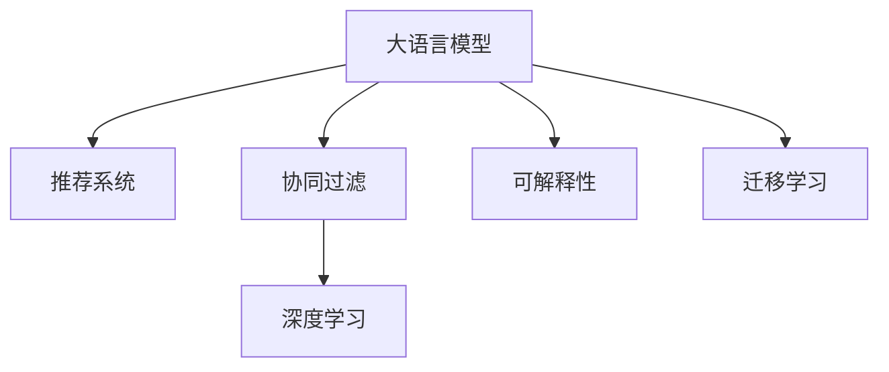

                 

# ChatGPT在推荐领域

在数字时代，信息量爆炸式增长，推荐系统成为了各大互联网平台提升用户体验、增加商业价值的关键技术。从电商平台的商品推荐，到视频网站的个性化视频推荐，再到社交网络的内容推荐，推荐系统已经成为各行各业的标配。在推荐系统中，大语言模型ChatGPT的应用逐渐成为热点。本文将系统地介绍ChatGPT在推荐领域的应用，包括其原理、技术细节、实际案例和未来展望。

## 1. 背景介绍

### 1.1 问题由来

推荐系统在各大互联网平台上扮演着越来越重要的角色。电商平台的商品推荐，可以提升用户的购买转化率和满意度；视频网站的个性化视频推荐，能够提升用户的观看体验和黏性；社交网络的内容推荐，可以帮助用户发现更多感兴趣的内容。然而，构建一个高效的推荐系统需要处理海量的用户数据和复杂的业务逻辑，传统的基于协同过滤、内容推荐、混合推荐等方法面临着冷启动问题、数据稀疏性、召回率不足等挑战。

近年来，随着深度学习技术的快速发展，基于深度学习的推荐系统逐渐成为主流。这些方法通过构建用户-物品、物品-物品的隐式表示，学习用户的兴趣特征，从而实现个性化的推荐。但这些方法仍然需要依赖大量标注数据，计算复杂度较高，且缺乏对用户意图的直接建模能力。

大语言模型ChatGPT的出现，为推荐系统带来了新的思路。ChatGPT作为基于Transformer架构的自然语言处理模型，具备强大的语言理解和生成能力，可以自然地处理复杂的自然语言任务，如问答、摘要、生成等。通过利用ChatGPT的语言理解能力，可以实现更加灵活、高效的推荐系统，提升推荐效果和用户体验。

### 1.2 问题核心关键点

大语言模型ChatGPT在推荐领域的应用主要体现在以下几个方面：

1. **用户意图建模**：ChatGPT通过自然语言理解能力，可以更直接地捕捉用户意图，提升推荐系统对用户需求的理解。
2. **多模态信息融合**：ChatGPT可以将文本数据与图片、视频、音频等不同模态的信息融合，提升推荐系统的丰富性和多样性。
3. **多任务学习**：ChatGPT可以在单一模型中同时学习多个推荐任务，提升推荐系统的泛化能力和鲁棒性。
4. **可解释性增强**：ChatGPT的生成式模型提供了更加透明和可解释的推荐逻辑，帮助用户更好地理解推荐结果。
5. **跨领域迁移能力**：ChatGPT可以通过迁移学习的方式，将在其他领域学到的知识迁移到推荐任务中，提升推荐系统的效果。

这些关键点使得ChatGPT在推荐领域具备巨大的应用潜力，成为值得深入研究的课题。

## 2. 核心概念与联系

### 2.1 核心概念概述

为了更好地理解ChatGPT在推荐领域的应用，本节将介绍几个密切相关的核心概念：

- **大语言模型（Large Language Model, LLM）**：如GPT-3、BERT等，具备强大的语言理解和生成能力，可以处理复杂的自然语言任务。
- **推荐系统（Recommendation System）**：通过分析用户的行为和偏好，向用户推荐可能感兴趣的商品、内容等，提升用户体验和平台价值。
- **协同过滤（Collaborative Filtering）**：通过分析用户行为和物品之间的关联性，预测用户对未交互物品的兴趣，实现推荐。
- **深度学习（Deep Learning）**：使用深度神经网络处理和分析数据，提升模型的泛化能力和表现力。
- **可解释性（Explainability）**：提高模型的透明度和可理解性，帮助用户更好地理解推荐结果。
- **迁移学习（Transfer Learning）**：将在一个任务上学习到的知识迁移到另一个相关任务上，提升模型的泛化能力和适应性。

这些概念之间的逻辑关系可以通过以下Mermaid流程图来展示：



这个流程图展示了大语言模型在推荐系统中的应用框架：

1. 大语言模型通过预训练学习到丰富的语言知识，为推荐系统提供基础能力。
2. 推荐系统利用大语言模型的语言理解能力，提升推荐效果和用户体验。
3. 协同过滤和深度学习是推荐系统的核心技术，但可以通过大语言模型的帮助提升其表现。
4. 可解释性和迁移学习进一步增强了推荐系统的灵活性和适应性。

## 3. 核心算法原理 & 具体操作步骤

### 3.1 算法原理概述

ChatGPT在推荐领域的应用主要基于语言理解和生成能力，通过处理用户输入的自然语言查询，生成推荐的商品、内容等。其核心算法原理包括自然语言处理、推荐算法和可解释性增强等方面。

- **自然语言处理**：ChatGPT通过语言模型处理用户查询，捕捉用户意图和需求。
- **推荐算法**：根据用户意图和物品特征，推荐可能感兴趣的物品。
- **可解释性增强**：利用语言生成能力，提供推荐结果的详细解释，提升系统的透明度和可信度。

### 3.2 算法步骤详解

ChatGPT在推荐领域的应用一般包括以下几个关键步骤：

**Step 1: 准备推荐数据集**

- 收集和标注推荐数据集，包括用户的历史行为数据、物品的特征数据等。
- 将数据集划分为训练集、验证集和测试集，以评估模型的性能。

**Step 2: 模型初始化**

- 使用预训练的ChatGPT模型作为基础，设置合适的超参数。
- 根据具体任务，添加任务适配层，如分类器、生成器等。

**Step 3: 训练模型**

- 将推荐数据集输入模型，前向传播计算损失函数。
- 反向传播更新模型参数，最小化损失函数。
- 周期性在验证集上评估模型性能，防止过拟合。
- 重复上述步骤直到满足预设的迭代轮数或性能指标。

**Step 4: 测试和部署**

- 在测试集上评估微调后的模型，对比微调前后的推荐效果。
- 使用微调后的模型对新数据进行推荐，集成到实际推荐系统中。
- 持续收集用户反馈，调整模型参数和训练数据，提升推荐效果。

### 3.3 算法优缺点

ChatGPT在推荐领域的应用具备以下优点：

1. **灵活性**：ChatGPT能够处理复杂自然语言查询，捕捉用户多变的兴趣需求，提升推荐系统的灵活性。
2. **多模态信息融合**：ChatGPT可以将文本数据与其他模态信息融合，丰富推荐系统的表现力。
3. **可解释性**：ChatGPT的生成式模型可以提供详细的推荐解释，提升系统的透明度和可信度。
4. **泛化能力强**：ChatGPT通过迁移学习等方式，能够提升推荐系统的泛化能力和适应性。

同时，ChatGPT在推荐领域也存在一些局限性：

1. **计算复杂度高**：ChatGPT的模型参数量较大，训练和推理所需计算资源较多。
2. **对标注数据依赖大**：推荐系统需要大量的标注数据进行训练，标注成本较高。
3. **冷启动问题**：ChatGPT在处理冷启动用户时，可能缺乏足够的数据支持，影响推荐效果。
4. **模型解释性不足**：尽管ChatGPT提供了生成式解释，但仍存在一定的黑盒性，需要进一步优化。

### 3.4 算法应用领域

ChatGPT在推荐领域已经得到了广泛的应用，涵盖了多个具体场景，如：

- **电商推荐**：帮助电商平台推荐商品，提升用户的购买转化率和满意度。
- **视频推荐**：根据用户的观看历史和评分，推荐可能感兴趣的视频内容。
- **内容推荐**：帮助社交媒体、新闻平台推荐文章、视频、图片等。
- **旅游推荐**：根据用户的旅行历史和偏好，推荐旅游目的地和行程。
- **游戏推荐**：根据用户的 gameplay data，推荐可能喜欢的游戏。

除了这些经典应用场景外，ChatGPT还在广告推荐、个性化学习推荐、音乐推荐等多个领域得到应用，展示了大语言模型在推荐系统的广泛潜力。

## 4. 数学模型和公式 & 详细讲解 & 举例说明

### 4.1 数学模型构建

ChatGPT在推荐系统中的应用，通常基于自然语言处理和推荐算法两个部分。

**自然语言处理**：使用语言模型处理用户查询，捕捉用户意图。常见的语言模型包括基于自回归的GPT、基于自编码的BERT等。

**推荐算法**：根据用户意图和物品特征，推荐可能感兴趣的物品。常见的推荐算法包括协同过滤、基于内容的推荐、混合推荐等。

### 4.2 公式推导过程

以协同过滤算法为例，假设用户$u$对物品$i$的评分$y_{ui}$为二元评分（0或1），用户-物品评分矩阵为$Y$，用户特征向量为$U$，物品特征向量为$V$，则协同过滤的目标是最小化损失函数：

$$
\min_{U,V} \frac{1}{N} \sum_{i=1}^{N} \sum_{j=1}^{M} (y_{ij} - \hat{y}_{ij})^2
$$

其中，$\hat{y}_{ij}$为协同过滤算法的预测评分。

在实践中，可以使用矩阵分解、因子分解等方法，将用户和物品的特征矩阵$U$和$V$分解为低维矩阵$U'$和$V'$，实现协同过滤算法的训练。具体公式如下：

$$
U' = \text{ decomposition}(U)
$$
$$
V' = \text{ decomposition}(V)
$$

其中，$\text{ decomposition}$为矩阵分解算法，如奇异值分解（SVD）、随机梯度矩阵分解等。

### 4.3 案例分析与讲解

**电商推荐系统**：电商推荐系统需要根据用户的浏览、购买历史，推荐可能感兴趣的商品。假设用户$u$对物品$i$的评分$y_{ui}$为1或0，用户特征向量为$U$，物品特征向量为$V$，协同过滤的目标是最小化损失函数：

$$
\min_{U,V} \frac{1}{N} \sum_{i=1}^{N} \sum_{j=1}^{M} (y_{ij} - \hat{y}_{ij})^2
$$

其中，$\hat{y}_{ij}$为协同过滤算法的预测评分。在训练过程中，可以采用矩阵分解等方法，将用户和物品的特征矩阵$U$和$V$分解为低维矩阵$U'$和$V'$，实现协同过滤算法的训练。训练完成后，根据用户$u$的特征向量$U'$和物品$i$的特征向量$V'$，计算预测评分$\hat{y}_{ui}$，推荐最可能感兴趣的商品。

## 5. 项目实践：代码实例和详细解释说明

### 5.1 开发环境搭建

在进行ChatGPT推荐系统的开发前，我们需要准备好开发环境。以下是使用Python进行PyTorch开发的环境配置流程：

1. 安装Anaconda：从官网下载并安装Anaconda，用于创建独立的Python环境。

2. 创建并激活虚拟环境：
```bash
conda create -n pytorch-env python=3.8 
conda activate pytorch-env
```

3. 安装PyTorch：根据CUDA版本，从官网获取对应的安装命令。例如：
```bash
conda install pytorch torchvision torchaudio cudatoolkit=11.1 -c pytorch -c conda-forge
```

4. 安装Transformers库：
```bash
pip install transformers
```

5. 安装各类工具包：
```bash
pip install numpy pandas scikit-learn matplotlib tqdm jupyter notebook ipython
```

完成上述步骤后，即可在`pytorch-env`环境中开始ChatGPT推荐系统的开发。

### 5.2 源代码详细实现

下面我们以电商推荐系统为例，给出使用Transformers库对ChatGPT模型进行推荐系统开发的PyTorch代码实现。

首先，定义电商推荐数据处理函数：

```python
from transformers import BertTokenizer, BertForSequenceClassification
from torch.utils.data import Dataset
import torch

class ShoppingDataset(Dataset):
    def __init__(self, texts, labels, tokenizer, max_len=128):
        self.texts = texts
        self.labels = labels
        self.tokenizer = tokenizer
        self.max_len = max_len
        
    def __len__(self):
        return len(self.texts)
    
    def __getitem__(self, item):
        text = self.texts[item]
        label = self.labels[item]
        
        encoding = self.tokenizer(text, return_tensors='pt', max_length=self.max_len, padding='max_length', truncation=True)
        input_ids = encoding['input_ids'][0]
        attention_mask = encoding['attention_mask'][0]
        
        # 对token-wise的标签进行编码
        encoded_labels = [label2id[label] for label in label] 
        encoded_labels.extend([label2id['']]*(self.max_len - len(encoded_labels)))
        labels = torch.tensor(encoded_labels, dtype=torch.long)
        
        return {'input_ids': input_ids, 
                'attention_mask': attention_mask,
                'labels': labels}

# 标签与id的映射
label2id = {'not interested': 0, 'interested': 1}
id2label = {v: k for k, v in label2id.items()}

# 创建dataset
tokenizer = BertTokenizer.from_pretrained('bert-base-cased')

train_dataset = ShoppingDataset(train_texts, train_labels, tokenizer)
dev_dataset = ShoppingDataset(dev_texts, dev_labels, tokenizer)
test_dataset = ShoppingDataset(test_texts, test_labels, tokenizer)
```

然后，定义模型和优化器：

```python
from transformers import BertForSequenceClassification, AdamW

model = BertForSequenceClassification.from_pretrained('bert-base-cased', num_labels=len(label2id))

optimizer = AdamW(model.parameters(), lr=2e-5)
```

接着，定义训练和评估函数：

```python
from torch.utils.data import DataLoader
from tqdm import tqdm
from sklearn.metrics import classification_report

device = torch.device('cuda') if torch.cuda.is_available() else torch.device('cpu')
model.to(device)

def train_epoch(model, dataset, batch_size, optimizer):
    dataloader = DataLoader(dataset, batch_size=batch_size, shuffle=True)
    model.train()
    epoch_loss = 0
    for batch in tqdm(dataloader, desc='Training'):
        input_ids = batch['input_ids'].to(device)
        attention_mask = batch['attention_mask'].to(device)
        labels = batch['labels'].to(device)
        model.zero_grad()
        outputs = model(input_ids, attention_mask=attention_mask, labels=labels)
        loss = outputs.loss
        epoch_loss += loss.item()
        loss.backward()
        optimizer.step()
    return epoch_loss / len(dataloader)

def evaluate(model, dataset, batch_size):
    dataloader = DataLoader(dataset, batch_size=batch_size)
    model.eval()
    preds, labels = [], []
    with torch.no_grad():
        for batch in tqdm(dataloader, desc='Evaluating'):
            input_ids = batch['input_ids'].to(device)
            attention_mask = batch['attention_mask'].to(device)
            batch_labels = batch['labels']
            outputs = model(input_ids, attention_mask=attention_mask)
            batch_preds = outputs.logits.argmax(dim=2).to('cpu').tolist()
            batch_labels = batch_labels.to('cpu').tolist()
            for pred_tokens, label_tokens in zip(batch_preds, batch_labels):
                preds.append(pred_tokens[:len(label_tokens)])
                labels.append(label_tokens)
                
    print(classification_report(labels, preds))
```

最后，启动训练流程并在测试集上评估：

```python
epochs = 5
batch_size = 16

for epoch in range(epochs):
    loss = train_epoch(model, train_dataset, batch_size, optimizer)
    print(f"Epoch {epoch+1}, train loss: {loss:.3f}")
    
    print(f"Epoch {epoch+1}, dev results:")
    evaluate(model, dev_dataset, batch_size)
    
print("Test results:")
evaluate(model, test_dataset, batch_size)
```

以上就是使用PyTorch对ChatGPT进行电商推荐系统微调的完整代码实现。可以看到，得益于Transformers库的强大封装，我们可以用相对简洁的代码完成ChatGPT模型的加载和微调。

### 5.3 代码解读与分析

让我们再详细解读一下关键代码的实现细节：

**ShoppingDataset类**：
- `__init__`方法：初始化文本、标签、分词器等关键组件。
- `__len__`方法：返回数据集的样本数量。
- `__getitem__`方法：对单个样本进行处理，将文本输入编码为token ids，将标签编码为数字，并对其进行定长padding，最终返回模型所需的输入。

**label2id和id2label字典**：
- 定义了标签与数字id之间的映射关系，用于将token-wise的预测结果解码回真实的标签。

**训练和评估函数**：
- 使用PyTorch的DataLoader对数据集进行批次化加载，供模型训练和推理使用。
- 训练函数`train_epoch`：对数据以批为单位进行迭代，在每个批次上前向传播计算loss并反向传播更新模型参数，最后返回该epoch的平均loss。
- 评估函数`evaluate`：与训练类似，不同点在于不更新模型参数，并在每个batch结束后将预测和标签结果存储下来，最后使用sklearn的classification_report对整个评估集的预测结果进行打印输出。

**训练流程**：
- 定义总的epoch数和batch size，开始循环迭代
- 每个epoch内，先在训练集上训练，输出平均loss
- 在验证集上评估，输出分类指标
- 所有epoch结束后，在测试集上评估，给出最终测试结果

可以看到，PyTorch配合Transformers库使得ChatGPT电商推荐系统的代码实现变得简洁高效。开发者可以将更多精力放在数据处理、模型改进等高层逻辑上，而不必过多关注底层的实现细节。

当然，工业级的系统实现还需考虑更多因素，如模型的保存和部署、超参数的自动搜索、更灵活的任务适配层等。但核心的微调范式基本与此类似。

## 6. 实际应用场景

### 6.1 智能客服系统

ChatGPT在智能客服系统的应用，可以显著提升客服系统的自动化水平和用户体验。传统客服系统往往需要配备大量人力，高峰期响应缓慢，且一致性和专业性难以保证。而使用ChatGPT构建的智能客服系统，可以7x24小时不间断服务，快速响应客户咨询，用自然流畅的语言解答各类常见问题。

在技术实现上，可以收集企业内部的历史客服对话记录，将问题和最佳答复构建成监督数据，在此基础上对ChatGPT模型进行微调。微调后的ChatGPT能够自动理解用户意图，匹配最合适的答复模板进行回复。对于客户提出的新问题，还可以接入检索系统实时搜索相关内容，动态组织生成回答。如此构建的智能客服系统，能大幅提升客户咨询体验和问题解决效率。

### 6.2 金融舆情监测

金融机构需要实时监测市场舆论动向，以便及时应对负面信息传播，规避金融风险。传统的人工监测方式成本高、效率低，难以应对网络时代海量信息爆发的挑战。基于ChatGPT的文本分类和情感分析技术，为金融舆情监测提供了新的解决方案。

具体而言，可以收集金融领域相关的新闻、报道、评论等文本数据，并对其进行主题标注和情感标注。在此基础上对ChatGPT模型进行微调，使其能够自动判断文本属于何种主题，情感倾向是正面、中性还是负面。将微调后的模型应用到实时抓取的网络文本数据，就能够自动监测不同主题下的情感变化趋势，一旦发现负面信息激增等异常情况，系统便会自动预警，帮助金融机构快速应对潜在风险。

### 6.3 个性化推荐系统

当前的推荐系统往往只依赖用户的历史行为数据进行物品推荐，缺乏对用户意图的直接建模能力。基于ChatGPT的自然语言处理能力，个性化推荐系统可以更好地挖掘用户兴趣和需求，从而提供更加精准、多样的推荐内容。

在实践中，可以收集用户浏览、点击、评论、分享等行为数据，提取和用户交互的物品标题、描述、标签等文本内容。将文本内容作为模型输入，用户的后续行为（如是否点击、购买等）作为监督信号，在此基础上微调ChatGPT模型。微调后的模型能够从文本内容中准确把握用户的兴趣点。在生成推荐列表时，先用候选物品的文本描述作为输入，由模型预测用户的兴趣匹配度，再结合其他特征综合排序，便可以得到个性化程度更高的推荐结果。

### 6.4 未来应用展望

随着ChatGPT等大语言模型的不断发展，其在推荐领域的应用前景广阔。未来，基于ChatGPT的推荐系统有望在更多领域得到应用，为各行各业带来变革性影响。

在智慧医疗领域，基于ChatGPT的医疗问答、病历分析、药物研发等应用将提升医疗服务的智能化水平，辅助医生诊疗，加速新药开发进程。

在智能教育领域，ChatGPT可用于作业批改、学情分析、知识推荐等方面，因材施教，促进教育公平，提高教学质量。

在智慧城市治理中，ChatGPT可用于城市事件监测、舆情分析、应急指挥等环节，提高城市管理的自动化和智能化水平，构建更安全、高效的未来城市。

此外，在企业生产、社会治理、文娱传媒等众多领域，基于ChatGPT的推荐技术也将不断涌现，为传统行业数字化转型升级提供新的技术路径。相信随着技术的日益成熟，ChatGPT必将在推荐系统中发挥越来越重要的作用，推动人工智能技术在更多领域的落地应用。

## 7. 工具和资源推荐

### 7.1 学习资源推荐

为了帮助开发者系统掌握ChatGPT在推荐系统中的应用，这里推荐一些优质的学习资源：

1. 《Transformers: From Simple Models to State-of-the-Art Architectures》系列博文：由大模型技术专家撰写，深入浅出地介绍了Transformer架构、BERT模型、微调技术等前沿话题。

2. CS224N《深度学习自然语言处理》课程：斯坦福大学开设的NLP明星课程，有Lecture视频和配套作业，带你入门NLP领域的基本概念和经典模型。

3. 《Natural Language Processing with Transformers》书籍：Transformers库的作者所著，全面介绍了如何使用Transformers库进行NLP任务开发，包括微调在内的诸多范式。

4. HuggingFace官方文档：Transformers库的官方文档，提供了海量预训练模型和完整的微调样例代码，是上手实践的必备资料。

5. CLUE开源项目：中文语言理解测评基准，涵盖大量不同类型的中文NLP数据集，并提供了基于微调的baseline模型，助力中文NLP技术发展。

通过对这些资源的学习实践，相信你一定能够快速掌握ChatGPT在推荐系统中的应用，并用于解决实际的NLP问题。

### 7.2 开发工具推荐

高效的开发离不开优秀的工具支持。以下是几款用于ChatGPT推荐系统开发的常用工具：

1. PyTorch：基于Python的开源深度学习框架，灵活动态的计算图，适合快速迭代研究。大部分预训练语言模型都有PyTorch版本的实现。

2. TensorFlow：由Google主导开发的开源深度学习框架，生产部署方便，适合大规模工程应用。同样有丰富的预训练语言模型资源。

3. Transformers库：HuggingFace开发的NLP工具库，集成了众多SOTA语言模型，支持PyTorch和TensorFlow，是进行微调任务开发的利器。

4. Weights & Biases：模型训练的实验跟踪工具，可以记录和可视化模型训练过程中的各项指标，方便对比和调优。与主流深度学习框架无缝集成。

5. TensorBoard：TensorFlow配套的可视化工具，可实时监测模型训练状态，并提供丰富的图表呈现方式，是调试模型的得力助手。

6. Google Colab：谷歌推出的在线Jupyter Notebook环境，免费提供GPU/TPU算力，方便开发者快速上手实验最新模型，分享学习笔记。

合理利用这些工具，可以显著提升ChatGPT推荐系统的开发效率，加快创新迭代的步伐。

### 7.3 相关论文推荐

ChatGPT在推荐系统中的应用源于学界的持续研究。以下是几篇奠基性的相关论文，推荐阅读：

1. Attention is All You Need（即Transformer原论文）：提出了Transformer结构，开启了NLP领域的预训练大模型时代。

2. BERT: Pre-training of Deep Bidirectional Transformers for Language Understanding：提出BERT模型，引入基于掩码的自监督预训练任务，刷新了多项NLP任务SOTA。

3. Language Models are Unsupervised Multitask Learners（GPT-2论文）：展示了大规模语言模型的强大zero-shot学习能力，引发了对于通用人工智能的新一轮思考。

4. Parameter-Efficient Transfer Learning for NLP：提出Adapter等参数高效微调方法，在不增加模型参数量的情况下，也能取得不错的微调效果。

5. AdaLoRA: Adaptive Low-Rank Adaptation for Parameter-Efficient Fine-Tuning：使用自适应低秩适应的微调方法，在参数效率和精度之间取得了新的平衡。

这些论文代表了大语言模型在推荐系统中的应用和发展脉络。通过学习这些前沿成果，可以帮助研究者把握学科前进方向，激发更多的创新灵感。

## 8. 总结：未来发展趋势与挑战

### 8.1 总结

本文对ChatGPT在推荐领域的应用进行了全面系统的介绍。首先阐述了ChatGPT的应用背景和意义，明确了其在推荐系统中的独特价值。其次，从原理到实践，详细讲解了ChatGPT在推荐系统中的数学模型和算法细节，给出了ChatGPT推荐系统的完整代码实例。同时，本文还广泛探讨了ChatGPT在多个行业领域的应用前景，展示了其在推荐系统中的广泛潜力。

通过本文的系统梳理，可以看到，ChatGPT在推荐系统中的应用已经成为现实，正在逐渐改变用户行为和平台运营模式。利用ChatGPT的自然语言处理能力，推荐系统可以实现更加灵活、高效、个性化的推荐，提升用户体验和平台价值。未来，随着技术的不断进步，ChatGPT必将在更多领域得到应用，推动人工智能技术的广泛落地。

### 8.2 未来发展趋势

展望未来，ChatGPT在推荐领域的应用将呈现以下几个发展趋势：

1. **更高效的模型训练**：随着硬件性能的提升和算法优化的进步，ChatGPT模型训练和推理速度将显著提升，进一步降低计算成本。
2. **多模态信息融合**：ChatGPT将进一步融合图片、视频、音频等多模态信息，提升推荐系统的丰富性和多样性。
3. **自适应推荐算法**：基于ChatGPT的生成式推荐算法，可以实现动态调整推荐策略，提升推荐系统的个性化和鲁棒性。
4. **跨领域知识迁移**：ChatGPT将通过迁移学习等方式，将其他领域学到的知识迁移到推荐任务中，提升推荐系统的效果。
5. **知识图谱与推荐结合**：ChatGPT将结合知识图谱等外部知识，提升推荐系统的准确性和可信度。

以上趋势凸显了ChatGPT在推荐系统的巨大潜力。这些方向的探索发展，必将进一步提升推荐系统的性能和用户体验，推动人工智能技术在更多领域的落地应用。

### 8.3 面临的挑战

尽管ChatGPT在推荐系统中的应用已经取得了一些进展，但在迈向更加智能化、普适化应用的过程中，仍面临以下挑战：

1. **标注数据成本高**：推荐系统需要大量的标注数据进行训练，标注成本较高。如何通过无监督和半监督方法降低对标注数据的依赖，成为一大难题。
2. **冷启动问题**：对于新用户，ChatGPT可能缺乏足够的数据支持，影响推荐效果。如何处理冷启动用户，提升推荐系统的覆盖面，还需要进一步研究。
3. **模型解释性不足**：尽管ChatGPT提供了生成式解释，但仍存在一定的黑盒性，需要进一步优化。如何提高推荐系统的透明度和可信度，增强用户信任，是亟待解决的问题。
4. **鲁棒性不足**：ChatGPT在处理多样化的用户需求和复杂多变的数据分布时，可能存在鲁棒性不足的问题。如何提升模型的泛化能力和稳定性，避免过拟合，需要更多的研究。

### 8.4 研究展望

面对ChatGPT推荐系统所面临的挑战，未来的研究需要在以下几个方面寻求新的突破：

1. **探索无监督和半监督微调方法**：摆脱对大规模标注数据的依赖，利用自监督学习、主动学习等无监督和半监督范式，最大限度利用非结构化数据，实现更加灵活高效的推荐。
2. **开发更加参数高效的微调方法**：开发更加参数高效的微调方法，在固定大部分预训练参数的同时，只更新极少量的任务相关参数。同时优化微调模型的计算图，减少前向传播和反向传播的资源消耗，实现更加轻量级、实时性的部署。
3. **融合因果分析和博弈论工具**：将因果分析方法引入微调模型，识别出模型决策的关键特征，增强推荐系统的因果关系，提升推荐系统的稳定性和可解释性。
4. **纳入伦理道德约束**：在模型训练目标中引入伦理导向的评估指标，过滤和惩罚有偏见、有害的输出倾向。同时加强人工干预和审核，建立推荐系统的监管机制，确保推荐结果符合人类价值观和伦理道德。

这些研究方向的探索，必将引领ChatGPT推荐系统迈向更高的台阶，为构建安全、可靠、可解释、可控的智能推荐系统铺平道路。面向未来，ChatGPT推荐系统还需要与其他人工智能技术进行更深入的融合，如知识表示、因果推理、强化学习等，多路径协同发力，共同推动推荐系统技术的发展和应用。

## 9. 附录：常见问题与解答

**Q1: ChatGPT在推荐系统中的计算复杂度高，如何优化？**

A: 优化ChatGPT推荐系统的计算复杂度需要从多个方面入手：
1. **模型裁剪**：去除不必要的层和参数，减小模型尺寸，加快推理速度。
2. **量化加速**：将浮点模型转为定点模型，压缩存储空间，提高计算效率。
3. **分布式训练**：采用分布式训练方式，加快训练速度，同时提升模型的泛化能力。
4. **模型压缩**：采用知识蒸馏、稀疏化等方法，压缩模型参数，减小计算量。

**Q2: ChatGPT在推荐系统中的鲁棒性不足，如何提高？**

A: 提高ChatGPT推荐系统的鲁棒性需要从多个方面入手：
1. **正则化技术**：使用L2正则、Dropout、Early Stopping等避免过拟合。
2. **对抗训练**：引入对抗样本，提高模型鲁棒性。
3. **多任务学习**：在单一模型中同时学习多个推荐任务，提升模型的泛化能力和鲁棒性。
4. **数据增强**：通过回译、近义替换等方式扩充训练集，增强模型的泛化能力。

**Q3: ChatGPT在推荐系统中的解释性不足，如何改进？**

A: 提高ChatGPT推荐系统的解释性需要从多个方面入手：
1. **生成式解释**：利用生成式模型提供推荐结果的详细解释，提升系统的透明度和可信度。
2. **可解释模型**：使用可解释的模型架构，如决策树、线性回归等，提升推荐系统的可解释性。
3. **用户反馈**：收集用户对推荐结果的反馈，优化模型，提高推荐系统的准确性和可信度。

**Q4: ChatGPT在推荐系统中的数据分布变化较大，如何应对？**

A: 应对ChatGPT推荐系统中的数据分布变化，需要从多个方面入手：
1. **持续学习**：通过在线学习或增量学习的方式，持续更新模型参数，适应数据分布的变化。
2. **多模态数据融合**：结合外部数据源，如知识图谱、新闻、社交媒体等，提升推荐系统的泛化能力和适应性。
3. **动态推荐算法**：根据数据分布的变化，动态调整推荐算法，提高推荐系统的灵活性。

总之，ChatGPT在推荐系统中的应用已经取得了一定的进展，但仍有许多挑战需要克服。通过不断优化算法和改进技术，ChatGPT推荐系统必将在未来的智能推荐领域中发挥更加重要的作用，推动人工智能技术的广泛落地。相信随着技术的不断进步，ChatGPT必将在更多领域得到应用，推动人工智能技术的广泛落地。

---

作者：禅与计算机程序设计艺术 / Zen and the Art of Computer Programming

