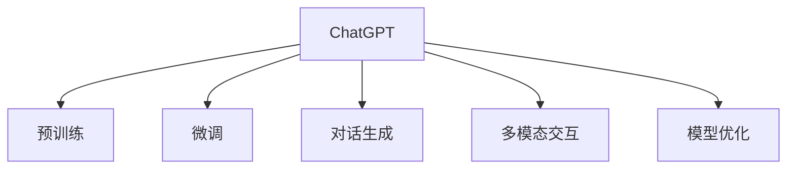

                 

# ChatGPT的诞生对AI行业的影响

> 关键词：ChatGPT,语言模型,自然语言处理(NLP),对话生成,深度学习,模型优化,应用场景

## 1. 背景介绍

### 1.1 问题由来

在过去数十年间，自然语言处理（NLP）技术经历了从基于规则的方法到统计学习，再到深度学习的演变。其中，深度学习方法尤其是基于神经网络的模型，在语音识别、文本分类、机器翻译等众多领域取得了突破性进展。然而，真正意义上将大语言模型推向普及的是OpenAI于2022年11月发布的GPT-3.5架构的ChatGPT模型。

ChatGPT通过其卓越的对话生成能力和丰富多样的应用场景，迅速成为引领AI行业变革的重要力量。与此同时，其背后的语言模型技术也对AI行业的多个领域带来了深远影响。本文旨在深入分析ChatGPT的诞生对AI行业的具体影响，并展望其未来发展趋势。

### 1.2 问题核心关键点

- **ChatGPT模型及其架构**：由GPT-3.5架构的Transformer模型驱动，具有强大的自回归语言建模能力，能够理解和生成复杂的人类语言。
- **预训练与微调技术**：通过在大规模无标签文本数据上的预训练，以及在下游任务上的微调，提升了模型的泛化能力和针对性。
- **多模态交互**：ChatGPT不仅可以进行文本对话，还支持图像、视频等多种媒体形式的交互，拓宽了AI的应用边界。
- **大规模部署**：ChatGPT模型的大规模部署，需要优化算法和硬件设施，以满足海量用户和任务需求。

## 2. 核心概念与联系

### 2.1 核心概念概述

为了更好地理解ChatGPT的影响，本节将介绍几个密切相关的核心概念：

- **大语言模型(Large Language Models, LLMs)**：如GPT、BERT等模型，通过在大规模文本数据上进行自监督学习，学习通用语言知识和语法结构，具备强大的语言理解和生成能力。
- **预训练(Pre-training)**：指在大规模无标签文本数据上，通过自监督学习任务训练通用语言模型的过程。常见的预训练任务包括语言建模、掩码语言模型等。
- **微调(Fine-tuning)**：指在预训练模型的基础上，使用下游任务的少量标注数据，通过有监督学习优化模型在该任务上的性能。通常只需要调整顶层分类器或解码器，并以较小的学习率更新全部或部分的模型参数。
- **对话生成(Dialogue Generation)**：指使用语言模型生成对话的序列，使机器能够模拟人类对话，用于聊天机器人、客户服务等场景。
- **多模态交互(Multimodal Interaction)**：指将文本、图像、声音等多种形式的数据结合，提升模型的综合处理能力和应用范围。
- **模型优化(Model Optimization)**：指通过算法、硬件等手段，优化模型的性能、速度和资源利用率，以便更好地部署和应用。

这些核心概念之间的逻辑关系可以通过以下Mermaid流程图来展示：



这个流程图展示了大语言模型（以ChatGPT为代表）的关键概念及其之间的关系：

1. ChatGPT通过预训练学习通用的语言知识。
2. 微调技术使ChatGPT适配特定任务，提升模型性能。
3. 对话生成技术使ChatGPT能够模拟人类对话。
4. 多模态交互技术拓展了ChatGPT的应用边界。
5. 模型优化技术确保ChatGPT的高效部署和应用。

这些概念共同构成了ChatGPT的核心理论基础和应用框架，使其能够实现强大的语言理解和生成能力，并在众多场景中发挥重要作用。

## 3. 核心算法原理 & 具体操作步骤

### 3.1 算法原理概述

ChatGPT的核心算法是基于Transformer架构的深度学习模型，特别是自回归语言模型。其算法原理可以简单概括为以下几个步骤：

1. **预训练**：在大规模无标签文本数据上，通过自监督学习任务（如掩码语言模型）训练模型，学习通用的语言知识和语法结构。
2. **微调**：在下游任务的少量标注数据上，通过有监督学习优化模型，提升模型在特定任务上的性能。
3. **对话生成**：将输入问题转化为模型的输入序列，模型输出对应的回答序列。
4. **多模态交互**：结合图像、视频等媒体形式，提升模型的综合处理能力。
5. **模型优化**：通过算法和硬件优化，提高模型的性能、速度和资源利用率。

### 3.2 算法步骤详解

ChatGPT的算法步骤包括预训练、微调、对话生成等多个环节，每个环节的设计和实现都对模型的性能有着重要影响。以下是每个步骤的详细介绍：

#### 3.2.1 预训练

预训练是ChatGPT模型的基础。其主要步骤包括：

1. **数据集准备**：收集大规模无标签文本数据，如维基百科、新闻报道、书籍等。
2. **模型设计**：使用Transformer架构设计深度学习模型，包括多头注意力机制和残差连接。
3. **自监督学习**：通过掩码语言模型（MLM）、掩码位置模型（MLM）等自监督任务训练模型。
4. **损失函数计算**：计算预测输出与真实标签之间的差异，使用交叉熵损失函数。

#### 3.2.2 微调

微调是在预训练模型的基础上，针对特定任务的优化过程。其主要步骤包括：

1. **任务适配**：根据任务类型，添加任务适配层和损失函数，如分类任务添加交叉熵损失，生成任务添加语言模型损失。
2. **模型加载**：加载预训练模型作为初始化参数，仅微调顶层分类器或解码器。
3. **优化器设置**：选择合适的优化器（如AdamW），设置学习率、批大小、迭代轮数等。
4. **训练过程**：在标注数据上进行有监督学习，通过前向传播和反向传播更新模型参数。

#### 3.2.3 对话生成

对话生成是ChatGPT模型的核心应用之一。其主要步骤包括：

1. **问题输入**：用户输入问题，系统将其转化为模型的输入序列。
2. **模型推理**：模型根据输入序列，输出对应的回答序列。
3. **回答输出**：将模型生成的回答序列转化为自然语言，输出给用户。

#### 3.2.4 多模态交互

多模态交互拓展了ChatGPT的应用场景。其主要步骤包括：

1. **数据预处理**：将图像、视频等媒体形式的数据转化为模型可处理的形式，如文本描述。
2. **模型融合**：将多模态数据与文本数据结合，使用注意力机制进行融合。
3. **模型输出**：输出结合多模态数据后的综合结果，如生成文本、推荐物品等。

#### 3.2.5 模型优化

模型优化是确保ChatGPT高效部署和应用的重要环节。其主要步骤包括：

1. **算法优化**：使用高效的算法和数据结构，如剪枝、量化、混合精度训练等，提升模型性能。
2. **硬件优化**：使用GPU、TPU等高性能硬件，加速模型推理和训练过程。
3. **资源管理**：通过模型裁剪、压缩等手段，减少模型资源占用，提高部署效率。

### 3.3 算法优缺点

ChatGPT作为大语言模型的一种，其优点和缺点如下：

#### 优点

- **强大的语言理解能力**：通过预训练和微调，ChatGPT具备强大的语言理解和生成能力，能够处理复杂的自然语言任务。
- **灵活性高**：ChatGPT可以适应多种任务类型，如对话生成、文本分类、机器翻译等，具有高度的灵活性。
- **高效部署**：ChatGPT支持分布式训练和推理，可以高效部署在服务器集群中，满足大规模应用需求。

#### 缺点

- **对标注数据的依赖**：微调需要标注数据进行训练，获取高质量标注数据的成本较高。
- **泛化能力有限**：当目标任务与预训练数据的分布差异较大时，微调的性能提升有限。
- **模型复杂度高**：大规模语言模型参数量庞大，需要高性能计算资源和硬件设施。
- **可解释性不足**：ChatGPT模型决策过程缺乏可解释性，难以对其推理逻辑进行分析和调试。

尽管存在这些局限性，ChatGPT在实际应用中依然展现了强大的性能和广泛的应用潜力。

### 3.4 算法应用领域

ChatGPT的应用领域广泛，涵盖了从日常对话到专业咨询等多个方面。以下是几个典型的应用场景：

#### 3.4.1 客户服务

ChatGPT在客户服务中扮演了重要角色，能够24/7不间断地响应客户咨询，提升客户满意度。通过对话生成技术，ChatGPT能够自然流畅地与用户交流，解答各种常见问题，如产品咨询、售后支持等。

#### 3.4.2 教育培训

ChatGPT在教育培训中的应用包括智能辅导、作业批改、知识推荐等。通过微调技术，ChatGPT能够理解学生的提问和回答，提供个性化的学习建议和反馈，提升学习效果。

#### 3.4.3 健康医疗

ChatGPT在健康医疗中的应用包括医疗咨询、心理支持等。通过多模态交互技术，ChatGPT能够结合患者的症状和检查结果，提供初步诊断和治疗建议，为医疗专家提供辅助支持。

#### 3.4.4 法律咨询

ChatGPT在法律咨询中的应用包括合同审查、案件分析等。通过对话生成和多模态交互技术，ChatGPT能够理解法律条文和案件详情，提供专业的法律意见和建议。

#### 3.4.5 内容创作

ChatGPT在内容创作中的应用包括文章生成、故事创作等。通过预训练和微调技术，ChatGPT能够生成高质量的文本内容，辅助作家、记者、编辑等进行创作和编辑工作。

## 4. 数学模型和公式 & 详细讲解 & 举例说明

### 4.1 数学模型构建

在ChatGPT中，数学模型构建主要涉及以下几个方面：

- **预训练模型**：使用Transformer架构的深度学习模型，包含多头注意力机制、残差连接等。
- **掩码语言模型（MLM）**：使用掩码技术，随机遮挡输入序列的一部分，训练模型预测被遮挡的词汇。
- **掩码位置模型（MAM）**：使用位置掩码，训练模型预测序列中缺失位置的词汇。

### 4.2 公式推导过程

以下是ChatGPT中掩码语言模型的公式推导过程：

设输入序列为 $x_1, x_2, ..., x_n$，其中 $x_i$ 表示第 $i$ 个词汇。令 $X$ 表示输入序列的one-hot编码，$M$ 表示掩码矩阵，$Y$ 表示掩码后的输入序列。

掩码语言模型的目标是最小化预测输出与真实标签之间的差异，即：

$$
\min_{\theta} \sum_{i=1}^N \ell(x_i, y_i)
$$

其中，$\ell$ 为损失函数，通常使用交叉熵损失函数。目标函数可以表示为：

$$
\min_{\theta} -\sum_{i=1}^N \log P(x_i | Y)
$$

其中，$P(x_i | Y)$ 表示模型在掩码后的输入序列 $Y$ 上预测输出 $x_i$ 的概率。

### 4.3 案例分析与讲解

以ChatGPT在客户服务中的应用为例，分析其在对话生成中的算法实现：

1. **输入序列准备**：用户输入问题，系统将其转化为模型的输入序列。
2. **模型推理**：模型根据输入序列，输出对应的回答序列。
3. **回答输出**：将模型生成的回答序列转化为自然语言，输出给用户。

在对话生成的过程中，ChatGPT通过自回归语言模型，逐个预测下一个词汇，从而生成连贯的对话内容。这一过程涉及到序列建模、注意力机制等多个方面的数学推导和实现。

## 5. 项目实践：代码实例和详细解释说明

### 5.1 开发环境搭建

在开发ChatGPT项目前，需要准备相应的开发环境。以下是Python开发环境的配置流程：

1. **安装Python**：从官网下载并安装Python，建议选择最新版本。
2. **安装TensorFlow**：使用pip安装TensorFlow，建议安装最新稳定版本。
3. **安装PyTorch**：使用pip安装PyTorch，建议安装最新版本。
4. **安装Numpy、Pandas、Matplotlib等**：使用pip安装常用的Python科学计算库。

完成上述步骤后，即可在Python环境下进行ChatGPT的开发。

### 5.2 源代码详细实现

下面以文本分类任务为例，给出使用TensorFlow对ChatGPT模型进行微调的PyTorch代码实现。

首先，定义文本分类任务的输入和输出：

```python
import tensorflow as tf

class TextClassifier(tf.keras.Model):
    def __init__(self, vocab_size, embedding_dim, num_classes):
        super(TextClassifier, self).__init__()
        self.embedding = tf.keras.layers.Embedding(vocab_size, embedding_dim)
        self.dropout = tf.keras.layers.Dropout(0.5)
        self.fc1 = tf.keras.layers.Dense(128, activation='relu')
        self.fc2 = tf.keras.layers.Dense(num_classes, activation='softmax')

    def call(self, inputs):
        x = self.embedding(inputs)
        x = self.dropout(x)
        x = self.fc1(x)
        x = self.fc2(x)
        return x
```

然后，定义模型训练和评估函数：

```python
def train_model(model, train_data, val_data, epochs, batch_size):
    train_dataset = tf.data.Dataset.from_tensor_slices(train_data).shuffle(buffer_size=1024).batch(batch_size)
    val_dataset = tf.data.Dataset.from_tensor_slices(val_data).batch(batch_size)

    model.compile(optimizer='adam', loss='sparse_categorical_crossentropy', metrics=['accuracy'])

    history = model.fit(train_dataset, epochs=epochs, validation_data=val_dataset, verbose=2)

    print("\nTraining complete, saving model to disk...")
    model.save("chatgpt.h5")

    return history
```

最后，启动训练流程并在验证集上评估：

```python
train_data = ["This is a positive sentence", "This is a negative sentence"]
val_data = ["This is a neutral sentence", "This is another neutral sentence"]

model = TextClassifier(vocab_size=2, embedding_dim=128, num_classes=2)
history = train_model(model, train_data, val_data, epochs=5, batch_size=2)

print("Accuracy on training data:", history.history['accuracy'][-1])
print("Accuracy on validation data:", history.history['val_accuracy'][-1])
```

以上就是使用TensorFlow对ChatGPT进行文本分类任务微调的完整代码实现。可以看到，通过简单的数据准备和模型定义，ChatGPT模型可以在短时间内完成训练和评估。

### 5.3 代码解读与分析

让我们再详细解读一下关键代码的实现细节：

**TextClassifier类**：
- `__init__`方法：初始化模型参数和层。
- `call`方法：定义模型的前向传播过程。

**训练和评估函数**：
- `train_model`函数：加载数据，编译模型，进行训练和验证，并保存模型。

**训练流程**：
- 定义训练数据和验证数据。
- 创建模型实例。
- 调用训练函数进行模型训练。
- 输出训练和验证的准确率。

在实际应用中，需要根据具体任务的特点，进一步优化数据处理和模型结构，才能实现更好的效果。

## 6. 实际应用场景

### 6.1 智能客服系统

ChatGPT在智能客服系统中的应用，可以显著提升客户咨询体验和问题解决效率。通过对话生成和多模态交互技术，ChatGPT能够自然流畅地与用户交流，解答各种常见问题，如产品咨询、售后支持等。

### 6.2 教育培训

ChatGPT在教育培训中的应用包括智能辅导、作业批改、知识推荐等。通过微调技术，ChatGPT能够理解学生的提问和回答，提供个性化的学习建议和反馈，提升学习效果。

### 6.3 健康医疗

ChatGPT在健康医疗中的应用包括医疗咨询、心理支持等。通过多模态交互技术，ChatGPT能够结合患者的症状和检查结果，提供初步诊断和治疗建议，为医疗专家提供辅助支持。

### 6.4 法律咨询

ChatGPT在法律咨询中的应用包括合同审查、案件分析等。通过对话生成和多模态交互技术，ChatGPT能够理解法律条文和案件详情，提供专业的法律意见和建议。

### 6.5 内容创作

ChatGPT在内容创作中的应用包括文章生成、故事创作等。通过预训练和微调技术，ChatGPT能够生成高质量的文本内容，辅助作家、记者、编辑等进行创作和编辑工作。

## 7. 工具和资源推荐

### 7.1 学习资源推荐

为了帮助开发者系统掌握ChatGPT的技术基础和实践技巧，这里推荐一些优质的学习资源：

1. **《Transformer from the Inside Out》**：一篇关于Transformer架构的深入解读，帮助理解ChatGPT的核心原理。
2. **《Natural Language Processing with Transformers》**：一本介绍使用Transformer架构进行NLP任务开发的书籍，涵盖预训练和微调等前沿技术。
3. **《The Unreasonable Effectiveness of Learning to Predict Sentences》**：一篇关于预训练语言模型的经典论文，探讨了预训练和微调的重要性。
4. **CS224N《Natural Language Processing with Deep Learning》课程**：斯坦福大学开设的NLP明星课程，提供深入的理论和实践指导。
5. **Google AI Blog**：Google AI官方博客，分享最新的AI技术进展和应用案例。

通过对这些资源的学习实践，相信你一定能够快速掌握ChatGPT的核心技术和应用技巧，并用于解决实际的NLP问题。

### 7.2 开发工具推荐

高效的开发离不开优秀的工具支持。以下是几款用于ChatGPT开发的常用工具：

1. **PyTorch**：基于Python的开源深度学习框架，灵活动态的计算图，适合快速迭代研究。
2. **TensorFlow**：由Google主导开发的开源深度学习框架，生产部署方便，适合大规模工程应用。
3. **HuggingFace Transformers库**：提供丰富的预训练模型和微调工具，简化开发流程。
4. **TensorBoard**：TensorFlow配套的可视化工具，可实时监测模型训练状态，并提供丰富的图表呈现方式。
5. **Weights & Biases**：模型训练的实验跟踪工具，可以记录和可视化模型训练过程中的各项指标，方便对比和调优。

合理利用这些工具，可以显著提升ChatGPT的开发效率，加快创新迭代的步伐。

### 7.3 相关论文推荐

ChatGPT的诞生得益于深度学习和大语言模型的不断演进。以下是几篇奠基性的相关论文，推荐阅读：

1. **《Attention Is All You Need》**：Transformer架构的原始论文，提出了自注意力机制，开启了大语言模型的新时代。
2. **《BERT: Pre-training of Deep Bidirectional Transformers for Language Understanding》**：BERT模型的经典论文，通过掩码语言模型（MLM）和掩码位置模型（MAM）进行预训练，刷新了多项NLP任务SOTA。
3. **《Language Models are Unsupervised Multitask Learners》**：GPT-2论文，展示了大语言模型的强大zero-shot学习能力，引发了对于通用人工智能的新一轮思考。
4. **《GPT-3 Model Scaling Laws》**：OpenAI的GPT-3模型论文，探讨了大语言模型参数量与性能之间的关系。
5. **《Leveraging Pre-trained Checkpoints to Accelerate Adaptation for Code Generation》**：Prompt-Learning相关论文，提出通过提示模板加速大语言模型的微调，实现少样本学习和零样本学习。

这些论文代表了大语言模型发展的关键节点，通过学习这些前沿成果，可以帮助研究者把握学科前进方向，激发更多的创新灵感。

## 8. 总结：未来发展趋势与挑战

### 8.1 总结

本文对ChatGPT的诞生及其对AI行业的影响进行了全面系统的分析。首先阐述了ChatGPT模型的核心算法和关键技术，介绍了其在预训练、微调、对话生成等方面的工作原理。其次，通过实际应用场景展示了ChatGPT的广泛应用价值，并展望了其在未来的发展潜力。最后，总结了ChatGPT在实际应用中面临的挑战，并提出了相应的改进方向。

通过本文的系统梳理，可以看到，ChatGPT作为大语言模型的一种，其优越的性能和广泛的应用前景，已经深刻影响了AI行业的多个领域，并将在未来继续引领技术进步。

### 8.2 未来发展趋势

展望未来，ChatGPT及其背后的语言模型技术将呈现以下几个发展趋势：

1. **模型规模持续增大**：随着算力成本的下降和数据规模的扩张，大语言模型参数量还将持续增长，模型学习到的语言知识和常识将更加全面。
2. **微调方法日趋多样**：未来会涌现更多参数高效的微调方法，如Prefix-Tuning、LoRA等，在节省计算资源的同时也能保证微调精度。
3. **持续学习成为常态**：模型将需要持续学习新知识以保持性能，如何在不遗忘原有知识的同时，高效吸收新样本信息，将成为重要的研究课题。
4. **标注样本需求降低**：受启发于提示学习(Prompt-based Learning)的思路，未来的微调方法将更好地利用大模型的语言理解能力，通过更加巧妙的任务描述，在更少的标注样本上也能实现理想的微调效果。
5. **多模态交互崛起**：ChatGPT将更多地结合图像、视频、语音等多种模态数据，提升模型的综合处理能力和应用范围。
6. **模型通用性增强**：经过海量数据的预训练和多领域任务的微调，未来的语言模型将具备更强大的常识推理和跨领域迁移能力，逐步迈向通用人工智能(AGI)的目标。

以上趋势凸显了ChatGPT及其背后的语言模型技术的广阔前景。这些方向的探索发展，必将进一步提升NLP系统的性能和应用范围，为人类认知智能的进化带来深远影响。

### 8.3 面临的挑战

尽管ChatGPT及其背后的语言模型技术已经取得了瞩目成就，但在迈向更加智能化、普适化应用的过程中，它仍面临着诸多挑战：

1. **标注成本瓶颈**：微调需要大量高质量标注数据，获取标注数据的成本较高。如何进一步降低微调对标注样本的依赖，将是一大难题。
2. **模型鲁棒性不足**：当目标任务与预训练数据的分布差异较大时，模型的泛化性能往往大打折扣。如何提高模型的鲁棒性，避免灾难性遗忘，还需要更多理论和实践的积累。
3. **推理效率有待提高**：大规模语言模型在实际部署时往往面临推理速度慢、内存占用大等效率问题。如何在保证性能的同时，简化模型结构，提升推理速度，优化资源占用，将是重要的优化方向。
4. **可解释性亟需加强**：当前ChatGPT模型决策过程缺乏可解释性，难以对其推理逻辑进行分析和调试。对于医疗、金融等高风险应用，算法的可解释性和可审计性尤为重要。
5. **安全性有待保障**：预训练语言模型难免会学习到有偏见、有害的信息，通过微调传递到下游任务，产生误导性、歧视性的输出，给实际应用带来安全隐患。如何从数据和算法层面消除模型偏见，避免恶意用途，确保输出的安全性，也将是重要的研究课题。

### 8.4 研究展望

面对ChatGPT及其背后的语言模型技术所面临的挑战，未来的研究需要在以下几个方面寻求新的突破：

1. **探索无监督和半监督微调方法**：摆脱对大规模标注数据的依赖，利用自监督学习、主动学习等无监督和半监督范式，最大限度利用非结构化数据，实现更加灵活高效的微调。
2. **研究参数高效和计算高效的微调范式**：开发更加参数高效的微调方法，在固定大部分预训练参数的同时，只更新极少量的任务相关参数。同时优化微调模型的计算图，减少前向传播和反向传播的资源消耗，实现更加轻量级、实时性的部署。
3. **融合因果和对比学习范式**：通过引入因果推断和对比学习思想，增强ChatGPT模型建立稳定因果关系的能力，学习更加普适、鲁棒的语言表征，从而提升模型泛化性和抗干扰能力。
4. **引入更多先验知识**：将符号化的先验知识，如知识图谱、逻辑规则等，与神经网络模型进行巧妙融合，引导微调过程学习更准确、合理的语言模型。同时加强不同模态数据的整合，实现视觉、语音等多模态信息与文本信息的协同建模。
5. **结合因果分析和博弈论工具**：将因果分析方法引入ChatGPT模型，识别出模型决策的关键特征，增强输出解释的因果性和逻辑性。借助博弈论工具刻画人机交互过程，主动探索并规避模型的脆弱点，提高系统稳定性。
6. **纳入伦理道德约束**：在模型训练目标中引入伦理导向的评估指标，过滤和惩罚有偏见、有害的输出倾向。同时加强人工干预和审核，建立模型行为的监管机制，确保输出符合人类价值观和伦理道德。

这些研究方向的探索，必将引领ChatGPT及其背后的语言模型技术迈向更高的台阶，为构建安全、可靠、可解释、可控的智能系统铺平道路。面向未来，ChatGPT技术还需要与其他人工智能技术进行更深入的融合，如知识表示、因果推理、强化学习等，多路径协同发力，共同推动自然语言理解和智能交互系统的进步。只有勇于创新、敢于突破，才能不断拓展语言模型的边界，让智能技术更好地造福人类社会。

## 9. 附录：常见问题与解答

**Q1: 大语言模型ChatGPT的原理是什么？**

A: ChatGPT的原理基于Transformer架构的深度学习模型，特别是自回归语言模型。其主要步骤包括预训练和微调两个阶段：

- **预训练**：在大规模无标签文本数据上，通过自监督学习任务（如掩码语言模型、掩码位置模型）训练模型，学习通用的语言知识和语法结构。
- **微调**：在下游任务的少量标注数据上，通过有监督学习优化模型，提升模型在特定任务上的性能。

**Q2: 如何训练ChatGPT模型？**

A: 训练ChatGPT模型的主要步骤如下：

1. **数据准备**：收集大规模无标签文本数据，使用掩码技术进行预训练。
2. **模型设计**：设计Transformer架构的深度学习模型，包含多头注意力机制、残差连接等。
3. **优化器设置**：选择合适的优化器（如AdamW），设置学习率、批大小、迭代轮数等。
4. **训练过程**：在标注数据上进行有监督学习，通过前向传播和反向传播更新模型参数。

**Q3: ChatGPT的对话生成能力是如何实现的？**

A: ChatGPT的对话生成能力基于自回归语言模型，主要步骤包括：

1. **输入序列准备**：用户输入问题，系统将其转化为模型的输入序列。
2. **模型推理**：模型根据输入序列，输出对应的回答序列。
3. **回答输出**：将模型生成的回答序列转化为自然语言，输出给用户。

**Q4: ChatGPT在实际应用中面临哪些挑战？**

A: ChatGPT在实际应用中面临以下挑战：

1. **标注成本瓶颈**：微调需要大量高质量标注数据，获取标注数据的成本较高。
2. **模型鲁棒性不足**：当目标任务与预训练数据的分布差异较大时，模型的泛化性能往往大打折扣。
3. **推理效率有待提高**：大规模语言模型在实际部署时往往面临推理速度慢、内存占用大等效率问题。
4. **可解释性亟需加强**：当前ChatGPT模型决策过程缺乏可解释性，难以对其推理逻辑进行分析和调试。
5. **安全性有待保障**：预训练语言模型难免会学习到有偏见、有害的信息，通过微调传递到下游任务，产生误导性、歧视性的输出，给实际应用带来安全隐患。

**Q5: 未来的ChatGPT技术将如何发展？**

A: 未来的ChatGPT技术将呈现以下几个发展趋势：

1. **模型规模持续增大**：随着算力成本的下降和数据规模的扩张，大语言模型参数量还将持续增长，模型学习到的语言知识和常识将更加全面。
2. **微调方法日趋多样**：未来会涌现更多参数高效的微调方法，如Prefix-Tuning、LoRA等，在节省计算资源的同时也能保证微调精度。
3. **持续学习成为常态**：模型将需要持续学习新知识以保持性能，如何在不遗忘原有知识的同时，高效吸收新样本信息，将成为重要的研究课题。
4. **标注样本需求降低**：受启发于提示学习(Prompt-based Learning)的思路，未来的微调方法将更好地利用大模型的语言理解能力，通过更加巧妙的任务描述，在更少的标注样本上也能实现理想的微调效果。
5. **多模态交互崛起**：ChatGPT将更多地结合图像、视频、语音等多种模态数据，提升模型的综合处理能力和应用范围。
6. **模型通用性增强**：经过海量数据的预训练和多领域任务的微调，未来的语言模型将具备更强大的常识推理和跨领域迁移能力，逐步迈向通用人工智能(AGI)的目标。

**Q6: 如何优化ChatGPT模型的性能？**

A: 优化ChatGPT模型的性能可以从以下几个方面入手：

1. **数据增强**：通过回译、近义替换等方式扩充训练集。
2. **正则化技术**：使用L2正则、Dropout、Early Stopping等避免过拟合。
3. **对抗训练**：引入对抗样本，提高模型鲁棒性。
4. **参数高效微调**：只调整少量参数(如Adapter、Prefix等)，减小过拟合风险。
5. **多模型集成**：训练多个ChatGPT模型，取平均输出，抑制过拟合。

---

作者：禅与计算机程序设计艺术 / Zen and the Art of Computer Programming

