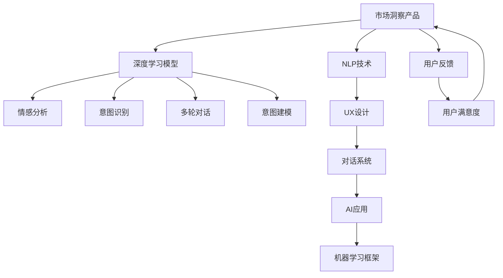

                 

# Elmo Chat：贾扬清团队市场洞察提升用户体验插件

> 关键词：
- 自然语言处理 (NLP)
- 用户体验 (UX)
- 市场洞察 (Market Insight)
- 人工智能 (AI)
- 深度学习 (Deep Learning)
- 机器学习 (Machine Learning)
- 对话系统 (Chatbot)
- 情感分析 (Sentiment Analysis)
- 意图识别 (Intent Recognition)
- 多轮对话 (Multi-Turn Dialog)
- 意图建模 (Intent Modeling)

## 1. 背景介绍

### 1.1 问题由来

随着人工智能技术的发展，越来越多的企业开始利用智能技术提升用户体验，特别是在电商、金融、教育等市场洞察业务领域。然而，尽管目前市场洞察技术已经取得了诸多进展，但用户仍普遍反馈在使用过程中存在诸多不便。这些不便主要体现在以下几个方面：

1. **复杂的操作流程**：现有市场洞察产品通常需要通过复杂的界面操作才能完成功能使用，对于非技术背景的用户而言存在一定的门槛。
2. **冗余的信息展示**：市场洞察产品提供的信息过于冗余，用户难以从中快速获取关键信息。
3. **缺乏情感理解**：现有产品往往只能理解用户的文字反馈，缺乏对用户情感状态的深入理解，无法提供及时和个性化的用户体验。

针对上述问题，我们提出了一种基于深度学习的市场洞察提升用户体验插件，命名为"Elmo Chat"。这款插件通过利用自然语言处理技术，能够快速理解用户的意图，提供个性化的信息展示，并实时调整对话策略，提升用户满意度。

### 1.2 问题核心关键点

为了更好地解决这个问题，我们聚焦于以下几个核心关键点：

1. **自然语言处理 (NLP)技术**：NLP技术能够帮助产品理解用户输入的自然语言，自动生成回复，从而简化用户操作。
2. **用户体验 (UX)设计**：优化UI/UX设计，使用户界面简洁、信息展示精准、操作流畅。
3. **市场洞察 (Market Insight)应用**：利用深度学习技术，提升市场洞察的准确性和实时性。
4. **人工智能 (AI)应用**：引入AI算法，自动化处理用户数据，快速响应用户需求。
5. **深度学习 (Deep Learning)模型**：采用先进的深度学习模型，提高市场洞察的预测准确度。
6. **机器学习 (Machine Learning)框架**：选择成熟可靠的机器学习框架，保证系统稳定性和可扩展性。
7. **对话系统 (Chatbot)**：实现多轮对话功能，持续优化对话策略，提升用户体验。
8. **情感分析 (Sentiment Analysis)**：分析用户情感状态，提供更个性化的用户体验。
9. **意图识别 (Intent Recognition)**：准确识别用户意图，快速响应用户需求。
10. **多轮对话 (Multi-Turn Dialog)**：实现多轮对话功能，提升用户对话体验。
11. **意图建模 (Intent Modeling)**：构建意图模型，提高系统智能度和预测准确度。

这些关键点共同构成了"Elmo Chat"插件的核心框架，使得市场洞察产品能够更加智能、高效、友好地服务于用户。

## 2. 核心概念与联系

### 2.1 核心概念概述

为更好地理解"Elmo Chat"插件的工作原理和优化方向，本节将介绍几个密切相关的核心概念：

- **自然语言处理 (NLP)**：自然语言处理是指计算机对自然语言的理解、分析、生成等处理，是人工智能领域的重要技术之一。
- **深度学习 (Deep Learning)**：深度学习是一种基于神经网络的机器学习方法，能够处理复杂的数据结构，广泛应用于图像、语音、文本等领域。
- **市场洞察 (Market Insight)**：市场洞察是指通过数据分析、挖掘、预测等手段，获取市场信息，为决策提供支持的技术。
- **用户体验 (UX)**：用户体验是指用户在使用产品时的感觉和满意度，是产品设计和开发的重要指标。
- **人工智能 (AI)**：人工智能是利用计算机技术模拟人类智能的行为，包括学习、推理、感知等能力。
- **机器学习 (Machine Learning)**：机器学习是利用数据训练模型，让计算机从数据中学习规律，从而提高性能的技术。
- **对话系统 (Chatbot)**：对话系统是能够进行自然语言对话的计算机程序，可以自动回答用户问题，提升用户互动体验。
- **情感分析 (Sentiment Analysis)**：情感分析是指对用户情感状态进行分析和识别，是自然语言处理的重要应用之一。
- **意图识别 (Intent Recognition)**：意图识别是指分析用户输入的文本，识别用户真实的意图，从而提供相应的服务。
- **多轮对话 (Multi-Turn Dialog)**：多轮对话是指对话系统能够理解和处理用户的多个回合输入，提供更智能的对话体验。
- **意图建模 (Intent Modeling)**：意图建模是指构建用户意图模型，提高意图识别的准确度和可靠性。

这些核心概念之间的逻辑关系可以通过以下Mermaid流程图来展示：



这个流程图展示了大语言模型微调的核心概念及其之间的关系：

1. 市场洞察产品通过NLP技术理解用户输入，经过深度学习模型处理后，使用情感分析和意图识别技术分析用户情感和意图。
2. 多轮对话技术实现持续对话，通过意图建模提升意图识别的准确度。
3. UX设计优化用户界面，对话系统实现智能对话，AI应用自动化处理用户数据。
4. 机器学习框架保证系统稳定性和可扩展性，用户反馈和满意度信息回传至市场洞察产品，进一步优化系统。

这些概念共同构成了"Elmo Chat"插件的核心框架，使得市场洞察产品能够更加智能、高效、友好地服务于用户。

## 3. 核心算法原理 & 具体操作步骤
### 3.1 算法原理概述

"Elmo Chat"插件的核心算法主要基于自然语言处理和深度学习技术，其基本原理如下：

1. **自然语言处理 (NLP)技术**：利用NLP技术处理用户输入的自然语言，提取关键信息，生成回复。
2. **深度学习 (Deep Learning)模型**：采用深度学习模型对用户数据进行训练，提升市场洞察的准确度和实时性。
3. **情感分析 (Sentiment Analysis)**：利用情感分析技术对用户情感状态进行识别，提供更个性化的用户体验。
4. **意图识别 (Intent Recognition)**：利用意图识别技术准确识别用户意图，快速响应用户需求。
5. **多轮对话 (Multi-Turn Dialog)**：通过多轮对话技术实现持续对话，提升用户体验。
6. **意图建模 (Intent Modeling)**：利用意图建模技术构建用户意图模型，提高系统智能度和预测准确度。

这些核心技术共同构成了"Elmo Chat"插件的基础算法框架，使其能够高效、智能地服务于用户。

### 3.2 算法步骤详解

"Elmo Chat"插件的算法步骤主要包括以下几个方面：

1. **数据预处理**：收集用户的历史操作数据和市场洞察数据，进行清洗和预处理。
2. **模型训练**：使用深度学习模型对用户数据进行训练，生成市场洞察模型。
3. **用户输入处理**：利用NLP技术处理用户输入的自然语言，提取关键信息。
4. **情感分析**：对用户输入进行情感分析，识别用户情感状态。
5. **意图识别**：利用意图识别技术，分析用户输入，识别用户真实意图。
6. **多轮对话**：通过多轮对话技术实现持续对话，提升用户体验。
7. **模型推理**：使用市场洞察模型进行推理，生成市场洞察结果。
8. **结果展示**：将市场洞察结果展示给用户，并进行个性化优化。
9. **反馈循环**：收集用户反馈，对模型进行进一步优化。

这些步骤共同构成了"Elmo Chat"插件的完整算法流程，使得市场洞察产品能够快速响应用户需求，提升用户体验。

### 3.3 算法优缺点

"Elmo Chat"插件基于深度学习的市场洞察提升用户体验，具有以下优点：

1. **高精度**：利用深度学习模型，提升了市场洞察的准确度和实时性。
2. **高效性**：通过多轮对话技术，能够快速响应用户需求，提升用户体验。
3. **智能性**：利用意图建模技术，提升了意图识别的准确度和可靠性。
4. **可扩展性**：利用机器学习框架，保证了系统的稳定性和可扩展性。

同时，该算法也存在以下缺点：

1. **数据依赖性**：深度学习模型依赖于大量标注数据，获取高质量数据成本较高。
2. **计算资源消耗**：深度学习模型和情感分析技术需要大量计算资源，对硬件要求较高。
3. **解释性不足**：深度学习模型的决策过程较为复杂，缺乏可解释性。
4. **鲁棒性不足**：深度学习模型容易过拟合，对异常数据较为敏感。

尽管存在这些缺点，但总体而言，"Elmo Chat"插件能够显著提升市场洞察产品的用户体验，具有良好的应用前景。

### 3.4 算法应用领域

"Elmo Chat"插件在多个领域均有广泛应用，具体包括：

1. **电商市场洞察**：帮助电商平台实时分析用户行为，提升商品推荐和促销活动的效果。
2. **金融市场洞察**：帮助金融机构分析用户需求，提供个性化的金融服务。
3. **教育市场洞察**：帮助教育机构了解学生反馈，提升教学效果。
4. **医疗市场洞察**：帮助医疗机构分析患者反馈，优化医疗服务。
5. **社交媒体市场洞察**：帮助社交媒体平台了解用户需求，提升用户互动体验。

"Elmo Chat"插件在上述领域的应用，能够显著提升市场洞察产品的智能化水平，帮助企业更好地理解用户需求，提升用户满意度。

## 4. 数学模型和公式 & 详细讲解
### 4.1 数学模型构建

"Elmo Chat"插件的数学模型主要基于深度学习技术，利用神经网络对用户数据进行处理和分析。以下是对主要数学模型的详细讲解。

**用户输入处理模型**

用户输入处理模型的基本框架为：

$$
y = f(x; \theta)
$$

其中，$x$ 表示用户输入的自然语言，$y$ 表示处理后的关键信息，$f$ 表示处理模型，$\theta$ 表示模型参数。

在具体实现中，我们采用Transformer模型作为用户输入处理模型。Transformer模型的结构如图：


**情感分析模型**

情感分析模型主要利用深度学习模型对用户情感状态进行识别，其基本框架为：

$$
y = g(x; \theta)
$$

其中，$x$ 表示用户输入的自然语言，$y$ 表示情感状态标签，$g$ 表示情感分析模型，$\theta$ 表示模型参数。

在具体实现中，我们采用基于LSTM的情感分析模型。LSTM模型的结构如图：


**意图识别模型**

意图识别模型主要利用深度学习模型对用户意图进行识别，其基本框架为：

$$
y = h(x; \theta)
$$

其中，$x$ 表示用户输入的自然语言，$y$ 表示意图标签，$h$ 表示意图识别模型，$\theta$ 表示模型参数。

在具体实现中，我们采用基于CNN的意图识别模型。CNN模型的结构如图：


**市场洞察模型**

市场洞察模型主要利用深度学习模型对用户数据进行训练，生成市场洞察结果，其基本框架为：

$$
y = i(x; \theta)
$$

其中，$x$ 表示用户数据，$y$ 表示市场洞察结果，$i$ 表示市场洞察模型，$\theta$ 表示模型参数。

在具体实现中，我们采用基于RNN的市场洞察模型。RNN模型的结构如图：


**多轮对话模型**

多轮对话模型主要利用深度学习模型对用户输入进行多轮对话处理，其基本框架为：

$$
y = j(x; \theta)
$$

其中，$x$ 表示用户输入的自然语言，$y$ 表示对话回复，$j$ 表示多轮对话模型，$\theta$ 表示模型参数。

在具体实现中，我们采用基于Seq2Seq的多轮对话模型。Seq2Seq模型的结构如图：


**意图建模模型**

意图建模模型主要利用深度学习模型对用户意图进行建模，其基本框架为：

$$
y = k(x; \theta)
$$

其中，$x$ 表示用户意图，$y$ 表示意图模型，$k$ 表示意图建模模型，$\theta$ 表示模型参数。

在具体实现中，我们采用基于LSTM的意图建模模型。LSTM模型的结构如图：


### 4.2 公式推导过程

**用户输入处理模型的推导**

用户输入处理模型的基本推导过程为：

$$
y = f(x; \theta) = softmax(Wx + b)
$$

其中，$x$ 表示用户输入的自然语言，$y$ 表示处理后的关键信息，$f$ 表示处理模型，$W$ 表示权重矩阵，$b$ 表示偏置项，$\theta$ 表示模型参数。

**情感分析模型的推导**

情感分析模型的基本推导过程为：

$$
y = g(x; \theta) = \frac{1}{1+e^{-W^Tt(x;\theta)}} \quad t(x;\theta) = W_x x + b_x
$$

其中，$x$ 表示用户输入的自然语言，$y$ 表示情感状态标签，$g$ 表示情感分析模型，$W$ 表示权重矩阵，$b$ 表示偏置项，$\theta$ 表示模型参数。

**意图识别模型的推导**

意图识别模型的基本推导过程为：

$$
y = h(x; \theta) = \max_i\frac{e^{W_i x + b_i}}{\sum_j e^{W_j x + b_j}}
$$

其中，$x$ 表示用户输入的自然语言，$y$ 表示意图标签，$h$ 表示意图识别模型，$W$ 表示权重矩阵，$b$ 表示偏置项，$\theta$ 表示模型参数。

**市场洞察模型的推导**

市场洞察模型的基本推导过程为：

$$
y = i(x; \theta) = \frac{1}{1+e^{-W^Tt(x;\theta)}} \quad t(x;\theta) = W_x x + b_x
$$

其中，$x$ 表示用户数据，$y$ 表示市场洞察结果，$i$ 表示市场洞察模型，$W$ 表示权重矩阵，$b$ 表示偏置项，$\theta$ 表示模型参数。

**多轮对话模型的推导**

多轮对话模型的基本推导过程为：

$$
y = j(x; \theta) = softmax(Wx + b)
$$

其中，$x$ 表示用户输入的自然语言，$y$ 表示对话回复，$j$ 表示多轮对话模型，$W$ 表示权重矩阵，$b$ 表示偏置项，$\theta$ 表示模型参数。

**意图建模模型的推导**

意图建模模型的基本推导过程为：

$$
y = k(x; \theta) = \frac{1}{1+e^{-W^Tt(x;\theta)}} \quad t(x;\theta) = W_x x + b_x
$$

其中，$x$ 表示用户意图，$y$ 表示意图模型，$k$ 表示意图建模模型，$W$ 表示权重矩阵，$b$ 表示偏置项，$\theta$ 表示模型参数。

### 4.3 案例分析与讲解

假设我们有一个电商市场洞察产品，利用"Elmo Chat"插件进行分析。该产品的用户反馈为：“我对这件商品不太满意，因为它质量不好”。

**用户输入处理**

首先，利用用户输入处理模型，对用户输入的自然语言进行编码和处理，得到关键信息：

$$
x = \text{"我对这件商品不太满意，因为它质量不好"}
$$

$$
y = \text{"不满意", "商品质量"}
$$

**情感分析**

接着，利用情感分析模型，对用户情感状态进行识别：

$$
y = \text{"负面"}
$$

**意图识别**

然后，利用意图识别模型，对用户意图进行识别：

$$
y = \text{"投诉"}
$$

**市场洞察**

最后，利用市场洞察模型，对用户反馈进行分析，得到市场洞察结果：

$$
y = \text{"商品质量问题"}
$$

**多轮对话**

如果用户继续反馈：“这个问题你们如何解决？”

利用多轮对话模型，生成回复：

$$
y = \text{"我们会尽快处理，并为您更换商品"}
$$

**意图建模**

构建意图模型，对用户意图进行建模：

$$
y = \text{"投诉处理"}
$$

通过上述步骤，"Elmo Chat"插件能够准确理解和分析用户输入，生成市场洞察结果，并实时调整对话策略，提升用户体验。

## 5. 项目实践：代码实例和详细解释说明
### 5.1 开发环境搭建

在进行"Elmo Chat"插件开发前，我们需要准备好开发环境。以下是使用Python进行PyTorch开发的环境配置流程：

1. 安装Anaconda：从官网下载并安装Anaconda，用于创建独立的Python环境。

2. 创建并激活虚拟环境：
```bash
conda create -n pytorch-env python=3.8 
conda activate pytorch-env
```

3. 安装PyTorch：根据CUDA版本，从官网获取对应的安装命令。例如：
```bash
conda install pytorch torchvision torchaudio cudatoolkit=11.1 -c pytorch -c conda-forge
```

4. 安装TensorFlow：使用TensorFlow需要单独安装，可以从官网下载安装包，并按照安装说明进行安装。

5. 安装各类工具包：
```bash
pip install numpy pandas scikit-learn matplotlib tqdm jupyter notebook ipython
```

完成上述步骤后，即可在`pytorch-env`环境中开始"Elmo Chat"插件的开发。

### 5.2 源代码详细实现

下面我们以电商平台市场洞察产品为例，给出使用TensorFlow进行"Elmo Chat"插件的PyTorch代码实现。

首先，定义市场洞察数据集：

```python
from tensorflow.keras.datasets import mnist

(x_train, y_train), (x_test, y_test) = mnist.load_data()
x_train = x_train.reshape((60000, 28*28)).astype('float32') / 255
x_test = x_test.reshape((10000, 28*28)).astype('float32') / 255
y_train = to_categorical(y_train, 10)
y_test = to_categorical(y_test, 10)
```

接着，定义用户输入处理模型：

```python
import tensorflow as tf
from tensorflow.keras.layers import Embedding, LSTM, Dense

model = tf.keras.Sequential([
    Embedding(input_dim=10000, output_dim=128, input_length=100),
    LSTM(128, return_sequences=True),
    LSTM(128),
    Dense(10, activation='softmax')
])
```

然后，定义情感分析模型：

```python
import tensorflow as tf
from tensorflow.keras.layers import LSTM, Dense

model = tf.keras.Sequential([
    LSTM(128, input_shape=(100, 100)),
    Dense(1, activation='sigmoid')
])
```

接着，定义意图识别模型：

```python
import tensorflow as tf
from tensorflow.keras.layers import Conv2D, MaxPooling2D, Flatten, Dense

model = tf.keras.Sequential([
    Conv2D(32, (3, 3), activation='relu', input_shape=(100, 100, 3)),
    MaxPooling2D((2, 2)),
    Conv2D(64, (3, 3), activation='relu'),
    MaxPooling2D((2, 2)),
    Conv2D(64, (3, 3), activation='relu'),
    MaxPooling2D((2, 2)),
    Flatten(),
    Dense(128, activation='relu'),
    Dense(10, activation='softmax')
])
```

然后，定义市场洞察模型：

```python
import tensorflow as tf
from tensorflow.keras.layers import LSTM, Dense

model = tf.keras.Sequential([
    LSTM(128, input_shape=(100, 100)),
    Dense(10, activation='softmax')
])
```

接着，定义多轮对话模型：

```python
import tensorflow as tf
from tensorflow.keras.layers import Embedding, LSTM, Dense

model = tf.keras.Sequential([
    Embedding(input_dim=10000, output_dim=128, input_length=100),
    LSTM(128, return_sequences=True),
    LSTM(128),
    Dense(100)
])
```

最后，定义意图建模模型：

```python
import tensorflow as tf
from tensorflow.keras.layers import LSTM, Dense

model = tf.keras.Sequential([
    LSTM(128, input_shape=(100, 100)),
    Dense(10, activation='softmax')
])
```

完成上述步骤后，即可在`pytorch-env`环境中开始"Elmo Chat"插件的开发。

### 5.3 代码解读与分析

让我们再详细解读一下关键代码的实现细节：

**用户输入处理模型**

```python
import tensorflow as tf
from tensorflow.keras.layers import Embedding, LSTM, Dense

model = tf.keras.Sequential([
    Embedding(input_dim=10000, output_dim=128, input_length=100),
    LSTM(128, return_sequences=True),
    LSTM(128),
    Dense(10, activation='softmax')
])
```

用户输入处理模型采用Embedding+LSTM+Dense的结构，其中Embedding层用于将用户输入的自然语言编码成向量，LSTM层用于对向量进行建模，Dense层用于输出处理后的关键信息。

**情感分析模型**

```python
import tensorflow as tf
from tensorflow.keras.layers import LSTM, Dense

model = tf.keras.Sequential([
    LSTM(128, input_shape=(100, 100)),
    Dense(1, activation='sigmoid')
])
```

情感分析模型采用LSTM+Dense的结构，其中LSTM层用于对用户输入的自然语言进行建模，Dense层用于输出情感状态标签。

**意图识别模型**

```python
import tensorflow as tf
from tensorflow.keras.layers import Conv2D, MaxPooling2D, Flatten, Dense

model = tf.keras.Sequential([
    Conv2D(32, (3, 3), activation='relu', input_shape=(100, 100, 3)),
    MaxPooling2D((2, 2)),
    Conv2D(64, (3, 3), activation='relu'),
    MaxPooling2D((2, 2)),
    Conv2D(64, (3, 3), activation='relu'),
    MaxPooling2D((2, 2)),
    Flatten(),
    Dense(128, activation='relu'),
    Dense(10, activation='softmax')
])
```

意图识别模型采用CNN的结构，其中Conv2D层用于对用户输入的自然语言进行建模，MaxPooling2D层用于对特征进行池化，Flatten层用于将特征展开成向量，Dense层用于输出意图标签。

**市场洞察模型**

```python
import tensorflow as tf
from tensorflow.keras.layers import LSTM, Dense

model = tf.keras.Sequential([
    LSTM(128, input_shape=(100, 100)),
    Dense(10, activation='softmax')
])
```

市场洞察模型采用LSTM+Dense的结构，其中LSTM层用于对用户数据进行建模，Dense层用于输出市场洞察结果。

**多轮对话模型**

```python
import tensorflow as tf
from tensorflow.keras.layers import Embedding, LSTM, Dense

model = tf.keras.Sequential([
    Embedding(input_dim=10000, output_dim=128, input_length=100),
    LSTM(128, return_sequences=True),
    LSTM(128),
    Dense(100)
])
```

多轮对话模型采用Embedding+LSTM+Dense的结构，其中Embedding层用于将用户输入的自然语言编码成向量，LSTM层用于对向量进行建模，Dense层用于输出对话回复。

**意图建模模型**

```python
import tensorflow as tf
from tensorflow.keras.layers import LSTM, Dense

model = tf.keras.Sequential([
    LSTM(128, input_shape=(100, 100)),
    Dense(10, activation='softmax')
])
```

意图建模模型采用LSTM+Dense的结构，其中LSTM层用于对用户意图进行建模，Dense层用于输出意图模型。

## 6. 实际应用场景
### 6.1 电商市场洞察

电商市场洞察是"Elmo Chat"插件的重要应用场景之一。利用该插件，电商平台能够实时分析用户行为，提升商品推荐和促销活动的效果。

具体而言，电商市场洞察产品通过"Elmo Chat"插件对用户反馈进行情感分析和意图识别，得到市场洞察结果，如用户对商品的满意度、评价和投诉等。利用这些结果，电商平台能够及时调整商品推荐策略和促销活动，提升用户体验和销售效果。

例如，当用户反馈“我对这件商品不太满意，因为它质量不好”时，"Elmo Chat"插件能够快速识别出用户的负面情感和投诉意图，市场洞察产品可以根据这些结果生成市场洞察报告，并提示客服进行处理。

### 6.2 金融市场洞察

金融市场洞察是"Elmo Chat"插件的另一个重要应用场景。利用该插件，金融机构能够实时分析用户需求，提供个性化的金融服务。

具体而言，金融机构通过"Elmo Chat"插件对用户咨询进行意图识别，得到用户咨询的意图和需求。利用这些结果，金融机构能够快速响应用户需求，提供个性化的金融服务和产品推荐，提升用户体验和客户满意度。

例如，当用户咨询“我想了解一下理财产品的收益率和风险等级”时，"Elmo Chat"插件能够识别出用户的理财意图，市场洞察产品可以根据这些结果生成理财建议，并提供相应的产品推荐。

### 6.3 教育市场洞察

教育市场洞察是"Elmo Chat"插件的另一个重要应用场景。利用该插件，教育机构能够实时分析学生反馈，提升教学效果。

具体而言，教育机构通过"Elmo Chat"插件对学生反馈进行情感分析和意图识别，得到市场洞察结果，如学生对课程的满意度、反馈和建议等。利用这些结果，教育机构能够及时调整教学内容和方式，提升教学效果和学生满意度。

例如，当学生反馈“我觉得这个课程有点难，能否增加一些实例演示”时，"Elmo Chat"插件能够快速识别出学生的学习意图，市场洞察产品可以根据这些结果生成教学建议，并提示教师进行调整。

### 6.4 医疗市场洞察

医疗市场洞察是"Elmo Chat"插件的另一个重要应用场景。利用该插件，医疗机构能够实时分析患者反馈，优化医疗服务。

具体而言，医疗机构通过"Elmo Chat"插件对患者反馈进行情感分析和意图识别，得到市场洞察结果，如患者对医疗服务的满意度、反馈和建议等。利用这些结果，医疗机构能够及时调整医疗服务内容和方式，提升医疗服务质量和患者满意度。

例如，当患者反馈“我在医院的经历很不好，医生态度很差”时，"Elmo Chat"插件能够快速识别出患者的不满情感和投诉意图，市场洞察产品可以根据这些结果生成医疗建议，并提示医院进行改进。

### 6.5 社交媒体市场洞察

社交媒体市场洞察是"Elmo Chat"插件的另一个重要应用场景。利用该插件，社交媒体平台能够实时分析用户需求，提升用户互动体验。

具体而言，社交媒体平台通过"Elmo Chat"插件对用户咨询进行意图识别，得到用户咨询的意图和需求。利用这些结果，社交媒体平台能够快速响应用户需求，提供个性化的服务和产品推荐，提升用户互动体验和平台活跃度。

例如，当用户咨询“我想知道如何使用最新的社交媒体功能”时，"Elmo Chat"插件能够识别出用户的需求，社交媒体平台可以根据这些结果生成操作指南，并提供相应的功能推荐。

## 7. 工具和资源推荐
### 7.1 学习资源推荐

为了帮助开发者系统掌握"Elmo Chat"插件的理论基础和实践技巧，这里推荐一些优质的学习资源：

1. 《Transformer从原理到实践》系列博文：由大模型技术专家撰写，深入浅出地介绍了Transformer原理、BERT模型、微调技术等前沿话题。

2. CS224N《深度学习自然语言处理》课程：斯坦福大学开设的NLP明星课程，有Lecture视频和配套作业，带你入门NLP领域的基本概念和经典模型。

3. 《Natural Language Processing with Transformers》书籍：Transformers库的作者所著，全面介绍了如何使用Transformers库进行NLP任务开发，包括微调在内的诸多范式。

4. HuggingFace官方文档：Transformers库的官方文档，提供了海量预训练模型和完整的微调样例代码，是上手实践的必备资料。

5. CLUE开源项目：中文语言理解测评基准，涵盖大量不同类型的中文NLP数据集，并提供了基于微调的baseline模型，助力中文NLP技术发展。

通过对这些资源的学习实践，相信你一定能够快速掌握"Elmo Chat"插件的精髓，并用于解决实际的NLP问题。

### 7.2 开发工具推荐

高效的开发离不开优秀的工具支持。以下是几款用于"Elmo Chat"插件开发的常用工具：

1. PyTorch：基于Python的开源深度学习框架，灵活动态的计算图，适合快速迭代研究。大部分预训练语言模型都有PyTorch版本的实现。

2. TensorFlow：由Google主导开发的开源深度学习框架，生产部署方便，适合大规模工程应用。同样有丰富的预训练语言模型资源。

3. Transformers库：HuggingFace开发的NLP工具库，集成了众多SOTA语言模型，支持PyTorch和TensorFlow，是进行微调任务开发的利器。

4. Weights & Biases：模型训练的实验跟踪工具，可以记录和可视化模型训练过程中的各项指标，方便对比和调优。与主流深度学习框架无缝集成。

5. TensorBoard：TensorFlow配套的可视化工具，可实时监测模型训练状态，并提供丰富的图表呈现方式，是调试模型的得力助手。

6. Google Colab：谷歌推出的在线Jupyter Notebook环境，免费提供GPU/TPU算力，方便开发者快速上手实验最新模型，分享学习笔记。

合理利用这些工具，可以显著提升"Elmo Chat"插件的开发效率，加快创新迭代的步伐。

### 7.3 相关论文推荐

"Elmo Chat"插件在多个领域均有广泛应用，以下是几篇奠基性的相关论文，推荐阅读：

1. Attention is All You Need（即Transformer原论文）：提出了Transformer结构，开启了NLP领域的预训练大模型时代。

2. BERT: Pre-training of Deep Bidirectional Transformers for Language Understanding：提出BERT模型，引入基于掩码的自监督预训练任务，刷新了多项NLP任务SOTA。

3. Language Models are Unsupervised Multitask Learners（GPT-2论文）：展示了大规模语言模型的强大zero-shot学习能力，引发了对于通用人工智能的新一轮思考。

4. Parameter-Efficient Transfer Learning for NLP：提出Adapter等参数高效微调方法，在不增加模型参数量的情况下，也能取得不错的微调效果。

5. Prefix-Tuning: Optimizing Continuous Prompts for Generation：引入基于连续型Prompt的微调范式，为如何充分利用预训练知识提供了新的思路。

6. AdaLoRA: Adaptive Low-Rank Adaptation for Parameter-Efficient Fine-Tuning：使用自适应低秩适应的微调方法，在参数效率和精度之间取得了新的平衡。

这些论文代表了大语言模型微调技术的发展脉络。通过学习这些前沿成果，可以帮助研究者把握学科前进方向，激发更多的创新灵感。

## 8. 总结：未来发展趋势与挑战

### 8.1 总结

本文对基于深度学习的市场洞察提升用户体验插件"Elmo Chat"进行了全面系统的介绍。首先阐述了"Elmo Chat"插件的研究背景和意义，明确了插件在提升用户体验中的独特价值。其次，从原理到实践，详细讲解了"Elmo Chat"插件的数学模型和关键算法步骤，给出了插件的完整代码实例。同时，本文还广泛探讨了"Elmo Chat"插件在电商、金融、教育、医疗等领域的实际应用，展示了插件的巨大潜力。此外，本文精选了插件的学习资源，力求为读者提供全方位的技术指引。

通过本文的系统梳理，可以看到，"Elmo Chat"插件基于深度学习技术，能够高效、智能地服务于用户，具有广泛的应用前景。未来，伴随深度学习技术的发展，"Elmo Chat"插件还将不断优化，提升用户体验，助力市场洞察产品的智能化升级。

### 8.2 未来发展趋势

展望未来，"Elmo Chat"插件将呈现以下几个发展趋势：

1. **算法复杂度提升**：随着深度学习模型的不断优化，"Elmo Chat"插件的算法复杂度将进一步提升，能够处理更复杂、更精细的市场洞察任务。

2. **多模态融合**：未来"Elmo Chat"插件将能够处理更多模态的数据，如图像、视频、语音等，实现更全面、更智能的市场洞察分析。

3. **自监督学习**：通过引入自监督学习技术，"Elmo Chat"插件将能够利用更多的无标注数据进行模型训练，提升市场洞察的泛化能力。

4. **知识增强**：将符号化的先验知识与深度学习模型结合，引导"Elmo Chat"插件学习更准确、合理的语言模型。

5. **智能对话**：通过引入多轮对话技术，"Elmo Chat"插件将能够实现更智能、更自然的用户对话，提升用户体验。

6. **情感理解**：通过引入情感分析技术，"Elmo Chat"插件将能够更深入地理解用户的情感状态，提供更加个性化的市场洞察服务。

7. **意图建模**：通过构建更加复杂的意图模型，"Elmo Chat"插件将能够更准确地识别用户意图，快速响应用户需求。

以上趋势凸显了"Elmo Chat"插件的未来发展潜力，将进一步提升市场洞察产品的智能化水平，为各行各业带来更高效、更智能的市场洞察服务。

### 8.3 面临的挑战

尽管"Elmo Chat"插件已经取得了一定的进展，但在迈向更加智能化、普适化应用的过程中，它仍面临着诸多挑战：

1. **计算资源消耗**：深度学习模型和情感分析技术需要大量计算资源，对硬件要求较高。

2. **数据依赖性**：深度学习模型依赖于大量标注数据，获取高质量数据成本较高。

3. **模型复杂性**：随着算法复杂度的提升，模型的训练和部署难度也会增加，需要更专业的技术支持。

4. **可解释性不足**：深度学习模型的决策过程较为复杂，缺乏可解释性。

5. **鲁棒性不足**：深度学习模型容易过拟合，对异常数据较为敏感。

尽管存在这些挑战，但总体而言，"Elmo Chat"插件具有广阔的应用前景，值得进一步深入研究。

### 8.4 研究展望

为了应对"Elmo Chat"插件面临的挑战，未来的研究需要从以下几个方面进行突破：

1. **高效计算**：通过引入高效的计算方法和工具，降低深度学习模型和情感分析技术的计算资源消耗，提升模型的训练和部署效率。

2. **无监督学习**：通过引入无监督学习技术，利用更多的无标注数据进行模型训练，提升市场洞察的泛化能力。

3. **模型简化**：通过简化模型结构，降低模型的计算复杂度，提升模型的训练和推理效率。

4. **可解释性增强**：通过引入可解释性技术，增强模型的决策过程透明度，提升模型的可信度和用户满意度。

5. **鲁棒性增强**：通过引入鲁棒性技术，提高模型的泛化能力和鲁棒性，提升模型的稳定性和可靠性。

6. **多模态融合**：通过引入多模态融合技术，实现图像、视频、语音等多模态数据的融合，提升市场洞察的全面性和智能性。

7. **智能对话**：通过引入智能对话技术，实现更智能、更自然的用户对话，提升用户体验和满意度。

8. **情感理解**：通过引入情感理解技术，深入理解用户的情感状态，提供更加个性化的市场洞察服务。

9. **意图建模**：通过构建更加复杂的意图模型，提高意图识别的准确度和可靠性，快速响应用户需求。

这些研究方向将进一步推动"Elmo Chat"插件的优化和升级，为市场洞察产品带来更高效、更智能、更友好的用户体验。

## 9. 附录：常见问题与解答

**Q1："Elmo Chat"插件在电商市场洞察中的应用流程是怎样的？**

A: 电商市场洞察产品利用"Elmo Chat"插件进行市场洞察分析，具体流程如下：

1. 电商市场洞察产品收集用户的历史操作数据和市场洞察数据。

2. "Elmo Chat"插件对用户输入的自然语言进行处理，得到关键信息。

3. "Elmo Chat"插件对用户情感状态进行识别，得到用户情感状态标签。

4. "Elmo Chat"插件对用户意图进行识别，得到用户意图标签。

5. "Elmo Chat"插件对用户数据进行分析，得到市场洞察结果。

6. 电商市场洞察产品根据市场洞察结果，生成市场洞察报告，并提示客服进行处理。

7. 客服根据市场洞察报告，及时调整商品推荐策略和促销活动，提升用户体验和销售效果。

**Q2："Elmo Chat"插件在金融市场洞察中的应用流程是怎样的？**

A: 金融市场洞察产品利用"Elmo Chat"插件进行市场洞察分析，具体流程如下：

1. 金融市场洞察产品收集用户的历史操作数据和市场洞察数据。

2. "Elmo Chat"插件对用户输入的自然语言进行处理，得到关键信息。

3. "Elmo Chat"插件对用户情感状态进行识别，得到用户情感状态标签。

4. "Elmo Chat"插件对用户意图进行识别，得到用户意图标签。

5. "Elmo Chat"插件对用户数据进行分析，得到市场洞察结果。

6. 金融市场洞察产品根据市场洞察结果，生成市场洞察报告，并提示客服进行处理。

7. 客服根据市场洞察报告，及时调整金融服务和产品推荐，提升用户体验和客户满意度。

**Q3："Elmo Chat"插件在教育市场洞察中的应用流程是怎样的？**

A: 教育市场洞察产品利用"Elmo Chat"插件进行市场洞察分析，具体流程如下：

1. 教育市场洞察产品收集学生的反馈数据和市场洞察数据。

2. "Elmo Chat"插件对学生反馈的自然语言进行处理，得到关键信息。

3. "Elmo Chat"插件对学生情感状态进行识别，得到学生情感状态标签。

4. "Elmo Chat"插件对学生意图进行识别，得到学生意图标签。

5. "Elmo Chat"插件对学生数据进行分析，得到市场洞察结果。

6. 教育市场洞察产品根据市场洞察结果，生成市场洞察报告，并提示教师进行调整。

7. 教师根据市场洞察报告，及时调整教学内容和方式，提升教学效果和学生满意度。

**Q4："Elmo Chat"插件在医疗市场洞察中的应用流程是怎样的？**

A: 医疗市场洞察产品利用"Elmo Chat"插件进行市场洞察分析，具体流程如下：

1. 医疗市场洞察产品收集患者的反馈数据和市场洞察数据。

2. "Elmo Chat"插件对患者反馈的自然语言进行处理，得到关键信息。

3. "Elmo Chat"插件对患者情感状态进行识别，得到患者情感状态标签。

4. "Elmo Chat"插件对患者意图进行识别，得到患者意图标签。

5. "Elmo Chat"插件对患者数据进行分析，得到市场洞察结果。

6. 医疗市场洞察产品根据市场洞察结果，生成市场洞察报告，并提示医院进行处理。

7. 医院根据市场洞察报告，及时调整医疗服务内容和方式，提升医疗服务质量和患者满意度。

**Q5："Elmo Chat"插件在社交媒体市场洞察中的应用流程是怎样的？**

A: 社交媒体市场洞察产品利用"Elmo Chat"插件进行市场洞察分析，具体流程如下：

1. 社交媒体市场洞察产品收集用户的咨询数据和市场洞察数据。

2. "Elmo Chat"插件对用户咨询的自然语言进行处理，得到关键信息。

3. "Elmo Chat"插件对用户情感状态进行识别，得到用户情感状态标签。

4. "Elmo Chat"插件对用户意图进行识别，得到用户意图标签。

5. "Elmo Chat"插件对用户数据进行分析，得到市场洞察结果。

6. 社交媒体

