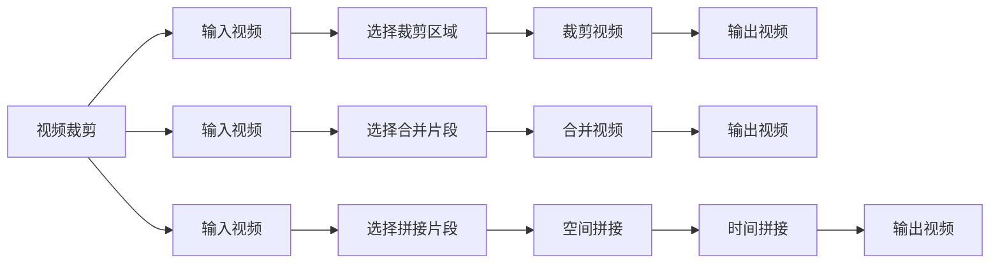

                 

# FFmpeg 视频编辑：裁剪和合并视频片段

> 关键词：FFmpeg, 视频编辑, 裁剪, 合并, 视频拼接

## 1. 背景介绍

在视频编辑中，最常用的两个操作莫过于裁剪和合并。裁剪指的是将视频中不需要的部分删除，合并则是将多个视频片段组合成一个视频。这些操作是视频编辑的基础，也是创建视频剪辑的必备技能。在这篇文章中，我们将深入探讨FFmpeg视频编辑中裁剪和合并视频片段的核心概念、实现原理、操作步骤以及常见问题解答。

## 2. 核心概念与联系

### 2.1 核心概念概述

在视频编辑中，以下是几个关键的概念：

- **视频裁剪（Cropping）**：从视频中删除指定区域的视频片段，保留其余部分。
- **视频合并（Concatenation）**：将多个视频片段按顺序或随机顺序组合成一个视频。
- **视频拼接（Patching）**：将两个或多个视频片段在空间或时间上重叠，形成新的视频内容。

这些概念的实现离不开FFmpeg这一强大的开源视频处理工具。FFmpeg是一个跨平台的视频处理工具，支持几乎所有主流视频格式，具备强大的音视频编码、解码和处理能力，广泛应用于视频编辑、音视频转换、流媒体传输等领域。

### 2.2 核心概念原理和架构的 Mermaid 流程图



这个流程图展示了视频编辑中裁剪、合并和拼接的基本流程。输入视频文件经过裁剪、选择、合并、拼接等处理步骤，最终输出编辑后的视频文件。

## 3. 核心算法原理 & 具体操作步骤

### 3.1 算法原理概述

视频裁剪和合并的核心算法原理基于时间线（Timeline）的概念。时间线是一个线性结构，用于描述视频、音频等媒体元素在时间轴上的位置关系。通过对时间线上的元素进行增删、重排等操作，可以实现各种视频编辑功能。

在FFmpeg中，视频裁剪和合并主要通过操作视频文件的时间线来实现。具体来说，裁剪是通过对时间线上的片段进行截取，合并则是将多个片段按顺序排列，拼接则是在时间和空间上对片段进行重叠。

### 3.2 算法步骤详解

#### 3.2.1 视频裁剪

1. **输入视频文件**：使用FFmpeg打开视频文件，获取视频的基本信息，如宽度、高度、帧率等。
2. **选择裁剪区域**：确定需要裁剪的区域，包括裁剪的起始时间戳、结束时间戳、裁剪的宽度和高度。
3. **裁剪视频**：使用FFmpeg的`-vf`参数（Video Filter）指定裁剪的起始和结束时间戳、裁剪区域，将裁剪后的视频保存为新的视频文件。

#### 3.2.2 视频合并

1. **输入视频文件**：使用FFmpeg打开多个视频文件，获取每个文件的基本信息。
2. **选择合并片段**：决定需要合并的视频片段，可以按顺序排列，也可以随机选择。
3. **合并视频**：使用FFmpeg的`-filter_complex`参数指定视频合并的顺序，将多个视频文件按照指定顺序合并，保存为新的视频文件。

#### 3.2.3 视频拼接

1. **输入视频文件**：使用FFmpeg打开多个视频文件，获取每个文件的基本信息。
2. **选择拼接片段**：决定需要拼接的视频片段，可以在空间上重叠，也可以在时间上重叠。
3. **空间拼接**：使用FFmpeg的`-filter_complex`参数指定空间拼接的顺序和位置，将多个视频文件按照指定顺序排列，保存为新的视频文件。
4. **时间拼接**：使用FFmpeg的`-filter_complex`参数指定时间拼接的顺序和位置，将多个视频文件按照指定顺序排列，保存为新的视频文件。

### 3.3 算法优缺点

#### 3.3.1 视频裁剪的优缺点

**优点**：
- 裁剪可以精确地删除视频中不需要的部分，提高视频的编辑效率。
- 裁剪操作不需要大量计算资源，简单易行。

**缺点**：
- 裁剪可能导致视频内容不连贯，需要进行额外的剪辑和调整。
- 裁剪操作可能改变视频的比例，需要进行后续处理。

#### 3.3.2 视频合并的优缺点

**优点**：
- 合并可以方便地将多个视频片段组合成一个视频，简化编辑流程。
- 合并可以提高视频的复用性，减少重复劳动。

**缺点**：
- 合并可能导致视频总时长过长，增加视频播放和编辑的难度。
- 合并需要考虑不同视频之间的同步和兼容性，增加了编辑难度。

#### 3.3.3 视频拼接的优缺点

**优点**：
- 拼接可以在空间和时间上对视频进行创意性的处理，增加视频的观赏性。
- 拼接可以同时处理多个视频文件，提高视频编辑的效率。

**缺点**：
- 拼接操作复杂，需要精确计算每个片段的位置和大小。
- 拼接可能导致视频内容混乱，需要进行额外的剪辑和调整。

### 3.4 算法应用领域

视频裁剪和合并技术广泛应用在以下几个领域：

- **视频剪辑制作**：视频剪辑师使用FFmpeg进行视频裁剪和合并，制作出高品质的视频剪辑。
- **视频课程制作**：教师使用FFmpeg进行视频裁剪和合并，制作出完整的教学视频。
- **视频广告制作**：广告公司使用FFmpeg进行视频裁剪和合并，制作出具有创意性的广告视频。
- **视频合集制作**：视频网站使用FFmpeg进行视频裁剪和合并，制作出高质量的视频合集。
- **视频监控制作**：安保公司使用FFmpeg进行视频裁剪和合并，制作出实时监控视频。

## 4. 数学模型和公式 & 详细讲解 & 举例说明

### 4.1 数学模型构建

视频编辑的核心模型是基于时间线的线性模型。假设视频A的起始时间为$t_A$，结束时间为$t_B$，长度为$L_A$，宽度为$W_A$，高度为$H_A$。视频B的起始时间为$t_B$，结束时间为$t_C$，长度为$L_B$，宽度为$W_B$，高度为$H_B$。

视频裁剪和合并的基本数学模型可以表示为：

$$
\text{裁剪} = \begin{cases}
\text{裁剪起始时间} \leq t \leq \text{裁剪结束时间} \\
\text{裁剪宽度} \leq x \leq \text{裁剪宽度} \\
\text{裁剪高度} \leq y \leq \text{裁剪高度}
\end{cases}
$$

$$
\text{合并} = \begin{cases}
t_A \leq t \leq t_B \\
t_B \leq t \leq t_C
\end{cases}
$$

$$
\text{拼接} = \begin{cases}
t_A \leq t \leq t_B \\
t_B \leq t \leq t_C
\end{cases}
$$

### 4.2 公式推导过程

视频裁剪的推导过程如下：

$$
\text{裁剪后视频长度} = \text{原视频长度} - (\text{裁剪结束时间} - \text{裁剪起始时间}) \times \text{帧率}
$$

视频合并的推导过程如下：

$$
\text{合并后视频长度} = \text{原视频长度} \times \text{视频数量}
$$

视频拼接的推导过程如下：

$$
\text{拼接后视频长度} = \text{原视频长度} \times \text{视频数量}
$$

### 4.3 案例分析与讲解

假设有一段视频A，长度为10秒，宽度为640像素，高度为480像素，帧率为30帧/秒。视频B，长度为5秒，宽度为320像素，高度为240像素，帧率为30帧/秒。使用FFmpeg进行视频裁剪和合并，得到新的视频C。

**视频裁剪**：

$$
\text{裁剪起始时间} = 3 \text{秒}, \text{裁剪结束时间} = 7 \text{秒}, \text{裁剪宽度} = 320 \text{像素}, \text{裁剪高度} = 240 \text{像素}
$$

$$
\text{裁剪后视频长度} = 10 \text{秒} - (7 \text{秒} - 3 \text{秒}) \times 30 \text{帧/秒} = 10 \text{秒} - 2 \text{秒} \times 30 \text{帧/秒} = 4 \text{秒}
$$

**视频合并**：

$$
\text{合并后视频长度} = 10 \text{秒} \times 1 + 5 \text{秒} \times 1 = 15 \text{秒}
$$

**视频拼接**：

$$
\text{拼接后视频长度} = 10 \text{秒} \times 1 + 5 \text{秒} \times 1 = 15 \text{秒}
$$

## 5. 项目实践：代码实例和详细解释说明

### 5.1 开发环境搭建

在进行视频编辑时，首先需要搭建好开发环境。在本节中，我们将介绍如何使用FFmpeg进行视频编辑。

1. **安装FFmpeg**：
   - Windows用户：从FFmpeg官网下载适用于Windows系统的安装包，并按照指引进行安装。
   - Linux用户：在终端中使用以下命令进行安装：
     ```bash
     sudo apt-get update
     sudo apt-get install ffmpeg
     ```

2. **配置FFmpeg环境**：
   - 打开终端，输入以下命令设置FFmpeg的路径：
     ```bash
     sudo chmod +x /usr/local/bin/ffmpeg
     sudo chmod +x /usr/local/bin/ffplay
     sudo chmod +x /usr/local/bin/ffmpeg-config
     ```

3. **检查FFmpeg版本**：
   - 在终端中输入以下命令检查FFmpeg的版本：
     ```bash
     ffmpeg -version
     ```

### 5.2 源代码详细实现

下面以视频裁剪为例，给出一个具体的代码实现：

```bash
ffmpeg -i input.mp4 -vf 'crop=320:240:3:3' -c:a copy output.mp4
```

其中，`-i`参数用于指定输入文件，`-vf`参数用于指定视频滤镜，`crop`表示裁剪操作，`320:240:3:3`表示裁剪的宽度和高度，以及裁剪区域的起始和结束坐标，`-c:a copy`表示音频轨道复制，最后输出文件名为`output.mp4`。

### 5.3 代码解读与分析

1. **-i参数**：用于指定输入文件路径和名称。
2. **-vf参数**：用于指定视频滤镜，`crop`表示裁剪操作，后面跟着裁剪的宽度、高度、起始坐标和结束坐标。
3. **-c:a copy参数**：用于指定音频轨道复制，避免重新编码。
4. **输出文件名**：用于指定输出文件的路径和名称。

### 5.4 运行结果展示

使用上述代码进行视频裁剪后，可以得到一个裁剪后的视频文件`output.mp4`，其宽度和高度与指定的大小一致。

## 6. 实际应用场景

### 6.1 智能视频监控

在智能视频监控中，视频裁剪和合并技术可以帮助监控系统更加高效地记录和回放监控画面。例如，可以将监控摄像头拍摄的视频按不同时间段进行裁剪和合并，方便安保人员进行回放和分析。

### 6.2 视频制作

在视频制作中，视频裁剪和合并技术可以帮助制作人员快速剪辑视频，提高视频制作的效率。例如，可以将多个视频片段按照顺序排列，形成完整的故事情节，或者将多个视频片段进行空间和时间上的拼接，形成创意性的视频效果。

### 6.3 视频教学

在视频教学中，视频裁剪和合并技术可以帮助教师快速制作教学视频，提高教学效率。例如，可以将多个教学片段进行合并，形成完整的视频课程，或者将多个教学片段进行空间和时间上的拼接，形成更加生动有趣的视频教学内容。

### 6.4 视频广告

在视频广告制作中，视频裁剪和合并技术可以帮助广告公司快速制作创意性的广告视频，提高广告制作效率。例如，可以将多个广告片段进行合并，形成完整的广告视频，或者将多个广告片段进行空间和时间上的拼接，形成更具吸引力的广告效果。

## 7. 工具和资源推荐

### 7.1 学习资源推荐

1. **FFmpeg官方文档**：FFmpeg官方文档提供了详细的命令和参数说明，是学习FFmpeg视频编辑的基础。
2. **FFmpeg视频教程**：网上有许多FFmpeg视频教程，可以帮助初学者快速上手。
3. **FFmpeg实用技巧**：网上有许多关于FFmpeg实用技巧的文章和视频，可以帮助高级用户更高效地使用FFmpeg。

### 7.2 开发工具推荐

1. **VS Code**：Visual Studio Code是一款轻量级、功能强大的代码编辑器，支持FFmpeg插件，可以方便地进行视频编辑。
2. **FFmpeg GUI工具**：FFmpeg有多个GUI工具，如FFmpeg GUI、MediaHuman等，可以方便地进行视频编辑。
3. **FFmpeg Web界面**：FFmpeg有Web界面版本，可以通过浏览器进行视频编辑。

### 7.3 相关论文推荐

1. **《FFmpeg: A complete open-source video processing toolkit》**：FFmpeg的核心论文，介绍了FFmpeg的基本架构和实现原理。
2. **《Efficient video trimming and concatenation with FFmpeg》**：介绍使用FFmpeg进行视频裁剪和合并的效率优化技术。
3. **《Video editing with FFmpeg: A comprehensive guide》**：FFmpeg视频编辑指南，介绍了FFmpeg的各种命令和参数。

## 8. 总结：未来发展趋势与挑战

### 8.1 研究成果总结

本文介绍了FFmpeg视频编辑中的核心概念、实现原理、操作步骤以及常见问题解答。通过深入分析，我们得出以下几点总结：

1. 视频裁剪和合并技术广泛应用于视频剪辑、视频教学、视频广告等领域，是视频编辑的基础。
2. FFmpeg是一个功能强大、开源免费的视频处理工具，支持多种视频格式和操作。
3. 视频裁剪和合并的实现依赖于时间线的线性模型，通过裁剪、合并、拼接等操作，可以实现各种视频编辑功能。
4. 视频裁剪和合并操作简单易行，但需要注意裁剪区域的选择、视频合并的顺序等问题。

### 8.2 未来发展趋势

未来，视频编辑技术将向着以下几个方向发展：

1. **自动化编辑**：随着AI技术的进步，自动化视频编辑将变得更加智能和高效。
2. **实时编辑**：实时视频编辑技术将更加成熟，支持更复杂的编辑操作。
3. **多平台支持**：视频编辑工具将支持更多的平台和设备，如移动设备、Web平台等。
4. **云服务支持**：视频编辑工具将支持云服务，用户可以随时随地进行视频编辑。
5. **多媒体融合**：视频编辑将支持更多样化的媒体格式和操作，如视频、音频、图片等。

### 8.3 面临的挑战

视频编辑技术在发展过程中面临以下挑战：

1. **计算资源**：视频编辑操作复杂，需要大量计算资源，如何在保证性能的同时，提高效率是一个难题。
2. **用户体验**：视频编辑界面复杂，用户需要一定的学习成本，如何提高用户体验是一个挑战。
3. **版权问题**：视频编辑操作可能涉及版权问题，如何在不侵犯版权的情况下进行视频编辑是一个挑战。
4. **兼容性问题**：视频编辑操作可能涉及不同格式的视频，如何保证兼容性是一个挑战。
5. **多设备支持**：视频编辑操作需要支持多种设备，如何在不同设备上保证一致性是一个挑战。

### 8.4 研究展望

未来，视频编辑技术需要在以下几个方面进行深入研究：

1. **自动化编辑**：开发更加智能的视频编辑工具，能够自动识别和调整视频内容，提高编辑效率。
2. **实时编辑**：开发实时视频编辑技术，支持在移动设备上进行视频编辑，提高用户体验。
3. **多平台支持**：开发跨平台的视频编辑工具，支持Web、移动设备等多种平台。
4. **云服务支持**：开发支持云服务的视频编辑工具，实现随时随地进行视频编辑。
5. **多媒体融合**：开发支持多种媒体格式的视频编辑工具，如视频、音频、图片等。

## 9. 附录：常见问题与解答

### Q1: 如何裁剪视频？

A: 使用FFmpeg的`-vf`参数指定裁剪操作，使用`crop=宽度:高度:起始坐标:结束坐标`参数指定裁剪区域。

### Q2: 如何使用FFmpeg合并视频？

A: 使用FFmpeg的`-filter_complex`参数指定视频合并的顺序，使用`[输入视频1][输入视频2]filter[输出视频]`参数指定合并操作。

### Q3: 如何进行视频拼接？

A: 使用FFmpeg的`-filter_complex`参数指定空间和时间上的拼接操作，使用`[输入视频1][输入视频2]filter[输出视频]`参数指定拼接操作。

### Q4: 视频编辑时如何保证性能？

A: 可以使用多线程、多进程等技术优化FFmpeg的计算性能，减少计算资源的消耗。

### Q5: 视频编辑时需要注意哪些问题？

A: 需要注意视频格式的支持、计算资源的消耗、用户体验、版权问题、兼容性问题等多方面问题，保证视频编辑的效率和质量。

---

作者：禅与计算机程序设计艺术 / Zen and the Art of Computer Programming

