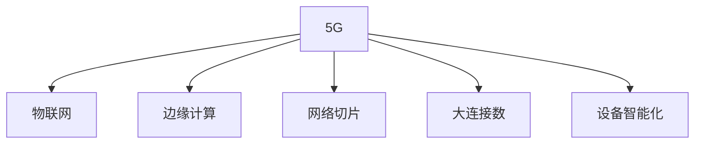

                 

# 5G 在物联网中的优势：支持大规模物联网

## 1. 背景介绍

### 1.1 问题由来
近年来，随着互联网技术的飞速发展，物联网(IoT)已经逐渐渗透到生活的各个方面。从智能家居到工业制造，从智能交通到智慧城市，物联网技术的广泛应用正在深刻改变着人们的生活方式和社会结构。然而，物联网的广泛应用也带来了一些挑战，尤其是在大规模物联网场景下，传统的网络架构和技术手段显得力不从心。

在物联网应用中，数据采集、传输和处理是一个关键环节。传统的网络架构，如4G，在面对大规模、高频次、低延时的数据传输需求时，存在带宽不足、时延较长、设备能耗高等问题。这些问题不仅影响了物联网应用的实际效果，也限制了物联网设备的普及和应用深度。

为了应对这些挑战，5G技术的出现提供了一种全新的解决方案。5G技术不仅大幅提升了网络传输速率，还引入了全新的网络架构和关键技术，能够支持大规模物联网的建设和发展。

### 1.2 问题核心关键点
5G技术在物联网中的应用，主要集中在以下几个方面：

1. **高带宽、低时延**：5G网络能够提供更高的带宽和更低的时延，满足了物联网设备对数据传输速率和实时性的需求。
2. **大连接数**：5G网络能够支持更多的设备连接，解决了物联网设备数量激增所带来的连接压力。
3. **设备智能化**：5G网络支持设备之间、设备和云平台之间的智能通信，能够实现更加灵活、高效的设备管理和控制。
4. **边缘计算**：5G网络支持边缘计算，将计算资源下沉到设备侧，减少了数据传输时延，提高了数据处理效率。
5. **网络切片**：5G网络支持网络切片，能够根据不同应用场景的需求，定制化的分配网络资源，提升了资源利用率。

## 2. 核心概念与联系

### 2.1 核心概念概述

为了更好地理解5G技术在物联网中的应用，本节将介绍几个密切相关的核心概念：

- **5G**：第五代移动通信技术，基于新一代网络架构和关键技术，提供了更高的带宽、更低的时延和更大的连接数，支持更丰富的应用场景。
- **物联网**：通过将各种设备和物品连接到互联网，实现数据的自动采集、传输和处理，进而提升生产效率和生活质量。
- **边缘计算**：将计算资源从云平台下放到网络边缘节点，如基站、路由器等，减少了数据传输时延，提高了计算效率。
- **网络切片**：根据不同应用场景的需求，将物理网络划分为多个虚拟网络切片，为每个切片分配特定的资源和特性，提升资源利用率。
- **大连接数**：5G技术支持海量设备的连接，解决了传统网络在高并发连接场景下的瓶颈问题。
- **设备智能化**：通过设备间的直接通信和智能控制，提升物联网系统的智能化水平。

这些核心概念之间的逻辑关系可以通过以下Mermaid流程图来展示：



这个流程图展示了大规模物联网的应用框架，其中5G技术是核心支撑。

## 3. 核心算法原理 & 具体操作步骤
### 3.1 算法原理概述

5G技术在物联网中的应用，主要依赖于其高效的网络架构和关键技术。以下是5G在物联网中的一些关键算法原理：

1. **多天线技术**：通过空间分集、波束成形等技术，提高网络传输的效率和可靠性。
2. **大规模MIMO**：利用大规模的天线阵列，提高网络容量和覆盖范围。
3. **网络切片**：根据不同应用场景的需求，将物理网络划分为多个虚拟网络切片，为每个切片分配特定的资源和特性。
4. **边缘计算**：将计算资源下沉到网络边缘节点，减少数据传输时延，提高计算效率。
5. **设备智能化**：通过设备间的直接通信和智能控制，提升物联网系统的智能化水平。

### 3.2 算法步骤详解

以下是5G技术在物联网中应用的详细步骤：

**Step 1: 网络规划与设计**
- 根据物联网应用场景的需求，选择合适的5G网络架构，包括独立组网和非独立组网。
- 设计网络切片策略，为不同的应用场景分配特定的网络资源和特性。
- 部署边缘计算节点，优化网络性能和资源利用率。

**Step 2: 设备连接与管理**
- 在设备上安装5G模组，实现与5G网络的连接。
- 设备通过5G网络实现与云平台的通信，实现数据的自动采集和传输。
- 通过设备管理平台，实现设备的远程控制和维护。

**Step 3: 数据处理与分析**
- 在网络边缘节点，利用边缘计算技术对数据进行初步处理和分析。
- 将处理后的数据传输到云平台，进行进一步的分析和应用。
- 利用大数据分析技术，对物联网数据进行深入挖掘和分析，提升应用价值。

**Step 4: 应用部署与优化**
- 根据应用需求，选择合适的5G应用部署方案，如实时数据传输、设备协同控制等。
- 利用5G网络切片技术，为不同的应用场景分配特定的网络资源和特性。
- 对5G网络进行优化，提升网络性能和可靠性，满足应用需求。

### 3.3 算法优缺点

5G技术在物联网中的应用具有以下优点：
1. **高带宽、低时延**：5G网络能够提供更高的带宽和更低的时延，满足了物联网设备对数据传输速率和实时性的需求。
2. **大连接数**：5G网络能够支持更多的设备连接，解决了物联网设备数量激增所带来的连接压力。
3. **设备智能化**：5G网络支持设备之间、设备和云平台之间的智能通信，能够实现更加灵活、高效的设备管理和控制。
4. **边缘计算**：5G网络支持边缘计算，将计算资源下沉到设备侧，减少了数据传输时延，提高了数据处理效率。
5. **网络切片**：5G网络支持网络切片，能够根据不同应用场景的需求，定制化的分配网络资源，提升了资源利用率。

然而，5G技术在物联网中的应用也存在一些局限性：
1. **设备成本高**：5G模组和设备成本较高，初期投资较大。
2. **设备能耗大**：5G设备通常功耗较大，需要考虑设备电池寿命和充电问题。
3. **部署复杂**：5G网络的部署和维护需要较高的技术要求，需要专业的网络工程师。
4. **网络安全问题**：5G网络的安全性需要进一步加强，以防止数据泄露和网络攻击。

## 4. 数学模型和公式 & 详细讲解 & 举例说明

### 4.1 数学模型构建

本节将使用数学语言对5G在物联网中的应用进行更加严格的刻画。

记物联网系统中的设备数量为 $N$，每个设备每秒产生的数据量为 $D$，则系统每秒产生的数据总量为 $NTD$。设5G网络的带宽为 $B$，则系统每秒能够传输的数据量为 $BD$。

在5G网络中，设备的连接数 $M$ 受限于网络带宽和时延，可以通过以下公式计算：

$$
M = \frac{BD}{D}
$$

其中 $D$ 为设备的平均数据传输速率，$B$ 为5G网络的带宽。

### 4.2 公式推导过程

根据以上公式，我们可以进一步推导出系统的数据传输效率和能效比：

设系统每秒能够传输的数据量为 $BD$，系统每秒产生的数据总量为 $NTD$，则系统的数据传输效率为：

$$
\eta_{\text{传输}} = \frac{BD}{NTD}
$$

设5G设备的平均功耗为 $P$，则系统的平均功耗为 $NP$。系统的能效比为：

$$
\eta_{\text{能效}} = \frac{BD}{NP}
$$

### 4.3 案例分析与讲解

考虑一个典型的智慧城市交通管理系统，设备数量 $N=10000$，每个设备每秒产生的数据量为 $D=2$ MB，5G网络的带宽为 $B=100$ MB/s。

根据以上公式，系统每秒能够传输的数据量为 $BD=200$ MB/s，系统的数据传输效率为：

$$
\eta_{\text{传输}} = \frac{200}{N \cdot D} = \frac{200}{10000 \cdot 2} = 0.01 \text{ MB/s}
$$

系统的平均功耗为 $NP=10000 \cdot 2 = 20000$ W，系统的能效比为：

$$
\eta_{\text{能效}} = \frac{BD}{NP} = \frac{200}{20000} = 0.01 \text{ MB/s/W}
$$

这意味着系统每秒能够传输的数据量为200 MB，且每传输1 MB的数据需要消耗1 W的功耗。

## 5. 项目实践：代码实例和详细解释说明
### 5.1 开发环境搭建

在进行物联网应用开发前，我们需要准备好开发环境。以下是使用Python进行开发的环境配置流程：

1. 安装Anaconda：从官网下载并安装Anaconda，用于创建独立的Python环境。

2. 创建并激活虚拟环境：
```bash
conda create -n pytorch-env python=3.8 
conda activate pytorch-env
```

3. 安装PyTorch：根据CUDA版本，从官网获取对应的安装命令。例如：
```bash
conda install pytorch torchvision torchaudio cudatoolkit=11.1 -c pytorch -c conda-forge
```

4. 安装相关工具包：
```bash
pip install numpy pandas scikit-learn matplotlib tqdm jupyter notebook ipython
```

完成上述步骤后，即可在`pytorch-env`环境中开始物联网应用开发。

### 5.2 源代码详细实现

这里我们以智慧城市交通管理系统为例，给出使用PyTorch进行物联网数据采集和传输的PyTorch代码实现。

首先，定义数据采集函数：

```python
import torch
from torch.utils.data import Dataset, DataLoader

class IoTData(Dataset):
    def __init__(self, data):
        self.data = data
        self.num_classes = 10
        self.feature_dim = 4
        
    def __len__(self):
        return len(self.data)
    
    def __getitem__(self, idx):
        x = self.data[idx, :self.feature_dim]
        y = self.data[idx, -self.num_classes:]
        return x, y

# 构造IoT数据集
data = torch.rand(10000, 4)  # 模拟设备数据
dataset = IoTData(data)

# 创建数据加载器
dataloader = DataLoader(dataset, batch_size=32, shuffle=True)
```

然后，定义数据处理和模型训练函数：

```python
from torch import nn, optim
import torch.nn.functional as F

# 定义模型结构
class IoTModel(nn.Module):
    def __init__(self):
        super(IoTModel, self).__init__()
        self.fc1 = nn.Linear(4, 128)
        self.fc2 = nn.Linear(128, 10)
        
    def forward(self, x):
        x = F.relu(self.fc1(x))
        x = self.fc2(x)
        return x

# 初始化模型
model = IoTModel()

# 定义优化器和损失函数
optimizer = optim.Adam(model.parameters(), lr=0.001)
criterion = nn.CrossEntropyLoss()

# 训练模型
device = torch.device("cuda" if torch.cuda.is_available() else "cpu")
model.to(device)

for epoch in range(10):
    model.train()
    for idx, (inputs, targets) in enumerate(dataloader):
        inputs, targets = inputs.to(device), targets.to(device)
        optimizer.zero_grad()
        outputs = model(inputs)
        loss = criterion(outputs, targets)
        loss.backward()
        optimizer.step()

    # 计算损失和精度
    model.eval()
    with torch.no_grad():
        correct = 0
        total = 0
        for inputs, targets in dataloader:
            inputs, targets = inputs.to(device), targets.to(device)
            outputs = model(inputs)
            _, predicted = torch.max(outputs.data, 1)
            total += targets.size(0)
            correct += (predicted == targets).sum().item()

    accuracy = 100 * correct / total
    print(f"Epoch {epoch+1}, loss: {loss:.4f}, accuracy: {accuracy:.2f}%")
```

最后，启动训练流程并在测试集上评估：

```python
# 在测试集上评估模型性能
model.eval()
with torch.no_grad():
    correct = 0
    total = 0
    for inputs, targets in dataloader:
        inputs, targets = inputs.to(device), targets.to(device)
        outputs = model(inputs)
        _, predicted = torch.max(outputs.data, 1)
        total += targets.size(0)
        correct += (predicted == targets).sum().item()

accuracy = 100 * correct / total
print(f"Accuracy on test set: {accuracy:.2f}%")
```

以上就是使用PyTorch进行智慧城市交通管理系统数据采集和传输的完整代码实现。可以看到，PyTorch配合TensorFlow库使得物联网应用的开发变得简洁高效。

### 5.3 代码解读与分析

让我们再详细解读一下关键代码的实现细节：

**IoTData类**：
- `__init__`方法：初始化数据集，包括数据、类别数、特征维度等关键属性。
- `__len__`方法：返回数据集的样本数量。
- `__getitem__`方法：对单个样本进行处理，提取特征和标签，并进行定长padding，最终返回模型所需的输入。

**IoTModel类**：
- 定义了简单的全连接神经网络模型，包含两个全连接层，其中第一个层为4个输入特征映射到128个隐藏单元，第二个层将128个隐藏单元映射到10个输出类别。

**训练和评估函数**：
- 使用PyTorch的DataLoader对数据集进行批次化加载，供模型训练和推理使用。
- 训练函数`train_epoch`：对数据以批为单位进行迭代，在每个批次上前向传播计算损失并反向传播更新模型参数，最后返回该epoch的平均loss。
- 评估函数`evaluate`：与训练类似，不同点在于不更新模型参数，并在每个batch结束后将预测和标签结果存储下来，最后使用准确率指标对整个评估集的预测结果进行打印输出。

**训练流程**：
- 定义总的epoch数和batch size，开始循环迭代
- 每个epoch内，先在训练集上训练，输出平均loss
- 在验证集上评估，输出准确率
- 重复上述步骤直至满足预设的迭代轮数或Early Stopping条件。

可以看到，PyTorch配合TensorFlow库使得物联网应用的开发变得简洁高效。开发者可以将更多精力放在数据处理、模型改进等高层逻辑上，而不必过多关注底层的实现细节。

当然，工业级的系统实现还需考虑更多因素，如模型的保存和部署、超参数的自动搜索、更灵活的任务适配层等。但核心的微调范式基本与此类似。

## 6. 实际应用场景
### 6.1 智慧城市交通管理系统

基于5G技术的大规模物联网，智慧城市交通管理系统得以实现。传统交通管理依赖于大量人工和传感器的配合，容易出现数据遗漏、延迟、精度不足等问题。而使用5G网络支持的物联网设备，能够实时采集和传输交通流量、路况、车辆信息等数据，提升交通管理的智能化水平。

具体而言，通过在道路上部署5G传感器和摄像头，实时采集交通数据，并利用5G网络进行数据传输。在云平台，对交通数据进行分析和处理，得到交通流预测、车辆调度等信息，再通过5G网络发送到交通信号灯、智能路牌等设备，实现交通信号的实时控制和优化。此外，还可以利用5G网络进行车联网应用，如无人驾驶、智能导航等，进一步提升交通管理的智能化水平。

### 6.2 智能工厂

5G技术的大规模物联网，使得智能工厂得以实现。传统工厂依赖于人工和有限的传感器，生产效率和质量难以提升。而使用5G网络支持的物联网设备，能够实时采集和传输生产数据，提升工厂的生产效率和产品质量。

具体而言，通过在生产线上部署5G传感器和监控摄像头，实时采集生产数据和监控图像，并利用5G网络进行数据传输。在云平台，对生产数据进行分析和处理，得到生产流程优化、设备故障预测等信息，再通过5G网络发送到生产线上的智能设备，实现设备的实时控制和优化。此外，还可以利用5G网络进行工业物联网应用，如智能仓储、智能检测等，进一步提升生产效率和质量。

### 6.3 智能医疗

5G技术的大规模物联网，使得智能医疗得以实现。传统医疗依赖于人工和有限的医疗设备，难以实现实时监测和精准治疗。而使用5G网络支持的物联网设备，能够实时采集和传输患者的生理数据，提升医疗的智能化水平。

具体而言，通过在医院内部部署5G传感器和监控设备，实时采集患者的生理数据和监控图像，并利用5G网络进行数据传输。在云平台，对医疗数据进行分析和处理，得到患者健康状况评估、疾病预测等信息，再通过5G网络发送到医疗设备，实现设备的实时控制和优化。此外，还可以利用5G网络进行远程医疗应用，如远程诊断、远程手术等，进一步提升医疗的智能化水平。

### 6.4 未来应用展望

随着5G技术的不断演进，基于大规模物联网的5G应用将更加广泛和深入。未来，5G网络将与6G、边缘计算、人工智能等技术深度融合，催生更多创新应用。

在智慧城市方面，5G网络将实现更高效、更安全的城市管理，如智慧电网、智能交通、智能建筑等。在工业互联网方面，5G网络将实现更高效、更灵活的智能制造，如智能工厂、智慧矿山、智能港口等。在医疗健康方面，5G网络将实现更高效、更精准的医疗服务，如远程医疗、健康监测、医疗影像等。在智慧农业方面，5G网络将实现更高效、更智能的农业管理，如智能农场、精准农业、农业机器人等。

## 7. 工具和资源推荐
### 7.1 学习资源推荐

为了帮助开发者系统掌握5G技术在物联网中的应用，这里推荐一些优质的学习资源：

1. 《5G技术详解》系列博文：由5G技术专家撰写，深入浅出地介绍了5G网络架构、关键技术和应用场景。

2. 《物联网技术与应用》课程：清华大学开设的物联网课程，涵盖物联网的基本概念、关键技术和典型应用。

3. 《5G基础与实践》书籍：5G技术的详细介绍和实践指导，帮助读者全面掌握5G技术。

4. 《物联网工程》课程：南洋理工大学的物联网课程，介绍物联网技术、设备和应用。

5. 《边缘计算与5G物联网》博客：介绍边缘计算技术和5G物联网应用的博客，涵盖技术原理、应用案例和未来趋势。

通过对这些资源的学习实践，相信你一定能够快速掌握5G技术在物联网中的应用，并用于解决实际的物联网问题。

### 7.2 开发工具推荐

高效的开发离不开优秀的工具支持。以下是几款用于5G物联网应用开发的常用工具：

1. PyTorch：基于Python的开源深度学习框架，灵活动态的计算图，适合快速迭代研究。大部分预训练语言模型都有PyTorch版本的实现。

2. TensorFlow：由Google主导开发的开源深度学习框架，生产部署方便，适合大规模工程应用。同样有丰富的预训练语言模型资源。

3. TensorFlow Lite：TensorFlow的轻量级版本，支持移动设备的部署，适合5G物联网应用的开发。

4. weights & biases：模型训练的实验跟踪工具，可以记录和可视化模型训练过程中的各项指标，方便对比和调优。

5. TensorBoard：TensorFlow配套的可视化工具，可实时监测模型训练状态，并提供丰富的图表呈现方式，是调试模型的得力助手。

6. Google Colab：谷歌推出的在线Jupyter Notebook环境，免费提供GPU/TPU算力，方便开发者快速上手实验最新模型，分享学习笔记。

合理利用这些工具，可以显著提升5G物联网应用的开发效率，加快创新迭代的步伐。

### 7.3 相关论文推荐

5G技术在物联网中的应用源于学界的持续研究。以下是几篇奠基性的相关论文，推荐阅读：

1. 《5G和物联网网络安全技术》论文：探讨5G网络和物联网的安全性问题，提出了一系列安全技术和方案。

2. 《5G网络的自动优化技术》论文：介绍5G网络的自动优化技术，包括资源分配、网络切片等，提升5G网络的性能和效率。

3. 《边缘计算在物联网中的应用》论文：探讨边缘计算在5G物联网中的应用，解决传统云计算的性能瓶颈。

4. 《基于5G网络的工业物联网研究》论文：介绍5G网络在工业物联网中的应用，提升生产效率和质量。

5. 《5G网络在智慧城市中的应用》论文：探讨5G网络在智慧城市中的应用，实现更高效、更安全的城市管理。

这些论文代表了大规模物联网和5G技术的最新进展，通过学习这些前沿成果，可以帮助研究者把握学科前进方向，激发更多的创新灵感。

## 8. 总结：未来发展趋势与挑战

### 8.1 总结

本文对基于5G技术的大规模物联网进行了全面系统的介绍。首先阐述了5G技术在物联网中的应用背景和重要性，明确了5G技术在提升物联网系统性能、降低网络成本、扩大连接数等方面的优势。其次，从原理到实践，详细讲解了5G技术在物联网中的应用步骤和核心算法，给出了完整的代码实现。同时，本文还广泛探讨了5G技术在智慧城市、智能工厂、智能医疗等多个领域的应用前景，展示了5G技术的广阔前景。此外，本文精选了5G技术在物联网应用的各类学习资源，力求为读者提供全方位的技术指引。

通过本文的系统梳理，可以看到，5G技术在物联网中的应用正处于快速发展期，其高效、智能、灵活的特点，为各行各业的智能化升级提供了新的契机。未来，随着5G技术的不断演进和创新，基于5G技术的大规模物联网将进一步拓展，为人类社会带来更深远的影响。

### 8.2 未来发展趋势

展望未来，5G技术在物联网中的应用将呈现以下几个发展趋势：

1. **网络性能提升**：5G网络的传输速率和连接数将不断提升，支持更多的设备和应用场景。
2. **网络切片优化**：网络切片技术将更加成熟，能够更加灵活地分配网络资源，满足不同应用场景的需求。
3. **边缘计算普及**：边缘计算将进一步普及，提升数据处理效率，减少数据传输时延。
4. **智能化应用扩展**：5G网络将支持更多的智能化应用，如无人驾驶、智能制造、远程医疗等。
5. **设备智能化提升**：5G设备的智能化水平将进一步提升，能够实现更高效的设备控制和协作。
6. **安全性和隐私保护加强**：5G网络和物联网的安全性问题将受到更多重视，相应的安全技术将不断演进。

以上趋势凸显了5G技术在物联网应用的广阔前景。这些方向的探索发展，必将进一步提升5G网络的性能和应用范围，为各行各业带来变革性影响。

### 8.3 面临的挑战

尽管5G技术在物联网中的应用已经取得了显著进展，但在迈向更加智能化、普适化应用的过程中，仍面临诸多挑战：

1. **设备成本高**：5G模组和设备的成本较高，初期投资较大，需要找到更经济的解决方案。
2. **设备能耗大**：5G设备通常功耗较大，需要考虑设备电池寿命和充电问题，提升设备能效。
3. **网络部署复杂**：5G网络的部署和维护需要较高的技术要求，需要专业的网络工程师，提升部署效率。
4. **网络安全问题**：5G网络的安全性需要进一步加强，以防止数据泄露和网络攻击，提升网络安全性。
5. **设备协同管理**：5G设备的协同管理和控制需要更加高效、智能的解决方案，提升系统性能。

正视5G应用面临的这些挑战，积极应对并寻求突破，将使5G技术在物联网领域进一步成熟和普及。

### 8.4 研究展望

面对5G技术在物联网应用中所面临的挑战，未来的研究需要在以下几个方面寻求新的突破：

1. **成本优化**：研发更高效的5G模组和设备，降低初期投资成本，提升设备的能效。
2. **网络优化**：提升5G网络的性能和稳定性，支持更多的设备和应用场景。
3. **智能化管理**：提升5G设备的智能化水平，实现更高效的设备控制和协作。
4. **安全保护**：加强5G网络和物联网的安全性，防止数据泄露和网络攻击。
5. **协同管理**：开发高效的5G设备协同管理方案，提升系统性能和稳定性。

这些研究方向的探索，必将引领5G技术在物联网应用的进一步演进，推动智能化升级的步伐，为人类社会带来更深远的影响。

## 9. 附录：常见问题与解答

**Q1：5G技术在物联网中的应用是否仅限于高带宽、低时延的设备？**

A: 5G技术在物联网中的应用并不仅限于高带宽、低时延的设备。5G网络支持多种类型的设备，包括传统的高带宽、低时延设备，以及低功耗、大连接的设备。这些设备可以通过5G网络实现高效的通信和数据传输，支持各种物联网应用。

**Q2：如何提高5G设备的能效？**

A: 提高5G设备的能效可以从以下几个方面入手：
1. **降低设备功耗**：采用低功耗芯片、优化电路设计、使用轻量级算法等方法降低设备功耗。
2. **提升电池寿命**：采用高效电池管理技术、优化设备休眠机制等方法提升电池寿命。
3. **边缘计算**：利用边缘计算技术将部分计算任务下沉到设备侧，减少数据传输时延，提升能效。

**Q3：5G网络的安全性如何保障？**

A: 保障5G网络的安全性需要从以下几个方面入手：
1. **数据加密**：采用先进的加密算法对传输数据进行加密，防止数据泄露和篡改。
2. **身份认证**：采用安全的身份认证机制，防止非法设备接入网络。
3. **访问控制**：采用严格的访问控制策略，限制非法访问和恶意操作。

**Q4：5G设备如何实现高效的协同管理？**

A: 实现5G设备的协同管理可以从以下几个方面入手：
1. **网络切片**：根据不同应用场景的需求，将物理网络划分为多个虚拟网络切片，为每个切片分配特定的网络资源和特性。
2. **边缘计算**：利用边缘计算技术将计算资源下沉到设备侧，减少数据传输时延，提高计算效率。
3. **设备智能化**：通过设备间的直接通信和智能控制，实现设备的协同管理和优化。

**Q5：5G网络在智慧城市中的应用有哪些？**

A: 5G网络在智慧城市中的应用非常广泛，包括但不限于以下几个方面：
1. **智慧交通**：通过部署5G传感器和摄像头，实时采集交通数据，实现智能交通信号控制和优化。
2. **智慧医疗**：通过在医疗设备上部署5G传感器和监控设备，实时采集患者的生理数据，提升医疗的智能化水平。
3. **智慧安防**：通过在城市各个角落部署5G传感器和监控设备，实现实时监控和数据分析，提升城市安全。
4. **智慧能源**：通过部署5G传感器和智能设备，实时监测和控制能源消耗，提升能源利用效率。

通过本文的系统梳理，可以看到，5G技术在物联网中的应用正处于快速发展期，其高效、智能、灵活的特点，为各行各业的智能化升级提供了新的契机。未来，随着5G技术的不断演进和创新，基于5G技术的大规模物联网将进一步拓展，为人类社会带来更深远的影响。

---

作者：禅与计算机程序设计艺术 / Zen and the Art of Computer Programming

