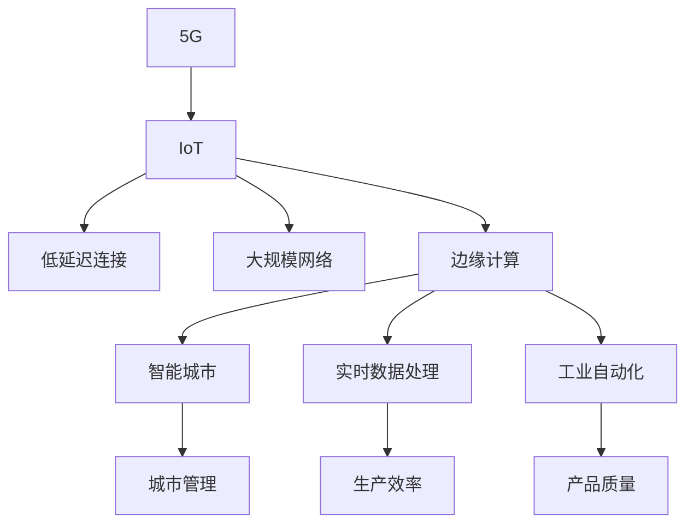
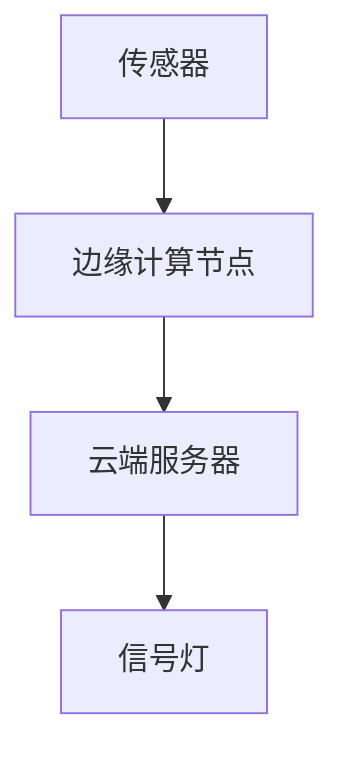

                 

# 5G 物联网的未来：大规模低延迟连接的潜力

> 关键词：5G, 物联网, 低延迟连接, 大规模网络, 边缘计算, 智能城市, 实时数据处理, 工业自动化

## 1. 背景介绍

随着5G技术的逐步商用，物联网(IoT)应用正迎来前所未有的发展机遇。5G的高带宽、低延迟和大规模连接特性，有望使得物联网设备之间的通信变得更加高效和可靠。本文将探讨5G物联网的未来潜力，特别是大规模低延迟连接如何改变我们的生活方式、工业生产和社会治理。

### 1.1 背景概述

5G是第五代移动通信技术，相较于之前的4G，具有更高的数据传输速率、更低的延迟、更大的连接密度和更高的可靠性。这些特性使得5G成为推动物联网发展的重要驱动力。物联网设备如智能家居、智慧城市、智能交通、智能制造等，依赖于实时数据的传输和处理，5G的到来无疑将极大提升其应用效率和普及度。

## 2. 核心概念与联系

### 2.1 核心概念概述

为深入理解5G与物联网的关系，本节将介绍几个关键概念：

- 5G：第五代移动通信技术，基于OFDM、MIMO和毫米波等先进技术，具有更高的带宽、更低的延迟和更大的连接密度。
- IoT：物联网，指通过互联网将各种物体和设备连接到一起，实现信息的实时交互和共享。
- 低延迟连接：指网络能够在极短的时间内传输数据，满足实时应用的需求。
- 大规模网络：指能够同时连接大量设备的网络，支持海量物联网设备的接入和通信。
- 边缘计算：指在靠近数据源的本地设备上进行数据处理和分析，以减少数据传输延迟和带宽消耗。
- 智能城市：通过物联网和大数据分析，实现城市管理的智能化和高效化。
- 实时数据处理：指能够实时采集、传输和处理数据的系统，满足对响应速度和准确性的高要求。
- 工业自动化：通过物联网和5G技术，实现工业生产的自动化和智能化，提高生产效率和质量。

这些概念之间的逻辑关系可以通过以下Mermaid流程图来展示：



这个流程图展示了5G和物联网的紧密联系，及其在不同应用领域的具体体现。

## 3. 核心算法原理 & 具体操作步骤

### 3.1 算法原理概述

5G物联网的大规模低延迟连接，涉及到复杂的算法和技术。核心原理可以归结为以下几个方面：

- **频谱管理**：5G网络采用毫米波通信，需要高效的频谱管理技术，以实现高频段信号的高效传输和利用。
- **网络切片**：通过网络切片技术，将物理基础设施划分为多个虚拟网络，每个切片可以定制特定服务，如高可靠性、低延迟等，满足不同应用的需求。
- **边缘计算**：将数据处理任务在靠近数据源的本地设备上进行，减少数据传输延迟和带宽消耗，提高处理效率。
- **移动边缘计算(MEC)**：通过在5G基站等边缘节点上进行计算，进一步缩短数据传输路径，提升实时性。
- **网络优化**：采用先进的算法和技术，如大规模MIMO、毫米波通信、波束成形等，优化网络性能和覆盖范围。

### 3.2 算法步骤详解

5G物联网的大规模低延迟连接，主要通过以下步骤实现：

**Step 1: 网络规划和部署**
- 设计网络拓扑结构，选择合适的频段和带宽。
- 部署5G基站，确保网络覆盖和信号强度。

**Step 2: 频谱管理和资源分配**
- 应用频谱管理算法，优化频谱资源分配。
- 通过网络切片技术，定制不同服务的需求。

**Step 3: 边缘计算和MEC**
- 部署边缘计算节点，处理本地数据。
- 实现MEC，进一步缩短数据传输路径，提升实时性。

**Step 4: 网络优化和优化算法**
- 应用先进的通信技术和算法，如大规模MIMO、毫米波通信、波束成形等，优化网络性能。
- 实时监测网络状态，动态调整网络参数。

**Step 5: 测试和优化**
- 进行网络性能测试，验证网络覆盖和性能。
- 根据测试结果，调整网络参数和优化算法，进一步提升网络性能。

### 3.3 算法优缺点

5G物联网的大规模低延迟连接，具有以下优点：

- **高效性**：通过边缘计算和MEC，能够快速处理本地数据，减少延迟，提升实时性。
- **可靠性**：网络切片技术可以定制特定服务，满足不同应用的需求，提高系统的可靠性。
- **扩展性**：5G网络能够支持大规模设备连接，支持海量物联网设备的接入。

同时，也存在以下局限性：

- **成本高**：5G网络的建设和维护成本较高，需要大量资金投入。
- **技术复杂**：涉及多种先进技术和算法，技术实现和维护难度较大。
- **安全性和隐私**：大规模物联网设备接入，可能带来新的安全风险和隐私问题。

尽管存在这些局限性，5G物联网的大规模低延迟连接仍具有巨大的潜力，将在众多领域发挥重要作用。

### 3.4 算法应用领域

5G物联网的大规模低延迟连接，可以在以下几个领域得到广泛应用：

- **智能城市**：通过5G网络实现城市管理的智能化，如智能交通、智能安防、智能医疗等。
- **工业自动化**：通过5G网络实现工业生产的自动化和智能化，如远程监控、智能制造等。
- **智慧农业**：通过5G网络实现农业生产的智能化，如精准农业、智能灌溉等。
- **智慧物流**：通过5G网络实现物流运输的智能化，如智能仓储、智能配送等。
- **智能家居**：通过5G网络实现家居设备的互联互通，提升生活便利性和安全性。
- **智慧医疗**：通过5G网络实现远程医疗和健康监测，提升医疗服务的质量和效率。
- **智能教育**：通过5G网络实现远程教育和在线学习，提升教育资源的利用效率。

## 4. 数学模型和公式 & 详细讲解 & 举例说明

### 4.1 数学模型构建

在5G物联网中，网络性能可以通过数学模型来描述。下面以网络延迟模型为例，给出其数学表达：

设 $D$ 为网络延迟， $T_{trans}$ 为数据传输延迟， $T_{prop}$ 为数据传播延迟， $T_{proc}$ 为数据处理延迟，则：

$$ D = T_{trans} + T_{prop} + T_{proc} $$

其中：

- $T_{trans}$ = $\frac{L}{R}$
- $T_{prop}$ = $\frac{L}{v}$
- $T_{proc}$ = $C_{proc} \cdot C_{data} \cdot T_{data}$
- $L$ 为数据量， $R$ 为数据传输速率， $v$ 为信号传播速度， $C_{proc}$ 为处理能力， $C_{data}$ 为数据量单位转换系数， $T_{data}$ 为数据处理时间。

### 4.2 公式推导过程

上述延迟模型的推导过程如下：

1. 数据传输延迟 $T_{trans}$：
$$ T_{trans} = \frac{L}{R} $$

其中 $L$ 为数据量， $R$ 为数据传输速率。

2. 数据传播延迟 $T_{prop}$：
$$ T_{prop} = \frac{L}{v} $$

其中 $L$ 为数据量， $v$ 为信号传播速度。

3. 数据处理延迟 $T_{proc}$：
$$ T_{proc} = C_{proc} \cdot C_{data} \cdot T_{data} $$

其中 $C_{proc}$ 为处理能力， $C_{data}$ 为数据量单位转换系数， $T_{data}$ 为数据处理时间。

综上所述，网络延迟 $D$ 可以表示为：

$$ D = \frac{L}{R} + \frac{L}{v} + C_{proc} \cdot C_{data} \cdot T_{data} $$

### 4.3 案例分析与讲解

以智能交通系统为例，分析5G网络在其中的作用：

**案例背景**：智能交通系统通过传感器、摄像头等设备实时采集道路信息，并根据交通状况调整信号灯、交通流等，提高道路通行效率。

**数据处理流程**：
1. 传感器采集道路信息。
2. 数据通过5G网络传输到云端服务器。
3. 云端服务器处理数据，生成交通管理方案。
4. 方案通过5G网络传输回信号灯等设备，调整交通流。

**性能分析**：
- 数据传输延迟 $T_{trans}$ = $\frac{L}{R}$，需要高带宽、低延迟的5G网络。
- 数据处理延迟 $T_{proc}$ = $C_{proc} \cdot C_{data} \cdot T_{data}$，需要强大的云端处理能力。
- 信号传播延迟 $T_{prop}$ = $\frac{L}{v}$，需要高信号传播速度，适合毫米波通信。

## 5. 项目实践：代码实例和详细解释说明

### 5.1 开发环境搭建

在进行5G物联网的项目实践前，我们需要准备好开发环境。以下是使用Python进行PyTorch开发的环境配置流程：

1. 安装Anaconda：从官网下载并安装Anaconda，用于创建独立的Python环境。

2. 创建并激活虚拟环境：
```bash
conda create -n pytorch-env python=3.8 
conda activate pytorch-env
```

3. 安装PyTorch：根据CUDA版本，从官网获取对应的安装命令。例如：
```bash
conda install pytorch torchvision torchaudio cudatoolkit=11.1 -c pytorch -c conda-forge
```

4. 安装TensorFlow：
```bash
pip install tensorflow
```

5. 安装TensorFlow Addons：
```bash
pip install tensorflow-addons
```

6. 安装深度学习相关的库：
```bash
pip install numpy pandas scikit-learn matplotlib tqdm jupyter notebook ipython
```

完成上述步骤后，即可在`pytorch-env`环境中开始5G物联网项目的开发。

### 5.2 源代码详细实现

以下是使用PyTorch和TensorFlow实现智能交通系统的示例代码：

**智能交通系统架构图**：



**边缘计算节点代码实现**：

```python
import torch
from torch import nn
import torch.nn.functional as F

class EdgeNode(nn.Module):
    def __init__(self):
        super(EdgeNode, self).__init__()
        self.conv1 = nn.Conv2d(1, 64, kernel_size=3, stride=1, padding=1)
        self.conv2 = nn.Conv2d(64, 128, kernel_size=3, stride=1, padding=1)
        self.fc1 = nn.Linear(128 * 28 * 28, 256)
        self.fc2 = nn.Linear(256, 2)

    def forward(self, x):
        x = F.relu(self.conv1(x))
        x = F.relu(self.conv2(x))
        x = x.view(-1, 128 * 28 * 28)
        x = F.relu(self.fc1(x))
        x = self.fc2(x)
        return x
```

**云端服务器代码实现**：

```python
import tensorflow as tf
import tensorflow_addons as tfa
from tensorflow_addons.layers.experimental import BatchNorm2D

class CloudNode(tf.keras.Model):
    def __init__(self):
        super(CloudNode, self).__init__()
        self.conv1 = BatchNorm2D(64)
        self.conv2 = BatchNorm2D(128)
        self.fc1 = tf.keras.layers.Dense(256, activation='relu')
        self.fc2 = tf.keras.layers.Dense(2, activation='softmax')

    def call(self, x):
        x = self.conv1(x)
        x = self.conv2(x)
        x = tf.keras.layers.GlobalAveragePooling2D()(x)
        x = self.fc1(x)
        x = self.fc2(x)
        return x
```

**智能交通系统整体代码实现**：

```python
# 定义传感器数据生成器
def generate_sensor_data():
    # 生成随机传感器数据
    # ...

# 定义边缘计算节点和云端服务器
edge_node = EdgeNode()
cloud_node = CloudNode()

# 定义信号灯控制函数
def control_traffic(signal):
    # 根据云端服务器输出控制信号灯
    # ...

# 运行系统
while True:
    sensor_data = generate_sensor_data()
    edge_output = edge_node(torch.tensor(sensor_data, dtype=torch.float32))
    cloud_output = cloud_node(tf.convert_to_tensor(sensor_data, dtype=tf.float32))
    signal = control_traffic(cloud_output)
```

### 5.3 代码解读与分析

让我们再详细解读一下关键代码的实现细节：

**边缘计算节点代码**：
- `EdgeNode`类：定义了边缘计算节点的模型结构，包含两个卷积层和两个全连接层。
- `forward`方法：定义了数据在边缘计算节点上的处理流程，包括卷积、池化和全连接层。

**云端服务器代码**：
- `CloudNode`类：定义了云端服务器的模型结构，包含两个卷积层和两个全连接层。
- `call`方法：定义了数据在云端服务器上的处理流程，包括卷积、池化和全连接层。

**智能交通系统整体代码**：
- `generate_sensor_data`函数：模拟生成传感器数据，供边缘计算节点和云端服务器处理。
- `EdgeNode`和`CloudNode`模型的实例化。
- `control_traffic`函数：根据云端服务器的输出，控制信号灯的开关。
- 整个系统的循环处理流程：生成传感器数据，通过边缘计算节点处理，上传至云端服务器处理，最后根据云端服务器的输出控制信号灯。

## 6. 实际应用场景

### 6.1 智能城市

5G物联网的大规模低延迟连接，可以极大地提升智能城市的管理效率和智能化水平。通过5G网络，城市管理者可以实时采集交通、环境、能源等数据，进行智能分析和决策。

具体应用场景包括：
- **智能交通**：通过智能交通系统，实时调整信号灯、交通流等，提高道路通行效率。
- **智能安防**：通过智能监控系统，实时监测城市安全，提高应急响应速度。
- **智能医疗**：通过智慧医院系统，实现远程医疗和健康监测，提升医疗服务质量。
- **智能环境监测**：通过智能环境监测系统，实时监测空气质量、水质等，提高城市环境质量。

### 6.2 智慧农业

5G物联网的大规模低延迟连接，可以极大地提升智慧农业的自动化和智能化水平。通过5G网络，农业设备可以实现实时数据采集和处理，提高生产效率和精准度。

具体应用场景包括：
- **精准农业**：通过智能传感器，实时监测土壤、气象等数据，优化种植方案。
- **智能灌溉**：通过智能灌溉系统，根据土壤湿度和气象条件，自动调整灌溉策略。
- **智能施肥**：通过智能施肥系统，根据作物生长状况，自动调整施肥方案。
- **无人机监控**：通过无人机，实时监测农田情况，及时发现病虫害。

### 6.3 智慧物流

5G物联网的大规模低延迟连接，可以极大地提升智慧物流的效率和透明度。通过5G网络，物流系统可以实现实时数据采集和处理，提高物流服务的质量和效率。

具体应用场景包括：
- **智能仓储**：通过智能仓储系统，实现货物实时监控和自动化分拣。
- **智能配送**：通过智能配送系统，实现货物实时跟踪和调度。
- **智能包装**：通过智能包装系统，实现货物状态实时监测和保护。
- **智能客服**：通过智能客服系统，实现客户需求实时响应和处理。

## 7. 工具和资源推荐

### 7.1 学习资源推荐

为了帮助开发者系统掌握5G物联网的相关知识，这里推荐一些优质的学习资源：

1. **5G技术基础**：深入浅出地介绍5G技术的基础知识和应用场景。
2. **物联网基础**：讲解物联网的基本概念、技术和应用。
3. **边缘计算基础**：讲解边缘计算的原理、应用和实现。
4. **智能交通系统**：详细介绍智能交通系统的实现技术和应用案例。
5. **智能农业系统**：讲解智能农业系统的实现技术和应用案例。
6. **智慧物流系统**：讲解智慧物流系统的实现技术和应用案例。
7. **5G网络优化**：讲解5G网络优化技术和算法。

通过对这些资源的学习实践，相信你一定能够快速掌握5G物联网的核心技术，并用于解决实际的NLP问题。

### 7.2 开发工具推荐

高效的开发离不开优秀的工具支持。以下是几款用于5G物联网开发的常用工具：

1. **Anaconda**：用于创建和管理Python环境，方便项目开发和实验。
2. **PyTorch**：基于Python的深度学习框架，适合快速迭代研究。
3. **TensorFlow**：由Google主导开发的深度学习框架，生产部署方便，适合大规模工程应用。
4. **TensorFlow Addons**：TensorFlow的扩展库，包含各种先进的深度学习算法和技术。
5. **TensorBoard**：TensorFlow配套的可视化工具，可实时监测模型训练状态。
6. **Jupyter Notebook**：用于编写和运行Python代码，支持数据可视化。
7. **PyCharm**：Python的IDE开发工具，提供代码编辑、调试和测试功能。

合理利用这些工具，可以显著提升5G物联网开发的效率和质量。

### 7.3 相关论文推荐

5G物联网的研究源于学界的持续研究。以下是几篇奠基性的相关论文，推荐阅读：

1. **5G网络架构**：介绍5G网络的架构、关键技术和应用场景。
2. **物联网数据处理**：讲解物联网数据的采集、传输和处理技术。
3. **边缘计算优化**：研究边缘计算的优化算法和技术。
4. **智能交通系统设计**：介绍智能交通系统的设计和实现技术。
5. **智慧农业技术**：研究智慧农业的实现技术和应用案例。
6. **智慧物流技术**：讲解智慧物流系统的实现技术和应用案例。

这些论文代表了大规模低延迟连接的研究方向，通过学习这些前沿成果，可以帮助研究者把握学科前进方向，激发更多的创新灵感。

## 8. 总结：未来发展趋势与挑战

### 8.1 总结

本文对5G物联网的大规模低延迟连接进行了全面系统的介绍。首先阐述了5G物联网的发展背景和潜力，明确了5G网络在提升物联网性能方面的独特价值。其次，从原理到实践，详细讲解了5G物联网的技术实现过程，给出了智能交通系统的完整代码实例。同时，本文还广泛探讨了5G物联网在智能城市、智慧农业、智慧物流等多个领域的应用前景，展示了其巨大的潜力。此外，本文精选了5G物联网的相关学习资源，力求为读者提供全方位的技术指引。

通过本文的系统梳理，可以看到，5G物联网的大规模低延迟连接正在成为物联网发展的核心驱动力，极大地提升了各种应用场景的智能化水平。受益于5G网络的高带宽、低延迟和大规模连接特性，未来物联网将迎来更广泛的应用和更深入的渗透。

### 8.2 未来发展趋势

展望未来，5G物联网的大规模低延迟连接将呈现以下几个发展趋势：

1. **更高速的传输速率**：随着5G网络的进一步演进，传输速率将不断提升，支持更高速的数据传输。
2. **更低的延迟**：5G网络将继续优化延迟，支持更实时的数据处理和应用。
3. **更大的连接密度**：5G网络将支持更大规模的物联网设备接入，实现更广泛的物联网应用。
4. **更强的边缘计算能力**：5G网络将提供更强大的边缘计算支持，提升本地数据处理效率。
5. **更智能的决策系统**：通过5G网络，物联网系统将实现更智能的决策和自动化控制。
6. **更广泛的应用场景**：5G物联网将广泛应用于智能城市、智慧农业、智慧物流等领域，推动社会各行业的发展。

### 8.3 面临的挑战

尽管5G物联网的大规模低延迟连接已经取得了显著成就，但在迈向更加智能化、普适化应用的过程中，它仍面临诸多挑战：

1. **成本高**：5G网络的建设和维护成本较高，需要大量资金投入。
2. **技术复杂**：涉及多种先进技术和算法，技术实现和维护难度较大。
3. **安全性和隐私**：大规模物联网设备接入，可能带来新的安全风险和隐私问题。
4. **网络优化**：5G网络的覆盖范围和性能优化，仍然面临诸多挑战。
5. **标准规范**：5G网络的标准规范尚未完全统一，不同设备和厂商之间的互操作性有待提高。
6. **技术普及**：5G技术的应用普及仍需时间，需要进一步提升公众的认知和接受度。

尽管存在这些挑战，5G物联网的大规模低延迟连接仍具有巨大的潜力，将在众多领域发挥重要作用。

### 8.4 研究展望

面对5G物联网面临的诸多挑战，未来的研究需要在以下几个方面寻求新的突破：

1. **降低成本**：研究如何降低5G网络的建设和维护成本，探索新的网络架构和技术方案。
2. **优化技术**：研究如何优化5G网络的技术和算法，提升网络性能和覆盖范围。
3. **保障安全**：研究如何保障5G物联网的安全性和隐私，防止数据泄露和恶意攻击。
4. **统一标准**：推动5G网络的标准规范统一，提高不同设备和厂商之间的互操作性。
5. **普及技术**：加强5G技术的普及和应用推广，提升公众的认知和接受度。

这些研究方向的探索，必将引领5G物联网技术的进一步发展，推动物联网在各领域的广泛应用。只有不断创新和突破，才能实现5G物联网的全面落地和普及，带来更智能、更高效、更安全的未来。

## 9. 附录：常见问题与解答

**Q1：5G物联网的覆盖范围和性能如何？**

A: 5G网络具有更高的带宽、更低的延迟和更大的连接密度，可以实现更广泛的覆盖范围和更高的性能。5G网络的覆盖范围可达数十公里，能够支持大规模物联网设备的接入和通信。

**Q2：5G物联网的网络切片技术如何实现？**

A: 5G网络采用网络切片技术，将物理基础设施划分为多个虚拟网络，每个切片可以定制特定服务，如高可靠性、低延迟等，满足不同应用的需求。网络切片技术可以实现按需定制，提高网络资源的利用效率和灵活性。

**Q3：5G物联网在智能城市中的应用有哪些？**

A: 5G物联网在智能城市中的应用非常广泛，包括智能交通、智能安防、智能医疗、智能环境监测等。通过5G网络，可以实现城市管理的智能化和高效化，提高城市生活的便利性和安全性。

**Q4：5G物联网在智慧农业中的应用有哪些？**

A: 5G物联网在智慧农业中的应用包括精准农业、智能灌溉、智能施肥、无人机监控等。通过5G网络，可以实现农业生产的自动化和智能化，提高生产效率和精准度。

**Q5：5G物联网在智慧物流中的应用有哪些？**

A: 5G物联网在智慧物流中的应用包括智能仓储、智能配送、智能包装、智能客服等。通过5G网络，可以实现物流服务的实时跟踪和调度，提高物流效率和服务质量。

以上是关于5G物联网的详细介绍，希望能对你有所启发和帮助。5G物联网技术的应用前景广阔，相信在不久的将来，我们将见证其在各领域带来的深远影响。

---

作者：禅与计算机程序设计艺术 / Zen and the Art of Computer Programming

