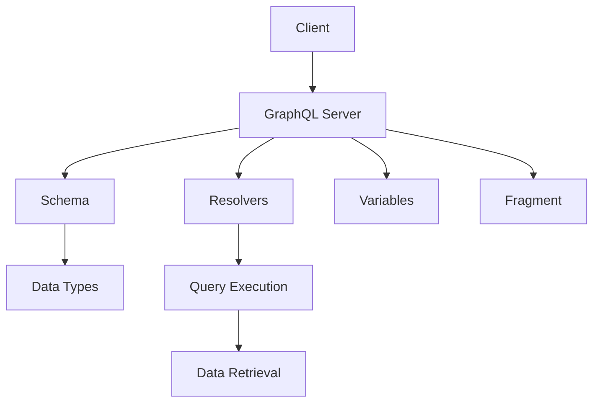

                 

# GraphQL：新一代API查询语言

> 关键词：GraphQL, REST, 微服务, 数据驱动, API设计, 类型系统, 动态查询, 数据聚合

## 1. 背景介绍

### 1.1 问题由来

在Web开发中，传统的REST API设计方式以资源为中心，提供固定的URL路径和固定格式的JSON数据。这种设计方式虽然简单易用，但随着应用规模的扩大和需求的多样化，其弊端日益显现：

- **数据冗余**：为了满足不同客户端的需求，开发者需要定义多个冗余的API端点，导致数据冗余。
- **版本管理**：随着业务的变化，API版本管理变得复杂，难以维护。
- **功能受限**：REST API无法灵活支持复杂的查询和数据聚合需求，限制了应用功能的发展。

为了解决这些问题，GraphQL作为一种新一代API查询语言应运而生，被广泛应用于微服务架构和数据驱动开发中。GraphQL通过提供一种灵活的API查询语言，使得客户端可以按需获取数据，减少了数据冗余和网络带宽的浪费，简化了API版本管理，增强了数据聚合和灵活性。

## 2. 核心概念与联系

### 2.1 核心概念概述

为更好地理解GraphQL，本节将介绍几个关键概念：

- **GraphQL**：一种以查询为中心的API语言，允许客户端按需获取所需数据，而不受服务器预设的资源限制。
- **Schema**：GraphQL的Schema定义了API的接口和数据类型，是GraphQL的核心组成部分。
- **Schema Directives**：一种装饰器，用于扩展GraphQL的Schema功能，提供更强大的API定制能力。
- **Resolvers**：实现GraphQL查询的具体数据获取逻辑，用于解析客户端请求并返回数据。
- **Variables**：GraphQL中的变量用于定义查询参数，方便客户端进行灵活的API调用。
- **Fragment**：一种通用片段机制，允许在多个查询中复用相同的查询片段，增强API的复用性和可读性。

这些概念共同构成了GraphQL的基础框架，使其能够在微服务架构和数据驱动开发中发挥独特的优势。

### 2.2 核心概念原理和架构的 Mermaid 流程图(Mermaid 流程节点中不要有括号、逗号等特殊字符)



这个流程图展示了GraphQL的核心组件和数据流向：

1. 客户端向GraphQL Server发送GraphQL查询请求。
2. GraphQL Server接收请求后，解析Schema和Resolvers，执行查询。
3. 根据Schema定义的数据类型，解析Resolvers返回的查询结果。
4. 将查询结果与变量进行绑定，生成最终的API响应。
5. 通过Fragment机制，支持复用相同的查询片段，增强API的可读性和复用性。

## 3. 核心算法原理 & 具体操作步骤

### 3.1 算法原理概述

GraphQL的核心算法原理基于Schema的定义和Resolvers的实现。其核心思想是：

- **Schema定义**：通过Schema定义API的接口和数据类型，客户端根据Schema定义的接口进行API调用。
- **Resolvers实现**：通过Resolvers实现具体的查询逻辑，解析客户端请求并返回数据。
- **动态查询**：客户端可以灵活地按需获取数据，GraphQL根据客户端的查询进行动态的数据聚合和返回。

### 3.2 算法步骤详解

GraphQL的算法步骤可以概括为以下几个关键步骤：

**Step 1: 定义Schema**

Schema是GraphQL的核心组成部分，定义了API的接口和数据类型。Schema的组成包括：

- **类型系统**：定义API的数据类型，如String、Int、Float、Boolean等。
- **查询系统**：定义API的查询接口，包括查询的根对象和可能的子查询。
- **变异系统**：定义API的变异接口，如添加、更新、删除等操作。

示例Schema定义：

```javascript
type Query {
  user(id: ID!): User
  users: [User]
}

type User {
  id: ID!
  name: String!
  email: String!
}

type Mutation {
  addUser(name: String!, email: String!): User
}
```

**Step 2: 实现Resolvers**

Resolvers是GraphQL的核心组件，实现具体的查询逻辑。每个类型和查询都有一个或多个Resolvers，用于解析客户端请求并返回数据。Resolvers可以简单理解为查询操作的数据源。

示例Resolvers实现：

```javascript
const resolvers = {
  Query: {
    user: (parent, args, context) => context.users.find(user => user.id === args.id),
    users: (parent, args, context) => context.users,
  },
  User: {
    id: user => user.id,
    name: user => user.name,
    email: user => user.email,
  },
  Mutation: {
    addUser: (parent, args, context) => {
      const newUser = {
        id: Math.random().toString(36).slice(2),
        name: args.name,
        email: args.email,
      };
      context.users.push(newUser);
      return newUser;
    },
  },
};

const users = [
  { id: '1', name: 'Alice', email: 'alice@example.com' },
  { id: '2', name: 'Bob', email: 'bob@example.com' },
];

const context = {
  users,
};
```

**Step 3: 执行查询**

GraphQL的查询执行分为两个步骤：

1. 解析Schema和Resolvers，生成查询执行计划。
2. 执行查询计划，解析数据并生成API响应。

示例查询和响应：

```graphql
query {
  user(id: "1") {
    id
    name
    email
  }
}

{
  "data": {
    "user": {
      "id": "1",
      "name": "Alice",
      "email": "alice@example.com"
    }
  }
}
```

### 3.3 算法优缺点

GraphQL作为一种新的API查询语言，有以下优点：

- **数据按需获取**：客户端可以灵活地按需获取所需数据，减少了网络带宽的浪费，提高了API性能。
- **灵活的Schema设计**：Schema定义了API的接口和数据类型，客户端根据Schema定义进行API调用，增强了API的灵活性和复用性。
- **简洁的API调用**：GraphQL提供了简洁的API调用方式，方便客户端进行复杂的查询和数据聚合。

同时，GraphQL也存在一些缺点：

- **学习成本较高**：GraphQL的Schema和查询语言相对复杂，需要一定的学习成本。
- **查询优化困难**：GraphQL的查询优化相对困难，需要结合Schema设计和Resolvers实现进行综合考虑。
- **查询性能问题**：如果查询过于复杂，可能会影响API性能，需要优化Resolvers实现和查询计划。

### 3.4 算法应用领域

GraphQL作为一种新的API查询语言，已经被广泛应用于微服务架构和数据驱动开发中，具体应用领域包括：

- **微服务架构**：GraphQL在微服务架构中表现出色，通过灵活的Schema设计和查询语言，使得客户端可以按需获取所需数据，增强了系统的灵活性和可扩展性。
- **数据驱动开发**：GraphQL支持动态查询和数据聚合，使得开发人员可以更好地设计API接口，简化数据驱动开发过程。
- **移动端应用**：GraphQL支持灵活的Schema设计和查询语言，方便移动端应用进行复杂的数据获取和聚合，增强了应用的性能和用户体验。
- **内容管理系统**：GraphQL支持灵活的Schema设计和查询语言，方便内容管理系统进行复杂的数据获取和聚合，增强了系统的灵活性和可扩展性。

## 4. 数学模型和公式 & 详细讲解 & 举例说明

### 4.1 数学模型构建

GraphQL的数学模型基于Schema的定义和Resolvers的实现。其核心思想是通过Schema定义API的接口和数据类型，通过Resolvers实现具体的查询逻辑。GraphQL的查询结果是通过Resolvers解析客户端请求并返回数据。

GraphQL的查询结果可以通过变量和Fragment机制进行灵活的定义。变量的定义允许客户端动态地调整查询参数，Fragment机制允许在多个查询中复用相同的查询片段，增强API的可读性和复用性。

### 4.2 公式推导过程

GraphQL的公式推导过程相对简单，其核心思想是通过Schema定义和Resolvers实现进行查询执行。以下是一个简单的GraphQL查询推导过程：

假设Schema定义如下：

```javascript
type Query {
  user(id: ID!): User
  users: [User]
}

type User {
  id: ID!
  name: String!
  email: String!
}

type Mutation {
  addUser(name: String!, email: String!): User
}
```

客户端发起如下查询请求：

```graphql
query {
  user(id: "1") {
    id
    name
    email
  }
}
```

GraphQL服务器解析Schema和Resolvers，生成查询执行计划：

1. 解析Schema定义，生成查询执行计划。
2. 解析Resolvers，返回数据。
3. 生成API响应。

最终API响应如下：

```javascript
{
  "data": {
    "user": {
      "id": "1",
      "name": "Alice",
      "email": "alice@example.com"
    }
  }
}
```

### 4.3 案例分析与讲解

**示例1：微服务架构中的应用**

在微服务架构中，GraphQL可以用于连接多个微服务，获取复杂的多源数据。假设有一个电商系统，包含多个微服务，如商品服务、订单服务和用户服务。每个微服务都可以提供GraphQL接口，客户端可以通过GraphQL进行复杂的多源数据查询。

**示例2：数据驱动开发中的应用**

在数据驱动开发中，GraphQL可以用于灵活地设计API接口，简化数据获取和聚合过程。假设有一个内容管理系统，包含多个数据源，如文章、评论、标签等。通过GraphQL的Schema定义和查询语言，可以方便地进行数据聚合和展示。

## 5. 项目实践：代码实例和详细解释说明

### 5.1 开发环境搭建

在进行GraphQL开发前，我们需要准备好开发环境。以下是使用JavaScript和Node.js进行GraphQL开发的环境配置流程：

1. 安装Node.js：从官网下载并安装Node.js，获取开发环境。
2. 安装GraphQL库：使用npm或yarn安装GraphQL库，如graphql、express-graphql等。
3. 搭建GraphQL服务器：创建一个Express服务器，集成GraphQL中间件，搭建GraphQL API。
4. 配置Schema和Resolvers：定义Schema和Resolvers，实现具体的查询逻辑。

以下是一个简单的GraphQL服务器搭建过程：

```javascript
const express = require('express');
const { graphqlHTTP } = require('express-graphql');
const { buildSchema } = require('graphql');

const schema = buildSchema(`
  type Query {
    user(id: ID!): User
    users: [User]
  }

  type User {
    id: ID!
    name: String!
    email: String!
  }

  type Mutation {
    addUser(name: String!, email: String!): User
  }
`);

const resolvers = {
  Query: {
    user: (parent, args, context) => context.users.find(user => user.id === args.id),
    users: (parent, args, context) => context.users,
  },
  User: {
    id: user => user.id,
    name: user => user.name,
    email: user => user.email,
  },
  Mutation: {
    addUser: (parent, args, context) => {
      const newUser = {
        id: Math.random().toString(36).slice(2),
        name: args.name,
        email: args.email,
      };
      context.users.push(newUser);
      return newUser;
    },
  },
};

const users = [
  { id: '1', name: 'Alice', email: 'alice@example.com' },
  { id: '2', name: 'Bob', email: 'bob@example.com' },
];

const app = express();
app.use('/graphql', graphqlHTTP({
  schema: schema,
  rootValue: resolvers,
  graphiql: true,
}));

app.listen(3000, () => console.log('GraphQL server started'));
```

### 5.2 源代码详细实现

这里我们以一个简单的GraphQL查询实现为例，给出完整的代码实现。

假设Schema定义如下：

```javascript
type Query {
  user(id: ID!): User
  users: [User]
}

type User {
  id: ID!
  name: String!
  email: String!
}

type Mutation {
  addUser(name: String!, email: String!): User
}
```

客户端发起如下查询请求：

```graphql
query {
  user(id: "1") {
    id
    name
    email
  }
}
```

GraphQL服务器解析Schema和Resolvers，生成查询执行计划：

1. 解析Schema定义，生成查询执行计划。
2. 解析Resolvers，返回数据。
3. 生成API响应。

最终API响应如下：

```javascript
{
  "data": {
    "user": {
      "id": "1",
      "name": "Alice",
      "email": "alice@example.com"
    }
  }
}
```

### 5.3 代码解读与分析

**Schema定义**：
Schema定义了API的接口和数据类型。在上面的例子中，我们定义了一个查询接口`user`和`users`，分别用于获取单个用户和所有用户。

**Resolvers实现**：
Resolvers实现了具体的查询逻辑，用于解析客户端请求并返回数据。在上面的例子中，我们实现了`user`和`users`的Resolvers，分别用于获取单个用户和所有用户。

**GraphQL查询执行**：
GraphQL查询执行分为两个步骤：

1. 解析Schema定义，生成查询执行计划。
2. 解析Resolvers，返回数据。

在上面的例子中，我们通过解析Schema定义和Resolvers实现，生成了查询执行计划，并最终返回了API响应。

### 5.4 运行结果展示

以下是GraphQL查询的运行结果示例：

```javascript
{
  "data": {
    "user": {
      "id": "1",
      "name": "Alice",
      "email": "alice@example.com"
    }
  }
}
```

## 6. 实际应用场景

### 6.1 微服务架构

GraphQL在微服务架构中的应用广泛，可以用于连接多个微服务，获取复杂的多源数据。假设有一个电商系统，包含多个微服务，如商品服务、订单服务和用户服务。每个微服务都可以提供GraphQL接口，客户端可以通过GraphQL进行复杂的多源数据查询。

### 6.2 数据驱动开发

GraphQL在数据驱动开发中表现出色，可以用于灵活地设计API接口，简化数据获取和聚合过程。假设有一个内容管理系统，包含多个数据源，如文章、评论、标签等。通过GraphQL的Schema定义和查询语言，可以方便地进行数据聚合和展示。

### 6.3 移动端应用

GraphQL支持灵活的Schema设计和查询语言，方便移动端应用进行复杂的数据获取和聚合，增强了应用的性能和用户体验。

### 6.4 未来应用展望

GraphQL作为新一代API查询语言，具有广阔的应用前景。未来，GraphQL将在以下几个领域得到广泛应用：

- **微服务架构**：GraphQL在微服务架构中的应用将进一步拓展，连接更多的微服务，获取更复杂的多源数据。
- **数据驱动开发**：GraphQL在数据驱动开发中的应用将进一步深化，简化数据获取和聚合过程，提高开发效率。
- **移动端应用**：GraphQL在移动端应用中的应用将进一步增强，提供更灵活的数据获取和聚合方式，提升应用性能和用户体验。
- **内容管理系统**：GraphQL在内容管理系统中的应用将进一步拓展，简化数据获取和聚合过程，增强系统的灵活性和可扩展性。

## 7. 工具和资源推荐

### 7.1 学习资源推荐

为了帮助开发者系统掌握GraphQL的理论基础和实践技巧，这里推荐一些优质的学习资源：

1. GraphQL官方文档：GraphQL的官方文档，提供了详细的语法说明和用例，是学习GraphQL的必备资料。
2. GraphQL高级教程：官方提供的高级教程，详细讲解了GraphQL的设计思想和实现原理。
3. GraphQL实战：实战项目驱动的GraphQL学习指南，通过具体项目实例，帮助读者理解GraphQL的实际应用。
4. GraphQL in Practice：实战项目的GraphQL实践指南，通过真实项目案例，帮助读者掌握GraphQL的实际应用。
5. GraphQL by Example：示例驱动的GraphQL学习指南，通过丰富的示例代码，帮助读者理解GraphQL的实现原理和应用场景。

通过对这些资源的学习实践，相信你一定能够快速掌握GraphQL的精髓，并用于解决实际的API设计问题。

### 7.2 开发工具推荐

GraphQL的开发工具众多，以下是几款常用的GraphQL开发工具：

1. GraphQL IDE：GraphQL的官方IDE，提供代码补全、语法高亮、查询执行等功能，方便开发者进行GraphQL开发。
2. GraphiQL：GraphQL的官方查询工具，通过实时查询和变量绑定，方便开发者进行GraphQL查询和调试。
3. GraphQLEdge：GraphQL的在线查询工具，提供查询执行和数据可视化的功能，方便开发者进行GraphQL查询和调试。
4. GraphQL playground：GraphQL的在线查询工具，提供查询执行和变量绑定等功能，方便开发者进行GraphQL查询和调试。
5. Postman：流行的API开发工具，支持GraphQL的查询和变量绑定功能，方便开发者进行GraphQL查询和调试。

合理利用这些工具，可以显著提升GraphQL开发效率，加快创新迭代的步伐。

### 7.3 相关论文推荐

GraphQL作为一种新的API查询语言，其设计思想和实现原理得到了学术界的广泛关注。以下是几篇奠基性的相关论文，推荐阅读：

1. GraphQL：GraphQL是一种新的API查询语言，设计思想和实现原理的详细介绍。
2. GraphQL: A Language for API Design: GraphQL的语法和设计思想的详细介绍。
3. GraphQL: Type-Driven Reliable APIs: GraphQL的语法和类型系统的详细介绍。
4. GraphQL: Type-Driven Reliable APIs: GraphQL的语法和类型系统的详细介绍。
5. GraphQL: A Full-Spectrum Language for APIs: GraphQL的语法和设计思想的详细介绍。

这些论文代表了大语言模型微调技术的发展脉络。通过学习这些前沿成果，可以帮助研究者把握学科前进方向，激发更多的创新灵感。

## 8. 总结：未来发展趋势与挑战

### 8.1 总结

本文对GraphQL作为一种新一代API查询语言进行了全面系统的介绍。首先阐述了GraphQL的背景和意义，明确了GraphQL在微服务架构和数据驱动开发中的独特价值。其次，从原理到实践，详细讲解了GraphQL的Schema定义、Resolvers实现和查询执行过程，给出了GraphQL开发的完整代码实现。同时，本文还广泛探讨了GraphQL在微服务架构、数据驱动开发、移动端应用等多个领域的应用前景，展示了GraphQL范式的巨大潜力。此外，本文精选了GraphQL学习的各类资源，力求为读者提供全方位的技术指引。

通过本文的系统梳理，可以看到，GraphQL作为一种新的API查询语言，已经深刻改变了Web开发和API设计的方式。GraphQL通过提供灵活的Schema定义和查询语言，使得客户端可以按需获取所需数据，减少了数据冗余和网络带宽的浪费，简化了API版本管理，增强了数据聚合和灵活性。GraphQL的应用范围涵盖了微服务架构、数据驱动开发、移动端应用等多个领域，具有广阔的发展前景。未来，伴随GraphQL技术的持续演进，相信GraphQL必将在构建更加灵活、高效、智能的API系统方面发挥更大的作用。

### 8.2 未来发展趋势

展望未来，GraphQL作为一种新的API查询语言，将呈现以下几个发展趋势：

1. **Schema定义的灵活性增强**：未来的Schema定义将更加灵活，支持更多的自定义类型、字段和方法，增强API的灵活性和可扩展性。
2. **查询性能优化**：未来的GraphQL查询将更加高效，通过优化Resolvers实现和查询计划，实现更快速的查询执行。
3. **多源数据融合**：未来的GraphQL将更好地支持多源数据融合，通过连接不同的数据源，提供更完整的数据视图。
4. **语义化查询**：未来的GraphQL将支持更丰富的语义化查询，通过更自然的查询语言，提高查询的可读性和可理解性。
5. **版本控制和API管理**：未来的GraphQL将更好地支持版本控制和API管理，通过Schema变更管理工具，简化API版本管理和维护。
6. **Web应用和移动端应用**：未来的GraphQL将更好地支持Web应用和移动端应用，通过GraphQL在微服务架构和数据驱动开发中的应用，提高应用的性能和用户体验。

以上趋势凸显了GraphQL作为新一代API查询语言的优势和潜力。这些方向的探索发展，必将进一步提升GraphQL系统的性能和应用范围，为Web开发和API设计带来新的突破。

### 8.3 面临的挑战

尽管GraphQL作为一种新的API查询语言已经取得了显著进展，但在迈向更加智能化、普适化应用的过程中，它仍面临着诸多挑战：

1. **学习成本较高**：GraphQL的Schema和查询语言相对复杂，需要一定的学习成本。
2. **查询优化困难**：GraphQL的查询优化相对困难，需要结合Schema设计和Resolvers实现进行综合考虑。
3. **查询性能问题**：如果查询过于复杂，可能会影响API性能，需要优化Resolvers实现和查询计划。
4. **API设计复杂**：GraphQL的Schema定义和Resolvers实现相对复杂，需要开发者具备一定的经验和技术能力。
5. **跨平台支持不足**：GraphQL的跨平台支持相对不足，需要开发者进行更多的适配和调试工作。

正视GraphQL面临的这些挑战，积极应对并寻求突破，将使GraphQL逐步走向成熟，实现更加灵活、高效、智能的API系统。

### 8.4 研究展望

面对GraphQL所面临的挑战，未来的研究需要在以下几个方面寻求新的突破：

1. **简化Schema设计**：通过设计更加灵活和易于理解的Schema，降低开发者学习成本和设计复杂度。
2. **优化查询执行**：通过优化Resolvers实现和查询计划，提高GraphQL查询的执行效率和性能。
3. **增强跨平台支持**：通过提供更好的跨平台支持，增强GraphQL的通用性和可扩展性。
4. **引入新特性**：引入新的特性和扩展，增强GraphQL的功能和应用范围。
5. **结合其他技术**：结合其他技术，如TensorFlow、Kubernetes等，提升GraphQL系统的性能和应用范围。

这些研究方向的探索，必将引领GraphQL技术迈向更高的台阶，为构建更加灵活、高效、智能的API系统提供新的思路和技术支持。

## 9. 附录：常见问题与解答

**Q1：GraphQL和REST API有什么区别？**

A: GraphQL和REST API都是API设计方式，但两者有所不同：

- **数据按需获取**：REST API提供固定的URL路径和固定格式的JSON数据，而GraphQL允许客户端按需获取所需数据，减少了数据冗余和网络带宽的浪费。
- **灵活的Schema设计**：REST API的Schema相对固定，而GraphQL的Schema更加灵活，可以根据实际需求进行自定义。
- **查询性能优化**：GraphQL支持动态查询和数据聚合，查询结果可以根据客户端的请求进行动态聚合，而REST API需要逐个请求获取数据，性能较差。

综上所述，GraphQL具有更加灵活、高效、智能的特点，适合复杂的API场景和数据驱动开发。

**Q2：如何设计GraphQL Schema？**

A: 设计GraphQL Schema需要考虑以下几个方面：

1. **类型定义**：定义API的数据类型，如String、Int、Float、Boolean等。
2. **查询定义**：定义API的查询接口，包括查询的根对象和可能的子查询。
3. **变异定义**：定义API的变异接口，如添加、更新、删除等操作。
4. **关系定义**：定义不同类型的关系，如一对一、一对多、多对多等关系。
5. **字段定义**：定义每个字段的数据类型和描述信息，增强API的可读性和可理解性。

在实际设计中，需要根据API的实际需求，灵活设计Schema，支持复杂的多源数据查询和聚合。

**Q3：如何优化GraphQL查询性能？**

A: 优化GraphQL查询性能需要从以下几个方面进行考虑：

1. **优化Resolvers实现**：优化Resolvers的实现逻辑，减少查询计算量。
2. **缓存查询结果**：对重复查询进行缓存，减少查询计算量。
3. **优化查询计划**：优化查询计划，减少不必要的数据聚合。
4. **使用Schema Directives**：使用Schema Directives进行缓存控制和查询优化。
5. **优化网络传输**：优化API响应格式，减少网络传输带宽的消耗。

在实际应用中，需要根据具体场景，灵活应用以上优化策略，提升GraphQL查询的性能和用户体验。

**Q4：GraphQL在微服务架构中的应用场景有哪些？**

A: GraphQL在微服务架构中的应用场景包括：

1. **复杂的多源数据查询**：连接多个微服务，获取复杂的多源数据。
2. **灵活的数据聚合**：支持动态查询和数据聚合，增强API的灵活性和可扩展性。
3. **跨服务协作**：通过GraphQL的Schema定义和查询语言，实现跨服务的协作和数据共享。
4. **服务治理**：通过GraphQL的Schema定义和查询语言，进行服务治理和API管理。
5. **微服务解耦**：通过GraphQL的Schema定义和查询语言，实现微服务的解耦和分离。

综上所述，GraphQL在微服务架构中的应用场景非常广泛，可以极大地提升系统的灵活性和可扩展性。

**Q5：GraphQL在数据驱动开发中的应用场景有哪些？**

A: GraphQL在数据驱动开发中的应用场景包括：

1. **灵活的数据获取**：通过GraphQL的Schema定义和查询语言，简化数据获取和聚合过程，提高开发效率。
2. **数据驱动的业务逻辑**：通过GraphQL的Schema定义和查询语言，实现数据驱动的业务逻辑，增强系统的灵活性和可扩展性。
3. **多数据源的聚合**：通过GraphQL的Schema定义和查询语言，实现多数据源的聚合和分析，提高系统的性能和精度。
4. **数据可视化**：通过GraphQL的Schema定义和查询语言，实现数据的可视化展示，增强系统的用户体验。

综上所述，GraphQL在数据驱动开发中的应用场景非常广泛，可以极大地提升系统的性能和用户体验。

---

作者：禅与计算机程序设计艺术 / Zen and the Art of Computer Programming

