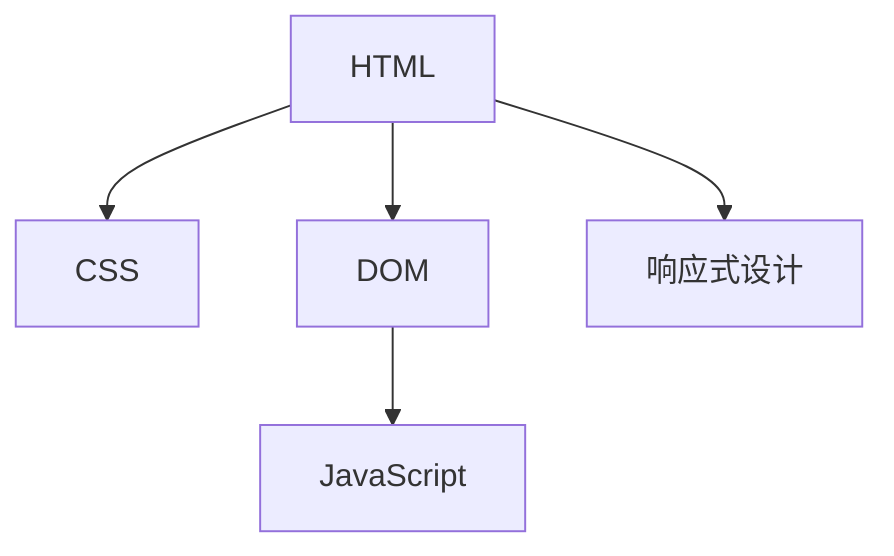

                 

# HTML 和 CSS 基础：创建网页结构和样式

> 关键词：HTML, CSS, 网页结构, 样式表, 网页布局, 响应式设计, 用户界面设计

## 1. 背景介绍

### 1.1 问题由来
在网页开发中，HTML和CSS是两个不可或缺的基础技术。HTML负责网页内容的组织和结构，而CSS则负责网页的样式和布局。学习HTML和CSS是每个网页开发者的必修课。本节将简要介绍HTML和CSS的历史背景及其重要性。

### 1.2 问题核心关键点
HTML和CSS的核心关键点在于它们如何实现网页的布局和样式，以及它们是如何配合使用的。HTML提供了网页的结构和内容，而CSS则负责网页的视觉呈现。通过HTML和CSS的配合，我们可以创建出美观、功能完善的网页。

## 2. 核心概念与联系

### 2.1 核心概念概述

为了更好地理解HTML和CSS，我们需要首先了解几个核心概念：

- HTML：HyperText Markup Language，超文本标记语言，用于描述网页的结构和内容。
- CSS：Cascading Style Sheets，层叠样式表，用于控制网页的样式和布局。
- DOM：Document Object Model，文档对象模型，将HTML文档表示为树形结构，方便JavaScript操作。
- 网页布局：指通过HTML和CSS实现网页的布局方式，如流式布局、栅格布局等。
- 响应式设计：指通过CSS和JavaScript等技术，实现网页在不同设备上的自适应布局和显示效果。

这些概念之间的联系可以通过以下Mermaid流程图来展示：



这个流程图展示了几大核心概念及其之间的关系：

1. HTML提供了网页的基本结构，是网页内容的主要载体。
2. CSS对HTML文档进行样式控制，实现网页的布局和显示效果。
3. DOM将HTML文档转换为树形结构，方便JavaScript操作。
4. 响应式设计通过CSS和JavaScript，实现网页在不同设备上的自适应布局。

## 3. 核心算法原理 & 具体操作步骤
### 3.1 算法原理概述

HTML和CSS的核心算法原理可以简单概括为：

- HTML负责定义网页的语义结构，包括标题、段落、链接、列表等标签，以及它们的属性。
- CSS负责定义网页的样式和布局，包括字体、颜色、大小、位置等属性，以及盒模型、浮动等布局方式。

通过HTML和CSS的配合，我们可以实现网页的语义结构和视觉呈现的完美结合。

### 3.2 算法步骤详解

基于HTML和CSS的网页开发流程一般包括以下几个关键步骤：

**Step 1: 设计网页结构**
- 使用HTML标签定义网页的语义结构，如`<header>`, `<nav>`, `<main>`, `<section>`, `<footer>`等。
- 使用`<h1>`到`<h6>`标签定义标题，使用`<p>`标签定义段落，使用`<a>`标签定义链接，使用`<ul>`和`<li>`标签定义列表等。
- 注意使用语义化的HTML标签，避免使用`<div>`等非语义化标签，以便提高网页的可读性和SEO效果。

**Step 2: 定义网页样式**
- 使用CSS选择器选择HTML标签，设置其样式属性，如字体、颜色、大小、位置等。
- 使用CSS布局属性实现网页的布局，如浮动、定位、弹性布局等。
- 使用CSS伪类和伪元素设置鼠标悬停、点击等交互效果。

**Step 3: 实现响应式设计**
- 使用CSS媒体查询实现不同设备上的自适应布局。
- 使用CSS Flexbox和Grid布局实现复杂的网页布局。
- 使用CSS变形属性实现动态效果。

**Step 4: 测试和调试**
- 在网页开发过程中，频繁使用浏览器的开发工具调试网页，检查样式和布局是否符合预期。
- 使用跨浏览器测试工具，确保网页在各种浏览器和设备上都有良好的显示效果。

### 3.3 算法优缺点

HTML和CSS的优势在于其简洁性、易学性，以及良好的语义化特性。HTML和CSS的缺点在于其表现力有限，无法实现复杂的动态效果。

HTML和CSS的优势：

- 简洁：HTML标签和CSS样式定义简单直观，易于学习和理解。
- 易学：HTML和CSS是前端开发中最基础的技术，入门门槛低。
- 语义化：HTML标签具有语义化特性，便于搜索引擎抓取和用户阅读。

HTML和CSS的缺点：

- 表现力有限：无法实现复杂的动画和动态效果，只能通过JavaScript等技术实现。
- 样式重用困难：同一个样式需要在多个页面上使用时，需要重复定义，增加了代码量。
- 兼容性问题：不同浏览器对CSS的支持程度不同，需要考虑兼容性问题。

## 4. 数学模型和公式 & 详细讲解 & 举例说明

### 4.1 数学模型构建

HTML和CSS的数学模型主要基于树形结构的设计，通过DOM树实现网页的层次结构和元素关系。

### 4.2 公式推导过程

假设有一个简单的HTML页面，其结构如下：

```html
<html>
  <head>
    <title>My Website</title>
    <link rel="stylesheet" href="style.css">
  </head>
  <body>
    <header>
      <h1>Welcome to My Website</h1>
      <nav>
        <ul>
          <li><a href="#">Home</a></li>
          <li><a href="#">About</a></li>
          <li><a href="#">Contact</a></li>
        </ul>
      </nav>
    </header>
    <main>
      <section>
        <h2>About Us</h2>
        <p>We are a team of developers.</p>
      </section>
    </main>
    <footer>
      <p>&copy; 2023 My Website</p>
    </footer>
  </body>
</html>
```

对应的CSS样式如下：

```css
body {
  font-family: Arial, sans-serif;
  margin: 0;
  padding: 0;
}

header {
  background-color: #333;
  color: #fff;
  padding: 20px;
}

h1 {
  margin: 0;
}

nav {
  display: flex;
  justify-content: center;
}

nav ul {
  list-style: none;
  padding: 0;
  margin: 0;
}

nav li {
  margin: 0 10px;
}

nav a {
  color: #fff;
  text-decoration: none;
}

main {
  padding: 20px;
}

section {
  margin-bottom: 20px;
}

footer {
  background-color: #333;
  color: #fff;
  text-align: center;
  padding: 10px;
}
```

这个例子中，我们使用了HTML和CSS的几种基本元素和样式。通过CSS选择器，我们可以针对不同的HTML元素设置不同的样式。

### 4.3 案例分析与讲解

假设我们想修改上述页面中链接的颜色，可以使用CSS的伪类选择器：

```css
nav a:hover {
  color: #ff0;
}
```

这个代码片段中，`:hover`表示鼠标悬停时的状态。当鼠标悬停在链接上时，链接的颜色变为黄色。

## 5. 项目实践：代码实例和详细解释说明
### 5.1 开发环境搭建

在进行HTML和CSS开发前，我们需要准备好开发环境。以下是使用VS Code进行HTML和CSS开发的环境配置流程：

1. 安装Node.js：从官网下载并安装Node.js，用于运行JavaScript代码。
2. 安装Visual Studio Code：从官网下载并安装VS Code，并下载扩展“Live Server”和“Prettier”。
3. 创建项目文件夹：在VS Code中创建一个新的文件夹，作为项目根目录。
4. 创建`index.html`和`style.css`文件：在项目根目录中创建`index.html`和`style.css`文件。

### 5.2 源代码详细实现

这里我们以一个简单的欢迎页面为例，展示如何使用HTML和CSS创建一个网页。

**index.html**

```html
<!DOCTYPE html>
<html>
  <head>
    <title>Welcome Page</title>
    <link rel="stylesheet" href="style.css">
  </head>
  <body>
    <header>
      <h1>Welcome to My Website</h1>
    </header>
    <main>
      <section>
        <h2>About Us</h2>
        <p>We are a team of developers.</p>
      </section>
    </main>
    <footer>
      <p>&copy; 2023 My Website</p>
    </footer>
  </body>
</html>
```

**style.css**

```css
body {
  font-family: Arial, sans-serif;
  margin: 0;
  padding: 0;
}

header {
  background-color: #333;
  color: #fff;
  padding: 20px;
}

h1 {
  margin: 0;
}

main {
  padding: 20px;
}

section {
  margin-bottom: 20px;
}

footer {
  background-color: #333;
  color: #fff;
  text-align: center;
  padding: 10px;
}
```

这个例子中，我们使用了HTML和CSS的几种基本元素和样式。通过CSS选择器，我们可以针对不同的HTML元素设置不同的样式。

### 5.3 代码解读与分析

**index.html**

- `<!DOCTYPE html>`：声明文档类型为HTML5。
- `<html>`标签：定义HTML文档的根元素。
- `<head>`标签：包含文档的元数据，如标题、样式表链接等。
- `<title>`标签：定义文档的标题。
- `<body>`标签：定义文档的正文内容。
- `<header>`标签：定义文档的页眉部分。
- `<h1>`标签：定义文档的一级标题。
- `<section>`标签：定义文档的区块内容。
- `<h2>`标签：定义文档的二级标题。
- `<p>`标签：定义文档的段落。
- `<footer>`标签：定义文档的页脚部分。

**style.css**

- `body`选择器：定义所有段落的样式。
- `header`选择器：定义页眉的样式。
- `h1`选择器：定义一级标题的样式。
- `main`选择器：定义主内容的样式。
- `section`选择器：定义区块的样式。
- `footer`选择器：定义页脚的样式。

## 6. 实际应用场景

### 6.1 企业网站

企业网站是企业展示的窗口，一个美观、易用的企业网站可以提升企业的品牌形象。使用HTML和CSS，我们可以创建出一个风格统一、布局合理的企业网站。例如，一家电商企业可以设计一个首页，包含导航栏、商品分类、最新商品等模块，使用CSS实现响应式设计，确保网站在不同设备上都能良好显示。

### 6.2 博客平台

博客平台是一个内容驱动的网站，使用HTML和CSS可以创建一个美观、易用的博客平台。例如，一个技术博客可以设计一个简洁的布局，包含文章标题、摘要、标签等元素，使用CSS实现响应式设计，确保博客在不同设备上都能良好显示。

### 6.3 教育平台

教育平台是一个知识驱动的网站，使用HTML和CSS可以创建一个美观、易用的教育平台。例如，一个在线教育平台可以设计一个简洁的布局，包含课程标题、简介、难度等元素，使用CSS实现响应式设计，确保平台在不同设备上都能良好显示。

### 6.4 未来应用展望

随着Web技术的不断发展，HTML和CSS也将在未来发挥更大的作用。例如，未来可能会引入更多的HTML标签和CSS属性，实现更加复杂、先进的网页效果。此外，HTML和CSS也将与其他技术（如WebAssembly、WebVR等）结合，实现更加丰富的Web体验。

## 7. 工具和资源推荐
### 7.1 学习资源推荐

为了帮助开发者系统掌握HTML和CSS的理论基础和实践技巧，这里推荐一些优质的学习资源：

1. MDN Web Docs：Mozilla官方文档，涵盖了HTML、CSS、JavaScript等Web技术的详细文档和示例代码。
2. W3Schools：一个广受欢迎的Web技术学习网站，提供HTML、CSS、JavaScript等Web技术的教程和示例代码。
3. CSS Tricks：一个专注于CSS的博客，提供CSS的最新趋势、技巧和示例代码。
4. Smashing Magazine：一个专注于Web设计的博客，提供Web设计、HTML和CSS的最新趋势、技巧和示例代码。
5. Codecademy：一个交互式的编程学习平台，提供HTML和CSS的课程和实践环境。

通过对这些资源的学习实践，相信你一定能够快速掌握HTML和CSS的精髓，并用于解决实际的Web问题。

### 7.2 开发工具推荐

高效的开发离不开优秀的工具支持。以下是几款用于HTML和CSS开发的常用工具：

1. VS Code：一款功能强大的代码编辑器，支持HTML和CSS的开发、调试和测试。
2. Adobe Dreamweaver：一个专业的Web设计工具，提供丰富的HTML、CSS、JavaScript等Web技术的支持。
3. Brackets：一个轻量级的Web开发工具，支持HTML和CSS的实时预览和调试。
4. WebStorm：一个专业的Web开发工具，提供HTML、CSS、JavaScript等Web技术的支持。
5. Sublime Text：一款轻量级的代码编辑器，支持HTML和CSS的开发和调试。

合理利用这些工具，可以显著提升HTML和CSS开发的效率，加快创新迭代的步伐。

### 7.3 相关论文推荐

HTML和CSS的发展源于学界的持续研究。以下是几篇奠基性的相关论文，推荐阅读：

1. "HTML and CSS: The History and Evolution"：一篇介绍HTML和CSS历史背景的论文。
2. "The Style System in HTML5"：一篇介绍HTML5样式系统的论文。
3. "CSS Flexible Box Layout (Flexbox)"：一篇介绍CSS Flexbox布局的论文。
4. "CSS Grid Layout"：一篇介绍CSS Grid布局的论文。
5. "Responsive Web Design"：一篇介绍响应式Web设计的论文。

这些论文代表了大前端技术的不断发展。通过学习这些前沿成果，可以帮助研究者把握学科前进方向，激发更多的创新灵感。

## 8. 总结：未来发展趋势与挑战

### 8.1 总结

本文对HTML和CSS进行了全面系统的介绍。首先介绍了HTML和CSS的历史背景及其重要性，明确了HTML和CSS在网页开发中的基础地位。其次，从原理到实践，详细讲解了HTML和CSS的数学模型和操作步骤，给出了HTML和CSS任务开发的完整代码实例。同时，本文还广泛探讨了HTML和CSS在企业网站、博客平台、教育平台等不同应用场景中的实际应用，展示了HTML和CSS的广泛应用前景。此外，本文精选了HTML和CSS的学习资源，力求为读者提供全方位的技术指引。

通过本文的系统梳理，可以看到，HTML和CSS作为Web开发的基础技术，将在未来继续发挥重要作用。HTML和CSS结合JavaScript，可以实现更加复杂、先进的Web应用。未来，随着Web技术的不断发展，HTML和CSS也将不断演进，为Web开发带来新的突破。

### 8.2 未来发展趋势

展望未来，HTML和CSS的发展趋势将呈现以下几个方向：

1. 语义化进一步提升：随着语义化HTML标签的增加，网页的语义化程度将进一步提升，有助于搜索引擎抓取和SEO优化。
2. 响应式设计进一步优化：随着设备种类和屏幕尺寸的不断增加，响应式设计的优化将更加重要，确保网页在不同设备上都能良好显示。
3. CSS3和CSS4特性进一步丰富：随着CSS3和CSS4特性的不断增加，CSS将支持更加复杂、先进的布局和样式效果。
4. Web组件化进一步发展：随着Web组件化的推广，网页的模块化和复用性将进一步提升，有助于提高开发效率和代码维护性。
5. Web平台化进一步完善：随着Web平台化的推进，HTML和CSS的标准化和规范化将更加完善，有助于实现跨浏览器的一致性。

这些趋势凸显了HTML和CSS技术的广阔前景。这些方向的探索发展，必将进一步提升Web应用的性能和用户体验，为Web开发带来新的突破。

### 8.3 面临的挑战

尽管HTML和CSS已经取得了巨大成功，但在迈向更加智能化、普适化应用的过程中，它仍面临着诸多挑战：

1. 兼容性和一致性问题：不同浏览器对HTML和CSS的支持程度不同，可能导致网页在不同浏览器上显示不一致。
2. 性能问题：随着网页功能的不断增加，HTML和CSS的性能问题也日益突出，需要不断优化。
3. 安全问题：HTML和CSS的安全问题也日益凸显，需要加强防范和治理。
4. 语义化问题：语义化标签的使用需要开发者具备良好的语义化意识，否则可能导致语义不清晰、结构不合理。
5. 代码可维护性问题：随着项目规模的不断增加，HTML和CSS的代码可维护性问题也日益突出，需要加强代码规范和管理。

这些挑战需要在技术、管理、规范等方面进行全面优化，才能实现HTML和CSS技术的可持续发展。

### 8.4 研究展望

面对HTML和CSS面临的挑战，未来的研究需要在以下几个方面寻求新的突破：

1. 进一步提升语义化程度：推广使用语义化标签，提升网页的语义化程度，有助于搜索引擎抓取和SEO优化。
2. 优化响应式设计：优化响应式设计的实现方式，确保网页在不同设备上都能良好显示。
3. 提高代码可维护性：加强代码规范和管理，提升HTML和CSS代码的可维护性。
4. 加强安全防护：加强HTML和CSS的安全防护，防止注入攻击等安全问题。
5. 探索新的Web技术：探索新的Web技术，如WebAssembly、WebVR等，实现更加丰富、先进的Web应用。

这些研究方向的探索，必将引领HTML和CSS技术迈向更高的台阶，为Web开发带来新的突破。只有勇于创新、敢于突破，才能不断拓展Web技术的边界，让Web应用更加智能、普适、安全。

## 9. 附录：常见问题与解答

**Q1: HTML和CSS的优缺点有哪些？**

A: HTML和CSS的优点包括简洁性、易学性、语义化等。缺点包括表现力有限、样式重用困难、兼容性问题等。

**Q2: 如何提高HTML和CSS的性能？**

A: 提高HTML和CSS性能的方法包括减少HTTP请求、使用CDN、压缩资源文件、使用缓存等。

**Q3: 如何处理HTML和CSS的兼容性问题？**

A: 处理HTML和CSS兼容性问题的方法包括使用浏览器前缀、使用CSS Reset、使用Polyfill等。

**Q4: 如何优化响应式设计？**

A: 优化响应式设计的方法包括使用Flexbox和Grid布局、使用媒体查询、使用@supports等。

**Q5: 如何提高HTML和CSS代码的可维护性？**

A: 提高HTML和CSS代码可维护性的方法包括使用代码规范、使用框架和组件化、使用工具和插件等。

---

作者：禅与计算机程序设计艺术 / Zen and the Art of Computer Programming

