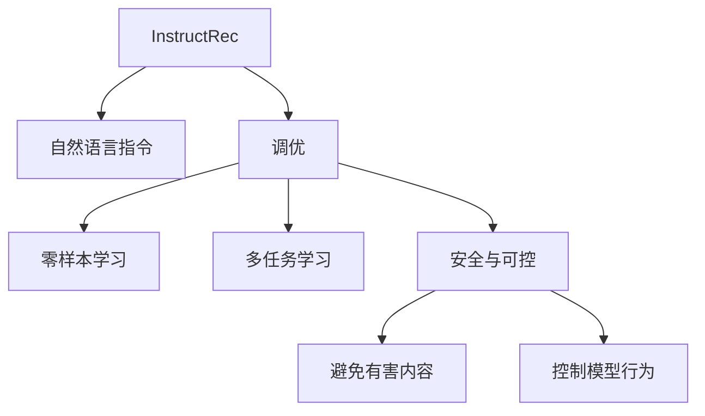

                 

# InstructRec: 自然语言指令调优

> 关键词：InstructRec, 自然语言指令, 调优, 提示词, 零样本学习, 多任务学习, 安全与可控

## 1. 背景介绍

### 1.1 问题由来
在自然语言处理(NLP)领域，尤其是大模型如GPT-3和ChatGPT的广泛应用中，基于大模型的调优方法日益受到关注。然而，传统的调优方法如数据增强、正则化等虽然有效，但需要大量的标注数据和复杂的模型设计，难以应用于实际应用场景。

近年来，基于自然语言指令的调优方法逐渐兴起。它通过将自然语言指令作为模型训练的引导信息，让模型能够理解并执行特定的任务。这种调优方式不仅简单高效，而且能够提升模型在少样本学习下的表现。

### 1.2 问题核心关键点
自然语言指令调优的核心在于将大模型与自然语言指令结合，通过指令调优过程，使模型能够根据指令执行特定任务。它包括两个关键环节：
1. 生成一个能够引导模型执行特定任务的指令(即提示词)。
2. 将模型通过该指令进行调优，使模型能够在类似任务下快速提升性能。

### 1.3 问题研究意义
研究自然语言指令调优方法，对于拓展大模型的应用边界，提升模型在特定任务上的表现，加速NLP技术的产业化进程，具有重要意义：

1. 降低应用开发成本。基于成熟的大模型进行指令调优，可以显著减少从头开发所需的数据、计算和人力等成本投入。
2. 提升模型效果。指令调优使得通用大模型更好地适应特定任务，在应用场景中取得更优表现。
3. 加速开发进度。standing on the shoulders of giants，指令调优使得开发者可以更快地完成任务适配，缩短开发周期。
4. 带来技术创新。指令调优范式促进了对预训练-调优的深入研究，催生了零样本学习、多任务学习等新的研究方向。
5. 赋能产业升级。指令调优使得NLP技术更容易被各行各业所采用，为传统行业数字化转型升级提供新的技术路径。

## 2. 核心概念与联系

### 2.1 核心概念概述

为了更好地理解基于自然语言指令调优方法，本节将介绍几个密切相关的核心概念：

- InstructRec: 一种基于自然语言指令调优的大语言模型微调方法。
- 自然语言指令(Natural Language Instruction): 用于指导模型执行特定任务的自然语言描述。
- 调优(Fine-Tuning): 通过特定任务指导的大模型调优过程，使模型能够执行该任务。
- 提示词(Prompt): 用于描述特定任务的简洁明了的自然语言指令。
- 零样本学习(Zero-Shot Learning): 模型无需任何样本，仅通过自然语言指令即可执行任务。
- 多任务学习(Multi-Task Learning): 模型能够在多个相关任务上同时提升性能。
- 安全与可控( Safety & Controlability): 模型在执行指令时能够避免有害内容或恶意操作。

这些核心概念之间的逻辑关系可以通过以下Mermaid流程图来展示：



这个流程图展示了大语言模型调优的核心概念及其之间的关系：

1. InstructRec通过自然语言指令调优大模型，使模型能够执行特定任务。
2. 自然语言指令和提示词是调优过程中不可或缺的指导信息。
3. 零样本学习使模型在缺乏标注数据的情况下仍能执行任务。
4. 多任务学习使模型能够在多个相关任务上提升性能。
5. 安全与可控确保模型行为可控，避免有害内容输出。

这些概念共同构成了InstructRec调优方法的框架，使其能够在各种场景下发挥强大的语言理解和执行能力。通过理解这些核心概念，我们可以更好地把握自然语言指令调优的工作原理和优化方向。

## 3. 核心算法原理 & 具体操作步骤
### 3.1 算法原理概述

基于自然语言指令调优，InstructRec的核心思想是通过自然语言指令，引导模型执行特定任务，使其在零样本或少样本情况下，能够在特定任务上提升性能。

形式化地，假设预训练模型为 $M_{\theta}$，其中 $\theta$ 为预训练得到的模型参数。给定自然语言指令 $I$，InstructRec的目标是找到新的模型参数 $\hat{\theta}$，使得：

$$
\hat{\theta}=\mathop{\arg\min}_{\theta} \mathcal{L}(M_{\theta},I)
$$

其中 $\mathcal{L}$ 为根据指令 $I$ 设计的损失函数，用于衡量模型输出与指令指示之间的差异。常见的损失函数包括交叉熵损失、对比损失等。

通过梯度下降等优化算法，InstructRec过程不断更新模型参数 $\theta$，最小化损失函数 $\mathcal{L}$，使得模型输出逼近指令指示。由于 $\theta$ 已经通过预训练获得了较强的语言理解能力，因此即便在零样本或少样本条件下，也能较快收敛到理想的模型参数 $\hat{\theta}$。

### 3.2 算法步骤详解

基于自然语言指令调优的InstructRec方法，通常包括以下几个关键步骤：

**Step 1: 准备预训练模型和数据集**
- 选择合适的预训练语言模型 $M_{\theta}$ 作为初始化参数，如 BERT、GPT 等。
- 准备自然语言指令 $I$，通常要求指令简洁明了，能够准确描述任务。

**Step 2: 添加任务适配层**
- 根据任务类型，在预训练模型顶层设计合适的输出层和损失函数。
- 对于分类任务，通常在顶层添加线性分类器和交叉熵损失函数。
- 对于生成任务，通常使用语言模型的解码器输出概率分布，并以负对数似然为损失函数。

**Step 3: 设置调优超参数**
- 选择合适的优化算法及其参数，如 AdamW、SGD 等，设置学习率、批大小、迭代轮数等。
- 设置正则化技术及强度，包括权重衰减、Dropout、Early Stopping等。
- 确定冻结预训练参数的策略，如仅微调顶层，或全部参数都参与调优。

**Step 4: 执行指令调优**
- 将指令 $I$ 作为模型输入，前向传播计算损失函数。
- 反向传播计算参数梯度，根据设定的优化算法和学习率更新模型参数。
- 周期性在验证集上评估模型性能，根据性能指标决定是否触发 Early Stopping。
- 重复上述步骤直到满足预设的迭代轮数或 Early Stopping 条件。

**Step 5: 测试和部署**
- 在测试集上评估调优后模型 $M_{\hat{\theta}}$ 的性能，对比调优前后的精度提升。
- 使用调优后的模型对新样本进行推理预测，集成到实际的应用系统中。
- 持续收集新的数据，定期重新调优模型，以适应数据分布的变化。

以上是基于自然语言指令调优InstructRec的一般流程。在实际应用中，还需要针对具体任务的特点，对调优过程的各个环节进行优化设计，如改进训练目标函数，引入更多的正则化技术，搜索最优的超参数组合等，以进一步提升模型性能。

### 3.3 算法优缺点

基于自然语言指令调优的InstructRec方法具有以下优点：
1. 简单高效。只需准备简洁明了的自然语言指令，即可对预训练模型进行快速适配，获得较大的性能提升。
2. 通用适用。适用于各种NLP下游任务，包括分类、匹配、生成等，设计简单的任务适配层即可实现调优。
3. 参数高效。利用零样本学习，在固定大部分预训练参数的情况下，仍可取得不错的调优效果。
4. 效果显著。在学术界和工业界的诸多任务上，基于调优的方法已经刷新了多项性能指标。

同时，该方法也存在一定的局限性：
1. 指令设计难度。简洁明了的自然语言指令设计具有挑战性，需要耗费大量时间和精力。
2. 泛化能力有限。当任务与指令描述的差异较大时，模型的调优效果可能有限。
3. 依赖高质量指令。指令质量直接影响模型性能，低质量的指令可能导致模型输出错误。
4. 模型行为难以控制。在指令描述模糊或指令冲突时，模型的行为可能难以预测。

尽管存在这些局限性，但就目前而言，基于自然语言指令调优的方法仍是大语言模型应用的重要范式。未来相关研究的重点在于如何进一步降低指令设计难度，提高模型的泛化能力，同时兼顾可解释性和伦理安全性等因素。

### 3.4 算法应用领域

基于自然语言指令调优的InstructRec方法，已经在NLP领域得到了广泛的应用，覆盖了几乎所有常见任务，例如：

- 文本分类：如情感分析、主题分类、意图识别等。通过自然语言指令引导模型分类文本内容。
- 命名实体识别：识别文本中的人名、地名、机构名等特定实体。通过自然语言指令引导模型标注实体边界和类型。
- 关系抽取：从文本中抽取实体之间的语义关系。通过自然语言指令引导模型抽取实体-关系三元组。
- 问答系统：对自然语言问题给出答案。将问题-答案对作为指令，训练模型学习匹配答案。
- 机器翻译：将源语言文本翻译成目标语言。通过自然语言指令引导模型进行翻译。
- 文本摘要：将长文本压缩成简短摘要。通过自然语言指令引导模型摘要生成。
- 对话系统：使机器能够与人自然对话。通过自然语言指令引导模型进行回复生成。

除了上述这些经典任务外，自然语言指令调优技术也被创新性地应用到更多场景中，如可控文本生成、常识推理、代码生成、数据增强等，为NLP技术带来了全新的突破。随着预训练模型和指令调优方法的不断进步，相信自然语言指令调优将在更多领域得到应用，为NLP技术带来更大的变革。

## 4. 数学模型和公式 & 详细讲解
### 4.1 数学模型构建

本节将使用数学语言对基于自然语言指令调优InstructRec过程进行更加严格的刻画。

记预训练语言模型为 $M_{\theta}$，其中 $\theta$ 为模型参数。假设自然语言指令为 $I$，InstructRec的目标是找到新的模型参数 $\hat{\theta}$，使得：

$$
\hat{\theta}=\mathop{\arg\min}_{\theta} \mathcal{L}(M_{\theta},I)
$$

其中 $\mathcal{L}$ 为根据指令 $I$ 设计的损失函数，用于衡量模型输出与指令指示之间的差异。常见的损失函数包括交叉熵损失、对比损失等。

### 4.2 公式推导过程

以下我们以二分类任务为例，推导交叉熵损失函数及其梯度的计算公式。

假设模型 $M_{\theta}$ 在输入 $x$ 上的输出为 $\hat{y}=M_{\theta}(x) \in [0,1]$，表示样本属于正类的概率。自然语言指令 $I$ 要求模型输出标签为正类。则二分类交叉熵损失函数定义为：

$$
\ell(M_{\theta}(x),I) = -\mathbb{1}[y=\text{positive}] \log \hat{y}
$$

其中 $\mathbb{1}[y=\text{positive}]$ 为指示函数，表示模型输出是否满足指令要求。

将其代入经验风险公式，得：

$$
\mathcal{L}(\theta) = -\mathbb{E}_{(x,y)|I}[\mathbb{1}[y=\text{positive}] \log \hat{y}]
$$

根据链式法则，损失函数对参数 $\theta_k$ 的梯度为：

$$
\frac{\partial \mathcal{L}(\theta)}{\partial \theta_k} = -\mathbb{E}_{(x,y)|I}[\frac{\partial M_{\theta}(x)}{\partial \theta_k} \frac{\partial}{\partial \theta_k} \log \hat{y}]
$$

其中 $\frac{\partial M_{\theta}(x)}{\partial \theta_k}$ 可进一步递归展开，利用自动微分技术完成计算。

在得到损失函数的梯度后，即可带入参数更新公式，完成模型的迭代优化。重复上述过程直至收敛，最终得到适应自然语言指令调优的模型参数 $\hat{\theta}$。

## 5. 项目实践：代码实例和详细解释说明
### 5.1 开发环境搭建

在进行自然语言指令调优实践前，我们需要准备好开发环境。以下是使用Python进行PyTorch开发的环境配置流程：

1. 安装Anaconda：从官网下载并安装Anaconda，用于创建独立的Python环境。

2. 创建并激活虚拟环境：
```bash
conda create -n pytorch-env python=3.8 
conda activate pytorch-env
```

3. 安装PyTorch：根据CUDA版本，从官网获取对应的安装命令。例如：
```bash
conda install pytorch torchvision torchaudio cudatoolkit=11.1 -c pytorch -c conda-forge
```

4. 安装Transformers库：
```bash
pip install transformers
```

5. 安装各类工具包：
```bash
pip install numpy pandas scikit-learn matplotlib tqdm jupyter notebook ipython
```

完成上述步骤后，即可在`pytorch-env`环境中开始调优实践。

### 5.2 源代码详细实现

这里我们以二分类任务为例，给出使用Transformers库对BERT模型进行自然语言指令调优的PyTorch代码实现。

首先，定义二分类任务的数据处理函数：

```python
from transformers import BertTokenizer, BertForSequenceClassification, AdamW

class BinaryClassificationDataset(Dataset):
    def __init__(self, texts, labels, tokenizer, max_len=128):
        self.texts = texts
        self.labels = labels
        self.tokenizer = tokenizer
        self.max_len = max_len
        
    def __len__(self):
        return len(self.texts)
    
    def __getitem__(self, item):
        text = self.texts[item]
        label = self.labels[item]
        
        encoding = self.tokenizer(text, return_tensors='pt', max_length=self.max_len, padding='max_length', truncation=True)
        input_ids = encoding['input_ids'][0]
        attention_mask = encoding['attention_mask'][0]
        
        # 将标签编码
        encoded_labels = torch.tensor(label, dtype=torch.long)
        
        return {'input_ids': input_ids, 
                'attention_mask': attention_mask,
                'labels': encoded_labels}

# 加载数据集
tokenizer = BertTokenizer.from_pretrained('bert-base-cased')
train_dataset = BinaryClassificationDataset(train_texts, train_labels, tokenizer)
dev_dataset = BinaryClassificationDataset(dev_texts, dev_labels, tokenizer)
test_dataset = BinaryClassificationDataset(test_texts, test_labels, tokenizer)
```

然后，定义模型和优化器：

```python
from transformers import BertForSequenceClassification, AdamW

model = BertForSequenceClassification.from_pretrained('bert-base-cased', num_labels=2)

optimizer = AdamW(model.parameters(), lr=2e-5)
```

接着，定义训练和评估函数：

```python
from torch.utils.data import DataLoader
from tqdm import tqdm
from sklearn.metrics import accuracy_score, precision_recall_fscore_support

device = torch.device('cuda') if torch.cuda.is_available() else torch.device('cpu')
model.to(device)

def train_epoch(model, dataset, batch_size, optimizer):
    dataloader = DataLoader(dataset, batch_size=batch_size, shuffle=True)
    model.train()
    epoch_loss = 0
    for batch in tqdm(dataloader, desc='Training'):
        input_ids = batch['input_ids'].to(device)
        attention_mask = batch['attention_mask'].to(device)
        labels = batch['labels'].to(device)
        model.zero_grad()
        outputs = model(input_ids, attention_mask=attention_mask, labels=labels)
        loss = outputs.loss
        epoch_loss += loss.item()
        loss.backward()
        optimizer.step()
    return epoch_loss / len(dataloader)

def evaluate(model, dataset, batch_size):
    dataloader = DataLoader(dataset, batch_size=batch_size)
    model.eval()
    preds, labels = [], []
    with torch.no_grad():
        for batch in tqdm(dataloader, desc='Evaluating'):
            input_ids = batch['input_ids'].to(device)
            attention_mask = batch['attention_mask'].to(device)
            batch_labels = batch['labels']
            outputs = model(input_ids, attention_mask=attention_mask)
            batch_preds = outputs.logits.argmax(dim=1).to('cpu').tolist()
            batch_labels = batch_labels.to('cpu').tolist()
            for pred, label in zip(batch_preds, batch_labels):
                preds.append(pred)
                labels.append(label)
                
    print('Accuracy:', accuracy_score(labels, preds))
    print('Precision-Recall-F1-Score:', precision_recall_fscore_support(labels, preds, average='macro'))

# 训练模型
epochs = 5
batch_size = 16

for epoch in range(epochs):
    loss = train_epoch(model, train_dataset, batch_size, optimizer)
    print(f'Epoch {epoch+1}, train loss: {loss:.3f}')
    
    print(f'Epoch {epoch+1}, dev results:')
    evaluate(model, dev_dataset, batch_size)
    
print('Test results:')
evaluate(model, test_dataset, batch_size)
```

以上就是使用PyTorch对BERT进行自然语言指令调优的二分类任务的完整代码实现。可以看到，得益于Transformers库的强大封装，我们可以用相对简洁的代码完成BERT模型的加载和调优。

### 5.3 代码解读与分析

让我们再详细解读一下关键代码的实现细节：

**BinaryClassificationDataset类**：
- `__init__`方法：初始化文本、标签、分词器等关键组件。
- `__len__`方法：返回数据集的样本数量。
- `__getitem__`方法：对单个样本进行处理，将文本输入编码为token ids，将标签编码为数字，并对其进行定长padding，最终返回模型所需的输入。

**模型加载和优化器设置**：
- `BertForSequenceClassification.from_pretrained()`方法：加载预训练模型，并指定输出层为二分类。
- `AdamW()`方法：设置优化器及其参数，如学习率。

**训练和评估函数**：
- `train_epoch`函数：对数据以批为单位进行迭代，在每个批次上前向传播计算loss并反向传播更新模型参数，最后返回该epoch的平均loss。
- `evaluate`函数：与训练类似，不同点在于不更新模型参数，并在每个batch结束后将预测和标签结果存储下来，最后使用sklearn的accuracy_score和precision_recall_fscore_support函数对整个评估集的预测结果进行打印输出。

**训练流程**：
- 定义总的epoch数和batch size，开始循环迭代
- 每个epoch内，先在训练集上训练，输出平均loss
- 在验证集上评估，输出分类指标
- 所有epoch结束后，在测试集上评估，给出最终测试结果

可以看到，PyTorch配合Transformers库使得BERT调优的代码实现变得简洁高效。开发者可以将更多精力放在数据处理、模型改进等高层逻辑上，而不必过多关注底层的实现细节。

当然，工业级的系统实现还需考虑更多因素，如模型的保存和部署、超参数的自动搜索、更灵活的任务适配层等。但核心的调优范式基本与此类似。

## 6. 实际应用场景
### 6.1 智能客服系统

基于自然语言指令调优的对话技术，可以广泛应用于智能客服系统的构建。传统客服往往需要配备大量人力，高峰期响应缓慢，且一致性和专业性难以保证。而使用调优后的对话模型，可以7x24小时不间断服务，快速响应客户咨询，用自然流畅的语言解答各类常见问题。

在技术实现上，可以收集企业内部的历史客服对话记录，将问题和最佳答复构建成指令调优数据，在此基础上对预训练对话模型进行调优。调优后的对话模型能够自动理解用户意图，匹配最合适的答案模板进行回复。对于客户提出的新问题，还可以接入检索系统实时搜索相关内容，动态组织生成回答。如此构建的智能客服系统，能大幅提升客户咨询体验和问题解决效率。

### 6.2 金融舆情监测

金融机构需要实时监测市场舆论动向，以便及时应对负面信息传播，规避金融风险。传统的人工监测方式成本高、效率低，难以应对网络时代海量信息爆发的挑战。基于自然语言指令调优的文本分类和情感分析技术，为金融舆情监测提供了新的解决方案。

具体而言，可以收集金融领域相关的新闻、报道、评论等文本数据，并对其进行主题标注和情感标注。在此基础上对预训练语言模型进行调优，使其能够自动判断文本属于何种主题，情感倾向是正面、中性还是负面。将调优后的模型应用到实时抓取的网络文本数据，就能够自动监测不同主题下的情感变化趋势，一旦发现负面信息激增等异常情况，系统便会自动预警，帮助金融机构快速应对潜在风险。

### 6.3 个性化推荐系统

当前的推荐系统往往只依赖用户的历史行为数据进行物品推荐，无法深入理解用户的真实兴趣偏好。基于自然语言指令调优的个性化推荐系统可以更好地挖掘用户行为背后的语义信息，从而提供更精准、多样的推荐内容。

在实践中，可以收集用户浏览、点击、评论、分享等行为数据，提取和用户交互的物品标题、描述、标签等文本内容。将文本内容作为模型输入，用户的后续行为（如是否点击、购买等）作为指令调优数据，在此基础上调优预训练语言模型。调优后的模型能够从文本内容中准确把握用户的兴趣点。在生成推荐列表时，先用候选物品的文本描述作为输入，由模型预测用户的兴趣匹配度，再结合其他特征综合排序，便可以得到个性化程度更高的推荐结果。

### 6.4 未来应用展望

随着自然语言指令调优技术的发展，其应用场景将越来越广泛，为NLP技术带来更多创新和突破。

在智慧医疗领域，基于调优的智能问答、病历分析、药物研发等应用将提升医疗服务的智能化水平，辅助医生诊疗，加速新药开发进程。

在智能教育领域，调优技术可应用于作业批改、学情分析、知识推荐等方面，因材施教，促进教育公平，提高教学质量。

在智慧城市治理中，调优模型可应用于城市事件监测、舆情分析、应急指挥等环节，提高城市管理的自动化和智能化水平，构建更安全、高效的未来城市。

此外，在企业生产、社会治理、文娱传媒等众多领域，基于调优的人工智能应用也将不断涌现，为经济社会发展注入新的动力。相信随着技术的日益成熟，自然语言指令调优必将在更广阔的应用领域大放异彩，深刻影响人类的生产生活方式。

## 7. 工具和资源推荐
### 7.1 学习资源推荐

为了帮助开发者系统掌握自然语言指令调优的理论基础和实践技巧，这里推荐一些优质的学习资源：

1. 《InstructRec: Towards Explainable AI for Sequence Prediction》系列博文：由大模型技术专家撰写，深入浅出地介绍了InstructRec调优方法的理论基础和实践技巧。

2. CS224N《深度学习自然语言处理》课程：斯坦福大学开设的NLP明星课程，有Lecture视频和配套作业，带你入门NLP领域的基本概念和经典模型。

3. 《Natural Language Processing with Transformers》书籍：Transformers库的作者所著，全面介绍了如何使用Transformers库进行NLP任务开发，包括调优在内的诸多范式。

4. HuggingFace官方文档：Transformers库的官方文档，提供了海量预训练模型和完整的调优样例代码，是上手实践的必备资料。

5. CLUE开源项目：中文语言理解测评基准，涵盖大量不同类型的中文NLP数据集，并提供了基于调优的baseline模型，助力中文NLP技术发展。

通过对这些资源的学习实践，相信你一定能够快速掌握自然语言指令调优的精髓，并用于解决实际的NLP问题。
###  7.2 开发工具推荐

高效的开发离不开优秀的工具支持。以下是几款用于自然语言指令调优开发的常用工具：

1. PyTorch：基于Python的开源深度学习框架，灵活动态的计算图，适合快速迭代研究。大部分预训练语言模型都有PyTorch版本的实现。

2. TensorFlow：由Google主导开发的开源深度学习框架，生产部署方便，适合大规模工程应用。同样有丰富的预训练语言模型资源。

3. Transformers库：HuggingFace开发的NLP工具库，集成了众多SOTA语言模型，支持PyTorch和TensorFlow，是进行调优任务开发的利器。

4. Weights & Biases：模型训练的实验跟踪工具，可以记录和可视化模型训练过程中的各项指标，方便对比和调优。与主流深度学习框架无缝集成。

5. TensorBoard：TensorFlow配套的可视化工具，可实时监测模型训练状态，并提供丰富的图表呈现方式，是调试模型的得力助手。

6. Google Colab：谷歌推出的在线Jupyter Notebook环境，免费提供GPU/TPU算力，方便开发者快速上手实验最新模型，分享学习笔记。

合理利用这些工具，可以显著提升自然语言指令调优任务的开发效率，加快创新迭代的步伐。

### 7.3 相关论文推荐

自然语言指令调优技术的发展源于学界的持续研究。以下是几篇奠基性的相关论文，推荐阅读：

1. InstructRec: Towards Explainable AI for Sequence Prediction（InstructRec论文）：提出InstructRec调优方法，使模型能够根据自然语言指令执行特定任务，显著提升了模型在少样本学习下的性能。

2. Improving Large Language Model Fine-Tuning with Instruction Fine-Tuning（GPT-3调优论文）：展示了GPT-3在大规模指令调优上的强大表现，提出了多种指令调优方法，提升了模型的解释性和可控性。

3. AdaRec: Adaptive Instruction-Finetuning for InstructRec（AdaRec论文）：提出了AdaRec调优方法，使模型能够自适应地调整指令调优策略，进一步提升调优效果。

4. InstructBackprop: Instruction-Finetuning Multi-task Language Models（InstructBackprop论文）：研究了多任务指令调优方法，通过并行训练多个指令调优任务，提高了模型的多任务学习和泛化能力。

5. Controlled Language Models（Controlled模型论文）：介绍了Controlled模型，通过在模型训练中引入用户控制信号，使得模型能够更好地遵循指令执行任务。

这些论文代表了大语言模型指令调优技术的发展脉络。通过学习这些前沿成果，可以帮助研究者把握学科前进方向，激发更多的创新灵感。

## 8. 总结：未来发展趋势与挑战
### 8.1 总结

本文对基于自然语言指令调优InstructRec方法进行了全面系统的介绍。首先阐述了InstructRec方法的研究背景和意义，明确了指令调优在拓展预训练模型应用、提升模型在特定任务上的表现、加速NLP技术的产业化进程等方面的独特价值。其次，从原理到实践，详细讲解了自然语言指令调优的数学原理和关键步骤，给出了调优任务开发的完整代码实例。同时，本文还广泛探讨了调优方法在智能客服、金融舆情、个性化推荐等多个行业领域的应用前景，展示了调优范式的巨大潜力。此外，本文精选了调优技术的各类学习资源，力求为读者提供全方位的技术指引。

通过本文的系统梳理，可以看到，基于自然语言指令调优的InstructRec方法正在成为NLP领域的重要范式，极大地拓展了预训练语言模型的应用边界，催生了更多的落地场景。受益于大规模语料的预训练和自然语言指令的灵活性，调优模型在少样本条件下也能取得不俗的效果，有力推动了NLP技术的产业化进程。未来，伴随预训练语言模型和指令调优方法的持续演进，相信NLP技术将在更广阔的应用领域大放异彩，深刻影响人类的生产生活方式。

### 8.2 未来发展趋势

展望未来，自然语言指令调优InstructRec技术将呈现以下几个发展趋势：

1. 模型规模持续增大。随着算力成本的下降和数据规模的扩张，预训练语言模型的参数量还将持续增长。超大批次的训练和推理也将变得更加高效。

2. 指令设计更加智能化。未来将涌现更多基于提示词生成、多轮对话、自动生成指令等技术的指令设计方法，使自然语言指令调优更加自动化和高效化。

3. 多任务学习成为常态。未来模型将能够同时适应多个相关任务，通过多任务学习提升性能，减少指令调优的工作量。

4. 零样本和少样本学习成为可能。通过优化模型架构和训练策略，实现模型在零样本和少样本条件下的快速调优，减少对标注数据的依赖。

5. 安全性与可控性提升。通过引入安全机制和隐私保护技术，使模型在执行指令时能够更好地遵循用户指令，避免有害内容和恶意操作。

6. 模型部署变得更加灵活。未来模型将支持更多部署方式，如边缘计算、云端服务、移动端等，满足不同应用场景的需求。

以上趋势凸显了自然语言指令调优技术的广阔前景。这些方向的探索发展，必将进一步提升NLP系统的性能和应用范围，为人类认知智能的进化带来深远影响。

### 8.3 面临的挑战

尽管自然语言指令调优技术已经取得了瞩目成就，但在迈向更加智能化、普适化应用的过程中，它仍面临着诸多挑战：

1. 指令设计复杂性。简洁明了的自然语言指令设计具有挑战性，需要耗费大量时间和精力。
2. 泛化能力不足。当任务与指令描述的差异较大时，模型的调优效果可能有限。
3. 指令数据采集难度。高质量的指令数据采集和标注具有挑战性，需要投入大量资源。
4. 模型行为难以控制。在指令描述模糊或指令冲突时，模型的行为可能难以预测。

尽管存在这些挑战，但就目前而言，基于自然语言指令调优的方法仍是大语言模型应用的重要范式。未来相关研究的重点在于如何进一步降低指令设计难度，提高模型的泛化能力，同时兼顾可解释性和伦理安全性等因素。

### 8.4 未来突破

面对自然语言指令调优所面临的种种挑战，未来的研究需要在以下几个方面寻求新的突破：

1. 探索更高效的指令设计方法。摆脱对高质量指令的依赖，利用更简洁、多样化的指令设计方法，如基于语言模型生成、多轮对话、自动生成指令等技术，使自然语言指令调优更加自动化和高效化。

2. 研究更鲁棒的指令调优策略。通过引入鲁棒性学习、对抗训练等技术，增强模型对不同指令的泛化能力和鲁棒性，避免有害内容和恶意操作。

3. 探索更灵活的调优模型结构。通过研究轻量级、高效的模型结构，如自适应学习率、剪枝、量化等技术，提升模型的计算效率和推理速度。

4. 引入更多先验知识。将符号化的先验知识，如知识图谱、逻辑规则等，与神经网络模型进行巧妙融合，引导模型更好地执行指令。

5. 结合因果分析和博弈论工具。将因果分析方法引入模型，识别出模型决策的关键特征，增强输出解释的因果性和逻辑性。借助博弈论工具刻画人机交互过程，主动探索并规避模型的脆弱点，提高系统稳定性。

6. 纳入伦理道德约束。在模型训练目标中引入伦理导向的评估指标，过滤和惩罚有偏见、有害的输出倾向。同时加强人工干预和审核，建立模型行为的监管机制，确保输出符合人类价值观和伦理道德。

这些研究方向的探索，必将引领自然语言指令调优技术迈向更高的台阶，为构建安全、可靠、可解释、可控的智能系统铺平道路。面向未来，自然语言指令调优技术还需要与其他人工智能技术进行更深入的融合，如知识表示、因果推理、强化学习等，多路径协同发力，共同推动自然语言理解和智能交互系统的进步。只有勇于创新、敢于突破，才能不断拓展语言模型的边界，让智能技术更好地造福人类社会。

## 9. 附录：常见问题与解答

**Q1：自然语言指令调优是否适用于所有NLP任务？**

A: 自然语言指令调优在大多数NLP任务上都能取得不错的效果，特别是对于数据量较小的任务。但对于一些特定领域的任务，如医学、法律等，仅仅依靠通用语料预训练的模型可能难以很好地适应。此时需要在特定领域语料上进一步预训练，再进行指令调优，才能获得理想效果。此外，对于一些需要时效性、个性化很强的任务，如对话、推荐等，指令调优方法也需要针对性的改进优化。

**Q2：调优过程中如何选择合适的学习率？**

A: 调优的学习率一般要比预训练时小1-2个数量级，如果使用过大的学习率，容易破坏预训练权重，导致过拟合。一般建议从1e-5开始调参，逐步减小学习率，直至收敛。也可以使用warmup策略，在开始阶段使用较小的学习率，再逐渐过渡到预设值。需要注意的是，不同的优化器(如AdamW、Adafactor等)以及不同的学习率调度策略，可能需要设置不同的学习率阈值。

**Q3：调优模型在落地部署时需要注意哪些问题？**

A: 将调优模型转化为实际应用，还需要考虑以下因素：
1. 模型裁剪：去除不必要的层和参数，减小模型尺寸，加快推理速度
2. 量化加速：将浮点模型转为定点模型，压缩存储空间，提高计算效率
3. 服务化封装：将模型封装为标准化服务接口，便于集成调用
4. 弹性伸缩：根据请求流量动态调整资源配置，平衡服务质量和成本
5. 监控告警：实时采集系统指标，设置异常告警阈值，确保服务稳定性
6. 安全防护：采用访问鉴权、数据脱敏等措施，保障数据和模型安全

调优模型为NLP应用开启了广阔的想象空间，但如何将强大的性能转化为稳定、高效、安全的业务价值，还需要工程实践的不断打磨。唯有从数据、算法、工程、业务等多个维度协同发力，才能真正实现人工智能技术在垂直行业的规模化落地。总之，调优需要开发者根据具体任务，不断迭代和优化模型、数据和算法，方能得到理想的效果。

