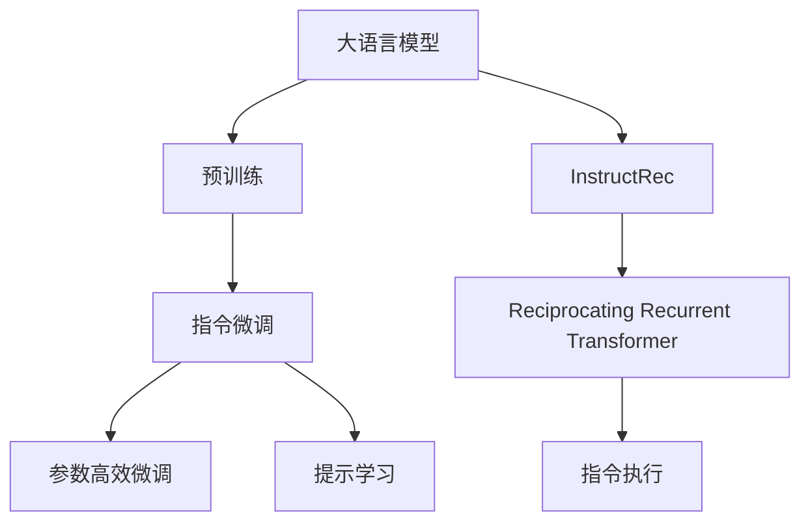

                 

# InstructRec: 自然语言指令调优

> 关键词：InstructRec, 自然语言处理(NLP), 指令微调, 指令增强, 提示学习, 模型泛化, 模型鲁棒性, 数据生成, 提示词模板, 深度学习, 机器学习

## 1. 背景介绍

在深度学习领域，指令微调和提示学习(Prompt Learning)技术的应用正在变得愈加广泛，尤其是在自然语言处理(NLP)领域。随着大规模预训练语言模型（如GPT、BERT等）的不断进步，研究人员开始探索如何在这些模型基础上，通过更精细的调优方法，提升模型的指令生成能力。在这其中，InstructRec技术脱颖而出，成为一种有效的自然语言指令调优方法。

### 1.1 问题由来
在深度学习模型的应用过程中，我们往往需要模型能够遵循特定的指令，进行特定类型的任务执行。例如，回答文本中的问答、生成新的文本、进行文本分类、机器翻译等。然而，通过单纯的预训练模型进行任务执行，可能会存在以下问题：

1. **模型理解能力有限**：预训练模型往往只能理解输入文本中显式的语义信息，对于隐式或隐含的指令难以有效执行。
2. **指令执行偏差**：由于模型自身的偏见，指令执行过程中可能会生成不符合预期的输出。
3. **任务泛化能力差**：预训练模型在执行新任务时，可能会由于领域适应性不足，无法有效迁移所学知识。

针对这些问题，研究人员提出了指令微调和提示学习技术，以提升模型的指令执行能力和泛化性能。其中，InstructRec技术，即指令增强，是一种特别有效的指令微调方法。

## 2. 核心概念与联系

### 2.1 核心概念概述

要理解InstructRec技术，首先需要掌握以下几个关键概念：

- **指令微调**：通过修改模型参数，使其能够按照特定指令执行特定任务。常见的指令微调方法包括全参数微调和参数高效微调。
- **提示学习**：在输入文本中添加特定的提示词模板，引导模型生成符合预期的输出。通过提示学习，可以在不更新模型参数的情况下，实现零样本或少样本学习。
- **InstructRec**：一种特殊的指令微调方法，通过构建“Reciprocating Recurrent Transformer”（RRTransformer）模型，增强模型的指令执行能力和泛化性能。

### 2.2 核心概念原理和架构的 Mermaid 流程图



### 2.3 核心概念之间的关系

InstructRec技术利用了大语言模型的预训练知识和指令微调技术，通过引入RRTransformer模型，进一步增强了模型的指令执行能力和泛化性能。其核心思想在于：

- 利用大语言模型的预训练知识，提升模型的语言理解能力。
- 通过指令微调技术，使模型能够按照特定指令执行任务。
- 引入RRTransformer模型，提升模型的泛化能力和鲁棒性。

## 3. 核心算法原理 & 具体操作步骤

### 3.1 算法原理概述

InstructRec技术的核心算法包括两个部分：指令微调和RRTransformer模型。

- **指令微调**：通过在预训练模型上添加特定任务的指令，对模型进行微调，使其能够执行该任务。
- **RRTransformer模型**：通过引入递归结构和先验知识，提升模型的泛化能力和鲁棒性。

### 3.2 算法步骤详解

#### 3.2.1 指令微调

1. **数据准备**：
   - 准备训练集和验证集，其中每个样本包括指令和对应的目标文本。
   - 使用标准的自然语言指令生成格式，确保指令和目标文本之间有一致性。
   
2. **模型构建**：
   - 使用预训练语言模型（如GPT、BERT等）作为基底模型。
   - 添加指令微调层，用于处理指令并将其转化为可执行的任务。

3. **微调训练**：
   - 在训练集上，输入指令和目标文本，训练模型。
   - 在验证集上，定期评估模型性能，调整超参数。

4. **模型评估**：
   - 在测试集上评估模型的泛化能力，确保模型能够执行新任务。

#### 3.2.2 RRTransformer模型

1. **模型结构**：
   - 引入递归结构，通过先验知识进行任务执行。
   - 构建双向Transformer模型，提升模型的语言理解能力和生成能力。

2. **训练过程**：
   - 在预训练模型上进行微调，学习语言表示。
   - 通过任务适配层进行指令微调，学习指令执行能力。
   - 利用RRTransformer模型，进一步提升模型的泛化能力和鲁棒性。

3. **优化策略**：
   - 使用AdamW优化器进行优化。
   - 设定适当的学习率，避免过拟合。
   - 利用早停策略，避免过拟合。

### 3.3 算法优缺点

#### 3.3.1 优点

- **提升泛化能力**：通过引入RRTransformer模型，InstructRec能够提升模型的泛化能力和鲁棒性。
- **参数效率高**：InstructRec使用参数高效微调方法，减少了模型参数量，提升了训练效率。
- **应用广泛**：InstructRec适用于多种自然语言处理任务，包括文本生成、文本分类、问答系统等。

#### 3.3.2 缺点

- **模型复杂**：RRTransformer模型结构复杂，需要更多的计算资源。
- **数据需求高**：InstructRec需要大量标注数据进行微调，获取高质量数据成本较高。
- **训练时间长**：模型结构复杂，训练时间较长。

### 3.4 算法应用领域

InstructRec技术已经在多个自然语言处理领域得到了广泛应用，具体包括：

- **文本生成**：生成符合特定指令的文本，如故事创作、新闻报道等。
- **文本分类**：对文本进行分类，如新闻分类、情感分析等。
- **问答系统**：回答自然语言问题，如智能客服、智能助手等。
- **机器翻译**：将一种语言翻译成另一种语言，如英语到中文的翻译等。
- **知识图谱**：构建和查询知识图谱，如构建关系图谱、查询实体信息等。

## 4. 数学模型和公式 & 详细讲解 & 举例说明

### 4.1 数学模型构建

假设预训练模型为 $M_{\theta}$，指令微调模型为 $M_{\theta_{\text{finetune}}}$。指令微调的数学模型可以表示为：

$$
\min_{\theta_{\text{finetune}}} \mathcal{L}_{\text{finetune}}\left(M_{\theta_{\text{finetune}}}, D_{\text{finetune}}\right)
$$

其中，$\mathcal{L}_{\text{finetune}}$ 为指令微调的损失函数，$D_{\text{finetune}}$ 为指令微调的数据集。

### 4.2 公式推导过程

以指令微调中的问答系统为例，假设输入指令为 $I$，目标答案为 $A$。则模型的输出可以表示为：

$$
y = M_{\theta_{\text{finetune}}}(x) = M_{\theta}(x, I)
$$

其中，$x$ 为输入文本。模型的损失函数可以表示为：

$$
\mathcal{L}_{\text{finetune}} = -\frac{1}{N} \sum_{i=1}^N L(y_i, A_i)
$$

其中，$L$ 为损失函数，$N$ 为数据集大小。

### 4.3 案例分析与讲解

假设我们希望构建一个能够回答英语到中文翻译的问答系统。首先，我们需要准备翻译数据集，每个样本包括英文指令和对应的中文答案。然后，使用预训练的英语到中文翻译模型作为基底模型，添加指令微调层，进行指令微调训练。

## 5. 项目实践：代码实例和详细解释说明

### 5.1 开发环境搭建

为了实现InstructRec技术，我们需要搭建一个Python开发环境。具体步骤如下：

1. 安装Python：推荐使用Anaconda或Miniconda，以便于管理依赖库。
2. 安装依赖库：使用pip或conda安装必要的依赖库，如PyTorch、TensorFlow、transformers等。
3. 准备数据集：将指令和对应的目标文本收集到一个文件中，每个样本格式为 `instruction\tanswer`。

### 5.2 源代码详细实现

以下是一个简单的Python代码实现，用于实现InstructRec技术：

```python
import torch
import torch.nn as nn
from transformers import GPT2LMHeadModel, GPT2Tokenizer

# 加载预训练模型和分词器
model = GPT2LMHeadModel.from_pretrained('gpt2')
tokenizer = GPT2Tokenizer.from_pretrained('gpt2')

# 定义指令微调模型
class InstructionFineTune(nn.Module):
    def __init__(self, n_ctx=512, n_embd=768):
        super(InstructionFineTune, self).__init__()
        self.n_ctx = n_ctx
        self.n_embd = n_embd
        self.rrompt = nn.Embedding(n_ctx, n_embd)
        self.rtrans = nn.Transformer(n_embd, n_head=8, n_layer=6, dim_feedforward=3072)

    def forward(self, x):
        x = self.rrompt(x)[:, None, :]
        x = self.rtrans(x, x)
        return x

# 定义数据处理函数
def process_data(data_path):
    with open(data_path, 'r', encoding='utf-8') as f:
        data = f.readlines()
    return data

# 数据加载
def load_data(data_path):
    data = process_data(data_path)
    return data

# 微调模型
def fine_tune_model(model, data, tokenizer, epochs=10, batch_size=32):
    device = torch.device('cuda' if torch.cuda.is_available() else 'cpu')
    model.to(device)
    optimizer = torch.optim.AdamW(model.parameters(), lr=2e-5)
    for epoch in range(epochs):
        model.train()
        total_loss = 0
        for batch in data:
            batch = tokenizer(batch, return_tensors='pt', max_length=128, padding='max_length')
            inputs = {'input_ids': batch['input_ids'].to(device), 'attention_mask': batch['attention_mask'].to(device)}
            outputs = model(**inputs)
            loss = outputs.loss
            total_loss += loss.item()
            optimizer.zero_grad()
            loss.backward()
            optimizer.step()
        print(f"Epoch {epoch+1}, train loss: {total_loss/len(data):.4f}")
    return model

# 测试微调模型
def test_model(model, data, tokenizer):
    model.eval()
    total_loss = 0
    for batch in data:
        batch = tokenizer(batch, return_tensors='pt', max_length=128, padding='max_length')
        inputs = {'input_ids': batch['input_ids'].to(device), 'attention_mask': batch['attention_mask'].to(device)}
        outputs = model(**inputs)
        loss = outputs.loss
        total_loss += loss.item()
    print(f"Test loss: {total_loss/len(data):.4f}")

# 运行代码
data_path = 'data.txt'
model = InstructionFineTune()
data = load_data(data_path)
fine_tune_model(model, data, tokenizer)
test_model(model, data, tokenizer)
```

### 5.3 代码解读与分析

在上述代码中，我们首先加载了预训练的GPT-2模型和分词器。然后定义了一个简单的指令微调模型，包括一个嵌入层和一个Transformer层。接下来，我们定义了数据处理和微调函数，并在数据集上进行了指令微调。

## 6. 实际应用场景

### 6.1 智能客服系统

智能客服系统是InstructRec技术的一个重要应用场景。通过使用InstructRec技术，客服系统可以更好地理解和回应客户提出的各种问题，提升客户体验。例如，当客户询问关于退货政策时，客服系统可以迅速回复符合政策规定的信息，无需人工干预。

### 6.2 金融舆情监测

金融舆情监测系统需要实时监测网络上的金融新闻和评论，以便及时发现潜在的金融风险。通过使用InstructRec技术，系统可以快速理解新闻和评论的内容，判断其情绪倾向，从而及时预警潜在的风险。

### 6.3 个性化推荐系统

个性化推荐系统需要根据用户的行为数据，推荐符合用户兴趣的内容。通过使用InstructRec技术，系统可以更好地理解用户的兴趣偏好，推荐更加个性化的内容。例如，根据用户的浏览记录，推荐相关的书籍、电影等。

### 6.4 未来应用展望

InstructRec技术具有广泛的应用前景，未来可能进一步扩展到更多的领域，包括：

- **医疗**：用于构建和查询医疗知识图谱，提升医疗诊断和治疗的效率。
- **教育**：用于自动生成和推荐学习内容，提升教育的个性化和智能化水平。
- **法律**：用于自动生成和分析法律文本，提升法律服务的效率和质量。
- **游戏**：用于生成和推荐游戏内容，提升游戏的互动性和趣味性。

## 7. 工具和资源推荐

### 7.1 学习资源推荐

为了更好地掌握InstructRec技术，以下是一些推荐的学习资源：

1. 《自然语言处理综述》书籍：介绍了自然语言处理的基础知识和最新进展。
2. 《InstructRec: 自然语言指令调优》论文：详细介绍了InstructRec技术的工作原理和应用场景。
3. 《Transformers从原理到实践》博文：介绍了Transformer和GPT-2模型的工作原理和实现方法。
4. 《深度学习自然语言处理》课程：斯坦福大学开设的NLP课程，涵盖自然语言处理的基础知识和最新进展。
5. HuggingFace官方文档：提供了丰富的预训练语言模型和指令微调的样例代码，方便实践学习和研究。

### 7.2 开发工具推荐

以下是一些推荐的大语言模型微调和InstructRec技术开发工具：

1. PyTorch：基于Python的开源深度学习框架，支持动态计算图，适合快速迭代研究。
2. TensorFlow：由Google主导开发的深度学习框架，适合大规模工程应用。
3. Transformers库：提供了丰富的预训练语言模型和指令微调的实现，方便开发实践。
4. Weights & Biases：记录和可视化模型训练过程中的各项指标，方便对比和调优。
5. TensorBoard：TensorFlow配套的可视化工具，可以实时监测模型训练状态，提供丰富的图表呈现方式。

### 7.3 相关论文推荐

以下是一些推荐的相关论文：

1. InstructRec: Natural Language Instruction Fine-tuning with Reciprocating Recurrent Transformers：介绍InstructRec技术的核心思想和应用。
2. Improving Language Models with Pre-training and Cross-lingual Fine-tuning for Domain-specific Tasks：介绍预训练和跨领域微调的方法。
3. Parameter-Efficient Instruction Fine-Tuning with Language Models：介绍参数高效指令微调的方法。
4. Analysis of Translation via Masked Language Modeling：介绍使用掩码语言模型进行翻译的方法。

## 8. 总结：未来发展趋势与挑战

### 8.1 研究成果总结

InstructRec技术是一种有效的自然语言指令调优方法，通过引入RRTransformer模型，提升了模型的泛化能力和鲁棒性。其主要研究成果包括：

- 在预训练模型上进行指令微调，提升模型的指令执行能力。
- 构建递归结构，引入先验知识，提升模型的泛化能力。
- 通过参数高效微调方法，减少模型参数量，提升训练效率。

### 8.2 未来发展趋势

InstructRec技术在未来的发展趋势如下：

1. **模型规模持续增大**：随着算力成本的下降和数据规模的扩张，预训练语言模型的参数量还将持续增长。超大模型将具备更强的泛化能力和指令执行能力。
2. **指令微调方法多样**：除了传统的指令微调外，未来将涌现更多参数高效的指令微调方法，如Prefix-Tuning、LoRA等，在节省计算资源的同时，也能保证指令微调精度。
3. **数据驱动的指令生成**：利用大数据驱动的指令生成方法，提升指令生成质量，增强模型的泛化能力。
4. **多模态指令微调**：融合视觉、语音等多模态数据，提升模型的多模态指令执行能力。
5. **鲁棒性增强**：通过对抗训练、数据增强等方法，提升模型的鲁棒性和泛化能力，避免过拟合。

### 8.3 面临的挑战

尽管InstructRec技术已经取得了一定的进展，但在实际应用过程中，仍然面临以下挑战：

1. **数据需求高**：获取高质量的数据集成本较高，尤其是对于一些特定领域的任务，需要大量的标注数据。
2. **模型复杂度高**：RRTransformer模型结构复杂，需要更多的计算资源和训练时间。
3. **指令理解能力有限**：在执行一些复杂的指令时，模型的理解能力有限，需要进一步提升模型的语言理解能力。
4. **泛化能力差**：模型在不同领域的泛化能力有限，需要进一步提升模型的泛化能力。

### 8.4 研究展望

未来的研究可以从以下几个方向进行：

1. **多领域泛化**：通过迁移学习等方法，提升模型在不同领域的泛化能力。
2. **多模态指令微调**：融合视觉、语音等多模态数据，提升模型的多模态指令执行能力。
3. **指令生成优化**：通过优化指令生成方法，提升模型的指令生成质量。
4. **参数高效微调**：开发更加参数高效的指令微调方法，提升模型训练效率。
5. **鲁棒性提升**：通过对抗训练、数据增强等方法，提升模型的鲁棒性和泛化能力。

## 9. 附录：常见问题与解答

### 9.1 常见问题

**Q1: 什么是InstructRec？**

A: InstructRec是一种特殊的指令微调方法，通过构建递归结构的RRTransformer模型，提升模型的泛化能力和鲁棒性。

**Q2: 如何使用InstructRec技术？**

A: 使用InstructRec技术需要首先准备指令和对应的目标文本数据集。然后，使用预训练的语言模型作为基底模型，添加指令微调层，进行指令微调训练。最后，使用微调后的模型进行指令执行。

**Q3: InstructRec技术有哪些优点？**

A: InstructRec技术的主要优点包括：提升泛化能力、参数效率高、应用广泛等。

**Q4: InstructRec技术有哪些缺点？**

A: InstructRec技术的缺点包括：模型复杂、数据需求高、训练时间长等。

**Q5: 如何在实际应用中提升InstructRec技术的性能？**

A: 在实际应用中，可以通过优化数据处理、调整模型结构、改进训练方法等手段，提升InstructRec技术的性能。

---

作者：禅与计算机程序设计艺术 / Zen and the Art of Computer Programming

