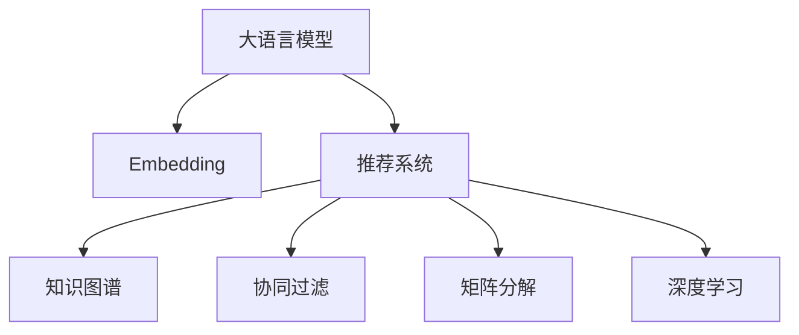

                 

# LLM Embeddings在推荐系统中的应用

> 关键词：大语言模型(LLM)、Embedding、推荐系统、知识图谱、协同过滤、深度学习

## 1. 背景介绍

### 1.1 问题由来
推荐系统是当前互联网领域中的热门研究方向，旨在通过用户历史行为数据，预测并推荐用户可能感兴趣的物品，提升用户体验并增加商业收益。传统的推荐系统主要基于用户-物品交互数据，利用协同过滤、矩阵分解等方法进行推荐。但随着用户基数和物品种类不断增长，推荐系统面临以下挑战：

- 冷启动问题：新用户或物品难以获得足够的历史行为数据，影响推荐效果。
- 数据稀疏性：用户历史行为数据不足，推荐算法缺乏充分的训练信息。
- 个性化需求：用户需求多样，传统的推荐方法难以准确捕捉个性化特征。
- 实时性要求：用户希望即时获得推荐结果，推荐系统需具备快速响应能力。

近年来，随着深度学习技术的发展，推荐系统中引入了大语言模型(Large Language Model, LLM)，通过预训练得到高维连续空间下的用户和物品表示向量，进而提升推荐系统的性能。这种基于预训练大模型的推荐方法，即推荐系统中引入的LM Embeddings，以其强大的语言建模能力和知识表示能力，成为推荐系统研究的新热点。

### 1.2 问题核心关键点
LM Embeddings在推荐系统中主要通过以下方式提升推荐效果：

1. **知识表示**：预训练的LM Embeddings能够捕捉到用户和物品之间的语义关系，形成语义嵌入向量，用于度量用户与物品之间的相似度，从而构建知识图谱。
2. **个性化推荐**：基于用户和物品的语义表示向量，通过计算相似度得到个性化的推荐结果，处理长尾问题和推荐多样性。
3. **跨领域迁移**：通过迁移学习，将预训练模型在特定领域上的知识迁移应用到其他领域，如将通用语言模型应用到推荐系统中，提升跨领域推荐效果。
4. **协同过滤改进**：结合协同过滤和深度学习技术，改进用户和物品的表示，提高推荐系统的精度和鲁棒性。
5. **实时推荐**：通过优化模型推理速度，实现高效实时推荐，满足用户即时性需求。

## 2. 核心概念与联系

### 2.1 核心概念概述

为更好地理解LM Embeddings在推荐系统中的应用，本节将介绍几个密切相关的核心概念：

- 大语言模型(Large Language Model, LLM)：如BERT、GPT-3等，通过自监督学习任务在大量文本数据上预训练得到高维语言表示模型。
- Embedding向量：将用户、物品等离散特征映射到高维连续空间下的向量表示，用于计算相似度。
- 推荐系统：通过用户行为数据，预测用户可能感兴趣的物品，并推荐给用户。
- 知识图谱(Knowledge Graph)：通过实体和关系组成的有向图，描述用户、物品、推荐目标等之间的关系，用于提升推荐系统的精度。
- 协同过滤(Collaborative Filtering)：通过用户-物品的交互数据，预测用户对其他物品的评分或偏好，进而推荐物品。
- 矩阵分解(Matrix Factorization)：将用户-物品评分矩阵分解成用户和物品的低维向量表示，用于推荐系统建模。
- 深度学习(Deep Learning)：通过多层神经网络结构，从大规模数据中学习复杂的非线性关系，提升模型精度。

这些核心概念之间的逻辑关系可以通过以下Mermaid流程图来展示：



这个流程图展示了大语言模型在推荐系统中的核心概念及其之间的关系：

1. 大语言模型通过预训练获得基础能力。
2. Embedding向量基于大语言模型的预训练表示，形成高维连续空间下的用户和物品表示。
3. 推荐系统利用用户和物品的语义表示向量，结合知识图谱、协同过滤、矩阵分解和深度学习技术，提升推荐效果。

## 3. 核心算法原理 & 具体操作步骤
### 3.1 算法原理概述

LM Embeddings在推荐系统中通过预训练的LM模型，获取用户和物品的语义表示向量，进而进行相似度计算和推荐。具体步骤如下：

1. 收集用户历史行为数据，包括用户ID、物品ID、评分等信息。
2. 通过LM模型预训练得到用户表示向量 $u$ 和物品表示向量 $i$。
3. 计算用户和物品之间的相似度，一般使用余弦相似度或点积相似度。
4. 结合协同过滤、矩阵分解和深度学习技术，得到推荐结果。

形式化地，设用户和物品的语义表示向量分别为 $u \in \mathbb{R}^d$ 和 $i \in \mathbb{R}^d$，用户与物品的相似度函数为 $s(u, i)$，推荐函数为 $r(u, i)$。则推荐系统流程如下：

1. 预训练LM模型，得到用户和物品的语义表示向量 $u$ 和 $i$。
2. 计算相似度：$s(u, i) = \cos(u, i) = \frac{u^T i}{\|u\|\|i\|}$ 或 $s(u, i) = u \cdot i$。
3. 结合协同过滤和深度学习技术：$r(u, i) = f(s(u, i))$，其中 $f$ 为优化函数，用于将相似度转化为推荐结果。

### 3.2 算法步骤详解

下面详细介绍LM Embeddings在推荐系统中的具体应用步骤：

**Step 1: 数据准备**
- 收集用户历史行为数据，包括用户ID、物品ID、评分等信息。
- 对用户行为数据进行清洗和预处理，去除噪声和异常值。

**Step 2: 预训练LM模型**
- 选择预训练的LM模型，如BERT、GPT-3等。
- 将用户和物品的ID作为输入，通过LM模型得到对应的语义表示向量 $u$ 和 $i$。
- 可以通过多种方式初始化LM模型的输入，如将ID编码成向量，或使用特定的格式化字符串作为输入。

**Step 3: 计算相似度**
- 使用余弦相似度或点积相似度计算用户和物品之间的相似度。
- 对于大规模数据集，可以使用向量量化(VQ)技术，将高维向量压缩为低维向量，提高计算效率。

**Step 4: 结合协同过滤和深度学习**
- 使用协同过滤和深度学习技术，将相似度转化为推荐结果。
- 可以结合矩阵分解、KNN算法、深度学习等方法，提升推荐效果。

**Step 5: 模型评估和优化**
- 在验证集上评估推荐模型的性能，使用指标如准确率、召回率、F1值等。
- 根据评估结果，调整模型参数和超参数，优化推荐结果。

**Step 6: 实时推荐**
- 部署推荐模型到生产环境，实时计算并推荐用户感兴趣的物品。
- 优化模型推理速度，支持实时响应。

### 3.3 算法优缺点

LM Embeddings在推荐系统中具有以下优点：

1. 知识表示能力：预训练的LM模型能够捕捉用户和物品之间的语义关系，形成高质量的嵌入向量，提升推荐系统的精度。
2. 数据稀疏性处理：通过语义表示向量，可以处理长尾问题和推荐多样性，提升推荐系统的覆盖率。
3. 实时性：基于高维向量计算相似度，推理速度快，支持实时推荐。
4. 跨领域迁移：预训练的LM模型可以迁移应用到其他领域，提升推荐系统的泛化能力。

同时，该方法也存在以下局限性：

1. 预训练数据依赖：预训练模型的效果很大程度上取决于训练数据的质量和数量，获取高质量数据成本较高。
2. 计算资源需求高：预训练LM模型参数量巨大，计算资源需求高。
3. 解释性不足：预训练模型往往是"黑盒"系统，难以解释推荐结果的内部逻辑。
4. 数据隐私风险：用户行为数据隐私问题需要谨慎处理，确保数据安全。

尽管存在这些局限性，但就目前而言，LM Embeddings在推荐系统中的应用仍然备受关注，成为推荐系统研究的重要方向。未来相关研究的重点在于如何进一步降低预训练模型的计算资源需求，提高模型的可解释性，解决数据隐私问题，以及提升跨领域推荐能力。

### 3.4 算法应用领域

基于LM Embeddings的推荐系统，已经在电商、新闻、音乐、视频等多个领域得到了广泛应用，成为推荐系统研究的重要范式。

- 电商推荐：通过用户历史行为数据和物品属性信息，使用LM Embeddings进行个性化推荐，提升商品购买转化率。
- 新闻推荐：利用用户阅读历史和新闻内容，计算用户对新闻的兴趣度，生成个性化的新闻推荐列表。
- 音乐推荐：结合用户听歌历史和音乐属性，通过LM Embeddings推荐符合用户偏好的音乐。
- 视频推荐：分析用户观看历史和视频内容，使用LM Embeddings生成个性化的视频推荐。
- 社交媒体推荐：基于用户互动行为和社交网络结构，使用LM Embeddings推荐用户可能感兴趣的内容。

除了上述这些经典应用外，LM Embeddings还被创新性地应用到更多场景中，如多模态推荐、兴趣演化预测、商品相似度计算等，为推荐系统带来了新的突破。

## 4. 数学模型和公式 & 详细讲解  
### 4.1 数学模型构建

在大语言模型预训练和推荐系统微调中，可以构建如下数学模型：

设用户表示向量为 $u \in \mathbb{R}^d$，物品表示向量为 $i \in \mathbb{R}^d$，相似度函数为 $s(u, i) = \cos(u, i) = \frac{u^T i}{\|u\|\|i\|}$ 或 $s(u, i) = u \cdot i$。则推荐系统的数学模型可以表示为：

$$
r(u, i) = f(s(u, i))
$$

其中 $f$ 为优化函数，用于将相似度转化为推荐结果。常见的优化函数包括线性回归、逻辑回归、深度学习网络等。

### 4.2 公式推导过程

以下我们以线性回归为例，推导推荐系统的优化函数。

假设用户表示向量为 $u$，物品表示向量为 $i$，相似度为 $s$。则线性回归的优化函数可以表示为：

$$
r(u, i) = u^T \theta + b
$$

其中 $\theta$ 为模型参数，$b$ 为截距。将相似度 $s$ 代入优化函数，得：

$$
r(u, i) = \theta^T (u \cdot i) + b
$$

为了最小化推荐误差，需要最小化均方误差损失函数：

$$
\mathcal{L}(\theta) = \frac{1}{N} \sum_{i=1}^N (y_i - r(u_i, i))^2
$$

其中 $y_i$ 为物品的真实评分，$u_i$ 为用户的表示向量，$i$ 为物品的表示向量。

通过梯度下降等优化算法，求解上述最优化问题，更新模型参数 $\theta$，使得推荐结果 $r(u, i)$ 逼近真实评分 $y_i$。

### 4.3 案例分析与讲解

假设我们使用BERT模型对用户和物品进行预训练，得到用户表示向量 $u$ 和物品表示向量 $i$。通过余弦相似度计算用户和物品之间的相似度 $s$，并使用线性回归作为优化函数，计算推荐结果 $r(u, i)$。

在具体实现中，我们可以将BERT模型中最后一层的输出作为用户和物品的表示向量。然后，通过余弦相似度计算用户和物品之间的相似度：

$$
s = \cos(u, i) = \frac{u^T i}{\|u\|\|i\|}
$$

接着，使用线性回归作为优化函数，将相似度转化为推荐结果：

$$
r(u, i) = u^T \theta + b
$$

其中 $\theta$ 和 $b$ 为模型参数，通过梯度下降等优化算法进行求解。最终，推荐系统的推荐结果为：

$$
\hat{y}_i = r(u, i)
$$

这个公式展示了如何使用BERT模型和线性回归方法，通过预训练和微调，将用户和物品的语义表示向量转化为推荐结果。

## 5. 项目实践：代码实例和详细解释说明
### 5.1 开发环境搭建

在进行LM Embeddings推荐系统开发前，我们需要准备好开发环境。以下是使用Python进行PyTorch开发的环境配置流程：

1. 安装Anaconda：从官网下载并安装Anaconda，用于创建独立的Python环境。

2. 创建并激活虚拟环境：
```bash
conda create -n pytorch-env python=3.8 
conda activate pytorch-env
```

3. 安装PyTorch：根据CUDA版本，从官网获取对应的安装命令。例如：
```bash
conda install pytorch torchvision torchaudio cudatoolkit=11.1 -c pytorch -c conda-forge
```

4. 安装Transformers库：
```bash
pip install transformers
```

5. 安装各类工具包：
```bash
pip install numpy pandas scikit-learn matplotlib tqdm jupyter notebook ipython
```

完成上述步骤后，即可在`pytorch-env`环境中开始推荐系统开发。

### 5.2 源代码详细实现

下面我们以基于BERT模型的电商推荐系统为例，给出使用Transformers库进行LM Embeddings推荐系统的PyTorch代码实现。

首先，定义推荐系统的输入输出格式：

```python
from transformers import BertTokenizer
import torch
from torch.utils.data import Dataset, DataLoader

class RecommendationDataset(Dataset):
    def __init__(self, texts, labels):
        self.texts = texts
        self.labels = labels
        self.tokenizer = BertTokenizer.from_pretrained('bert-base-cased')

    def __len__(self):
        return len(self.texts)
    
    def __getitem__(self, item):
        text = self.texts[item]
        label = self.labels[item]
        
        encoding = self.tokenizer(text, return_tensors='pt', max_length=512, padding='max_length', truncation=True)
        input_ids = encoding['input_ids']
        attention_mask = encoding['attention_mask']
        
        return {
            'input_ids': input_ids,
            'attention_mask': attention_mask,
            'label': label
        }
```

然后，定义模型和优化器：

```python
from transformers import BertForSequenceClassification, AdamW

model = BertForSequenceClassification.from_pretrained('bert-base-cased', num_labels=2)

optimizer = AdamW(model.parameters(), lr=2e-5)
```

接着，定义训练和评估函数：

```python
from torch.utils.data import DataLoader
from tqdm import tqdm
from sklearn.metrics import classification_report

device = torch.device('cuda') if torch.cuda.is_available() else torch.device('cpu')
model.to(device)

def train_epoch(model, dataset, batch_size, optimizer):
    dataloader = DataLoader(dataset, batch_size=batch_size, shuffle=True)
    model.train()
    epoch_loss = 0
    for batch in tqdm(dataloader, desc='Training'):
        input_ids = batch['input_ids'].to(device)
        attention_mask = batch['attention_mask'].to(device)
        labels = batch['label'].to(device)
        model.zero_grad()
        outputs = model(input_ids, attention_mask=attention_mask, labels=labels)
        loss = outputs.loss
        epoch_loss += loss.item()
        loss.backward()
        optimizer.step()
    return epoch_loss / len(dataloader)

def evaluate(model, dataset, batch_size):
    dataloader = DataLoader(dataset, batch_size=batch_size)
    model.eval()
    preds, labels = [], []
    with torch.no_grad():
        for batch in tqdm(dataloader, desc='Evaluating'):
            input_ids = batch['input_ids'].to(device)
            attention_mask = batch['attention_mask'].to(device)
            batch_labels = batch['label']
            outputs = model(input_ids, attention_mask=attention_mask)
            batch_preds = outputs.logits.argmax(dim=2).to('cpu').tolist()
            batch_labels = batch_labels.to('cpu').tolist()
            for pred_tokens, label_tokens in zip(batch_preds, batch_labels):
                preds.append(pred_tokens[:len(label_tokens)])
                labels.append(label_tokens)
                
    print(classification_report(labels, preds))
```

最后，启动训练流程并在测试集上评估：

```python
epochs = 5
batch_size = 16

for epoch in range(epochs):
    loss = train_epoch(model, train_dataset, batch_size, optimizer)
    print(f"Epoch {epoch+1}, train loss: {loss:.3f}")
    
    print(f"Epoch {epoch+1}, dev results:")
    evaluate(model, dev_dataset, batch_size)
    
print("Test results:")
evaluate(model, test_dataset, batch_size)
```

以上就是使用PyTorch对BERT进行电商推荐系统开发的完整代码实现。可以看到，得益于Transformers库的强大封装，我们可以用相对简洁的代码完成BERT模型的加载和推荐系统微调。

### 5.3 代码解读与分析

让我们再详细解读一下关键代码的实现细节：

**RecommendationDataset类**：
- `__init__`方法：初始化文本和标签数据，分词器等关键组件。
- `__len__`方法：返回数据集的样本数量。
- `__getitem__`方法：对单个样本进行处理，将文本输入编码为token ids，进行定长padding，最终返回模型所需的输入。

**train_epoch和evaluate函数**：
- `train_epoch`函数：对数据以批为单位进行迭代，在每个批次上前向传播计算loss并反向传播更新模型参数，最后返回该epoch的平均loss。
- `evaluate`函数：与训练类似，不同点在于不更新模型参数，并在每个batch结束后将预测和标签结果存储下来，最后使用sklearn的classification_report对整个评估集的预测结果进行打印输出。

**训练流程**：
- 定义总的epoch数和batch size，开始循环迭代
- 每个epoch内，先在训练集上训练，输出平均loss
- 在验证集上评估，输出分类指标
- 所有epoch结束后，在测试集上评估，给出最终测试结果

可以看到，PyTorch配合Transformers库使得BERT微调的代码实现变得简洁高效。开发者可以将更多精力放在数据处理、模型改进等高层逻辑上，而不必过多关注底层的实现细节。

当然，工业级的系统实现还需考虑更多因素，如模型的保存和部署、超参数的自动搜索、更灵活的任务适配层等。但核心的微调范式基本与此类似。

## 6. 实际应用场景
### 6.1 智能客服系统

基于LM Embeddings的推荐技术，可以广泛应用于智能客服系统的构建。传统客服往往需要配备大量人力，高峰期响应缓慢，且一致性和专业性难以保证。而使用基于BERT等大语言模型的推荐技术，可以7x24小时不间断服务，快速响应客户咨询，用自然流畅的语言解答各类常见问题。

在技术实现上，可以收集企业内部的历史客服对话记录，将问题和最佳答复构建成监督数据，在此基础上对BERT等模型进行微调。微调后的推荐模型能够自动理解用户意图，匹配最合适的答案模板进行回复。对于客户提出的新问题，还可以接入检索系统实时搜索相关内容，动态组织生成回答。如此构建的智能客服系统，能大幅提升客户咨询体验和问题解决效率。

### 6.2 金融舆情监测

金融机构需要实时监测市场舆论动向，以便及时应对负面信息传播，规避金融风险。传统的人工监测方式成本高、效率低，难以应对网络时代海量信息爆发的挑战。基于LM Embeddings的文本分类和情感分析技术，为金融舆情监测提供了新的解决方案。

具体而言，可以收集金融领域相关的新闻、报道、评论等文本数据，并对其进行主题标注和情感标注。在此基础上对BERT等模型进行微调，使其能够自动判断文本属于何种主题，情感倾向是正面、中性还是负面。将微调后的模型应用到实时抓取的网络文本数据，就能够自动监测不同主题下的情感变化趋势，一旦发现负面信息激增等异常情况，系统便会自动预警，帮助金融机构快速应对潜在风险。

### 6.3 个性化推荐系统

当前的推荐系统往往只依赖用户的历史行为数据进行物品推荐，无法深入理解用户的真实兴趣偏好。基于LM Embeddings的推荐系统可以更好地挖掘用户行为背后的语义信息，从而提供更精准、多样的推荐内容。

在实践中，可以收集用户浏览、点击、评论、分享等行为数据，提取和用户交互的物品标题、描述、标签等文本内容。将文本内容作为模型输入，用户的后续行为（如是否点击、购买等）作为监督信号，在此基础上微调BERT等模型。微调后的模型能够从文本内容中准确把握用户的兴趣点。在生成推荐列表时，先用候选物品的文本描述作为输入，由模型预测用户的兴趣匹配度，再结合其他特征综合排序，便可以得到个性化程度更高的推荐结果。

### 6.4 未来应用展望

随着LM Embeddings技术的不断发展，其在推荐系统中的应用前景将更加广阔。

在智慧医疗领域，基于LM Embeddings的医疗问答、病历分析、药物研发等应用将提升医疗服务的智能化水平，辅助医生诊疗，加速新药开发进程。

在智能教育领域，LM Embeddings可应用于作业批改、学情分析、知识推荐等方面，因材施教，促进教育公平，提高教学质量。

在智慧城市治理中，LM Embeddings可用于城市事件监测、舆情分析、应急指挥等环节，提高城市管理的自动化和智能化水平，构建更安全、高效的未来城市。

此外，在企业生产、社会治理、文娱传媒等众多领域，基于LM Embeddings的推荐系统也将不断涌现，为NLP技术带来新的突破。

## 7. 工具和资源推荐
### 7.1 学习资源推荐

为了帮助开发者系统掌握LM Embeddings的理论基础和实践技巧，这里推荐一些优质的学习资源：

1. 《自然语言处理入门》系列博文：由大模型技术专家撰写，深入浅出地介绍了自然语言处理的基本概念和经典模型。

2. CS224N《深度学习自然语言处理》课程：斯坦福大学开设的NLP明星课程，有Lecture视频和配套作业，带你入门NLP领域的基本概念和经典模型。

3. 《自然语言处理与深度学习》书籍：详细介绍了自然语言处理中的深度学习技术和算法，适合进阶学习。

4. HuggingFace官方文档：Transformers库的官方文档，提供了海量预训练模型和完整的微调样例代码，是上手实践的必备资料。

5. CLUE开源项目：中文语言理解测评基准，涵盖大量不同类型的中文NLP数据集，并提供了基于BERT等模型的baseline推荐结果，助力中文NLP技术发展。

通过对这些资源的学习实践，相信你一定能够快速掌握LM Embeddings的精髓，并用于解决实际的推荐问题。
### 7.2 开发工具推荐

高效的开发离不开优秀的工具支持。以下是几款用于LM Embeddings推荐系统开发的常用工具：

1. PyTorch：基于Python的开源深度学习框架，灵活动态的计算图，适合快速迭代研究。BERT等大语言模型都有PyTorch版本的实现。

2. TensorFlow：由Google主导开发的开源深度学习框架，生产部署方便，适合大规模工程应用。BERT等大语言模型也有TensorFlow版本的实现。

3. Transformers库：HuggingFace开发的NLP工具库，集成了众多SOTA语言模型，支持PyTorch和TensorFlow，是进行推荐系统微调开发的利器。

4. Weights & Biases：模型训练的实验跟踪工具，可以记录和可视化模型训练过程中的各项指标，方便对比和调优。与主流深度学习框架无缝集成。

5. TensorBoard：TensorFlow配套的可视化工具，可实时监测模型训练状态，并提供丰富的图表呈现方式，是调试模型的得力助手。

6. Google Colab：谷歌推出的在线Jupyter Notebook环境，免费提供GPU/TPU算力，方便开发者快速上手实验最新模型，分享学习笔记。

合理利用这些工具，可以显著提升LM Embeddings推荐系统的开发效率，加快创新迭代的步伐。

### 7.3 相关论文推荐

LM Embeddings在推荐系统中的应用源于学界的持续研究。以下是几篇奠基性的相关论文，推荐阅读：

1. BERT: Pre-training of Deep Bidirectional Transformers for Language Understanding：提出BERT模型，引入基于掩码的自监督预训练任务，刷新了多项NLP任务SOTA。

2. Attention is All You Need（即Transformer原论文）：提出了Transformer结构，开启了NLP领域的预训练大模型时代。

3. Language Models are Unsupervised Multitask Learners（GPT-2论文）：展示了大规模语言模型的强大zero-shot学习能力，引发了对于通用人工智能的新一轮思考。

4. Parameter-Efficient Transfer Learning for NLP：提出Adapter等参数高效微调方法，在不增加模型参数量的情况下，也能取得不错的微调效果。

5. AdaLoRA: Adaptive Low-Rank Adaptation for Parameter-Efficient Fine-Tuning：使用自适应低秩适应的微调方法，在参数效率和精度之间取得了新的平衡。

这些论文代表了大语言模型在推荐系统中的应用研究的发展脉络。通过学习这些前沿成果，可以帮助研究者把握学科前进方向，激发更多的创新灵感。

## 8. 总结：未来发展趋势与挑战

### 8.1 总结

本文对基于LM Embeddings的推荐系统进行了全面系统的介绍。首先阐述了LM Embeddings在推荐系统中的应用背景和意义，明确了其知识表示、个性化推荐、跨领域迁移等核心价值。其次，从原理到实践，详细讲解了推荐系统的数学模型和算法步骤，给出了推荐系统开发的完整代码实例。同时，本文还广泛探讨了推荐系统在智能客服、金融舆情、个性化推荐等多个领域的应用前景，展示了LM Embeddings的巨大潜力。此外，本文精选了推荐系统中的各类学习资源，力求为读者提供全方位的技术指引。

通过本文的系统梳理，可以看到，基于预训练大模型的推荐系统，以其强大的语言建模能力和知识表示能力，正在成为推荐系统研究的新热点。LM Embeddings在推荐系统中的应用，能够显著提升推荐系统的精度和鲁棒性，处理数据稀疏性问题，满足实时推荐需求，具有广泛的应用前景。未来，伴随预训练大模型的不断发展，LM Embeddings推荐系统必将在更多领域大放异彩。

### 8.2 未来发展趋势

展望未来，LM Embeddings在推荐系统中的研究与应用将呈现以下几个发展趋势：

1. 模型规模持续增大。随着算力成本的下降和数据规模的扩张，预训练大模型的参数量还将持续增长。超大规模语言模型蕴含的丰富语言知识，有望支撑更加复杂多变的推荐场景。

2. 数据稀疏性处理：通过预训练和微调，能够处理长尾问题和推荐多样性，提升推荐系统的覆盖率。

3. 跨领域迁移：预训练的大语言模型可以迁移应用到其他领域，如将BERT模型应用到推荐系统中，提升跨领域推荐效果。

4. 实时性提升：优化模型推理速度，支持实时推荐，满足用户即时性需求。

5. 个性化推荐：结合深度学习技术和知识图谱，提升个性化推荐效果，处理长尾问题和推荐多样性。

6. 多模态融合：将视觉、语音等多模态数据与文本数据结合，提升推荐系统的表现能力。

以上趋势凸显了LM Embeddings在推荐系统中的广阔前景。这些方向的探索发展，必将进一步提升推荐系统的性能和应用范围，为人工智能技术落地应用提供新的动力。

### 8.3 面临的挑战

尽管LM Embeddings在推荐系统中的应用已经取得了瞩目成就，但在迈向更加智能化、普适化应用的过程中，它仍面临着诸多挑战：

1. 数据隐私风险：用户行为数据隐私问题需要谨慎处理，确保数据安全。

2. 计算资源需求高：预训练大语言模型参数量巨大，计算资源需求高。

3. 解释性不足：预训练模型往往是"黑盒"系统，难以解释推荐结果的内部逻辑。

4. 数据质量依赖：预训练模型的效果很大程度上取决于训练数据的质量和数量，获取高质量数据成本较高。

尽管存在这些挑战，但就目前而言，LM Embeddings在推荐系统中的应用仍备受关注，成为推荐系统研究的重要方向。未来相关研究的重点在于如何进一步降低计算资源需求，提高模型的可解释性，解决数据隐私问题，以及提升跨领域推荐能力。

### 8.4 研究展望

面对LM Embeddings面临的种种挑战，未来的研究需要在以下几个方面寻求新的突破：

1. 探索无监督和半监督推荐方法。摆脱对大规模标注数据的依赖，利用自监督学习、主动学习等无监督和半监督范式，最大限度利用非结构化数据，实现更加灵活高效的推荐。

2. 研究参数高效和计算高效的推荐范式。开发更加参数高效的推荐方法，在固定大部分预训练参数的情况下，只更新极少量的任务相关参数。同时优化推荐模型的计算图，减少前向传播和反向传播的资源消耗，实现更加轻量级、实时性的部署。

3. 引入更多先验知识。将符号化的先验知识，如知识图谱、逻辑规则等，与神经网络模型进行巧妙融合，引导推荐过程学习更准确、合理的推荐结果。

4. 结合因果分析和博弈论工具。将因果分析方法引入推荐模型，识别出推荐决策的关键特征，增强推荐结果的因果性和逻辑性。借助博弈论工具刻画人机交互过程，主动探索并规避推荐的脆弱点，提高系统稳定性。

5. 纳入伦理道德约束。在推荐模型训练目标中引入伦理导向的评估指标，过滤和惩罚有偏见、有害的输出倾向。同时加强人工干预和审核，建立推荐行为的监管机制，确保推荐内容符合人类价值观和伦理道德。

这些研究方向的探索，必将引领LM Embeddings推荐系统迈向更高的台阶，为构建安全、可靠、可解释、可控的智能推荐系统铺平道路。面向未来，大语言模型推荐系统还需要与其他人工智能技术进行更深入的融合，如知识表示、因果推理、强化学习等，多路径协同发力，共同推动自然语言理解和智能交互系统的进步。只有勇于创新、敢于突破，才能不断拓展语言模型的边界，让智能技术更好地造福人类社会。

## 9. 附录：常见问题与解答
**Q1：如何降低LM Embeddings推荐系统的计算资源需求？**

A: 可以通过以下方法降低计算资源需求：

1. 参数剪枝和量化：减少模型参数量，压缩存储空间，提高计算效率。

2. 模型压缩和稀疏化：采用剪枝、蒸馏等技术，减少冗余参数，优化模型结构。

3. 基于VQ的量化：将高维向量压缩为低维向量，提高计算效率。

4. 分布式训练：利用多台机器进行分布式训练，提高计算速度。

**Q2：如何提高LM Embeddings推荐系统的解释性？**

A: 可以通过以下方法提高推荐系统的解释性：

1. 引入可解释的模型结构：如线性回归、逻辑回归等可解释性较强的模型。

2. 解释性特征工程：通过特征选择和特征构造，提高特征的可解释性。

3. 可视化工具：利用可视化工具，展示模型的决策路径和关键特征。

4. 因果分析和博弈论工具：通过因果分析方法，识别出推荐决策的关键特征，增强推荐结果的因果性和逻辑性。

5. 人工干预和审核：结合人工干预和审核，提高推荐结果的可解释性和可信度。

**Q3：如何处理数据隐私问题？**

A: 可以通过以下方法处理数据隐私问题：

1. 数据匿名化和脱敏：对用户数据进行匿名化和脱敏处理，保护用户隐私。

2. 差分隐私：采用差分隐私技术，确保数据处理过程中不泄露个人隐私。

3. 联邦学习：通过联邦学习技术，在保护用户数据隐私的前提下，进行模型训练。

4. 本地化训练：在本地设备上进行训练，减少数据传输，保护用户隐私。

**Q4：如何优化LM Embeddings推荐系统的实时性？**

A: 可以通过以下方法优化推荐系统的实时性：

1. 模型裁剪和量化：减少模型参数量，压缩存储空间，提高计算效率。

2. 模型并行和分布式训练：利用多台机器进行分布式训练，提高计算速度。

3. 基于VQ的量化：将高维向量压缩为低维向量，提高计算效率。

4. 缓存和预热：利用缓存和预热机制，减少模型推理时间。

5. 硬件加速：利用GPU/TPU等硬件加速设备，提升计算速度。

---

作者：禅与计算机程序设计艺术 / Zen and the Art of Computer Programming

