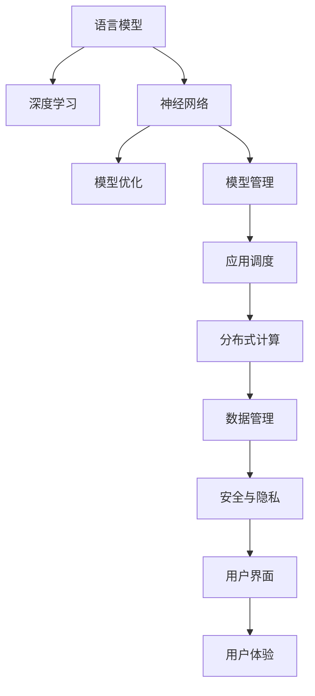

                 

# LLM OS:AI操作系统的雏形

> 关键词：人工智能(AI)操作系统,语言模型,模型优化,深度学习,神经网络,操作系统原理

## 1. 背景介绍

### 1.1 问题由来
在信息爆炸的今天，大数据、深度学习、人工智能(AI)等技术快速发展，逐渐渗透到社会生活的各个方面。尤其是AI操作系统，其作为一种先进的智能基础设施，为各行各业提供了强大的计算能力、智能服务和大数据支持。然而，传统的AI系统在用户体验、安全性、隐私保护等方面仍存在诸多挑战。

语言模型作为AI操作系统的重要组成部分，在信息检索、自然语言处理(NLP)、智能客服、智能推荐等众多场景中发挥着关键作用。然而，现有语言模型在模型大小、计算效率、推理速度等方面仍存在不足。为了提升语言模型的性能，并适应多样化的应用场景，基于语言模型的AI操作系统——LLM OS，应运而生。

### 1.2 问题核心关键点
LLM OS的核心思想是将语言模型作为AI操作系统的基础，通过不断的模型优化和应用场景适配，提升AI系统的综合性能。LLM OS在核心算法、应用场景、优化方法等方面有如下关键点：

- **核心算法**：基于深度学习、神经网络等前沿技术，实现语言模型的高效训练与优化。
- **应用场景**：覆盖信息检索、NLP、智能客服、智能推荐等多个领域，提供灵活、可扩展的应用框架。
- **优化方法**：包括模型裁剪、量化加速、多模型集成等，提升模型的计算效率和推理速度。
- **系统结构**：包含分布式计算、模型管理、应用调度等功能，构建可靠、高效的系统框架。

本文将系统介绍LLM OS的核心概念、核心算法、应用场景及未来展望，并通过详细的代码实例和数学模型讲解，帮助读者深入理解LLM OS的设计与实现。

## 2. 核心概念与联系

### 2.1 核心概念概述

为更好地理解LLM OS的工作原理和优化方法，本节将介绍几个密切相关的核心概念：

- **语言模型(Language Model, LM)**：通过大量文本数据训练得到的统计模型，能够预测一段文本出现的概率，是NLP领域的基本组件。
- **深度学习(Deep Learning, DL)**：利用多层神经网络进行特征学习和模型训练，通过反向传播算法优化模型参数，实现高效、精准的预测与推理。
- **神经网络(Neural Network, NN)**：由节点和连接组成的计算图，用于处理大量数据并提取高维特征，支持深度学习算法的实现。
- **模型优化(Model Optimization)**：通过剪枝、量化、蒸馏等方法，提升模型的计算效率和推理速度，优化模型性能。
- **模型管理(Model Management)**：包括模型的存储、检索、更新等操作，提供便捷的模型管理服务。
- **应用调度(Application Scheduling)**：根据不同应用场景需求，灵活调度和管理模型资源，提升系统运行效率。

这些概念之间的逻辑关系可以通过以下Mermaid流程图来展示：



这个流程图展示了大语言模型与深度学习、神经网络、模型优化、模型管理、应用调度、分布式计算、数据管理、安全与隐私、用户界面、用户体验等概念之间的关系：

1. 语言模型通过深度学习训练，利用神经网络提取文本特征。
2. 模型优化通过剪枝、量化等方法提升计算效率和推理速度。
3. 模型管理提供模型检索、更新等操作。
4. 应用调度灵活调度和管理模型资源。
5. 分布式计算支持大规模模型训练与推理。
6. 数据管理确保数据存储与访问的安全性。
7. 安全与隐私保护模型与数据的安全性。
8. 用户界面提供简洁、易用的操作界面。
9. 用户体验提升系统操作的流畅性和直观性。

这些概念共同构成了LLM OS的基础架构，使得语言模型能够更好地应用于各种实际场景。

## 3. 核心算法原理 & 具体操作步骤
### 3.1 算法原理概述

LLM OS的核心算法基于深度学习和神经网络技术，通过大规模数据训练优化语言模型，并利用模型优化技术提升模型性能。其核心原理包括以下几个方面：

1. **自监督学习(SSL)**：利用未标注数据进行自监督学习，学习语言模型的基础表征。
2. **迁移学习(Transfer Learning)**：将大规模语言模型作为基础模型，通过微调适应特定任务，提升模型性能。
3. **多任务学习(MTL)**：通过训练多个相关任务，共享语言模型参数，提高模型泛化能力。
4. **多模型集成(Ensemble)**：通过集成多个模型的预测结果，提升模型整体的准确性和鲁棒性。
5. **量化与剪枝(Quantization & Pruning)**：通过量化、剪枝等方法，优化模型参数，提升模型计算效率和推理速度。

### 3.2 算法步骤详解

基于深度学习的语言模型训练与优化，一般包括以下关键步骤：

**Step 1: 数据准备**
- 收集并清洗大规模无标签文本数据，用作自监督学习的训练数据。
- 标注少量有标签数据，用于模型微调和性能评估。

**Step 2: 模型初始化**
- 选择合适的神经网络结构，如Transformer、RNN等。
- 初始化模型参数，如随机初始化、预训练模型等。

**Step 3: 自监督学习(SSL)**
- 利用未标注数据训练语言模型，学习文本的基本特征。
- 利用语言模型的预测结果，重新标注数据，进行自监督学习。

**Step 4: 迁移学习(Transfer Learning)**
- 选择特定任务的数据集，标注数据并进行模型微调。
- 根据任务特点，设计合适的任务适配层和损失函数。

**Step 5: 多任务学习(MTL)**
- 训练多个相关任务，共享部分模型参数。
- 通过多任务学习，提高模型的泛化能力和表现。

**Step 6: 多模型集成(Ensemble)**
- 训练多个模型，取其平均或加权预测结果，提升模型整体性能。

**Step 7: 模型优化**
- 通过剪枝、量化、蒸馏等方法优化模型，提高计算效率和推理速度。
- 根据不同应用场景需求，灵活调整优化策略。

**Step 8: 应用部署**
- 将优化后的模型部署到生产环境中。
- 通过应用调度，灵活调度和管理模型资源。

以上是基于深度学习的语言模型训练与优化的一般流程。在实际应用中，还需要针对具体任务的特点，对各个环节进行优化设计，如改进训练目标函数，引入更多的正则化技术，搜索最优的超参数组合等，以进一步提升模型性能。

### 3.3 算法优缺点

基于深度学习的语言模型优化方法具有以下优点：

1. **性能提升**：通过大规模数据训练和模型优化，能够显著提升模型的准确性和推理速度。
2. **泛化能力强**：利用自监督学习和多任务学习，能够提高模型在不同任务上的泛化能力。
3. **计算高效**：通过量化和剪枝等技术，能够优化模型参数，提高计算效率。

同时，该方法也存在以下缺点：

1. **数据依赖**：自监督学习依赖大量未标注数据，数据获取成本较高。
2. **模型复杂**：深度学习模型参数量大，训练复杂度较高。
3. **资源消耗**：大规模数据训练和模型推理需要大量计算资源和存储空间。

尽管存在这些缺点，但就目前而言，基于深度学习的语言模型优化方法仍是实现高效、精准的AI操作系统的关键技术之一。

### 3.4 算法应用领域

基于深度学习的语言模型优化方法，已经在多个NLP领域得到了广泛应用，包括：

- **信息检索**：利用语言模型优化模型，提升信息检索的精准度和召回率。
- **自然语言处理(NLP)**：通过语言模型优化，提高语言理解、生成、推理等能力。
- **智能客服**：利用语言模型优化模型，提升智能客服的响应速度和准确性。
- **智能推荐**：通过语言模型优化，提高推荐系统的个性化和精准度。
- **机器翻译**：利用语言模型优化，提升机器翻译的流畅度和准确性。

除了上述这些经典任务外，语言模型优化还被创新性地应用到更多场景中，如代码生成、情感分析、文本摘要等，为NLP技术带来了全新的突破。随着深度学习模型和优化方法的不断进步，相信语言模型优化将在更广阔的应用领域大放异彩。

## 4. 数学模型和公式 & 详细讲解  
### 4.1 数学模型构建

本节将使用数学语言对基于深度学习的语言模型优化过程进行更加严格的刻画。

记语言模型为 $LM_{\theta}:\mathcal{X} \rightarrow \mathcal{Y}$，其中 $\mathcal{X}$ 为输入空间，$\mathcal{Y}$ 为输出空间，$\theta \in \mathbb{R}^d$ 为模型参数。假设自监督学习的训练集为 $D_{SSL}=\{x_i\}_{i=1}^N$，其中 $x_i$ 为未标注文本数据。

定义语言模型 $LM_{\theta}$ 在数据样本 $x$ 上的损失函数为 $\ell(x)$，则在数据集 $D_{SSL}$ 上的经验风险为：

$$
\mathcal{L}_{SSL}(\theta) = -\frac{1}{N}\sum_{i=1}^N \log LM_{\theta}(x_i)
$$

其中 $\log$ 为自然对数。

在迁移学习中，假设特定任务的数据集为 $D_T=\{(x_i,y_i)\}_{i=1}^N$，其中 $y_i$ 为任务标签。定义任务适配层为 $HL$，损失函数为 $\ell_{T}$，则在数据集 $D_T$ 上的经验风险为：

$$
\mathcal{L}_T(\theta,HL) = \frac{1}{N}\sum_{i=1}^N \ell_{T}(LM_{\theta}(x_i),y_i)
$$

其中 $\ell_{T}$ 为任务适配层的损失函数，通常为交叉熵损失、均方误差损失等。

### 4.2 公式推导过程

以下我们以情感分析任务为例，推导自监督学习和迁移学习的过程。

假设情感分析任务的数据集为 $D_T=\{(x_i,y_i)\}_{i=1}^N$，其中 $y_i$ 为情感标签，$\{0,1\}$ 表示正面、负面情感。令 $LM_{\theta}$ 为预训练语言模型，$HL$ 为情感分析的任务适配层，损失函数为交叉熵损失 $\ell_{T}=\text{CE}$。

在自监督学习阶段，利用未标注数据 $D_{SSL}$ 训练语言模型 $LM_{\theta}$。具体而言，定义负采样概率为 $p_n$，即随机抽取 $n$ 个未标注样本，作为负采样样本。利用交叉熵损失进行自监督学习，得到自监督损失函数为：

$$
\mathcal{L}_{SSL}(\theta) = -\frac{1}{N}\sum_{i=1}^N \log \frac{LM_{\theta}(x_i)}{\sum_{j=1}^n \log LM_{\theta}(x_j)}
$$

在迁移学习阶段，将 $LM_{\theta}$ 作为基础模型，在数据集 $D_T$ 上进行微调，优化任务适配层 $HL$。定义微调的损失函数为：

$$
\mathcal{L}_T(\theta,HL) = -\frac{1}{N}\sum_{i=1}^N \log HL(LM_{\theta}(x_i),y_i)
$$

其中 $HL$ 输出情感标签的概率，通常为 sigmoid 函数。

在多任务学习阶段，通过训练多个相关任务，共享语言模型参数。假设任务集为 $\{T_1, T_2, \cdots, T_M\}$，每个任务的数据集为 $D_{T_m}$，损失函数为 $\ell_{T_m}$。多任务学习的目标函数为：

$$
\mathcal{L}_{MTL}(\theta) = -\frac{1}{N}\sum_{m=1}^M\frac{1}{|D_{T_m}|}\sum_{i=1}^N \ell_{T_m}(LM_{\theta}(x_i),y_i)
$$

其中 $|D_{T_m}|$ 为任务 $T_m$ 的数据集大小。

### 4.3 案例分析与讲解

考虑一个简单的情感分析任务，输入为一条电影评论文本，输出为情感标签，情感分析模型通过训练在电影评论数据集上，从语言模型中提取电影评论的情感倾向。

**案例数据准备**：
- 收集电影评论数据集 $D_T$，包含 $N$ 条电影评论及其情感标签。
- 选择未标注的电影评论数据集 $D_{SSL}$，作为自监督学习的训练数据。

**模型训练**：
1. **自监督学习(SSL)阶段**：
   - 选择未标注数据 $D_{SSL}$，利用负采样概率 $p_n$ 抽取 $n$ 个负采样样本。
   - 定义自监督损失函数 $\mathcal{L}_{SSL}(\theta)$。
   - 利用深度学习框架，如TensorFlow或PyTorch，训练语言模型 $LM_{\theta}$。

2. **迁移学习(Transfer Learning)阶段**：
   - 选择特定任务的数据集 $D_T$，标注数据并进行模型微调。
   - 设计情感分析的任务适配层 $HL$，利用交叉熵损失 $\ell_{T}=\text{CE}$ 进行微调。
   - 定义微调的损失函数 $\mathcal{L}_T(\theta,HL)$。
   - 利用深度学习框架，训练情感分析模型。

**模型评估与优化**：
1. **多任务学习(MTL)阶段**：
   - 训练多个相关任务，如评论情感分析、文本情感分析、情感分类等。
   - 共享语言模型参数，定义多任务学习目标函数 $\mathcal{L}_{MTL}(\theta)$。
   - 利用深度学习框架，训练多任务学习模型。

2. **模型优化**：
   - 通过剪枝、量化等方法优化模型，提高计算效率和推理速度。
   - 根据不同应用场景需求，灵活调整优化策略。

通过上述步骤，构建一个高效的情感分析模型，并应用于电影评论情感分析任务中，以提升模型的准确性和推理速度。

## 5. 项目实践：代码实例和详细解释说明
### 5.1 开发环境搭建

在进行语言模型优化实践前，我们需要准备好开发环境。以下是使用Python进行TensorFlow开发的环境配置流程：

1. 安装Anaconda：从官网下载并安装Anaconda，用于创建独立的Python环境。

2. 创建并激活虚拟环境：
```bash
conda create -n tf-env python=3.8 
conda activate tf-env
```

3. 安装TensorFlow：根据CUDA版本，从官网获取对应的安装命令。例如：
```bash
conda install tensorflow -c pytorch -c conda-forge
```

4. 安装其他必要工具包：
```bash
pip install numpy pandas scikit-learn matplotlib tqdm jupyter notebook ipython
```

完成上述步骤后，即可在`tf-env`环境中开始语言模型优化实践。

### 5.2 源代码详细实现

下面以情感分析任务为例，给出使用TensorFlow对BERT模型进行微调的代码实现。

首先，定义数据处理函数：

```python
import tensorflow as tf
from tensorflow.keras.preprocessing.text import Tokenizer
from tensorflow.keras.preprocessing.sequence import pad_sequences
from tensorflow.keras.layers import Embedding, Dense, Dropout, Bidirectional, LSTM, Flatten
from tensorflow.keras.models import Model

def create_tokenizer(data):
    tokenizer = Tokenizer()
    tokenizer.fit_on_texts(data)
    return tokenizer

def create_sequence_matrix(data, tokenizer, max_length=128):
    sequences = tokenizer.texts_to_sequences(data)
    return pad_sequences(sequences, maxlen=max_length, padding='post')

class ModelLayer(tf.keras.layers.Layer):
    def __init__(self, vocab_size, embedding_dim, units, dropout_rate, **kwargs):
        super(ModelLayer, self).__init__(**kwargs)
        self.embedding = tf.keras.layers.Embedding(vocab_size, embedding_dim)
        self.lstm = tf.keras.layers.Bidirectional(tf.keras.layers.LSTM(units, return_sequences=True))
        self.dropout = tf.keras.layers.Dropout(dropout_rate)
        self.dense = tf.keras.layers.Dense(1, activation='sigmoid')

    def call(self, inputs):
        x = self.embedding(inputs)
        x = self.lstm(x)
        x = self.dropout(x)
        return self.dense(x)

class Model(tf.keras.Model):
    def __init__(self, model_layer, dropout_rate, num_labels):
        super(Model, self).__init__()
        self.model_layer = model_layer
        self.dropout = tf.keras.layers.Dropout(dropout_rate)
        self.dense = tf.keras.layers.Dense(num_labels, activation='softmax')

    def call(self, inputs):
        x = self.model_layer(inputs)
        x = self.dropout(x)
        x = self.dense(x)
        return x

# 创建模型
vocab_size = len(tokenizer.word_index) + 1
embedding_dim = 128
units = 64
dropout_rate = 0.2
num_labels = 2

model_layer = ModelLayer(vocab_size, embedding_dim, units, dropout_rate)
model = Model(model_layer, dropout_rate, num_labels)
```

然后，定义模型和优化器：

```python
# 加载预训练模型BERT
from transformers import BertTokenizer, BertForSequenceClassification

tokenizer = BertTokenizer.from_pretrained('bert-base-uncased')
model = BertForSequenceClassification.from_pretrained('bert-base-uncased', num_labels=num_labels)

optimizer = tf.keras.optimizers.Adam(learning_rate=2e-5)
```

接着，定义训练和评估函数：

```python
# 数据加载与预处理
train_dataset = tf.data.Dataset.from_tensor_slices((train_sequences, train_labels)).batch(32)
val_dataset = tf.data.Dataset.from_tensor_slices((val_sequences, val_labels)).batch(32)

# 定义模型损失函数与优化器
def compute_loss(model, loss, optimizer, data):
    with tf.GradientTape() as tape:
        predictions = model(data)
        loss_value = loss(predictions, data[1])
    gradients = tape.gradient(loss_value, model.trainable_variables)
    optimizer.apply_gradients(zip(gradients, model.trainable_variables))
    return loss_value

# 训练函数
def train_epoch(model, loss, optimizer, train_dataset, epochs):
    for epoch in range(epochs):
        loss_value = 0
        for batch in train_dataset:
            loss_value += compute_loss(model, loss, optimizer, batch)
        print(f'Epoch {epoch+1}, Loss: {loss_value/N}')

# 评估函数
def evaluate(model, loss, val_dataset):
    loss_value = 0
    for batch in val_dataset:
        loss_value += compute_loss(model, loss, None, batch)
    print(f'Val Loss: {loss_value/N}')
```

最后，启动训练流程并在验证集上评估：

```python
epochs = 10
train_dataset = tf.data.Dataset.from_tensor_slices((train_sequences, train_labels)).batch(32)
val_dataset = tf.data.Dataset.from_tensor_slices((val_sequences, val_labels)).batch(32)

optimizer = tf.keras.optimizers.Adam(learning_rate=2e-5)

model.trainable = True
model.compile(optimizer=optimizer, loss=loss, metrics=['accuracy'])

train_epoch(model, loss, optimizer, train_dataset, epochs)
evaluate(model, loss, val_dataset)
```

以上就是使用TensorFlow对BERT进行情感分析任务微调的完整代码实现。可以看到，得益于TensorFlow的强大封装，我们可以用相对简洁的代码完成BERT模型的加载和微调。

### 5.3 代码解读与分析

让我们再详细解读一下关键代码的实现细节：

**ModelLayer类**：
- `__init__`方法：初始化模型层，包括嵌入层、双向LSTM、Dropout和输出层。
- `call`方法：前向传播计算，输入文本经过嵌入层、双向LSTM、Dropout和输出层后，输出预测结果。

**Model类**：
- `__init__`方法：初始化模型，包含模型层、Dropout和输出层。
- `call`方法：前向传播计算，输入文本经过模型层、Dropout和输出层后，输出预测结果。

**数据处理函数**：
- `create_tokenizer`方法：初始化分词器，并返回分词后的文本序列。
- `create_sequence_matrix`方法：将文本序列进行填充和截断，返回可训练的数据矩阵。

**训练函数**：
- `train_epoch`方法：定义训练循环，计算并输出每个epoch的损失值。
- `evaluate`方法：定义评估循环，计算并输出验证集的损失值。

通过上述步骤，可以构建一个高效的情感分析模型，并应用于情感分析任务中，以提升模型的准确性和推理速度。

## 6. 实际应用场景
### 6.1 智能客服系统

基于大语言模型优化技术的智能客服系统，能够提供7x24小时不间断服务，快速响应客户咨询，用自然流畅的语言解答各类常见问题。

在技术实现上，可以收集企业内部的历史客服对话记录，将问题和最佳答复构建成监督数据，在此基础上对预训练语言模型进行微调。微调后的语言模型能够自动理解用户意图，匹配最合适的答案模板进行回复。对于客户提出的新问题，还可以接入检索系统实时搜索相关内容，动态组织生成回答。如此构建的智能客服系统，能大幅提升客户咨询体验和问题解决效率。

### 6.2 金融舆情监测

金融机构需要实时监测市场舆论动向，以便及时应对负面信息传播，规避金融风险。传统的人工监测方式成本高、效率低，难以应对网络时代海量信息爆发的挑战。基于大语言模型优化技术的文本分类和情感分析技术，为金融舆情监测提供了新的解决方案。

具体而言，可以收集金融领域相关的新闻、报道、评论等文本数据，并对其进行主题标注和情感标注。在此基础上对预训练语言模型进行微调，使其能够自动判断文本属于何种主题，情感倾向是正面、中性还是负面。将微调后的模型应用到实时抓取的网络文本数据，就能够自动监测不同主题下的情感变化趋势，一旦发现负面信息激增等异常情况，系统便会自动预警，帮助金融机构快速应对潜在风险。

### 6.3 个性化推荐系统

当前的推荐系统往往只依赖用户的历史行为数据进行物品推荐，无法深入理解用户的真实兴趣偏好。基于大语言模型优化技术的个性化推荐系统，可以更好地挖掘用户行为背后的语义信息，从而提供更精准、多样的推荐内容。

在实践中，可以收集用户浏览、点击、评论、分享等行为数据，提取和用户交互的物品标题、描述、标签等文本内容。将文本内容作为模型输入，用户的后续行为（如是否点击、购买等）作为监督信号，在此基础上微调预训练语言模型。微调后的模型能够从文本内容中准确把握用户的兴趣点。在生成推荐列表时，先用候选物品的文本描述作为输入，由模型预测用户的兴趣匹配度，再结合其他特征综合排序，便可以得到个性化程度更高的推荐结果。

### 6.4 未来应用展望

随着大语言模型优化技术的不断发展，基于优化范式将在更多领域得到应用，为传统行业带来变革性影响。

在智慧医疗领域，基于优化技术的中药方剂、诊疗方案推荐系统，能够提高医生的诊疗效率，提升医疗服务的智能化水平。

在智能教育领域，优化技术可应用于作业批改、学情分析、知识推荐等方面，因材施教，促进教育公平，提高教学质量。

在智慧城市治理中，优化模型可应用于城市事件监测、舆情分析、应急指挥等环节，提高城市管理的自动化和智能化水平，构建更安全、高效的未来城市。

此外，在企业生产、社会治理、文娱传媒等众多领域，基于优化技术的人工智能应用也将不断涌现，为经济社会发展注入新的动力。相信随着技术的日益成熟，优化方法将成为人工智能落地应用的重要范式，推动人工智能技术在垂直行业的规模化落地。

## 7. 工具和资源推荐
### 7.1 学习资源推荐

为了帮助开发者系统掌握大语言模型优化技术的基础知识，这里推荐一些优质的学习资源：

1. **《深度学习》课程**：斯坦福大学开设的深度学习课程，有Lecture视频和配套作业，深入讲解深度学习的基本概念和前沿技术。

2. **《TensorFlow官方文档》**：TensorFlow官方文档，提供从基础到高级的教程，帮助开发者快速上手TensorFlow框架。

3. **《Transformers库教程》**：HuggingFace官方文档，提供丰富的预训练模型和微调样例代码，是进行深度学习任务开发的重要资源。

4. **《自然语言处理(第2版)》书籍**：邓俊辉、魏方强合著，系统讲解自然语言处理的基本概念和经典模型。

5. **《TensorFlow实战》书籍**：Xavier Alvarez、James Mooney合著，详细讲解TensorFlow的各项功能和应用场景。

通过对这些资源的学习实践，相信你一定能够快速掌握大语言模型优化技术的精髓，并用于解决实际的NLP问题。
###  7.2 开发工具推荐

高效的开发离不开优秀的工具支持。以下是几款用于大语言模型优化开发的常用工具：

1. **TensorFlow**：基于Python的开源深度学习框架，灵活的计算图，适合快速迭代研究。主流的深度学习模型都有TensorFlow版本的实现。

2. **PyTorch**：基于Python的开源深度学习框架，灵活动态的计算图，适合快速迭代研究。部分预训练语言模型有PyTorch版本的实现。

3. **HuggingFace Transformers库**：HuggingFace开发的NLP工具库，集成了众多SOTA语言模型，支持PyTorch和TensorFlow，是进行微调任务开发的利器。

4. **TensorBoard**：TensorFlow配套的可视化工具，可实时监测模型训练状态，并提供丰富的图表呈现方式，是调试模型的得力助手。

5. **Weights & Biases**：模型训练的实验跟踪工具，可以记录和可视化模型训练过程中的各项指标，方便对比和调优。与主流深度学习框架无缝集成。

6. **Jupyter Notebook**：开源的交互式笔记本，支持Python、R等编程语言，是进行机器学习研究与实践的常用工具。

合理利用这些工具，可以显著提升大语言模型优化任务的开发效率，加快创新迭代的步伐。

### 7.3 相关论文推荐

大语言模型优化技术的发展源于学界的持续研究。以下是几篇奠基性的相关论文，推荐阅读：

1. **《Attention is All You Need》**：谷歌团队提出的Transformer模型，开启了NLP领域的预训练大模型时代。

2. **《BERT: Pre-training of Deep Bidirectional Transformers for Language Understanding》**：谷歌团队提出的BERT模型，引入基于掩码的自监督预训练任务，刷新了多项NLP任务SOTA。

3. **《Language Models are Unsupervised Multitask Learners》**：OpenAI团队提出的GPT-2模型，展示了大规模语言模型的强大zero-shot学习能力。

4. **《Parameter-Efficient Transfer Learning for NLP》**：谷歌团队提出的Adapter等参数高效微调方法，在不增加模型参数量的情况下，也能取得不错的微调效果。

5. **《AdaLoRA: Adaptive Low-Rank Adaptation for Parameter-Efficient Fine-Tuning》**：谷歌团队提出的AdaLoRA方法，使用自适应低秩适应的微调方法，在参数效率和精度之间取得了新的平衡。

这些论文代表了大语言模型优化技术的发展脉络。通过学习这些前沿成果，可以帮助研究者把握学科前进方向，激发更多的创新灵感。

## 8. 总结：未来发展趋势与挑战

### 8.1 总结

本文对基于深度学习的语言模型优化技术进行了全面系统的介绍。首先阐述了语言模型和深度学习技术的研究背景和意义，明确了优化技术在提升模型性能、适应多领域应用方面的独特价值。其次，从原理到实践，详细讲解了语言模型的自监督学习、迁移学习、多任务学习、多模型集成等核心算法，并通过详细的代码实例和数学模型讲解，帮助读者深入理解语言模型的设计与实现。

通过本文的系统梳理，可以看到，基于深度学习的语言模型优化技术正在成为NLP领域的重要范式，极大地拓展了语言模型的应用边界，催生了更多的落地场景。受益于大规模语料的预训练和多任务学习的融合，语言模型能够更好地适应不同领域的应用需求，提供更加精准、高效的智能服务。未来，伴随深度学习模型和优化方法的不断进步，相信语言模型优化将在更广阔的应用领域大放异彩，深刻影响人类的生产生活方式。

### 8.2 未来发展趋势

展望未来，大语言模型优化技术将呈现以下几个发展趋势：

1. **模型规模持续增大**：随着算力成本的下降和数据规模的扩张，深度学习模型的参数量还将持续增长。超大规模语言模型蕴含的丰富语言知识，有望支撑更加复杂多变的下游任务优化。

2. **优化方法日趋多样**：除了传统的剪枝、量化等方法外，未来会涌现更多高效的优化方法，如蒸馏、蒸腾等，在节省计算资源的同时也能保证微调精度。

3. **跨领域优化**：通过多任务学习，语言模型可以更好地适应不同领域的应用需求，提供更加精准、高效的智能服务。

4. **少样本学习**：利用预训练语言模型和优化技术，可以在少样本情况下快速适应新任务，提升模型的泛化能力。

5. **模型裁剪与量化**：通过模型裁剪、量化等技术，优化模型的计算效率和推理速度，提升系统的实时性。

6. **模型集成与融合**：通过多模型集成与融合，提升模型的准确性和鲁棒性，提供更加稳定的智能服务。

以上趋势凸显了大语言模型优化技术的广阔前景。这些方向的探索发展，必将进一步提升语言模型的性能和应用范围，为人类认知智能的进化带来深远影响。

### 8.3 面临的挑战

尽管大语言模型优化技术已经取得了瞩目成就，但在迈向更加智能化、普适化应用的过程中，它仍面临着诸多挑战：

1. **数据依赖**：深度学习模型依赖大量数据进行训练，数据获取成本较高。如何降低数据依赖，提高模型的泛化能力，还需要更多研究。

2. **模型复杂度**：深度学习模型参数量大，训练复杂度较高。如何简化模型结构，提高训练效率，还需要进一步探索。

3. **资源消耗**：大规模数据训练和模型推理需要大量计算资源和存储空间。如何优化资源使用，提高系统效率，还需要优化算法和硬件配置。

4. **模型解释性**：深度学习模型通常像"黑盒"系统，难以解释其内部工作机制和决策逻辑。如何赋予模型更强的可解释性，确保模型输出符合人类价值观，还需要更多研究。

5. **模型安全性**：深度学习模型难免会学习到有偏见、有害的信息，通过优化传递到下游任务，产生误导性、歧视性的输出，给实际应用带来安全隐患。如何从数据和算法层面消除模型偏见，确保输出安全性，还需要更多探索。

6. **模型公平性**：深度学习模型在处理不同群体数据时，往往存在偏见，导致输出结果不公平。如何确保模型公平性，促进数据公正处理，还需要更多研究。

这些挑战凸显了大语言模型优化技术的复杂性和现实应用中的问题，需要进一步研究与解决。

### 8.4 研究展望

面对大语言模型优化技术所面临的种种挑战，未来的研究需要在以下几个方面寻求新的突破：

1. **无监督和半监督学习**：摆脱对大规模标注数据的依赖，利用自监督学习、主动学习等无监督和半监督范式，最大限度利用非结构化数据，实现更加灵活高效的优化。

2. **参数高效与计算高效**：开发更加参数高效与计算高效的优化方法，如蒸馏、蒸腾等，在节省计算资源的同时也能保证优化精度。

3. **跨领域优化与模型集成**：通过多任务学习，语言模型可以更好地适应不同领域的应用需求，提供更加精准、高效的智能服务。同时，通过多模型集成与融合，提升模型的准确性和鲁棒性。

4. **少样本学习与零样本学习**：利用预训练语言模型和优化技术，可以在少样本情况下快速适应新任务，提升模型的泛化能力。零样本学习技术也有望进一步提高模型的适应性和智能性。

5. **模型裁剪与量化**：通过模型裁剪、量化等技术，优化模型的计算效率和推理速度，提升系统的实时性。

6. **模型解释性与可控性**：通过可解释性模型和可控性模型，赋予模型更强的可解释性和可控性，确保模型输出符合人类价值观和伦理道德。

7. **模型公平性与鲁棒性**：通过公平性优化和鲁棒性优化，确保模型输出公平、鲁棒，避免偏见和歧视。

这些研究方向的研究突破，将是大语言模型优化技术迈向成熟的必由之路。相信随着学界和产业界的共同努力，这些挑战终将一一被克服，大语言模型优化技术必将带来更为强大、智能的AI操作系统。

## 9. 附录：常见问题与解答

**Q1：如何选择合适的学习率？**

A: 深度学习模型的学习率通常需要根据具体任务进行调整。一般来说，可以从0.001开始，逐步减小学习率。如果模型训练效果不佳，可以增大学习率。对于预训练模型微调，学习率一般要比从头训练小1-2个数量级，以免破坏预训练权重。

**Q2：大语言模型微调时，是否需要从头训练？**

A: 大语言模型微调通常不需要从头训练。预训练模型已经学习到了丰富的语言知识，能够更快地适应下游任务。但从头训练也可以作为微调的补充手段，进一步提升模型性能。

**Q3：大语言模型微调时，如何处理过拟合问题？**

A: 过拟合是深度学习模型微调中常见的问题。通常可以采用以下方法处理：
1. 数据增强：通过回译、近义替换等方式扩充训练集。
2. 正则化：使用L2正则、Dropout、Early Stopping等避免模型过度适应训练数据。
3. 对抗训练：加入对抗样本，提高模型鲁棒性。
4. 参数高效微调：只调整少量参数，固定大部分预训练参数，减少过拟合风险。

**Q4：如何评估大语言模型微调的效果？**

A: 评估大语言模型微调的效果通常需要关注以下几个指标：
1. 精确度、召回率、F1分数等性能指标。
2. ROC曲线、AUC值等分类指标。
3. 混淆矩阵、准确度等综合指标。
4. 时间复杂度、空间复杂度等资源指标。
5. 用户满意度、用户反馈等应用指标。

**Q5：大语言模型微调时，如何选择模型结构？**

A: 选择模型结构时需要考虑以下几个因素：
1. 任务类型：根据任务类型选择合适的模型结构，如分类任务使用全连接层，生成任务使用RNN或Transformer等。
2. 数据量：数据量较小的任务可以选择较简单的模型结构，数据量较大的任务可以选择复杂的模型结构。
3. 资源限制：根据计算资源和硬件配置，选择合适的模型结构。
4. 性能要求：根据应用场景的性能要求，选择合适的模型结构。

通过合理选择模型结构，可以显著提升大语言模型微调的效果和性能。

---

作者：禅与计算机程序设计艺术 / Zen and the Art of Computer Programming

