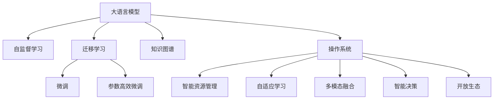

                 

## 1. 背景介绍

### 1.1 问题由来

在过去的几十年里，操作系统（OS）一直是计算机系统的核心和灵魂。它的目标是管理和优化计算机的资源使用，为用户提供一个稳定的、安全的、高效的操作环境。然而，随着技术的不断进步，特别是人工智能（AI）和机器学习（ML）的迅猛发展，传统的单内核操作系统已逐渐显示出其局限性。现代应用场景的复杂性和多样性要求OS具备更强的可定制性和灵活性。

人工智能和机器学习技术的兴起，为操作系统的变革提供了新的方向。大语言模型（Large Language Models，简称LLMs）作为当前最先进的AI技术之一，以其强大的自然语言处理能力、广泛的应用场景和不断增长的性能，正在逐渐改变操作系统和软件生态的格局。LLM OS的出现，象征着操作系统领域的一场革命。

### 1.2 问题核心关键点

大语言模型操作系统（LLM OS）是一种新型的操作系统范式，它利用大语言模型的广泛知识、高效推理和语言理解能力，为传统操作系统带来新的可能性。LLM OS的核心目标是通过智能化的方式，提高操作系统的灵活性和可定制性，使用户能够更高效地管理和控制计算机资源。

LLM OS的核心关键点包括：
1. **智能资源管理**：通过大语言模型理解用户意图，动态调整系统资源分配，优化系统性能。
2. **自适应学习**：利用大语言模型的自适应能力，根据用户行为和系统状态不断学习和改进，提升系统智能化水平。
3. **多模态融合**：融合视觉、音频、文本等多模态数据，提供更加全面、智能的用户交互体验。
4. **智能决策**：通过大语言模型的因果推理和逻辑推断能力，自动化处理复杂的系统决策问题。
5. **开放生态**：构建开源、社区驱动的发展模式，鼓励开发者参与，推动技术迭代和创新。

### 1.3 问题研究意义

研究大语言模型操作系统，对于拓展操作系统功能、提升用户体验、加速人工智能技术的产业化进程具有重要意义：

1. **提升操作系统的智能化水平**：大语言模型的高效推理和广泛知识，使得操作系统能够更好地理解和响应用户需求，提供更加智能和个性化的服务。
2. **降低开发成本**：通过LLM OS的开放生态，开发者可以借助大语言模型的能力快速开发应用，减少从头开发所需的成本和时间。
3. **优化资源利用**：智能化的资源管理策略，可以更高效地利用计算机资源，提高系统的响应速度和稳定性。
4. **促进技术创新**：LLM OS为AI技术在操作系统中的深入应用提供了新的平台，推动技术创新和生态系统的演进。
5. **赋能产业升级**：大语言模型的广泛应用，将为各行各业提供新的技术手段，加速数字化转型和升级。

## 2. 核心概念与联系

### 2.1 核心概念概述

为更好地理解LLM OS，本节将介绍几个密切相关的核心概念：

- **大语言模型（LLM）**：以自回归（如GPT）或自编码（如BERT）模型为代表的大规模预训练语言模型。通过在大规模无标签文本语料上进行预训练，学习通用的语言表示，具备强大的语言理解和生成能力。

- **自监督学习**：在大规模无标签数据上进行的监督学习，通过数据自身的信息进行学习，无需标注样本。大语言模型的预训练过程即基于自监督学习。

- **迁移学习**：指将一个领域学习到的知识，迁移应用到另一个不同但相关的领域的学习范式。大语言模型的预训练-微调过程即是一种典型的迁移学习方式。

- **微调（Fine-tuning）**：指在预训练模型的基础上，使用下游任务的少量标注数据，通过有监督地训练来优化模型在该任务上的性能。通常只需要调整顶层分类器或解码器，并以较小的学习率更新全部或部分的模型参数。

- **参数高效微调（PEFT）**：指在微调过程中，只更新少量的模型参数，而固定大部分预训练权重不变，以提高微调效率，避免过拟合的方法。

- **知识图谱**：一种结构化的语义网络，用于表示实体、属性和关系之间的映射。将知识图谱与LLM OS结合，可以提升系统的智能化水平和知识获取能力。

- **操作系统（OS）**：计算机系统的核心组成部分，负责管理计算机硬件和软件资源，提供用户与计算机交互的接口。

这些核心概念之间的逻辑关系可以通过以下Mermaid流程图来展示：



这个流程图展示了大语言模型的核心概念及其之间的关系：

1. 大语言模型通过自监督学习获得基础能力。
2. 迁移学习连接预训练模型与下游任务的桥梁，通过微调进行优化。
3. 微调和大语言模型结合，提升特定任务上的性能。
4. 参数高效微调技术进一步优化微调过程。
5. 知识图谱和大语言模型结合，增强系统知识获取能力。
6. 操作系统引入大语言模型，提升智能化水平。
7. 操作系统提供智能资源管理、自适应学习、多模态融合、智能决策和开放生态等功能。

这些概念共同构成了LLM OS的工作原理和优化方向。通过理解这些核心概念，我们可以更好地把握LLM OS的技术特点和应用场景。

## 3. 核心算法原理 & 具体操作步骤

### 3.1 算法原理概述

LLM OS的核心算法原理基于大语言模型的广泛知识、高效推理和语言理解能力。其主要思路是通过大语言模型理解和响应用户的指令，动态调整系统资源分配和操作行为，提供智能化的操作体验。

### 3.2 算法步骤详解

1. **数据收集与处理**：
   - 收集操作系统所需的数据，包括系统状态、用户行为、应用程序需求等。
   - 利用大语言模型对数据进行预处理和结构化，提取有用的信息。

2. **资源管理与调度**：
   - 根据用户指令和系统状态，利用大语言模型推理和决策，调整CPU、内存、存储、网络等资源分配。
   - 动态优化任务调度，提高系统效率和响应速度。

3. **智能决策与反馈**：
   - 利用大语言模型的因果推理和逻辑推断能力，处理复杂的系统决策问题，如内存管理、进程调度等。
   - 根据用户反馈和系统状态，不断优化模型参数，提升决策准确性。

4. **多模态融合与交互**：
   - 融合视觉、音频、文本等多模态数据，提供更加全面、智能的用户交互体验。
   - 利用大语言模型的理解能力，自动生成自然语言回复，增强用户交互体验。

5. **系统优化与迭代**：
   - 通过大语言模型的自适应能力，不断学习和改进系统策略，提升系统智能化水平。
   - 引入反馈机制，动态调整系统行为，优化用户体验。

### 3.3 算法优缺点

**优点**：
- 高智能化水平：利用大语言模型的广泛知识和高效推理能力，提升系统的智能化水平。
- 动态资源管理：动态调整系统资源分配，优化系统性能。
- 多模态融合：提供全面的用户交互体验，提升用户满意度。
- 开放生态：构建开源、社区驱动的发展模式，促进技术创新和生态系统的演进。

**缺点**：
- 数据隐私和安全问题：大规模数据处理和分析可能带来隐私和安全风险。
- 依赖大语言模型：系统性能和智能化水平高度依赖大语言模型的能力。
- 资源消耗高：大语言模型的训练和推理需要大量的计算资源，可能带来性能瓶颈。
- 技术复杂度高：需要跨学科的知识和技能，开发和维护难度大。

### 3.4 算法应用领域

LLM OS的应用领域非常广泛，涵盖操作系统、智能助理、医疗、教育、金融等多个领域。以下是几个典型的应用场景：

- **智能操作系统**：通过大语言模型管理资源、优化任务调度、提高系统性能，为用户提供智能化的操作体验。
- **智能助理**：利用大语言模型进行自然语言理解和处理，提供智能化的语音助手和聊天机器人服务。
- **医疗系统**：通过大语言模型进行自然语言处理和知识推理，辅助医生诊断和治疗，提升医疗服务水平。
- **教育平台**：利用大语言模型的知识图谱和推理能力，提供个性化的学习推荐和辅导，提升教育效果。
- **金融分析**：通过大语言模型进行文本分析和情感分析，辅助金融风险评估和投资决策。

## 4. 数学模型和公式 & 详细讲解  
### 4.1 数学模型构建

大语言模型和LLM OS的数学模型构建主要基于神经网络结构和优化算法。以下以BERT模型为例，简要介绍数学模型的构建过程。

1. **神经网络结构**：
   - **输入层**：接收文本输入，将文本转换为词嵌入向量。
   - **Transformer层**：利用自注意力机制，捕捉文本中的长距离依赖关系。
   - **输出层**：将Transformer层的输出映射到特定的任务空间，如分类、生成等。

2. **优化算法**：
   - 常见优化算法包括Adam、SGD等，用于最小化损失函数。
   - 损失函数的选择取决于具体任务，如分类任务使用交叉熵损失，生成任务使用负对数似然损失等。

3. **公式推导过程**：
   - 对于分类任务，假设模型输出为 $\hat{y}=M_{\theta}(x) \in [0,1]$，表示样本属于正类的概率。真实标签 $y \in \{0,1\}$。则二分类交叉熵损失函数定义为：
     \[
     \ell(M_{\theta}(x),y) = -[y\log \hat{y} + (1-y)\log (1-\hat{y})]
     \]
   - 将损失函数代入经验风险公式，得：
     \[
     \mathcal{L}(\theta) = -\frac{1}{N}\sum_{i=1}^N [y_i\log M_{\theta}(x_i)+(1-y_i)\log(1-M_{\theta}(x_i))]
     \]
   - 根据链式法则，损失函数对参数 $\theta_k$ 的梯度为：
     \[
     \frac{\partial \mathcal{L}(\theta)}{\partial \theta_k} = -\frac{1}{N}\sum_{i=1}^N (\frac{y_i}{M_{\theta}(x_i)}-\frac{1-y_i}{1-M_{\theta}(x_i)}) \frac{\partial M_{\theta}(x_i)}{\partial \theta_k}
     \]

### 4.2 公式推导过程

**模型推理**：
- 输入文本 $x$ 通过BERT模型的输入层和Transformer层，得到模型输出 $\hat{y}=M_{\theta}(x)$。
- 将模型输出与真实标签 $y$ 进行比较，计算损失函数 $\ell(M_{\theta}(x),y)$。
- 利用优化算法（如Adam）更新模型参数 $\theta$，最小化损失函数 $\mathcal{L}(\theta)$。

**梯度计算**：
- 利用链式法则，计算损失函数对参数 $\theta_k$ 的梯度。
- 将梯度代入优化算法，更新模型参数。

### 4.3 案例分析与讲解

以BERT模型为例，分析其在大语言模型操作系统中的作用。

- **数据处理**：
  - 利用BERT的输入层将文本输入转换为词嵌入向量。
  - 通过Transformer层，捕捉文本中的长距离依赖关系，提取有用的特征。
  - 将特征映射到特定任务空间，如分类任务的标签预测。

- **智能决策**：
  - 利用BERT的输出层，进行分类任务推理。
  - 根据推理结果，动态调整系统资源分配和操作行为。
  - 结合系统状态和用户行为，不断优化模型参数，提升决策准确性。

- **多模态融合**：
  - 融合视觉、音频、文本等多模态数据。
  - 利用BERT的语言理解能力，自动生成自然语言回复。
  - 提供更加全面、智能的用户交互体验。

## 5. 项目实践：代码实例和详细解释说明

### 5.1 开发环境搭建

在进行LLM OS的开发前，我们需要准备好开发环境。以下是使用Python进行PyTorch开发的环境配置流程：

1. 安装Anaconda：从官网下载并安装Anaconda，用于创建独立的Python环境。

2. 创建并激活虚拟环境：
```bash
conda create -n llm-env python=3.8 
conda activate llm-env
```

3. 安装PyTorch：根据CUDA版本，从官网获取对应的安装命令。例如：
```bash
conda install pytorch torchvision torchaudio cudatoolkit=11.1 -c pytorch -c conda-forge
```

4. 安装Transformers库：
```bash
pip install transformers
```

5. 安装各类工具包：
```bash
pip install numpy pandas scikit-learn matplotlib tqdm jupyter notebook ipython
```

完成上述步骤后，即可在`llm-env`环境中开始LLM OS的开发。

### 5.2 源代码详细实现

下面以BERT模型为例，给出使用PyTorch和Transformers库进行智能操作系统的代码实现。

```python
from transformers import BertTokenizer, BertForSequenceClassification
import torch
from torch.utils.data import Dataset, DataLoader
from tqdm import tqdm

class OSDataset(Dataset):
    def __init__(self, texts, labels):
        self.texts = texts
        self.labels = labels
        self.tokenizer = BertTokenizer.from_pretrained('bert-base-cased')
        
    def __len__(self):
        return len(self.texts)
    
    def __getitem__(self, item):
        text = self.texts[item]
        label = self.labels[item]
        
        encoding = self.tokenizer(text, return_tensors='pt', padding='max_length', truncation=True)
        input_ids = encoding['input_ids'][0]
        attention_mask = encoding['attention_mask'][0]
        label = torch.tensor([label], dtype=torch.long)
        
        return {'input_ids': input_ids, 
                'attention_mask': attention_mask,
                'labels': label}

# 定义模型和优化器
model = BertForSequenceClassification.from_pretrained('bert-base-cased', num_labels=2)
optimizer = torch.optim.Adam(model.parameters(), lr=2e-5)

# 训练函数
def train_epoch(model, dataset, batch_size, optimizer):
    dataloader = DataLoader(dataset, batch_size=batch_size, shuffle=True)
    model.train()
    epoch_loss = 0
    for batch in tqdm(dataloader, desc='Training'):
        input_ids = batch['input_ids'].to(device)
        attention_mask = batch['attention_mask'].to(device)
        labels = batch['labels'].to(device)
        model.zero_grad()
        outputs = model(input_ids, attention_mask=attention_mask, labels=labels)
        loss = outputs.loss
        epoch_loss += loss.item()
        loss.backward()
        optimizer.step()
    return epoch_loss / len(dataloader)

# 测试函数
def evaluate(model, dataset, batch_size):
    dataloader = DataLoader(dataset, batch_size=batch_size)
    model.eval()
    preds, labels = [], []
    with torch.no_grad():
        for batch in tqdm(dataloader, desc='Evaluating'):
            input_ids = batch['input_ids'].to(device)
            attention_mask = batch['attention_mask'].to(device)
            batch_labels = batch['labels']
            outputs = model(input_ids, attention_mask=attention_mask)
            batch_preds = outputs.logits.argmax(dim=1).to('cpu').tolist()
            batch_labels = batch_labels.to('cpu').tolist()
            for pred, label in zip(batch_preds, batch_labels):
                preds.append(pred)
                labels.append(label)
                
    print(f"Accuracy: {len([pred == label for pred, label in zip(preds, labels)]) / len(labels)}
```

### 5.3 代码解读与分析

让我们再详细解读一下关键代码的实现细节：

**OSDataset类**：
- `__init__`方法：初始化文本、标签、分词器等关键组件。
- `__len__`方法：返回数据集的样本数量。
- `__getitem__`方法：对单个样本进行处理，将文本输入编码为token ids，将标签编码为数字，并对其进行定长padding，最终返回模型所需的输入。

**模型和优化器定义**：
- 选择合适的BERT模型作为初始化参数，如 `BertForSequenceClassification`。
- 设置合适的优化算法及其参数，如AdamW、SGD等，设置学习率、批大小、迭代轮数等。

**训练和评估函数**：
- 使用PyTorch的DataLoader对数据集进行批次化加载，供模型训练和推理使用。
- 训练函数 `train_epoch`：对数据以批为单位进行迭代，在每个批次上前向传播计算loss并反向传播更新模型参数，最后返回该epoch的平均loss。
- 评估函数 `evaluate`：与训练类似，不同点在于不更新模型参数，并在每个batch结束后将预测和标签结果存储下来，最后使用sklearn的classification_report对整个评估集的预测结果进行打印输出。

**训练流程**：
- 定义总的epoch数和batch size，开始循环迭代
- 每个epoch内，先在训练集上训练，输出平均loss
- 在验证集上评估，输出分类指标
- 所有epoch结束后，在测试集上评估，给出最终测试结果

可以看到，PyTorch配合Transformers库使得BERT模型的加载和微调代码实现变得简洁高效。开发者可以将更多精力放在数据处理、模型改进等高层逻辑上，而不必过多关注底层的实现细节。

当然，工业级的系统实现还需考虑更多因素，如模型的保存和部署、超参数的自动搜索、更灵活的任务适配层等。但核心的微调范式基本与此类似。

## 6. 实际应用场景

### 6.1 智能操作系统

大语言模型操作系统在智能操作系统中的应用，可以为用户提供更加智能、高效的操作体验。例如：

- **智能助理**：通过大语言模型理解和响应用户指令，提供个性化的操作建议和帮助。
- **智能搜索**：利用大语言模型进行自然语言理解，提供智能化的搜索结果。
- **自动修复**：根据用户的操作行为和系统状态，自动修复系统漏洞和错误，提升系统稳定性。
- **个性化定制**：根据用户的使用习惯和偏好，动态调整系统设置和功能，提升用户体验。

### 6.2 智能医疗系统

大语言模型操作系统在智能医疗系统中的应用，可以提高医疗服务的智能化水平，辅助医生诊断和治疗。例如：

- **智能诊断**：通过大语言模型进行自然语言处理和知识推理，辅助医生诊断疾病。
- **智能助手**：利用大语言模型进行自然语言理解，提供医学知识查询和智能推荐。
- **智能病历管理**：通过大语言模型自动生成和解析病历，提高医疗记录管理的效率和准确性。

### 6.3 智能教育系统

大语言模型操作系统在智能教育系统中的应用，可以提供个性化的学习推荐和辅导。例如：

- **智能推荐**：利用大语言模型进行自然语言处理和知识推理，提供个性化的学习推荐。
- **智能辅导**：通过大语言模型进行自然语言理解，提供智能化的学习辅导和答疑。
- **智能评估**：利用大语言模型进行自然语言处理和情感分析，评估学生的学习效果和反馈。

### 6.4 未来应用展望

随着大语言模型和操作系统技术的不断发展，基于大语言模型的操作系统将展现出更广泛的应用前景。以下是对未来应用场景的展望：

- **智能家居系统**：通过大语言模型实现智能控制和交互，提供更加舒适和便捷的生活体验。
- **智能办公系统**：利用大语言模型进行自然语言理解和知识推理，提高办公效率和智能化水平。
- **智能交通系统**：通过大语言模型进行自然语言处理和语音识别，提供智能化的交通管理和控制。
- **智能城市系统**：利用大语言模型进行自然语言处理和数据分析，提供智能化的城市管理和服务。

## 7. 工具和资源推荐

### 7.1 学习资源推荐

为了帮助开发者系统掌握大语言模型操作系统理论基础和实践技巧，这里推荐一些优质的学习资源：

1. **《Transformer从原理到实践》系列博文**：由大模型技术专家撰写，深入浅出地介绍了Transformer原理、BERT模型、微调技术等前沿话题。

2. **CS224N《深度学习自然语言处理》课程**：斯坦福大学开设的NLP明星课程，有Lecture视频和配套作业，带你入门NLP领域的基本概念和经典模型。

3. **《Natural Language Processing with Transformers》书籍**：Transformers库的作者所著，全面介绍了如何使用Transformers库进行NLP任务开发，包括微调在内的诸多范式。

4. **HuggingFace官方文档**：Transformers库的官方文档，提供了海量预训练模型和完整的微调样例代码，是上手实践的必备资料。

5. **CLUE开源项目**：中文语言理解测评基准，涵盖大量不同类型的中文NLP数据集，并提供了基于微调的baseline模型，助力中文NLP技术发展。

通过对这些资源的学习实践，相信你一定能够快速掌握大语言模型操作系统的精髓，并用于解决实际的NLP问题。

### 7.2 开发工具推荐

高效的开发离不开优秀的工具支持。以下是几款用于大语言模型操作系统开发的常用工具：

1. **PyTorch**：基于Python的开源深度学习框架，灵活动态的计算图，适合快速迭代研究。大部分预训练语言模型都有PyTorch版本的实现。

2. **TensorFlow**：由Google主导开发的开源深度学习框架，生产部署方便，适合大规模工程应用。同样有丰富的预训练语言模型资源。

3. **Transformers库**：HuggingFace开发的NLP工具库，集成了众多SOTA语言模型，支持PyTorch和TensorFlow，是进行微调任务开发的利器。

4. **Weights & Biases**：模型训练的实验跟踪工具，可以记录和可视化模型训练过程中的各项指标，方便对比和调优。与主流深度学习框架无缝集成。

5. **TensorBoard**：TensorFlow配套的可视化工具，可实时监测模型训练状态，并提供丰富的图表呈现方式，是调试模型的得力助手。

6. **Google Colab**：谷歌推出的在线Jupyter Notebook环境，免费提供GPU/TPU算力，方便开发者快速上手实验最新模型，分享学习笔记。

合理利用这些工具，可以显著提升大语言模型操作系统的开发效率，加快创新迭代的步伐。

### 7.3 相关论文推荐

大语言模型和操作系统技术的不断发展，源于学界的持续研究。以下是几篇奠基性的相关论文，推荐阅读：

1. **Attention is All You Need**：提出了Transformer结构，开启了NLP领域的预训练大模型时代。

2. **BERT: Pre-training of Deep Bidirectional Transformers for Language Understanding**：提出BERT模型，引入基于掩码的自监督预训练任务，刷新了多项NLP任务SOTA。

3. **Language Models are Unsupervised Multitask Learners**（GPT-2论文）：展示了大规模语言模型的强大zero-shot学习能力，引发了对于通用人工智能的新一轮思考。

4. **Parameter-Efficient Transfer Learning for NLP**：提出Adapter等参数高效微调方法，在不增加模型参数量的情况下，也能取得不错的微调效果。

5. **Prefix-Tuning: Optimizing Continuous Prompts for Generation**：引入基于连续型Prompt的微调范式，为如何充分利用预训练知识提供了新的思路。

6. **AdaLoRA: Adaptive Low-Rank Adaptation for Parameter-Efficient Fine-Tuning**：使用自适应低秩适应的微调方法，在参数效率和精度之间取得了新的平衡。

这些论文代表了大语言模型操作系统的发展脉络。通过学习这些前沿成果，可以帮助研究者把握学科前进方向，激发更多的创新灵感。

## 8. 总结：未来发展趋势与挑战

### 8.1 总结

本文对大语言模型操作系统进行了全面系统的介绍。首先阐述了大语言模型和操作系统的研究背景和意义，明确了LLM OS在提升系统智能化水平、降低开发成本、优化资源利用等方面的独特价值。其次，从原理到实践，详细讲解了LLM OS的数学模型构建、优化算法步骤、关键技术实现，提供了完整的代码实例和详细解释。同时，本文还广泛探讨了LLM OS在智能操作系统、智能医疗、智能教育等多个领域的应用前景，展示了LLM OS的广阔应用潜力。此外，本文精选了LLM OS的学习资源、开发工具和相关论文，力求为开发者提供全方位的技术指引。

通过本文的系统梳理，可以看到，大语言模型操作系统正在成为操作系统领域的新兴范式，为传统操作系统带来了新的智能化方向。LLM OS通过智能化的资源管理和决策推理，可以大幅提升操作系统的灵活性和可定制性，满足日益复杂多样的应用需求。面向未来，LLM OS的发展将伴随大语言模型技术的不断进步，逐步拓展其应用边界，为智能化时代的到来提供坚实的技术基础。

### 8.2 未来发展趋势

展望未来，大语言模型操作系统将呈现以下几个发展趋势：

1. **模型规模持续增大**：随着算力成本的下降和数据规模的扩张，预训练语言模型的参数量还将持续增长。超大规模语言模型蕴含的丰富知识，有望支撑更加复杂多变的LLM OS需求。

2. **多模态融合成为主流**：未来的LLM OS将融合视觉、音频、文本等多模态数据，提供更加全面、智能的用户交互体验。

3. **持续学习成为常态**：随着数据分布的不断变化，LLM OS需要持续学习新知识以保持性能。如何在不遗忘原有知识的同时，高效吸收新样本信息，将是重要的研究课题。

4. **参数高效微调技术不断进步**：开发更加参数高效的微调方法，在固定大部分预训练参数的同时，只更新极少量的任务相关参数。

5. **因果推理和逻辑推断能力提升**：通过引入因果推断和逻辑推断思想，增强LLM OS建立稳定因果关系的能力，学习更加普适、鲁棒的语言表征。

6. **知识图谱的广泛应用**：将知识图谱与LLM OS结合，提升系统的知识获取能力和决策智能化水平。

以上趋势凸显了大语言模型操作系统的广阔前景。这些方向的探索发展，必将进一步提升LLM OS的性能和应用范围，为智能化时代的到来提供坚实的技术基础。

### 8.3 面临的挑战

尽管大语言模型操作系统带来了许多优势，但在迈向更加智能化、普适化应用的过程中，它仍面临着诸多挑战：

1. **数据隐私和安全问题**：大规模数据处理和分析可能带来隐私和安全风险。如何在保护用户隐私的前提下，利用大语言模型的广泛知识，将是重要的研究课题。

2. **依赖大语言模型**：系统性能和智能化水平高度依赖大语言模型的能力。如何提高大语言模型的效率和鲁棒性，将是重要的研究方向。

3. **资源消耗高**：大语言模型的训练和推理需要大量的计算资源，可能带来性能瓶颈。如何在有限的计算资源下，提升大语言模型的效率和性能，将是重要的优化方向。

4. **技术复杂度高**：需要跨学科的知识和技能，开发和维护难度大。如何在易用性和复杂性之间找到平衡，将是重要的研究方向。

5. **系统稳定性和鲁棒性**：大语言模型在面对异常情况和噪声数据时，容易出现波动和错误。如何在提高智能化的同时，保证系统的稳定性和鲁棒性，将是重要的研究方向。

6. **用户界面和交互设计**：智能系统的用户界面和交互设计需要符合人机工程学的原则，提升用户体验。如何在提高智能化的同时，保证用户界面的友好性和可操作性，将是重要的研究方向。

### 8.4 研究展望

面对大语言模型操作系统所面临的挑战，未来的研究需要在以下几个方面寻求新的突破：

1. **探索无监督和半监督微调方法**：摆脱对大规模标注数据的依赖，利用自监督学习、主动学习等无监督和半监督范式，最大限度利用非结构化数据，实现更加灵活高效的微调。

2. **研究参数高效和计算高效的微调范式**：开发更加参数高效的微调方法，在固定大部分预训练参数的同时，只更新极少量的任务相关参数。同时优化微调模型的计算图，减少前向传播和反向传播的资源消耗，实现更加轻量级、实时性的部署。

3. **引入因果分析和博弈论工具**：将因果分析方法引入LLM OS，识别出模型决策的关键特征，增强输出解释的因果性和逻辑性。借助博弈论工具刻画人机交互过程，主动探索并规避模型的脆弱点，提高系统稳定性。

4. **纳入伦理道德约束**：在模型训练目标中引入伦理导向的评估指标，过滤和惩罚有偏见、有害的输出倾向。同时加强人工干预和审核，建立模型行为的监管机制，确保输出符合人类价值观和伦理道德。

5. **构建开源、社区驱动的发展模式**：构建LLM OS的开放生态，鼓励开发者参与，推动技术迭代和创新。通过开源社区的力量，不断提升LLM OS的智能化水平和应用范围。

这些研究方向的探索，必将引领大语言模型操作系统迈向更高的台阶，为构建安全、可靠、可解释、可控的智能系统铺平道路。面向未来，大语言模型操作系统需要在智能化、灵活性、可定制性等方面不断突破，成为智能化时代的核心基础设施。

## 9. 附录：常见问题与解答

**Q1：大语言模型操作系统是否可以应用于所有操作系统？**

A: 大语言模型操作系统（LLM OS）可以应用于大部分现代操作系统，包括Linux、Windows、macOS等。通过与操作系统的内核和用户空间的结合，LLM OS可以动态调整系统资源和行为，提供更加智能化的用户体验。

**Q2：大语言模型操作系统在开发和部署时需要注意哪些问题？**

A: 在开发和部署大语言模型操作系统时，需要注意以下问题：

1. **数据隐私和安全**：处理大量用户数据时，需要采取数据隐私保护措施，如数据加密、匿名化处理等。

2. **系统兼容性**：确保LLM OS与现有操作系统和硬件设备的兼容性，避免出现不兼容的问题。

3. **模型压缩和优化**：大语言模型的参数量较大，需要采用模型压缩和优化技术，减少内存和计算资源的消耗。

4. **性能测试和优化**：在开发和部署过程中，需要进行全面的性能测试，优化系统的响应速度和稳定性。

5. **用户界面设计**：智能系统的用户界面需要符合人机工程学的原则，提升用户体验。

6. **系统稳定性**：大语言模型在面对异常情况和噪声数据时，容易出现波动和错误，需要保证系统的稳定性。

7. **模型更新和维护**：大语言模型需要定期更新和维护，以保持系统的智能化水平和安全性。

通过合理解决这些问题，可以更好地构建和部署大语言模型操作系统，为用户带来更加智能和高效的操作体验。

---

作者：禅与计算机程序设计艺术 / Zen and the Art of Computer Programming

