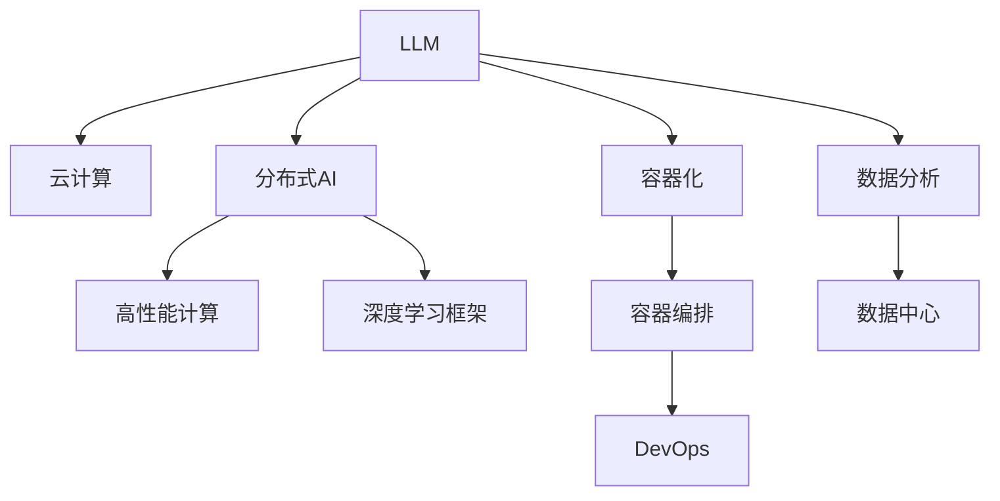

                 

# LLM与云计算：分布式AI的新时代

> 关键词：大语言模型,云计算,分布式AI,深度学习,高性能计算,数据中心,超算集群,容器化,Kubernetes,DevOps,深度学习框架,微服务,弹性伸缩

## 1. 背景介绍

### 1.1 问题由来

随着人工智能技术的快速发展，大语言模型(LLM)在自然语言处理(NLP)领域取得了显著进展。大规模预训练的语言模型如BERT、GPT-3等，已经在多项NLP任务上超越了人类的表现。然而，这些模型通常以巨大的计算资源和标注数据为基础，需要在大规模分布式计算集群上进行训练和推理，这对计算资源的依赖非常高。

云计算技术的兴起，为LLM提供了理想的计算环境。借助云计算平台，用户可以以更加灵活、高效的方式，利用高性能计算资源进行深度学习模型的训练和推理。云计算平台不仅提供了强大的计算能力，还通过分布式存储和网络传输，显著提升了数据处理和传输的效率。

云计算技术的成熟，使得LLM能够更加广泛地应用于各个领域，从NLP、计算机视觉、语音识别，到医疗、金融、教育等，LLM正成为AI技术发展的重要驱动力。本文将从核心概念、算法原理、实践应用、工具推荐等多个方面，全面探讨LLM与云计算结合的分布式AI新时代。

## 2. 核心概念与联系

### 2.1 核心概念概述

为更好地理解LLM与云计算的结合，本节将介绍几个关键概念：

- 大语言模型(LLM)：以自回归模型如GPT、自编码模型如BERT为代表的大规模预训练语言模型。通过在大规模无标签文本语料上进行预训练，学习通用的语言表示，具备强大的语言理解和生成能力。

- 云计算：通过互联网向用户提供可计量的、按需的网络计算服务，包括计算、存储、网络、软件等资源。云计算平台如AWS、Azure、阿里云等，提供了强大的计算资源和数据中心基础设施，支持大规模深度学习模型的训练和推理。

- 分布式AI：通过在多台计算设备上进行并行计算，提升AI模型的训练和推理速度，提高计算资源的利用效率。分布式AI技术在大规模深度学习模型的训练、推理和优化中得到了广泛应用。

- 高性能计算(HPC)：指在处理大规模计算任务时，使用高性能计算机集群，提供强大的计算能力和存储能力。HPC技术在大规模深度学习模型的训练中扮演了重要角色。

- 深度学习框架：如TensorFlow、PyTorch等，提供丰富的API和工具，支持深度学习模型的开发、训练和推理。

- 容器化与容器编排：通过将应用程序及其依赖打包到容器中，使用容器编排工具如Kubernetes，提升应用程序的部署和管理效率，实现自动化的弹性伸缩。

- DevOps：涵盖软件开发和运维的跨学科文化、实践、工具和资源，旨在实现从开发到运维的端到端自动化和持续集成(CI)、持续部署(CD)。

这些概念之间的关系可以通过以下Mermaid流程图来展示：



这个流程图展示了LLM与云计算之间的联系，以及分布式AI、高性能计算、深度学习框架、容器化与容器编排、DevOps等概念，它们共同构成了LLM在大规模计算环境下的应用框架。

## 3. 核心算法原理 & 具体操作步骤

### 3.1 算法原理概述

LLM与云计算的结合，核心在于分布式AI技术和大规模深度学习模型的训练与推理。其核心思想是：将LLM模型部署在分布式计算集群中，通过多台计算机的并行计算，加速模型的训练和推理过程，同时实现计算资源的灵活分配和高效利用。

形式化地，假设LLM模型为 $M_{\theta}$，其中 $\theta$ 为模型参数。云计算平台提供的计算资源为 $C$。分布式AI算法将模型 $M_{\theta}$ 分布到多台计算机上，每台计算机负责计算模型的一部分，通过并行计算加速模型的训练和推理。

具体步骤包括：

1. 数据准备：将数据集 $D=\{(x_i,y_i)\}_{i=1}^N$ 划分为训练集、验证集和测试集。
2. 模型部署：在云计算平台上部署LLM模型，选择适合的计算资源 $C$。
3. 分布式训练：将模型 $M_{\theta}$ 分布到多台计算机上，每台计算机负责计算模型的一部分。
4. 梯度更新：每台计算机计算梯度，并将梯度汇总后更新模型参数 $\theta$。
5. 参数优化：通过梯度下降等优化算法更新模型参数。
6. 性能评估：在验证集上评估模型性能，决定是否调整超参数。
7. 模型推理：在测试集上对新样本进行推理，输出预测结果。

### 3.2 算法步骤详解

基于上述原理，以下将详细讲解LLM在云计算平台上进行分布式训练和推理的具体步骤。

**Step 1: 准备数据集**

首先需要准备适合LLM模型的数据集。数据集应包括训练集、验证集和测试集，一般要求数据分布与预训练数据保持一致。例如，在NLP任务中，可以使用公开的语料库，如维基百科、新闻报道、网页文本等。

**Step 2: 选择计算资源**

选择适合的计算资源是分布式AI训练的基础。云计算平台通常提供各种类型的计算资源，包括GPU、TPU、FPGA等。根据任务的特点和计算需求，选择合适的计算资源进行部署。

**Step 3: 模型部署**

在计算资源上部署LLM模型。一般使用深度学习框架如TensorFlow、PyTorch等，将模型定义和配置文件上传至云计算平台，并指定计算资源。例如，使用AWS SageMaker等平台，可以直接创建计算实例，一键启动深度学习训练作业。

**Step 4: 分布式训练**

在多台计算机上并行计算模型，每台计算机负责计算模型的一部分。可以使用深度学习框架提供的分布式训练API，自动分配任务、计算梯度和更新参数。例如，TensorFlow的分布式训练API `tf.distribute.Strategy`，可以方便地在多个GPU或TPU上并行计算。

**Step 5: 梯度更新**

每台计算机计算梯度，并将梯度汇总后更新模型参数。可以使用框架提供的分布式优化器，自动汇总梯度和更新参数。例如，TensorFlow的分布式优化器 `tf.distribute.Strategy` 提供了多种优化算法，支持分布式梯度计算和参数更新。

**Step 6: 参数优化**

通过梯度下降等优化算法更新模型参数。在云计算平台上，可以使用多种优化器如Adam、SGD等，同时应用正则化技术如L2正则、Dropout等，防止过拟合。例如，使用PyTorch的优化器 `torch.optim.Adam`，可以方便地在多台计算机上并行优化模型参数。

**Step 7: 性能评估**

在验证集上评估模型性能，决定是否调整超参数。一般使用交叉验证或早期停止等技术，评估模型在验证集上的表现。例如，使用TensorFlow的`tf.keras.callbacks.EarlyStopping`，可以在验证集性能下降时提前停止训练。

**Step 8: 模型推理**

在测试集上对新样本进行推理，输出预测结果。可以使用框架提供的推理API，自动加载模型并推理预测。例如，使用TensorFlow的`tf.keras.models.load_model`，可以方便地加载模型并推理预测。

### 3.3 算法优缺点

LLM在云计算平台上的分布式AI训练具有以下优点：

1. 高效计算：通过多台计算机的并行计算，显著提升模型的训练和推理速度，加速模型收敛。
2. 灵活资源：计算资源可以根据需求灵活分配，实现弹性伸缩，避免资源浪费。
3. 高可靠性：云计算平台提供冗余备份和故障恢复机制，保障系统的稳定性和高可靠性。
4. 低成本：利用云计算平台的按需付费模式，按需使用计算资源，降低资源使用成本。

同时，分布式AI训练也存在以下局限：

1. 通信开销：多台计算机间的通信开销较大，可能影响整体训练速度。
2. 同步问题：多台计算机间的数据同步和参数更新可能导致性能下降。
3. 资源管理：计算资源的管理和调度复杂，需要额外维护和监控。

尽管存在这些挑战，但大语言模型在云计算平台上的分布式AI训练，已经展现出巨大的潜力，为深度学习模型的规模化应用提供了可能。

### 3.4 算法应用领域

LLM与云计算的结合，已经在众多领域得到了广泛应用，例如：

- 自然语言处理(NLP)：如文本分类、情感分析、机器翻译、问答系统等。
- 计算机视觉(CV)：如图像分类、目标检测、图像生成等。
- 语音识别：如语音转文本、说话人识别、语音合成等。
- 医疗：如医学影像诊断、病理分析、药物发现等。
- 金融：如信用评分、风险评估、欺诈检测等。
- 教育：如智能辅导、语言学习、个性化推荐等。
- 自动驾驶：如车辆导航、物体识别、道路异常检测等。
- 工业制造：如质量检测、设备维护、异常预测等。

除了上述这些经典任务外，LLM与云计算的结合还在不断拓展新的应用场景，为各行各业带来智能化转型升级的新契机。

## 4. 数学模型和公式 & 详细讲解 & 举例说明

### 4.1 数学模型构建

以下我们将使用数学语言对LLM在云计算平台上的分布式AI训练过程进行更加严格的刻画。

记LLM模型为 $M_{\theta}$，其中 $\theta$ 为模型参数。云计算平台提供的计算资源为 $C$，包含 $m$ 台计算节点。假设每台计算节点分配的计算资源为 $c_i$，则总计算资源为 $C=\sum_{i=1}^m c_i$。

定义模型 $M_{\theta}$ 在数据样本 $(x,y)$ 上的损失函数为 $\ell(M_{\theta}(x),y)$，则在数据集 $D$ 上的经验风险为：

$$
\mathcal{L}(\theta) = \frac{1}{N} \sum_{i=1}^N \ell(M_{\theta}(x_i),y_i)
$$

分布式AI算法将模型 $M_{\theta}$ 分布到多台计算节点上，每台计算节点负责计算模型的一部分。假设每台计算节点分配到的计算资源为 $c_i$，则每台计算节点上模型的参数为 $\theta_i = \theta / m$。

在分布式训练过程中，每台计算节点对样本 $(x_i,y_i)$ 进行计算，计算梯度 $\partial_{\theta_i}\mathcal{L}(\theta_i)$。由于每台计算节点负责计算模型的一部分，因此需要将其计算结果汇总后更新模型参数。假设每台计算节点上模型的参数更新步长为 $\eta_i$，则参数更新的公式为：

$$
\theta_i \leftarrow \theta_i - \eta_i \partial_{\theta_i}\mathcal{L}(\theta_i)
$$

汇总所有计算节点的梯度，得到总梯度 $\partial_{\theta}\mathcal{L}(\theta)$。根据每台计算节点上计算资源的比例，分配总梯度 $\partial_{\theta}\mathcal{L}(\theta)$ 到每台计算节点上。具体而言，每台计算节点上更新参数的公式为：

$$
\theta_i \leftarrow \theta_i - \eta_i \partial_{\theta_i}\mathcal{L}(\theta)
$$

其中，$\eta_i = c_i / C$ 为每台计算节点上的学习率。

在参数更新过程中，需要注意以下两点：

1. 每台计算节点上使用相同的参数更新公式，确保参数更新的一致性。
2. 每台计算节点上分配到的计算资源不同，需要根据计算资源的比例分配总梯度，避免资源浪费。

### 4.2 公式推导过程

以下我们将对上述参数更新公式进行详细推导。

首先，考虑一台计算节点上对样本 $(x_i,y_i)$ 的损失函数计算和梯度更新过程。假设模型 $M_{\theta}$ 在输入 $x$ 上的输出为 $\hat{y}=M_{\theta}(x)$，真实标签为 $y$，则单台计算节点上的损失函数为：

$$
\ell_i(M_{\theta}(x_i),y_i) = \ell(M_{\theta_i}(x_i),y_i)
$$

其中，$\theta_i = \theta / m$ 为单台计算节点上的模型参数。根据链式法则，单台计算节点上的梯度为：

$$
\partial_{\theta_i}\mathcal{L}(\theta_i) = \frac{\partial \mathcal{L}(\theta_i)}{\partial \theta_i}
$$

将单台计算节点上的梯度汇总后，得到总梯度 $\partial_{\theta}\mathcal{L}(\theta)$。根据每台计算节点上计算资源的比例，分配总梯度 $\partial_{\theta}\mathcal{L}(\theta)$ 到每台计算节点上。假设每台计算节点上分配到的计算资源为 $c_i$，则每台计算节点上更新参数的公式为：

$$
\theta_i \leftarrow \theta_i - \eta_i \partial_{\theta_i}\mathcal{L}(\theta)
$$

其中，$\eta_i = c_i / C$ 为每台计算节点上的学习率。将上述公式代入单台计算节点上的梯度公式，得到单台计算节点上的梯度更新公式：

$$
\partial_{\theta_i}\mathcal{L}(\theta_i) = -\frac{1}{N} \sum_{i=1}^N [y_i\log M_{\theta_i}(x_i)+(1-y_i)\log(1-M_{\theta_i}(x_i))]
$$

将单台计算节点上的梯度汇总后，得到总梯度 $\partial_{\theta}\mathcal{L}(\theta)$。根据每台计算节点上计算资源的比例，分配总梯度 $\partial_{\theta}\mathcal{L}(\theta)$ 到每台计算节点上。假设每台计算节点上分配到的计算资源为 $c_i$，则每台计算节点上更新参数的公式为：

$$
\theta_i \leftarrow \theta_i - \eta_i \partial_{\theta_i}\mathcal{L}(\theta)
$$

其中，$\eta_i = c_i / C$ 为每台计算节点上的学习率。将上述公式代入总梯度公式，得到总梯度更新公式：

$$
\partial_{\theta}\mathcal{L}(\theta) = -\frac{1}{N}\sum_{i=1}^N [y_i\log M_{\theta}(x_i)+(1-y_i)\log(1-M_{\theta}(x_i))]
$$

将上述总梯度分配到每台计算节点上，更新模型参数 $\theta_i$。具体而言，每台计算节点上更新参数的公式为：

$$
\theta_i \leftarrow \theta_i - \eta_i \partial_{\theta_i}\mathcal{L}(\theta)
$$

其中，$\eta_i = c_i / C$ 为每台计算节点上的学习率。将上述公式代入总梯度更新公式，得到每台计算节点上的梯度更新公式：

$$
\partial_{\theta_i}\mathcal{L}(\theta_i) = -\frac{1}{N} \sum_{i=1}^N [y_i\log M_{\theta_i}(x_i)+(1-y_i)\log(1-M_{\theta_i}(x_i))]
$$

在参数更新过程中，每台计算节点上使用相同的参数更新公式，确保参数更新的一致性。每台计算节点上分配到的计算资源不同，需要根据计算资源的比例分配总梯度，避免资源浪费。

## 5. 项目实践：代码实例和详细解释说明

### 5.1 开发环境搭建

在进行分布式AI训练实践前，我们需要准备好开发环境。以下是使用Python进行TensorFlow进行分布式训练的环境配置流程：

1. 安装Anaconda：从官网下载并安装Anaconda，用于创建独立的Python环境。

2. 创建并激活虚拟环境：
```bash
conda create -n tf-env python=3.8 
conda activate tf-env
```

3. 安装TensorFlow：根据CUDA版本，从官网获取对应的安装命令。例如：
```bash
pip install tensorflow==2.8.0
```

4. 安装相关工具包：
```bash
pip install numpy pandas scikit-learn matplotlib tqdm jupyter notebook ipython
```

完成上述步骤后，即可在`tf-env`环境中开始分布式AI训练实践。

### 5.2 源代码详细实现

下面我们以BERT模型在云计算平台上的分布式训练为例，给出使用TensorFlow进行分布式训练的PyTorch代码实现。

首先，定义数据处理函数：

```python
import tensorflow as tf
from transformers import BertTokenizer
from tf.keras.preprocessing import sequence

tokenizer = BertTokenizer.from_pretrained('bert-base-cased')

def load_dataset(path):
    with open(path, 'r', encoding='utf-8') as f:
        lines = f.readlines()
        sentences = [line.strip() for line in lines]
    return tokenizer(sentences, padding='max_length', max_length=256, truncation=True)

train_data = load_dataset('train.txt')
val_data = load_dataset('val.txt')
test_data = load_dataset('test.txt')
```

然后，定义模型和优化器：

```python
from transformers import BertForTokenClassification

model = BertForTokenClassification.from_pretrained('bert-base-cased', num_labels=10)

optimizer = tf.keras.optimizers.Adam(learning_rate=2e-5)
```

接着，定义分布式训练函数：

```python
import tensorflow.distribute as tf_dist

with tf_dist.MirroredStrategy() as strategy:
    with strategy.scope():
        model = tf.keras.models.clone_model(model)
        model.compile(optimizer=optimizer, loss='sparse_categorical_crossentropy', metrics=['accuracy'])
        model.fit(train_data, epochs=5, validation_data=val_data, batch_size=32)
```

最后，启动分布式训练流程：

```python
import tensorflow.distribute as tf_dist

with tf_dist.MirroredStrategy() as strategy:
    with strategy.scope():
        model = tf.keras.models.clone_model(model)
        model.compile(optimizer=optimizer, loss='sparse_categorical_crossentropy', metrics=['accuracy'])
        model.fit(train_data, epochs=5, validation_data=val_data, batch_size=32)
```

以上就是使用TensorFlow进行BERT模型分布式训练的完整代码实现。可以看到，得益于TensorFlow的分布式策略，我们可以在多台计算节点上并行计算模型，同时利用Keras API进行模型的定义和训练。

### 5.3 代码解读与分析

让我们再详细解读一下关键代码的实现细节：

**load_dataset函数**：
- 从文本文件中加载数据，并进行分词处理和padding。

**BertForTokenClassification模型**：
- 定义BERT模型作为分类任务，num_labels参数指定标签数。

**optimizer**：
- 定义Adam优化器，学习率为2e-5。

**MirroredStrategy**：
- 使用MirroredStrategy策略，在多个计算节点上并行计算模型。

**fit函数**：
- 在训练数据集上进行多轮迭代训练，在验证数据集上进行评估。

可以看到，TensorFlow提供了强大的分布式计算支持，可以方便地在多台计算节点上进行模型训练。开发者可以根据具体任务的特点，灵活配置计算节点、优化器、超参数等关键参数，进一步优化模型的训练效果。

当然，工业级的系统实现还需考虑更多因素，如模型的保存和部署、超参数的自动搜索、更灵活的任务适配层等。但核心的分布式AI训练范式基本与此类似。

## 6. 实际应用场景

### 6.1 智能客服系统

基于大语言模型与云计算结合的分布式AI技术，智能客服系统可以大放异彩。传统的客服系统依赖大量人力，高峰期响应缓慢，且一致性和专业性难以保证。而使用分布式AI训练的客服系统，可以7x24小时不间断服务，快速响应客户咨询，用自然流畅的语言解答各类常见问题。

在技术实现上，可以收集企业内部的历史客服对话记录，将问题和最佳答复构建成监督数据，在此基础上对预训练客服模型进行分布式微调。微调后的客服模型能够自动理解用户意图，匹配最合适的答案模板进行回复。对于客户提出的新问题，还可以接入检索系统实时搜索相关内容，动态组织生成回答。如此构建的智能客服系统，能大幅提升客户咨询体验和问题解决效率。

### 6.2 金融舆情监测

金融机构需要实时监测市场舆论动向，以便及时应对负面信息传播，规避金融风险。传统的人工监测方式成本高、效率低，难以应对网络时代海量信息爆发的挑战。基于分布式AI训练的文本分类和情感分析技术，为金融舆情监测提供了新的解决方案。

具体而言，可以收集金融领域相关的新闻、报道、评论等文本数据，并对其进行主题标注和情感标注。在此基础上对预训练语言模型进行分布式微调，使其能够自动判断文本属于何种主题，情感倾向是正面、中性还是负面。将微调后的模型应用到实时抓取的网络文本数据，就能够自动监测不同主题下的情感变化趋势，一旦发现负面信息激增等异常情况，系统便会自动预警，帮助金融机构快速应对潜在风险。

### 6.3 个性化推荐系统

当前的推荐系统往往只依赖用户的历史行为数据进行物品推荐，无法深入理解用户的真实兴趣偏好。基于分布式AI训练的个性化推荐系统可以更好地挖掘用户行为背后的语义信息，从而提供更精准、多样的推荐内容。

在实践中，可以收集用户浏览、点击、评论、分享等行为数据，提取和用户交互的物品标题、描述、标签等文本内容。将文本内容作为模型输入，用户的后续行为（如是否点击、购买等）作为监督信号，在此基础上分布式微调预训练语言模型。微调后的模型能够从文本内容中准确把握用户的兴趣点。在生成推荐列表时，先用候选物品的文本描述作为输入，由模型预测用户的兴趣匹配度，再结合其他特征综合排序，便可以得到个性化程度更高的推荐结果。

### 6.4 未来应用展望

随着大语言模型与云计算结合的分布式AI技术的发展，未来的应用场景将更加广泛。

在智慧医疗领域，基于分布式AI训练的医疗问答、病历分析、药物研发等应用将提升医疗服务的智能化水平，辅助医生诊疗，加速新药开发进程。

在智能教育领域，分布式AI训练的智能辅导、语言学习、个性化推荐等技术，因材施教，促进教育公平，提高教学质量。

在智慧城市治理中，分布式AI训练的城市事件监测、舆情分析、应急指挥等环节，提高城市管理的自动化和智能化水平，构建更安全、高效的未来城市。

此外，在企业生产、社会治理、文娱传媒等众多领域，基于大语言模型与云计算结合的分布式AI技术的应用也将不断涌现，为传统行业数字化转型升级提供新的技术路径。相信随着技术的日益成熟，分布式AI技术将成为人工智能落地应用的重要范式，推动人工智能向更广阔的领域加速渗透。

## 7. 工具和资源推荐
### 7.1 学习资源推荐

为了帮助开发者系统掌握大语言模型与云计算结合的分布式AI理论基础和实践技巧，这里推荐一些优质的学习资源：

1. 《分布式深度学习》系列博文：由大模型技术专家撰写，深入浅出地介绍了分布式深度学习的基本概念、经典算法和实际应用。

2. CS480《分布式系统》课程：斯坦福大学开设的分布式系统经典课程，涵盖分布式系统的设计、实现和应用，是理解分布式AI的基础。

3. 《分布式深度学习与高性能计算》书籍：全面介绍了分布式深度学习的基本原理、框架和实现方法，包括云计算平台的应用。

4. HuggingFace官方文档：提供了丰富的预训练语言模型和分布式AI训练样例，是上手实践的必备资料。

5. TensorFlow分布式AI工具包：提供了强大的分布式计算支持，支持多机多节点并行计算。

6. PyTorch分布式训练教程：提供了丰富的分布式训练API和样例，方便开发者进行分布式AI训练。

通过这些资源的学习实践，相信你一定能够快速掌握分布式AI训练的精髓，并用于解决实际的AI问题。

### 7.2 开发工具推荐

高效的开发离不开优秀的工具支持。以下是几款用于大语言模型与云计算结合的分布式AI开发常用的工具：

1. TensorFlow：基于Python的开源深度学习框架，支持分布式计算，适合大规模工程应用。

2. PyTorch：基于Python的开源深度学习框架，灵活动态的计算图，适合快速迭代研究。

3. Keras：高层次的深度学习API，易于上手，支持分布式计算。

4. TensorFlow分布式策略：提供了强大的分布式计算支持，方便在多台计算节点上并行计算。

5. PyTorch分布式数据并行(DDP)：提供了分布式数据并行API，支持多节点并行计算。

6. 深度学习集群管理工具：如Kubernetes、Hadoop等，方便管理、调度计算资源。

合理利用这些工具，可以显著提升分布式AI训练的开发效率，加快创新迭代的步伐。

### 7.3 相关论文推荐

大语言模型与云计算结合的分布式AI发展源于学界的持续研究。以下是几篇奠基性的相关论文，推荐阅读：

1. DeepSpeed: Easy, Portable, Flexible Distributed Deep Learning in TensorFlow, PyTorch and OneAPI：介绍了TensorFlow、PyTorch等深度学习框架的分布式训练工具包DeepSpeed，支持多机多节点并行计算。

2. Parameter-Server Algorithms for Distributed Training of Deep Learning Models：提出了基于参数服务器的分布式深度学习训练算法，支持多机多节点并行计算。

3. Model Parallelism with Automatic Sharding and Communication：介绍了多节点分布式深度学习训练的模型并行算法，支持多节点并行计算。

4. The Google BERT Model：介绍了谷歌BERT模型的分布式训练方法，支持多机多节点并行计算。

5. TensorFlow with Keras：介绍了TensorFlow与Keras的结合，支持多机多节点并行计算。

这些论文代表了大语言模型与云计算结合的分布式AI的发展脉络。通过学习这些前沿成果，可以帮助研究者把握学科前进方向，激发更多的创新灵感。

## 8. 总结：未来发展趋势与挑战

### 8.1 总结

本文对基于云计算的分布式AI训练进行了全面系统的介绍。首先阐述了LLM与云计算结合的分布式AI训练的理论基础和实践技巧，明确了分布式AI训练在深度学习模型训练和推理中的重要价值。其次，从原理到实践，详细讲解了分布式AI训练的数学模型和算法步骤，给出了分布式AI训练任务开发的完整代码实例。同时，本文还广泛探讨了分布式AI训练在智能客服、金融舆情、个性化推荐等多个行业领域的应用前景，展示了分布式AI训练的巨大潜力。此外，本文精选了分布式AI训练的学习资源，力求为读者提供全方位的技术指引。

通过本文的系统梳理，可以看到，基于云计算的分布式AI训练方法正在成为深度学习模型训练的重要范式，极大地拓展了深度学习模型的应用边界，催生了更多的落地场景。受益于云计算平台提供的强大计算资源，分布式AI训练使得深度学习模型的训练和推理更加高效、可靠，满足了更多领域对深度学习模型的需求。未来，伴随深度学习模型的持续演进和云计算技术的不断发展，相信分布式AI训练将迎来更大的突破，为深度学习技术在各行业的广泛应用提供更加坚实的基础。

### 8.2 未来发展趋势

展望未来，分布式AI训练技术将呈现以下几个发展趋势：

1. 超大规模模型：随着计算资源的不断增长，超大规模模型将进一步扩展深度学习模型的规模，提升模型的语言理解和生成能力。

2. 分布式训练框架的完善：分布式训练框架将更加成熟和易用，支持更多种类的分布式计算模式，如模型并行、数据并行、混合并行等。

3. 弹性计算资源管理：云计算平台将提供更灵活的资源管理工具，支持更高效的资源分配和调度，提升计算资源的利用效率。

4. 自动化的调参优化：分布式AI训练将更加注重自动化的超参数调优和模型优化，减少人工干预，提高模型训练的自动化程度。

5. 分布式训练的协同优化：分布式训练将更加注重各节点间的协同优化，避免通信开销，提升训练速度。

6. 跨平台支持：分布式AI训练将更加注重跨平台支持，支持更多种类的硬件设备和操作系统。

以上趋势凸显了分布式AI训练技术的广阔前景。这些方向的探索发展，必将进一步提升深度学习模型的训练速度和性能，为深度学习技术在各行业的广泛应用提供更加坚实的基础。

### 8.3 面临的挑战

尽管分布式AI训练技术已经取得了瞩目成就，但在迈向更加智能化、普适化应用的过程中，它仍面临着诸多挑战：

1. 通信开销：多台计算节点间的通信开销较大，可能影响整体训练速度。

2. 同步问题：多台计算节点间的数据同步和参数更新可能导致性能下降。

3. 资源管理：计算资源的管理和调度复杂，需要额外维护和监控。

4. 计算成本：分布式训练需要大量的计算资源，计算成本较高。

5. 模型可解释性：分布式AI训练的模型往往具有黑盒特性，难以解释其内部工作机制和决策逻辑。

6. 鲁棒性：分布式AI训练的模型面临域外数据的泛化性能挑战。

尽管存在这些挑战，但分布式AI训练技术在大规模深度学习模型训练和推理中的应用已经取得了显著进展，为深度学习模型的规模化应用提供了可能。未来，随着技术的不断成熟和优化，这些挑战终将一一被克服，分布式AI训练必将在深度学习模型训练中扮演更加重要的角色。

### 8.4 研究展望

面对分布式AI训练所面临的种种挑战，未来的研究需要在以下几个方面寻求新的突破：

1. 优化通信开销：采用更加高效的数据传输和通信协议，减少计算节点间的通信开销，提升训练速度。

2. 解决同步问题：采用更加高效的数据同步和参数更新算法，减少计算节点间的同步开销，提升训练效率。

3. 自动化资源管理：开发更加智能化的资源管理工具，根据任务需求动态调整计算资源，提升资源利用效率。

4. 降低计算成本：开发更加高效的模型优化和训练算法，减少计算资源的使用量，降低计算成本。

5. 增强模型可解释性：开发更加可解释的深度学习模型，增强模型的透明度和可解释性。

6. 提高模型鲁棒性：开发更加鲁棒的深度学习模型，提升模型在域外数据的泛化能力。

这些研究方向将推动分布式AI训练技术的进一步发展，为深度学习模型在各行业的广泛应用提供更加坚实的技术基础。面向未来，分布式AI训练技术还需要与其他人工智能技术进行更深入的融合，如知识表示、因果推理、强化学习等，多路径协同发力，共同推动人工智能技术的进步。只有勇于创新、敢于突破，才能不断拓展深度学习模型的边界，让智能技术更好地造福人类社会。

## 9. 附录：常见问题与解答

**Q1：分布式AI训练是否适用于所有深度学习模型？**

A: 分布式AI训练适用于各类深度学习模型，尤其是大规模的深度学习模型。但对于一些简单的模型，由于计算量较小，分布式训练可能反而降低效率。

**Q2：分布式AI训练时如何选择合适的计算资源？**

A: 选择适合的计算资源是分布式AI训练的基础。一般根据任务的复杂度和计算需求，选择合适的计算资源进行部署。例如，对于大规模图像识别任务，可以选择带有GPU或TPU的计算节点。

**Q3：分布式AI训练中如何避免通信开销？**

A: 通信开销是分布式AI训练的主要瓶颈之一。一般采用更加高效的数据传输和通信协议，减少计算节点间的通信开销，提升训练速度。例如，使用Gloo等通信库，支持跨进程通信。

**Q4：分布式AI训练中如何解决同步问题？**

A: 同步问题是分布式AI训练的主要挑战之一。一般采用更加高效的数据同步和参数更新算法，减少计算节点间的同步开销，提升训练效率。例如，使用参数服务器、多线程并发等技术，优化数据同步和参数更新。

**Q5：分布式AI训练的计算成本是否较高？**

A: 分布式AI训练需要大量的计算资源，计算成本较高。一般采用更加高效的模型优化和训练算法，减少计算资源的使用量，降低计算成本。例如，使用稀疏化存储、分布式优化器等技术，优化计算效率。

**Q6：分布式AI训练的模型可解释性不足，如何改进？**

A: 分布式AI训练的模型往往具有黑盒特性，难以解释其内部工作机制和决策逻辑。一般采用更加可解释的深度学习模型，增强模型的透明度和可解释性。例如，使用因果推理、知识图谱等技术，增强模型的可解释性。

**Q7：分布式AI训练的模型鲁棒性不足，如何提升？**

A: 分布式AI训练的模型面临域外数据的泛化性能挑战。一般采用更加鲁棒的深度学习模型，提升模型在域外数据的泛化能力。例如，使用迁移学习、对抗训练等技术，提升模型的鲁棒性。

通过本文的系统梳理，可以看到，基于云计算的分布式AI训练方法正在成为深度学习模型训练的重要范式，极大地拓展了深度学习模型的应用边界，催生了更多的落地场景。受益于云计算平台提供的强大计算资源，分布式AI训练使得深度学习模型的训练和推理更加高效、可靠，满足了更多领域对深度学习模型的需求。未来，伴随深度学习模型的持续演进和云计算技术的不断发展，相信分布式AI训练将迎来更大的突破，为深度学习技术在各行业的广泛应用提供更加坚实的基础。

